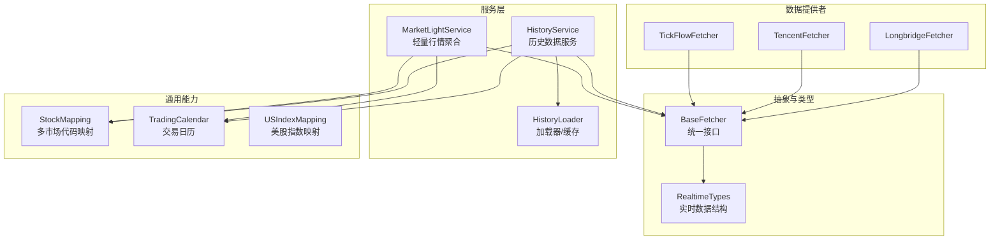
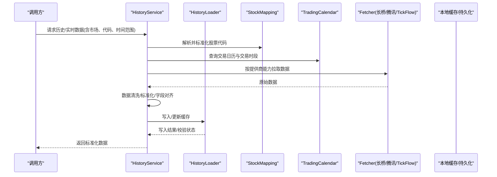
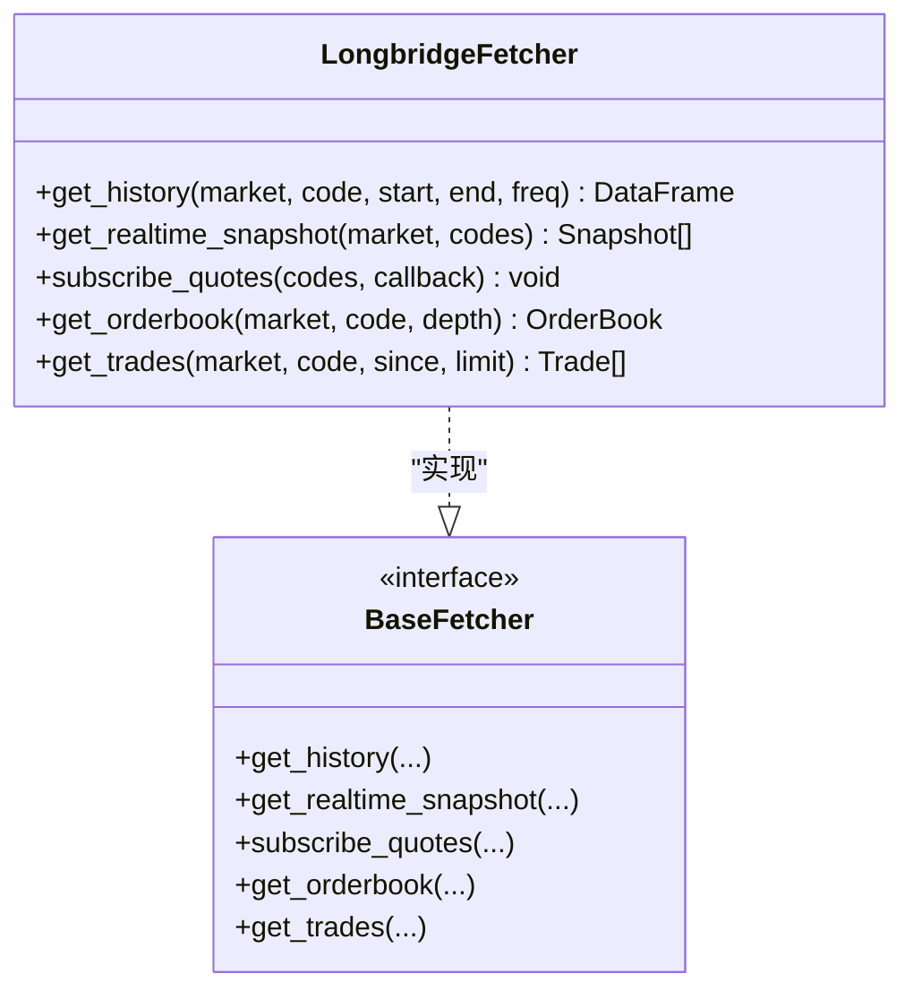
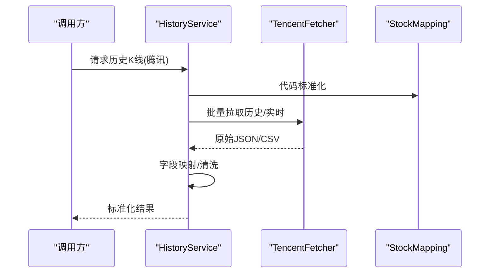
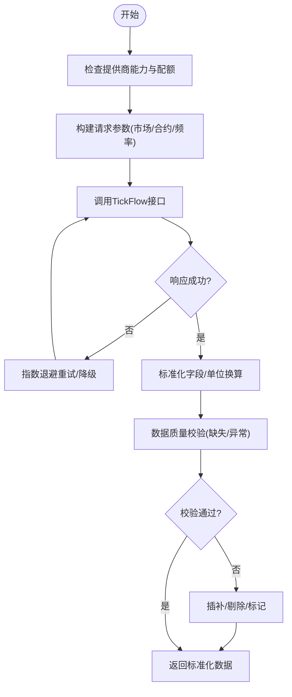
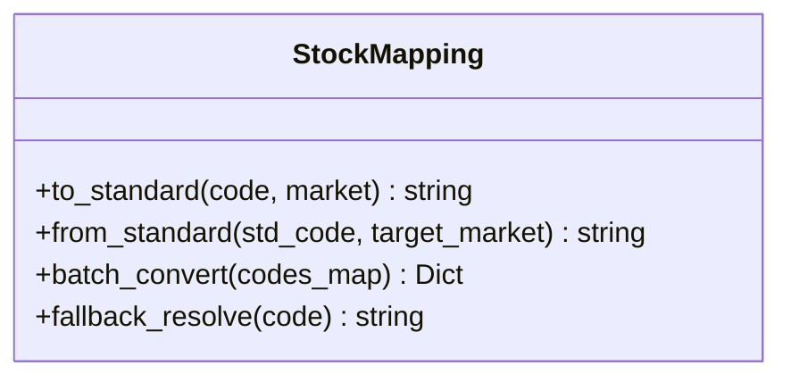
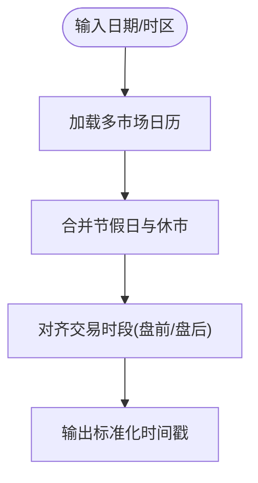
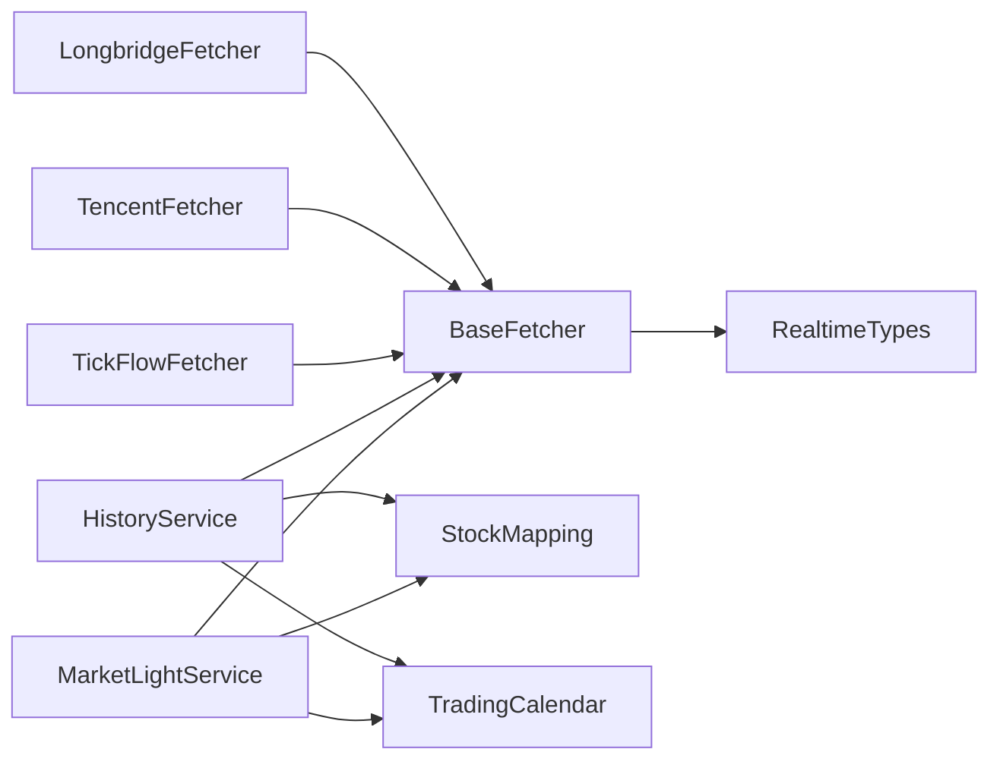

# 国际市场数据源

<cite>
**本文引用的文件**   
- [longbridge_fetcher.py](file://data_provider/longbridge_fetcher.py)
- [tencent_fetcher.py](file://data_provider/tencent_fetcher.py)
- [tickflow_fetcher.py](file://data_provider/tickflow_fetcher.py)
- [base.py](file://data_provider/base.py)
- [realtime_types.py](file://data_provider/realtime_types.py)
- [us_index_mapping.py](file://data_provider/us_index_mapping.py)
- [stock_mapping.py](file://src/data/stock_mapping.py)
- [trading_calendar.py](file://src/core/trading_calendar.py)
- [history_service.py](file://src/services/history_service.py)
- [history_loader.py](file://src/services/history_loader.py)
- [market_light_service.py](file://src/services/market_light_service.py)
- [test_longbridge_fetcher.py](file://tests/test_longbridge_fetcher.py)
- [test_tencent_fetcher.py](file://tests/test_tencent_fetcher.py)
- [test_tickflow_fetcher.py](file://tests/test_tickflow_fetcher.py)
</cite>

## 目录
1. [简介](#简介)
2. [项目结构](#项目结构)
3. [核心组件](#核心组件)
4. [架构总览](#架构总览)
5. [详细组件分析](#详细组件分析)
6. [依赖关系分析](#依赖关系分析)
7. [性能考虑](#性能考虑)
8. [故障排查指南](#故障排查指南)
9. [结论](#结论)
10. [附录](#附录)

## 简介
本文件面向国际市场数据源的集成与使用，覆盖港股、美股、期货等全球市场金融数据的获取与处理。重点说明 Longbridge、腾讯财经、TickFlow 等数据提供商的接入方式，并给出多市场股票代码映射、汇率转换、交易日历处理等关键特性的实现要点。同时提供跨境数据传输优化、数据一致性保证和异常处理的实践指南，帮助读者在复杂跨市场环境下稳定地获取高质量数据。

## 项目结构
本项目将数据获取能力抽象为统一的 Fetcher 接口，并通过具体实现对接不同数据提供商（如 Longbridge、腾讯财经、TickFlow）。历史数据服务层负责调度、缓存、重试与一致性校验；交易日历与代码映射模块提供跨市场时间与时序对齐能力。

图表来源
- [base.py](file://data_provider/base.py)
- [longbridge_fetcher.py](file://data_provider/longbridge_fetcher.py)
- [tencent_fetcher.py](file://data_provider/tencent_fetcher.py)
- [tickflow_fetcher.py](file://data_provider/tickflow_fetcher.py)
- [realtime_types.py](file://data_provider/realtime_types.py)
- [history_service.py](file://src/services/history_service.py)
- [history_loader.py](file://src/services/history_loader.py)
- [market_light_service.py](file://src/services/market_light_service.py)
- [stock_mapping.py](file://src/data/stock_mapping.py)
- [trading_calendar.py](file://src/core/trading_calendar.py)
- [us_index_mapping.py](file://data_provider/us_index_mapping.py)

章节来源
- [base.py](file://data_provider/base.py)
- [history_service.py](file://src/services/history_service.py)
- [history_loader.py](file://src/services/history_loader.py)
- [market_light_service.py](file://src/services/market_light_service.py)
- [stock_mapping.py](file://src/data/stock_mapping.py)
- [trading_calendar.py](file://src/core/trading_calendar.py)
- [us_index_mapping.py](file://data_provider/us_index_mapping.py)

## 核心组件
- BaseFetcher：定义统一的数据获取接口，包括历史K线、实时报价、盘口、成交明细等方法的签名与返回类型约定，屏蔽底层差异。
- RealtimeTypes：标准化各市场实时数据结构（如买卖盘、逐笔成交、快照），确保上层一致消费。
- HistoryService：编排历史数据拉取流程，包含并发控制、重试、去重、校验与缓存策略。
- HistoryLoader：负责本地缓存、增量更新、断点续传与数据完整性校验。
- MarketLightService：轻量级行情聚合，用于快速展示或告警场景，降低对重型接口的依赖。
- StockMapping：多市场股票代码映射（如 A/H/U 前缀、交易所后缀、Ticker 别名），支持批量转换与回退策略。
- TradingCalendar：跨市场交易日历，处理时区、节假日、盘前盘后时段对齐。
- USIndexMapping：美股指数与标的映射，辅助指数成分股与权重计算。

章节来源
- [base.py](file://data_provider/base.py)
- [realtime_types.py](file://data_provider/realtime_types.py)
- [history_service.py](file://src/services/history_service.py)
- [history_loader.py](file://src/services/history_loader.py)
- [market_light_service.py](file://src/services/market_light_service.py)
- [stock_mapping.py](file://src/data/stock_mapping.py)
- [trading_calendar.py](file://src/core/trading_calendar.py)
- [us_index_mapping.py](file://data_provider/us_index_mapping.py)

## 架构总览
下图展示了从调用方到数据提供者的端到端流程，涵盖请求路由、提供商选择、数据标准化、缓存与一致性校验。

图表来源
- [history_service.py](file://src/services/history_service.py)
- [history_loader.py](file://src/services/history_loader.py)
- [stock_mapping.py](file://src/data/stock_mapping.py)
- [trading_calendar.py](file://src/core/trading_calendar.py)
- [longbridge_fetcher.py](file://data_provider/longbridge_fetcher.py)
- [tencent_fetcher.py](file://data_provider/tencent_fetcher.py)
- [tickflow_fetcher.py](file://data_provider/tickflow_fetcher.py)

## 详细组件分析

### Longbridge 数据源集成
- 功能定位：港股、美股及衍生品（期货/期权）的历史与实时数据获取，支持订单簿与成交明细。
- 关键特性：
  - 多市场代码适配：自动识别 Longbridge 内部编码与外部标准码的映射。
  - 实时流式数据：通过 WebSocket 订阅实时报价与成交，减少轮询开销。
  - 容错与重试：网络抖动与限频时的指数退避与降级策略。
- 典型用法：
  - 历史K线：按日/分钟粒度拉取，支持复权与除息调整。
  - 实时快照：盘口五档/十档、最新价、成交量、涨跌停状态。
  - 成交明细：逐笔成交与委托队列，用于微观流动性分析。

图表来源
- [longbridge_fetcher.py](file://data_provider/longbridge_fetcher.py)
- [base.py](file://data_provider/base.py)

章节来源
- [longbridge_fetcher.py](file://data_provider/longbridge_fetcher.py)
- [test_longbridge_fetcher.py](file://tests/test_longbridge_fetcher.py)

### 腾讯财经数据源集成
- 功能定位：A股与部分港股的行情与基本面数据，适合低成本快速获取基础指标。
- 关键特性：
  - 批量接口：支持多只股票一次性拉取，提高吞吐。
  - 数据标准化：将腾讯字段映射到统一模型，便于下游消费。
  - 限频保护：基于响应码与延迟自适应退避。
- 典型用法：
  - 日线/分钟线历史数据。
  - 实时价格与涨跌幅。
  - 财务摘要与公告链接。

图表来源
- [tencent_fetcher.py](file://data_provider/tencent_fetcher.py)
- [history_service.py](file://src/services/history_service.py)
- [stock_mapping.py](file://src/data/stock_mapping.py)

章节来源
- [tencent_fetcher.py](file://data_provider/tencent_fetcher.py)
- [test_tencent_fetcher.py](file://tests/test_tencent_fetcher.py)

### TickFlow 数据源集成
- 功能定位：全球期货、外汇与加密货币的高频数据，适合量化与风控场景。
- 关键特性：
  - 高频推送：低延迟的逐笔与盘口更新。
  - 合约管理：自动维护合约到期、换月与乘数信息。
  - 质量校验：缺失值插补、异常值过滤、时序对齐。
- 典型用法：
  - 分钟/秒级K线与Tick数据。
  - 跨品种价差与相关性分析。
  - 实盘信号触发与执行监控。

图表来源
- [tickflow_fetcher.py](file://data_provider/tickflow_fetcher.py)

章节来源
- [tickflow_fetcher.py](file://data_provider/tickflow_fetcher.py)
- [test_tickflow_fetcher.py](file://tests/test_tickflow_fetcher.py)

### 多市场股票代码映射
- 目标：统一 A/H/U 等不同市场的代码表示，支持前缀、后缀、交易所标识与别名。
- 能力：
  - 双向映射：外部标准码与内部编码互转。
  - 批量转换：大批量代码转换的性能优化。
  - 回退策略：当某提供商不支持时，自动切换至备选映射表。
- 应用场景：
  - 跨市场组合分析与风险汇总。
  - 统一报表与可视化。
  - 策略回测中的标的归一化。

图表来源
- [stock_mapping.py](file://src/data/stock_mapping.py)

章节来源
- [stock_mapping.py](file://src/data/stock_mapping.py)

### 汇率转换与跨境数据处理
- 目标：将不同币种资产统一到基准货币，消除汇率波动对收益与风险的影响。
- 方法：
  - 汇率源：优先使用权威汇率接口（如央行或第三方），失败时回退到历史均值或最近交易日汇率。
  - 时点对齐：以交易日收盘汇率为准，避免盘中波动引入噪声。
  - 精度与舍入：统一小数位数与舍入规则，确保跨系统一致性。
- 注意事项：
  - 节假日与休市导致的汇率不可用问题需有回退策略。
  - 极端行情下的汇率跳空需进行异常检测与标记。

章节来源
- [history_service.py](file://src/services/history_service.py)
- [trading_calendar.py](file://src/core/trading_calendar.py)

### 交易日历处理
- 目标：对齐多市场交易时段，确保数据切片与事件驱动的一致性。
- 能力：
  - 多市场日历：合并主要交易所的节假日与特殊休市。
  - 时段划分：盘前、盘中、盘后的时间窗口定义。
  - 时区转换：统一 UTC 存储，展示时按需转换。
- 应用：
  - 历史回测的时间对齐。
  - 实时事件的触发与去抖。
  - 跨市场相关性计算的窗口对齐。

图表来源
- [trading_calendar.py](file://src/core/trading_calendar.py)

章节来源
- [trading_calendar.py](file://src/core/trading_calendar.py)

### 美股指数映射
- 目标：维护美股主要指数的成分股与权重，支撑指数跟踪与基准对比。
- 能力：
  - 成分股列表：定期更新指数成分股。
  - 权重计算：市值加权或自定义权重。
  - 变更追踪：记录调仓历史，支持回溯分析。

章节来源
- [us_index_mapping.py](file://data_provider/us_index_mapping.py)

## 依赖关系分析
数据提供者与上层服务之间的依赖关系如下：

图表来源
- [base.py](file://data_provider/base.py)
- [longbridge_fetcher.py](file://data_provider/longbridge_fetcher.py)
- [tencent_fetcher.py](file://data_provider/tencent_fetcher.py)
- [tickflow_fetcher.py](file://data_provider/tickflow_fetcher.py)
- [realtime_types.py](file://data_provider/realtime_types.py)
- [history_service.py](file://src/services/history_service.py)
- [market_light_service.py](file://src/services/market_light_service.py)
- [stock_mapping.py](file://src/data/stock_mapping.py)
- [trading_calendar.py](file://src/core/trading_calendar.py)

章节来源
- [base.py](file://data_provider/base.py)
- [history_service.py](file://src/services/history_service.py)
- [market_light_service.py](file://src/services/market_light_service.py)
- [stock_mapping.py](file://src/data/stock_mapping.py)
- [trading_calendar.py](file://src/core/trading_calendar.py)

## 性能考虑
- 并发与批处理：
  - 对批量接口采用分片并发，限制最大并发度以避免被限频。
  - 使用连接池与复用 HTTP/WebSocket 连接，减少握手开销。
- 缓存与增量更新：
  - 热点数据本地缓存，设置合理 TTL 与失效策略。
  - 增量拉取仅获取新增或变更片段，降低带宽与延迟。
- 数据压缩与传输优化：
  - 二进制协议（如 Protobuf）替代 JSON，减小体积。
  - 压缩传输（GZIP/Brotli）与分页拉取。
- 资源隔离与降级：
  - 关键路径与非关键路径分离，保障核心数据可用性。
  - 提供商不可用时自动降级到备选源或缓存数据。

[本节为通用指导，不直接分析具体文件]

## 故障排查指南
- 常见问题：
  - 提供商限频或超时：检查重试策略与退避参数，确认配额与速率限制。
  - 代码映射错误：核对 StockMapping 配置与别名表，验证前缀/后缀规则。
  - 汇率不可用：检查汇率源健康状态与回退逻辑，确认节假日处理。
  - 数据不一致：对比不同提供商的结果，定位字段映射与单位换算差异。
- 诊断步骤：
  - 启用详细日志，记录请求参数、响应码与耗时。
  - 使用测试用例验证关键路径（如 test_longbridge_fetcher、test_tencent_fetcher、test_tickflow_fetcher）。
  - 检查缓存与持久化状态，确认增量更新是否生效。
- 恢复策略：
  - 自动切换到备选提供商或离线缓存。
  - 人工介入修正映射表与配置，发布热修复。

章节来源
- [test_longbridge_fetcher.py](file://tests/test_longbridge_fetcher.py)
- [test_tencent_fetcher.py](file://tests/test_tencent_fetcher.py)
- [test_tickflow_fetcher.py](file://tests/test_tickflow_fetcher.py)

## 结论
通过统一的 BaseFetcher 接口与标准化的数据类型，本项目实现了 Longbridge、腾讯财经、TickFlow 等多数据提供商的灵活集成。结合 StockMapping、TradingCalendar 与汇率转换机制，系统在跨市场、跨币种环境下具备高可用性与一致性。配合缓存、并发与降级策略，可在复杂网络与限频条件下稳定运行。建议在生产环境中持续监控提供商健康状态与数据质量，完善回退与自愈机制。

[本节为总结性内容，不直接分析具体文件]

## 附录
- 最佳实践：
  - 明确数据契约：统一字段命名、单位与时区，避免歧义。
  - 分层解耦：数据提供者与服务层分离，便于替换与扩展。
  - 可观测性：埋点关键指标（成功率、延迟、配额使用率）。
- 扩展方向：
  - 增加更多提供商（如 Alpha Vantage、Finnhub、Yahoo Finance）的适配器。
  - 引入更精细的合约管理与衍生品数据模型。
  - 强化数据质量评分与自动化修复流水线。

[本节为概念性内容，不直接分析具体文件]