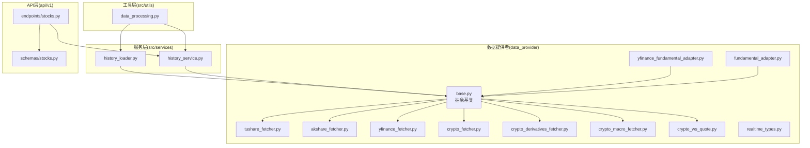
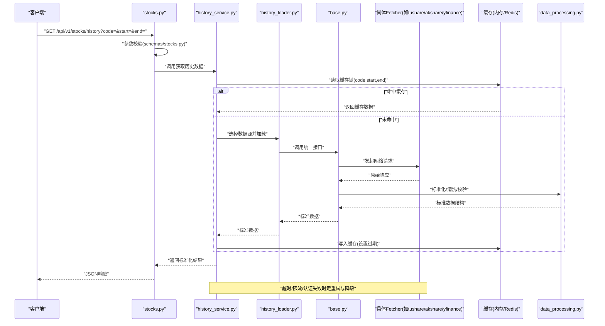
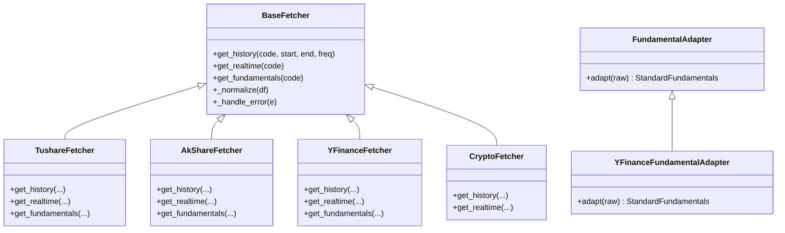

# 数据源集成

<cite>
**本文档引用的文件**
- [data_provider/base.py](file://data_provider/base.py)
- [data_provider/tushare_fetcher.py](file://data_provider/tushare_fetcher.py)
- [data_provider/akshare_fetcher.py](file://data_provider/akshare_fetcher.py)
- [data_provider/yfinance_fetcher.py](file://data_provider/yfinance_fetcher.py)
- [data_provider/fundamental_adapter.py](file://data_provider/fundamental_adapter.py)
- [data_provider/yfinance_fundamental_adapter.py](file://data_provider/yfinance_fundamental_adapter.py)
- [data_provider/crypto_fetcher.py](file://data_provider/crypto_fetcher.py)
- [data_provider/crypto_derivatives_fetcher.py](file://data_provider/crypto_derivatives_fetcher.py)
- [data_provider/crypto_macro_fetcher.py](file://data_provider/crypto_macro_fetcher.py)
- [data_provider/crypto_ws_quote.py](file://data_provider/crypto_ws_quote.py)
- [data_provider/realtime_types.py](file://data_provider/realtime_types.py)
- [src/services/history_service.py](file://src/services/history_service.py)
- [src/services/history_loader.py](file://src/services/history_loader.py)
- [src/utils/data_processing.py](file://src/utils/data_processing.py)
- [api/v1/endpoints/stocks.py](file://api/v1/endpoints/stocks.py)
- [api/v1/schemas/stocks.py](file://api/v1/schemas/stocks.py)
- [scripts/fetch_tushare_stock_list.py](file://scripts/fetch_tushare_stock_list.py)
</cite>

## 目录
1. [简介](#简介)
2. [项目结构](#项目结构)
3. [核心组件](#核心组件)
4. [架构总览](#架构总览)
5. [详细组件分析](#详细组件分析)
6. [依赖关系分析](#依赖关系分析)
7. [性能考虑](#性能考虑)
8. [故障排查指南](#故障排查指南)
9. [结论](#结论)
10. [附录](#附录)

## 简介
本文件面向数据源集成，系统性说明如何接入主流金融数据提供商（如 Tushare、AkShare、YFinance），涵盖配置管理、数据格式转换、缓存策略与错误处理。同时提供自定义数据源开发指南，包括接口规范、数据验证与性能优化建议，帮助开发者快速扩展新的数据提供方并保持系统一致性与稳定性。

## 项目结构
数据源相关代码主要位于 data_provider 目录，按“基础抽象 + 具体实现 + 适配器”组织；上层服务通过 history_service/history_loader 统一调用，API 层暴露 stocks 接口供前端或外部系统使用。

图表来源
- [data_provider/base.py](file://data_provider/base.py)
- [data_provider/tushare_fetcher.py](file://data_provider/tushare_fetcher.py)
- [data_provider/akshare_fetcher.py](file://data_provider/akshare_fetcher.py)
- [data_provider/yfinance_fetcher.py](file://data_provider/yfinance_fetcher.py)
- [data_provider/fundamental_adapter.py](file://data_provider/fundamental_adapter.py)
- [data_provider/yfinance_fundamental_adapter.py](file://data_provider/yfinance_fundamental_adapter.py)
- [data_provider/crypto_fetcher.py](file://data_provider/crypto_fetcher.py)
- [data_provider/crypto_derivatives_fetcher.py](file://data_provider/crypto_derivatives_fetcher.py)
- [data_provider/crypto_macro_fetcher.py](file://data_provider/crypto_macro_fetcher.py)
- [data_provider/crypto_ws_quote.py](file://data_provider/crypto_ws_quote.py)
- [data_provider/realtime_types.py](file://data_provider/realtime_types.py)
- [src/services/history_service.py](file://src/services/history_service.py)
- [src/services/history_loader.py](file://src/services/history_loader.py)
- [src/utils/data_processing.py](file://src/utils/data_processing.py)
- [api/v1/endpoints/stocks.py](file://api/v1/endpoints/stocks.py)
- [api/v1/schemas/stocks.py](file://api/v1/schemas/stocks.py)

章节来源
- [data_provider/base.py](file://data_provider/base.py)
- [src/services/history_service.py](file://src/services/history_service.py)
- [src/services/history_loader.py](file://src/services/history_loader.py)
- [api/v1/endpoints/stocks.py](file://api/v1/endpoints/stocks.py)

## 核心组件
- 抽象基类：定义统一的获取历史行情、实时报价、财务指标等接口契约，屏蔽底层差异。
- 具体 Fetcher：Tushare/AkShare/YFinance/Crypto 等实现，负责网络请求、鉴权、限流与异常捕获。
- 适配器：将不同来源的原始数据转换为内部标准结构（如 OHLCV、财务字段）。
- 服务层：history_service/history_loader 负责调度、重试、缓存、聚合与返回标准化结果。
- 工具层：数据清洗、时间对齐、缺失值填充、类型校验等通用能力。
- API 层：对外暴露股票历史、实时行情、基本面查询等 REST 接口，并做输入校验与错误映射。

章节来源
- [data_provider/base.py](file://data_provider/base.py)
- [data_provider/fundamental_adapter.py](file://data_provider/fundamental_adapter.py)
- [data_provider/yfinance_fundamental_adapter.py](file://data_provider/yfinance_fundamental_adapter.py)
- [src/services/history_service.py](file://src/services/history_service.py)
- [src/services/history_loader.py](file://src/services/history_loader.py)
- [src/utils/data_processing.py](file://src/utils/data_processing.py)
- [api/v1/endpoints/stocks.py](file://api/v1/endpoints/stocks.py)
- [api/v1/schemas/stocks.py](file://api/v1/schemas/stocks.py)

## 架构总览
下图展示从 API 到数据源的完整调用链，包括缓存、适配与错误处理路径。

图表来源
- [api/v1/endpoints/stocks.py](file://api/v1/endpoints/stocks.py)
- [api/v1/schemas/stocks.py](file://api/v1/schemas/stocks.py)
- [src/services/history_service.py](file://src/services/history_service.py)
- [src/services/history_loader.py](file://src/services/history_loader.py)
- [data_provider/base.py](file://data_provider/base.py)
- [data_provider/tushare_fetcher.py](file://data_provider/tushare_fetcher.py)
- [data_provider/akshare_fetcher.py](file://data_provider/akshare_fetcher.py)
- [data_provider/yfinance_fetcher.py](file://data_provider/yfinance_fetcher.py)
- [src/utils/data_processing.py](file://src/utils/data_processing.py)

## 详细组件分析

### 抽象基类与统一接口
- 职责：定义获取历史K线、分钟线、实时报价、财务指标的统一方法签名与返回结构约定。
- 关键点：
  - 输入参数规范化（标的代码、起止时间、复权方式、频率）
  - 输出结构标准化（时间戳、开高低收量、涨跌停、币种/市场标识）
  - 错误码与异常分类（网络、鉴权、限流、业务校验）
  - 可插拔的数据源路由（根据配置或市场自动选择）

章节来源
- [data_provider/base.py](file://data_provider/base.py)

### Tushare 数据源集成
- 配置要点：
  - Token 鉴权与环境变量注入
  - 请求限流与重试间隔控制
  - 数据字段映射（日期、交易日历、停牌处理）
- 数据格式转换：
  - 将 Tushare 字段映射为内部标准列名
  - 缺失值与异常值填充策略
- 缓存策略：
  - 基于 code+period+start+end 的缓存键
  - 合理 TTL 与增量更新
- 错误处理：
  - 网络超时重试、Token 失效刷新、配额不足降级

章节来源
- [data_provider/tushare_fetcher.py](file://data_provider/tushare_fetcher.py)
- [scripts/fetch_tushare_stock_list.py](file://scripts/fetch_tushare_stock_list.py)

### AkShare 数据源集成
- 配置要点：
  - 无需 Token 的公开接口，注意反爬与速率限制
  - 代理与超时配置
- 数据格式转换：
  - 多市场/多品种统一列名
  - 指数与个股字段差异处理
- 缓存策略：
  - 高频接口短 TTL，低频长 TTL
- 错误处理：
  - 结构化异常捕获与日志记录

章节来源
- [data_provider/akshare_fetcher.py](file://data_provider/akshare_fetcher.py)

### YFinance 数据源集成
- 配置要点：
  - 美股/港股/指数映射与符号转换
  - 复权与分红调整
- 数据格式转换：
  - 时间序列索引对齐与本地化时区处理
- 缓存策略：
  - 日线级缓存，盘中增量更新
- 错误处理：
  - 连接不稳定时的回退与重试

章节来源
- [data_provider/yfinance_fetcher.py](file://data_provider/yfinance_fetcher.py)

### 加密货币数据源（现货/衍生品/宏观）
- 现货 fetcher：
  - 交易所聚合、深度与成交明细
- 衍生品 fetcher：
  - 合约编码、展期、资金费率
- 宏观 fetcher：
  - 链上指标、稳定币供应、Gas 等
- WebSocket 实时报价：
  - 连接池、断线重连、消息去抖

章节来源
- [data_provider/crypto_fetcher.py](file://data_provider/crypto_fetcher.py)
- [data_provider/crypto_derivatives_fetcher.py](file://data_provider/crypto_derivatives_fetcher.py)
- [data_provider/crypto_macro_fetcher.py](file://data_provider/crypto_macro_fetcher.py)
- [data_provider/crypto_ws_quote.py](file://data_provider/crypto_ws_quote.py)
- [data_provider/realtime_types.py](file://data_provider/realtime_types.py)

### 财务数据适配器
- fundamental_adapter：
  - 统一财报字段（营收、利润、现金流、估值）
  - 多来源合并与冲突解决
- yfinance_fundamental_adapter：
  - 针对 YFinance 的财报结构与单位换算

章节来源
- [data_provider/fundamental_adapter.py](file://data_provider/fundamental_adapter.py)
- [data_provider/yfinance_fundamental_adapter.py](file://data_provider/yfinance_fundamental_adapter.py)

### 服务层：历史数据加载与缓存
- history_service：
  - 参数校验、数据源选择、缓存读写、聚合返回
- history_loader：
  - 具体加载流程编排、并发与限流、降级策略

章节来源
- [src/services/history_service.py](file://src/services/history_service.py)
- [src/services/history_loader.py](file://src/services/history_loader.py)

### 工具层：数据处理与校验
- data_processing：
  - 时间对齐、缺失值填充、异常检测、类型转换
  - 批量处理与向量化优化

章节来源
- [src/utils/data_processing.py](file://src/utils/data_processing.py)

### API 层：股票接口与入参校验
- endpoints/stocks：
  - REST 路由、分页、排序、过滤
- schemas/stocks：
  - Pydantic 模型校验、默认值与错误提示

章节来源
- [api/v1/endpoints/stocks.py](file://api/v1/endpoints/stocks.py)
- [api/v1/schemas/stocks.py](file://api/v1/schemas/stocks.py)

## 依赖关系分析

图表来源
- [data_provider/base.py](file://data_provider/base.py)
- [data_provider/tushare_fetcher.py](file://data_provider/tushare_fetcher.py)
- [data_provider/akshare_fetcher.py](file://data_provider/akshare_fetcher.py)
- [data_provider/yfinance_fetcher.py](file://data_provider/yfinance_fetcher.py)
- [data_provider/crypto_fetcher.py](file://data_provider/crypto_fetcher.py)
- [data_provider/fundamental_adapter.py](file://data_provider/fundamental_adapter.py)
- [data_provider/yfinance_fundamental_adapter.py](file://data_provider/yfinance_fundamental_adapter.py)

章节来源
- [data_provider/base.py](file://data_provider/base.py)
- [data_provider/tushare_fetcher.py](file://data_provider/tushare_fetcher.py)
- [data_provider/akshare_fetcher.py](file://data_provider/akshare_fetcher.py)
- [data_provider/yfinance_fetcher.py](file://data_provider/yfinance_fetcher.py)
- [data_provider/crypto_fetcher.py](file://data_provider/crypto_fetcher.py)
- [data_provider/fundamental_adapter.py](file://data_provider/fundamental_adapter.py)
- [data_provider/yfinance_fundamental_adapter.py](file://data_provider/yfinance_fundamental_adapter.py)

## 性能考虑
- 缓存策略
  - 多级缓存：内存 L1 + 分布式 L2（Redis）
  - 键设计：code + period + start + end + adjust
  - TTL 分层：分钟线短 TTL，日线长 TTL，财务数据更长
- 并发与限流
  - 请求并发度上限与队列长度控制
  - 指数退避重试与熔断保护
- 数据预处理
  - 批量拉取与向量化计算减少 Python 循环开销
  - 增量更新避免全量重复计算
- I/O 优化
  - 连接池复用、HTTP Keep-Alive
  - 压缩传输与分页拉取

[本节为通用指导，不直接分析具体文件]

## 故障排查指南
- 常见问题定位
  - 鉴权失败：检查 Token 有效期与权限范围
  - 限流/配额不足：降低并发、增加重试间隔、切换备用数据源
  - 数据缺失：核对交易日历、停牌日、复权方式
  - 时区/时间戳错位：统一 UTC 存储，展示层本地化
- 日志与监控
  - 关键节点打点：请求开始/结束、缓存命中/未命中、异常堆栈
  - 指标上报：QPS、延迟分位、错误率、缓存命中率
- 恢复策略
  - 自动重试与降级到次优数据源
  - 冷启动预热常用标的与时间段

章节来源
- [src/services/history_service.py](file://src/services/history_service.py)
- [src/services/history_loader.py](file://src/services/history_loader.py)
- [src/utils/data_processing.py](file://src/utils/data_processing.py)

## 结论
通过统一的抽象基类与适配器模式，本项目实现了多数据源的无缝接入与标准化输出。服务层与工具层提供了完善的缓存、校验与容错机制，API 层确保对外接口的一致性与健壮性。遵循本文档的配置、转换、缓存与错误处理规范，可高效扩展新的数据提供方并保障整体系统的稳定性与性能。

[本节为总结性内容，不直接分析具体文件]

## 附录

### 自定义数据源开发指南
- 接口规范
  - 继承抽象基类，实现 get_history/get_realtime/get_fundamentals 等方法
  - 输入参数标准化，输出结构严格遵循内部约定
- 数据验证
  - 必填字段校验、类型转换、范围检查、重复与缺失处理
  - 单元测试覆盖边界条件与异常分支
- 性能优化
  - 批量请求、分页拉取、连接复用
  - 合理缓存键与 TTL，避免雪崩
- 错误处理
  - 区分网络、鉴权、限流、业务错误
  - 重试策略与降级方案，完善日志与告警

章节来源
- [data_provider/base.py](file://data_provider/base.py)
- [src/utils/data_processing.py](file://src/utils/data_processing.py)
- [api/v1/schemas/stocks.py](file://api/v1/schemas/stocks.py)