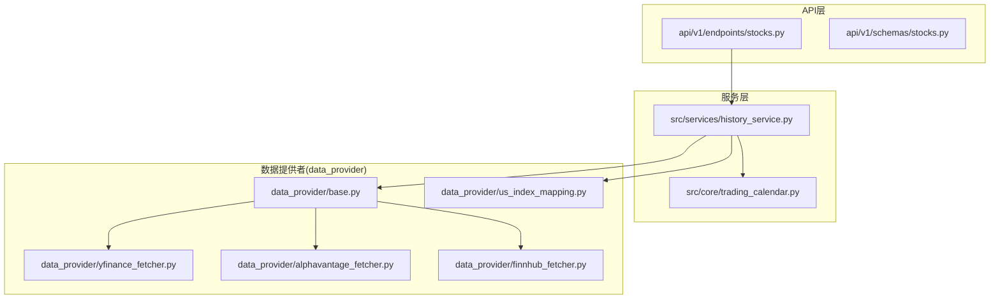
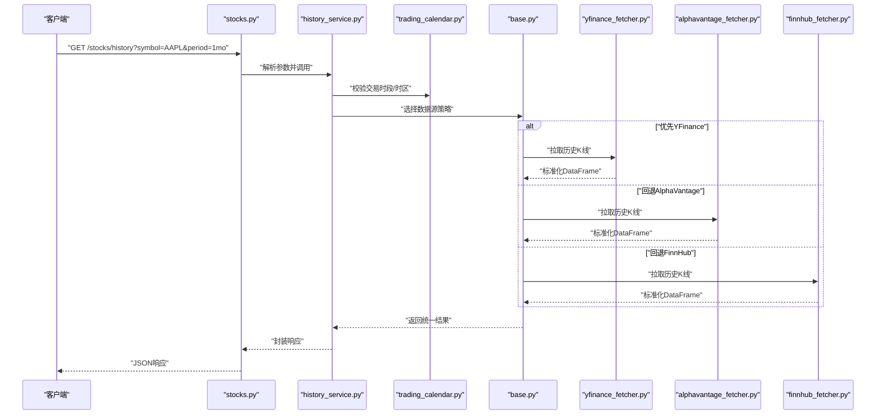
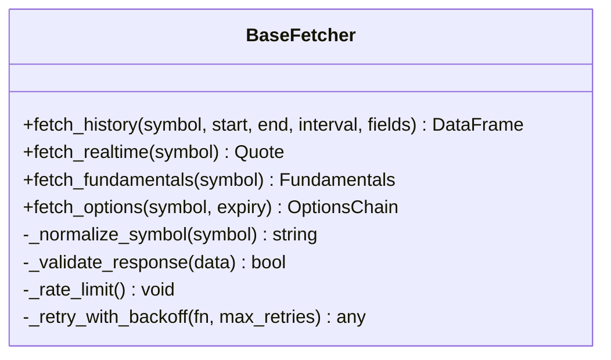
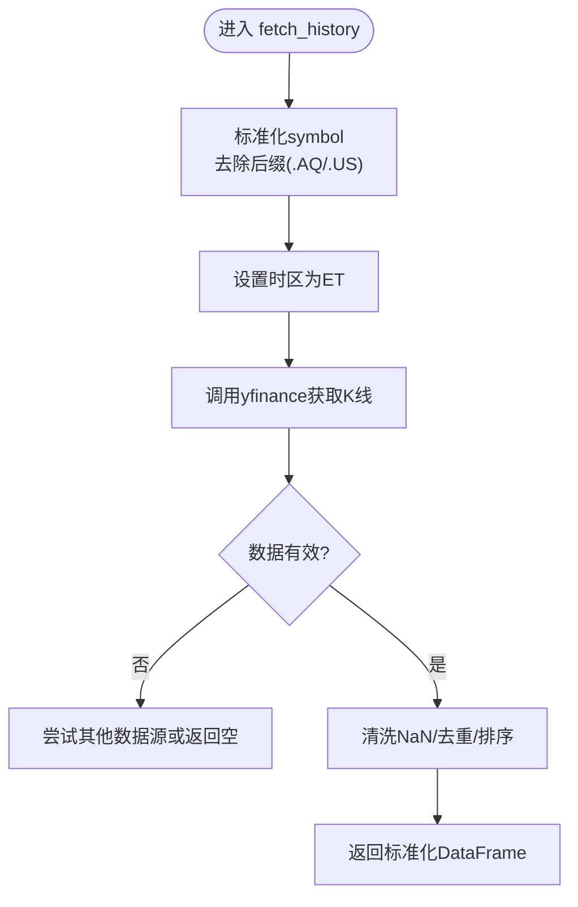
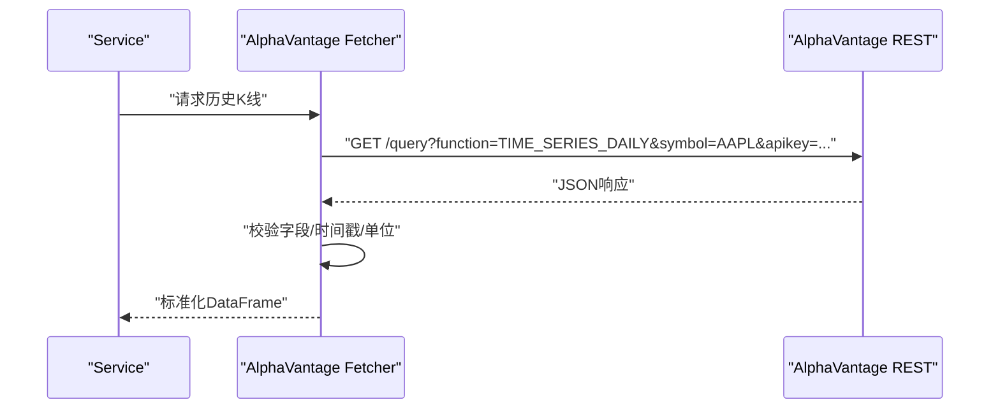
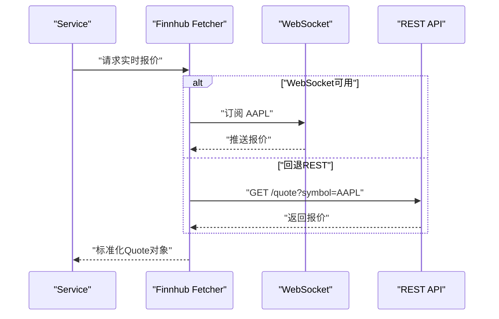
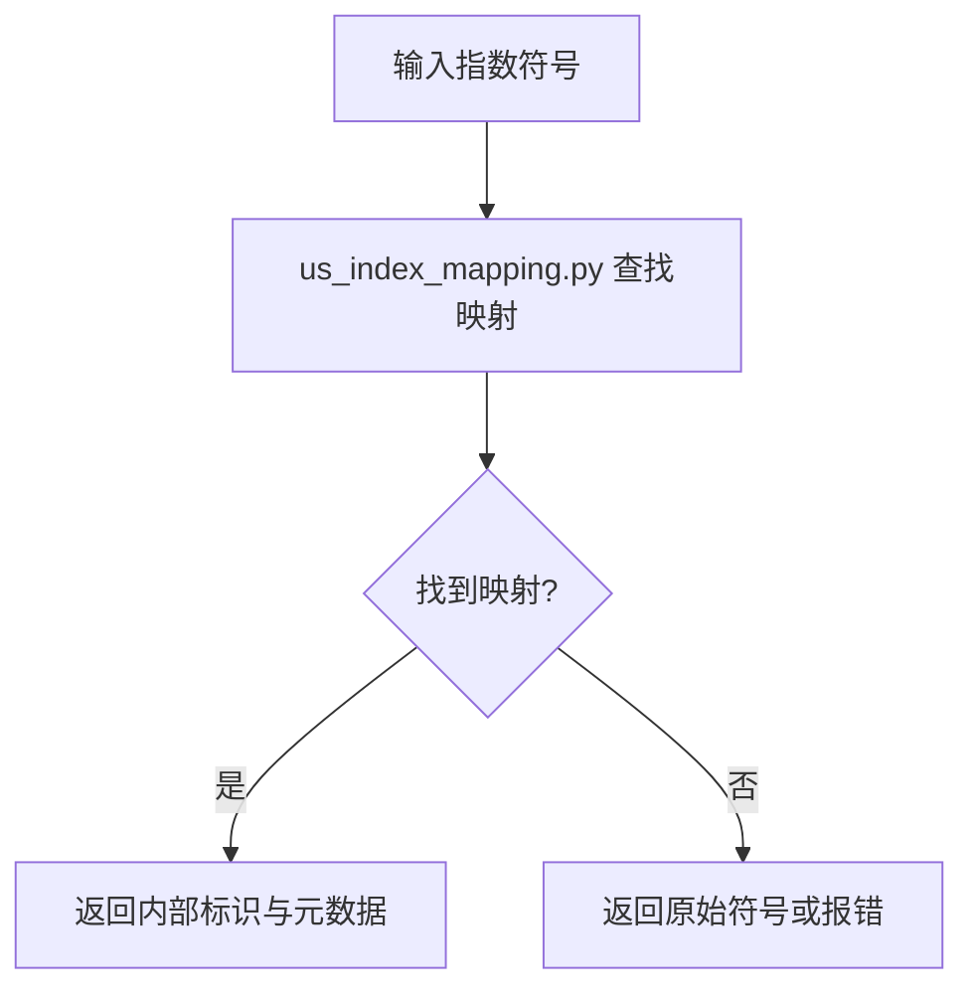
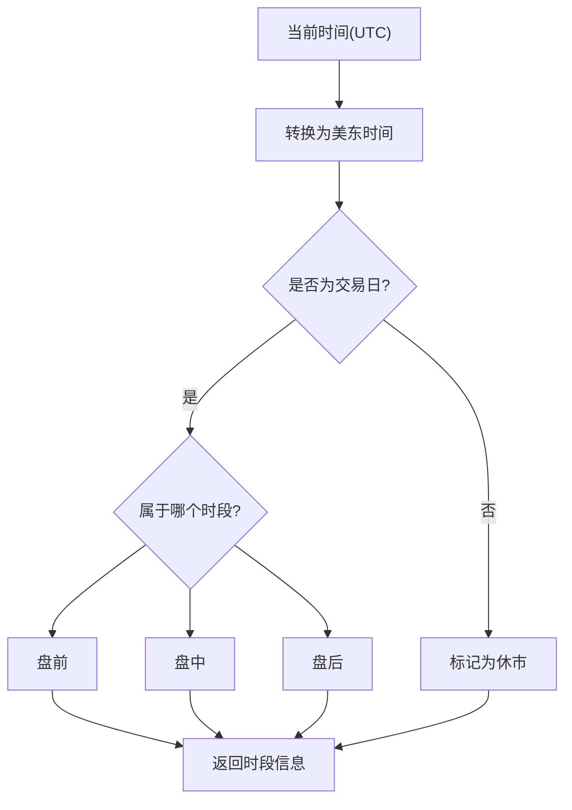
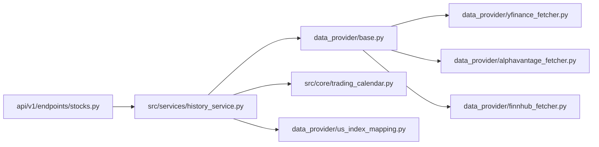

# 美股数据源

<cite>
**本文引用的文件**   
- [data_provider/yfinance_fetcher.py](file://data_provider/yfinance_fetcher.py)
- [data_provider/alphavantage_fetcher.py](file://data_provider/alphavantage_fetcher.py)
- [data_provider/finnhub_fetcher.py](file://data_provider/finnhub_fetcher.py)
- [data_provider/base.py](file://data_provider/base.py)
- [data_provider/us_index_mapping.py](file://data_provider/us_index_mapping.py)
- [src/services/history_service.py](file://src/services/history_service.py)
- [src/core/trading_calendar.py](file://src/core/trading_calendar.py)
- [api/v1/endpoints/stocks.py](file://api/v1/endpoints/stocks.py)
- [api/v1/schemas/stocks.py](file://api/v1/schemas/stocks.py)
- [tests/test_alphavantage_fetcher.py](file://tests/test_alphavantage_fetcher.py)
- [tests/test_finnhub_fetcher.py](file://tests/test_finnhub_fetcher.py)
- [tests/test_yfinance_us_indices.py](file://tests/test_yfinance_us_indices.py)
- [tests/test_us_index_mapping.py](file://tests/test_us_index_mapping.py)
</cite>

## 目录
1. [简介](#简介)
2. [项目结构](#项目结构)
3. [核心组件](#核心组件)
4. [架构总览](#架构总览)
5. [详细组件分析](#详细组件分析)
6. [依赖关系分析](#依赖关系分析)
7. [性能考量](#性能考量)
8. [故障排查指南](#故障排查指南)
9. [结论](#结论)
10. [附录](#附录)

## 简介
本文件面向美股数据源的集成与使用，覆盖 YFinance、AlphaVantage、FinnHub 三大提供商的接入方式。重点说明：
- 美股代码格式转换（如 AAPL.AQ 到 AAPL）
- 时区处理（美东时间 ET）
- 市场休市判断（交易日历）
- 股价历史、财报、指数映射、期权数据的获取示例
- API 密钥配置、请求频率限制与数据质量校验

## 项目结构
美股数据相关能力集中在 data_provider 层，并通过 services 层暴露统一接口；API 层提供 HTTP 访问入口；测试用例覆盖关键行为与边界条件。

图表来源 
- [api/v1/endpoints/stocks.py](file://api/v1/endpoints/stocks.py)
- [api/v1/schemas/stocks.py](file://api/v1/schemas/stocks.py)
- [src/services/history_service.py](file://src/services/history_service.py)
- [src/core/trading_calendar.py](file://src/core/trading_calendar.py)
- [data_provider/base.py](file://data_provider/base.py)
- [data_provider/yfinance_fetcher.py](file://data_provider/yfinance_fetcher.py)
- [data_provider/alphavantage_fetcher.py](file://data_provider/alphavantage_fetcher.py)
- [data_provider/finnhub_fetcher.py](file://data_provider/finnhub_fetcher.py)
- [data_provider/us_index_mapping.py](file://data_provider/us_index_mapping.py)

章节来源
- [api/v1/endpoints/stocks.py](file://api/v1/endpoints/stocks.py)
- [api/v1/schemas/stocks.py](file://api/v1/schemas/stocks.py)
- [src/services/history_service.py](file://src/services/history_service.py)
- [src/core/trading_calendar.py](file://src/core/trading_calendar.py)
- [data_provider/base.py](file://data_provider/base.py)
- [data_provider/yfinance_fetcher.py](file://data_provider/yfinance_fetcher.py)
- [data_provider/alphavantage_fetcher.py](file://data_provider/alphavantage_fetcher.py)
- [data_provider/finnhub_fetcher.py](file://data_provider/finnhub_fetcher.py)
- [data_provider/us_index_mapping.py](file://data_provider/us_index_mapping.py)

## 核心组件
- 抽象基类 BaseFetcher：定义统一的拉取接口、重试与限流策略、错误码归一化、字段标准化等。
- YFinance Fetcher：通过 yfinance 库拉取美股行情、指数、财报摘要等，支持本地缓存与幂等键。
- AlphaVantage Fetcher：基于 REST 调用，支持日/周/月K线、财报基础指标、企业事件等。
- Finnhub Fetcher：REST 与 WebSocket 双通道，支持实时报价、新闻、公司基本面、期权链等。
- 美股指数映射：将常见指数符号与内部标识进行映射，便于统一查询与展示。
- 交易日历：用于判断当前是否处于交易时段、节假日与盘前盘后时段。

章节来源
- [data_provider/base.py](file://data_provider/base.py)
- [data_provider/yfinance_fetcher.py](file://data_provider/yfinance_fetcher.py)
- [data_provider/alphavantage_fetcher.py](file://data_provider/alphavantage_fetcher.py)
- [data_provider/finnhub_fetcher.py](file://data_provider/finnhub_fetcher.py)
- [data_provider/us_index_mapping.py](file://data_provider/us_index_mapping.py)
- [src/core/trading_calendar.py](file://src/core/trading_calendar.py)

## 架构总览
整体采用“API -> Service -> Provider”的分层设计。Service 负责编排多个 Provider 的能力，并注入交易日历与时区逻辑；Provider 屏蔽具体数据源的差异，向上返回统一的数据模型。

图表来源 
- [api/v1/endpoints/stocks.py](file://api/v1/endpoints/stocks.py)
- [src/services/history_service.py](file://src/services/history_service.py)
- [src/core/trading_calendar.py](file://src/core/trading_calendar.py)
- [data_provider/base.py](file://data_provider/base.py)
- [data_provider/yfinance_fetcher.py](file://data_provider/yfinance_fetcher.py)
- [data_provider/alphavantage_fetcher.py](file://data_provider/alphavantage_fetcher.py)
- [data_provider/finnhub_fetcher.py](file://data_provider/finnhub_fetcher.py)

## 详细组件分析

### 抽象基类 BaseFetcher
- 职责：定义 fetch_history、fetch_realtime、fetch_fundamentals、fetch_options 等抽象方法；实现通用重试、超时、限流、日志与异常归一化。
- 关键点：
  - 统一输入输出：symbol、start/end、interval、fields 等参数规范化
  - 错误码映射：HTTP 状态码与业务错误码对应
  - 数据校验：空值、重复、时间戳顺序、字段完整性检查
  - 缓存键生成：按 symbol+interval+period 生成稳定键

图表来源 
- [data_provider/base.py](file://data_provider/base.py)

章节来源
- [data_provider/base.py](file://data_provider/base.py)

### YFinance Fetcher
- 能力：
  - 历史K线：日线/周线/月线，支持复权与除息调整
  - 指数数据：标普500、纳斯达克、道琼斯等映射与拉取
  - 财报摘要：收入、EPS、分部信息等
  - 期权链：到期日、行权价、买卖价差等
- 特性：
  - 美股代码自动修正：如 AAPL.AQ -> AAPL
  - 时区：默认返回美东时间序列索引
  - 限流：内置速率控制与重试
  - 数据质量：NaN 填充策略、去重、时间对齐

图表来源 
- [data_provider/yfinance_fetcher.py](file://data_provider/yfinance_fetcher.py)

章节来源
- [data_provider/yfinance_fetcher.py](file://data_provider/yfinance_fetcher.py)
- [tests/test_yfinance_us_indices.py](file://tests/test_yfinance_us_indices.py)

### AlphaVantage Fetcher
- 能力：
  - 历史K线：日/周/月，支持扩展区间
  - 财报基础：季度/年度营收、利润、现金流
  - 企业事件：分红、拆股、公告
- 特性：
  - API Key 管理：从环境变量读取
  - 速率限制：按免费配额节流
  - 错误处理：区分网络错误与业务错误（如无效symbol）
  - 数据质量：缺失值插补、单位换算

图表来源 
- [data_provider/alphavantage_fetcher.py](file://data_provider/alphavantage_fetcher.py)

章节来源
- [data_provider/alphavantage_fetcher.py](file://data_provider/alphavantage_fetcher.py)
- [tests/test_alphavantage_fetcher.py](file://tests/test_alphavantage_fetcher.py)

### Finnhub Fetcher
- 能力：
  - 实时报价：价格、成交量、买卖盘口
  - 新闻：公司公告、财经新闻
  - 基本面：财务比率、估值指标
  - 期权链：到期日、行权价、隐含波动率
- 特性：
  - REST + WebSocket 双通道
  - 美股代码兼容：AAPL、MSFT 等
  - 速率限制：按订阅等级限制并发与频率
  - 数据质量：盘前盘后过滤、异常值剔除

图表来源 
- [data_provider/finnhub_fetcher.py](file://data_provider/finnhub_fetcher.py)

章节来源
- [data_provider/finnhub_fetcher.py](file://data/provider/finnhub_fetcher.py)
- [tests/test_finnhub_fetcher.py](file://tests/test_finnhub_fetcher.py)

### 美股指数映射
- 作用：将外部指数符号（如 ^GSPC、^IXIC、^DJI）映射到内部标识，便于统一查询与展示。
- 内容：包含指数名称、别名、权重、基准日期等元数据。

图表来源 
- [data_provider/us_index_mapping.py](file://data_provider/us_index_mapping.py)

章节来源
- [data_provider/us_index_mapping.py](file://data_provider/us_index_mapping.py)
- [tests/test_us_index_mapping.py](file://tests/test_us_index_mapping.py)

### 交易日历与时区
- 功能：
  - 判断当前是否为交易日
  - 识别盘前、盘中、盘后时段
  - 支持美东时间（America/New_York）与UTC互转
- 用途：在拉取数据前进行时段判断，避免非交易时段请求导致空数据或延迟。

图表来源 
- [src/core/trading_calendar.py](file://src/core/trading_calendar.py)

章节来源
- [src/core/trading_calendar.py](file://src/core/trading_calendar.py)

## 依赖关系分析
- API 层依赖 Service 层，Service 层依赖 Provider 抽象与交易日历。
- Provider 之间相互独立，通过 Service 层进行编排与回退。
- 测试覆盖各 Provider 的关键路径与边界情况。

图表来源 
- [api/v1/endpoints/stocks.py](file://api/v1/endpoints/stocks.py)
- [src/services/history_service.py](file://src/services/history_service.py)
- [data_provider/base.py](file://data_provider/base.py)
- [src/core/trading_calendar.py](file://src/core/trading_calendar.py)
- [data_provider/yfinance_fetcher.py](file://data_provider/yfinance_fetcher.py)
- [data_provider/alphavantage_fetcher.py](file://data_provider/alphavantage_fetcher.py)
- [data_provider/finnhub_fetcher.py](file://data_provider/finnhub_fetcher.py)
- [data_provider/us_index_mapping.py](file://data_provider/us_index_mapping.py)

章节来源
- [api/v1/endpoints/stocks.py](file://api/v1/endpoints/stocks.py)
- [src/services/history_service.py](file://src/services/history_service.py)
- [data_provider/base.py](file://data_provider/base.py)
- [src/core/trading_calendar.py](file://src/core/trading_calendar.py)
- [data_provider/yfinance_fetcher.py](file://data_provider/yfinance_fetcher.py)
- [data_provider/alphavantage_fetcher.py](file://data_provider/alphavantage_fetcher.py)
- [data_provider/finnhub_fetcher.py](file://data_provider/finnhub_fetcher.py)
- [data_provider/us_index_mapping.py](file://data_provider/us_index_mapping.py)

## 性能考量
- 连接复用与池化：对 REST 调用启用连接池，减少握手开销。
- 并发与限流：按 Provider 配额设置并发上限与令牌桶限流。
- 缓存策略：对历史K线与指数映射做短期缓存，降低重复请求。
- 数据裁剪：按需返回字段，避免大对象传输。
- 失败快速回退：主 Provider 失败时立即切换到备用 Provider。

[本节为通用指导，不直接分析具体文件]

## 故障排查指南
- API 密钥问题：确认环境变量已正确配置，权限与配额充足。
- 频率限制：观察 429 错误，适当增加重试间隔或降级到备用 Provider。
- 数据为空：检查交易日历与时间段，确认是否在交易时段内。
- 代码格式错误：确保使用标准美股代码（如 AAPL），避免多余后缀。
- 时区不一致：统一使用美东时间，必要时显式转换。
- 数据质量：检查 NaN、重复、时间戳顺序，必要时执行清洗。

章节来源
- [tests/test_alphavantage_fetcher.py](file://tests/test_alphavantage_fetcher.py)
- [tests/test_finnhub_fetcher.py](file://tests/test_finnhub_fetcher.py)
- [tests/test_yfinance_us_indices.py](file://tests/test_yfinance_us_indices.py)
- [tests/test_us_index_mapping.py](file://tests/test_us_index_mapping.py)

## 结论
本项目通过抽象基类与多 Provider 实现，提供了稳定、可扩展的美股数据获取能力。结合交易日历与时区处理，能够准确反映市场状态；通过限流、重试与数据校验，保障数据质量与系统稳定性。建议在生产环境完善密钥管理、监控告警与缓存策略，以进一步提升可靠性与性能。

[本节为总结性内容，不直接分析具体文件]

## 附录
- 美股代码格式转换示例：
  - AAPL.AQ -> AAPL
  - MSFT.US -> MSFT
- 时区处理：
  - 所有时间戳统一为美东时间（America/New_York）
- 市场休市判断：
  - 使用交易日历判断交易日与盘前盘后
- 数据获取示例：
  - 历史K线：调用 history_service 指定 symbol、interval、period
  - 财报数据：调用 fundamental_adapter 获取季度/年度报表
  - 指数映射：通过 us_index_mapping 将外部符号转为内部标识
  - 期权数据：调用 finnhub_fetcher 获取期权链

[本节为概念性说明，不直接分析具体文件]