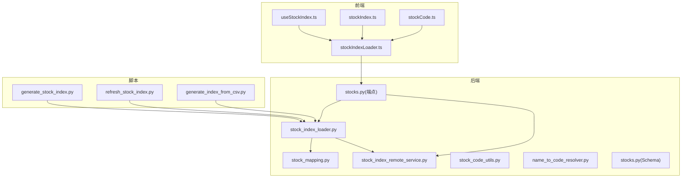
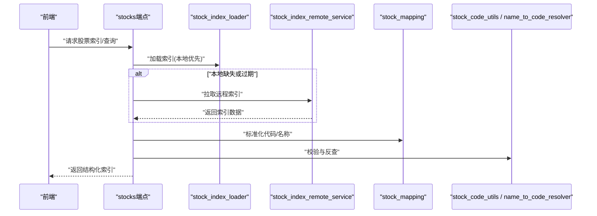
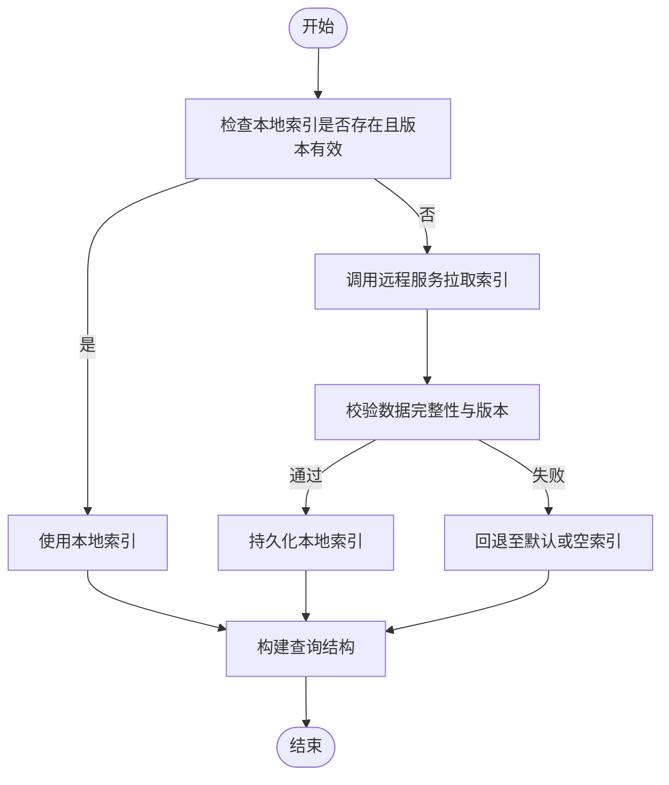
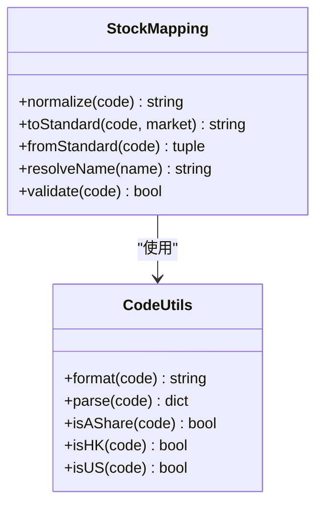
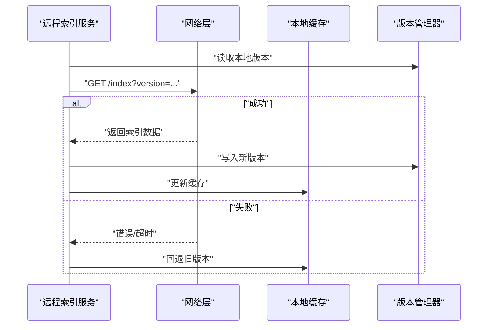
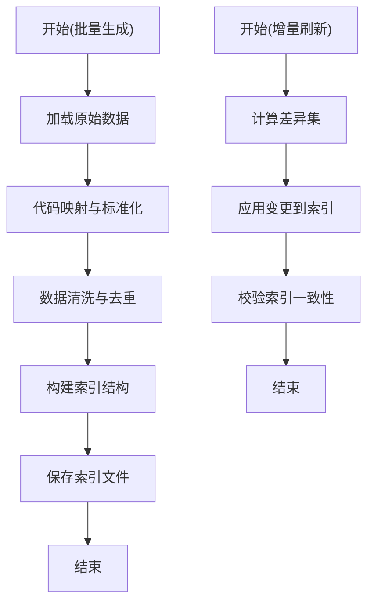
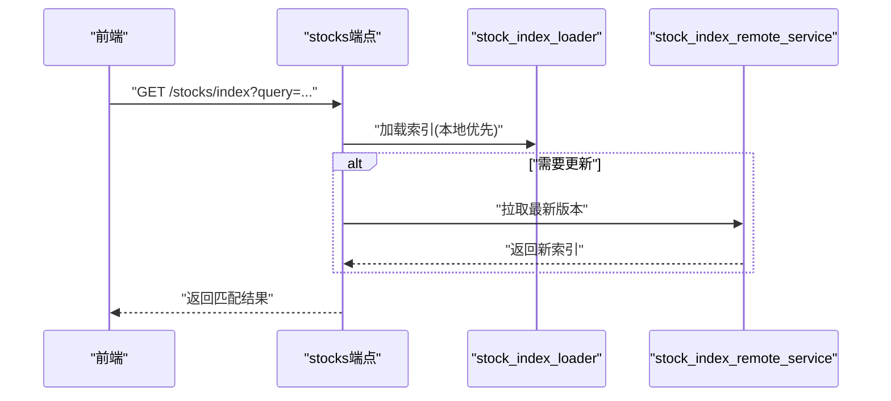
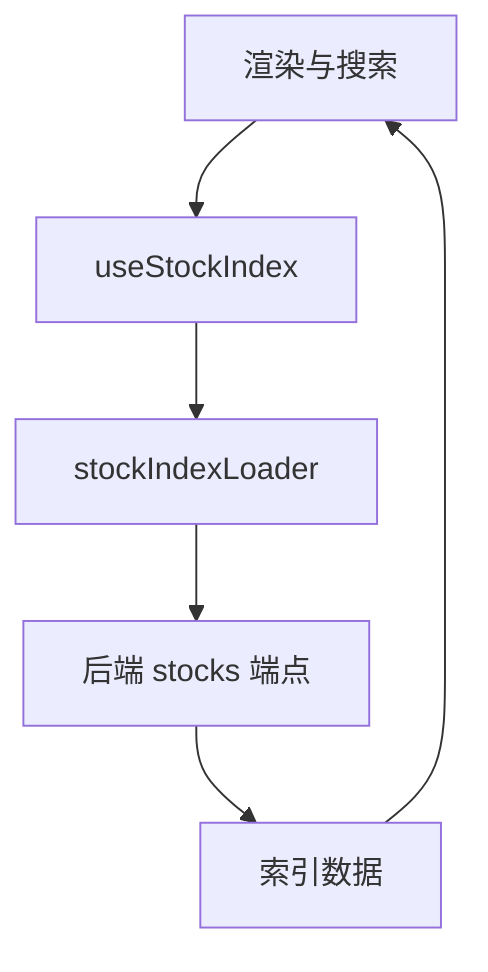
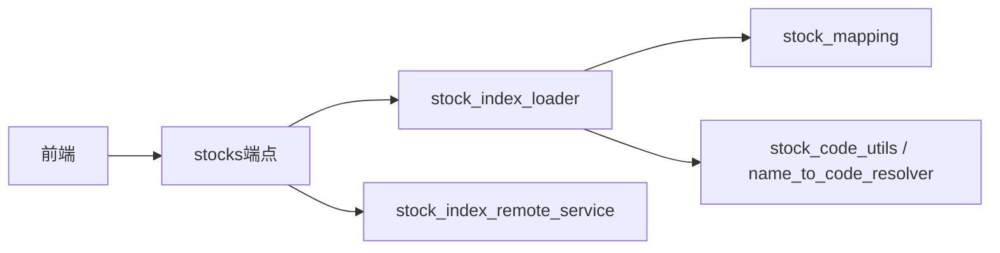

# 股票索引管理

<cite>
**本文引用的文件**   
- [src/data/stock_index_loader.py](file://src/data/stock_index_loader.py)
- [src/data/stock_mapping.py](file://src/data/stock_mapping.py)
- [scripts/generate_stock_index.py](file://scripts/generate_stock_index.py)
- [scripts/refresh_stock_index.py](file://scripts/refresh_stock_index.py)
- [scripts/generate_index_from_csv.py](file://scripts/generate_index_from_csv.py)
- [src/services/stock_index_remote_service.py](file://src/services/stock_index_remote_service.py)
- [src/services/stock_code_utils.py](file://src/services/stock_code_utils.py)
- [src/services/name_to_code_resolver.py](file://src/services/name_to_code_resolver.py)
- [api/v1/endpoints/stocks.py](file://api/v1/endpoints/stocks.py)
- [api/v1/schemas/stocks.py](file://api/v1/schemas/stocks.py)
- [apps/dsa-web/src/utils/stockIndexLoader.ts](file://apps/dsa-web/src/utils/stockIndexLoader.ts)
- [apps/dsa-web/src/hooks/useStockIndex.ts](file://apps/dsa-web/src/hooks/useStockIndex.ts)
- [apps/dsa-web/src/types/stockIndex.ts](file://apps/dsa-web/src/types/stockIndex.ts)
- [apps/dsa-web/src/utils/stockCode.ts](file://apps/dsa-web/src/utils/stockCode.ts)
- [tests/test_stock_index_loader.py](file://tests/test_stock_index_loader.py)
- [tests/test_refresh_stock_index.py](file://tests/test_refresh_stock_index.py)
</cite>

## 目录
1. [简介](#简介)
2. [项目结构](#项目结构)
3. [核心组件](#核心组件)
4. [架构总览](#架构总览)
5. [详细组件分析](#详细组件分析)
6. [依赖关系分析](#依赖关系分析)
7. [性能考虑](#性能考虑)
8. [故障排查指南](#故障排查指南)
9. [结论](#结论)
10. [附录](#附录)

## 简介
本文件面向“股票索引管理”子系统，系统性说明股票代码映射、索引生成与维护机制。重点覆盖：
- stock_index_loader 的数据加载流程（本地与远程）
- stock_mapping 的代码转换逻辑（A股/港股/美股等）
- 批量生成股票索引、增量更新索引、索引版本管理
- 自定义股票分类、行业板块映射与指数成分股管理的实现方法

该文档既适合开发者深入理解实现细节，也便于非技术读者快速上手使用。

## 项目结构
围绕股票索引管理的相关代码分布在后端数据层、服务层、脚本工具、前端工具与类型定义中：
- 后端数据层：stock_index_loader.py、stock_mapping.py
- 后端服务层：stock_index_remote_service.py、stock_code_utils.py、name_to_code_resolver.py
- 脚本工具：generate_stock_index.py、refresh_stock_index.py、generate_index_from_csv.py
- API 层：stocks.py（端点）、stocks.py（Schema）
- 前端：stockIndexLoader.ts、useStockIndex.ts、stockIndex.ts、stockCode.ts
- 测试：test_stock_index_loader.py、test_refresh_stock_index.py

图表来源
- [src/data/stock_index_loader.py](file://src/data/stock_index_loader.py)
- [src/data/stock_mapping.py](file://src/data/stock_mapping.py)
- [src/services/stock_index_remote_service.py](file://src/services/stock_index_remote_service.py)
- [api/v1/endpoints/stocks.py](file://api/v1/endpoints/stocks.py)
- [scripts/generate_stock_index.py](file://scripts/generate_stock_index.py)
- [scripts/refresh_stock_index.py](file://scripts/refresh_stock_index.py)
- [scripts/generate_index_from_csv.py](file://scripts/generate_index_from_csv.py)
- [apps/dsa-web/src/utils/stockIndexLoader.ts](file://apps/dsa-web/src/utils/stockIndexLoader.ts)
- [apps/dsa-web/src/hooks/useStockIndex.ts](file://apps/dsa-web/src/hooks/useStockIndex.ts)
- [apps/dsa-web/src/types/stockIndex.ts](file://apps/dsa-web/src/types/stockIndex.ts)
- [apps/dsa-web/src/utils/stockCode.ts](file://apps/dsa-web/src/utils/stockCode.ts)

章节来源
- [src/data/stock_index_loader.py](file://src/data/stock_index_loader.py)
- [src/data/stock_mapping.py](file://src/data/stock_mapping.py)
- [src/services/stock_index_remote_service.py](file://src/services/stock_index_remote_service.py)
- [api/v1/endpoints/stocks.py](file://api/v1/endpoints/stocks.py)
- [scripts/generate_stock_index.py](file://scripts/generate_stock_index.py)
- [scripts/refresh_stock_index.py](file://scripts/refresh_stock_index.py)
- [scripts/generate_index_from_csv.py](file://scripts/generate_index_from_csv.py)
- [apps/dsa-web/src/utils/stockIndexLoader.ts](file://apps/dsa-web/src/utils/stockIndexLoader.ts)
- [apps/dsa-web/src/hooks/useStockIndex.ts](file://apps/dsa-web/src/hooks/useStockIndex.ts)
- [apps/dsa-web/src/types/stockIndex.ts](file://apps/dsa-web/src/types/stockIndex.ts)
- [apps/dsa-web/src/utils/stockCode.ts](file://apps/dsa-web/src/utils/stockCode.ts)

## 核心组件
- 股票索引加载器（stock_index_loader）
  - 负责从本地或远程源加载股票索引数据，统一为内部结构，供上层查询与展示使用。
- 股票代码映射（stock_mapping）
  - 提供多市场股票代码的规范化与转换能力（如A股、港股、美股），并维护交易所前缀、后缀规则。
- 远程索引服务（stock_index_remote_service）
  - 封装与远端索引服务的交互，支持拉取最新索引、校验版本、回退策略等。
- 工具与解析（stock_code_utils、name_to_code_resolver）
  - 提供股票代码校验、格式化、名称到代码的反查等能力。
- 脚本工具（generate_stock_index、refresh_stock_index、generate_index_from_csv）
  - 用于批量生成索引、增量刷新、从CSV导入构建索引。
- API 层（stocks 端点与 Schema）
  - 对外暴露索引查询、更新接口，定义请求/响应结构。
- 前端集成（stockIndexLoader、useStockIndex、stockIndex 类型、stockCode）
  - 前端调用后端接口获取索引，并在UI中展示与搜索。

章节来源
- [src/data/stock_index_loader.py](file://src/data/stock_index_loader.py)
- [src/data/stock_mapping.py](file://src/data/stock_mapping.py)
- [src/services/stock_index_remote_service.py](file://src/services/stock_index_remote_service.py)
- [src/services/stock_code_utils.py](file://src/services/stock_code_utils.py)
- [src/services/name_to_code_resolver.py](file://src/services/name_to_code_resolver.py)
- [scripts/generate_stock_index.py](file://scripts/generate_stock_index.py)
- [scripts/refresh_stock_index.py](file://scripts/refresh_stock_index.py)
- [scripts/generate_index_from_csv.py](file://scripts/generate_index_from_csv.py)
- [api/v1/endpoints/stocks.py](file://api/v1/endpoints/stocks.py)
- [api/v1/schemas/stocks.py](file://api/v1/schemas/stocks.py)
- [apps/dsa-web/src/utils/stockIndexLoader.ts](file://apps/dsa-web/src/utils/stockIndexLoader.ts)
- [apps/dsa-web/src/hooks/useStockIndex.ts](file://apps/dsa-web/src/hooks/useStockIndex.ts)
- [apps/dsa-web/src/types/stockIndex.ts](file://apps/dsa-web/src/types/stockIndex.ts)
- [apps/dsa-web/src/utils/stockCode.ts](file://apps/dsa-web/src/utils/stockCode.ts)

## 架构总览
整体流程分为“数据加载与转换”、“索引持久化与版本管理”、“API 暴露与前端消费”。

图表来源
- [api/v1/endpoints/stocks.py](file://api/v1/endpoints/stocks.py)
- [src/data/stock_index_loader.py](file://src/data/stock_index_loader.py)
- [src/services/stock_index_remote_service.py](file://src/services/stock_index_remote_service.py)
- [src/data/stock_mapping.py](file://src/data/stock_mapping.py)
- [src/services/stock_code_utils.py](file://src/services/stock_code_utils.py)
- [src/services/name_to_code_resolver.py](file://src/services/name_to_code_resolver.py)

## 详细组件分析

### 股票索引加载器（stock_index_loader）
职责与流程
- 数据源选择：优先本地缓存，若缺失或版本不一致则触发远程拉取。
- 数据清洗与标准化：统一字段名、编码、时间戳、版本号等。
- 索引构建：将原始数据转换为查询友好的结构（如按代码、名称、板块、行业等索引）。
- 错误处理：网络异常、数据格式异常、版本冲突时的降级与重试策略。

关键要点
- 本地存储路径与命名约定需与脚本生成保持一致。
- 版本字段用于判断是否需要刷新，避免频繁拉取。
- 对大规模数据采用分块读取与惰性加载，降低内存占用。

图表来源
- [src/data/stock_index_loader.py](file://src/data/stock_index_loader.py)
- [src/services/stock_index_remote_service.py](file://src/services/stock_index_remote_service.py)

章节来源
- [src/data/stock_index_loader.py](file://src/data/stock_index_loader.py)
- [tests/test_stock_index_loader.py](file://tests/test_stock_index_loader.py)

### 股票代码映射（stock_mapping）
职责与流程
- 多市场代码规范：识别并转换不同市场的股票代码（如A股沪深、港股HK、美股US等）。
- 前缀/后缀规则：根据交易所规则添加或去除标识符，保证全局唯一性。
- 名称与代码互转：支持中文名称、简称到标准代码的反查。
- 容错与回退：当映射表缺失时，尝试动态推断或返回未映射状态。

关键要点
- 映射表应可配置、可扩展，支持新增市场与规则。
- 转换过程需幂等，避免重复转换导致不一致。
- 与 stock_code_utils 协作完成校验与格式化。

图表来源
- [src/data/stock_mapping.py](file://src/data/stock_mapping.py)
- [src/services/stock_code_utils.py](file://src/services/stock_code_utils.py)

章节来源
- [src/data/stock_mapping.py](file://src/data/stock_mapping.py)
- [src/services/stock_code_utils.py](file://src/services/stock_code_utils.py)

### 远程索引服务（stock_index_remote_service）
职责与流程
- 拉取最新索引：支持HTTP/HTTPS或其他协议访问远端索引服务。
- 版本控制：对比本地与远端版本，决定是否更新。
- 重试与超时：在网络不稳定时进行有限次重试与超时控制。
- 降级策略：拉取失败时使用缓存或默认索引，保障可用性。

关键要点
- 远端接口契约（URL、参数、响应结构）需稳定。
- 日志记录拉取结果、耗时与错误原因，便于排障。
- 支持并发拉取与断点续传（视数据量而定）。

图表来源
- [src/services/stock_index_remote_service.py](file://src/services/stock_index_remote_service.py)

章节来源
- [src/services/stock_index_remote_service.py](file://src/services/stock_index_remote_service.py)

### 脚本工具：批量生成与增量更新
- generate_stock_index.py
  - 功能：批量生成股票索引，通常从数据源（数据库、CSV、API）拉取全量数据，经映射与清洗后输出索引文件。
  - 适用场景：初始化或重建索引。
- refresh_stock_index.py
  - 功能：增量更新索引，仅拉取变更部分，合并到现有索引，提升效率。
  - 适用场景：日常定时任务或手动触发更新。
- generate_index_from_csv.py
  - 功能：从CSV文件构建索引，适用于离线数据导入与测试。
  - 适用场景：数据迁移、样本构造、离线验证。

图表来源
- [scripts/generate_stock_index.py](file://scripts/generate_stock_index.py)
- [scripts/refresh_stock_index.py](file://scripts/refresh_stock_index.py)
- [scripts/generate_index_from_csv.py](file://scripts/generate_index_from_csv.py)

章节来源
- [scripts/generate_stock_index.py](file://scripts/generate_stock_index.py)
- [scripts/refresh_stock_index.py](file://scripts/refresh_stock_index.py)
- [scripts/generate_index_from_csv.py](file://scripts/generate_index_from_csv.py)
- [tests/test_refresh_stock_index.py](file://tests/test_refresh_stock_index.py)

### API 层：索引查询与更新
- stocks 端点
  - 提供查询接口：按代码、名称、板块、行业等维度检索索引。
  - 提供更新接口：触发批量生成或增量刷新任务。
- stocks Schema
  - 定义请求与响应的数据结构，确保前后端契约一致。

图表来源
- [api/v1/endpoints/stocks.py](file://api/v1/endpoints/stocks.py)
- [api/v1/schemas/stocks.py](file://api/v1/schemas/stocks.py)
- [src/data/stock_index_loader.py](file://src/data/stock_index_loader.py)
- [src/services/stock_index_remote_service.py](file://src/services/stock_index_remote_service.py)

章节来源
- [api/v1/endpoints/stocks.py](file://api/v1/endpoints/stocks.py)
- [api/v1/schemas/stocks.py](file://api/v1/schemas/stocks.py)

### 前端集成：索引加载与使用
- stockIndexLoader.ts
  - 封装对后端索引接口的调用，处理缓存与重试。
- useStockIndex.ts
  - React Hook，提供索引数据的订阅与状态管理。
- stockIndex.ts
  - 定义索引数据结构与类型约束。
- stockCode.ts
  - 前端代码格式化与校验，与后端映射保持一致。

图表来源
- [apps/dsa-web/src/utils/stockIndexLoader.ts](file://apps/dsa-web/src/utils/stockIndexLoader.ts)
- [apps/dsa-web/src/hooks/useStockIndex.ts](file://apps/dsa-web/src/hooks/useStockIndex.ts)
- [apps/dsa-web/src/types/stockIndex.ts](file://apps/dsa-web/src/types/stockIndex.ts)
- [apps/dsa-web/src/utils/stockCode.ts](file://apps/dsa-web/src/utils/stockCode.ts)

章节来源
- [apps/dsa-web/src/utils/stockIndexLoader.ts](file://apps/dsa-web/src/utils/stockIndexLoader.ts)
- [apps/dsa-web/src/hooks/useStockIndex.ts](file://apps/dsa-web/src/hooks/useStockIndex.ts)
- [apps/dsa-web/src/types/stockIndex.ts](file://apps/dsa-web/src/types/stockIndex.ts)
- [apps/dsa-web/src/utils/stockCode.ts](file://apps/dsa-web/src/utils/stockCode.ts)

## 依赖关系分析
- 模块耦合
  - stock_index_loader 依赖 stock_mapping 与 stock_index_remote_service。
  - API 层依赖 loader 与 remote service，屏蔽底层复杂性。
  - 前端依赖 API 与本地类型定义，保持契约一致。
- 外部依赖
  - 网络库（HTTP客户端）、文件系统（本地缓存）、序列化库（JSON/CSV）。
- 潜在循环依赖
  - 应避免 loader 与 remote service 互相直接引用，通过接口或事件解耦。

图表来源
- [api/v1/endpoints/stocks.py](file://api/v1/endpoints/stocks.py)
- [src/data/stock_index_loader.py](file://src/data/stock_index_loader.py)
- [src/services/stock_index_remote_service.py](file://src/services/stock_index_remote_service.py)
- [src/data/stock_mapping.py](file://src/data/stock_mapping.py)
- [src/services/stock_code_utils.py](file://src/services/stock_code_utils.py)
- [src/services/name_to_code_resolver.py](file://src/services/name_to_code_resolver.py)
- [apps/dsa-web/src/utils/stockIndexLoader.ts](file://apps/dsa-web/src/utils/stockIndexLoader.ts)

章节来源
- [api/v1/endpoints/stocks.py](file://api/v1/endpoints/stocks.py)
- [src/data/stock_index_loader.py](file://src/data/stock_index_loader.py)
- [src/services/stock_index_remote_service.py](file://src/services/stock_index_remote_service.py)
- [src/data/stock_mapping.py](file://src/data/stock_mapping.py)
- [src/services/stock_code_utils.py](file://src/services/stock_code_utils.py)
- [src/services/name_to_code_resolver.py](file://src/services/name_to_code_resolver.py)
- [apps/dsa-web/src/utils/stockIndexLoader.ts](file://apps/dsa-web/src/utils/stockIndexLoader.ts)

## 性能考虑
- 数据加载
  - 本地缓存优先，减少网络开销；按需加载与分页查询，降低内存压力。
- 索引构建
  - 使用高效数据结构（如哈希表、倒排索引）提升查询速度。
- 并发与异步
  - 批量拉取与构建可并行执行，注意锁与一致性。
- 缓存策略
  - 设置合理的TTL与失效策略，避免脏读与频繁刷新。
- 监控与度量
  - 记录拉取耗时、命中率、错误率，指导优化。

[本节为通用指导，不直接分析具体文件]

## 故障排查指南
- 常见问题
  - 本地索引缺失或版本不一致：检查缓存路径与版本字段，必要时触发重新拉取。
  - 远端拉取失败：确认网络连通性与接口地址，查看重试与超时配置。
  - 代码映射错误：核对映射表与规则，确保前缀/后缀正确。
  - 前端显示异常：检查类型定义与接口契约是否一致。
- 定位步骤
  - 查看日志中的错误堆栈与上下文信息。
  - 使用脚本工具进行最小化复现（如从CSV构建索引）。
  - 在API层增加调试输出，确认数据流转。
- 恢复措施
  - 清理缓存并重新生成索引。
  - 回滚到上一个稳定版本。
  - 修复映射规则并重新发布。

章节来源
- [tests/test_stock_index_loader.py](file://tests/test_stock_index_loader.py)
- [tests/test_refresh_stock_index.py](file://tests/test_refresh_stock_index.py)

## 结论
股票索引管理子系统通过清晰的职责划分与模块化设计，实现了从数据加载、代码映射、索引构建到API暴露与前端消费的完整闭环。借助脚本工具与远程服务，系统支持批量生成与增量更新，并通过版本管理保障稳定性与一致性。建议在生产环境中加强监控与自动化测试，持续优化性能与可靠性。

[本节为总结性内容，不直接分析具体文件]

## 附录
- 操作指南
  - 批量生成索引：运行 generate_stock_index.py，指定数据源与输出路径。
  - 增量更新索引：运行 refresh_stock_index.py，按日或按需触发。
  - CSV导入构建：运行 generate_index_from_csv.py，准备符合规范的CSV文件。
  - 自定义分类与行业映射：扩展 stock_mapping 的规则与映射表，并在 loader 中集成。
  - 指数成分股管理：在索引结构中维护成分股列表，并提供增删改接口。
- 最佳实践
  - 保持映射规则与API契约的版本化管理。
  - 对大规模数据采用分片与异步处理。
  - 建立完善的日志与告警机制。

[本节为补充信息，不直接分析具体文件]