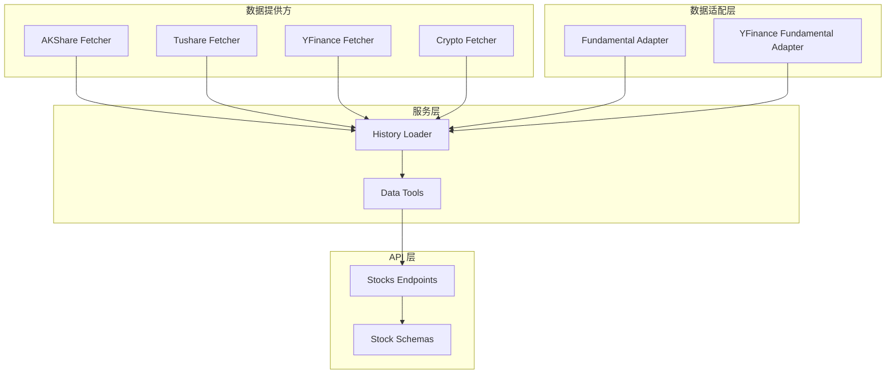
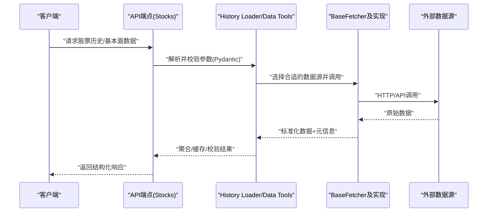
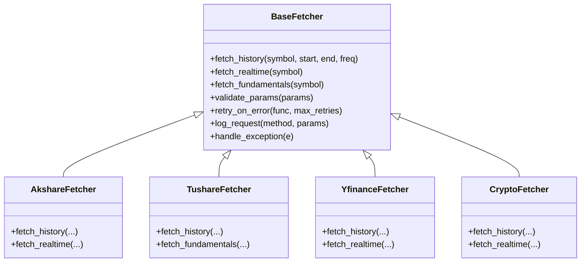
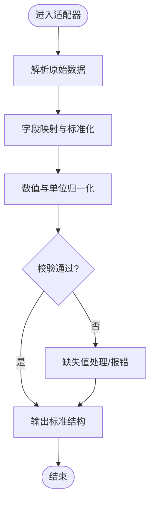
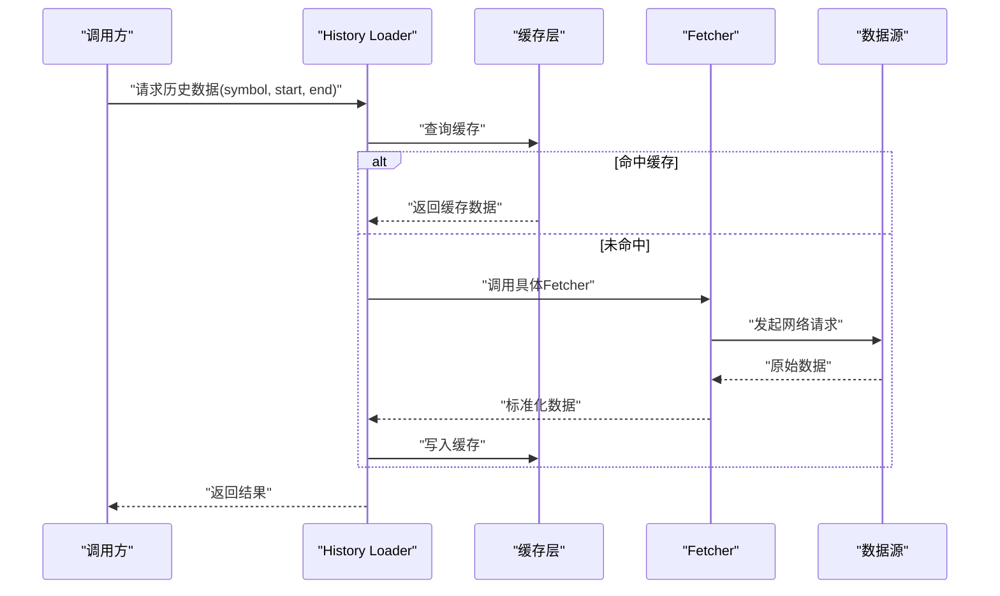
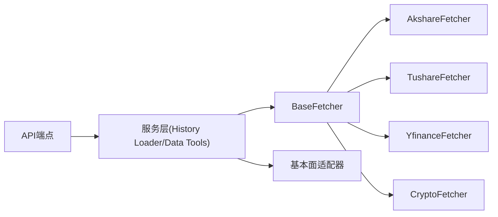

# 自定义数据源开发

<cite>
**本文引用的文件**   
- [data_provider/base.py](file://data_provider/base.py)
- [data_provider/fundamental_adapter.py](file://data_provider/fundamental_adapter.py)
- [data_provider/yfinance_fundamental_adapter.py](file://data_provider/yfinance_fundamental_adapter.py)
- [data_provider/akshare_fetcher.py](file://data_provider/akshare_fetcher.py)
- [data_provider/tushare_fetcher.py](file://data_provider/tushare_fetcher.py)
- [data_provider/yfinance_fetcher.py](file://data_provider/yfinance_fetcher.py)
- [data_provider/crypto_fetcher.py](file://data_provider/crypto_fetcher.py)
- [src/services/history_loader.py](file://src/services/history_loader.py)
- [src/services/data_tools.py](file://src/services/data_tools.py)
- [api/v1/endpoints/stocks.py](file://api/v1/endpoints/stocks.py)
- [api/v1/schemas/stocks.py](file://api/v1/schemas/stocks.py)
- [tests/test_tushare_fetcher_followups.py](file://tests/test_tushare_fetcher_followups.py)
- [tests/test_yfinance_normalize.py](file://tests/test_yfinance_normalize.py)
- [tests/test_crypto_fetcher.py](file://tests/test_crypto_fetcher.py)
- [tests/test_data_tools_daily_history_cache.py](file://tests/test_data_tools_daily_history_cache.py)
- [tests/test_pipeline_prefetch_dry_run.py](file://tests/test_pipeline_prefetch_dry_run.py)
</cite>

## 目录
1. [简介](#简介)
2. [项目结构](#项目结构)
3. [核心组件](#核心组件)
4. [架构总览](#架构总览)
5. [详细组件分析](#详细组件分析)
6. [依赖关系分析](#依赖关系分析)
7. [性能考虑](#性能考虑)
8. [故障排查指南](#故障排查指南)
9. [结论](#结论)
10. [附录](#附录)

## 简介
本指南面向希望在项目中新增“自定义数据源”的开发者，围绕 data_provider 模块与相关服务层展开。内容涵盖：
- 基于 BaseFetcher 基类实现新的数据提供商集成
- 数据源接口规范与数据格式标准化
- 错误处理模式与重试策略
- 基本面数据适配器、数据验证规则
- 缓存策略与监控日志
- 测试框架、调试工具与部署配置

目标是帮助你在不破坏现有系统的前提下，快速、稳定地接入新的行情或基本面数据源。

## 项目结构
本项目将数据获取能力集中在 data_provider 目录中，通过统一的基类抽象不同来源的差异；上层服务（如 history_loader、data_tools）以统一接口消费数据；API 层通过 Pydantic 模型对输入输出进行校验与序列化。

图表来源
- [data_provider/akshare_fetcher.py](file://data_provider/akshare_fetcher.py)
- [data_provider/tushare_fetcher.py](file://data_provider/tushare_fetcher.py)
- [data_provider/yfinance_fetcher.py](file://data_provider/yfinance_fetcher.py)
- [data_provider/crypto_fetcher.py](file://data_provider/crypto_fetcher.py)
- [data_provider/fundamental_adapter.py](file://data_provider/fundamental_adapter.py)
- [data_provider/yfinance_fundamental_adapter.py](file://data_provider/yfinance_fundamental_adapter.py)
- [src/services/history_loader.py](file://src/services/history_loader.py)
- [src/services/data_tools.py](file://src/services/data_tools.py)
- [api/v1/endpoints/stocks.py](file://api/v1/endpoints/stocks.py)
- [api/v1/schemas/stocks.py](file://api/v1/schemas/stocks.py)

章节来源
- [data_provider/base.py](file://data_provider/base.py)
- [src/services/history_loader.py](file://src/services/history_loader.py)
- [api/v1/endpoints/stocks.py](file://api/v1/endpoints/stocks.py)

## 核心组件
- BaseFetcher 基类：定义数据获取的统一接口、参数校验、异常封装、重试与限流等通用能力。
- 具体 Fetcher 实现：针对各数据源（如 AKShare、Tushare、YFinance、Crypto）提供差异化实现，屏蔽底层差异。
- 基本面适配器：将原始基本面数据转换为标准结构，供上层服务使用。
- History Loader / Data Tools：聚合多数据源，提供历史数据加载、缓存、去重、时间对齐等能力。
- API 层：通过 Pydantic 模型对请求/响应进行严格校验，保证数据一致性。

章节来源
- [data_provider/base.py](file://data_provider/base.py)
- [data_provider/fundamental_adapter.py](file://data_provider/fundamental_adapter.py)
- [data_provider/yfinance_fundamental_adapter.py](file://data_provider/yfinance_fundamental_adapter.py)
- [src/services/history_loader.py](file://src/services/history_loader.py)
- [src/services/data_tools.py](file://src/services/data_tools.py)
- [api/v1/schemas/stocks.py](file://api/v1/schemas/stocks.py)

## 架构总览
下图展示了从 API 到数据源的调用链路，以及数据在适配层与服务层的流转过程。

图表来源
- [api/v1/endpoints/stocks.py](file://api/v1/endpoints/stocks.py)
- [src/services/history_loader.py](file://src/services/history_loader.py)
- [src/services/data_tools.py](file://src/services/data_tools.py)
- [data_provider/base.py](file://data_provider/base.py)

## 详细组件分析

### BaseFetcher 基类与扩展点
- 职责
  - 定义统一的数据获取方法签名（如历史K线、实时报价、基本面指标）。
  - 提供公共的参数校验、超时控制、重试策略、速率限制、日志埋点。
  - 封装常见异常为领域异常，便于上层统一处理。
- 扩展方式
  - 继承 BaseFetcher，实现具体的 fetch_* 方法。
  - 覆盖必要的钩子（如认证、签名、分页、字段映射）。
  - 在 __init__ 中注入配置（密钥、代理、并发限制等）。

图表来源
- [data_provider/base.py](file://data_provider/base.py)
- [data_provider/akshare_fetcher.py](file://data_provider/akshare_fetcher.py)
- [data_provider/tushare_fetcher.py](file://data_provider/tushare_fetcher.py)
- [data_provider/yfinance_fetcher.py](file://data_provider/yfinance_fetcher.py)
- [data_provider/crypto_fetcher.py](file://data_provider/crypto_fetcher.py)

章节来源
- [data_provider/base.py](file://data_provider/base.py)

### 基本面数据适配器
- 目标
  - 将不同来源的基本面数据（如财务比率、估值指标）统一为标准结构。
  - 提供字段映射、单位换算、缺失值填充、类型转换。
- 关键能力
  - 字段名标准化（大小写、下划线命名）。
  - 数值精度与单位归一化（如百分比、货币单位）。
  - 缺失值策略（默认值、插值、标记）。
  - 校验规则（范围检查、必填字段）。

图表来源
- [data_provider/fundamental_adapter.py](file://data_provider/fundamental_adapter.py)
- [data_provider/yfinance_fundamental_adapter.py](file://data_provider/yfinance_fundamental_adapter.py)

章节来源
- [data_provider/fundamental_adapter.py](file://data_provider/fundamental_adapter.py)
- [data_provider/yfinance_fundamental_adapter.py](file://data_provider/yfinance_fundamental_adapter.py)

### 历史数据加载与缓存
- History Loader
  - 负责按时间窗口拉取历史数据，支持多源并行与回退。
  - 合并去重、时间对齐、缺失补齐。
- Data Tools
  - 提供常用数据处理函数（如复权、滚动统计、指标计算）。
  - 管理本地缓存（文件/内存），减少重复请求。

图表来源
- [src/services/history_loader.py](file://src/services/history_loader.py)
- [src/services/data_tools.py](file://src/services/data_tools.py)

章节来源
- [src/services/history_loader.py](file://src/services/history_loader.py)
- [src/services/data_tools.py](file://src/services/data_tools.py)

### API 层数据校验与响应
- 使用 Pydantic 模型对请求参数与响应体进行强类型校验。
- 统一错误码与消息格式，便于前端展示与排错。
- 支持分页、过滤、排序等通用查询能力。

章节来源
- [api/v1/endpoints/stocks.py](file://api/v1/endpoints/stocks.py)
- [api/v1/schemas/stocks.py](file://api/v1/schemas/stocks.py)

## 依赖关系分析
- 低耦合：Fetcher 仅依赖基础网络库与第三方 SDK，不直接耦合业务逻辑。
- 高内聚：每个 Fetcher 内部完成特定数据源的认证、分页、字段映射。
- 服务层解耦：History Loader/Data Tools 通过统一接口消费数据，屏蔽底层差异。
- API 层契约：Pydantic 模型确保前后端数据结构一致。

图表来源
- [api/v1/endpoints/stocks.py](file://api/v1/endpoints/stocks.py)
- [src/services/history_loader.py](file://src/services/history_loader.py)
- [src/services/data_tools.py](file://src/services/data_tools.py)
- [data_provider/base.py](file://data_provider/base.py)

章节来源
- [data_provider/base.py](file://data_provider/base.py)
- [src/services/history_loader.py](file://src/services/history_loader.py)

## 性能考虑
- 并发与限流
  - 合理设置并发度，避免触发上游限流。
  - 使用指数退避与抖动策略降低重试风暴风险。
- 缓存策略
  - 短期热点数据采用内存缓存，长期数据落盘。
  - 设置合理的过期时间与版本号，避免脏读。
- 数据裁剪
  - 按需拉取字段与时间窗口，减少传输体积。
  - 增量更新优先于全量刷新。
- 批处理与异步
  - 批量请求合并，减少握手开销。
  - 非阻塞 I/O 提升吞吐。

[本节为通用指导，无需代码引用]

## 故障排查指南
- 常见问题定位
  - 网络超时/连接失败：检查代理、DNS、防火墙与上游限流。
  - 认证失败：核对密钥、权限与有效期。
  - 数据不一致：对比多源数据，定位字段映射问题。
  - 缓存污染：清理缓存后重试，确认过期策略。
- 日志与追踪
  - 记录请求参数、耗时、状态码与异常堆栈。
  - 为每次请求生成唯一 trace_id，便于链路追踪。
- 单元测试与集成测试
  - 使用 Mock 模拟上游响应，覆盖边界条件。
  - 端到端测试验证完整链路。

章节来源
- [tests/test_tushare_fetcher_followups.py](file://tests/test_tushare_fetcher_followups.py)
- [tests/test_yfinance_normalize.py](file://tests/test_yfinance_normalize.py)
- [tests/test_crypto_fetcher.py](file://tests/test_crypto_fetcher.py)
- [tests/test_data_tools_daily_history_cache.py](file://tests/test_data_tools_daily_history_cache.py)
- [tests/test_pipeline_prefetch_dry_run.py](file://tests/test_pipeline_prefetch_dry_run.py)

## 结论
通过 BaseFetcher 抽象与适配器模式，项目实现了数据源的可插拔与高内聚。配合服务层的缓存与校验机制，以及 API 层的强类型契约，整体架构具备良好的可扩展性与稳定性。建议在新数据源接入时遵循本指南的接口规范、错误处理与性能优化实践，并通过完善的测试保障质量。

[本节为总结性内容，无需代码引用]

## 附录
- 新数据源接入清单
  - 继承 BaseFetcher，实现必要方法
  - 完成字段映射与单位归一化
  - 添加重试与限流配置
  - 编写单元测试与集成测试
  - 在 History Loader/Data Tools 中注册新源
  - 更新 API 文档与示例
- 调试技巧
  - 开启详细日志与请求追踪
  - 使用本地 Mock 数据快速验证
  - 逐步放大并发观察瓶颈
- 部署配置
  - 环境变量：密钥、代理、超时、重试次数
  - 资源配额：CPU/内存上限与线程池大小
  - 健康检查：数据源可用性探针

[本节为补充说明，无需代码引用]