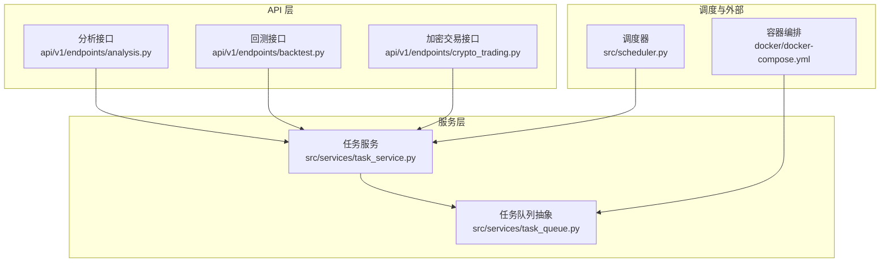
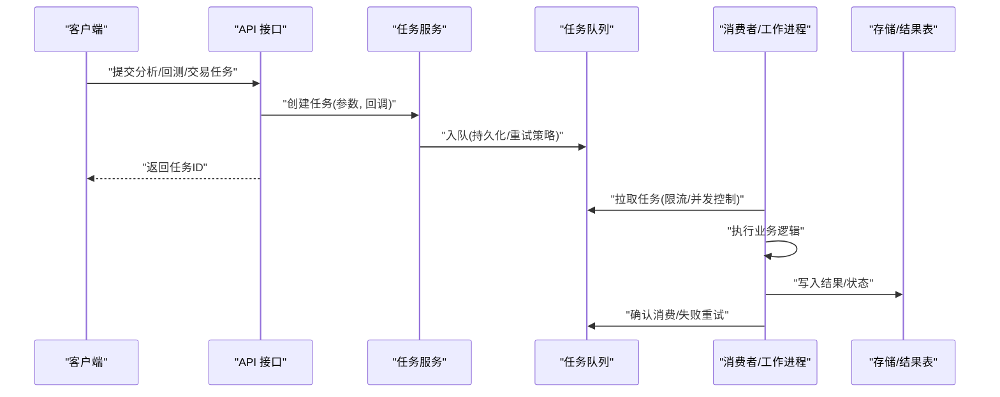
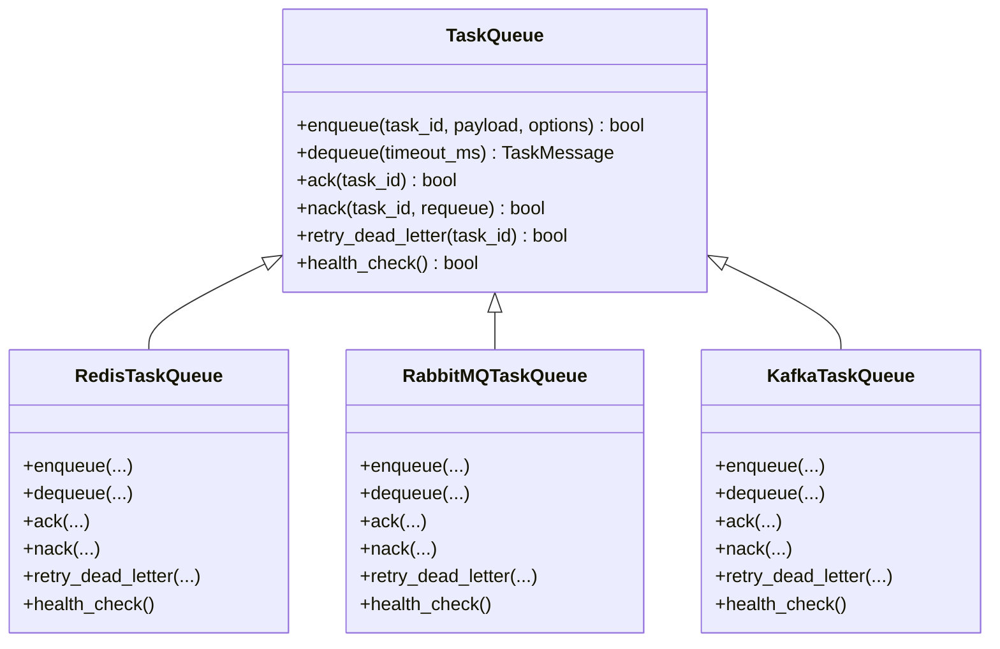
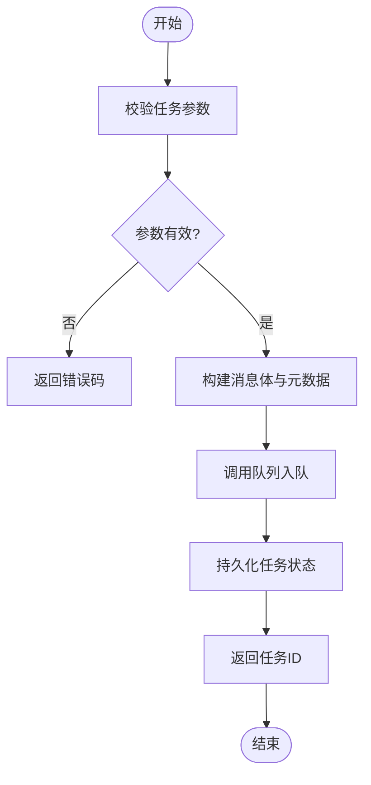
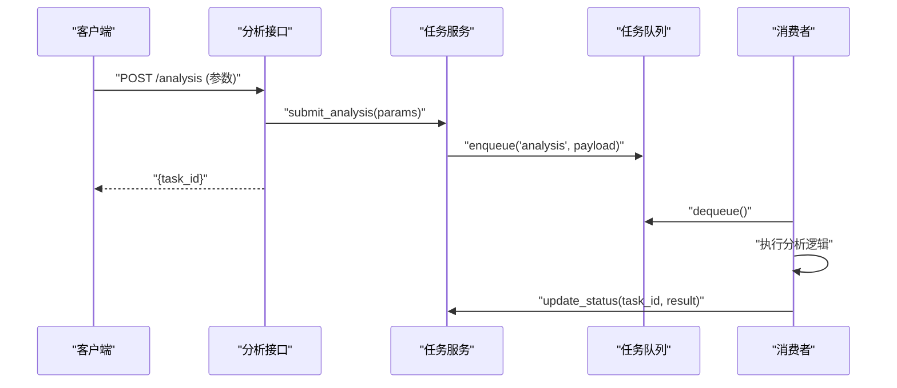
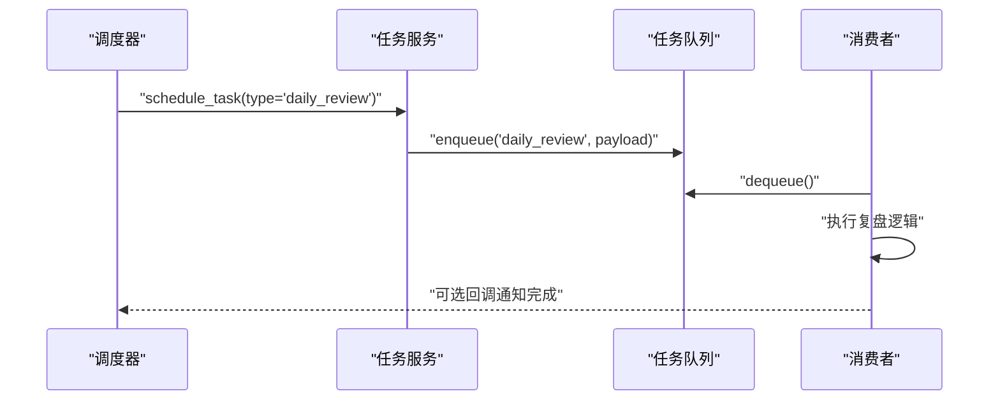
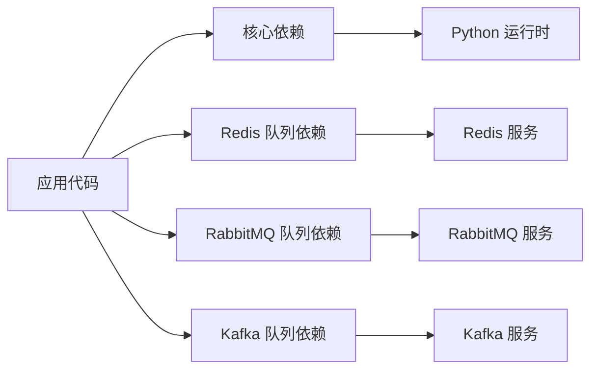

# 消息队列集成

<cite>
**本文引用的文件**   
- [src/services/task_queue.py](file://src/services/task_queue.py)
- [src/services/task_service.py](file://src/services/task_service.py)
- [api/v1/endpoints/analysis.py](file://api/v1/endpoints/analysis.py)
- [api/v1/endpoints/backtest.py](file://api/v1/endpoints/backtest.py)
- [api/v1/endpoints/crypto_trading.py](file://api/v1/endpoints/crypto_trading.py)
- [src/scheduler.py](file://src/scheduler.py)
- [docker/docker-compose.yml](file://docker/docker-compose.yml)
- [pyproject.toml](file://pyproject.toml)
- [requirements.txt](file://requirements.txt)
</cite>

## 目录
1. [简介](#简介)
2. [项目结构](#项目结构)
3. [核心组件](#核心组件)
4. [架构总览](#架构总览)
5. [详细组件分析](#详细组件分析)
6. [依赖分析](#依赖分析)
7. [性能考虑](#性能考虑)
8. [故障排查指南](#故障排查指南)
9. [结论](#结论)
10. [附录](#附录)

## 简介
本文件面向需要在系统中集成消息队列（Redis、RabbitMQ、Kafka）的开发者，提供从配置到生产消费、持久化与故障恢复的完整实践。结合当前代码库中的任务队列与服务层实现，文档给出：
- 队列配置与环境变量管理
- 生产者/消费者模式与异步任务处理
- 高并发场景下的吞吐与稳定性设计
- 常见故障定位与恢复策略

## 项目结构
本项目采用分层组织：API 层暴露接口，服务层封装业务逻辑，任务队列作为异步执行通道，调度器负责定时任务触发，容器编排用于部署依赖（如 Redis/RabbitMQ/Kafka）。

图表来源
- [api/v1/endpoints/analysis.py](file://api/v1/endpoints/analysis.py)
- [api/v1/endpoints/backtest.py](file://api/v1/endpoints/backtest.py)
- [api/v1/endpoints/crypto_trading.py](file://api/v1/endpoints/crypto_trading.py)
- [src/services/task_service.py](file://src/services/task_service.py)
- [src/services/task_queue.py](file://src/services/task_queue.py)
- [src/scheduler.py](file://src/scheduler.py)
- [docker/docker-compose.yml](file://docker/docker-compose.yml)

章节来源
- [src/services/task_queue.py](file://src/services/task_queue.py)
- [src/services/task_service.py](file://src/services/task_service.py)
- [api/v1/endpoints/analysis.py](file://api/v1/endpoints/analysis.py)
- [api/v1/endpoints/backtest.py](file://api/v1/endpoints/backtest.py)
- [api/v1/endpoints/crypto_trading.py](file://api/v1/endpoints/crypto_trading.py)
- [src/scheduler.py](file://src/scheduler.py)
- [docker/docker-compose.yml](file://docker/docker-compose.yml)

## 核心组件
- 任务队列抽象：统一生产者/消费者接口，屏蔽底层队列差异（Redis、RabbitMQ、Kafka），支持持久化、重试与幂等。
- 任务服务：将 API 请求或调度事件转化为任务，提交至队列并返回任务 ID；消费者侧执行业务逻辑并写回结果。
- 调度器：定时触发任务（如每日市场复盘、指标计算），通过任务服务入队。
- 容器编排：定义队列中间件运行环境与网络，便于本地与生产环境一致。

章节来源
- [src/services/task_queue.py](file://src/services/task_queue.py)
- [src/services/task_service.py](file://src/services/task_service.py)
- [src/scheduler.py](file://src/scheduler.py)
- [docker/docker-compose.yml](file://docker/docker-compose.yml)

## 架构总览
下图展示“API/调度 → 任务服务 → 队列 → 消费者”的端到端流程，强调异步解耦与可扩展性。

图表来源
- [api/v1/endpoints/analysis.py](file://api/v1/endpoints/analysis.py)
- [api/v1/endpoints/backtest.py](file://api/v1/endpoints/backtest.py)
- [api/v1/endpoints/crypto_trading.py](file://api/v1/endpoints/crypto_trading.py)
- [src/services/task_service.py](file://src/services/task_service.py)
- [src/services/task_queue.py](file://src/services/task_queue.py)

## 详细组件分析

### 任务队列抽象（Redis/RabbitMQ/Kafka）
- 目标：为不同队列提供一致的入队/出队/重试/死信/监控能力。
- 关键能力：
  - 连接池与心跳检测
  - 消息序列化与版本兼容
  - 幂等键与去重
  - 延迟队列与优先级队列
  - 死信队列与告警
- 扩展点：新增队列类型只需实现统一接口，并在配置中心注册。

图表来源
- [src/services/task_queue.py](file://src/services/task_queue.py)

章节来源
- [src/services/task_queue.py](file://src/services/task_queue.py)

### 任务服务（生产者/消费者协调）
- 职责：
  - 接收 API/调度器的任务请求，生成唯一任务 ID
  - 根据任务类型选择队列与路由策略
  - 维护任务生命周期（排队中、执行中、成功、失败、重试）
  - 提供查询与回调机制
- 典型流程：
  - 入队：校验参数、构建消息体、设置重试与超时、写入持久化
  - 出队：消费者按容量拉取、分配工作线程/协程
  - 完成：更新状态、触发回调、清理资源

图表来源
- [src/services/task_service.py](file://src/services/task_service.py)

章节来源
- [src/services/task_service.py](file://src/services/task_service.py)

### API 层集成示例（分析/回测/加密交易）
- 分析接口：提交分析任务，立即返回任务 ID，前端轮询或 SSE 推送结果。
- 回测接口：批量任务分片入队，支持进度与断点续跑。
- 加密交易接口：对风控敏感的任务启用严格重试与审计日志。

图表来源
- [api/v1/endpoints/analysis.py](file://api/v1/endpoints/analysis.py)
- [src/services/task_service.py](file://src/services/task_service.py)
- [src/services/task_queue.py](file://src/services/task_queue.py)

章节来源
- [api/v1/endpoints/analysis.py](file://api/v1/endpoints/analysis.py)
- [api/v1/endpoints/backtest.py](file://api/v1/endpoints/backtest.py)
- [api/v1/endpoints/crypto_trading.py](file://api/v1/endpoints/crypto_trading.py)
- [src/services/task_service.py](file://src/services/task_service.py)

### 调度器与定时任务
- 作用：周期性触发任务（如每日市场复盘、指标刷新），通过任务服务入队，避免阻塞主进程。
- 特性：可配置 Cron 表达式、任务去重、失败告警。

图表来源
- [src/scheduler.py](file://src/scheduler.py)
- [src/services/task_service.py](file://src/services/task_service.py)
- [src/services/task_queue.py](file://src/services/task_queue.py)

章节来源
- [src/scheduler.py](file://src/scheduler.py)
- [src/services/task_service.py](file://src/services/task_service.py)

### 容器编排与依赖
- 使用 docker-compose 启动 Redis/RabbitMQ/Kafka 等服务，统一端口与网络，便于开发与测试。
- 环境变量集中管理，确保各组件连接信息一致。

章节来源
- [docker/docker-compose.yml](file://docker/docker-compose.yml)

## 依赖分析
- 运行时依赖：Python 包管理与依赖声明位于 pyproject.toml 与 requirements.txt。
- 队列依赖：Redis、pika（RabbitMQ）、kafka-python 等按需引入。
- 建议：在 pyproject.toml 中按功能划分依赖组（core、queue-redis、queue-rabbitmq、queue-kafka），减少安装体积。

图表来源
- [pyproject.toml](file://pyproject.toml)
- [requirements.txt](file://requirements.txt)

章节来源
- [pyproject.toml](file://pyproject.toml)
- [requirements.txt](file://requirements.txt)

## 性能考虑
- 生产者
  - 批量入队与压缩，降低网络开销
  - 异步非阻塞发送，配合连接池
  - 消息去重与幂等键，避免重复处理
- 消费者
  - 多进程/多线程/协程并行，按 CPU/IO 类型调整
  - 拉取批大小与最大并发限制，防止雪崩
  - 优雅关闭与检查点，保证中断后恢复
- 队列
  - 分区与分片，提升吞吐
  - 持久化与副本，保障可靠性
  - 监控指标：积压量、消费延迟、失败率、重试次数

[本节为通用指导，不直接分析具体文件]

## 故障排查指南
- 常见问题
  - 连接失败：检查网络、认证、端口与防火墙
  - 消息丢失：确认持久化开关、ACK 机制与事务
  - 重复消费：幂等键与去重策略是否生效
  - 消费缓慢：消费者数量、批大小、CPU/IO 瓶颈
  - 死信堆积：查看失败原因与重试上限
- 诊断步骤
  - 查看队列监控与日志
  - 回放失败消息，复现场景
  - 逐步缩小范围（单消费者/单分区）
  - 压测验证修复效果

[本节为通用指导，不直接分析具体文件]

## 结论
通过统一的队列抽象与服务层协调，系统实现了稳定可靠的异步任务处理。结合容器化与监控，可在高并发与复杂业务场景下保持弹性与可观测性。推荐在生产环境优先评估可靠性（持久化、ACK、死信）与可观测性（指标、日志、追踪），再逐步优化吞吐与成本。

[本节为总结性内容，不直接分析具体文件]

## 附录
- 配置清单（示例）
  - 队列类型：redis/rabbitmq/kafka
  - 连接信息：host、port、vhost/topic、用户名/密码
  - 持久化：enable_persistence=true/false
  - 重试策略：max_retries、backoff_type、dead_letter_queue
  - 并发控制：worker_count、batch_size、timeout_ms
- 最佳实践
  - 消息体版本化与兼容性校验
  - 任务幂等设计与幂等键
  - 分级队列与优先级
  - 灰度发布与流量切换
  - 定期演练故障恢复

[本节为补充信息，不直接分析具体文件]