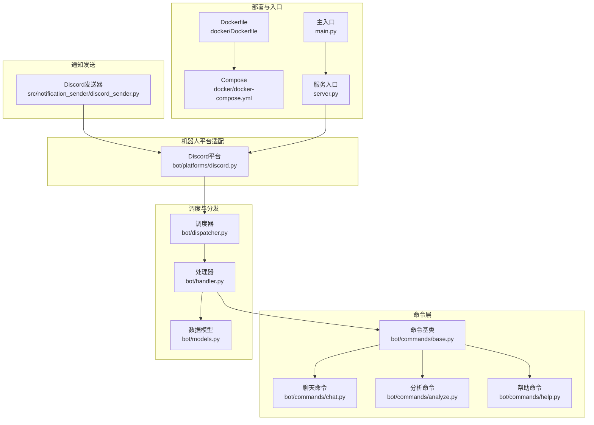
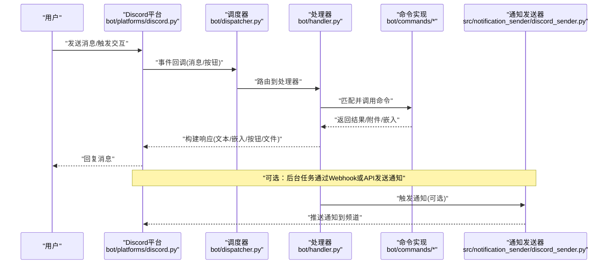
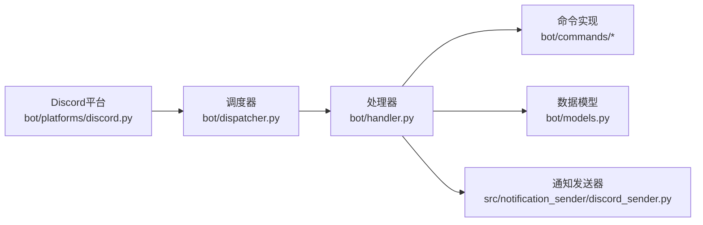

# Discord机器人集成

<cite>
**本文引用的文件**   
- [bot/platforms/discord.py](file://bot/platforms/discord.py)
- [bot/dispatcher.py](file://bot/dispatcher.py)
- [bot/handler.py](file://bot/handler.py)
- [bot/models.py](file://bot/models.py)
- [bot/commands/base.py](file://bot/commands/base.py)
- [bot/commands/chat.py](file://bot/commands/chat.py)
- [bot/commands/analyze.py](file://bot/commands/analyze.py)
- [bot/commands/help.py](file://bot/commands/help.py)
- [src/notification_sender/discord_sender.py](file://src/notification_sender/discord_sender.py)
- [docs/bot/discord-bot-config.md](file://docs/bot/discord-bot-config.md)
- [docker/Dockerfile](file://docker/Dockerfile)
- [docker/docker-compose.yml](file://docker/docker-compose.yml)
- [server.py](file://server.py)
- [main.py](file://main.py)
</cite>

## 目录
1. [简介](#简介)
2. [项目结构](#项目结构)
3. [核心组件](#核心组件)
4. [架构总览](#架构总览)
5. [详细组件分析](#详细组件分析)
6. [依赖关系分析](#依赖关系分析)
7. [性能考量](#性能考量)
8. [故障排查指南](#故障排查指南)
9. [结论](#结论)
10. [附录](#附录)

## 简介
本文件面向希望在项目中集成Discord机器人的开发者，提供从应用创建、Bot用户配置（含OAuth2与权限）、到基于discord.py的异步消息处理架构的完整说明。文档涵盖事件监听、命令注册与消息路由流程，给出配置示例与自定义命令开发指南，并扩展嵌入消息、按钮交互与文件上传等高级能力。最后提供部署与监控日志的最佳实践，帮助你在生产环境中稳定运行Discord机器人。

## 项目结构
本项目将Discord平台适配放在bot/platforms下，命令逻辑在bot/commands中，统一调度与分发由bot/dispatcher.py与bot/handler.py负责。通知发送模块位于src/notification_sender/discord_sender.py，用于系统级通知推送至Discord。Docker相关配置在docker目录下，便于容器化部署。

图表来源
- [bot/platforms/discord.py](file://bot/platforms/discord.py)
- [bot/dispatcher.py](file://bot/dispatcher.py)
- [bot/handler.py](file://bot/handler.py)
- [bot/models.py](file://bot/models.py)
- [bot/commands/base.py](file://bot/commands/base.py)
- [bot/commands/chat.py](file://bot/commands/chat.py)
- [bot/commands/analyze.py](file://bot/commands/analyze.py)
- [bot/commands/help.py](file://bot/commands/help.py)
- [src/notification_sender/discord_sender.py](file://src/notification_sender/discord_sender.py)
- [docker/Dockerfile](file://docker/Dockerfile)
- [docker/docker-compose.yml](file://docker/docker-compose.yml)
- [server.py](file://server.py)
- [main.py](file://main.py)

章节来源
- [bot/platforms/discord.py](file://bot/platforms/discord.py)
- [bot/dispatcher.py](file://bot/dispatcher.py)
- [bot/handler.py](file://bot/handler.py)
- [bot/models.py](file://bot/models.py)
- [bot/commands/base.py](file://bot/commands/base.py)
- [bot/commands/chat.py](file://bot/commands/chat.py)
- [bot/commands/analyze.py](file://bot/commands/analyze.py)
- [bot/commands/help.py](file://bot/commands/help.py)
- [src/notification_sender/discord_sender.py](file://src/notification_sender/discord_sender.py)
- [docker/Dockerfile](file://docker/Dockerfile)
- [docker/docker-compose.yml](file://docker/docker-compose.yml)
- [server.py](file://server.py)
- [main.py](file://main.py)

## 核心组件
- Discord平台适配：封装discord.py客户端生命周期、事件回调、命令注册与交互响应，屏蔽底层API差异。
- 命令框架：统一的命令基类与具体命令实现，支持参数解析、上下文注入与错误处理。
- 调度与分发：集中管理事件到命令的路由，保证异步并发与线程安全。
- 通知发送：通过Discord Webhook或Bot API将系统通知推送到指定频道。
- 配置与部署：环境变量驱动配置，Docker一键启动，便于开发与生产环境一致性。

章节来源
- [bot/platforms/discord.py](file://bot/platforms/discord.py)
- [bot/commands/base.py](file://bot/commands/base.py)
- [bot/dispatcher.py](file://bot/dispatcher.py)
- [bot/handler.py](file://bot/handler.py)
- [src/notification_sender/discord_sender.py](file://src/notification_sender/discord_sender.py)

## 架构总览
下图展示了Discord机器人从事件接入到命令执行与结果返回的整体流程，包括消息路由、命令处理、嵌入消息与按钮交互、以及文件上传路径。

图表来源
- [bot/platforms/discord.py](file://bot/platforms/discord.py)
- [bot/dispatcher.py](file://bot/dispatcher.py)
- [bot/handler.py](file://bot/handler.py)
- [bot/commands/chat.py](file://bot/commands/chat.py)
- [bot/commands/analyze.py](file://bot/commands/analyze.py)
- [src/notification_sender/discord_sender.py](file://src/notification_sender/discord_sender.py)

## 详细组件分析

### Discord平台适配（bot/platforms/discord.py）
- 职责：初始化discord.py客户端，加载Token与Intents，注册事件监听与命令；处理消息、交互回调，统一错误捕获与重试策略。
- 关键点：
  - 使用Intents订阅必要事件（如消息内容、成员信息、反应等），避免权限不足。
  - 命令注册采用装饰器或显式注册方式，支持前缀与斜杠命令。
  - 对长耗时操作进行异步处理，避免阻塞事件循环。
  - 支持嵌入消息、按钮组件与文件上传，提升交互体验。
- 建议：
  - 将敏感配置（Token、Channel ID）放入环境变量，避免硬编码。
  - 为每个命令设置超时与降级策略，确保整体稳定性。

章节来源
- [bot/platforms/discord.py](file://bot/platforms/discord.py)

### 命令框架（bot/commands/base.py及子命令）
- 职责：定义命令基类，提供参数解析、上下文注入、权限校验与错误处理；具体命令（聊天、分析、帮助等）继承基类实现业务逻辑。
- 关键点：
  - 命令元数据（名称、描述、参数、权限）集中管理，便于自动生成帮助。
  - 支持异步执行，允许并发调用外部服务。
  - 统一输出格式（文本、嵌入、附件），便于前端展示与日志追踪。
- 扩展：
  - 新增命令只需继承基类并实现核心方法，即可自动注册与路由。

章节来源
- [bot/commands/base.py](file://bot/commands/base.py)
- [bot/commands/chat.py](file://bot/commands/chat.py)
- [bot/commands/analyze.py](file://bot/commands/analyze.py)
- [bot/commands/help.py](file://bot/commands/help.py)

### 调度与分发（bot/dispatcher.py与bot/handler.py）
- 职责：接收平台事件，按规则路由到对应命令处理器；维护命令注册表与优先级，处理并发与异常。
- 关键点：
  - 事件到命令的映射可配置，支持通配符与正则匹配。
  - 处理器链式调用，支持中间件（鉴权、限流、审计）。
  - 错误统一收集与上报，便于监控与告警。

章节来源
- [bot/dispatcher.py](file://bot/dispatcher.py)
- [bot/handler.py](file://bot/handler.py)

### 数据模型（bot/models.py）
- 职责：定义命令输入、上下文、响应结构与枚举类型，确保跨模块数据一致性。
- 关键点：
  - 使用Pydantic或等价库进行数据校验与序列化。
  - 提供默认值与可选字段，增强鲁棒性。

章节来源
- [bot/models.py](file://bot/models.py)

### 通知发送（src/notification_sender/discord_sender.py）
- 职责：通过Discord Webhook或Bot API发送系统通知，支持嵌入消息与附件。
- 关键点：
  - 支持多目标频道与队列化发送，避免瞬时峰值导致限流。
  - 失败重试与退避策略，提高可靠性。

章节来源
- [src/notification_sender/discord_sender.py](file://src/notification_sender/discord_sender.py)

### 配置与部署（docs/bot/discord-bot-config.md、docker/Dockerfile、docker/docker-compose.yml）
- 职责：提供Discord应用创建、Bot权限配置与环境变量说明；容器化打包与编排，简化部署。
- 关键点：
  - 环境变量包括Bot Token、Intents、Channel ID、Webhook URL等。
  - Docker镜像包含运行时依赖，Compose定义服务间依赖与端口映射。
  - 支持热重载与调试模式，便于本地开发。

章节来源
- [docs/bot/discord-bot-config.md](file://docs/bot/discord-bot-config.md)
- [docker/Dockerfile](file://docker/Dockerfile)
- [docker/docker-compose.yml](file://docker/docker-compose.yml)

## 依赖关系分析
- 内部依赖：
  - Discord平台适配依赖命令框架与调度器，形成“事件→调度→命令”的单向流。
  - 通知发送器独立于命令层，可通过事件或定时任务触发。
- 外部依赖：
  - discord.py作为核心SDK，需正确配置Intents与权限。
  - 环境变量驱动配置，避免代码耦合。

图表来源
- [bot/platforms/discord.py](file://bot/platforms/discord.py)
- [bot/dispatcher.py](file://bot/dispatcher.py)
- [bot/handler.py](file://bot/handler.py)
- [bot/commands/base.py](file://bot/commands/base.py)
- [bot/models.py](file://bot/models.py)
- [src/notification_sender/discord_sender.py](file://src/notification_sender/discord_sender.py)

章节来源
- [bot/platforms/discord.py](file://bot/platforms/discord.py)
- [bot/dispatcher.py](file://bot/dispatcher.py)
- [bot/handler.py](file://bot/handler.py)
- [bot/commands/base.py](file://bot/commands/base.py)
- [bot/models.py](file://bot/models.py)
- [src/notification_sender/discord_sender.py](file://src/notification_sender/discord_sender.py)

## 性能考量
- 异步优先：所有IO操作（HTTP、数据库、文件）必须异步执行，避免阻塞事件循环。
- 并发控制：对高负载命令使用信号量或队列限制并发数，防止资源耗尽。
- 缓存策略：对频繁查询的数据（如股票索引、市场状态）进行内存或Redis缓存。
- 限流与退避：遵循Discord API速率限制，实现指数退避与熔断。
- 日志分级：区分INFO/WARN/ERROR，关键路径添加结构化日志，便于追踪。

[本节为通用指导，不直接分析具体文件]

## 故障排查指南
- 常见问题：
  - Token无效或权限不足：检查环境变量与Discord应用权限设置。
  - 事件未触发：确认Intents已启用且订阅了所需事件。
  - 命令无响应：查看调度器日志与命令超时配置。
  - 通知发送失败：验证Webhook URL与网络连通性。
- 诊断步骤：
  - 启用调试日志，定位错误堆栈。
  - 使用健康检查端点验证服务状态。
  - 逐步隔离问题模块（平台适配、调度、命令、通知）。

章节来源
- [bot/platforms/discord.py](file://bot/platforms/discord.py)
- [bot/dispatcher.py](file://bot/dispatcher.py)
- [bot/handler.py](file://bot/handler.py)
- [src/notification_sender/discord_sender.py](file://src/notification_sender/discord_sender.py)

## 结论
本集成方案以模块化设计实现Discord机器人功能，覆盖从事件接入、命令处理到通知发送的全链路。通过环境变量与容器化部署，确保开发与生产环境一致。建议在生产环境中加强监控与日志采集，结合限流与缓存优化性能，提升系统稳定性与用户体验。

[本节为总结，不直接分析具体文件]

## 附录

### Discord应用创建与Bot配置要点
- 创建应用与Bot用户：在Discord开发者门户创建应用，启用Bot用户并复制Token。
- OAuth2设置：配置重定向URI（如需网页授权），选择必要的OAuth2权限范围。
- 服务器权限：在Bot用户权限页勾选所需权限（如发送消息、读取消息、嵌入链接、上传文件等）。
- Intents配置：启用消息内容Intent以解析用户输入，按需启用其他事件Intent。

章节来源
- [docs/bot/discord-bot-config.md](file://docs/bot/discord-bot-config.md)

### 基于discord.py的异步消息处理架构
- 事件监听：注册on_message、on_interaction等回调，统一交由调度器处理。
- 命令注册：使用装饰器或显式注册，支持前缀与斜杠命令，自动生成功能列表。
- 消息路由：根据命令名与参数匹配处理器，支持中间件链（鉴权、限流、审计）。

章节来源
- [bot/platforms/discord.py](file://bot/platforms/discord.py)
- [bot/dispatcher.py](file://bot/dispatcher.py)
- [bot/handler.py](file://bot/handler.py)

### 配置示例与环境变量
- Bot Token：用于认证Discord API。
- Channel ID：指定接收消息的频道ID。
- Webhook URL：用于通知发送。
- Intents：启用消息内容与其他必要事件。

章节来源
- [docs/bot/discord-bot-config.md](file://docs/bot/discord-bot-config.md)

### 自定义命令开发指南
- 继承命令基类，实现核心方法（参数解析、业务逻辑、响应构建）。
- 注册命令元数据（名称、描述、参数、权限），便于帮助生成与路由。
- 使用异步函数处理耗时操作，避免阻塞事件循环。

章节来源
- [bot/commands/base.py](file://bot/commands/base.py)
- [bot/commands/chat.py](file://bot/commands/chat.py)
- [bot/commands/analyze.py](file://bot/commands/analyze.py)

### 高级功能：嵌入消息、按钮交互与文件上传
- 嵌入消息：使用Embed对象构建富文本，支持标题、描述、字段与图片。
- 按钮交互：注册Button组件，处理回调事件，实现交互式工作流。
- 文件上传：支持图片、PDF等附件，注意大小限制与格式校验。

章节来源
- [bot/platforms/discord.py](file://bot/platforms/discord.py)
- [src/notification_sender/discord_sender.py](file://src/notification_sender/discord_sender.py)

### 部署配置与监控日志最佳实践
- 容器化：使用Docker镜像打包依赖，Compose编排服务与端口映射。
- 环境变量：集中管理敏感配置，避免硬编码。
- 日志采集：结构化日志输出，结合ELK或云原生日志服务进行分析。
- 健康检查：暴露健康端点，配合负载均衡与健康探针。

章节来源
- [docker/Dockerfile](file://docker/Dockerfile)
- [docker/docker-compose.yml](file://docker/docker-compose.yml)
- [server.py](file://server.py)
- [main.py](file://main.py)