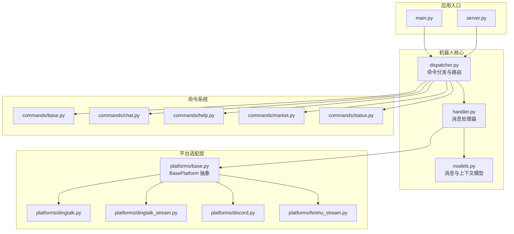
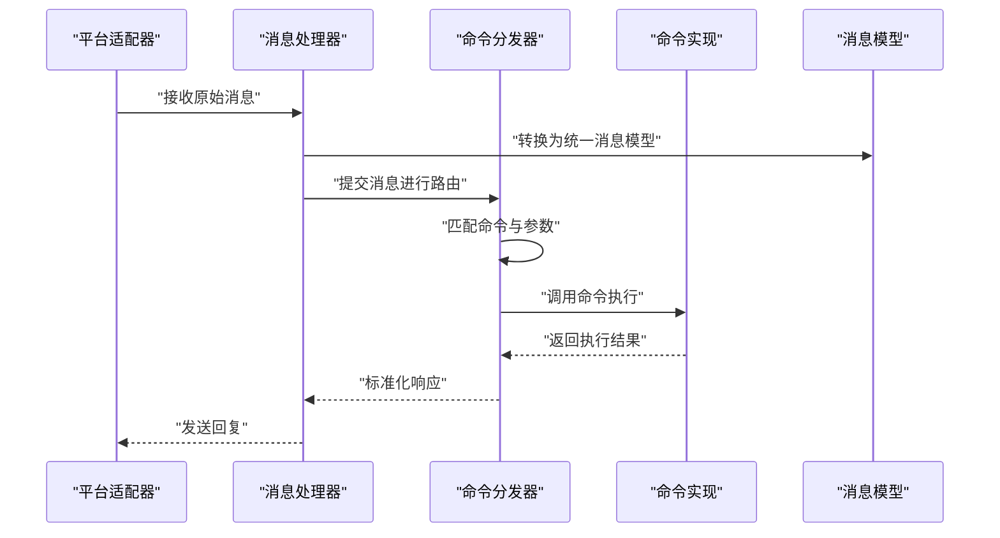
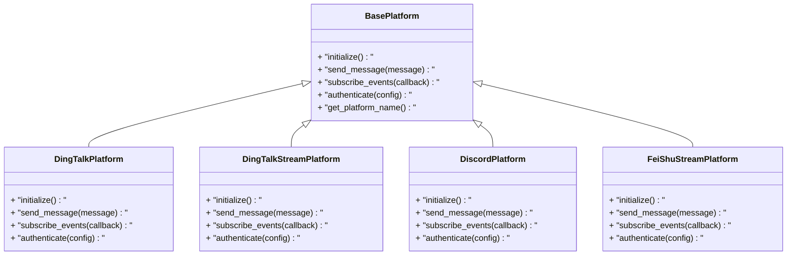
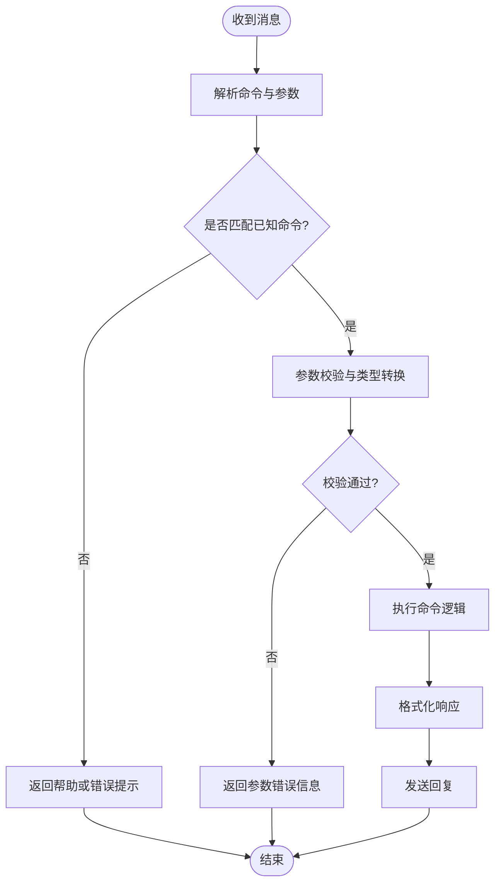
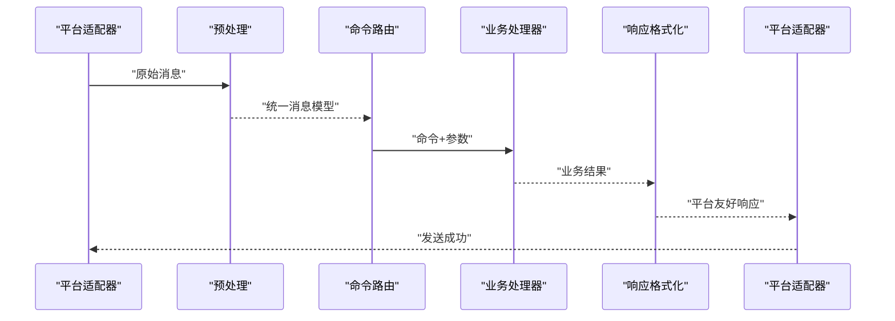
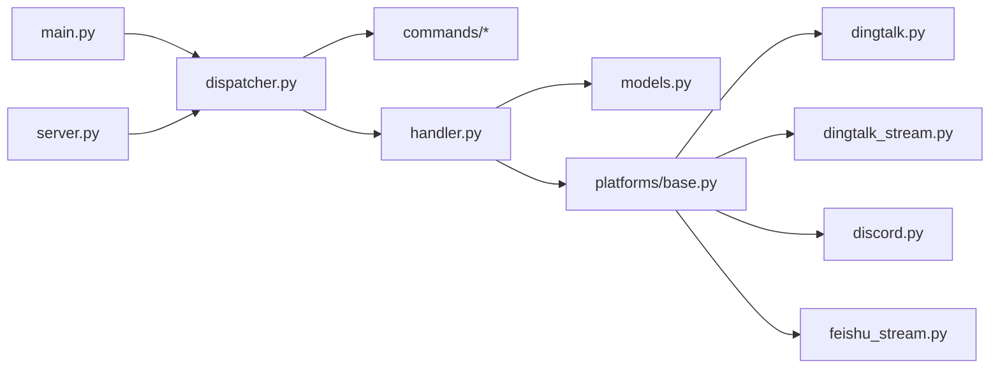

# 机器人框架架构

<cite>
**本文档引用的文件**   
- [bot/dispatcher.py](file://bot/dispatcher.py)
- [bot/handler.py](file://bot/handler.py)
- [bot/models.py](file://bot/models.py)
- [bot/platforms/base.py](file://bot/platforms/base.py)
- [bot/platforms/dingtalk.py](file://bot/platforms/dingtalk.py)
- [bot/platforms/dingtalk_stream.py](file://bot/platforms/dingtalk_stream.py)
- [bot/platforms/discord.py](file://bot/platforms/discord.py)
- [bot/platforms/feishu_stream.py](file://bot/platforms/feishu_stream.py)
- [bot/commands/base.py](file://bot/commands/base.py)
- [bot/commands/chat.py](file://bot/commands/chat.py)
- [bot/commands/help.py](file://bot/commands/help.py)
- [bot/commands/market.py](file://bot/commands/market.py)
- [bot/commands/status.py](file://bot/commands/status.py)
- [main.py](file://main.py)
- [server.py](file://server.py)
</cite>

## 目录
1. [简介](#简介)
2. [项目结构](#项目结构)
3. [核心组件](#核心组件)
4. [架构总览](#架构总览)
5. [详细组件分析](#详细组件分析)
6. [依赖关系分析](#依赖关系分析)
7. [性能考量](#性能考量)
8. [故障排查指南](#故障排查指南)
9. [结论](#结论)
10. [附录](#附录)

## 简介
本文件面向机器人框架的架构与实现，重点阐述统一的平台抽象层设计（BasePlatform 基类与平台适配器模式）、命令分发机制（注册、参数解析与执行）、消息处理管道（预处理、业务逻辑处理、响应格式化），以及自定义平台适配器的开发指南和扩展点说明。文档力求以循序渐进的方式帮助读者理解并扩展该框架。

## 项目结构
机器人相关代码主要位于 bot 目录，包含平台适配、命令系统与调度器；应用入口在 main.py 与 server.py。整体采用分层与插件化设计：平台层屏蔽不同 IM 的差异，命令层提供统一指令模型，调度器负责路由与生命周期管理。

图表来源
- [main.py](file://main.py)
- [server.py](file://server.py)
- [bot/dispatcher.py](file://bot/dispatcher.py)
- [bot/handler.py](file://bot/handler.py)
- [bot/models.py](file://bot/models.py)
- [bot/platforms/base.py](file://bot/platforms/base.py)
- [bot/platforms/dingtalk.py](file://bot/platforms/dingtalk.py)
- [bot/platforms/dingtalk_stream.py](file://bot/platforms/dingtalk_stream.py)
- [bot/platforms/discord.py](file://bot/platforms/discord.py)
- [bot/platforms/feishu_stream.py](file://bot/platforms/feishu_stream.py)
- [bot/commands/base.py](file://bot/commands/base.py)
- [bot/commands/chat.py](file://bot/commands/chat.py)
- [bot/commands/help.py](file://bot/commands/help.py)
- [bot/commands/market.py](file://bot/commands/market.py)
- [bot/commands/status.py](file://bot/commands/status.py)

章节来源
- [main.py](file://main.py)
- [server.py](file://server.py)
- [bot/dispatcher.py](file://bot/dispatcher.py)
- [bot/handler.py](file://bot/handler.py)
- [bot/models.py](file://bot/models.py)
- [bot/platforms/base.py](file://bot/platforms/base.py)
- [bot/platforms/dingtalk.py](file://bot/platforms/dingtalk.py)
- [bot/platforms/dingtalk_stream.py](file://bot/platforms/dingtalk_stream.py)
- [bot/platforms/discord.py](file://bot/platforms/discord.py)
- [bot/platforms/feishu_stream.py](file://bot/platforms/feishu_stream.py)
- [bot/commands/base.py](file://bot/commands/base.py)
- [bot/commands/chat.py](file://bot/commands/chat.py)
- [bot/commands/help.py](file://bot/commands/help.py)
- [bot/commands/market.py](file://bot/commands/market.py)
- [bot/commands/status.py](file://bot/commands/status.py)

## 核心组件
- BasePlatform 抽象层：定义平台无关的消息收发、会话状态、认证与配置等接口，所有具体平台（钉钉、飞书、Discord）均继承该基类以实现差异化细节。
- 命令系统：通过命令基类定义命令元数据（名称、描述、参数、权限等），各命令模块实现具体业务逻辑，并由分发器统一注册与路由。
- 分发器与处理器：分发器负责将原始消息转换为统一模型，匹配命令并调用对应处理器；处理器完成参数校验、业务编排与结果返回。
- 模型层：统一消息、用户、会话、上下文等数据结构，确保跨平台一致性。

章节来源
- [bot/platforms/base.py](file://bot/platforms/base.py)
- [bot/commands/base.py](file://bot/commands/base.py)
- [bot/dispatcher.py](file://bot/dispatcher.py)
- [bot/handler.py](file://bot/handler.py)
- [bot/models.py](file://bot/models.py)

## 架构总览
下图展示了从平台接入到命令执行的端到端流程，强调“平台抽象—消息模型—命令分发—业务处理—响应输出”的分层解耦。

图表来源
- [bot/platforms/base.py](file://bot/platforms/base.py)
- [bot/handler.py](file://bot/handler.py)
- [bot/dispatcher.py](file://bot/dispatcher.py)
- [bot/models.py](file://bot/models.py)
- [bot/commands/base.py](file://bot/commands/base.py)

## 详细组件分析

### 平台抽象层与适配器模式
- BasePlatform 定义了平台无关的接口，包括消息发送、事件订阅、会话初始化、鉴权与配置加载等。具体平台通过继承并重写这些方法，屏蔽底层差异。
- 适配器模式使得新增平台只需实现统一接口，无需改动上层命令与分发逻辑，提升可维护性与可扩展性。

图表来源
- [bot/platforms/base.py](file://bot/platforms/base.py)
- [bot/platforms/dingtalk.py](file://bot/platforms/dingtalk.py)
- [bot/platforms/dingtalk_stream.py](file://bot/platforms/dingtalk_stream.py)
- [bot/platforms/discord.py](file://bot/platforms/discord.py)
- [bot/platforms/feishu_stream.py](file://bot/platforms/feishu_stream.py)

章节来源
- [bot/platforms/base.py](file://bot/platforms/base.py)
- [bot/platforms/dingtalk.py](file://bot/platforms/dingtalk.py)
- [bot/platforms/dingtalk_stream.py](file://bot/platforms/dingtalk_stream.py)
- [bot/platforms/discord.py](file://bot/platforms/discord.py)
- [bot/platforms/feishu_stream.py](file://bot/platforms/feishu_stream.py)

### 命令分发机制
- 命令注册：命令模块通过基类声明命令元数据（名称、别名、描述、参数定义、权限控制等），并在启动时集中注册到分发器。
- 参数解析：分发器根据命令名与输入文本进行匹配，按参数定义进行类型转换与校验，生成结构化参数对象。
- 执行流程：匹配成功后，分发器调用命令的执行方法，传入上下文与参数，命令返回结果后由处理器统一格式化并回发。

图表来源
- [bot/dispatcher.py](file://bot/dispatcher.py)
- [bot/commands/base.py](file://bot/commands/base.py)
- [bot/handler.py](file://bot/handler.py)

章节来源
- [bot/dispatcher.py](file://bot/dispatcher.py)
- [bot/commands/base.py](file://bot/commands/base.py)
- [bot/handler.py](file://bot/handler.py)

### 消息处理管道
- 预处理：平台适配器接收原始消息，进行格式清洗、去重、过滤与基础校验，转换为统一消息模型。
- 业务逻辑：分发器根据命令路由到具体命令处理器，执行领域逻辑（如查询市场数据、生成报告等）。
- 响应格式化：处理器将业务结果转换为平台友好的格式（文本、富文本、卡片等），并通过平台适配器发送。

图表来源
- [bot/handler.py](file://bot/handler.py)
- [bot/dispatcher.py](file://bot/dispatcher.py)
- [bot/models.py](file://bot/models.py)

章节来源
- [bot/handler.py](file://bot/handler.py)
- [bot/dispatcher.py](file://bot/dispatcher.py)
- [bot/models.py](file://bot/models.py)

### 命令示例与扩展点
- 内置命令：聊天、帮助、市场、状态等命令分别封装了各自的业务逻辑，遵循统一的命令基类约定。
- 扩展点：新增命令需继承命令基类，声明元数据与实现执行方法，并在启动时注册到分发器。
- 最佳实践：保持命令幂等、参数校验严格、错误信息明确、日志记录完整。

章节来源
- [bot/commands/chat.py](file://bot/commands/chat.py)
- [bot/commands/help.py](file://bot/commands/help.py)
- [bot/commands/market.py](file://bot/commands/market.py)
- [bot/commands/status.py](file://bot/commands/status.py)
- [bot/commands/base.py](file://bot/commands/base.py)

### 自定义平台适配器开发指南
- 必需接口：实现 BasePlatform 的所有抽象方法，包括初始化、消息发送、事件订阅、认证与配置加载。
- 事件处理：确保事件回调能正确转换为统一消息模型，并交由处理器处理。
- 配置管理：支持多环境配置注入，敏感信息通过环境变量或安全存储获取。
- 测试建议：为关键路径编写单元测试与集成测试，覆盖正常与异常场景。

章节来源
- [bot/platforms/base.py](file://bot/platforms/base.py)
- [bot/platforms/dingtalk.py](file://bot/platforms/dingtalk.py)
- [bot/platforms/dingtalk_stream.py](file://bot/platforms/dingtalk_stream.py)
- [bot/platforms/discord.py](file://bot/platforms/discord.py)
- [bot/platforms/feishu_stream.py](file://bot/platforms/feishu_stream.py)

## 依赖关系分析
- 平台层对命令与分发无直接依赖，仅通过统一消息模型与处理器交互，降低耦合度。
- 命令层依赖分发器进行路由，但不感知平台差异，保证业务逻辑可移植。
- 应用入口负责装配平台实例、命令集合与分发器，形成完整的运行上下文。

图表来源
- [main.py](file://main.py)
- [server.py](file://server.py)
- [bot/dispatcher.py](file://bot/dispatcher.py)
- [bot/handler.py](file://bot/handler.py)
- [bot/models.py](file://bot/models.py)
- [bot/platforms/base.py](file://bot/platforms/base.py)
- [bot/platforms/dingtalk.py](file://bot/platforms/dingtalk.py)
- [bot/platforms/dingtalk_stream.py](file://bot/platforms/dingtalk_stream.py)
- [bot/platforms/discord.py](file://bot/platforms/discord.py)
- [bot/platforms/feishu_stream.py](file://bot/platforms/feishu_stream.py)

章节来源
- [main.py](file://main.py)
- [server.py](file://server.py)
- [bot/dispatcher.py](file://bot/dispatcher.py)
- [bot/handler.py](file://bot/handler.py)
- [bot/models.py](file://bot/models.py)
- [bot/platforms/base.py](file://bot/platforms/base.py)
- [bot/platforms/dingtalk.py](file://bot/platforms/dingtalk.py)
- [bot/platforms/dingtalk_stream.py](file://bot/platforms/dingtalk_stream.py)
- [bot/platforms/discord.py](file://bot/platforms/discord.py)
- [bot/platforms/feishu_stream.py](file://bot/platforms/feishu_stream.py)

## 性能考量
- 异步处理：平台事件与消息处理应尽可能使用异步 I/O，避免阻塞主循环。
- 缓存策略：对高频查询（如股票名称映射、市场指数）进行本地缓存，减少外部依赖延迟。
- 限流与退避：对外部 API 调用实施速率限制与重试退避，防止雪崩。
- 资源隔离：不同平台实例独立运行，避免共享状态导致的竞争条件。

[本节为通用指导，不直接分析具体文件]

## 故障排查指南
- 常见错误：
  - 命令未注册：检查命令是否在启动时正确注册到分发器。
  - 参数解析失败：确认参数定义与实际输入一致，增加更明确的错误提示。
  - 平台连接失败：检查认证配置与网络连通性，查看平台适配器日志。
- 调试技巧：
  - 启用详细日志，记录消息流转与命令执行路径。
  - 使用最小复现用例定位问题，逐步缩小范围。
  - 针对平台适配器编写单测，覆盖异常分支。

章节来源
- [bot/dispatcher.py](file://bot/dispatcher.py)
- [bot/handler.py](file://bot/handler.py)
- [bot/platforms/base.py](file://bot/platforms/base.py)

## 结论
该机器人框架通过 BasePlatform 抽象层与适配器模式实现了平台无关的消息处理，命令系统提供了清晰的路由与执行机制，消息管道确保了从预处理到响应的稳定流转。基于此架构，开发者可以便捷地扩展新平台与新命令，同时保持系统的可维护性与可扩展性。

[本节为总结，不直接分析具体文件]

## 附录
- 扩展点清单：
  - 新增命令：继承命令基类，声明元数据，实现执行方法，注册到分发器。
  - 新增平台：实现 BasePlatform 接口，处理平台特有事件与消息格式。
  - 中间件与钩子：在消息处理前后插入横切逻辑（如审计、监控）。
- 最佳实践：
  - 保持命令幂等与健壮的错误处理。
  - 使用统一模型传递上下文，避免隐式全局状态。
  - 对敏感配置进行加密与安全存储。

[本节为补充说明，不直接分析具体文件]