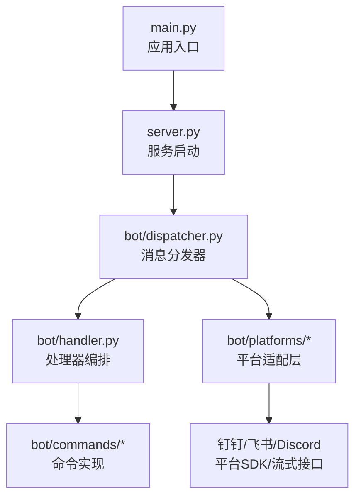
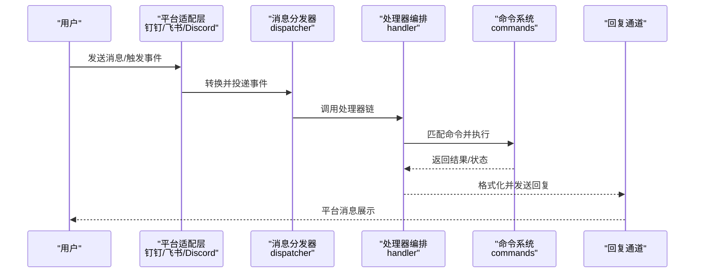
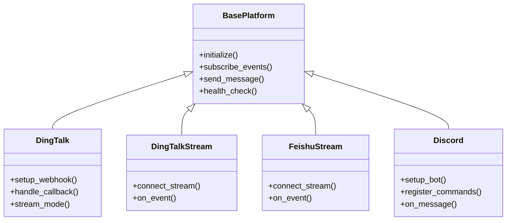
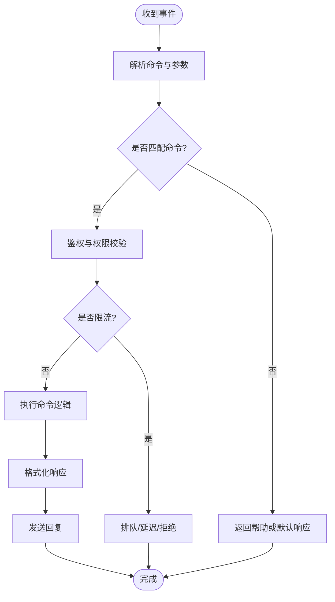
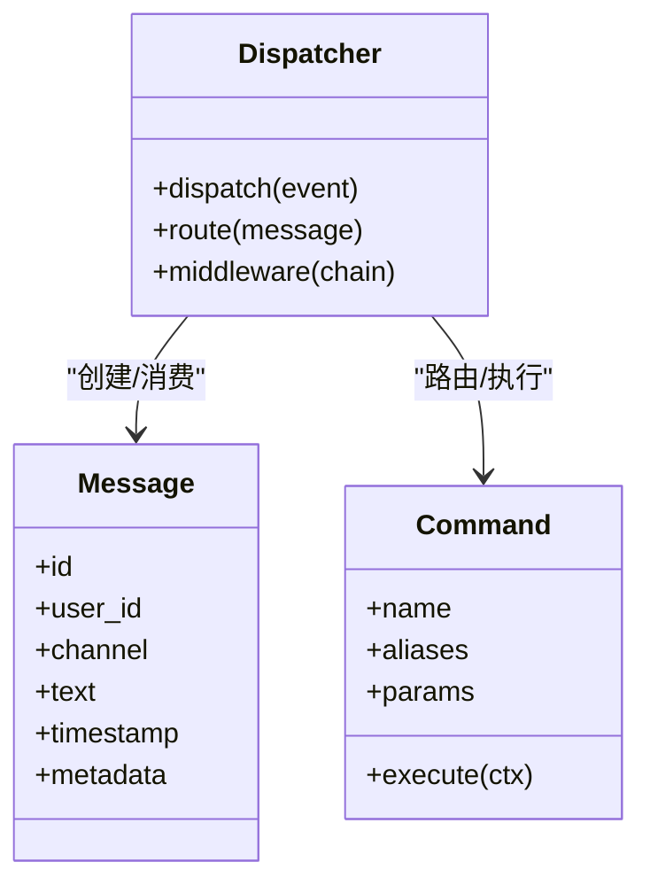
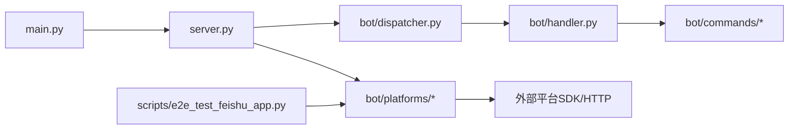

# 聊天机器人集成

<cite>
**本文档引用的文件**   
- [bot/dispatcher.py](file://bot/dispatcher.py)
- [bot/handler.py](file://bot/handler.py)
- [bot/models.py](file://bot/models.py)
- [bot/commands/base.py](file://bot/commands/base.py)
- [bot/commands/chat.py](file://bot/commands/chat.py)
- [bot/commands/help.py](file://bot/commands/help.py)
- [bot/commands/market.py](file://bot/commands/market.py)
- [bot/commands/analyze.py](file://bot/commands/analyze.py)
- [bot/platforms/base.py](file://bot/platforms/base.py)
- [bot/platforms/dingtalk.py](file://bot/platforms/dingtalk.py)
- [bot/platforms/dingtalk_stream.py](file://bot/platforms/dingtalk_stream.py)
- [bot/platforms/discord.py](file://bot/platforms/discord.py)
- [bot/platforms/feishu_stream.py](file://bot/platforms/feishu_stream.py)
- [main.py](file://main.py)
- [server.py](file://server.py)
- [docs/bot/dingding-bot-config.md](file://docs/bot/dingding-bot-config.md)
- [docs/bot/feishu-bot-config.md](file://docs/bot/feishu-bot-config.md)
- [docs/bot/discord-bot-config.md](file://docs/bot/discord-bot-config.md)
- [scripts/e2e_test_feishu_app.py](file://scripts/e2e_test_feishu_app.py)
</cite>

## 目录
1. [简介](#简介)
2. [项目结构](#项目结构)
3. [核心组件](#核心组件)
4. [架构总览](#架构总览)
5. [详细组件分析](#详细组件分析)
6. [依赖关系分析](#依赖关系分析)
7. [性能考虑](#性能考虑)
8. [故障排除指南](#故障排除指南)
9. [结论](#结论)
10. [附录](#附录)

## 简介
本文件面向需要在钉钉、飞书、Discord等平台集成聊天机器人的开发者，提供从认证配置、消息处理流程、命令注册到自定义响应格式的完整指南。文档基于仓库中的 bot 模块与平台适配层进行说明，并给出各平台的配置要点、最佳实践与常见问题排查方法。

## 项目结构
与聊天机器人相关的代码主要位于 bot 目录，包含平台适配、命令系统、消息分发与模型定义；入口由 main.py/server.py 启动；平台配置示例在 docs/bot 下。

图表来源
- [main.py](file://main.py)
- [server.py](file://server.py)
- [bot/dispatcher.py](file://bot/dispatcher.py)
- [bot/handler.py](file://bot/handler.py)
- [bot/platforms/dingtalk.py](file://bot/platforms/dingtalk.py)
- [bot/platforms/dingtalk_stream.py](file://bot/platforms/dingtalk_stream.py)
- [bot/platforms/discord.py](file://bot/platforms/discord.py)
- [bot/platforms/feishu_stream.py](file://bot/platforms/feishu_stream.py)

章节来源
- [main.py](file://main.py)
- [server.py](file://server.py)
- [bot/dispatcher.py](file://bot/dispatcher.py)
- [bot/handler.py](file://bot/handler.py)
- [bot/platforms/base.py](file://bot/platforms/base.py)
- [docs/bot/dingding-bot-config.md](file://docs/bot/dingding-bot-config.md)
- [docs/bot/feishu-bot-config.md](file://docs/bot/feishu-bot-config.md)
- [docs/bot/discord-bot-config.md](file://docs/bot/discord-bot-config.md)

## 核心组件
- 平台抽象与适配：统一消息格式、事件回调、发送能力，屏蔽平台差异。
- 命令系统：可插拔的命令注册与路由，支持参数解析与上下文注入。
- 消息分发器：将平台事件转换为内部消息对象，分发给处理器与命令。
- 处理器编排：串联鉴权、限流、日志、错误处理与业务逻辑。
- 模型定义：统一的消息、会话、用户等数据结构。

章节来源
- [bot/platforms/base.py](file://bot/platforms/base.py)
- [bot/models.py](file://bot/models.py)
- [bot/dispatcher.py](file://bot/dispatcher.py)
- [bot/handler.py](file://bot/handler.py)
- [bot/commands/base.py](file://bot/commands/base.py)

## 架构总览
下图展示了从平台事件到命令执行与回复的端到端流程。

图表来源
- [bot/dispatcher.py](file://bot/dispatcher.py)
- [bot/handler.py](file://bot/handler.py)
- [bot/platforms/dingtalk.py](file://bot/platforms/dingtalk.py)
- [bot/platforms/dingtalk_stream.py](file://bot/platforms/dingtalk_stream.py)
- [bot/platforms/discord.py](file://bot/platforms/discord.py)
- [bot/platforms/feishu_stream.py](file://bot/platforms/feishu_stream.py)

## 详细组件分析

### 平台适配层（Base + 具体平台）
- 基类定义了统一的接入点：初始化、事件订阅、消息发送、心跳/健康检查等。
- 钉钉：支持回调模式与流式模式两种接入方式，需配置 AppKey/AppSecret/Webhook 等。
- 飞书：通过流式接口接收事件，需配置企业应用凭证与权限。
- Discord：使用 Bot Token 与 Gateway 事件，支持 Slash Commands 与消息交互。

图表来源
- [bot/platforms/base.py](file://bot/platforms/base.py)
- [bot/platforms/dingtalk.py](file://bot/platforms/dingtalk.py)
- [bot/platforms/dingtalk_stream.py](file://bot/platforms/dingtalk_stream.py)
- [bot/platforms/feishu_stream.py](file://bot/platforms/feishu_stream.py)
- [bot/platforms/discord.py](file://bot/platforms/discord.py)

章节来源
- [bot/platforms/base.py](file://bot/platforms/base.py)
- [bot/platforms/dingtalk.py](file://bot/platforms/dingtalk.py)
- [bot/platforms/dingtalk_stream.py](file://bot/platforms/dingtalk_stream.py)
- [bot/platforms/feishu_stream.py](file://bot/platforms/feishu_stream.py)
- [bot/platforms/discord.py](file://bot/platforms/discord.py)

### 命令系统与处理器编排
- 命令基类提供统一的注册、参数解析、上下文获取与响应封装。
- 内置命令包括 chat、help、market、analyze 等，可按需扩展。
- 处理器链负责鉴权、限流、日志、重试与错误归一化。

图表来源
- [bot/commands/base.py](file://bot/commands/base.py)
- [bot/commands/chat.py](file://bot/commands/chat.py)
- [bot/commands/help.py](file://bot/commands/help.py)
- [bot/commands/market.py](file://bot/commands/market.py)
- [bot/commands/analyze.py](file://bot/commands/analyze.py)
- [bot/handler.py](file://bot/handler.py)

章节来源
- [bot/commands/base.py](file://bot/commands/base.py)
- [bot/commands/chat.py](file://bot/commands/chat.py)
- [bot/commands/help.py](file://bot/commands/help.py)
- [bot/commands/market.py](file://bot/commands/market.py)
- [bot/commands/analyze.py](file://bot/commands/analyze.py)
- [bot/handler.py](file://bot/handler.py)

### 消息分发器与模型
- 分发器将平台事件标准化为内部消息对象，携带用户、会话、渠道、时间戳等元数据。
- 模型定义了消息体、命令参数、响应结构与错误码，确保跨平台一致性。

图表来源
- [bot/models.py](file://bot/models.py)
- [bot/dispatcher.py](file://bot/dispatcher.py)
- [bot/commands/base.py](file://bot/commands/base.py)

章节来源
- [bot/models.py](file://bot/models.py)
- [bot/dispatcher.py](file://bot/dispatcher.py)

### 平台认证与配置要点
- 钉钉
  - 回调模式：需在钉钉开放平台配置回调地址、Token、EncodingAESKey。
  - 流式模式：使用长连接接收事件，适合高并发场景。
  - 关键配置项：AppKey、AppSecret、Webhook、安全设置。
- 飞书
  - 通过流式接口接收事件，需启用相应事件订阅与权限。
  - 关键配置项：App ID、App Secret、事件订阅 URL、权限范围。
- Discord
  - 使用 Bot Token 与 Gateway 事件，支持 Slash Commands。
  - 关键配置项：Bot Token、Intents、Commands 权限。

章节来源
- [docs/bot/dingding-bot-config.md](file://docs/bot/dingding-bot-config.md)
- [docs/bot/feishu-bot-config.md](file://docs/bot/feishu-bot-config.md)
- [docs/bot/discord-bot-config.md](file://docs/bot/discord-bot-config.md)

### 消息处理流程与自定义响应
- 消息进入后先经鉴权与限流，再路由到对应命令。
- 命令执行后可返回文本、富文本、卡片或图片等多媒体内容。
- 可通过响应模板与格式化器定制不同平台的显示样式。

章节来源
- [bot/handler.py](file://bot/handler.py)
- [bot/commands/base.py](file://bot/commands/base.py)

## 依赖关系分析
- 入口与启动：main.py 与 server.py 负责加载配置、初始化平台适配器与分发器。
- 平台适配层依赖各自 SDK/HTTP 客户端，需网络可达与凭据正确。
- 命令系统依赖处理器链提供的上下文（用户、会话、渠道）。
- 测试脚本用于验证飞书流式接口的连通性与事件处理。

图表来源
- [main.py](file://main.py)
- [server.py](file://server.py)
- [bot/dispatcher.py](file://bot/dispatcher.py)
- [bot/handler.py](file://bot/handler.py)
- [bot/platforms/base.py](file://bot/platforms/base.py)
- [scripts/e2e_test_feishu_app.py](file://scripts/e2e_test_feishu_app.py)

章节来源
- [main.py](file://main.py)
- [server.py](file://server.py)
- [scripts/e2e_test_feishu_app.py](file://scripts/e2e_test_feishu_app.py)

## 性能考虑
- 流式接入优先：钉钉/飞书建议使用流式模式以降低轮询开销。
- 异步与并发：平台事件处理应使用异步 I/O，避免阻塞主循环。
- 限流与退避：对高频命令与外部 API 调用实施限流与指数退避。
- 缓存热点数据：如股票名称映射、市场日历等，减少重复请求。
- 批量发送与合并：对多段回复进行合并，降低平台侧压力。

[本节为通用指导，不直接分析具体文件]

## 故障排除指南
- 认证失败
  - 检查 AppKey/Secret、Bot Token、Webhook 是否正确。
  - 确认回调地址或事件订阅 URL 公网可达且签名校验通过。
- 事件未到达
  - 核对平台侧事件订阅是否开启，权限是否足够。
  - 检查防火墙与代理设置，确保出站/入站端口开放。
- 命令无响应
  - 查看分发器日志，确认事件已转换为内部消息。
  - 检查命令注册与别名是否冲突。
- 回复格式异常
  - 针对不同平台使用对应的响应模板。
  - 避免超长文本与非法字符，必要时截断或分页。
- 飞书流式调试
  - 使用 e2e 测试脚本验证连接与事件处理链路。

章节来源
- [scripts/e2e_test_feishu_app.py](file://scripts/e2e_test_feishu_app.py)
- [bot/dispatcher.py](file://bot/dispatcher.py)
- [bot/handler.py](file://bot/handler.py)
- [bot/platforms/dingtalk.py](file://bot/platforms/dingtalk.py)
- [bot/platforms/dingtalk_stream.py](file://bot/platforms/dingtalk_stream.py)
- [bot/platforms/feishu_stream.py](file://bot/platforms/feishu_stream.py)
- [bot/platforms/discord.py](file://bot/platforms/discord.py)

## 结论
通过统一的平台抽象与命令系统，本项目实现了在多平台（钉钉、飞书、Discord）上快速集成聊天机器人的能力。建议优先采用流式接入、异步处理与限流策略，结合平台特定的认证与权限配置，以获得稳定高效的机器人体验。

## 附录
- 平台配置参考
  - 钉钉：见 [docs/bot/dingding-bot-config.md](file://docs/bot/dingding-bot-config.md)
  - 飞书：见 [docs/bot/feishu-bot-config.md](file://docs/bot/feishu-bot-config.md)
  - Discord：见 [docs/bot/discord-bot-config.md](file://docs/bot/discord-bot-config.md)
- 命令清单与用法
  - chat、help、market、analyze 等命令的实现与参数说明见 bot/commands 目录。
- 运行与部署
  - 入口与服务器启动见 main.py、server.py。
  - 飞书流式端到端测试见 scripts/e2e_test_feishu_app.py。