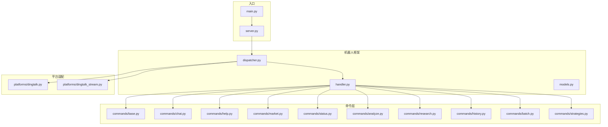
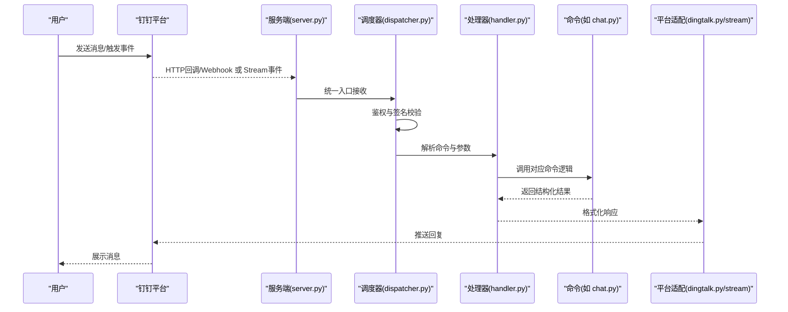
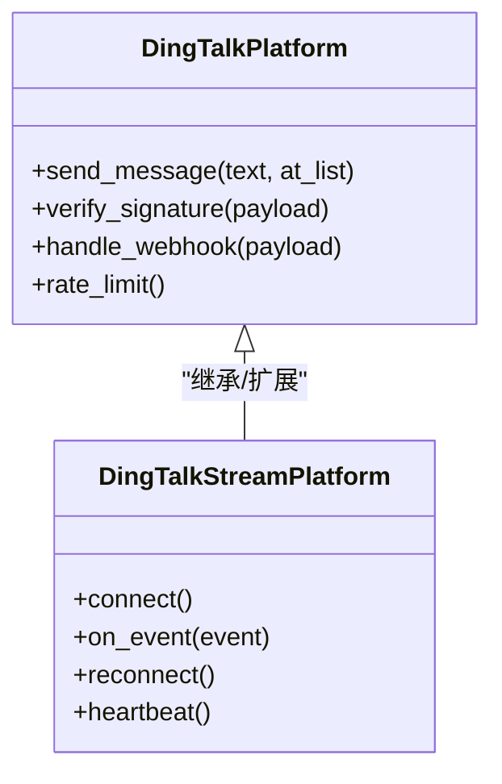
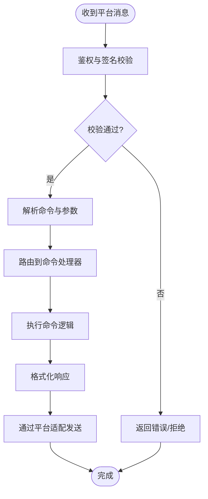
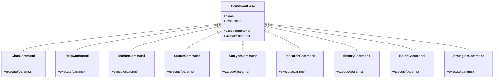
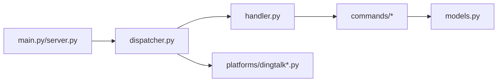

# 钉钉机器人集成

<cite>
**本文档引用的文件**   
- [bot/platforms/dingtalk.py](file://bot/platforms/dingtalk.py)
- [bot/platforms/dingtalk_stream.py](file://bot/platforms/dingtalk_stream.py)
- [bot/dispatcher.py](file://bot/dispatcher.py)
- [bot/handler.py](file://bot/handler.py)
- [bot/models.py](file://bot/models.py)
- [bot/commands/base.py](file://bot/commands/base.py)
- [bot/commands/chat.py](file://bot/commands/chat.py)
- [bot/commands/help.py](file://bot/commands/help.py)
- [bot/commands/market.py](file://bot/commands/market.py)
- [bot/commands/status.py](file://bot/commands/status.py)
- [bot/commands/analyze.py](file://bot/commands/analyze.py)
- [bot/commands/research.py](file://bot/commands/research.py)
- [bot/commands/history.py](file://bot/commands/history.py)
- [bot/commands/batch.py](file://bot/commands/batch.py)
- [bot/commands/strategies.py](file://bot/commands/strategies.py)
- [docs/bot/dingding-bot-config.md](file://docs/bot/dingding-bot-config.md)
- [main.py](file://main.py)
- [server.py](file://server.py)
</cite>

## 目录
1. [简介](#简介)
2. [项目结构](#项目结构)
3. [核心组件](#核心组件)
4. [架构总览](#架构总览)
5. [详细组件分析](#详细组件分析)
6. [依赖关系分析](#依赖关系分析)
7. [性能考虑](#性能考虑)
8. [故障排除指南](#故障排除指南)
9. [结论](#结论)
10. [附录](#附录)

## 简介
本文件面向希望将“股票分析系统”与“钉钉机器人”集成的开发者与运维人员，提供从应用创建、权限配置、Webhook/Stream接入到消息处理、命令注册、错误处理的完整指南。文档同时给出流程图与架构图，帮助快速定位问题并优化集成效果。

## 项目结构
钉钉机器人相关代码集中在 bot 模块下，平台适配层位于 platforms，命令解析与执行位于 commands 与 dispatcher/handler 中。根目录的 main.py/server.py 负责启动服务与路由。

图表来源 
- [main.py](file://main.py)
- [server.py](file://server.py)
- [bot/dispatcher.py](file://bot/dispatcher.py)
- [bot/handler.py](file://bot/handler.py)
- [bot/models.py](file://bot/models.py)
- [bot/platforms/dingtalk.py](file://bot/platforms/dingtalk.py)
- [bot/platforms/dingtalk_stream.py](file://bot/platforms/dingtalk_stream.py)
- [bot/commands/base.py](file://bot/commands/base.py)
- [bot/commands/chat.py](file://bot/commands/chat.py)
- [bot/commands/help.py](file://bot/commands/help.py)
- [bot/commands/market.py](file://bot/commands/market.py)
- [bot/commands/status.py](file://bot/commands/status.py)
- [bot/commands/analyze.py](file://bot/commands/analyze.py)
- [bot/commands/research.py](file://bot/commands/research.py)
- [bot/commands/history.py](file://bot/commands/history.py)
- [bot/commands/batch.py](file://bot/commands/batch.py)
- [bot/commands/strategies.py](file://bot/commands/strategies.py)

章节来源
- [docs/bot/dingding-bot-config.md](file://docs/bot/dingding-bot-config.md)

## 核心组件
- 平台适配层
  - dingtalk.py：基于 HTTP Webhook 或回调接口的适配实现，负责签名校验、消息收发、速率限制等。
  - dingtalk_stream.py：基于 Stream 长连接的适配实现，适合高并发与低延迟场景。
- 调度与处理
  - dispatcher.py：统一接收平台消息，进行鉴权、路由与分发。
  - handler.py：命令解析、参数提取、响应格式化与错误处理。
- 命令体系
  - base.py：命令基类与注册机制。
  - chat.py/help.py/market.py/status.py/analyze.py/research.py/history.py/batch.py/strategies.py：具体命令实现。
- 数据模型
  - models.py：消息体、上下文、结果对象等数据结构定义。

章节来源
- [bot/platforms/dingtalk.py](file://bot/platforms/dingtalk.py)
- [bot/platforms/dingtalk_stream.py](file://bot/platforms/dingtalk_stream.py)
- [bot/dispatcher.py](file://bot/dispatcher.py)
- [bot/handler.py](file://bot/handler.py)
- [bot/models.py](file://bot/models.py)
- [bot/commands/base.py](file://bot/commands/base.py)
- [bot/commands/chat.py](file://bot/commands/chat.py)
- [bot/commands/help.py](file://bot/commands/help.py)
- [bot/commands/market.py](file://bot/commands/market.py)
- [bot/commands/status.py](file://bot/commands/status.py)
- [bot/commands/analyze.py](file://bot/commands/analyze.py)
- [bot/commands/research.py](file://bot/commands/research.py)
- [bot/commands/history.py](file://bot/commands/history.py)
- [bot/commands/batch.py](file://bot/commands/batch.py)
- [bot/commands/strategies.py](file://bot/commands/strategies.py)

## 架构总览
钉钉机器人通过两种模式接入：
- Webhook/回调模式：外部事件推送到服务端，服务端校验签名后进入调度器。
- Stream 模式：服务端主动建立长连接，实时接收消息。

图表来源 
- [server.py](file://server.py)
- [bot/dispatcher.py](file://bot/dispatcher.py)
- [bot/handler.py](file://bot/handler.py)
- [bot/platforms/dingtalk.py](file://bot/platforms/dingtalk.py)
- [bot/platforms/dingtalk_stream.py](file://bot/platforms/dingtalk_stream.py)
- [bot/commands/chat.py](file://bot/commands/chat.py)

## 详细组件分析

### 平台适配层（Webhook/Stream）
- dingtalk.py
  - 职责：封装钉钉 API 调用、签名验证、消息格式转换、重试与限流策略。
  - 关键点：安全设置（加签/白名单）、消息长度限制、图片/富文本支持。
- dingtalk_stream.py
  - 职责：维护长连接、心跳保活、断线重连、事件顺序保证。
  - 关键点：超时与重试、背压控制、错误上报。

图表来源 
- [bot/platforms/dingtalk.py](file://bot/platforms/dingtalk.py)
- [bot/platforms/dingtalk_stream.py](file://bot/platforms/dingtalk_stream.py)

章节来源
- [bot/platforms/dingtalk.py](file://bot/platforms/dingtalk.py)
- [bot/platforms/dingtalk_stream.py](file://bot/platforms/dingtalk_stream.py)

### 调度器与处理器
- dispatcher.py
  - 职责：接收平台消息，进行身份校验、权限检查、路由到 handler。
  - 关键点：多平台兼容、请求去重、上下文注入。
- handler.py
  - 职责：命令解析、参数校验、调用命令、格式化输出、错误处理。
  - 关键点：命令前缀匹配、参数模板、异常捕获与友好提示。

图表来源 
- [bot/dispatcher.py](file://bot/dispatcher.py)
- [bot/handler.py](file://bot/handler.py)

章节来源
- [bot/dispatcher.py](file://bot/dispatcher.py)
- [bot/handler.py](file://bot/handler.py)

### 命令体系与自定义命令
- base.py
  - 定义命令基类、注册表、生命周期钩子。
- 常用命令
  - chat.py：对话式交互，支持上下文记忆与追问。
  - help.py：列出可用命令与用法说明。
  - market.py：市场概览、指数查询。
  - status.py：系统状态与健康检查。
  - analyze.py：个股/板块分析。
  - research.py：研究任务与报告生成。
  - history.py：历史数据查询。
  - batch.py：批量任务处理。
  - strategies.py：策略管理与回测。

图表来源 
- [bot/commands/base.py](file://bot/commands/base.py)
- [bot/commands/chat.py](file://bot/commands/chat.py)
- [bot/commands/help.py](file://bot/commands/help.py)
- [bot/commands/market.py](file://bot/commands/market.py)
- [bot/commands/status.py](file://bot/commands/status.py)
- [bot/commands/analyze.py](file://bot/commands/analyze.py)
- [bot/commands/research.py](file://bot/commands/research.py)
- [bot/commands/history.py](file://bot/commands/history.py)
- [bot/commands/batch.py](file://bot/commands/batch.py)
- [bot/commands/strategies.py](file://bot/commands/strategies.py)

章节来源
- [bot/commands/base.py](file://bot/commands/base.py)
- [bot/commands/chat.py](file://bot/commands/chat.py)
- [bot/commands/help.py](file://bot/commands/help.py)
- [bot/commands/market.py](file://bot/commands/market.py)
- [bot/commands/status.py](file://bot/commands/status.py)
- [bot/commands/analyze.py](file://bot/commands/analyze.py)
- [bot/commands/research.py](file://bot/commands/research.py)
- [bot/commands/history.py](file://bot/commands/history.py)
- [bot/commands/batch.py](file://bot/commands/batch.py)
- [bot/commands/strategies.py](file://bot/commands/strategies.py)

### 数据模型
- models.py
  - 定义消息体、上下文、结果对象、错误码等，确保各层间契约一致。

章节来源
- [bot/models.py](file://bot/models.py)

## 依赖关系分析
- 入口层：main.py/server.py 启动服务并挂载路由。
- 平台层：dingtalk.py/dingtalk_stream.py 依赖网络库与钉钉 SDK。
- 调度层：dispatcher.py 依赖认证与路由表。
- 处理层：handler.py 依赖命令注册表与格式化器。
- 命令层：各命令依赖业务服务（数据获取、LLM 调用、存储等）。

图表来源 
- [main.py](file://main.py)
- [server.py](file://server.py)
- [bot/dispatcher.py](file://bot/dispatcher.py)
- [bot/handler.py](file://bot/handler.py)
- [bot/platforms/dingtalk.py](file://bot/platforms/dingtalk.py)
- [bot/platforms/dingtalk_stream.py](file://bot/platforms/dingtalk_stream.py)
- [bot/models.py](file://bot/models.py)

章节来源
- [main.py](file://main.py)
- [server.py](file://server.py)
- [bot/dispatcher.py](file://bot/dispatcher.py)
- [bot/handler.py](file://bot/handler.py)
- [bot/models.py](file://bot/models.py)

## 性能考虑
- 使用 Stream 模式降低握手开销，提升实时性。
- 对耗时命令采用异步执行与进度反馈，避免阻塞。
- 合理设置超时与重试次数，避免雪崩。
- 对高频命令启用缓存与去重。
- 控制消息长度与富媒体大小，避免钉钉侧限流。

[本节为通用指导，不直接分析具体文件]

## 故障排除指南
- 认证失败
  - 检查签名密钥、时间戳、随机数是否一致。
  - 确认钉钉应用安全设置中的 IP 白名单与回调地址。
- 网络超时
  - 调整 HTTP/Stream 超时参数，增加重试间隔。
  - 检查防火墙与代理配置。
- 消息限制
  - 遵守钉钉单条消息长度限制，必要时分页或摘要。
  - 避免频繁发送相同内容，启用去重。
- 命令未生效
  - 确认命令已注册且名称匹配。
  - 检查权限与角色配置。
- 日志与诊断
  - 开启调试日志，记录请求体与响应体。
  - 使用健康检查接口验证服务状态。

章节来源
- [docs/bot/dingding-bot-config.md](file://docs/bot/dingding-bot-config.md)

## 结论
通过平台适配层与命令体系的解耦设计，钉钉机器人集成具备高可扩展性与可维护性。建议优先采用 Stream 模式以提升稳定性与性能，结合完善的错误处理与监控，保障生产环境稳定运行。

[本节为总结，不直接分析具体文件]

## 附录
- 配置步骤参考
  - 在钉钉开放平台创建企业内部应用，启用机器人能力。
  - 配置安全设置（加签/白名单），填写回调地址或启用 Stream。
  - 部署后端服务并确保公网可达。
  - 在系统中填入必要的密钥与 URL，重启服务。
- 示例命令
  - /chat 对话问答
  - /help 查看帮助
  - /market 市场概览
  - /status 系统状态
  - /analyze 个股分析
  - /research 研究报告
  - /history 历史数据
  - /batch 批量任务
  - /strategies 策略管理

章节来源
- [docs/bot/dingding-bot-config.md](file://docs/bot/dingding-bot-config.md)
- [bot/commands/chat.py](file://bot/commands/chat.py)
- [bot/commands/help.py](file://bot/commands/help.py)
- [bot/commands/market.py](file://bot/commands/market.py)
- [bot/commands/status.py](file://bot/commands/status.py)
- [bot/commands/analyze.py](file://bot/commands/analyze.py)
- [bot/commands/research.py](file://bot/commands/research.py)
- [bot/commands/history.py](file://bot/commands/history.py)
- [bot/commands/batch.py](file://bot/commands/batch.py)
- [bot/commands/strategies.py](file://bot/commands/strategies.py)