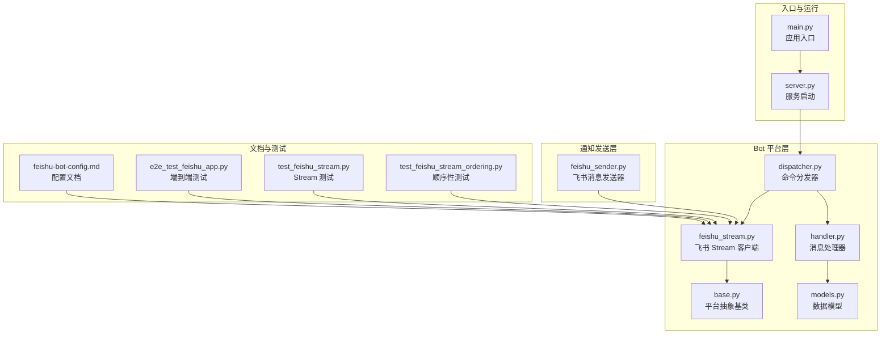
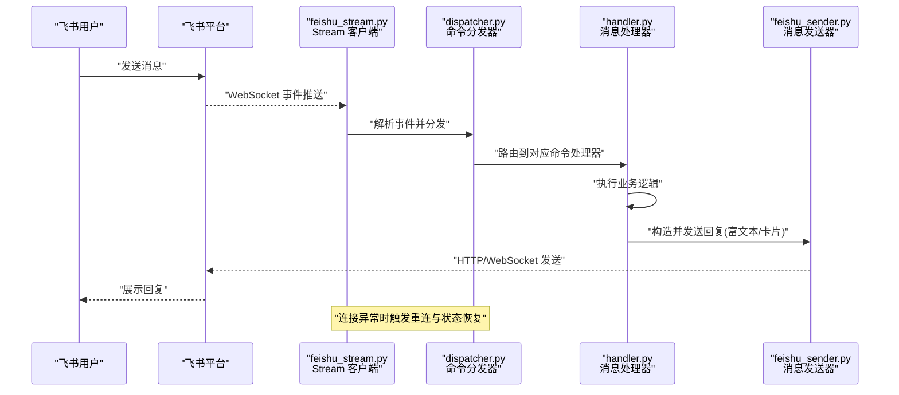
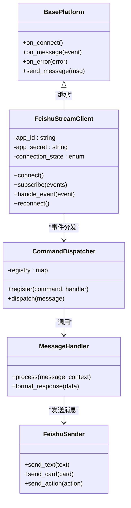

# 飞书机器人集成

<cite>
**本文档引用的文件**   
- [feishu_stream.py](file://bot/platforms/feishu_stream.py)
- [feishu_sender.py](file://src/notification_sender/feishu_sender.py)
- [feishu-bot-config.md](file://docs/bot/feishu-bot-config.md)
- [e2e_test_feishu_app.py](file://scripts/e2e_test_feishu_app.py)
- [test_feishu_stream.py](file://tests/test_feishu_stream.py)
- [test_feishu_stream_ordering.py](file://tests/test_feishu_stream_ordering.py)
- [dispatcher.py](file://bot/dispatcher.py)
- [handler.py](file://bot/handler.py)
- [models.py](file://bot/models.py)
- [base.py](file://bot/platforms/base.py)
- [main.py](file://main.py)
- [server.py](file://server.py)
</cite>

## 目录
1. [简介](#简介)
2. [项目结构](#项目结构)
3. [核心组件](#核心组件)
4. [架构总览](#架构总览)
5. [详细组件分析](#详细组件分析)
6. [依赖关系分析](#依赖关系分析)
7. [性能考虑](#性能考虑)
8. [故障排查指南](#故障排查指南)
9. [结论](#结论)
10. [附录](#附录)

## 简介
本文件面向需要在项目中集成飞书机器人的开发者，提供从应用创建、事件订阅、权限申请到 Stream 模式配置的完整指南。文档重点解释流式消息处理机制（连接建立、消息接收与状态管理），并提供配置示例与测试脚本使用方法。同时涵盖富文本、卡片消息与交互式组件等高级能力，以及常见问题排查与性能优化建议。

## 项目结构
本项目在 bot 层实现了多平台接入，其中飞书通过 Stream 模式接入；通知模块提供了飞书发送器用于推送消息；文档与测试分别位于 docs 和 scripts/tests 目录。

图表来源
- [feishu_stream.py](file://bot/platforms/feishu_stream.py)
- [base.py](file://bot/platforms/base.py)
- [dispatcher.py](file://bot/dispatcher.py)
- [handler.py](file://bot/handler.py)
- [models.py](file://bot/models.py)
- [feishu_sender.py](file://src/notification_sender/feishu_sender.py)
- [main.py](file://main.py)
- [server.py](file://server.py)
- [feishu-bot-config.md](file://docs/bot/feishu-bot-config.md)
- [e2e_test_feishu_app.py](file://scripts/e2e_test_feishu_app.py)
- [test_feishu_stream.py](file://tests/test_feishu_stream.py)
- [test_feishu_stream_ordering.py](file://tests/test_feishu_stream_ordering.py)

章节来源
- [feishu_stream.py](file://bot/platforms/feishu_stream.py)
- [dispatcher.py](file://bot/dispatcher.py)
- [handler.py](file://bot/handler.py)
- [models.py](file://bot/models.py)
- [feishu_sender.py](file://src/notification_sender/feishu_sender.py)
- [main.py](file://main.py)
- [server.py](file://server.py)
- [feishu-bot-config.md](file://docs/bot/feishu-bot-config.md)
- [e2e_test_feishu_app.py](file://scripts/e2e_test_feishu_app.py)
- [test_feishu_stream.py](file://tests/test_feishu_stream.py)
- [test_feishu_stream_ordering.py](file://tests/test_feishu_stream_ordering.py)

## 核心组件
- 飞书 Stream 客户端：负责长连接建立、心跳保活、事件订阅、消息收发与重连策略。
- 平台抽象基类：定义统一的事件回调接口与生命周期钩子，便于扩展其他平台。
- 命令分发器：将收到的消息路由到具体命令处理器，支持参数解析与上下文注入。
- 消息处理器：封装业务逻辑，调用上层服务生成回复内容并回写至飞书。
- 飞书消息发送器：封装富文本、卡片消息与交互组件的构造与发送。
- 配置与文档：提供应用创建、事件订阅、权限申请与 Stream 模式的步骤说明。
- 测试套件：覆盖连接稳定性、事件顺序性与端到端流程验证。

章节来源
- [feishu_stream.py](file://bot/platforms/feishu_stream.py)
- [base.py](file://bot/platforms/base.py)
- [dispatcher.py](file://bot/dispatcher.py)
- [handler.py](file://bot/handler.py)
- [models.py](file://bot/models.py)
- [feishu_sender.py](file://src/notification_sender/feishu_sender.py)
- [feishu-bot-config.md](file://docs/bot/feishu-bot-config.md)
- [test_feishu_stream.py](file://tests/test_feishu_stream.py)
- [test_feishu_stream_ordering.py](file://tests/test_feishu_stream_ordering.py)
- [e2e_test_feishu_app.py](file://scripts/e2e_test_feishu_app.py)

## 架构总览
下图展示了从用户消息到业务处理再到回复的全链路流程，包括 Stream 连接、事件分发、命令解析、消息发送与错误处理。

图表来源
- [feishu_stream.py](file://bot/platforms/feishu_stream.py)
- [dispatcher.py](file://bot/dispatcher.py)
- [handler.py](file://bot/handler.py)
- [feishu_sender.py](file://src/notification_sender/feishu_sender.py)

## 详细组件分析

### 飞书 Stream 客户端
- 职责：维护与飞书的 WebSocket 长连接，处理心跳、事件订阅、消息编解码、重试与断线重连。
- 关键流程：
  - 初始化：加载应用凭证（App ID、App Secret）、配置 Stream 地址与超时。
  - 连接建立：握手成功后注册事件回调，进入事件循环。
  - 事件处理：按类型分派到不同处理器，保证顺序性与幂等性。
  - 状态管理：记录连接状态、最近心跳时间、失败计数与退避策略。
  - 重连策略：指数退避、最大重试次数、优雅关闭。
- 性能要点：
  - 使用异步 I/O 提升吞吐。
  - 批量发送与消息合并减少网络开销。
  - 合理设置超时与缓冲大小避免内存膨胀。

章节来源
- [feishu_stream.py](file://bot/platforms/feishu_stream.py)

### 平台抽象基类
- 职责：定义跨平台的统一接口，如 on_connect、on_message、on_error、send_message 等。
- 设计优势：新增平台只需实现基类方法，复用通用逻辑（日志、监控、重试）。
- 扩展点：可注入中间件或拦截器，实现鉴权、审计与限流。

章节来源
- [base.py](file://bot/platforms/base.py)

### 命令分发器
- 职责：解析消息体，匹配命令前缀与参数，调用对应的处理器。
- 特性：
  - 命令注册表：动态注册与发现。
  - 上下文注入：会话、用户信息、权限校验。
  - 错误隔离：单个命令失败不影响整体运行。
- 典型流程：
  - 收到事件 -> 解析命令 -> 查找处理器 -> 执行 -> 返回结果。

章节来源
- [dispatcher.py](file://bot/dispatcher.py)

### 消息处理器
- 职责：封装具体业务逻辑，例如查询行情、生成分析报告、触发告警。
- 输入输出：
  - 输入：命令参数、上下文、用户身份。
  - 输出：结构化响应（文本、富文本、卡片、按钮）。
- 最佳实践：
  - 使用缓存与异步任务降低延迟。
  - 对耗时操作采用队列与进度反馈。

章节来源
- [handler.py](file://bot/handler.py)
- [models.py](file://bot/models.py)

### 飞书消息发送器
- 职责：构造飞书支持的富文本、卡片消息与交互组件，并通过 HTTP/WebSocket 发送。
- 能力清单：
  - 富文本：段落、链接、图片、代码块。
  - 卡片消息：布局、字段、按钮、下拉框。
  - 交互组件：回调事件绑定与处理。
- 注意事项：
  - 遵循消息模板与字段限制。
  - 控制卡片复杂度，避免渲染卡顿。

章节来源
- [feishu_sender.py](file://src/notification_sender/feishu_sender.py)

### 配置与文档
- 应用创建：在飞书开放平台创建企业自建应用，获取 App ID 与 App Secret。
- 事件订阅：启用“机器人”能力，订阅所需事件（如消息接收、回调）。
- 权限申请：按需开启通讯录、消息读写、群组管理等权限。
- Stream 模式：配置回调地址为本地或公网可达地址，启用长连接模式。
- 环境变量：集中管理密钥、超时、重试次数等配置项。

章节来源
- [feishu-bot-config.md](file://docs/bot/feishu-bot-config.md)

### 测试套件
- 端到端测试：模拟用户消息，验证从接收到回复的完整链路。
- Stream 稳定性：模拟断线与重连，验证状态恢复与事件不丢失。
- 顺序性测试：确保事件按序处理，避免乱序导致的业务不一致。

章节来源
- [e2e_test_feishu_app.py](file://scripts/e2e_test_feishu_app.py)
- [test_feishu_stream.py](file://tests/test_feishu_stream.py)
- [test_feishu_stream_ordering.py](file://tests/test_feishu_stream_ordering.py)

## 依赖关系分析

图表来源
- [base.py](file://bot/platforms/base.py)
- [feishu_stream.py](file://bot/platforms/feishu_stream.py)
- [dispatcher.py](file://bot/dispatcher.py)
- [handler.py](file://bot/handler.py)
- [feishu_sender.py](file://src/notification_sender/feishu_sender.py)

章节来源
- [base.py](file://bot/platforms/base.py)
- [feishu_stream.py](file://bot/platforms/feishu_stream.py)
- [dispatcher.py](file://bot/dispatcher.py)
- [handler.py](file://bot/handler.py)
- [feishu_sender.py](file://src/notification_sender/feishu_sender.py)

## 性能考虑
- 连接与网络
  - 合理设置超时与重试间隔，避免雪崩效应。
  - 使用连接池与批量发送降低请求频率。
- 内存与并发
  - 控制消息缓冲区大小，防止内存泄漏。
  - 使用异步任务与队列解耦耗时操作。
- 渲染与卡片
  - 精简卡片结构与字段数量，提升渲染速度。
  - 避免频繁更新同一卡片，采用增量更新策略。
- 监控与指标
  - 记录连接状态、事件处理时长、错误率与重试次数。
  - 设置告警阈值，及时发现异常。

[本节为通用指导，无需特定文件引用]

## 故障排查指南
- 连接失败
  - 检查 App ID/Secret 是否正确。
  - 确认 Stream 地址可达且防火墙放行。
  - 查看心跳与握手日志，定位握手失败原因。
- 事件未触发
  - 核对事件订阅是否包含所需事件。
  - 验证权限是否已授予。
  - 检查事件签名与时间戳校验。
- 消息发送失败
  - 检查消息格式是否符合飞书规范。
  - 确认卡片模板与字段限制。
  - 查看发送器返回的错误码与描述。
- 顺序性问题
  - 确保事件处理器为单线程或有序队列。
  - 避免并行写入共享状态。
- 常见错误码
  - 参考飞书开放平台错误码文档，结合日志定位问题。

章节来源
- [feishu_stream.py](file://bot/platforms/feishu_stream.py)
- [feishu_sender.py](file://src/notification_sender/feishu_sender.py)
- [test_feishu_stream.py](file://tests/test_feishu_stream.py)
- [test_feishu_stream_ordering.py](file://tests/test_feishu_stream_ordering.py)

## 结论
通过本项目的飞书 Stream 集成方案，可实现稳定、高效的消息收发与事件处理。结合命令分发与消息处理器，能够快速构建丰富的机器人功能。配合完善的测试与监控，可在生产环境中获得良好的用户体验与系统可靠性。

[本节为总结性内容，无需特定文件引用]

## 附录

### 快速开始与环境准备
- 安装依赖：根据 requirements.txt 安装 Python 依赖。
- 配置环境变量：设置飞书应用凭证、Stream 地址、超时与重试参数。
- 启动服务：运行 main.py 或 server.py 启动后端服务。

章节来源
- [main.py](file://main.py)
- [server.py](file://server.py)

### 配置示例与测试脚本
- 配置示例：参考 feishu-bot-config.md 中的步骤完成应用创建、事件订阅与权限申请。
- 测试脚本：
  - 端到端测试：scripts/e2e_test_feishu_app.py 模拟用户消息并验证回复。
  - Stream 测试：tests/test_feishu_stream.py 验证连接与事件处理。
  - 顺序性测试：tests/test_feishu_stream_ordering.py 确保事件顺序正确。

章节来源
- [feishu-bot-config.md](file://docs/bot/feishu-bot-config.md)
- [e2e_test_feishu_app.py](file://scripts/e2e_test_feishu_app.py)
- [test_feishu_stream.py](file://tests/test_feishu_stream.py)
- [test_feishu_stream_ordering.py](file://tests/test_feishu_stream_ordering.py)

### 高级功能：富文本、卡片与交互组件
- 富文本消息：支持段落、链接、图片与代码块，适合报告与摘要。
- 卡片消息：支持布局、字段、按钮与下拉框，适合表单与操作面板。
- 交互组件：绑定回调事件，实现点击、选择与提交等操作。
- 最佳实践：控制复杂度、使用模板化、避免频繁更新。

章节来源
- [feishu_sender.py](file://src/notification_sender/feishu_sender.py)