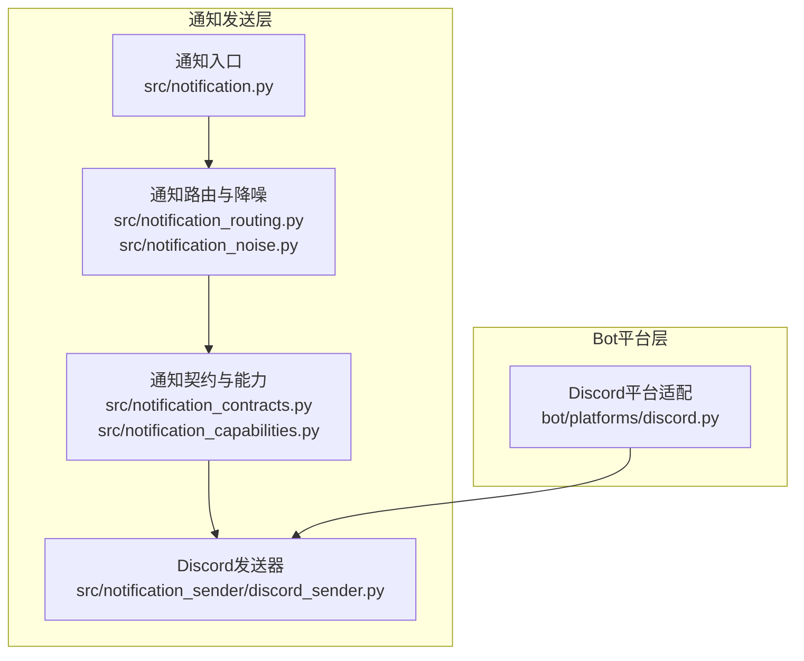
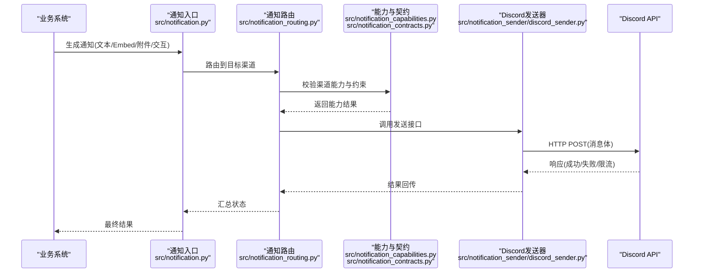
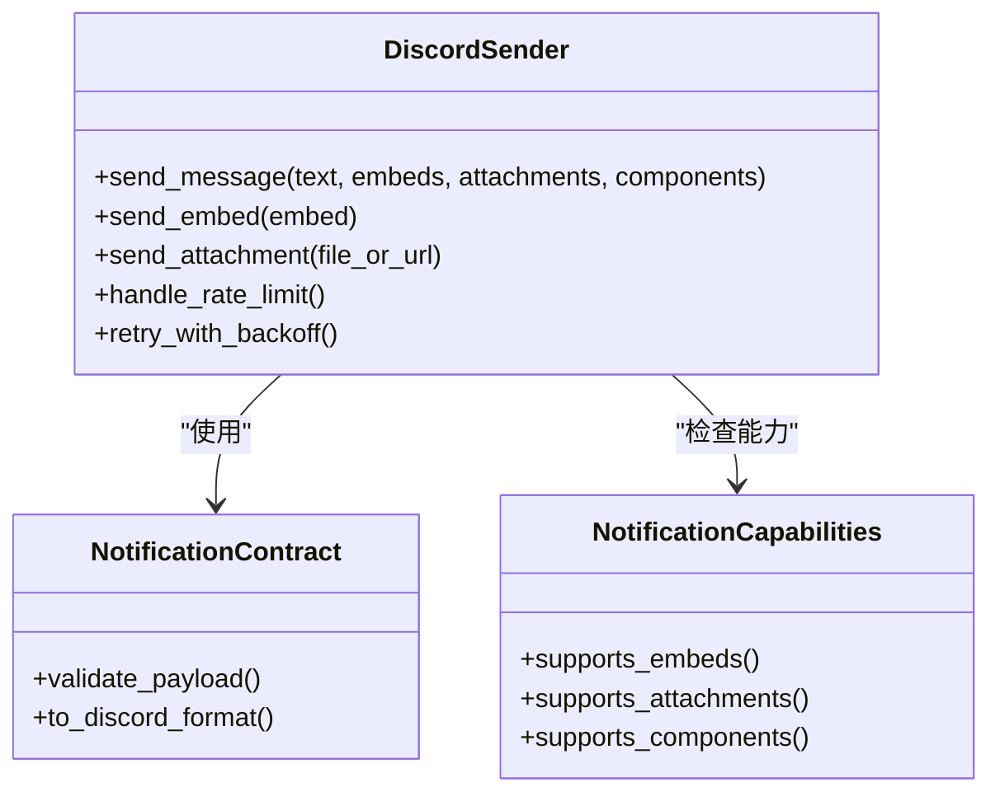
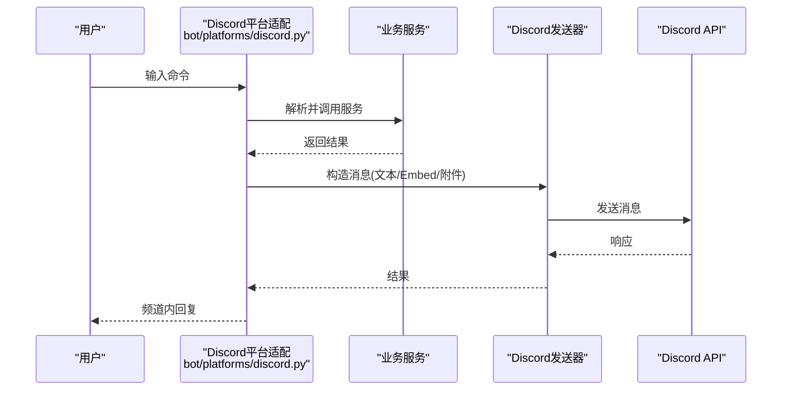
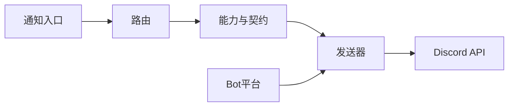

# Discord渠道

<cite>
**本文引用的文件**   
- [discord_sender.py](file://src/notification_sender/discord_sender.py)
- [discord.py](file://bot/platforms/discord.py)
- [notifications.md](file://docs/notifications.md)
- [discord-bot-config.md](file://docs/bot/discord-bot-config.md)
- [notification.py](file://src/notification.py)
- [notification_contracts.py](file://src/notification_contracts.py)
- [notification_capabilities.py](file://src/notification_capabilities.py)
- [notification_noise.py](file://src/notification_noise.py)
- [notification_routing.py](file://src/notification_routing.py)
- [test_discord_platform.py](file://tests/test_discord_platform.py)
</cite>

## 目录
1. [简介](#简介)
2. [项目结构](#项目结构)
3. [核心组件](#核心组件)
4. [架构总览](#架构总览)
5. [详细组件分析](#详细组件分析)
6. [依赖关系分析](#依赖关系分析)
7. [性能与速率限制](#性能与速率限制)
8. [故障排查指南](#故障排查指南)
9. [结论](#结论)
10. [附录：配置与模板示例](#附录配置与模板示例)

## 简介
本章节面向需要在系统中接入Discord作为通知渠道的用户，涵盖从创建Discord应用、配置Bot Token、设置服务器权限与频道访问，到消息Embed格式、富媒体支持、交互式按钮与下拉菜单的完整说明。同时提供完整的配置示例、消息嵌入模板、错误处理与速率限制管理策略，以及Discord特定功能的最佳实践和常见问题解决方案。

## 项目结构
本项目将Discord相关能力拆分为两个层次：
- 通知发送层：负责构造并发送Discord消息（文本、Embed、附件、交互组件等）
- Bot平台层：提供Discord机器人命令与事件处理能力（可选，用于双向交互）

图表来源
- [discord_sender.py:1-200](file://src/notification_sender/discord_sender.py#L1-L200)
- [discord.py:1-200](file://bot/platforms/discord.py#L1-L200)
- [notification.py:1-200](file://src/notification.py#L1-L200)
- [notification_contracts.py:1-200](file://src/notification_contracts.py#L1-L200)
- [notification_capabilities.py:1-200](file://src/notification_capabilities.py#L1-L200)
- [notification_routing.py:1-200](file://src/notification_routing.py#L1-L200)
- [notification_noise.py:1-200](file://src/notification_noise.py#L1-L200)

章节来源
- [discord_sender.py:1-200](file://src/notification_sender/discord_sender.py#L1-L200)
- [discord.py:1-200](file://bot/platforms/discord.py#L1-L200)
- [notification.py:1-200](file://src/notification.py#L1-L200)
- [notification_contracts.py:1-200](file://src/notification_contracts.py#L1-L200)
- [notification_capabilities.py:1-200](file://src/notification_capabilities.py#L1-L200)
- [notification_routing.py:1-200](file://src/notification_routing.py#L1-L200)
- [notification_noise.py:1-200](file://src/notification_noise.py#L1-L200)

## 核心组件
- Discord发送器：封装HTTP请求、构建Discord API所需的JSON载荷（包括文本、Embed、附件、交互组件），处理重试与限流。
- 通知契约与能力：定义统一的通知数据结构与能力声明，确保不同渠道一致的消息模型。
- 通知路由与降噪：根据规则将通知分发到Discord，并对重复或低价值消息进行去重与合并。
- Bot平台适配：提供Discord命令解析与事件回调，便于在频道内触发分析、查询等操作。

章节来源
- [discord_sender.py:1-200](file://src/notification_sender/discord_sender.py#L1-L200)
- [notification_contracts.py:1-200](file://src/notification_contracts.py#L1-L200)
- [notification_capabilities.py:1-200](file://src/notification_capabilities.py#L1-L200)
- [notification_routing.py:1-200](file://src/notification_routing.py#L1-L200)
- [notification_noise.py:1-200](file://src/notification_noise.py#L1-L200)
- [discord.py:1-200](file://bot/platforms/discord.py#L1-L200)

## 架构总览
下图展示了从通知生成到Discord发送的整体流程，包含路由、能力校验、发送与错误处理。

图表来源
- [notification.py:1-200](file://src/notification.py#L1-L200)
- [notification_routing.py:1-200](file://src/notification_routing.py#L1-L200)
- [notification_capabilities.py:1-200](file://src/notification_capabilities.py#L1-L200)
- [notification_contracts.py:1-200](file://src/notification_contracts.py#L1-L200)
- [discord_sender.py:1-200](file://src/notification_sender/discord_sender.py#L1-L200)

## 详细组件分析

### Discord发送器（消息构造与发送）
- 功能要点
  - 构建Discord消息体：纯文本、Embed、附件、交互组件（按钮、下拉菜单）
  - 处理Discord API响应：成功、错误码、速率限制（429）
  - 重试与退避：对临时性错误进行指数退避重试
  - 日志与诊断：记录关键步骤与错误信息，便于定位问题

- 数据模型与复杂度
  - Embed对象：标题、描述、字段、颜色、图片、缩略图、时间戳等
  - 附件：本地文件或URL引用，大小限制与类型校验
  - 交互组件：按钮与选择菜单，需遵循Discord的组件规范

- 错误处理
  - 网络异常：超时、连接失败
  - 业务异常：权限不足、频道不存在、消息体非法
  - 速率限制：按Discord建议进行退避与队列化

- 优化建议
  - 批量发送时合并Embed字段，减少请求次数
  - 使用异步HTTP客户端提升吞吐
  - 缓存静态资源URL，避免重复上传

章节来源
- [discord_sender.py:1-200](file://src/notification_sender/discord_sender.py#L1-L200)

#### 类与方法关系（代码级）

图表来源
- [discord_sender.py:1-200](file://src/notification_sender/discord_sender.py#L1-L200)
- [notification_contracts.py:1-200](file://src/notification_contracts.py#L1-L200)
- [notification_capabilities.py:1-200](file://src/notification_capabilities.py#L1-L200)

### Bot平台适配（命令与事件）
- 功能要点
  - 解析用户命令：如分析股票、查看历史、运行策略等
  - 事件回调：接收Discord事件并转发至业务逻辑
  - 权限控制：基于角色与频道权限限制命令执行

- 交互流程
  - 用户在频道输入命令
  - Bot解析命令并调用相应服务
  - 将结果以文本或Embed形式回复

章节来源
- [discord.py:1-200](file://bot/platforms/discord.py#L1-L200)

#### 命令处理时序（代码级）

图表来源
- [discord.py:1-200](file://bot/platforms/discord.py#L1-L200)
- [discord_sender.py:1-200](file://src/notification_sender/discord_sender.py#L1-L200)

### 通知契约与能力
- 契约定义
  - 统一消息结构：文本、Embed、附件、交互组件
  - 字段校验：长度、类型、必填项
  - 渠道差异映射：将通用结构转换为Discord格式

- 能力声明
  - 是否支持Embed、附件、交互组件
  - 最大消息长度、附件大小限制
  - 频率限制与并发限制

章节来源
- [notification_contracts.py:1-200](file://src/notification_contracts.py#L1-L200)
- [notification_capabilities.py:1-200](file://src/notification_capabilities.py#L1-L200)

### 通知路由与降噪
- 路由规则
  - 按标签、优先级、目标频道进行分发
  - 支持多目标与条件路由

- 降噪策略
  - 去重：相同内容短时间内不重复发送
  - 合并：多条相似消息合并为一条
  - 抑制：低优先级或测试环境抑制

章节来源
- [notification_routing.py:1-200](file://src/notification_routing.py#L1-L200)
- [notification_noise.py:1-200](file://src/notification_noise.py#L1-L200)

## 依赖关系分析
- 内部依赖
  - 通知入口依赖路由与能力模块
  - 发送器依赖契约与能力校验
  - Bot平台依赖发送器进行消息回复

- 外部依赖
  - Discord API：HTTP接口，受速率限制与权限控制
  - 配置文件：Bot Token、服务器ID、频道ID等

图表来源
- [notification.py:1-200](file://src/notification.py#L1-L200)
- [notification_routing.py:1-200](file://src/notification_routing.py#L1-L200)
- [notification_capabilities.py:1-200](file://src/notification_capabilities.py#L1-L200)
- [notification_contracts.py:1-200](file://src/notification_contracts.py#L1-L200)
- [discord_sender.py:1-200](file://src/notification_sender/discord_sender.py#L1-L200)
- [discord.py:1-200](file://bot/platforms/discord.py#L1-L200)

章节来源
- [notification.py:1-200](file://src/notification.py#L1-L200)
- [notification_routing.py:1-200](file://src/notification_routing.py#L1-L200)
- [notification_capabilities.py:1-200](file://src/notification_capabilities.py#L1-L200)
- [notification_contracts.py:1-200](file://src/notification_contracts.py#L1-L200)
- [discord_sender.py:1-200](file://src/notification_sender/discord_sender.py#L1-L200)
- [discord.py:1-200](file://bot/platforms/discord.py#L1-L200)

## 性能与速率限制
- 速率限制
  - 遵循Discord的每通道/全局速率限制
  - 实现指数退避与队列化发送
  - 监控429响应并动态调整发送频率

- 并发与吞吐
  - 使用异步HTTP客户端提高并发
  - 合理设置连接池与超时参数
  - 批量消息合并减少请求次数

- 资源优化
  - 压缩附件与图片
  - 缓存静态资源URL
  - 避免重复上传相同文件

章节来源
- [discord_sender.py:1-200](file://src/notification_sender/discord_sender.py#L1-L200)

## 故障排查指南
- 常见错误
  - 权限不足：检查Bot角色与频道权限
  - 频道不存在：验证频道ID与可见性
  - 消息体非法：检查Embed字段长度与格式
  - 速率限制：观察429响应并调整发送策略

- 诊断工具
  - 启用详细日志记录
  - 使用测试面板验证配置
  - 检查网络连通性与代理设置

- 解决步骤
  - 逐步缩小问题范围（文本→Embed→附件）
  - 使用Discord开发者工具验证消息格式
  - 参考官方文档确认API变更

章节来源
- [test_discord_platform.py:1-200](file://tests/test_discord_platform.py#L1-L200)
- [notifications.md:1-200](file://docs/notifications.md#L1-L200)

## 结论
通过本项目的Discord渠道实现，用户可以轻松集成Discord作为通知与交互平台。从消息构造到发送、从权限配置到速率限制，提供了完整的解决方案。建议在生产环境中充分测试与监控，确保稳定可靠。

## 附录：配置与模板示例

### 创建Discord应用与Bot
- 在Discord开发者门户创建应用
- 启用Bot功能并获取Token
- 邀请Bot到服务器并分配角色

章节来源
- [discord-bot-config.md:1-200](file://docs/bot/discord-bot-config.md#L1-L200)

### 配置Bot Token与服务器权限
- 设置环境变量或配置文件中的Bot Token
- 配置服务器ID与频道ID
- 分配必要的权限（发送消息、嵌入链接、附件等）

章节来源
- [discord-bot-config.md:1-200](file://docs/bot/discord-bot-config.md#L1-L200)

### Embed消息格式与富媒体支持
- 标题、描述、字段、颜色、图片、缩略图、时间戳
- 支持Markdown语法与链接
- 附件上传与URL引用

章节来源
- [discord_sender.py:1-200](file://src/notification_sender/discord_sender.py#L1-L200)

### 交互式按钮与下拉菜单
- 按钮组件：样式、标签、回调ID
- 下拉菜单：选项、默认值、回调处理
- 权限要求：确保Bot有权限添加组件

章节来源
- [discord_sender.py:1-200](file://src/notification_sender/discord_sender.py#L1-L200)

### 完整配置示例
- 环境变量配置
- 配置文件结构
- 路由规则示例

章节来源
- [notifications.md:1-200](file://docs/notifications.md#L1-L200)

### 消息嵌入模板
- 标准报告模板
- 自定义字段模板
- 动态内容填充

章节来源
- [discord_sender.py:1-200](file://src/notification_sender/discord_sender.py#L1-L200)

### 错误处理与速率限制管理
- 重试策略配置
- 退避算法参数
- 监控与告警设置

章节来源
- [discord_sender.py:1-200](file://src/notification_sender/discord_sender.py#L1-L200)

### 最佳实践与常见问题
- 消息长度限制与分页
- 附件大小与格式限制
- 权限最小化原则
- 常见问题解决方案

章节来源
- [discord-bot-config.md:1-200](file://docs/bot/discord-bot-config.md#L1-L200)
- [notifications.md:1-200](file://docs/notifications.md#L1-L200)