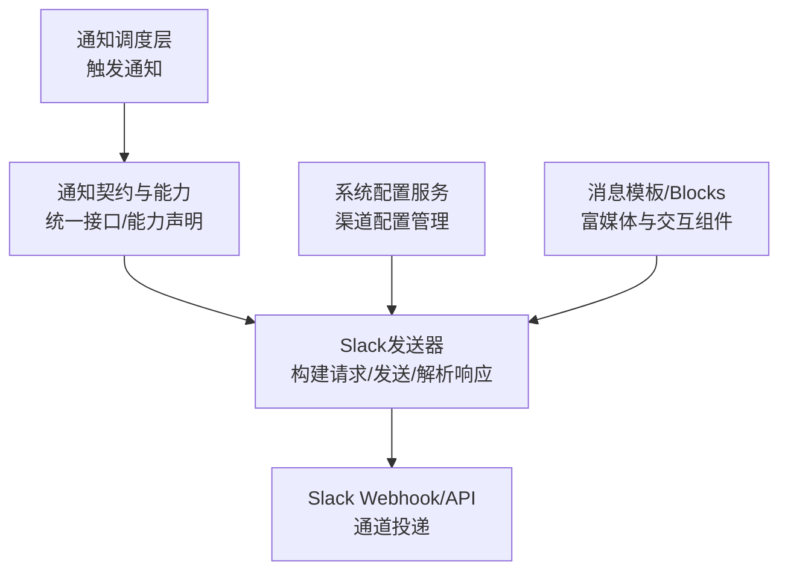
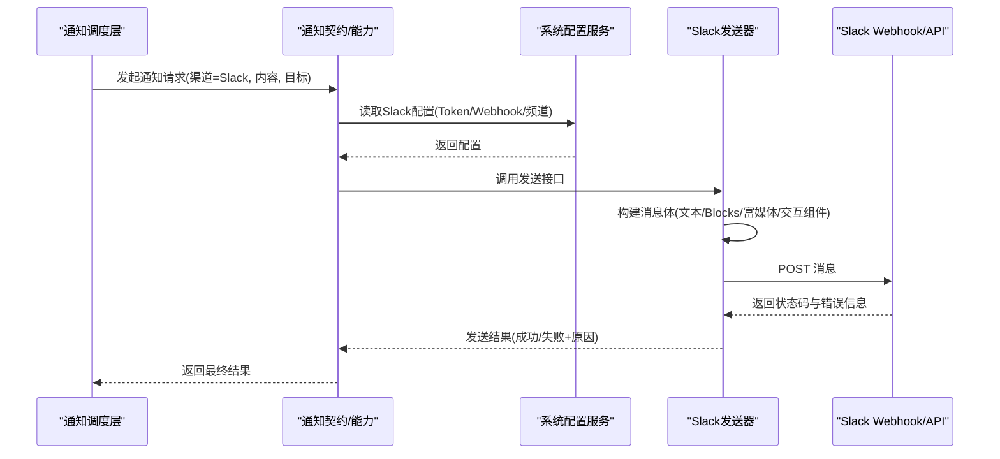
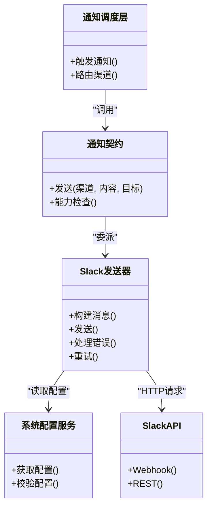

# Slack渠道

<cite>
**本文引用的文件**   
- [slack_sender.py](file://src/notification_sender/slack_sender.py)
- [notification.py](file://src/notification.py)
- [notification_contracts.py](file://src/notification_contracts.py)
- [notification_capabilities.py](file://src/notification_capabilities.py)
- [system_config_service.py](file://src/services/system_config_service.py)
- [alerts.md](file://docs/notifications.md)
</cite>

## 目录
1. [简介](#简介)
2. [项目结构](#项目结构)
3. [核心组件](#核心组件)
4. [架构总览](#架构总览)
5. [详细组件分析](#详细组件分析)
6. [依赖关系分析](#依赖关系分析)
7. [性能与限流](#性能与限流)
8. [故障排除指南](#故障排除指南)
9. [结论](#结论)
10. [附录：配置与模板最佳实践](#附录配置与模板最佳实践)

## 简介
本章节面向需要在系统中集成Slack通知渠道的读者，涵盖从创建Slack应用、配置OAuth令牌、设置Webhook URL与频道订阅，到消息块（Blocks API）格式、富媒体支持、交互式组件（按钮、选择器、日期选择器等）的使用说明。同时提供完整的配置示例、消息模板定制方法、错误重试机制与API限流处理策略，并给出最佳实践与常见问题排查指引。

## 项目结构
Slack通知能力由后端通知发送器与通用通知框架共同实现。关键文件包括：
- Slack发送器实现：负责与Slack API交互、构建消息体、处理响应与错误
- 通知契约与能力定义：统一接口、能力声明与校验
- 系统配置服务：集中管理渠道配置项（如Token、Webhook、频道等）
- 文档与示例：渠道使用说明与配置参考

图表来源
- [slack_sender.py](file://src/notification_sender/slack_sender.py)
- [notification_contracts.py](file://src/notification_contracts.py)
- [notification_capabilities.py](file://src/notification_capabilities.py)
- [system_config_service.py](file://src/services/system_config_service.py)

章节来源
- [slack_sender.py](file://src/notification_sender/slack_sender.py)
- [notification.py](file://src/notification.py)
- [notification_contracts.py](file://src/notification_contracts.py)
- [notification_capabilities.py](file://src/notification_capabilities.py)
- [system_config_service.py](file://src/services/system_config_service.py)

## 核心组件
- Slack发送器
  - 职责：组装Slack消息体（文本、Blocks、附件）、调用Webhook或API、处理速率限制与重试、记录日志与诊断信息
  - 关键点：支持富媒体（图片、文件）、交互组件（按钮、选择器、日期选择器）、多频道路由
- 通知契约与能力
  - 职责：定义统一的发送接口、能力枚举（是否支持富媒体、交互组件、批量发送等）
  - 关键点：便于扩展其他渠道并保持调用方一致
- 系统配置服务
  - 职责：加载与校验Slack相关配置（Token、Webhook、频道、超时、重试次数等）
  - 关键点：环境变量注入、配置热更新、安全存储敏感信息

章节来源
- [slack_sender.py](file://src/notification_sender/slack_sender.py)
- [notification_contracts.py](file://src/notification_contracts.py)
- [notification_capabilities.py](file://src/notification_capabilities.py)
- [system_config_service.py](file://src/services/system_config_service.py)

## 架构总览
下图展示了Slack通知在系统中的整体流程：从上层触发通知，到Slack发送器构建消息并投递至Slack，以及配置管理与错误处理的协作。

图表来源
- [slack_sender.py](file://src/notification_sender/slack_sender.py)
- [notification_contracts.py](file://src/notification_contracts.py)
- [notification_capabilities.py](file://src/notification_capabilities.py)
- [system_config_service.py](file://src/services/system_config_service.py)

## 详细组件分析

### Slack发送器（Slack Sender）
- 功能要点
  - 消息构建：支持纯文本、Markdown、Blocks（富媒体与交互组件）
  - 富媒体支持：图片、文件、链接预览
  - 交互组件：按钮、选择器、日期选择器等（需配合Slack App事件回调）
  - 错误处理：网络异常、认证失败、限流（429）、无效频道等
  - 重试机制：指数退避、最大重试次数、可配置超时
  - 日志与诊断：记录请求ID、响应码、错误详情，便于排障
- 使用建议
  - 优先使用Blocks以获得更好的渲染效果与交互能力
  - 对大消息进行分片或压缩，避免超限
  - 合理设置重试与超时，避免阻塞上游任务

章节来源
- [slack_sender.py](file://src/notification_sender/slack_sender.py)

### 通知契约与能力（Notification Contracts & Capabilities）
- 功能要点
  - 统一接口：所有渠道遵循相同发送签名与返回结构
  - 能力声明：是否支持富媒体、交互组件、批量发送、异步发送等
  - 校验与降级：当某能力不可用时自动降级或提示
- 使用建议
  - 在调用前检查能力，避免不支持的功能导致失败
  - 为不同渠道提供差异化能力映射

章节来源
- [notification_contracts.py](file://src/notification_contracts.py)
- [notification_capabilities.py](file://src/notification_capabilities.py)

### 系统配置服务（System Config Service）
- 功能要点
  - 配置项：Slack Token、Webhook URL、默认频道、超时、重试次数、并发限制等
  - 安全：敏感信息加密存储、环境变量注入
  - 校验：必填字段校验、URL格式校验、权限范围校验
- 使用建议
  - 将Token与Webhook通过环境变量注入，避免硬编码
  - 定期轮换Token并监控过期时间

章节来源
- [system_config_service.py](file://src/services/system_config_service.py)

### 通知管道与调度（Notification Pipeline）
- 功能要点
  - 路由：根据规则将通知分发到指定渠道（如Slack）
  - 队列：异步发送，削峰填谷
  - 重试与补偿：失败重试、死信队列、告警
- 使用建议
  - 对高频通知进行合并与去重
  - 监控队列积压与延迟指标

章节来源
- [notification.py](file://src/notification.py)

## 依赖关系分析
Slack发送器依赖通知契约、能力声明与系统配置服务；向上被通知调度层调用；向下依赖Slack API。

图表来源
- [slack_sender.py](file://src/notification_sender/slack_sender.py)
- [notification_contracts.py](file://src/notification_contracts.py)
- [notification_capabilities.py](file://src/notification_capabilities.py)
- [system_config_service.py](file://src/services/system_config_service.py)

章节来源
- [slack_sender.py](file://src/notification_sender/slack_sender.py)
- [notification_contracts.py](file://src/notification_contracts.py)
- [notification_capabilities.py](file://src/notification_capabilities.py)
- [system_config_service.py](file://src/services/system_config_service.py)

## 性能与限流
- 限流策略
  - 识别Slack 429响应，采用指数退避重试
  - 控制并发请求数，避免瞬时峰值
  - 对大消息进行分片发送
- 缓存与复用
  - 复用HTTP连接池
  - 缓存静态资源（如图标、样式）
- 监控与告警
  - 记录发送耗时、成功率、失败原因分布
  - 对持续失败阈值触发告警

章节来源
- [slack_sender.py](file://src/notification_sender/slack_sender.py)

## 故障排除指南
- 常见错误
  - 认证失败：检查Token权限与有效期
  - 无效频道：确认频道ID与权限
  - 限流：降低频率或增加重试间隔
  - 消息过大：拆分或精简内容
- 诊断步骤
  - 查看发送器日志（请求ID、响应码、错误信息）
  - 使用Slack调试工具验证Webhook与权限
  - 逐步缩小问题范围（最小化消息体）
- 恢复措施
  - 重置Token或重新授权
  - 调整重试与超时参数
  - 启用降级模式（仅文本）

章节来源
- [slack_sender.py](file://src/notification_sender/slack_sender.py)

## 结论
Slack渠道在本系统中通过统一的契约与能力模型实现，具备丰富的消息格式与交互能力。通过合理的配置管理、错误重试与限流策略，可确保高可靠的通知投递。建议在生产环境中严格管理敏感配置、监控关键指标，并遵循最佳实践优化用户体验。

## 附录：配置与模板最佳实践
- 创建Slack应用
  - 在Slack开发者平台创建应用，启用Bot功能
  - 生成OAuth Token并授予必要权限（如channels:read、chat:write）
  - 配置Webhook URL用于接收交互事件
- 配置OAuth令牌
  - 通过环境变量注入Token，避免硬编码
  - 定期轮换Token并监控过期时间
- 设置Webhook URL与频道订阅
  - 在系统配置中设置Webhook URL与默认频道
  - 确保应用已加入目标频道并具有写入权限
- 消息块格式（Blocks API）
  - 使用Blocks构建结构化消息，支持富媒体与交互组件
  - 合理使用Section、Divider、Actions等模块
- 富媒体支持
  - 上传图片与文件，注意大小限制与格式要求
  - 使用链接预览增强可读性
- 交互式组件
  - 按钮：触发动作（如确认、取消）
  - 选择器：下拉菜单、单选/多选
  - 日期选择器：选择日期范围
  - 配置事件回调以处理用户交互
- 消息模板定制
  - 使用Jinja或类似模板引擎动态生成Blocks
  - 预定义常用模板（如告警、报告摘要）
- 错误重试机制
  - 指数退避重试，设置最大重试次数
  - 区分可重试与不可重试错误
- API限流处理
  - 监控429响应，动态调整发送频率
  - 使用令牌桶或滑动窗口控制并发
- 最佳实践
  - 优先使用Blocks提升渲染效果
  - 精简消息内容，避免超限
  - 记录详细日志便于排障
  - 定期测试与演练故障场景

章节来源
- [alerts.md](file://docs/notifications.md)
- [slack_sender.py](file://src/notification_sender/slack_sender.py)
- [system_config_service.py](file://src/services/system_config_service.py)