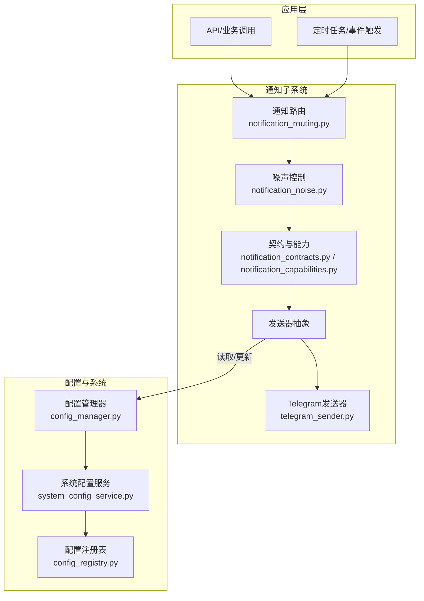
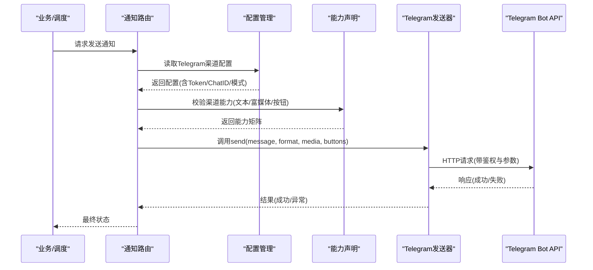
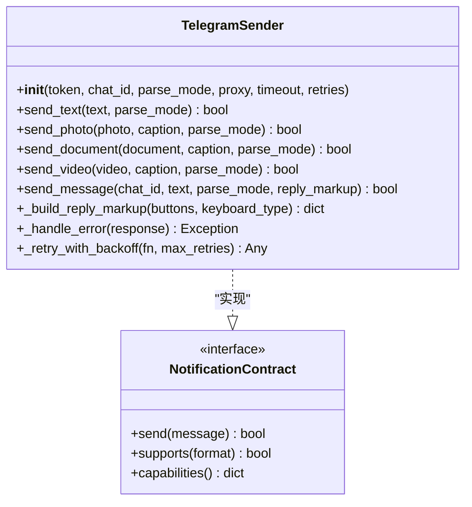
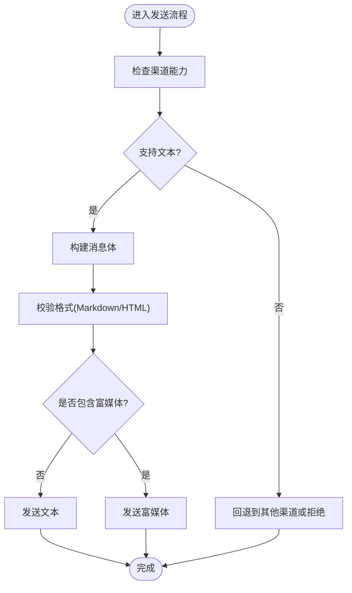
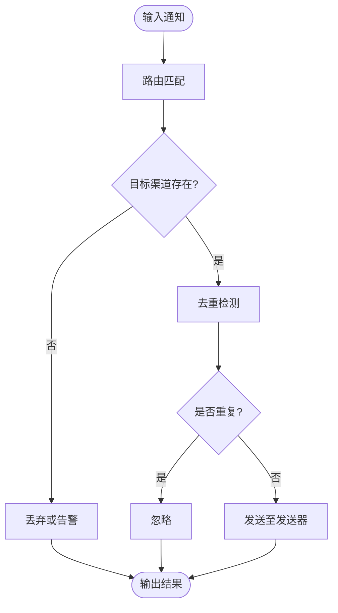
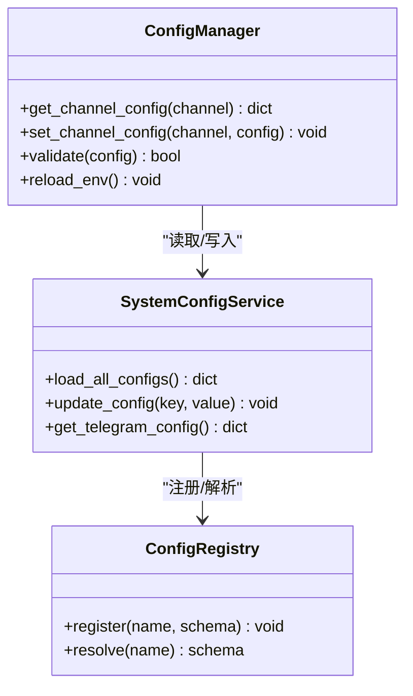
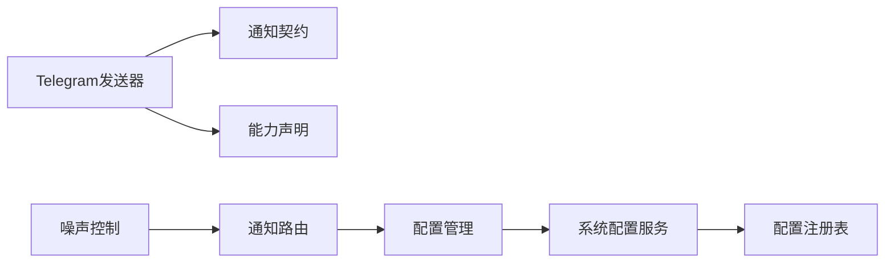

# Telegram渠道

<cite>
**本文引用的文件**   
- [telegram_sender.py](file://src/notification_sender/telegram_sender.py)
- [notification.py](file://src/notification.py)
- [notification_capabilities.py](file://src/notification_capabilities.py)
- [notification_contracts.py](file://src/notification_contracts.py)
- [notification_noise.py](file://src/notification_noise.py)
- [notification_routing.py](file://src/notification_routing.py)
- [system_config_service.py](file://src/services/system_config_service.py)
- [config_manager.py](file://src/core/config_manager.py)
- [config_registry.py](file://src/core/config_registry.py)
- [test_notification_sender.py](file://tests/test_notification_sender.py)
- [notifications.md](file://docs/notifications.md)
</cite>

## 目录
1. [简介](#简介)
2. [项目结构](#项目结构)
3. [核心组件](#核心组件)
4. [架构总览](#架构总览)
5. [详细组件分析](#详细组件分析)
6. [依赖关系分析](#依赖关系分析)
7. [性能考虑](#性能考虑)
8. [故障排查指南](#故障排查指南)
9. [结论](#结论)
10. [附录](#附录)

## 简介
本章节面向需要在系统中集成Telegram通知渠道的用户与开发者，提供从Bot Token获取、权限配置、群组/频道ID设置到消息发送格式（Markdown、HTML）、富媒体消息（图片、文件、视频）、交互式按钮与键盘布局的完整说明。同时涵盖错误处理机制、速率限制策略、连接池管理以及常见问题解决方案与调试技巧。

## 项目结构
Telegram通知能力由后端服务中的通知子系统统一编排，具体实现位于通知发送器模块中。整体结构如下：
- 通知发送器层：封装各渠道的具体发送逻辑（如Telegram）
- 通知契约与能力层：定义统一的接口、能力声明与数据模型
- 路由与降噪层：负责消息路由、去重与噪声控制
- 配置管理层：集中管理渠道配置与环境变量
- 测试与文档：覆盖功能验证与使用指引

图表来源
- [notification_routing.py](file://src/notification_routing.py)
- [notification_noise.py](file://src/notification_noise.py)
- [notification_contracts.py](file://src/notification_contracts.py)
- [notification_capabilities.py](file://src/notification_capabilities.py)
- [telegram_sender.py](file://src/notification_sender/telegram_sender.py)
- [config_manager.py](file://src/core/config_manager.py)
- [system_config_service.py](file://src/services/system_config_service.py)
- [config_registry.py](file://src/core/config_registry.py)

章节来源
- [notification.py](file://src/notification.py)
- [notifications.md](file://docs/notifications.md)

## 核心组件
- Telegram发送器：封装Telegram Bot API调用，支持文本、富媒体与交互控件
- 通知契约：定义所有渠道的统一发送接口与数据结构
- 能力声明：声明各渠道支持的能力（如富媒体、按钮等）
- 路由与降噪：将消息按规则分发至目标渠道并避免重复或噪声
- 配置管理：集中加载与校验渠道配置（Token、Chat ID、模式等）

章节来源
- [telegram_sender.py](file://src/notification_sender/telegram_sender.py)
- [notification_contracts.py](file://src/notification_contracts.py)
- [notification_capabilities.py](file://src/notification_capabilities.py)
- [notification_routing.py](file://src/notification_routing.py)
- [notification_noise.py](file://src/notification_noise.py)
- [config_manager.py](file://src/core/config_manager.py)
- [system_config_service.py](file://src/services/system_config_service.py)
- [config_registry.py](file://src/core/config_registry.py)

## 架构总览
下图展示了从业务侧触发通知到Telegram发送的端到端流程，包括配置加载、能力检查、消息构建与发送、错误处理与重试。

图表来源
- [notification_routing.py](file://src/notification_routing.py)
- [notification_capabilities.py](file://src/notification_capabilities.py)
- [telegram_sender.py](file://src/notification_sender/telegram_sender.py)
- [config_manager.py](file://src/core/config_manager.py)

## 详细组件分析

### Telegram发送器
- 职责：封装Telegram Bot API的HTTP调用，支持文本消息、富媒体（图片、文件、视频）、交互式按钮与键盘布局；负责格式化、参数校验、错误处理与重试。
- 关键能力：
  - 文本格式：Markdown与HTML两种解析模式
  - 富媒体：图片、文件、视频上传与附带说明
  - 交互控件：内联按钮、回复键盘、菜单按钮
  - 错误处理：网络异常、限流、权限不足、非法参数等
  - 速率限制：基于Telegram官方限制的退避策略
  - 连接池：复用HTTP连接提升吞吐

图表来源
- [telegram_sender.py](file://src/notification_sender/telegram_sender.py)
- [notification_contracts.py](file://src/notification_contracts.py)

章节来源
- [telegram_sender.py](file://src/notification_sender/telegram_sender.py)
- [notification_contracts.py](file://src/notification_contracts.py)

### 通知契约与能力
- 契约：统一抽象所有渠道的发送接口，确保路由层可无差别调用
- 能力：声明每个渠道支持的格式与特性（如Markdown/HTML、富媒体、按钮等），用于前置校验与降级策略

图表来源
- [notification_capabilities.py](file://src/notification_capabilities.py)
- [notification_contracts.py](file://src/notification_contracts.py)

章节来源
- [notification_capabilities.py](file://src/notification_capabilities.py)
- [notification_contracts.py](file://src/notification_contracts.py)

### 路由与降噪
- 路由：根据规则将消息分发到指定渠道与目标（群组/频道/用户）
- 降噪：对重复消息进行去重，过滤低优先级或噪声消息，保障通道质量

图表来源
- [notification_routing.py](file://src/notification_routing.py)
- [notification_noise.py](file://src/notification_noise.py)

章节来源
- [notification_routing.py](file://src/notification_routing.py)
- [notification_noise.py](file://src/notification_noise.py)

### 配置管理
- 集中管理Telegram渠道的配置项（Bot Token、Chat ID、解析模式、代理、超时、重试次数等）
- 支持环境变量注入与运行时更新，提供校验与默认值

图表来源
- [config_manager.py](file://src/core/config_manager.py)
- [system_config_service.py](file://src/services/system_config_service.py)
- [config_registry.py](file://src/core/config_registry.py)

章节来源
- [config_manager.py](file://src/core/config_manager.py)
- [system_config_service.py](file://src/services/system_config_service.py)
- [config_registry.py](file://src/core/config_registry.py)

## 依赖关系分析
- Telegram发送器依赖通知契约与能力声明，确保接口一致性与能力前置校验
- 路由与降噪依赖配置管理与系统配置服务，以动态调整行为
- 配置管理依赖配置注册表，保证配置结构的合法性与可扩展性

图表来源
- [telegram_sender.py](file://src/notification_sender/telegram_sender.py)
- [notification_contracts.py](file://src/notification_contracts.py)
- [notification_capabilities.py](file://src/notification_capabilities.py)
- [notification_routing.py](file://src/notification_routing.py)
- [notification_noise.py](file://src/notification_noise.py)
- [config_manager.py](file://src/core/config_manager.py)
- [system_config_service.py](file://src/services/system_config_service.py)
- [config_registry.py](file://src/core/config_registry.py)

章节来源
- [telegram_sender.py](file://src/notification_sender/telegram_sender.py)
- [notification_contracts.py](file://src/notification_contracts.py)
- [notification_capabilities.py](file://src/notification_capabilities.py)
- [notification_routing.py](file://src/notification_routing.py)
- [notification_noise.py](file://src/notification_noise.py)
- [config_manager.py](file://src/core/config_manager.py)
- [system_config_service.py](file://src/services/system_config_service.py)
- [config_registry.py](file://src/core/config_registry.py)

## 性能考虑
- 连接池：复用HTTP连接减少握手开销，提高并发发送能力
- 速率限制：遵循Telegram官方限制，采用指数退避与队列限流
- 异步发送：在高吞吐场景下建议异步化发送路径，避免阻塞主流程
- 批量发送：合并小消息为批量请求，降低API调用频率
- 缓存与去重：利用路由与降噪模块减少重复发送

[本节为通用指导，不直接分析具体文件]

## 故障排查指南
- 常见错误
  - 未授权：检查Bot Token是否正确且未被重置
  - 权限不足：确认Bot已加入群组/频道并具有发消息权限
  - 非法参数：检查消息长度、媒体大小与格式是否符合要求
  - 网络异常：检查代理设置与超时配置
  - 限流：观察响应码与日志，适当降低发送频率或增加退避时间
- 调试技巧
  - 启用详细日志，记录请求与响应
  - 使用最小化消息复现问题
  - 通过系统配置服务动态切换解析模式与重试策略
  - 参考测试用例验证基本流程

章节来源
- [test_notification_sender.py](file://tests/test_notification_sender.py)
- [notifications.md](file://docs/notifications.md)

## 结论
Telegram渠道在本项目中通过统一的契约与能力声明实现了高内聚、低耦合的通知发送能力。结合配置管理与路由降噪，提供了稳定、可扩展且易于维护的消息推送方案。按照本文档进行配置与调优，可有效提升通知送达率与用户体验。

[本节为总结性内容，不直接分析具体文件]

## 附录
- 配置示例要点
  - Bot Token：从@BotFather获取，保持机密
  - Chat ID：群组或频道的唯一标识，可在Telegram客户端或通过API获取
  - 解析模式：Markdown或HTML，根据消息内容选择
  - 代理与超时：根据网络环境合理设置
  - 重试策略：根据业务容忍度调整最大重试次数与退避间隔
- 富媒体与交互
  - 图片/文件/视频：注意大小限制与格式要求
  - 按钮与键盘：确保回调数据合法且不超过长度限制
- 最佳实践
  - 分渠道隔离配置，便于独立调试
  - 监控与告警：对失败率与延迟进行监控
  - 定期审计权限与Token有效性

[本节为补充信息，不直接分析具体文件]