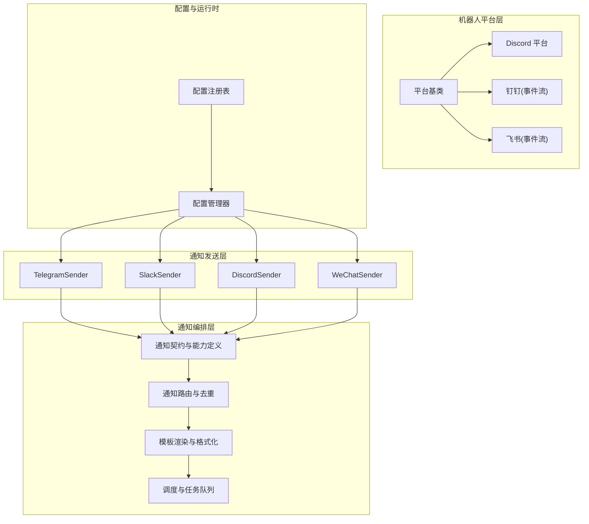
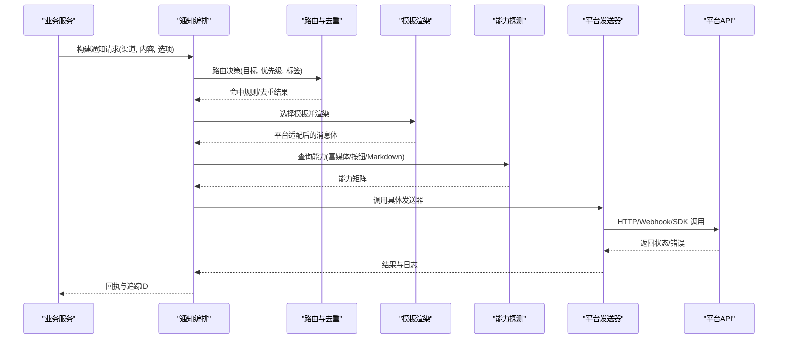
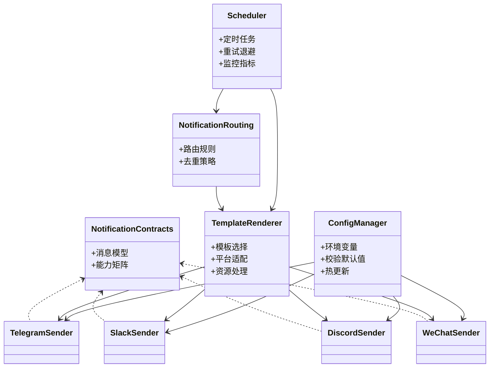

# 即时通讯渠道

<cite>
**本文引用的文件**   
- [telegram_sender.py](file://src/notification_sender/telegram_sender.py)
- [slack_sender.py](file://src/notification_sender/slack_sender.py)
- [discord_sender.py](file://src/notification_sender/discord_sender.py)
- [wechat_sender.py](file://src/notification_sender/wechat_sender.py)
- [notification.py](file://src/notification.py)
- [notification_capabilities.py](file://src/notification_capabilities.py)
- [notification_contracts.py](file://src/notification_contracts.py)
- [notification_routing.py](file://src/notification_routing.py)
- [notification_noise.py](file://src/notification_noise.py)
- [scheduler.py](file://src/scheduler.py)
- [config_manager.py](file://src/core/config_manager.py)
- [config_registry.py](file://src/core/config_registry.py)
- [bot/dispatcher.py](file://bot/dispatcher.py)
- [bot/handler.py](file://bot/handler.py)
- [bot/models.py](file://bot/models.py)
- [bot/platforms/base.py](file://bot/platforms/base.py)
- [bot/platforms/discord.py](file://bot/platforms/discord.py)
- [bot/platforms/dingtalk.py](file://bot/platforms/dingtalk.py)
- [bot/platforms/dingtalk_stream.py](file://bot/platforms/dingtalk_stream.py)
- [bot/platforms/feishu_stream.py](file://bot/platforms/feishu_stream.py)
- [templates/report_wechat.j2](file://templates/report_wechat.j2)
- [templates/report_markdown.j2](file://templates/report_markdown.j2)
- [scripts/generate_notification_actions_env_table.py](file://scripts/generate_notification_actions_env_table.py)
</cite>

## 目录
1. [简介](#简介)
2. [项目结构](#项目结构)
3. [核心组件](#核心组件)
4. [架构总览](#架构总览)
5. [详细组件分析](#详细组件分析)
6. [依赖关系分析](#依赖关系分析)
7. [性能与稳定性](#性能与稳定性)
8. [故障排查指南](#故障排查指南)
9. [结论](#结论)
10. [附录：各平台配置与最佳实践](#附录各平台配置与最佳实践)

## 简介
本文件面向“即时通讯渠道”的集成与使用，覆盖 Telegram、Slack、Discord、微信等主流平台。文档从系统架构、数据流、认证与密钥配置、频道/群组设置、消息格式定制、富媒体与交互能力、速率限制、错误处理与连接池管理等方面进行全面说明，并提供可操作的配置示例与最佳实践，帮助读者快速落地并稳定运行。

## 项目结构
本项目将“通知发送器”与“机器人平台接入”分层实现：
- 通知发送层（Notification Senders）：封装各平台的 HTTP/Webhook/SDK 调用细节，统一对外接口。
- 通知编排层（Notification Orchestration）：负责消息路由、模板渲染、能力探测、噪声控制与调度触发。
- 机器人平台层（Bot Platforms）：提供事件驱动的消息收发与命令解析，对接 Discord、钉钉、飞书等平台。
- 配置与运行时：集中管理环境变量、配置注册表与动态配置更新。

图表来源
- [telegram_sender.py](file://src/notification_sender/telegram_sender.py)
- [slack_sender.py](file://src/notification_sender/slack_sender.py)
- [discord_sender.py](file://src/notification_sender/discord_sender.py)
- [wechat_sender.py](file://src/notification_sender/wechat_sender.py)
- [notification_contracts.py](file://src/notification_contracts.py)
- [notification_routing.py](file://src/notification_routing.py)
- [notification_capabilities.py](file://src/notification_capabilities.py)
- [scheduler.py](file://src/scheduler.py)
- [config_manager.py](file://src/core/config_manager.py)
- [config_registry.py](file://src/core/config_registry.py)
- [bot/platforms/base.py](file://bot/platforms/base.py)
- [bot/platforms/discord.py](file://bot/platforms/discord.py)
- [bot/platforms/dingtalk_stream.py](file://bot/platforms/dingtalk_stream.py)
- [bot/platforms/feishu_stream.py](file://bot/platforms/feishu_stream.py)

章节来源
- [notification.py](file://src/notification.py)
- [notification_capabilities.py](file://src/notification_capabilities.py)
- [notification_contracts.py](file://src/notification_contracts.py)
- [notification_routing.py](file://src/notification_routing.py)
- [scheduler.py](file://src/scheduler.py)
- [config_manager.py](file://src/core/config_manager.py)
- [config_registry.py](file://src/core/config_registry.py)

## 核心组件
- 通知契约与能力
  - 统一消息模型：文本、富文本、图片、附件、按钮、卡片等。
  - 能力探测：是否支持富媒体、按钮、Markdown、线程/子频道等。
- 通知路由与去重
  - 按目标渠道、主题、标签进行路由。
  - 基于内容指纹或规则的去重，避免重复打扰。
- 模板与格式化
  - 多模板引擎（Markdown、HTML、平台特定卡片）。
  - 平台适配层自动转换到目标格式。
- 调度与任务队列
  - 定时任务与事件触发。
  - 并发控制、重试与退避策略。
- 配置管理
  - 环境变量优先，支持热更新与校验。
  - 平台密钥、频道ID、Webhook URL、代理等集中管理。

章节来源
- [notification_contracts.py](file://src/notification_contracts.py)
- [notification_capabilities.py](file://src/notification_capabilities.py)
- [notification_routing.py](file://src/notification_routing.py)
- [notification_noise.py](file://src/notification_noise.py)
- [scheduler.py](file://src/scheduler.py)
- [config_manager.py](file://src/core/config_manager.py)
- [config_registry.py](file://src/core/config_registry.py)

## 架构总览
下图展示了从业务侧触发通知到最终投递至各平台的完整流程，包括路由、模板渲染、能力选择与平台适配。

图表来源
- [notification.py](file://src/notification.py)
- [notification_routing.py](file://src/notification_routing.py)
- [notification_capabilities.py](file://src/notification_capabilities.py)
- [telegram_sender.py](file://src/notification_sender/telegram_sender.py)
- [slack_sender.py](file://src/notification_sender/slack_sender.py)
- [discord_sender.py](file://src/notification_sender/discord_sender.py)
- [wechat_sender.py](file://src/notification_sender/wechat_sender.py)

## 详细组件分析

### 通知契约与能力
- 统一消息模型：包含文本、富文本、图片、附件、按钮、卡片、链接预览等字段。
- 能力矩阵：不同平台对 Markdown、富媒体、按钮、线程、子频道、引用回复的支持度不同，发送前需探测并降级。
- 扩展点：新增平台时只需实现发送器与能力映射，无需改动上层逻辑。

章节来源
- [notification_contracts.py](file://src/notification_contracts.py)
- [notification_capabilities.py](file://src/notification_capabilities.py)

### 通知路由与去重
- 路由规则：按渠道、主题、标签、用户/群组维度匹配。
- 去重策略：基于内容指纹、时间窗口、阈值过滤，降低噪音。
- 优先级与延迟：高优先级立即发送，低优先级合并或延后。

章节来源
- [notification_routing.py](file://src/notification_routing.py)
- [notification_noise.py](file://src/notification_noise.py)

### 模板与格式化
- 模板类型：Markdown、HTML、平台卡片（如 Slack Blocks、Discord Embeds、WeChat 模板）。
- 渲染流程：根据目标平台能力选择模板，缺失能力时自动降级为纯文本。
- 资源处理：图片/附件上传与缓存，确保跨平台一致性。

章节来源
- [notification.py](file://src/notification.py)
- [templates/report_markdown.j2](file://templates/report_markdown.j2)
- [templates/report_wechat.j2](file://templates/report_wechat.j2)

### 调度与任务队列
- 触发方式：定时任务、事件回调、外部 API 触发。
- 执行策略：并发控制、重试与指数退避、失败告警。
- 监控指标：成功率、延迟、错误码分布、平台限流统计。

章节来源
- [scheduler.py](file://src/scheduler.py)

### 配置管理与注册表
- 配置来源：环境变量、配置文件、远程配置中心。
- 校验与默认值：启动时校验必填项，提供合理默认值。
- 热更新：支持运行时刷新密钥与通道配置，无需重启。

章节来源
- [config_manager.py](file://src/core/config_manager.py)
- [config_registry.py](file://src/core/config_registry.py)

### 机器人平台接入（Discord、钉钉、飞书）
- 平台基类：统一事件模型、消息构造、鉴权与会话管理。
- 平台实现：针对各平台差异进行适配（权限、签名、事件流、回调）。
- 命令与交互：支持命令解析、按钮回调、表单提交等。

章节来源
- [bot/platforms/base.py](file://bot/platforms/base.py)
- [bot/platforms/discord.py](file://bot/platforms/discord.py)
- [bot/platforms/dingtalk_stream.py](file://bot/platforms/dingtalk_stream.py)
- [bot/platforms/feishu_stream.py](file://bot/platforms/feishu_stream.py)
- [bot/dispatcher.py](file://bot/dispatcher.py)
- [bot/handler.py](file://bot/handler.py)
- [bot/models.py](file://bot/models.py)

## 依赖关系分析
- 发送器与契约：各发送器依赖统一消息模型与能力定义，保证跨平台一致性。
- 路由与模板：路由决定目标平台，模板渲染依据能力矩阵生成最终消息体。
- 配置与运行时：所有发送器通过配置管理器获取密钥、代理、超时等参数。
- 调度与发送：调度器驱动发送流程，记录指标与错误，支撑可观测性。

图表来源
- [notification_contracts.py](file://src/notification_contracts.py)
- [notification_routing.py](file://src/notification_routing.py)
- [notification.py](file://src/notification.py)
- [scheduler.py](file://src/scheduler.py)
- [config_manager.py](file://src/core/config_manager.py)
- [telegram_sender.py](file://src/notification_sender/telegram_sender.py)
- [slack_sender.py](file://src/notification_sender/slack_sender.py)
- [discord_sender.py](file://src/notification_sender/discord_sender.py)
- [wechat_sender.py](file://src/notification_sender/wechat_sender.py)

章节来源
- [notification_contracts.py](file://src/notification_contracts.py)
- [notification_routing.py](file://src/notification_routing.py)
- [notification.py](file://src/notification.py)
- [scheduler.py](file://src/scheduler.py)
- [config_manager.py](file://src/core/config_manager.py)

## 性能与稳定性
- 速率限制
  - 各平台均有严格的 API 限流（如每秒请求数、每分钟令牌数）。
  - 建议采用令牌桶/漏桶算法，结合平台返回的限流头进行自适应降速。
  - 对批量发送进行分片与合并，避免突发流量。
- 错误处理
  - 区分网络错误、认证失败、限流、业务校验失败等错误类型。
  - 实施重试策略：指数退避、最大重试次数、死信队列。
  - 关键错误上报与告警，便于快速定位。
- 连接池管理
  - 复用 HTTP 连接，减少握手开销。
  - 合理设置连接池大小、超时与空闲回收策略。
  - 针对不同平台独立池化，避免相互影响。
- 监控与可观测性
  - 指标：成功率、延迟、错误码分布、限流命中率。
  - 日志：结构化日志，包含渠道、消息ID、耗时、错误信息。
  - 追踪：端到端链路追踪，便于问题定位。

[本节为通用指导，不直接分析具体文件]

## 故障排查指南
- 常见问题
  - 认证失败：检查 Token/Secret/Client ID 是否正确，权限是否开启。
  - 限流频繁：调整发送频率，增加退避策略，必要时拆分任务。
  - 富媒体失败：确认平台能力与文件大小限制，启用降级为文本。
  - 模板渲染异常：检查模板语法与变量填充，查看渲染日志。
- 诊断步骤
  - 启用调试日志，捕获请求与响应。
  - 使用最小化用例复现问题，逐步缩小范围。
  - 检查平台控制台的状态与错误信息。
- 工具与脚本
  - 使用内置的诊断脚本与环境检查工具，验证配置与连通性。

章节来源
- [telegram_sender.py](file://src/notification_sender/telegram_sender.py)
- [slack_sender.py](file://src/notification_sender/slack_sender.py)
- [discord_sender.py](file://src/notification_sender/discord_sender.py)
- [wechat_sender.py](file://src/notification_sender/wechat_sender.py)
- [notification.py](file://src/notification.py)

## 结论
通过统一的契约与能力矩阵、灵活的路由与模板机制、健壮的调度与配置管理，本项目实现了跨平台即时通讯的稳定集成。遵循本文的配置与最佳实践，可有效提升消息送达率与用户体验，同时保障系统的可扩展性与可维护性。

[本节为总结，不直接分析具体文件]

## 附录：各平台配置与最佳实践

### Telegram
- 认证方式
  - Bot Token：在 Telegram BotFather 创建并获取。
  - 可选：代理与超时配置。
- 频道/群组设置
  - 频道/群组 ID：用于定向发送。
  - 权限：确保 Bot 已加入并有发送权限。
- 消息格式与功能
  - 支持 MarkdownV2/HTML 解析。
  - 富媒体：图片、视频、音频、文档。
  - 交互：内联按钮、菜单、回调。
- 速率限制与错误处理
  - 注意每秒请求限制，实施退避与重试。
  - 处理常见错误：未授权、聊天不存在、内容过大。
- 配置示例要点
  - 环境变量：BOT_TOKEN、CHANNEL_ID、PROXY_URL、TIMEOUT。
  - 校验必填项与默认超时。

章节来源
- [telegram_sender.py](file://src/notification_sender/telegram_sender.py)
- [config_manager.py](file://src/core/config_manager.py)

### Slack
- 认证方式
  - Bot Token（xoxb-...）与 App-Level Token（xapp-...）。
  - OAuth 应用权限：channels:read、chat:write、files:write 等。
- 频道/群组设置
  - Channel ID 或名称；支持私聊与多成员频道。
- 消息格式与功能
  - Blocks UI、Markdown、富媒体、按钮、交互式消息。
  - 线程与引用回复。
- 速率限制与错误处理
  - 关注 Slack API 限流与重试头。
  - 处理权限不足、频道不存在、消息过长等错误。
- 配置示例要点
  - 环境变量：SLACK_BOT_TOKEN、SLACK_APP_TOKEN、DEFAULT_CHANNEL。
  - 代理与超时配置。

章节来源
- [slack_sender.py](file://src/notification_sender/slack_sender.py)
- [config_manager.py](file://src/core/config_manager.py)

### Discord
- 认证方式
  - Bot Token：在开发者门户创建并启用必要权限。
- 频道/群组设置
  - 服务器与频道 ID；支持线程与子频道。
- 消息格式与功能
  - Embeds、富媒体、按钮、选择器、模态框。
  - 支持 Slash Commands 与交互回调。
- 速率限制与错误处理
  - 严格限流，需实现令牌桶与退避。
  - 处理权限不足、频道不可访问、消息长度限制。
- 配置示例要点
  - 环境变量：DISCORD_BOT_TOKEN、DEFAULT_CHANNEL_ID。
  - 代理与超时。

章节来源
- [discord_sender.py](file://src/notification_sender/discord_sender.py)
- [bot/platforms/discord.py](file://bot/platforms/discord.py)
- [config_manager.py](file://src/core/config_manager.py)

### 微信
- 认证方式
  - 企业微信：CorpID、AgentID、Secret。
  - 公众号：AppID、AppSecret、Token、EncodingAESKey。
- 频道/群组设置
  - 企业微信：部门/成员 ID 或标签。
  - 公众号：用户 OpenID 或群发模板。
- 消息格式与功能
  - 文本、图文、模板消息、卡片消息。
  - 富媒体：图片、语音、视频、文件（受平台限制）。
- 速率限制与错误处理
  - 关注每日发送上限与频率限制。
  - 处理签名校验失败、用户不可达、模板参数错误。
- 配置示例要点
  - 环境变量：WECHAT_CORP_ID、AGENT_ID、SECRET、TEMPLATE_ID。
  - 代理与超时。

章节来源
- [wechat_sender.py](file://src/notification_sender/wechat_sender.py)
- [templates/report_wechat.j2](file://templates/report_wechat.j2)
- [config_manager.py](file://src/core/config_manager.py)

### 通用最佳实践
- 安全与合规
  - 密钥存储于环境变量或密钥管理服务，禁止硬编码。
  - 传输加密（HTTPS/TLS），敏感信息脱敏。
- 可靠性与可观测性
  - 重试与退避、死信队列、错误告警。
  - 指标采集与日志审计，支持回溯与排障。
- 性能优化
  - 连接池与并发控制，避免热点瓶颈。
  - 模板预编译与资源缓存，减少渲染开销。
- 扩展与维护
  - 新增平台遵循契约与能力矩阵，保持解耦。
  - 定期更新依赖与平台 SDK，修复已知漏洞。

[本节为通用指导，不直接分析具体文件]