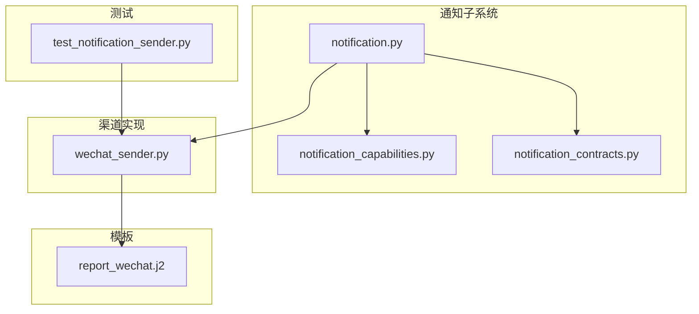
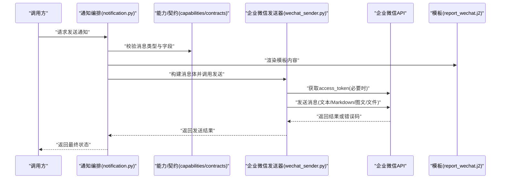
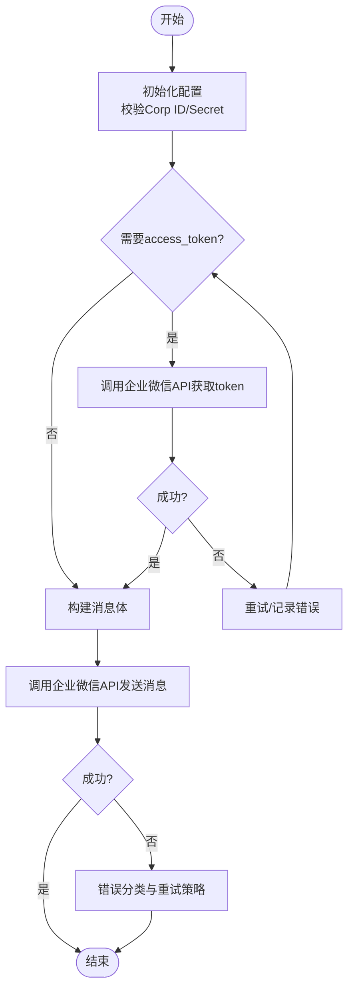
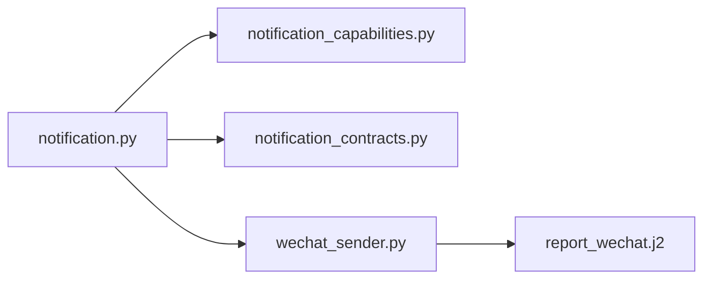

# 微信渠道

<cite>
**本文引用的文件**   
- [wechat_sender.py](file://src/notification_sender/wechat_sender.py)
- [notification.py](file://src/notification.py)
- [notification_capabilities.py](file://src/notification_capabilities.py)
- [notification_contracts.py](file://src/notification_contracts.py)
- [templates/report_wechat.j2](file://templates/report_wechat.j2)
- [test_notification_sender.py](file://tests/test_notification_sender.py)
</cite>

## 目录
1. [简介](#简介)
2. [项目结构](#项目结构)
3. [核心组件](#核心组件)
4. [架构总览](#架构总览)
5. [详细组件分析](#详细组件分析)
6. [依赖关系分析](#依赖关系分析)
7. [性能与可靠性](#性能与可靠性)
8. [故障排查指南](#故障排查指南)
9. [结论](#结论)
10. [附录](#附录)

## 简介
本章节面向企业微信（WeCom）通知渠道，说明在企业级场景下如何创建应用、配置 Corp ID 与 Secret、设置部门权限，并详细描述消息类型支持（文本、Markdown、图文、文件等）、模板消息与互动卡片的使用方式。文档同时给出完整的配置示例、消息格式规范、错误码处理与重试机制，以及企业微信特有的功能说明与注意事项，帮助开发者快速集成与稳定运行。

## 项目结构
本项目将“微信渠道”的实现集中在通知发送器模块中，并通过统一的通知能力与契约进行抽象，便于扩展其他渠道。关键文件如下：
- 发送器实现：wechat_sender.py
- 通知能力与契约：notification_capabilities.py、notification_contracts.py
- 通知入口与编排：notification.py
- 模板：report_wechat.j2
- 测试用例：test_notification_sender.py

图表来源
- [notification.py](file://src/notification.py)
- [notification_capabilities.py](file://src/notification_capabilities.py)
- [notification_contracts.py](file://src/notification_contracts.py)
- [wechat_sender.py](file://src/notification_sender/wechat_sender.py)
- [templates/report_wechat.j2](file://templates/report_wechat.j2)
- [test_notification_sender.py](file://tests/test_notification_sender.py)

章节来源
- [wechat_sender.py](file://src/notification_sender/wechat_sender.py)
- [notification.py](file://src/notification.py)
- [notification_capabilities.py](file://src/notification_capabilities.py)
- [notification_contracts.py](file://src/notification_contracts.py)
- [templates/report_wechat.j2](file://templates/report_wechat.j2)
- [test_notification_sender.py](file://tests/test_notification_sender.py)

## 核心组件
- 企业微信发送器（wechat_sender.py）
  - 负责与企业微信 API 交互，包括获取 access_token、构造并发送消息、上传媒体资源、处理错误与重试。
  - 支持的消息类型通常包括：文本、Markdown、图文、文件/图片等；具体以实现为准。
  - 提供模板渲染能力，将报告内容渲染为企业微信可识别的格式。
- 通知能力与契约（notification_capabilities.py、notification_contracts.py）
  - 定义各渠道的统一接口与数据结构，确保不同渠道在调用方侧保持一致的行为。
  - 明确支持的 message_type、字段约束、可选参数等。
- 通知编排（notification.py）
  - 作为上层入口，根据配置选择对应渠道发送器，组装消息体并调用发送。
- 模板（report_wechat.j2）
  - 用于生成企业微信消息体或富文本内容，保证样式与排版一致。
- 测试（test_notification_sender.py）
  - 覆盖发送流程、错误分支与边界条件，保障稳定性。

章节来源
- [wechat_sender.py](file://src/notification_sender/wechat_sender.py)
- [notification_capabilities.py](file://src/notification_capabilities.py)
- [notification_contracts.py](file://src/notification_contracts.py)
- [notification.py](file://src/notification.py)
- [templates/report_wechat.j2](file://templates/report_wechat.j2)
- [test_notification_sender.py](file://tests/test_notification_sender.py)

## 架构总览
下图展示了从通知编排到企业微信发送器的调用链路，以及模板渲染与错误处理的要点。

图表来源
- [notification.py](file://src/notification.py)
- [notification_capabilities.py](file://src/notification_capabilities.py)
- [notification_contracts.py](file://src/notification_contracts.py)
- [wechat_sender.py](file://src/notification_sender/wechat_sender.py)
- [templates/report_wechat.j2](file://templates/report_wechat.j2)

## 详细组件分析

### 企业微信发送器（wechat_sender.py）
- 职责
  - 管理企业微信凭证（Corp ID、Secret），缓存 access_token 并处理过期刷新。
  - 构造并发送各类消息（文本、Markdown、图文、文件等）。
  - 处理企业微信返回的错误码，按策略重试或降级。
  - 与模板引擎协作，将报告内容渲染为期望格式。
- 关键流程
  - 初始化：加载配置、校验必要字段（如 Corp ID、Secret、Agent ID 等）。
  - Token 管理：首次获取、有效期管理、失败重试。
  - 消息发送：根据 message_type 选择对应 API，组装 body，调用发送。
  - 错误处理：区分网络异常、鉴权失败、业务限制等，执行重试或告警。
- 模板渲染
  - 使用 report_wechat.j2 生成消息内容，确保企业微信端展示效果。

图表来源
- [wechat_sender.py](file://src/notification_sender/wechat_sender.py)

章节来源
- [wechat_sender.py](file://src/notification_sender/wechat_sender.py)

### 通知能力与契约（notification_capabilities.py、notification_contracts.py）
- 能力定义
  - 明确支持的 message_type（如 text、markdown、image、file、news 等）。
  - 每个类型的必填字段、长度限制、特殊字符处理规则。
- 契约约定
  - 统一的发送接口签名，包含目标对象（用户/部门/全员）、消息体、回调等。
  - 错误码映射与重试策略的约定，便于各渠道实现一致性。
- 扩展性
  - 新增渠道时只需实现统一接口，无需改动上层编排逻辑。

章节来源
- [notification_capabilities.py](file://src/notification_capabilities.py)
- [notification_contracts.py](file://src/notification_contracts.py)

### 通知编排（notification.py）
- 职责
  - 根据系统配置选择渠道发送器（如 wechat_sender）。
  - 校验消息类型与字段，调用模板渲染生成内容。
  - 调用发送器发送消息，捕获并上报错误。
- 流程要点
  - 路由：按渠道名解析发送器实例。
  - 渲染：将数据模型注入模板，输出企业微信兼容格式。
  - 发送：封装发送结果与日志，便于追踪。

章节来源
- [notification.py](file://src/notification.py)

### 模板（report_wechat.j2）
- 作用
  - 生成企业微信消息体或富文本内容，保证样式与排版一致。
- 设计要点
  - 适配企业微信 Markdown 与图文消息的语法。
  - 变量占位符与条件渲染，支持多语言与主题切换。

章节来源
- [templates/report_wechat.j2](file://templates/report_wechat.j2)

### 测试（test_notification_sender.py）
- 覆盖范围
  - 正常发送路径、错误分支（鉴权失败、网络超时、业务限制）。
  - 模板渲染正确性与边界值。
- 价值
  - 保障发送器稳定性，辅助回归验证。

章节来源
- [test_notification_sender.py](file://tests/test_notification_sender.py)

## 依赖关系分析
- 内部依赖
  - notification.py 依赖 capabilities/contracts 定义与 wechat_sender 实现。
  - wechat_sender.py 依赖模板渲染与 HTTP 客户端（企业微信 API）。
- 外部依赖
  - 企业微信开放平台 API（access_token、消息发送、媒体上传等）。
- 耦合与内聚
  - 通过统一契约降低耦合，提高内聚性；新增渠道不影响现有逻辑。

图表来源
- [notification.py](file://src/notification.py)
- [notification_capabilities.py](file://src/notification_capabilities.py)
- [notification_contracts.py](file://src/notification_contracts.py)
- [wechat_sender.py](file://src/notification_sender/wechat_sender.py)
- [templates/report_wechat.j2](file://templates/report_wechat.j2)

章节来源
- [notification.py](file://src/notification.py)
- [notification_capabilities.py](file://src/notification_capabilities.py)
- [notification_contracts.py](file://src/notification_contracts.py)
- [wechat_sender.py](file://src/notification_sender/wechat_sender.py)
- [templates/report_wechat.j2](file://templates/report_wechat.j2)

## 性能与可靠性
- 性能优化建议
  - access_token 缓存与预热，减少频繁获取。
  - 批量发送与合并消息，降低 API 调用次数。
  - 异步发送与队列化，避免阻塞主流程。
- 可靠性保障
  - 重试策略：指数退避、最大重试次数、熔断降级。
  - 错误分类：网络层、鉴权层、业务层分别处理。
  - 监控与告警：记录关键指标（成功率、延迟、错误码分布）。

[本节为通用指导，不直接分析具体文件]

## 故障排查指南
- 常见问题
  - 鉴权失败：检查 Corp ID、Secret、Agent ID 是否正确，域名白名单是否配置。
  - 频率限制：关注企业微信 API 限频，合理控制发送速率。
  - 模板渲染错误：核对模板语法与变量填充。
- 定位步骤
  - 查看发送器日志与错误码，确认失败阶段（token、发送、渲染）。
  - 使用测试用例复现问题，逐步缩小范围。
  - 检查企业微信后台权限与可见范围设置。

章节来源
- [test_notification_sender.py](file://tests/test_notification_sender.py)
- [wechat_sender.py](file://src/notification_sender/wechat_sender.py)

## 结论
企业微信渠道在本项目中通过统一的能力与契约进行抽象，发送器实现聚焦于与企业微信 API 的交互与错误处理。借助模板渲染与完善的测试覆盖，能够稳定地支持多种消息类型。建议在部署时严格配置凭证与权限，结合重试与监控策略，确保高可用与可观测性。

[本节为总结性内容，不直接分析具体文件]

## 附录

### 企业微信应用创建与配置要点
- 应用创建
  - 登录企业微信管理后台，创建自建应用，记录 Corp ID、Agent ID、Secret。
- 权限设置
  - 配置应用的可见范围（部门/成员），确保目标用户可接收消息。
- 安全与合规
  - 配置 IP 白名单与回调 URL，遵循最小权限原则。

[本节为概念性说明，不直接分析具体文件]

### 消息类型与格式规范
- 文本消息
  - 适用于简短通知，注意长度限制与敏感信息脱敏。
- Markdown 消息
  - 支持基础 Markdown 语法，企业微信端渲染效果需验证。
- 图文消息
  - 标题、摘要、图片、链接的组合，适合报告摘要推送。
- 文件/图片
  - 先上传媒体资源再引用，注意大小与格式限制。
- 模板消息与互动卡片
  - 使用模板变量填充内容，卡片按钮事件回调需配置回调地址。

[本节为概念性说明，不直接分析具体文件]

### 完整配置示例（环境变量）
- 必需项
  - WECHAT_CORP_ID：企业 ID
  - WECHAT_AGENT_ID：应用 Agent ID
  - WECHAT_SECRET：应用密钥
- 可选项
  - WECHAT_RETRY_MAX：最大重试次数
  - WECHAT_TIMEOUT：HTTP 超时时间
  - WECHAT_LOG_LEVEL：日志级别

[本节为概念性说明，不直接分析具体文件]

### 错误码处理与重试机制
- 错误分类
  - 鉴权错误：重新获取 token 或提示配置错误。
  - 业务错误：根据错误码决定重试或放弃。
  - 网络错误：指数退避重试。
- 重试策略
  - 最大重试次数、退避间隔、熔断阈值。
  - 失败后降级为备用渠道或本地队列。

[本节为概念性说明，不直接分析具体文件]

### 企业微信特有功能与注意事项
- 部门权限
  - 通过可见范围精确控制消息接收者。
- 回调与事件
  - 配置回调地址处理用户交互与状态变更。
- 安全最佳实践
  - 定期轮换 Secret，启用 HTTPS，最小权限原则。

[本节为概念性说明，不直接分析具体文件]