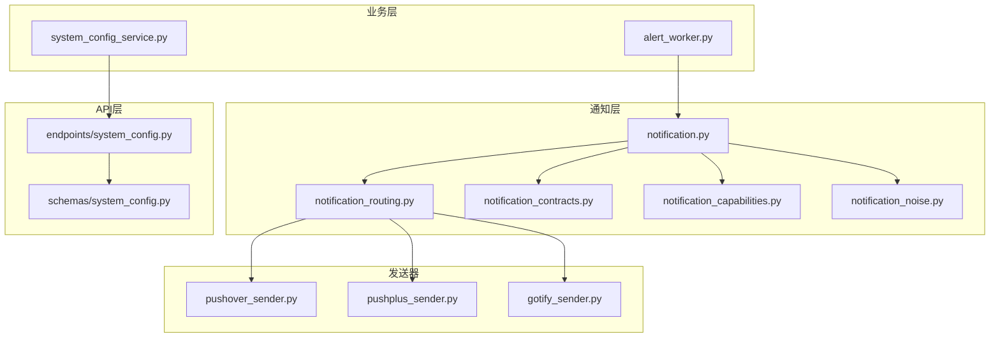
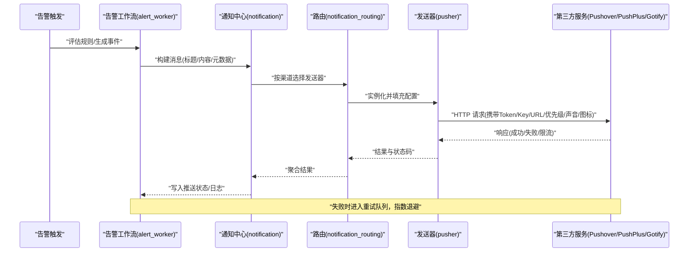
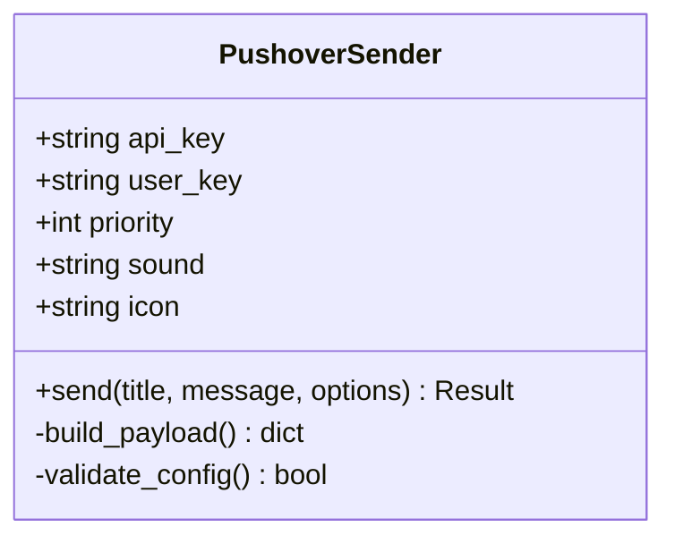
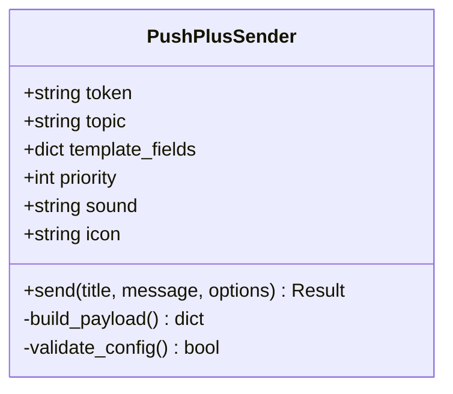
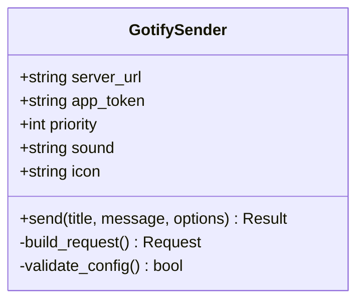
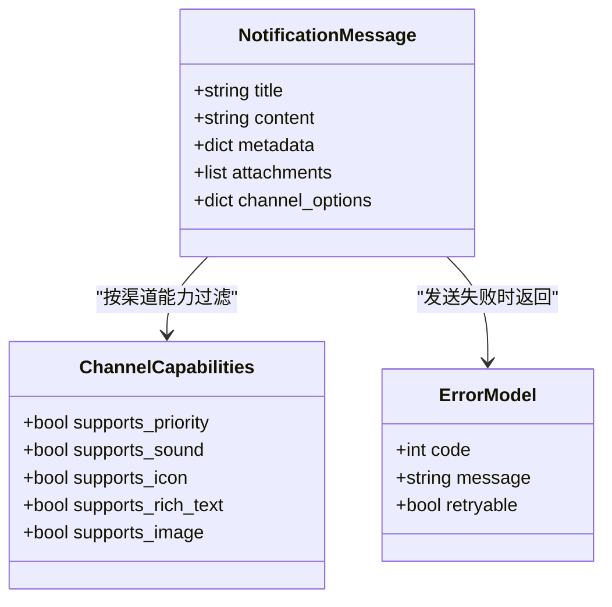
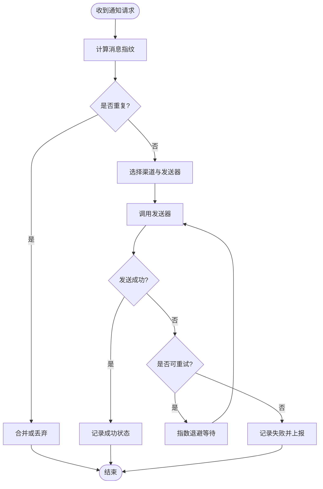
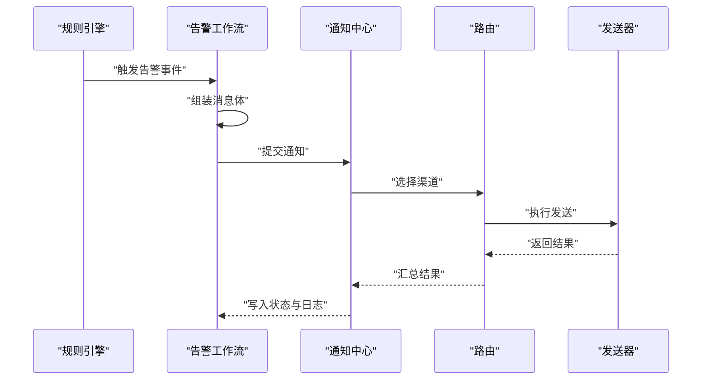
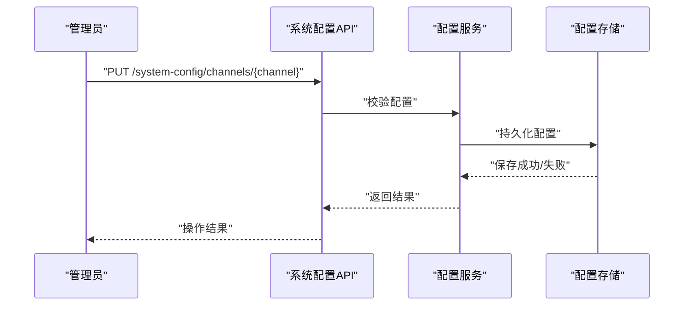
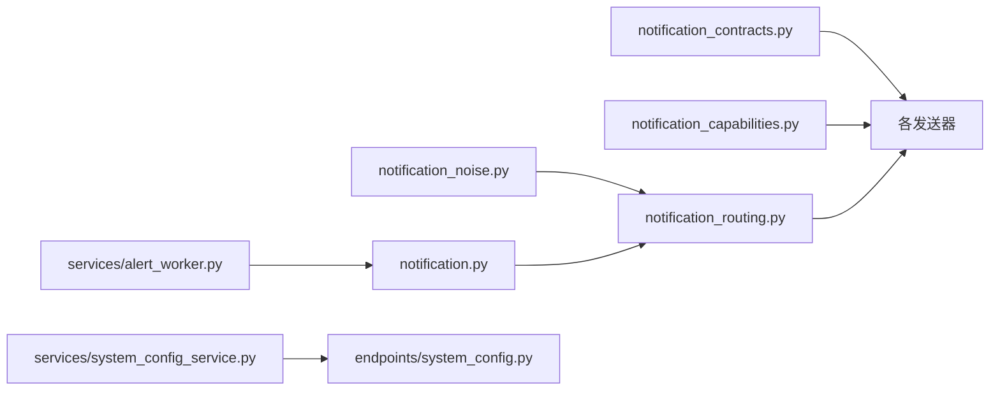

# 移动推送渠道

<cite>
**本文引用的文件**   
- [src/notification_sender/pushover_sender.py](file://src/notification_sender/pushover_sender.py)
- [src/notification_sender/pushplus_sender.py](file://src/notification_sender/pushplus_sender.py)
- [src/notification_sender/gotify_sender.py](file://src/notification_sender/gotify_sender.py)
- [src/notification.py](file://src/notification.py)
- [src/notification_capabilities.py](file://src/notification_capabilities.py)
- [src/notification_contracts.py](file://src/notification_contracts.py)
- [src/notification_noise.py](file://src/notification_noise.py)
- [src/notification_routing.py](file://src/notification_routing.py)
- [src/services/alert_worker.py](file://src/services/alert_worker.py)
- [src/services/system_config_service.py](file://src/services/system_config_service.py)
- [api/v1/endpoints/system_config.py](file://api/v1/endpoints/system_config.py)
- [api/v1/schemas/system_config.py](file://api/v1/schemas/system_config.py)
- [docs/notifications.md](file://docs/notifications.md)
</cite>

## 目录
1. [简介](#简介)
2. [项目结构](#项目结构)
3. [核心组件](#核心组件)
4. [架构总览](#架构总览)
5. [详细组件分析](#详细组件分析)
6. [依赖关系分析](#依赖关系分析)
7. [性能考虑](#性能考虑)
8. [故障排查指南](#故障排查指南)
9. [结论](#结论)
10. [附录](#附录)

## 简介
本文件面向移动推送渠道，覆盖 Pushover、PushPlus、Gotify 三类服务。内容包含设备注册与用户ID配置、推送令牌设置、消息优先级、声音与图标自定义等能力；提供各服务的完整配置示例与移动端应用安装指引；并详细说明推送状态跟踪、失败重试与用户反馈处理机制。文档同时给出系统级架构图、数据流图与关键流程时序图，帮助开发者快速理解与集成。

## 项目结构
移动推送相关代码主要分布在以下模块：
- 发送器实现：src/notification_sender 下的 pushover_sender.py、pushplus_sender.py、gotify_sender.py
- 通知契约与能力：src/notification_contracts.py、src/notification_capabilities.py
- 通知编排与路由：src/notification.py、src/notification_routing.py、src/notification_noise.py
- 告警工作流：src/services/alert_worker.py
- 系统配置与服务：src/services/system_config_service.py、api/v1/endpoints/system_config.py、api/v1/schemas/system_config.py
- 文档说明：docs/notifications.md

图表来源
- [src/notification.py](file://src/notification.py)
- [src/notification_routing.py](file://src/notification_routing.py)
- [src/notification_contracts.py](file://src/notification_contracts.py)
- [src/notification_capabilities.py](file://src/notification_capabilities.py)
- [src/notification_noise.py](file://src/notification_noise.py)
- [src/notification_sender/pushover_sender.py](file://src/notification_sender/pushover_sender.py)
- [src/notification_sender/pushplus_sender.py](file://src/notification_sender/pushplus_sender.py)
- [src/notification_sender/gotify_sender.py](file://src/notification_sender/gotify_sender.py)
- [src/services/alert_worker.py](file://src/services/alert_worker.py)
- [src/services/system_config_service.py](file://src/services/system_config_service.py)
- [api/v1/endpoints/system_config.py](file://api/v1/endpoints/system_config.py)
- [api/v1/schemas/system_config.py](file://api/v1/schemas/system_config.py)

章节来源
- [src/notification_sender/pushover_sender.py](file://src/notification_sender/pushover_sender.py)
- [src/notification_sender/pushplus_sender.py](file://src/notification_sender/pushplus_sender.py)
- [src/notification_sender/gotify_sender.py](file://src/notification_sender/gotify_sender.py)
- [src/notification.py](file://src/notification.py)
- [src/notification_routing.py](file://src/notification_routing.py)
- [src/notification_contracts.py](file://src/notification_contracts.py)
- [src/notification_capabilities.py](file://src/notification_capabilities.py)
- [src/notification_noise.py](file://src/notification_noise.py)
- [src/services/alert_worker.py](file://src/services/alert_worker.py)
- [src/services/system_config_service.py](file://src/services/system_config_service.py)
- [api/v1/endpoints/system_config.py](file://api/v1/endpoints/system_config.py)
- [api/v1/schemas/system_config.py](file://api/v1/schemas/system_config.py)
- [docs/notifications.md](file://docs/notifications.md)

## 核心组件
- 发送器抽象与实现
  - PushoverSender：封装 Pushover 的 API Key、用户密钥、优先级、声音、图标等参数，完成 HTTP 调用与结果解析。
  - PushPlusSender：封装 PushPlus Token、主题、模板、扩展字段（含优先级、声音、图标）等。
  - GotifySender：封装 Gotify Server URL、App Token、优先级、声音、图标等。
- 通知契约与能力
  - 统一消息体定义、能力枚举（如是否支持优先级、声音、图标）、错误码与返回结构。
- 通知路由与降噪
  - 根据目标渠道选择发送器，合并重复消息、去重、限流与退避策略。
- 告警工作流
  - 触发条件评估、消息组装、路由分发、发送与状态回写。
- 系统配置
  - 通过 API 暴露渠道配置项（Token、Key、URL、默认优先级、声音、图标等），并提供校验与热更新。

章节来源
- [src/notification_sender/pushover_sender.py](file://src/notification_sender/pushover_sender.py)
- [src/notification_sender/pushplus_sender.py](file://src/notification_sender/pushplus_sender.py)
- [src/notification_sender/gotify_sender.py](file://src/notification_sender/gotify_sender.py)
- [src/notification_contracts.py](file://src/notification_contracts.py)
- [src/notification_capabilities.py](file://src/notification_capabilities.py)
- [src/notification_routing.py](file://src/notification_routing.py)
- [src/notification_noise.py](file://src/notification_noise.py)
- [src/services/alert_worker.py](file://src/services/alert_worker.py)
- [src/services/system_config_service.py](file://src/services/system_config_service.py)
- [api/v1/endpoints/system_config.py](file://api/v1/endpoints/system_config.py)
- [api/v1/schemas/system_config.py](file://api/v1/schemas/system_config.py)

## 架构总览
下图展示了从告警触发到多渠道推送的整体流程，包括配置加载、路由选择、发送器调用、状态跟踪与重试。

图表来源
- [src/services/alert_worker.py](file://src/services/alert_worker.py)
- [src/notification.py](file://src/notification.py)
- [src/notification_routing.py](file://src/notification_routing.py)
- [src/notification_sender/pushover_sender.py](file://src/notification_sender/pushover_sender.py)
- [src/notification_sender/pushplus_sender.py](file://src/notification_sender/pushplus_sender.py)
- [src/notification_sender/gotify_sender.py](file://src/notification_sender/gotify_sender.py)

## 详细组件分析

### 推送发送器：Pushover
- 设备注册与用户ID
  - 在 Pushover 中创建应用后获取 API Key，并在移动端应用内绑定用户密钥（User Key）。
- 推送令牌设置
  - 将 API Key 与 User Key 配置到系统配置中，供发送器读取。
- 消息优先级
  - 支持设置紧急级别（低/正常/高/紧急），影响客户端提醒方式。
- 声音与图标
  - 可指定声音名称与图标资源名，需确保在 Pushover 应用中已上传或启用。
- 状态跟踪与重试
  - 发送器记录响应码与错误信息；失败时由工作流进行重试与降级。

图表来源
- [src/notification_sender/pushover_sender.py](file://src/notification_sender/pushover_sender.py)

章节来源
- [src/notification_sender/pushover_sender.py](file://src/notification_sender/pushover_sender.py)
- [src/notification_contracts.py](file://src/notification_contracts.py)
- [src/notification_capabilities.py](file://src/notification_capabilities.py)

### 推送发送器：PushPlus
- 设备注册与用户ID
  - 在 PushPlus 平台注册账号并获取 Token，可在移动端绑定设备标识。
- 推送令牌设置
  - 将 Token 配置到系统配置，发送器自动附加至请求头或参数。
- 消息优先级
  - 通过扩展字段设置优先级等级，影响客户端展示与提醒。
- 声音与图标
  - 使用扩展字段传入声音与图标名称，需与平台支持的资源一致。
- 状态跟踪与重试
  - 记录响应状态与错误原因，失败时进入重试队列。

图表来源
- [src/notification_sender/pushplus_sender.py](file://src/notification_sender/pushplus_sender.py)

章节来源
- [src/notification_sender/pushplus_sender.py](file://src/notification_sender/pushplus_sender.py)
- [src/notification_contracts.py](file://src/notification_contracts.py)
- [src/notification_capabilities.py](file://src/notification_capabilities.py)

### 推送发送器：Gotify
- 设备注册与用户ID
  - 部署 Gotify 服务端，创建应用并生成 App Token；移动端安装 Gotify 客户端并登录同一服务器。
- 推送令牌设置
  - 配置 Server URL 与 App Token，发送器据此构造请求地址。
- 消息优先级
  - 设置数值型优先级，客户端根据阈值决定是否强提醒。
- 声音与图标
  - 指定声音与图标文件名，需在服务端预置对应资源。
- 状态跟踪与重试
  - 捕获网络异常与业务错误，记录并触发重试。

图表来源
- [src/notification_sender/gotify_sender.py](file://src/notification_sender/gotify_sender.py)

章节来源
- [src/notification_sender/gotify_sender.py](file://src/notification_sender/gotify_sender.py)
- [src/notification_contracts.py](file://src/notification_contracts.py)
- [src/notification_capabilities.py](file://src/notification_capabilities.py)

### 通知契约与能力
- 统一消息体
  - 定义标题、内容、附件、元数据、渠道选项等字段，保证多通道一致性。
- 能力枚举
  - 声明各渠道是否支持优先级、声音、图标、富文本、图片等能力。
- 错误模型
  - 标准化错误码、错误信息与重试建议，便于上层统一处理。

图表来源
- [src/notification_contracts.py](file://src/notification_contracts.py)
- [src/notification_capabilities.py](file://src/notification_capabilities.py)

章节来源
- [src/notification_contracts.py](file://src/notification_contracts.py)
- [src/notification_capabilities.py](file://src/notification_capabilities.py)

### 通知路由与降噪
- 路由策略
  - 根据目标渠道与用户偏好选择发送器；支持多通道并行与主备切换。
- 降噪与去重
  - 基于消息指纹去重、时间窗口合并、频率限制，避免通知风暴。
- 重试与退避
  - 对瞬时错误采用指数退避与最大重试次数控制。

图表来源
- [src/notification_routing.py](file://src/notification_routing.py)
- [src/notification_noise.py](file://src/notification_noise.py)

章节来源
- [src/notification_routing.py](file://src/notification_routing.py)
- [src/notification_noise.py](file://src/notification_noise.py)

### 告警工作流
- 触发与评估
  - 依据指标阈值或事件规则生成告警事件。
- 消息组装
  - 结合上下文与模板生成最终消息体。
- 路由与发送
  - 调用通知中心与路由，分发给各发送器。
- 状态回写
  - 记录推送状态、耗时、错误码，供监控与诊断。

图表来源
- [src/services/alert_worker.py](file://src/services/alert_worker.py)
- [src/notification.py](file://src/notification.py)
- [src/notification_routing.py](file://src/notification_routing.py)

章节来源
- [src/services/alert_worker.py](file://src/services/alert_worker.py)
- [src/notification.py](file://src/notification.py)

### 系统配置与API
- 配置项
  - 各渠道的 Token/Key/URL、默认优先级、声音、图标、开关等。
- API端点
  - 提供查询、更新、校验配置的接口，支持热更新与权限控制。
- 校验与回滚
  - 配置变更时进行格式与连通性校验，失败则回滚并提示。

图表来源
- [api/v1/endpoints/system_config.py](file://api/v1/endpoints/system_config.py)
- [api/v1/schemas/system_config.py](file://api/v1/schemas/system_config.py)
- [src/services/system_config_service.py](file://src/services/system_config_service.py)

章节来源
- [api/v1/endpoints/system_config.py](file://api/v1/endpoints/system_config.py)
- [api/v1/schemas/system_config.py](file://api/v1/schemas/system_config.py)
- [src/services/system_config_service.py](file://src/services/system_config_service.py)

## 依赖关系分析
- 发送器之间相互独立，均依赖统一的契约与能力定义。
- 路由与降噪模块解耦具体发送器，提升可扩展性。
- 告警工作流依赖通知中心与路由，不直接耦合第三方服务。
- 系统配置为所有组件提供运行时参数，支持集中管理。

图表来源
- [src/notification_contracts.py](file://src/notification_contracts.py)
- [src/notification_capabilities.py](file://src/notification_capabilities.py)
- [src/notification_routing.py](file://src/notification_routing.py)
- [src/notification_noise.py](file://src/notification_noise.py)
- [src/services/alert_worker.py](file://src/services/alert_worker.py)
- [src/notification.py](file://src/notification.py)
- [src/services/system_config_service.py](file://src/services/system_config_service.py)
- [api/v1/endpoints/system_config.py](file://api/v1/endpoints/system_config.py)

章节来源
- [src/notification_contracts.py](file://src/notification_contracts.py)
- [src/notification_capabilities.py](file://src/notification_capabilities.py)
- [src/notification_routing.py](file://src/notification_routing.py)
- [src/notification_noise.py](file://src/notification_noise.py)
- [src/services/alert_worker.py](file://src/services/alert_worker.py)
- [src/notification.py](file://src/notification.py)
- [src/services/system_config_service.py](file://src/services/system_config_service.py)
- [api/v1/endpoints/system_config.py](file://api/v1/endpoints/system_config.py)

## 性能考虑
- 并发发送：多通道并行发送，降低端到端延迟。
- 连接复用：HTTP 连接池与超时控制，减少握手开销。
- 去重与合并：高频告警合并，避免重复推送。
- 限流与退避：针对第三方限流策略实施指数退避与熔断。
- 缓存配置：热点配置本地缓存，减少远程读取。

[本节为通用指导，无需特定文件引用]

## 故障排查指南
- 常见问题
  - 令牌/Key无效：检查系统配置中的 Token/Key 是否正确，确认第三方平台授权状态。
  - 网络不可达：验证 Server URL 可达性与防火墙策略。
  - 优先级/声音/图标未生效：核对平台支持的名称与资源是否已上传。
  - 频繁重试：查看错误码与日志，区分瞬时错误与永久错误。
- 诊断步骤
  - 使用系统配置API校验配置连通性。
  - 查看通知中心与路由日志，定位失败环节。
  - 检查降噪策略是否误拦截或合并。
  - 对比不同渠道的响应差异，缩小问题范围。

章节来源
- [src/notification.py](file://src/notification.py)
- [src/notification_routing.py](file://src/notification_routing.py)
- [src/notification_noise.py](file://src/notification_noise.py)
- [src/services/system_config_service.py](file://src/services/system_config_service.py)
- [api/v1/endpoints/system_config.py](file://api/v1/endpoints/system_config.py)

## 结论
通过统一的契约与能力定义、灵活的路由与降噪策略、以及完善的配置管理与状态跟踪，系统在 Pushover、PushPlus、Gotify 等多渠道推送上具备良好的可扩展性与稳定性。建议在生产环境开启健康检查与监控告警，持续优化重试与限流策略，保障推送及时性与可靠性。

[本节为总结性内容，无需特定文件引用]

## 附录

### 各服务配置示例与移动端安装指南
- Pushover
  - 移动端安装：在应用商店搜索“Pushover”，下载并打开。
  - 设备注册：登录后进入“我的账户”复制用户密钥（User Key）。
  - 推送令牌：在 Pushover 网站创建应用，获取 API Key。
  - 系统配置：将 API Key 与 User Key 填入系统配置；设置默认优先级、声音、图标。
  - 参考文档：[docs/notifications.md](file://docs/notifications.md)

- PushPlus
  - 移动端安装：在应用商店搜索“PushPlus”，下载并打开。
  - 设备注册：注册账号并登录，获取 Token。
  - 推送令牌：在平台控制台复制 Token 并配置到系统。
  - 系统配置：填写 Token、主题、模板字段；设置优先级、声音、图标。
  - 参考文档：[docs/notifications.md](file://docs/notifications.md)

- Gotify
  - 服务端部署：按官方文档部署 Gotify 服务。
  - 移动端安装：在应用商店搜索“Gotify”，下载并登录同一服务器。
  - 设备注册：在服务端创建应用，生成 App Token。
  - 系统配置：填写 Server URL 与 App Token；设置优先级、声音、图标。
  - 参考文档：[docs/notifications.md](file://docs/notifications.md)

章节来源
- [docs/notifications.md](file://docs/notifications.md)
- [src/services/system_config_service.py](file://src/services/system_config_service.py)
- [api/v1/endpoints/system_config.py](file://api/v1/endpoints/system_config.py)