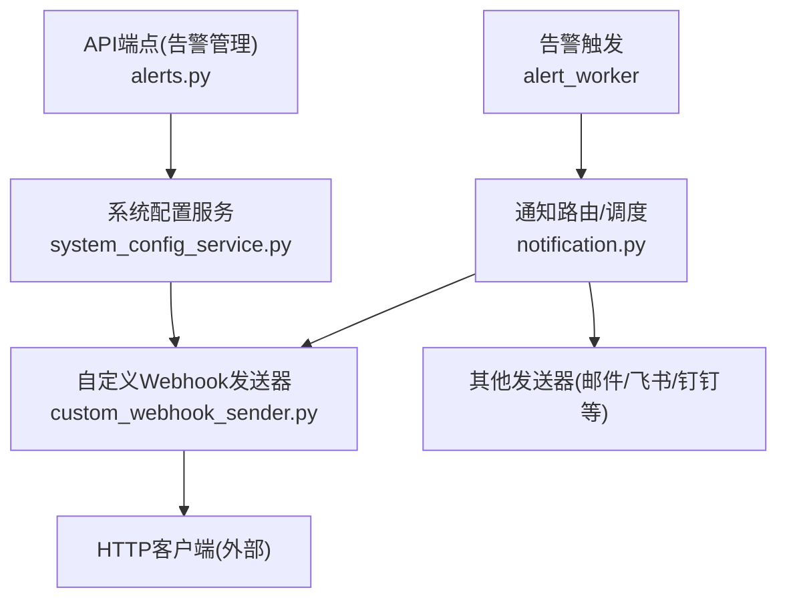
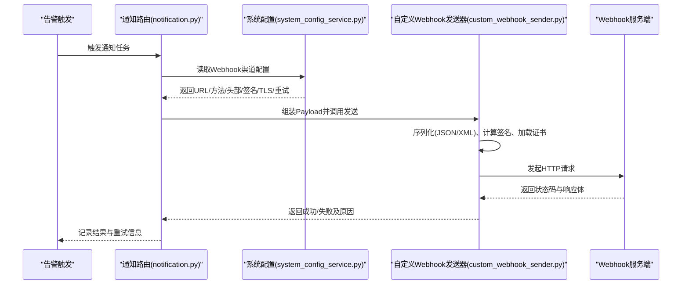
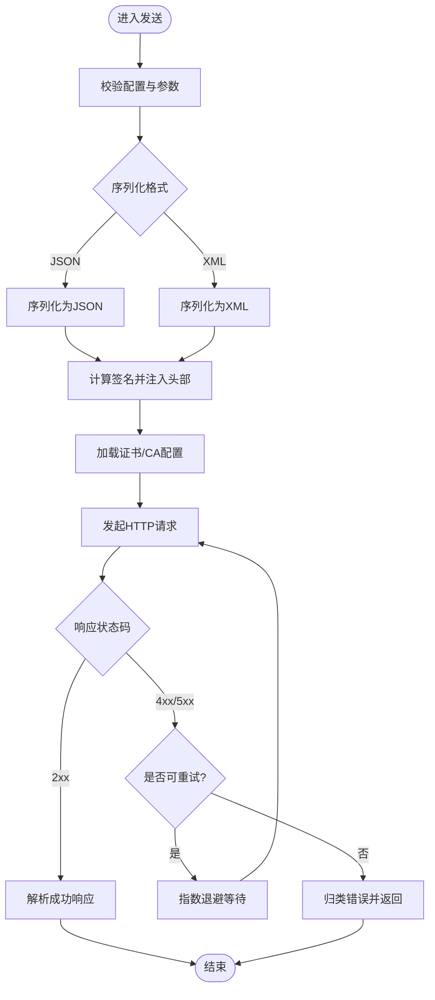
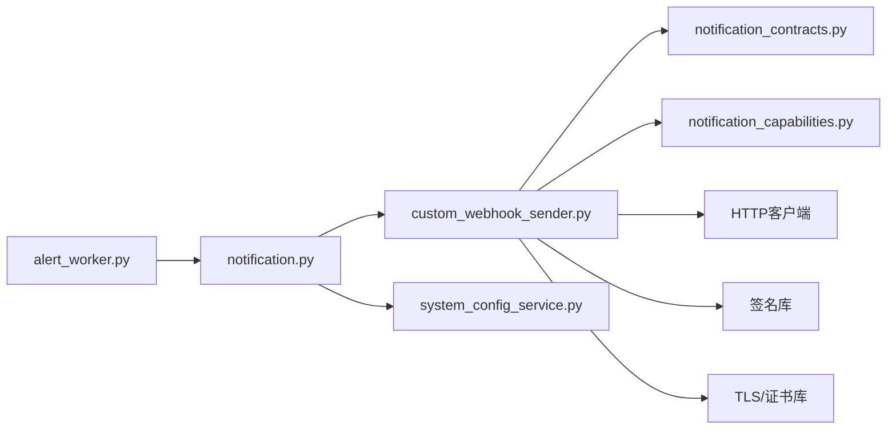

# 自定义Webhook渠道

<cite>
**本文档引用的文件**   
- [custom_webhook_sender.py](file://src/notification_sender/custom_webhook_sender.py)
- [notification.py](file://src/notification.py)
- [notification_contracts.py](file://src/notification_contracts.py)
- [notification_capabilities.py](file://src/notification_capabilities.py)
- [system_config_service.py](file://src/services/system_config_service.py)
- [alerts.py](file://api/v1/endpoints/alerts.py)
- [alert_worker.py](file://src/services/alert_worker.py)
- [test_notification_sender.py](file://tests/test_notification_sender.py)
</cite>

## 目录
1. [简介](#简介)
2. [项目结构](#项目结构)
3. [核心组件](#核心组件)
4. [架构总览](#架构总览)
5. [详细组件分析](#详细组件分析)
6. [依赖关系分析](#依赖关系分析)
7. [性能与可靠性](#性能与可靠性)
8. [故障排除指南](#故障排除指南)
9. [结论](#结论)
10. [附录：配置与示例](#附录配置与示例)

## 简介
本章节面向需要在系统中接入“自定义Webhook”通知渠道的用户与开发者，说明如何配置HTTP请求、设置请求头、处理响应数据，并支持JSON/XML格式、签名验证、证书配置。同时提供企业微信、钉钉、飞书等常见服务的集成要点，以及错误处理、超时配置和重试机制的最佳实践。

## 项目结构
自定义Webhook能力位于通知子系统内，主要涉及以下模块：
- 发送器实现：负责构造HTTP请求、序列化载荷、处理响应与错误
- 通知契约与能力定义：统一输入输出结构与能力声明
- 系统配置服务：持久化与校验Webhook渠道配置
- 告警触发与执行：在告警触发时调用通知管道，最终落到具体发送器
- 测试用例：覆盖关键路径与异常场景

图表来源
- [alert_worker.py](file://src/services/alert_worker.py)
- [notification.py](file://src/notification.py)
- [custom_webhook_sender.py](file://src/notification_sender/custom_webhook_sender.py)
- [system_config_service.py](file://src/services/system_config_service.py)
- [alerts.py](file://api/v1/endpoints/alerts.py)

章节来源
- [custom_webhook_sender.py](file://src/notification_sender/custom_webhook_sender.py)
- [notification.py](file://src/notification.py)
- [notification_contracts.py](file://src/notification_contracts.py)
- [notification_capabilities.py](file://src/notification_capabilities.py)
- [system_config_service.py](file://src/services/system_config_service.py)
- [alerts.py](file://api/v1/endpoints/alerts.py)
- [alert_worker.py](file://src/services/alert_worker.py)

## 核心组件
- 自定义Webhook发送器：封装HTTP请求构建、头部注入、签名计算、证书加载、响应解析与错误分类
- 通知契约：定义统一的Payload结构、模板渲染接口、结果模型
- 能力声明：声明是否支持JSON/XML、签名、证书、重试等特性
- 系统配置：存储Webhook URL、方法、头部、签名算法、证书路径、超时与重试策略
- 告警工作流：触发后选择发送器并执行发送流程

章节来源
- [custom_webhook_sender.py](file://src/notification_sender/custom_webhook_sender.py)
- [notification_contracts.py](file://src/notification_contracts.py)
- [notification_capabilities.py](file://src/notification_capabilities.py)
- [system_config_service.py](file://src/services/system_config_service.py)
- [alert_worker.py](file://src/services/alert_worker.py)

## 架构总览
下图展示了从告警触发到Webhook回调的端到端流程，包括配置读取、请求构建、签名与TLS、响应处理与重试。

图表来源
- [alert_worker.py](file://src/services/alert_worker.py)
- [notification.py](file://src/notification.py)
- [system_config_service.py](file://src/services/system_config_service.py)
- [custom_webhook_sender.py](file://src/notification_sender/custom_webhook_sender.py)

## 详细组件分析

### 自定义Webhook发送器
- 职责
  - 根据配置生成HTTP请求（方法、URL、头部、Body）
  - 支持JSON与XML两种序列化格式
  - 可选签名验证（HMAC/Token/自定义Header）
  - TLS证书与CA配置（自签证书、私有CA）
  - 统一错误分类（网络错误、认证失败、业务拒绝、超时）
  - 重试与退避策略（指数退避、最大重试次数）
- 关键流程
  - 参数校验与默认值填充
  - 载荷序列化与编码
  - 签名计算与头部注入
  - 建立HTTPS连接并发送请求
  - 解析响应并判定成功/失败
  - 按策略重试或上报错误

图表来源
- [custom_webhook_sender.py](file://src/notification_sender/custom_webhook_sender.py)

章节来源
- [custom_webhook_sender.py](file://src/notification_sender/custom_webhook_sender.py)

### 通知契约与能力
- 契约
  - 统一的Payload结构：包含告警类型、时间戳、主体内容、扩展字段
  - 模板渲染：将结构化数据渲染为文本/Markdown/HTML
  - 结果模型：成功/失败、错误码、错误消息、重试建议
- 能力声明
  - 是否支持JSON/XML
  - 是否支持签名
  - 是否支持自定义TLS证书
  - 是否支持重试与退避

章节来源
- [notification_contracts.py](file://src/notification_contracts.py)
- [notification_capabilities.py](file://src/notification_capabilities.py)

### 系统配置服务
- 职责
  - 存储与校验Webhook渠道配置项（URL、方法、头部、签名算法、证书路径、超时、重试）
  - 提供读写接口供通知路由与发送器使用
  - 对敏感信息进行安全处理（如密钥不落地明文日志）
- 关键点
  - 配置项校验与默认值
  - 多环境隔离（开发/生产）
  - 变更热更新与版本兼容

章节来源
- [system_config_service.py](file://src/services/system_config_service.py)

### 告警触发与工作流
- 职责
  - 监听告警事件，选择对应通知渠道
  - 调用通知路由，最终落到具体发送器
  - 记录执行轨迹与结果，便于排查
- 关键点
  - 并发控制与去重
  - 失败回退与降级
  - 指标与日志埋点

章节来源
- [alert_worker.py](file://src/services/alert_worker.py)
- [notification.py](file://src/notification.py)

### API端点（告警管理）
- 职责
  - 提供创建、查询、测试Webhook配置的REST接口
  - 暴露健康检查与诊断信息
- 关键点
  - 权限校验与审计日志
  - 参数校验与错误响应标准化

章节来源
- [alerts.py](file://api/v1/endpoints/alerts.py)

## 依赖关系分析
- 内部依赖
  - 自定义Webhook发送器依赖通知契约与能力声明
  - 通知路由依赖系统配置服务获取渠道配置
  - 告警工作流依赖通知路由进行分发
- 外部依赖
  - HTTP客户端（用于发起请求）
  - 加密库（用于签名计算）
  - TLS库（用于证书与CA校验）

图表来源
- [alert_worker.py](file://src/services/alert_worker.py)
- [notification.py](file://src/notification.py)
- [custom_webhook_sender.py](file://src/notification_sender/custom_webhook_sender.py)
- [notification_contracts.py](file://src/notification_contracts.py)
- [notification_capabilities.py](file://src/notification_capabilities.py)
- [system_config_service.py](file://src/services/system_config_service.py)

章节来源
- [alert_worker.py](file://src/services/alert_worker.py)
- [notification.py](file://src/notification.py)
- [custom_webhook_sender.py](file://src/notification_sender/custom_webhook_sender.py)
- [notification_contracts.py](file://src/notification_contracts.py)
- [notification_capabilities.py](file://src/notification_capabilities.py)
- [system_config_service.py](file://src/services/system_config_service.py)

## 性能与可靠性
- 超时配置
  - 连接超时与请求超时分离，避免长连接阻塞
  - 针对第三方服务限制合理设置超时阈值
- 重试机制
  - 仅对幂等请求启用重试（GET/POST无副作用）
  - 指数退避与抖动，避免雪崩
  - 最大重试次数与熔断保护
- 并发与背压
  - 控制并发度，避免打满下游服务
  - 队列缓冲与限流
- 资源管理
  - 连接池复用
  - 证书与密钥缓存，减少I/O开销

[本节为通用指导，无需代码引用]

## 故障排除指南
- 常见问题定位
  - 网络连通性：DNS解析、防火墙、代理
  - 证书问题：自签证书未信任、过期、链不完整
  - 签名失败：算法不一致、密钥错误、时间戳偏差
  - 响应异常：状态码非2xx、业务错误码、报文格式不符
- 调试工具与方法
  - 开启详细日志（请求头、响应体脱敏）
  - 本地Mock服务验证报文与签名
  - 抓包工具（Wireshark/tcpdump）辅助定位
- 快速自检清单
  - URL可达性与端口开放
  - 头部与签名是否正确注入
  - 超时与重试策略是否符合预期
  - 证书与CA是否已正确配置

章节来源
- [test_notification_sender.py](file://tests/test_notification_sender.py)

## 结论
通过统一的契约与能力声明，结合灵活的发送器实现，自定义Webhook渠道能够适配多种第三方服务。合理的超时、重试与证书配置是稳定性的关键。建议在开发与生产环境分别进行充分测试与监控，确保告警及时可靠地送达。

[本节为总结性内容，无需代码引用]

## 附录：配置与示例

### 配置项说明
- 基础信息
  - Webhook URL：目标地址
  - HTTP方法：GET/POST/PUT等
  - 请求头：自定义键值对（如Content-Type、Authorization）
- 载荷与格式
  - 序列化格式：JSON或XML
  - 模板变量：告警类型、时间、内容摘要、扩展字段
- 安全与签名
  - 签名算法：HMAC-SHA256/MD5等
  - 密钥来源：环境变量或密钥管理服务
  - 签名注入位置：Header或Body
- TLS与证书
  - CA证书路径：私有CA或自签证书
  - 客户端证书：双向TLS场景
- 超时与重试
  - 连接超时、请求超时
  - 最大重试次数、退避策略

章节来源
- [system_config_service.py](file://src/services/system_config_service.py)
- [custom_webhook_sender.py](file://src/notification_sender/custom_webhook_sender.py)

### 常见服务集成要点
- 企业微信
  - 通常使用POST与JSON
  - 可能需要签名或Token鉴权
  - 注意速率限制与消息长度
- 钉钉
  - 支持签名验证（HMAC）
  - 常用JSON格式，部分场景需特定头部
- 飞书
  - 支持签名与时间戳校验
  - JSON为主，注意字段命名规范

[本节为概念性说明，无需代码引用]

### 错误处理与重试最佳实践
- 区分可重试与不可重试错误
- 对幂等请求启用指数退避
- 记录失败详情与上下文，便于排障
- 设置熔断与降级策略，保护上游

章节来源
- [custom_webhook_sender.py](file://src/notification_sender/custom_webhook_sender.py)
- [test_notification_sender.py](file://tests/test_notification_sender.py)