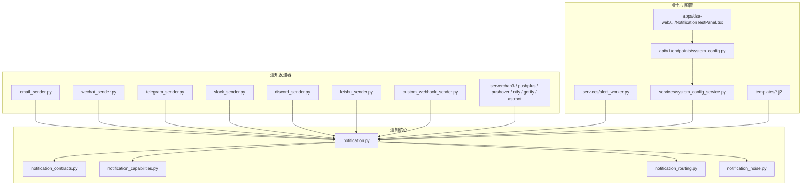
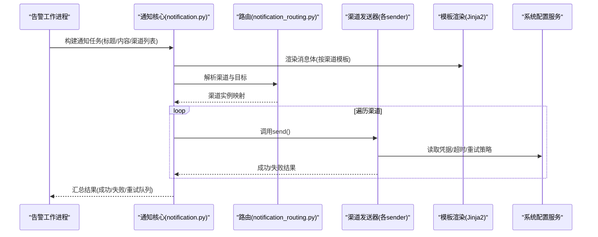
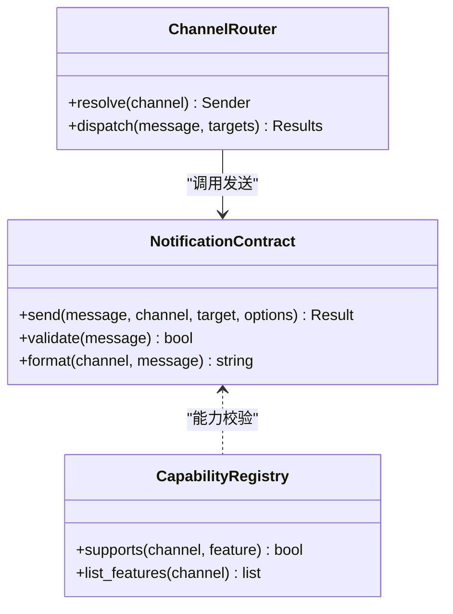
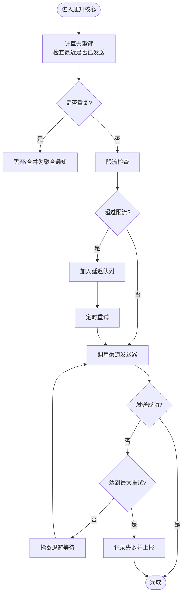
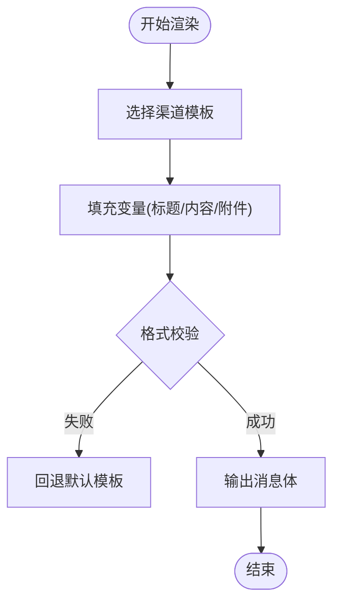
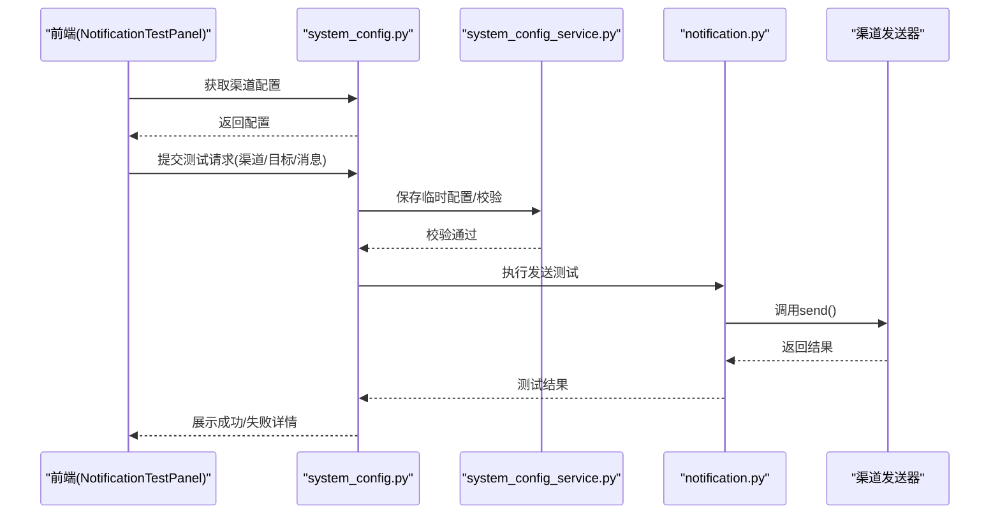
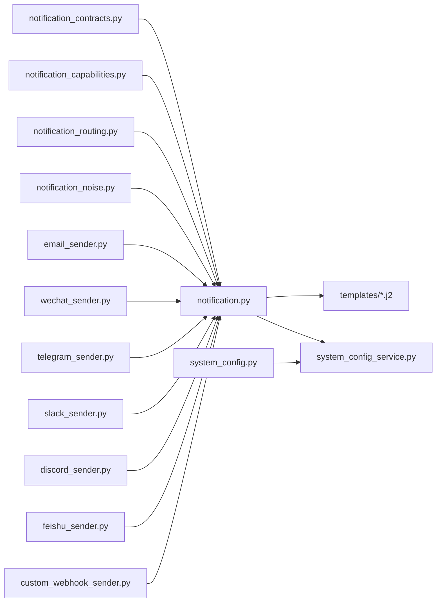

# 通知渠道集成

<cite>
**本文引用的文件**   
- [src/notification_sender/__init__.py](file://src/notification_sender/__init__.py)
- [src/notification_sender/email_sender.py](file://src/notification_sender/email_sender.py)
- [src/notification_sender/wechat_sender.py](file://src/notification_sender/wechat_sender.py)
- [src/notification_sender/telegram_sender.py](file://src/notification_sender/telegram_sender.py)
- [src/notification_sender/slack_sender.py](file://src/notification_sender/slack_sender.py)
- [src/notification_sender/discord_sender.py](file://src/notification_sender/discord_sender.py)
- [src/notification_sender/custom_webhook_sender.py](file://src/notification_sender/custom_webhook_sender.py)
- [src/notification_sender/serverchan3_sender.py](file://src/notification_sender/serverchan3_sender.py)
- [src/notification_sender/pushplus_sender.py](file://src/notification_sender/pushplus_sender.py)
- [src/notification_sender/pushover_sender.py](file://src/notification_sender/pushover_sender.py)
- [src/notification_sender/ntfy_sender.py](file://src/notification_sender/ntfy_sender.py)
- [src/notification_sender/gotify_sender.py](file://src/notification_sender/gotify_sender.py)
- [src/notification_sender/astrbot_sender.py](file://src/notification_sender/astrbot_sender.py)
- [src/notification_sender/feishu_sender.py](file://src/notification_sender/feishu_sender.py)
- [src/notification.py](file://src/notification.py)
- [src/notification_contracts.py](file://src/notification_contracts.py)
- [src/notification_capabilities.py](file://src/notification_capabilities.py)
- [src/notification_routing.py](file://src/notification_routing.py)
- [src/notification_noise.py](file://src/notification_noise.py)
- [src/services/alert_worker.py](file://src/services/alert_worker.py)
- [src/services/system_config_service.py](file://src/services/system_config_service.py)
- [api/v1/endpoints/system_config.py](file://api/v1/endpoints/system_config.py)
- [apps/dsa-web/src/components/settings/NotificationTestPanel.tsx](file://apps/dsa-web/src/components/settings/NotificationTestPanel.tsx)
- [templates/report_wechat.j2](file://templates/report_wechat.j2)
- [templates/report_markdown.j2](file://templates/report_markdown.j2)
- [scripts/generate_notification_actions_env_table.py](file://scripts/generate_notification_actions_env_table.py)
</cite>

## 目录
1. [简介](#简介)
2. [项目结构](#项目结构)
3. [核心组件](#核心组件)
4. [架构总览](#架构总览)
5. [详细组件分析](#详细组件分析)
6. [依赖关系分析](#依赖关系分析)
7. [性能考虑](#性能考虑)
8. [故障排查指南](#故障排查指南)
9. [结论](#结论)
10. [附录](#附录)

## 简介
本文件面向“通知渠道集成”的完整落地，覆盖邮件、企业微信、Telegram、Slack、Discord、飞书等常见渠道的配置与使用。文档重点包括：
- 渠道认证与配置项说明
- 消息模板定制（Markdown、企业微信专用模板）
- 错误处理与重试机制
- 每种渠道的配置示例与测试方法
- 可靠性与及时性保障建议

## 项目结构
通知子系统由“发送器实现 + 统一契约 + 路由与能力编排 + 前端测试面板 + 模板渲染”组成，整体位于 src/notification_* 与 templates 目录下，并通过 API 与系统配置服务进行联动。

**图表来源** 
- [src/notification_sender/email_sender.py](file://src/notification_sender/email_sender.py)
- [src/notification_sender/wechat_sender.py](file://src/notification_sender/wechat_sender.py)
- [src/notification_sender/telegram_sender.py](file://src/notification_sender/telegram_sender.py)
- [src/notification_sender/slack_sender.py](file://src/notification_sender/slack_sender.py)
- [src/notification_sender/discord_sender.py](file://src/notification_sender/discord_sender.py)
- [src/notification_sender/feishu_sender.py](file://src/notification_sender/feishu_sender.py)
- [src/notification_sender/custom_webhook_sender.py](file://src/notification_sender/custom_webhook_sender.py)
- [src/notification.py](file://src/notification.py)
- [src/notification_contracts.py](file://src/notification_contracts.py)
- [src/notification_capabilities.py](file://src/notification_capabilities.py)
- [src/notification_routing.py](file://src/notification_routing.py)
- [src/notification_noise.py](file://src/notification_noise.py)
- [src/services/alert_worker.py](file://src/services/alert_worker.py)
- [src/services/system_config_service.py](file://src/services/system_config_service.py)
- [api/v1/endpoints/system_config.py](file://api/v1/endpoints/system_config.py)
- [apps/dsa-web/src/components/settings/NotificationTestPanel.tsx](file://apps/dsa-web/src/components/settings/NotificationTestPanel.tsx)
- [templates/report_wechat.j2](file://templates/report_wechat.j2)
- [templates/report_markdown.j2](file://templates/report_markdown.j2)

**章节来源**
- [src/notification_sender/__init__.py](file://src/notification_sender/__init__.py)
- [src/notification.py](file://src/notification.py)
- [src/notification_contracts.py](file://src/notification_contracts.py)
- [src/notification_capabilities.py](file://src/notification_capabilities.py)
- [src/notification_routing.py](file://src/notification_routing.py)
- [src/notification_noise.py](file://src/notification_noise.py)

## 核心组件
- 统一契约层：定义发送接口、参数结构与返回约定，确保各渠道实现一致。
- 能力与路由：根据目标渠道类型选择具体发送器，并支持多目标分发。
- 噪声控制：对重复或低价值通知进行去重与限流，避免打扰。
- 发送器实现：每个渠道一个独立模块，封装认证、请求构造与响应解析。
- 模板渲染：通过 Jinja2 模板生成不同渠道的消息体。
- 配置与服务：集中管理渠道凭据与开关，提供系统配置 API 与前端测试面板。

**章节来源**
- [src/notification_contracts.py](file://src/notification_contracts.py)
- [src/notification_capabilities.py](file://src/notification_capabilities.py)
- [src/notification_routing.py](file://src/notification_routing.py)
- [src/notification_noise.py](file://src/notification_noise.py)
- [src/notification.py](file://src/notification.py)

## 架构总览
通知流程从告警触发到多渠道投递的整体时序如下：

**图表来源**
- [src/notification.py](file://src/notification.py)
- [src/notification_routing.py](file://src/notification_routing.py)
- [src/services/alert_worker.py](file://src/services/alert_worker.py)
- [src/services/system_config_service.py](file://src/services/system_config_service.py)
- [templates/report_markdown.j2](file://templates/report_markdown.j2)
- [templates/report_wechat.j2](file://templates/report_wechat.j2)

## 详细组件分析

### 统一契约与能力
- 契约定义：统一的 send 接口、消息体结构、渠道元数据与错误码约定。
- 能力声明：是否支持富文本、图片、附件、@提醒、回调等能力。
- 路由表：渠道标识到发送器的映射，支持动态注册与扩展。

**图表来源**
- [src/notification_contracts.py](file://src/notification_contracts.py)
- [src/notification_capabilities.py](file://src/notification_capabilities.py)
- [src/notification_routing.py](file://src/notification_routing.py)

**章节来源**
- [src/notification_contracts.py](file://src/notification_contracts.py)
- [src/notification_capabilities.py](file://src/notification_capabilities.py)
- [src/notification_routing.py](file://src/notification_routing.py)

### 噪声控制与重试
- 去重键：基于内容摘要与目标生成唯一键，避免短时间内重复推送。
- 限流窗口：同一渠道/目标的滑动窗口限制。
- 重试策略：指数退避、最大重试次数、可配置超时。

**图表来源**
- [src/notification_noise.py](file://src/notification_noise.py)
- [src/notification.py](file://src/notification.py)

**章节来源**
- [src/notification_noise.py](file://src/notification_noise.py)
- [src/notification.py](file://src/notification.py)

### 渠道发送器实现要点
- 邮件(email_sender.py)
  - 认证：SMTP 服务器、端口、用户名/密码或 OAuth（依实现）。
  - 消息：主题、正文（HTML/纯文本）、附件、抄送。
  - 错误：连接/认证失败、内容过大、被拒收。
  - 重试：网络抖动时指数退避；认证错误不重试。
- 企业微信(wechat_sender.py)
  - 认证：应用 ID、Secret、AgentId、部门/用户可见范围。
  - 消息：文本、Markdown、图片、卡片消息。
  - 错误：签名校验失败、Token 过期、频率限制。
  - 重试：Token 自动刷新；限流退避。
- Telegram(telegram_sender.py)
  - 认证：Bot Token、Chat ID。
  - 消息：MarkdownV2/HTML、内联按钮、媒体。
  - 错误：权限不足、链接预览失败、速率限制。
  - 重试：幂等性保证（message_id），限流退避。
- Slack(slack_sender.py)
  - 认证：Bot Token、Channel/用户 ID。
  - 消息：Blocks、富文本、附件。
  - 错误：权限不足、频道不存在、速率限制。
  - 重试：幂等性（channel+text 指纹），限流退避。
- Discord(discord_sender.py)
  - 认证：Bot Token、Channel ID。
  - 消息：Embeds、附件。
  - 错误：权限不足、频道不存在、速率限制。
  - 重试：幂等性（channel+content），限流退避。
- 飞书(feishu_sender.py)
  - 认证：App ID、App Secret、租户/用户范围。
  - 消息：富文本、卡片、图片。
  - 错误：权限不足、Token 过期、频率限制。
  - 重试：Token 刷新、限流退避。
- 自定义 Webhook(custom_webhook_sender.py)
  - 认证：URL、Header、Body 模板变量。
  - 消息：任意 JSON/表单，支持签名。
  - 错误：HTTP 状态码、超时、签名校验失败。
  - 重试：可配置重试次数与退避策略。
- 其他渠道(serverchan3/pushplus/pushover/ntfy/gotify/astrbot)
  - 认证：各自平台 Key/Token/Server URL。
  - 消息：文本、标题、优先级、标签。
  - 错误：网络异常、鉴权失败、限流。
  - 重试：通用指数退避与最大重试上限。

**章节来源**
- [src/notification_sender/email_sender.py](file://src/notification_sender/email_sender.py)
- [src/notification_sender/wechat_sender.py](file://src/notification_sender/wechat_sender.py)
- [src/notification_sender/telegram_sender.py](file://src/notification_sender/telegram_sender.py)
- [src/notification_sender/slack_sender.py](file://src/notification_sender/slack_sender.py)
- [src/notification_sender/discord_sender.py](file://src/notification_sender/discord_sender.py)
- [src/notification_sender/feishu_sender.py](file://src/notification_sender/feishu_sender.py)
- [src/notification_sender/custom_webhook_sender.py](file://src/notification_sender/custom_webhook_sender.py)
- [src/notification_sender/serverchan3_sender.py](file://src/notification_sender/serverchan3_sender.py)
- [src/notification_sender/pushplus_sender.py](file://src/notification_sender/pushplus_sender.py)
- [src/notification_sender/pushover_sender.py](file://src/notification_sender/pushover_sender.py)
- [src/notification_sender/ntfy_sender.py](file://src/notification_sender/ntfy_sender.py)
- [src/notification_sender/gotify_sender.py](file://src/notification_sender/gotify_sender.py)
- [src/notification_sender/astrbot_sender.py](file://src/notification_sender/astrbot_sender.py)

### 模板与消息定制
- Markdown 模板：适用于多数渠道的通用结构化内容。
- 企业微信模板：针对卡片/Markdown 的优化布局。
- 变量替换：标题、时间、指标、图表链接等占位符。

**图表来源**
- [templates/report_markdown.j2](file://templates/report_markdown.j2)
- [templates/report_wechat.j2](file://templates/report_wechat.j2)
- [src/notification.py](file://src/notification.py)

**章节来源**
- [templates/report_markdown.j2](file://templates/report_markdown.j2)
- [templates/report_wechat.j2](file://templates/report_wechat.j2)
- [src/notification.py](file://src/notification.py)

### 配置管理与前端测试
- 系统配置服务：集中存储渠道凭据、开关、超时与重试策略。
- API 端点：提供查询/更新渠道配置的 REST 接口。
- 前端测试面板：在设置页中直接测试各渠道连通性与消息发送。

**图表来源**
- [apps/dsa-web/src/components/settings/NotificationTestPanel.tsx](file://apps/dsa-web/src/components/settings/NotificationTestPanel.tsx)
- [api/v1/endpoints/system_config.py](file://api/v1/endpoints/system_config.py)
- [src/services/system_config_service.py](file://src/services/system_config_service.py)
- [src/notification.py](file://src/notification.py)

**章节来源**
- [src/services/system_config_service.py](file://src/services/system_config_service.py)
- [api/v1/endpoints/system_config.py](file://api/v1/endpoints/system_config.py)
- [apps/dsa-web/src/components/settings/NotificationTestPanel.tsx](file://apps/dsa-web/src/components/settings/NotificationTestPanel.tsx)

## 依赖关系分析
- 发送器与核心：所有 sender 均依赖统一契约与配置服务，通过核心协调路由与重试。
- 路由与能力：路由表依赖能力注册，决定哪些渠道可用及支持特性。
- 模板与渲染：核心在发送前渲染模板，减少各发送器重复逻辑。
- 配置与 API：系统配置服务暴露 API，供前端与后端共同读写。

**图表来源**
- [src/notification_contracts.py](file://src/notification_contracts.py)
- [src/notification_capabilities.py](file://src/notification_capabilities.py)
- [src/notification_routing.py](file://src/notification_routing.py)
- [src/notification_noise.py](file://src/notification_noise.py)
- [src/notification.py](file://src/notification.py)
- [src/notification_sender/email_sender.py](file://src/notification_sender/email_sender.py)
- [src/notification_sender/wechat_sender.py](file://src/notification_sender/wechat_sender.py)
- [src/notification_sender/telegram_sender.py](file://src/notification_sender/telegram_sender.py)
- [src/notification_sender/slack_sender.py](file://src/notification_sender/slack_sender.py)
- [src/notification_sender/discord_sender.py](file://src/notification_sender/discord_sender.py)
- [src/notification_sender/feishu_sender.py](file://src/notification_sender/feishu_sender.py)
- [src/notification_sender/custom_webhook_sender.py](file://src/notification_sender/custom_webhook_sender.py)
- [src/services/system_config_service.py](file://src/services/system_config_service.py)
- [api/v1/endpoints/system_config.py](file://api/v1/endpoints/system_config.py)
- [templates/report_markdown.j2](file://templates/report_markdown.j2)
- [templates/report_wechat.j2](file://templates/report_wechat.j2)

**章节来源**
- [src/notification.py](file://src/notification.py)
- [src/services/system_config_service.py](file://src/services/system_config_service.py)
- [api/v1/endpoints/system_config.py](file://api/v1/endpoints/system_config.py)

## 性能考虑
- 并发发送：对多个渠道并行发送，降低端到端延迟。
- 幂等与去重：利用渠道幂等键与本地去重，避免重复推送与资源浪费。
- 限流与退避：遵循各渠道速率限制，指数退避避免雪崩。
- 模板缓存：预编译常用模板，减少渲染开销。
- 异步化：将耗时 I/O 放入异步队列，提升吞吐。

[本节为通用指导，无需特定文件引用]

## 故障排查指南
- 认证失败
  - 检查渠道凭据是否正确、有效期与权限范围。
  - 查看日志中的错误码与响应体，定位具体原因。
- 发送失败
  - 确认网络可达、域名解析与防火墙规则。
  - 检查渠道限流与配额，必要时调整重试策略。
- 模板渲染异常
  - 验证模板变量是否齐全，语法是否符合渠道要求。
  - 使用前端测试面板快速验证渲染结果。
- 重复通知
  - 检查去重键生成逻辑与窗口大小，避免误判。
  - 观察噪声控制日志，确认是否被正确过滤。

**章节来源**
- [src/notification_noise.py](file://src/notification_noise.py)
- [src/notification.py](file://src/notification.py)
- [apps/dsa-web/src/components/settings/NotificationTestPanel.tsx](file://apps/dsa-web/src/components/settings/NotificationTestPanel.tsx)

## 结论
本通知渠道集成以统一契约为核心，结合能力注册、路由分发、噪声控制与模板渲染，实现了多渠道、高可靠的通知能力。通过系统配置服务与前端测试面板，用户可以便捷地配置、调试与验证各渠道。配合合理的重试与限流策略，可在保证及时性的同时避免过度打扰。

[本节为总结性内容，无需特定文件引用]

## 附录

### 渠道配置示例与测试方法
- 邮件
  - 配置项：SMTP 服务器、端口、用户名/密码、发件人、收件人列表。
  - 测试：在设置页选择“邮件”，输入测试内容与目标邮箱，点击“发送测试”。
- 企业微信
  - 配置项：应用 ID、Secret、AgentId、可见范围、接收用户/群组。
  - 测试：选择“企业微信”，填写测试消息，点击“发送测试”，查看应用日志。
- Telegram
  - 配置项：Bot Token、Chat ID。
  - 测试：选择“Telegram”，输入测试内容，点击“发送测试”，在 Bot 聊天窗口查看。
- Slack
  - 配置项：Bot Token、Channel ID。
  - 测试：选择“Slack”，输入测试内容，点击“发送测试”，在对应频道查看。
- Discord
  - 配置项：Bot Token、Channel ID。
  - 测试：选择“Discord”，输入测试内容，点击“发送测试”，在对应频道查看。
- 飞书
  - 配置项：App ID、App Secret、租户/用户范围。
  - 测试：选择“飞书”，输入测试内容，点击“发送测试”，在机器人或群聊查看。
- 自定义 Webhook
  - 配置项：URL、Header、Body 模板变量、签名算法。
  - 测试：选择“自定义 Webhook”，填入目标地址与变量，点击“发送测试”，查看服务端日志。
- 其他渠道（serverchan3/pushplus/pushover/ntfy/gotify/astrbot）
  - 配置项：平台 Key/Token/Server URL 等。
  - 测试：选择对应渠道，输入必要参数与测试内容，点击“发送测试”，查看客户端或服务端反馈。

**章节来源**
- [apps/dsa-web/src/components/settings/NotificationTestPanel.tsx](file://apps/dsa-web/src/components/settings/NotificationTestPanel.tsx)
- [api/v1/endpoints/system_config.py](file://api/v1/endpoints/system_config.py)
- [src/services/system_config_service.py](file://src/services/system_config_service.py)

### 环境变量与动作表生成
- 脚本用于生成通知相关的环境变量与动作对照表，便于运维与部署参考。

**章节来源**
- [scripts/generate_notification_actions_env_table.py](file://scripts/generate_notification_actions_env_table.py)