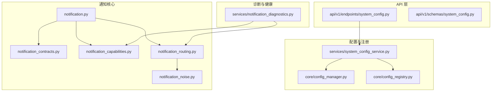
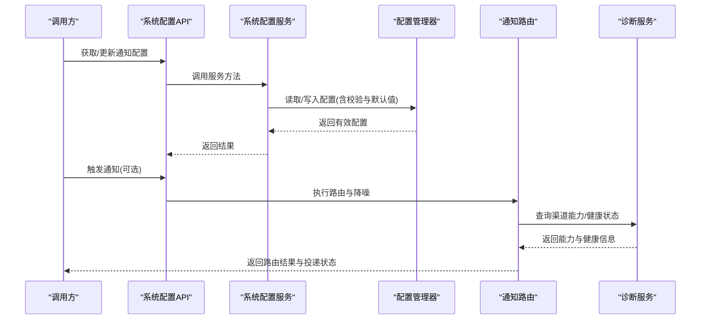
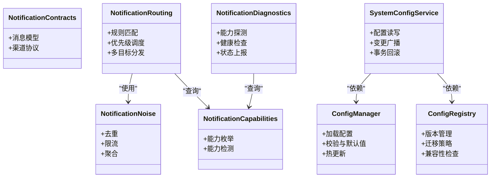

# 通知配置管理

<cite>
**本文引用的文件**   
- [src/notification.py](file://src/notification.py)
- [src/notification_capabilities.py](file://src/notification_capabilities.py)
- [src/notification_contracts.py](file://src/notification_contracts.py)
- [src/notification_noise.py](file://src/notification_noise.py)
- [src/notification_routing.py](file://src/notification_routing.py)
- [src/config_manager.py](file://src/core/config_manager.py)
- [src/config_registry.py](file://src/core/config_registry.py)
- [src/services/system_config_service.py](file://src/services/system_config_service.py)
- [src/services/notification_diagnostics.py](file://src/services/notification_diagnostics.py)
- [api/v1/endpoints/system_config.py](file://api/v1/endpoints/system_config.py)
- [api/v1/schemas/system_config.py](file://api/v1/schemas/system_config.py)
- [src/enums.py](file://src/enums.py)
- [scripts/generate_notification_actions_env_table.py](file://scripts/generate_notification_actions_env_table.py)
- [tests/test_notification.py](file://tests/test_notification.py)
- [tests/test_notification_capabilities.py](file://tests/test_notification_capabilities.py)
- [tests/test_notification_routing.py](file://tests/test_notification_routing.py)
- [tests/test_notification_diagnostics.py](file://tests/test_notification_diagnostics.py)
- [tests/test_system_config_service.py](file://tests/test_system_config_service.py)
</cite>

## 目录
1. [简介](#简介)
2. [项目结构](#项目结构)
3. [核心组件](#核心组件)
4. [架构总览](#架构总览)
5. [详细组件分析](#详细组件分析)
6. [依赖关系分析](#依赖关系分析)
7. [性能考量](#性能考量)
8. [故障排查指南](#故障排查指南)
9. [结论](#结论)
10. [附录](#附录)

## 简介
本文件面向“通知配置管理”子系统，系统性说明全局通知配置结构、渠道优先级设置、路由规则配置，以及动态配置更新、配置验证与默认值管理。同时覆盖通知能力检测、渠道可用性监控与健康检查机制，并提供配置模板、环境变量支持与配置文件格式说明，最后给出配置迁移与版本兼容性处理建议。

## 项目结构
通知相关代码主要分布在以下模块：
- 通知核心与契约：定义消息模型、通道协议与通用能力
- 通知路由与降噪：根据事件类型、目标与策略选择渠道并抑制噪声
- 配置管理与注册：集中加载、校验、合并与热更新配置
- 系统配置服务：对外暴露配置查询/更新接口，驱动前端与后端使用
- 诊断与健康检查：探测渠道能力与可用性，提供健康状态上报
- API 层：REST 端点与 Pydantic 模式，用于前后端交互
- 测试：覆盖路由、能力检测、诊断与服务行为

图表来源
- [src/notification.py](file://src/notification.py)
- [src/notification_contracts.py](file://src/notification_contracts.py)
- [src/notification_capabilities.py](file://src/notification_capabilities.py)
- [src/notification_routing.py](file://src/notification_routing.py)
- [src/notification_noise.py](file://src/notification_noise.py)
- [src/core/config_manager.py](file://src/core/config_manager.py)
- [src/core/config_registry.py](file://src/core/config_registry.py)
- [src/services/system_config_service.py](file://src/services/system_config_service.py)
- [api/v1/endpoints/system_config.py](file://api/v1/endpoints/system_config.py)
- [api/v1/schemas/system_config.py](file://api/v1/schemas/system_config.py)
- [src/services/notification_diagnostics.py](file://src/services/notification_diagnostics.py)

章节来源
- [src/notification.py](file://src/notification.py)
- [src/notification_contracts.py](file://src/notification_contracts.py)
- [src/notification_capabilities.py](file://src/notification_capabilities.py)
- [src/notification_routing.py](file://src/notification_routing.py)
- [src/notification_noise.py](file://src/notification_noise.py)
- [src/core/config_manager.py](file://src/core/config_manager.py)
- [src/core/config_registry.py](file://src/core/config_registry.py)
- [src/services/system_config_service.py](file://src/services/system_config_service.py)
- [api/v1/endpoints/system_config.py](file://api/v1/endpoints/system_config.py)
- [api/v1/schemas/system_config.py](file://api/v1/schemas/system_config.py)
- [src/services/notification_diagnostics.py](file://src/services/notification_diagnostics.py)

## 核心组件
- 通知契约与消息模型：统一消息体结构、字段约束与序列化约定，确保各渠道一致消费
- 渠道能力检测：枚举支持的渠道类型、能力项（如富文本、图片、附件）与限制
- 通知路由：基于事件类型、目标受众、渠道优先级与规则匹配决定投递路径
- 降噪策略：去重、限流、聚合与静默窗口，避免重复或过量通知
- 配置管理：集中读取、校验、合并与热更新；支持默认值与环境变量注入
- 系统配置服务：封装配置的读写、验证与变更广播，为 API 与业务逻辑提供稳定接口
- 诊断与健康检查：周期性探测渠道连通性与能力，输出健康状态与告警

章节来源
- [src/notification_contracts.py](file://src/notification_contracts.py)
- [src/notification_capabilities.py](file://src/notification_capabilities.py)
- [src/notification_routing.py](file://src/notification_routing.py)
- [src/notification_noise.py](file://src/notification_noise.py)
- [src/core/config_manager.py](file://src/core/config_manager.py)
- [src/core/config_registry.py](file://src/core/config_registry.py)
- [src/services/system_config_service.py](file://src/services/system_config_service.py)
- [src/services/notification_diagnostics.py](file://src/services/notification_diagnostics.py)

## 架构总览
通知配置管理采用“契约先行 + 路由优先 + 配置驱动”的架构：
- 契约层定义消息结构与渠道协议，保证跨平台一致性
- 路由层依据配置与上下文进行决策，支持优先级与多目标分发
- 配置层通过配置管理器与注册表实现集中化、可验证、可热更新的配置治理
- 诊断层持续评估渠道可用性与能力，支撑健康检查与降级策略

图表来源
- [api/v1/endpoints/system_config.py](file://api/v1/endpoints/system_config.py)
- [src/services/system_config_service.py](file://src/services/system_config_service.py)
- [src/core/config_manager.py](file://src/core/config_manager.py)
- [src/notification_routing.py](file://src/notification_routing.py)
- [src/services/notification_diagnostics.py](file://src/services/notification_diagnostics.py)

## 详细组件分析

### 全局通知配置结构
- 配置域划分：渠道基础配置、优先级列表、路由规则、降噪策略、能力开关、健康检查参数
- 字段约束：必填项、类型校验、范围限制、互斥组合
- 默认值管理：未显式设置的字段回退到默认值，保证系统稳定性
- 环境变量支持：敏感信息与运行期差异通过环境变量注入，避免硬编码

章节来源
- [src/core/config_manager.py](file://src/core/config_manager.py)
- [src/core/config_registry.py](file://src/core/config_registry.py)
- [api/v1/schemas/system_config.py](file://api/v1/schemas/system_config.py)

### 渠道优先级设置
- 优先级定义：按渠道类型排序，支持条件优先级（如按事件等级、目标受众）
- 冲突解决：同级别渠道的去重与并发策略，失败回退顺序
- 动态调整：运行时修改优先级，立即生效且无需重启

章节来源
- [src/notification_routing.py](file://src/notification_routing.py)
- [src/enums.py](file://src/enums.py)

### 路由规则配置
- 规则维度：事件类型、标签、阈值、时间窗口、目标分组
- 匹配算法：规则命中评分、短路规则、黑名单/白名单
- 多目标分发：同一事件可路由至多个渠道，支持差异化内容

章节来源
- [src/notification_routing.py](file://src/notification_routing.py)
- [src/notification_noise.py](file://src/notification_noise.py)

### 动态配置更新
- 更新入口：API 端点接收配置变更请求，进入服务层校验与持久化
- 热更新：配置变更后即时刷新内存缓存，路由与诊断组件订阅变更事件
- 回滚机制：异常时自动回滚至上一版本，保障连续性

章节来源
- [api/v1/endpoints/system_config.py](file://api/v1/endpoints/system_config.py)
- [src/services/system_config_service.py](file://src/services/system_config_service.py)
- [src/core/config_manager.py](file://src/core/config_manager.py)

### 配置验证与默认值管理
- 验证流程：结构校验、字段约束、依赖关系检查、环境合法性校验
- 默认值策略：分层默认值（内置、文件、环境变量），覆盖顺序明确
- 错误反馈：详细的校验错误定位与修复建议

章节来源
- [api/v1/schemas/system_config.py](file://api/v1/schemas/system_config.py)
- [src/core/config_manager.py](file://src/core/config_manager.py)

### 通知能力检测与渠道可用性监控
- 能力检测：枚举渠道支持的消息类型、富媒体能力、速率限制
- 可用性监控：心跳探测、连接测试、认证校验、延迟统计
- 健康检查：汇总各渠道健康状态，输出整体健康度与告警

章节来源
- [src/notification_capabilities.py](file://src/notification_capabilities.py)
- [src/services/notification_diagnostics.py](file://src/services/notification_diagnostics.py)

### 健康检查机制
- 检查项：渠道连通性、认证有效性、配额剩余、响应时间
- 检查频率：可配置周期，支持按需触发
- 状态上报：健康状态变化触发回调，供外部监控系统采集

章节来源
- [src/services/notification_diagnostics.py](file://src/services/notification_diagnostics.py)

### 配置模板与环境变量支持
- 模板体系：提供常用渠道与场景的配置模板，快速初始化
- 环境变量：敏感信息（密钥、URL）通过环境变量注入，支持命名规范与校验
- 文件格式：支持结构化配置文件（如 YAML/JSON），便于版本管理与审计

章节来源
- [scripts/generate_notification_actions_env_table.py](file://scripts/generate_notification_actions_env_table.py)
- [src/core/config_manager.py](file://src/core/config_manager.py)

### 配置迁移与版本兼容性
- 版本标识：配置对象包含版本号，支持向前/向后兼容
- 迁移策略：自动迁移脚本处理字段增删、类型变更、默认值调整
- 兼容性检查：启动时校验当前配置与期望版本的兼容性，不兼容则拒绝启动或降级

章节来源
- [src/core/config_registry.py](file://src/core/config_registry.py)
- [src/core/config_manager.py](file://src/core/config_manager.py)

## 依赖关系分析
- 低耦合高内聚：契约与路由解耦，配置与诊断独立，便于扩展与维护
- 关键依赖链：API -> 系统配置服务 -> 配置管理器/注册表 -> 路由/诊断
- 潜在循环依赖：通过接口抽象与事件总线避免直接循环引用

图表来源
- [src/notification_contracts.py](file://src/notification_contracts.py)
- [src/notification_capabilities.py](file://src/notification_capabilities.py)
- [src/notification_routing.py](file://src/notification_routing.py)
- [src/notification_noise.py](file://src/notification_noise.py)
- [src/core/config_manager.py](file://src/core/config_manager.py)
- [src/core/config_registry.py](file://src/core/config_registry.py)
- [src/services/system_config_service.py](file://src/services/system_config_service.py)
- [src/services/notification_diagnostics.py](file://src/services/notification_diagnostics.py)

章节来源
- [src/notification_routing.py](file://src/notification_routing.py)
- [src/core/config_manager.py](file://src/core/config_manager.py)
- [src/core/config_registry.py](file://src/core/config_registry.py)
- [src/services/system_config_service.py](file://src/services/system_config_service.py)
- [src/services/notification_diagnostics.py](file://src/services/notification_diagnostics.py)

## 性能考量
- 路由性能：规则索引与短路匹配降低复杂度，避免全量扫描
- 配置访问：内存缓存与只读快照减少锁竞争
- 诊断开销：异步探测与批量检查，避免阻塞主流程
- 降噪效果：合理聚合与限流降低下游压力与用户打扰

[本节为通用指导，不直接分析具体文件]

## 故障排查指南
- 常见问题：
  - 渠道不可用：检查认证、网络、配额与健康状态
  - 路由失效：核对规则优先级与匹配条件
  - 配置错误：查看校验错误详情与默认值覆盖情况
- 诊断工具：
  - 能力检测：确认渠道能力与限制
  - 健康检查：查看连通性、延迟与错误率
  - 日志追踪：定位路由决策与投递结果

章节来源
- [src/services/notification_diagnostics.py](file://src/services/notification_diagnostics.py)
- [src/notification_routing.py](file://src/notification_routing.py)
- [src/core/config_manager.py](file://src/core/config_manager.py)

## 结论
通知配置管理以契约与路由为核心，结合配置驱动与诊断监控，实现了灵活、可靠、可观测的通知能力。通过动态更新、验证与默认值管理，系统在保持稳定的同时具备高度可扩展性。建议在生产环境中启用健康检查与能力探测，配合完善的配置模板与环境变量管理，确保通知链路的高可用与可维护性。

[本节为总结性内容，不直接分析具体文件]

## 附录
- 配置模板示例：参考系统配置服务与配置注册表中的模板定义
- 环境变量清单：参考生成脚本与环境变量规范
- 测试用例：参考通知路由、能力检测、诊断与服务行为的测试文件

章节来源
- [scripts/generate_notification_actions_env_table.py](file://scripts/generate_notification_actions_env_table.py)
- [src/services/system_config_service.py](file://src/services/system_config_service.py)
- [src/core/config_registry.py](file://src/core/config_registry.py)
- [tests/test_notification.py](file://tests/test_notification.py)
- [tests/test_notification_capabilities.py](file://tests/test_notification_capabilities.py)
- [tests/test_notification_routing.py](file://tests/test_notification_routing.py)
- [tests/test_notification_diagnostics.py](file://tests/test_notification_diagnostics.py)
- [tests/test_system_config_service.py](file://tests/test_system_config_service.py)