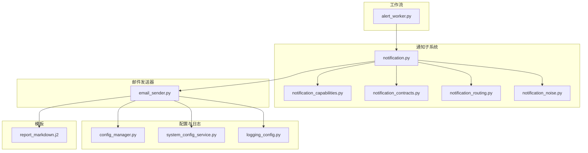
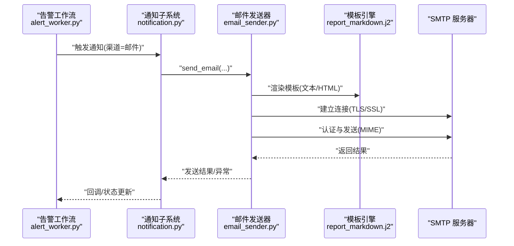
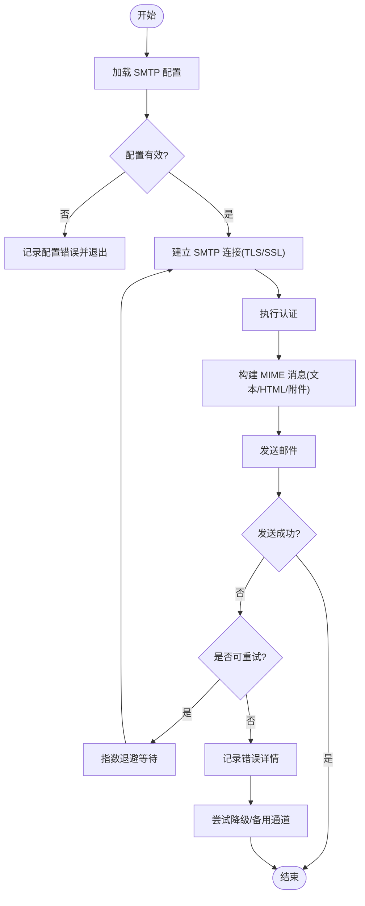
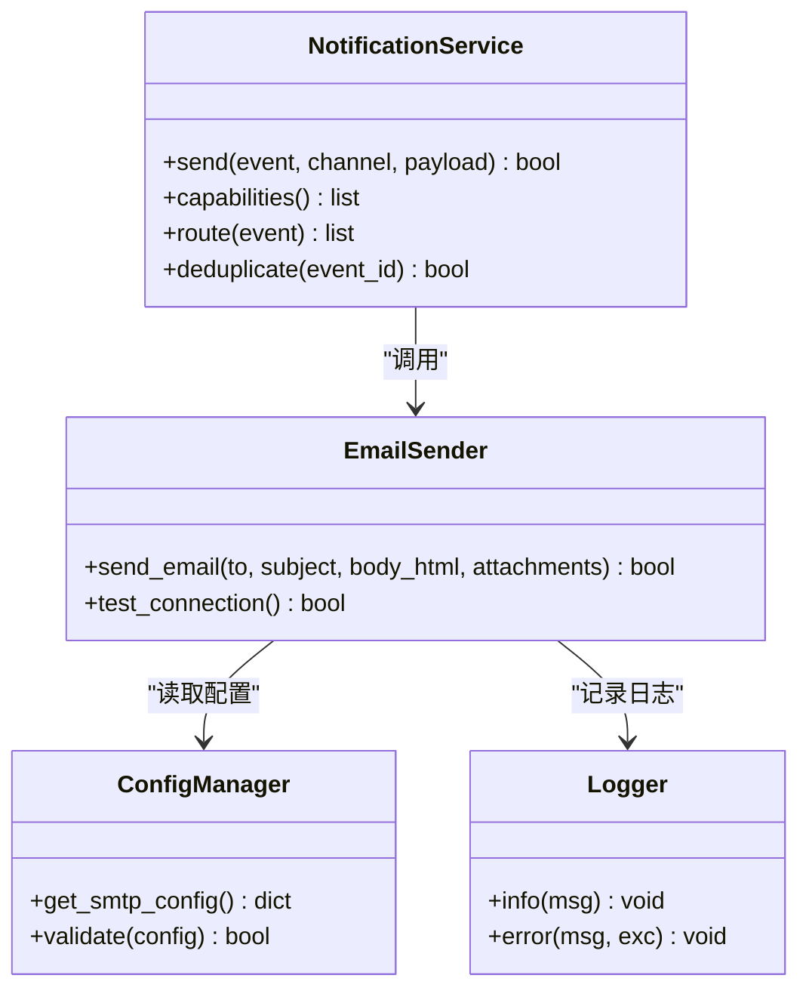
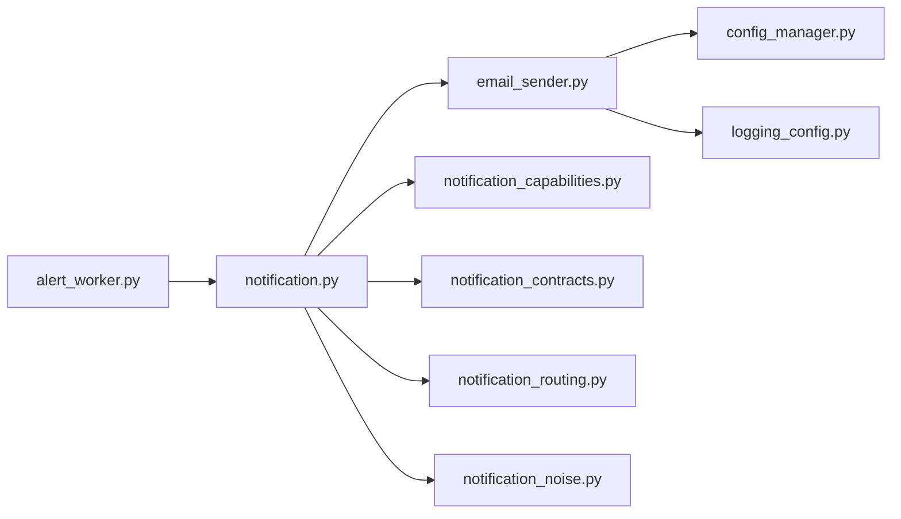

# 邮件通知渠道

<cite>
**本文引用的文件**   
- [src/notification_sender/email_sender.py](file://src/notification_sender/email_sender.py)
- [src/notification.py](file://src/notification.py)
- [src/notification_capabilities.py](file://src/notification_capabilities.py)
- [src/notification_contracts.py](file://src/notification_contracts.py)
- [src/notification_noise.py](file://src/notification_noise.py)
- [src/notification_routing.py](file://src/notification_routing.py)
- [src/services/alert_worker.py](file://src/services/alert_worker.py)
- [src/services/system_config_service.py](file://src/services/system_config_service.py)
- [src/config_manager.py](file://src/core/config_manager.py)
- [src/logging_config.py](file://src/logging_config.py)
- [templates/report_markdown.j2](file://templates/report_markdown.j2)
- [tests/test_notification_sender.py](file://tests/test_notification_sender.py)
- [tests/test_notification.py](file://tests/test_notification.py)
</cite>

## 目录
1. [简介](#简介)
2. [项目结构](#项目结构)
3. [核心组件](#核心组件)
4. [架构总览](#架构总览)
5. [详细组件分析](#详细组件分析)
6. [依赖关系分析](#依赖关系分析)
7. [性能考虑](#性能考虑)
8. [故障排查指南](#故障排查指南)
9. [结论](#结论)
10. [附录](#附录)

## 简介
本章节面向“邮件通知渠道”的配置与使用，覆盖 SMTP 服务器配置、发件人信息设置、收件人列表管理、邮件模板定制（含 HTML）、附件发送、SSL/TLS 安全连接、错误处理与重试策略、日志记录、测试方法与常见问题解决方案。文档基于代码库中的邮件发送实现与通知子系统进行分析与总结，帮助读者快速完成端到端配置与排障。

## 项目结构
邮件通知能力由“通知子系统 + 邮件发送器 + 模板渲染 + 配置/日志”共同构成：
- 通知子系统负责统一入口、能力声明、路由与降噪
- 邮件发送器封装 SMTP 客户端、TLS/SSL、模板渲染与附件处理
- 配置服务与配置管理器提供运行时参数加载与校验
- 日志系统保障可观测性与问题定位
- 模板目录存放报告模板，支持 Markdown/HTML 输出

图表来源
- [src/notification.py](file://src/notification.py)
- [src/notification_capabilities.py](file://src/notification_capabilities.py)
- [src/notification_contracts.py](file://src/notification_contracts.py)
- [src/notification_routing.py](file://src/notification_routing.py)
- [src/notification_noise.py](file://src/notification_noise.py)
- [src/notification_sender/email_sender.py](file://src/notification_sender/email_sender.py)
- [src/core/config_manager.py](file://src/core/config_manager.py)
- [src/services/system_config_service.py](file://src/services/system_config_service.py)
- [src/logging_config.py](file://src/logging_config.py)
- [templates/report_markdown.j2](file://templates/report_markdown.j2)
- [src/services/alert_worker.py](file://src/services/alert_worker.py)

章节来源
- [src/notification.py](file://src/notification.py)
- [src/notification_sender/email_sender.py](file://src/notification_sender/email_sender.py)
- [src/core/config_manager.py](file://src/core/config_manager.py)
- [src/logging_config.py](file://src/logging_config.py)
- [templates/report_markdown.j2](file://templates/report_markdown.j2)

## 核心组件
- 邮件发送器（SMTP）
  - 负责建立 SMTP 连接、认证、构建 MIME 消息、渲染模板、附加文件、发送与关闭连接
  - 支持 TLS/SSL 端口选择与加密选项
  - 支持多收件人与抄送/密送
  - 支持文本与 HTML 正文、内嵌图片、附件
- 通知子系统
  - 统一接口与能力声明，屏蔽不同渠道差异
  - 路由与降噪，避免重复或无效通知
- 配置与日志
  - 集中读取 SMTP 相关环境变量或配置文件
  - 结构化日志记录关键事件与异常堆栈

章节来源
- [src/notification_sender/email_sender.py](file://src/notification_sender/email_sender.py)
- [src/notification.py](file://src/notification.py)
- [src/notification_capabilities.py](file://src/notification_capabilities.py)
- [src/notification_contracts.py](file://src/notification_contracts.py)
- [src/notification_routing.py](file://src/notification_routing.py)
- [src/notification_noise.py](file://src/notification_noise.py)
- [src/core/config_manager.py](file://src/core/config_manager.py)
- [src/logging_config.py](file://src/logging_config.py)

## 架构总览
邮件通知的整体调用链从告警工作流触发，经通知子系统路由到邮件发送器，渲染模板并发送邮件。

图表来源
- [src/services/alert_worker.py](file://src/services/alert_worker.py)
- [src/notification.py](file://src/notification.py)
- [src/notification_sender/email_sender.py](file://src/notification_sender/email_sender.py)
- [templates/report_markdown.j2](file://templates/report_markdown.j2)

## 详细组件分析

### 邮件发送器（SMTP）
- 功能要点
  - 连接与认证：支持 SSL/TLS、端口选择、用户名密码或令牌认证
  - 消息构建：MIME 多部分（文本/HTML/附件），支持内嵌资源
  - 发送流程：连接池/超时控制、重试策略、失败回退
  - 模板渲染：Jinja2 模板，支持变量注入与条件渲染
- 配置项建议
  - SMTP 主机、端口、加密方式（STARTTLS/SSL）
  - 发件人邮箱与显示名
  - 收件人列表（To/Cc/Bcc）
  - 主题、正文（文本/HTML）、附件路径或字节流
  - 超时、重试次数、退避策略
- 错误处理
  - 网络异常、认证失败、权限限制、大小限制等分类捕获
  - 记录详细上下文（主机、端口、主题、收件人数、附件数）
  - 重试与降级（如切换备用 SMTP 或仅发送文本）

图表来源
- [src/notification_sender/email_sender.py](file://src/notification_sender/email_sender.py)
- [src/logging_config.py](file://src/logging_config.py)

章节来源
- [src/notification_sender/email_sender.py](file://src/notification_sender/email_sender.py)
- [src/logging_config.py](file://src/logging_config.py)

### 通知子系统（统一入口与路由）
- 职责
  - 定义通知契约与能力清单，屏蔽具体渠道实现细节
  - 根据规则将通知路由到合适渠道（邮件、IM、Webhook 等）
  - 降噪去重，避免同一事件多次推送
- 关键点
  - 能力检测：检查目标渠道是否可用（如 SMTP 连通性）
  - 路由策略：按事件类型、接收者偏好、优先级进行分发
  - 容错：单个渠道失败不影响其他渠道

图表来源
- [src/notification.py](file://src/notification.py)
- [src/notification_capabilities.py](file://src/notification_capabilities.py)
- [src/notification_contracts.py](file://src/notification_contracts.py)
- [src/notification_routing.py](file://src/notification_routing.py)
- [src/notification_noise.py](file://src/notification_noise.py)
- [src/notification_sender/email_sender.py](file://src/notification_sender/email_sender.py)
- [src/core/config_manager.py](file://src/core/config_manager.py)
- [src/logging_config.py](file://src/logging_config.py)

章节来源
- [src/notification.py](file://src/notification.py)
- [src/notification_capabilities.py](file://src/notification_capabilities.py)
- [src/notification_contracts.py](file://src/notification_contracts.py)
- [src/notification_routing.py](file://src/notification_routing.py)
- [src/notification_noise.py](file://src/notification_noise.py)

### 模板与内容渲染
- 模板位置与格式
  - 模板位于 templates 目录，示例为 report_markdown.j2
  - 支持 Markdown 与 HTML 两种形式，可在发送前转换为 HTML
- 变量与宏
  - 通过 Jinja2 注入数据模型（标题、摘要、指标、时间戳等）
  - 可使用宏复用通用片段（表格、图表占位符等）
- 附件与内嵌资源
  - 支持图片、PDF、CSV 等附件
  - HTML 中可引用内嵌图片或外部链接

章节来源
- [templates/report_markdown.j2](file://templates/report_markdown.j2)
- [src/notification_sender/email_sender.py](file://src/notification_sender/email_sender.py)

### 配置与系统集成
- 配置来源
  - 环境变量或配置文件集中管理 SMTP 参数
  - 系统配置服务提供运行时获取与校验
- 关键配置项
  - SMTP 主机、端口、加密方式（STARTTLS/SSL）
  - 发件人邮箱、密码或令牌、显示名
  - 默认收件人列表、主题前缀、超时与重试策略
- 安全建议
  - 使用最小权限账号与专用应用密码
  - 强制启用 TLS/SSL，禁用弱加密套件
  - 敏感配置不落盘或加密存储

章节来源
- [src/core/config_manager.py](file://src/core/config_manager.py)
- [src/services/system_config_service.py](file://src/services/system_config_service.py)
- [src/logging_config.py](file://src/logging_config.py)

### 工作流与集成点
- 触发点
  - 告警工作流在检测到阈值或事件时发起通知
- 路由与降噪
  - 根据事件类型与接收者策略路由到邮件
  - 去重与合并，减少噪音
- 结果反馈
  - 发送结果回写至工作流状态，便于追踪

章节来源
- [src/services/alert_worker.py](file://src/services/alert_worker.py)
- [src/notification_routing.py](file://src/notification_routing.py)
- [src/notification_noise.py](file://src/notification_noise.py)

## 依赖关系分析
- 模块耦合
  - 邮件发送器依赖配置与日志，不直接依赖业务逻辑
  - 通知子系统对邮件发送器解耦，通过契约与能力清单交互
- 外部依赖
  - SMTP 服务器（企业邮箱/自建 Postfix/SendGrid 等）
  - 模板引擎（Jinja2）
- 潜在循环依赖
  - 通过分层与接口隔离避免循环依赖

图表来源
- [src/services/alert_worker.py](file://src/services/alert_worker.py)
- [src/notification.py](file://src/notification.py)
- [src/notification_sender/email_sender.py](file://src/notification_sender/email_sender.py)
- [src/core/config_manager.py](file://src/core/config_manager.py)
- [src/logging_config.py](file://src/logging_config.py)
- [src/notification_capabilities.py](file://src/notification_capabilities.py)
- [src/notification_contracts.py](file://src/notification_contracts.py)
- [src/notification_routing.py](file://src/notification_routing.py)
- [src/notification_noise.py](file://src/notification_noise.py)

章节来源
- [src/services/alert_worker.py](file://src/services/alert_worker.py)
- [src/notification.py](file://src/notification.py)
- [src/notification_sender/email_sender.py](file://src/notification_sender/email_sender.py)

## 性能考虑
- 连接复用与超时
  - 合理设置连接超时与请求超时，避免阻塞
  - 在高并发场景下考虑连接池
- 批量发送
  - 合并收件人或使用 BCC 降低握手开销
  - 大附件分片或外链替代
- 模板渲染优化
  - 预编译常用模板，减少重复解析
  - 避免在渲染中进行重型计算
- 重试与退避
  - 指数退避与最大重试上限，防止雪崩
  - 区分可重试与不可重试错误

[本节为通用指导，不直接分析具体文件]

## 故障排查指南
- 常见错误与定位
  - 认证失败：检查用户名/密码或令牌、权限与应用密码
  - 连接超时：核对主机、端口、防火墙与代理设置
  - 大小限制：附件过大导致被拒收，需压缩或外链
  - 模板渲染错误：变量缺失或语法错误
- 日志关键字
  - 搜索“smtp”“email”“send”“template”“attach”等关键词
  - 关注异常堆栈与上下文（主机、端口、主题、收件人数）
- 诊断步骤
  - 先验证 SMTP 连通性（测试连接）
  - 逐步缩小范围（最小化模板、单收件人、无附件）
  - 启用调试日志，观察完整请求链路

章节来源
- [src/logging_config.py](file://src/logging_config.py)
- [src/notification_sender/email_sender.py](file://src/notification_sender/email_sender.py)

## 结论
邮件通知渠道通过统一的“通知子系统 + 邮件发送器”架构，实现了高内聚、低耦合的模块化设计。配合完善的配置管理、模板渲染与日志体系，能够稳定支撑企业级邮件通知需求。建议在生产环境启用强加密、最小权限账号与完善的监控告警，确保可靠性与可观测性。

[本节为总结性内容，不直接分析具体文件]

## 附录

### 配置示例（SMTP 与发件人）
- 必填项
  - SMTP 主机与端口（如 465/SSL 或 587/STARTTLS）
  - 发件人邮箱与密码/令牌
  - 至少一个收件人地址
- 可选项
  - 发件人显示名、主题前缀、默认模板
  - 超时、重试次数、退避策略
  - 附件白名单与大小限制

章节来源
- [src/core/config_manager.py](file://src/core/config_manager.py)
- [src/services/system_config_service.py](file://src/services/system_config_service.py)

### 模板定制（Markdown/HTML）
- 模板语言：Jinja2
- 支持内容：标题、摘要、指标、时间戳、表格、图表占位符
- 扩展方式：新增模板文件并在发送时指定模板名称

章节来源
- [templates/report_markdown.j2](file://templates/report_markdown.j2)
- [src/notification_sender/email_sender.py](file://src/notification_sender/email_sender.py)

### 附件发送
- 支持格式：PDF、CSV、图片等
- 注意事项：大小限制、文件名编码、安全扫描
- 最佳实践：优先使用外链或压缩

章节来源
- [src/notification_sender/email_sender.py](file://src/notification_sender/email_sender.py)

### SSL/TLS 安全连接
- 推荐端口：465（SSL）或 587（STARTTLS）
- 证书校验：启用并严格校验
- 加密套件：禁用弱套件，优先现代算法

章节来源
- [src/notification_sender/email_sender.py](file://src/notification_sender/email_sender.py)
- [src/logging_config.py](file://src/logging_config.py)

### 错误处理与重试策略
- 错误分类：网络、认证、权限、大小限制、模板渲染
- 重试策略：指数退避、最大重试次数、幂等性保证
- 降级方案：切换备用 SMTP、仅发送文本、转存队列

章节来源
- [src/notification_sender/email_sender.py](file://src/notification_sender/email_sender.py)
- [src/logging_config.py](file://src/logging_config.py)

### 测试方法
- 单元测试
  - 模拟 SMTP 响应，验证发送流程与异常分支
  - 模板渲染断言（变量替换、HTML 生成）
- 集成测试
  - 使用沙箱 SMTP 或 Mock 服务验证端到端
- 回归用例
  - 覆盖常见错误与边界条件

章节来源
- [tests/test_notification_sender.py](file://tests/test_notification_sender.py)
- [tests/test_notification.py](file://tests/test_notification.py)

### 常见问题与解决方案
- 无法连接 SMTP
  - 检查网络、代理、防火墙；确认端口与加密方式
- 认证失败
  - 使用应用专用密码；确认账号未锁定
- 附件被拒收
  - 压缩或拆分；改用外链
- 模板渲染报错
  - 检查变量完整性与语法；简化模板定位问题

章节来源
- [src/notification_sender/email_sender.py](file://src/notification_sender/email_sender.py)
- [src/logging_config.py](file://src/logging_config.py)