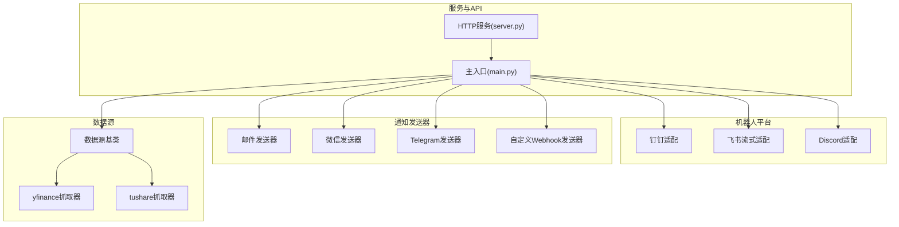
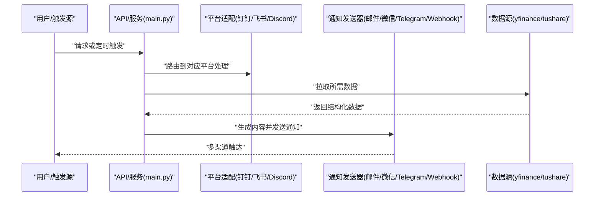
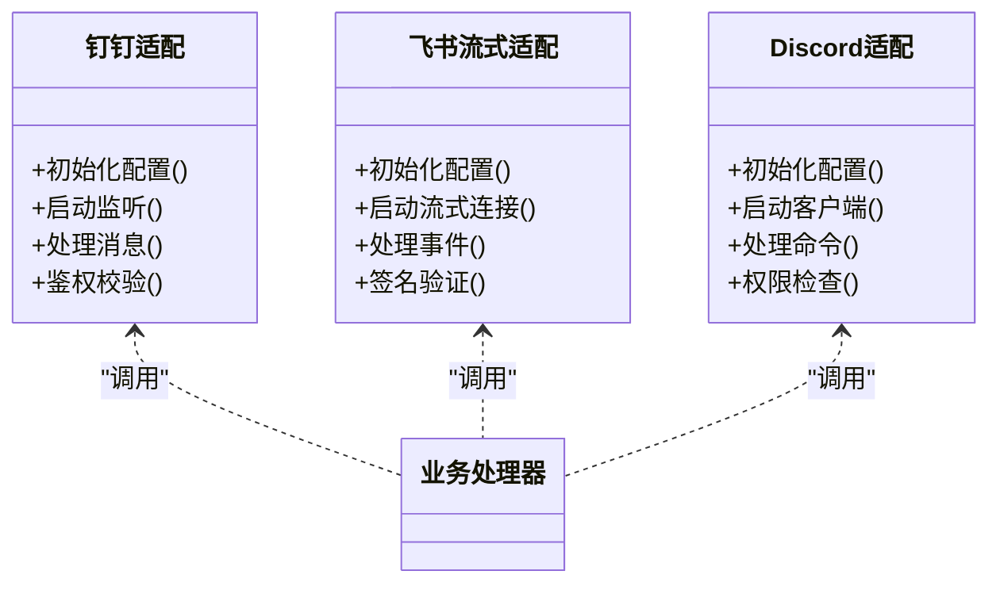
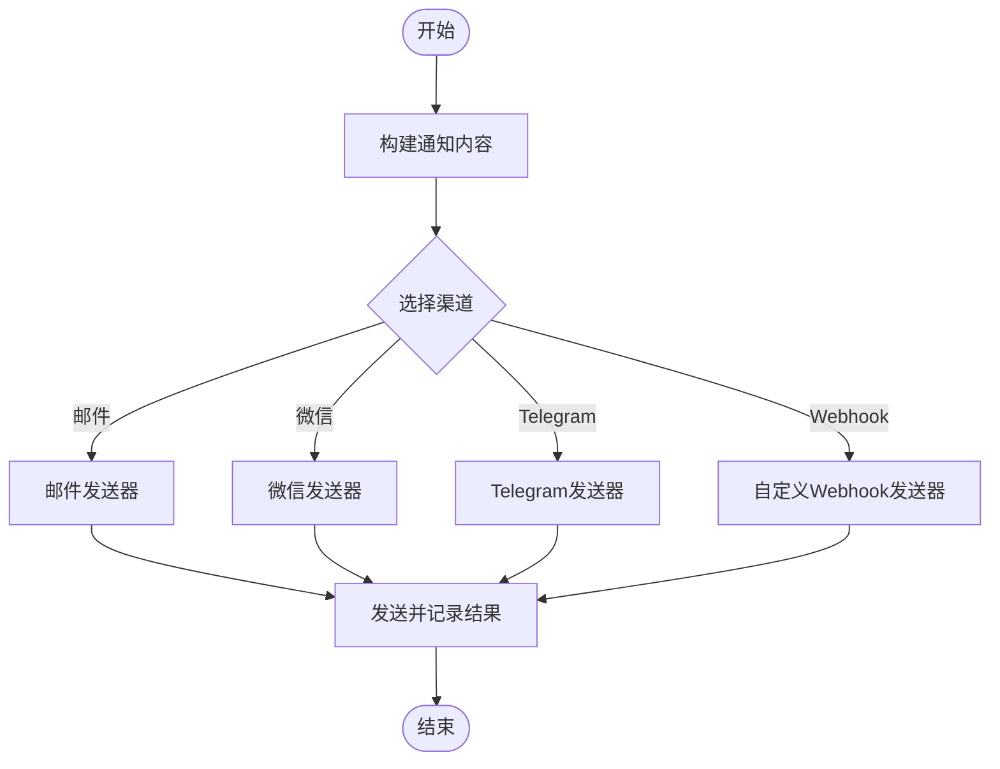
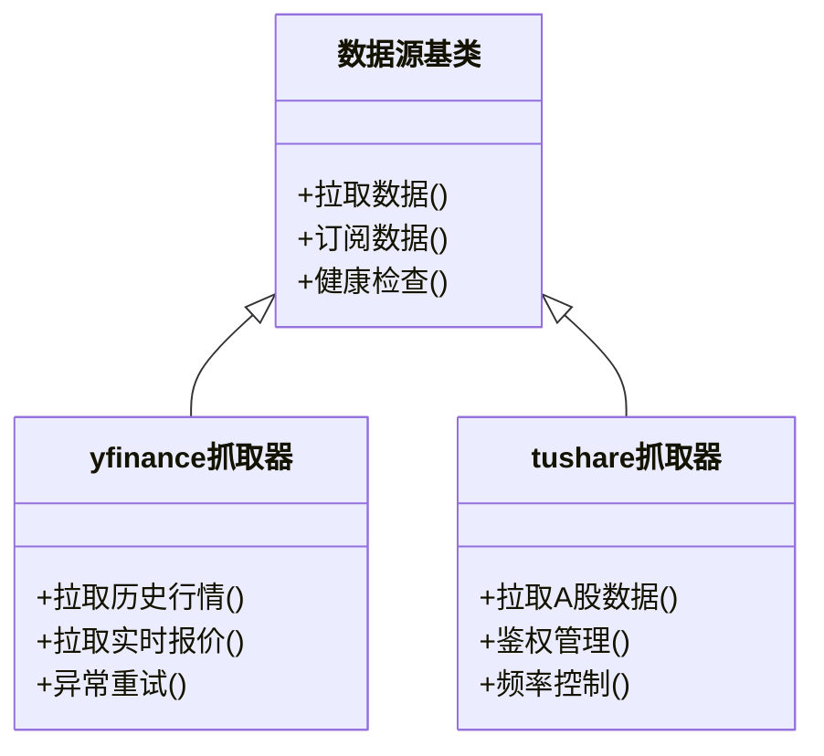
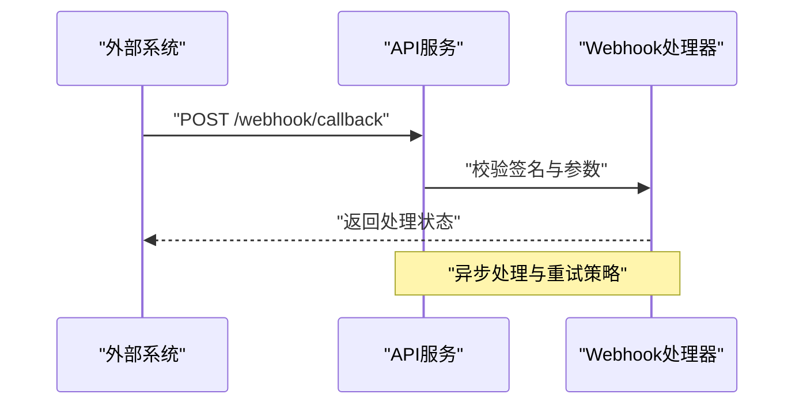
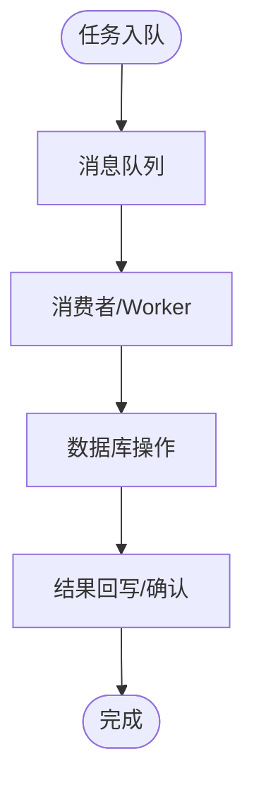
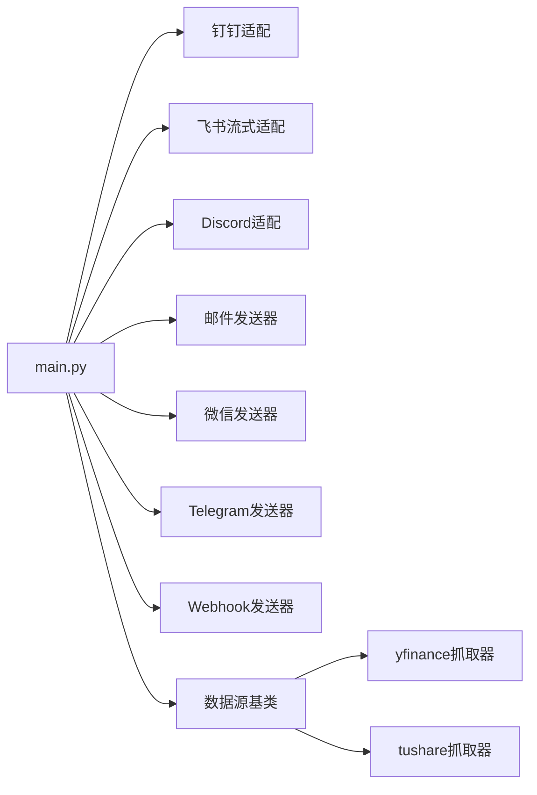

# 集成示例

<cite>
**本文引用的文件**   
- [bot/platforms/dingtalk.py](file://bot/platforms/dingtalk.py)
- [bot/platforms/feishu_stream.py](file://bot/platforms/feishu_stream.py)
- [bot/platforms/discord.py](file://bot/platforms/discord.py)
- [src/notification_sender/email_sender.py](file://src/notification_sender/email_sender.py)
- [src/notification_sender/wechat_sender.py](file://src/notification_sender/wechat_sender.py)
- [src/notification_sender/telegram_sender.py](file://src/notification_sender/telegram_sender.py)
- [src/notification_sender/custom_webhook_sender.py](file://src/notification_sender/custom_webhook_sender.py)
- [data_provider/base.py](file://data_provider/base.py)
- [data_provider/yfinance_fetcher.py](file://data_provider/yfinance_fetcher.py)
- [data_provider/tushare_fetcher.py](file://data_provider/tushare_fetcher.py)
- [scripts/generate_notification_actions_env_table.py](file://scripts/generate_notification_actions_env_table.py)
- [main.py](file://main.py)
- [server.py](file://server.py)
</cite>

## 目录
1. [简介](#简介)
2. [项目结构](#项目结构)
3. [核心组件](#核心组件)
4. [架构总览](#架构总览)
5. [详细组件分析](#详细组件分析)
6. [依赖关系分析](#依赖关系分析)
7. [性能与可靠性](#性能与可靠性)
8. [故障排查指南](#故障排查指南)
9. [结论](#结论)
10. [附录：配置与示例清单](#附录配置与示例清单)

## 简介
本文件面向第三方系统集成，提供可操作的接入示例与最佳实践。覆盖以下能力：
- 聊天机器人平台：钉钉、飞书、Discord
- 通知渠道：邮件、微信、Telegram、Webhook
- 数据源提供商：通用接入方法与自定义数据源开发
- 其他集成：数据库连接、消息队列（通过服务层与任务调度）

文档以代码级为依据，给出架构图、调用序列图与流程图，帮助快速落地集成。

## 项目结构
本项目将“机器人平台”“通知发送器”“数据源抓取器”“API与服务”分层组织，便于扩展与维护：
- bot/platforms：各聊天平台的适配实现（钉钉、飞书、Discord等）
- src/notification_sender：各类通知渠道的发送实现（邮件、微信、Telegram、Webhook等）
- data_provider：统一的数据源抽象与具体实现（yfinance、tushare等）
- API与服务：对外接口与后台任务调度，驱动上述模块协同工作

图表来源
- [bot/platforms/dingtalk.py](file://bot/platforms/dingtalk.py)
- [bot/platforms/feishu_stream.py](file://bot/platforms/feishu_stream.py)
- [bot/platforms/discord.py](file://bot/platforms/discord.py)
- [src/notification_sender/email_sender.py](file://src/notification_sender/email_sender.py)
- [src/notification_sender/wechat_sender.py](file://src/notification_sender/wechat_sender.py)
- [src/notification_sender/telegram_sender.py](file://src/notification_sender/telegram_sender.py)
- [src/notification_sender/custom_webhook_sender.py](file://src/notification_sender/custom_webhook_sender.py)
- [data_provider/base.py](file://data_provider/base.py)
- [data_provider/yfinance_fetcher.py](file://data_provider/yfinance_fetcher.py)
- [data_provider/tushare_fetcher.py](file://data_provider/tushare_fetcher.py)
- [main.py](file://main.py)
- [server.py](file://server.py)

章节来源
- [main.py](file://main.py)
- [server.py](file://server.py)

## 核心组件
- 机器人平台适配：统一事件模型与命令分发，屏蔽不同平台差异
- 通知发送器：统一的发送接口，支持多通道并发与重试
- 数据源抽象：统一的拉取/订阅接口，支持多种数据提供方
- 服务编排：API与定时任务驱动数据获取、分析与通知

章节来源
- [bot/platforms/dingtalk.py](file://bot/platforms/dingtalk.py)
- [bot/platforms/feishu_stream.py](file://bot/platforms/feishu_stream.py)
- [bot/platforms/discord.py](file://bot/platforms/discord.py)
- [src/notification_sender/email_sender.py](file://src/notification_sender/email_sender.py)
- [src/notification_sender/wechat_sender.py](file://src/notification_sender/wechat_sender.py)
- [src/notification_sender/telegram_sender.py](file://src/notification_sender/telegram_sender.py)
- [src/notification_sender/custom_webhook_sender.py](file://src/notification_sender/custom_webhook_sender.py)
- [data_provider/base.py](file://data_provider/base.py)

## 架构总览
系统采用“平台适配 + 发送器 + 数据源”的分层架构。上层通过统一接口对接外部平台与数据源，下层由具体实现负责协议细节与网络交互。

图表来源
- [main.py](file://main.py)
- [bot/platforms/dingtalk.py](file://bot/platforms/dingtalk.py)
- [bot/platforms/feishu_stream.py](file://bot/platforms/feishu_stream.py)
- [bot/platforms/discord.py](file://bot/platforms/discord.py)
- [src/notification_sender/email_sender.py](file://src/notification_sender/email_sender.py)
- [src/notification_sender/wechat_sender.py](file://src/notification_sender/wechat_sender.py)
- [src/notification_sender/telegram_sender.py](file://src/notification_sender/telegram_sender.py)
- [src/notification_sender/custom_webhook_sender.py](file://src/notification_sender/custom_webhook_sender.py)
- [data_provider/base.py](file://data_provider/base.py)
- [data_provider/yfinance_fetcher.py](file://data_provider/yfinance_fetcher.py)
- [data_provider/tushare_fetcher.py](file://data_provider/tushare_fetcher.py)

## 详细组件分析

### 聊天机器人平台集成（钉钉、飞书、Discord）
- 统一事件模型：各平台消息、回调、鉴权差异被封装在各自适配器中
- 命令分发：平台适配层解析命令并转发至业务处理器
- 流式与长连接：飞书使用流式接入，提升实时性；钉钉与Discord按各自SDK约定建立连接

图表来源
- [bot/platforms/dingtalk.py](file://bot/platforms/dingtalk.py)
- [bot/platforms/feishu_stream.py](file://bot/platforms/feishu_stream.py)
- [bot/platforms/discord.py](file://bot/platforms/discord.py)

章节来源
- [bot/platforms/dingtalk.py](file://bot/platforms/dingtalk.py)
- [bot/platforms/feishu_stream.py](file://bot/platforms/feishu_stream.py)
- [bot/platforms/discord.py](file://bot/platforms/discord.py)

### 通知渠道集成（邮件、微信、Telegram、Webhook）
- 统一发送接口：所有发送器实现一致的发送方法，便于编排与替换
- 模板渲染：根据渠道特性渲染文本/富文本/图片
- 错误处理与重试：失败时记录日志并支持重试策略

图表来源
- [src/notification_sender/email_sender.py](file://src/notification_sender/email_sender.py)
- [src/notification_sender/wechat_sender.py](file://src/notification_sender/wechat_sender.py)
- [src/notification_sender/telegram_sender.py](file://src/notification_sender/telegram_sender.py)
- [src/notification_sender/custom_webhook_sender.py](file://src/notification_sender/custom_webhook_sender.py)

章节来源
- [src/notification_sender/email_sender.py](file://src/notification_sender/email_sender.py)
- [src/notification_sender/wechat_sender.py](file://src/notification_sender/wechat_sender.py)
- [src/notification_sender/telegram_sender.py](file://src/notification_sender/telegram_sender.py)
- [src/notification_sender/custom_webhook_sender.py](file://src/notification_sender/custom_webhook_sender.py)

### 数据源提供商接入与自定义开发
- 统一抽象：通过基类定义拉取/订阅接口，确保一致性
- 具体实现：针对不同提供方实现认证、限流、分页、异常处理
- 扩展方式：新增数据源只需继承基类并实现必要方法

图表来源
- [data_provider/base.py](file://data_provider/base.py)
- [data_provider/yfinance_fetcher.py](file://data_provider/yfinance_fetcher.py)
- [data_provider/tushare_fetcher.py](file://data_provider/tushare_fetcher.py)

章节来源
- [data_provider/base.py](file://data_provider/base.py)
- [data_provider/yfinance_fetcher.py](file://data_provider/yfinance_fetcher.py)
- [data_provider/tushare_fetcher.py](file://data_provider/tushare_fetcher.py)

### Webhook 集成示例
- 适用场景：与外部系统双向通信、事件回调、轻量推送
- 关键点：签名校验、幂等处理、超时与重试、日志追踪

图表来源
- [src/notification_sender/custom_webhook_sender.py](file://src/notification_sender/custom_webhook_sender.py)

章节来源
- [src/notification_sender/custom_webhook_sender.py](file://src/notification_sender/custom_webhook_sender.py)

### 数据库连接与消息队列集成（服务层视角）
- 数据库连接：通过服务层访问持久化存储，读写分离与连接池优化
- 消息队列：任务队列承载异步任务，解耦生产与消费，提高吞吐

说明：该图为概念流程，用于理解服务层如何编排任务与存储。

[本节为概念性说明，不直接分析具体文件]

## 依赖关系分析
- 平台适配与发送器均依赖统一接口，降低耦合度
- 数据源抽象使新增提供方无需改动上层逻辑
- 主入口与服务层协调各模块，形成清晰调用链

图表来源
- [main.py](file://main.py)
- [bot/platforms/dingtalk.py](file://bot/platforms/dingtalk.py)
- [bot/platforms/feishu_stream.py](file://bot/platforms/feishu_stream.py)
- [bot/platforms/discord.py](file://bot/platforms/discord.py)
- [src/notification_sender/email_sender.py](file://src/notification_sender/email_sender.py)
- [src/notification_sender/wechat_sender.py](file://src/notification_sender/wechat_sender.py)
- [src/notification_sender/telegram_sender.py](file://src/notification_sender/telegram_sender.py)
- [src/notification_sender/custom_webhook_sender.py](file://src/notification_sender/custom_webhook_sender.py)
- [data_provider/base.py](file://data_provider/base.py)
- [data_provider/yfinance_fetcher.py](file://data_provider/yfinance_fetcher.py)
- [data_provider/tushare_fetcher.py](file://data_provider/tushare_fetcher.py)

章节来源
- [main.py](file://main.py)

## 性能与可靠性
- 并发与限流：对高频数据源与外部API进行限流与退避
- 缓存与去重：减少重复请求与无效通知
- 重试与熔断：关键路径增加重试与熔断保护
- 监控与日志：全链路日志与指标上报，便于定位问题

[本节为通用建议，不直接分析具体文件]

## 故障排查指南
- 平台鉴权失败：检查密钥、签名、回调地址与权限配置
- 通知发送失败：核对收件人/频道ID、模板变量、网络连通性
- 数据源异常：查看限流、配额、网络超时与重试次数
- 任务堆积：检查队列消费者数量与处理能力

章节来源
- [scripts/generate_notification_actions_env_table.py](file://scripts/generate_notification_actions_env_table.py)

## 结论
通过统一抽象与分层设计，本项目能够高效集成多种聊天平台、通知渠道与数据源。遵循本文档的配置与示例，可快速落地第三方系统集成，并在扩展时保持低耦合与高内聚。

[本节为总结性内容，不直接分析具体文件]

## 附录：配置与示例清单
- 钉钉机器人：参考平台适配与文档中的配置项
- 飞书机器人：参考流式适配与事件签名配置
- Discord机器人：参考客户端初始化与权限设置
- 邮件通知：SMTP服务器、发件人、主题模板
- 微信通知：企业微信/公众号相关参数
- Telegram通知：Bot Token与目标群组/频道
- Webhook：回调URL、签名算法、幂等键
- 数据源：yfinance/tushare等凭据与限流策略

[本节为概览性说明，不直接分析具体文件]