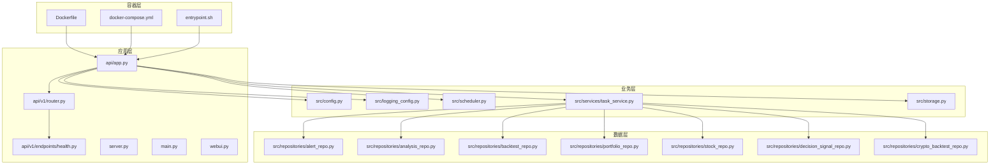
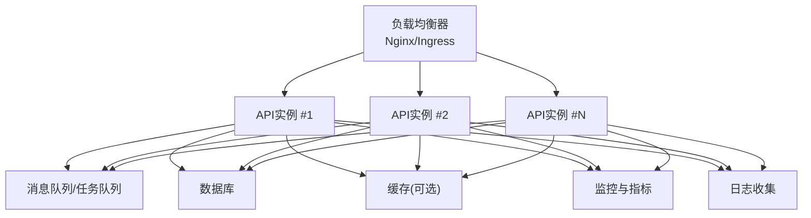
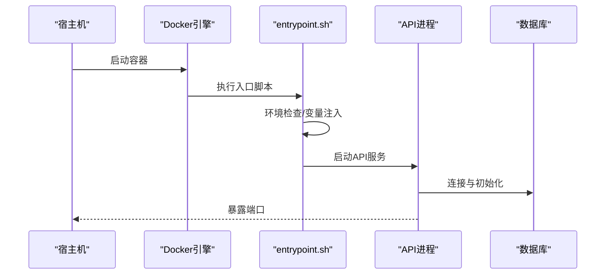
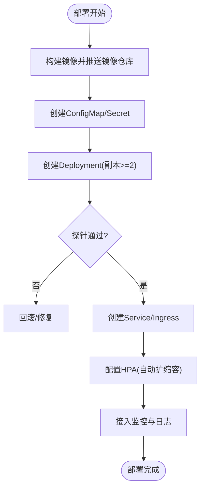
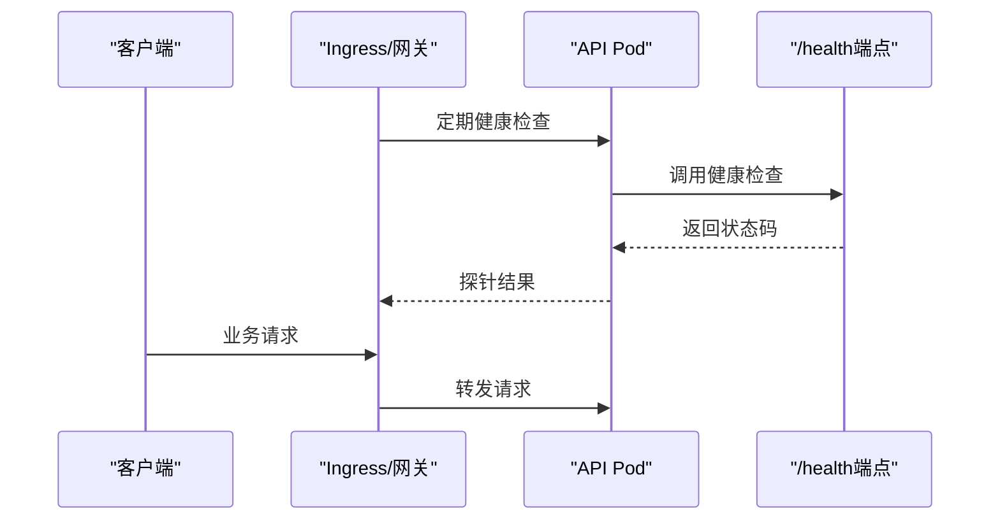
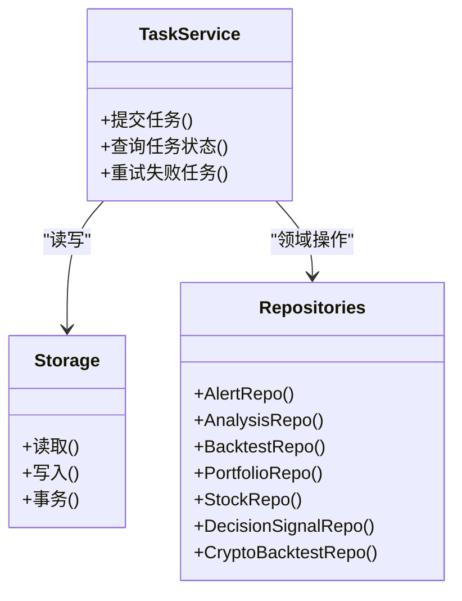
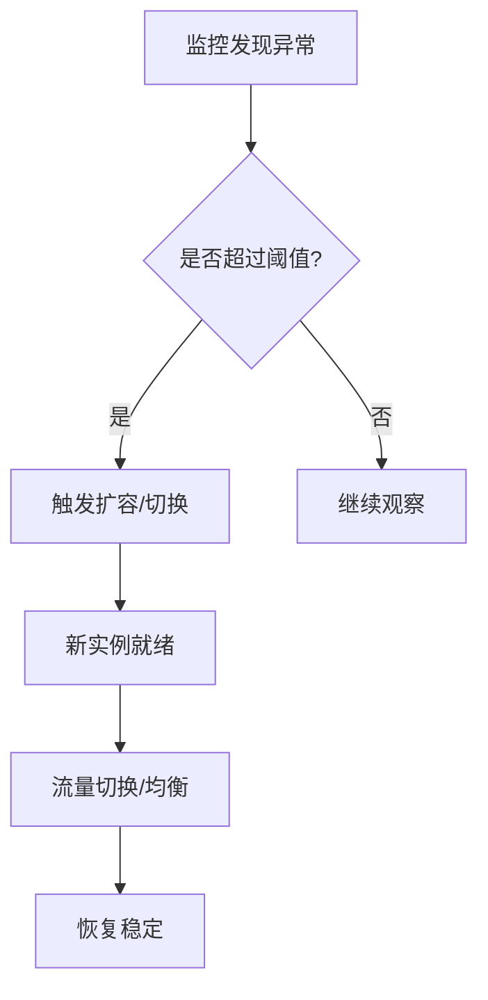
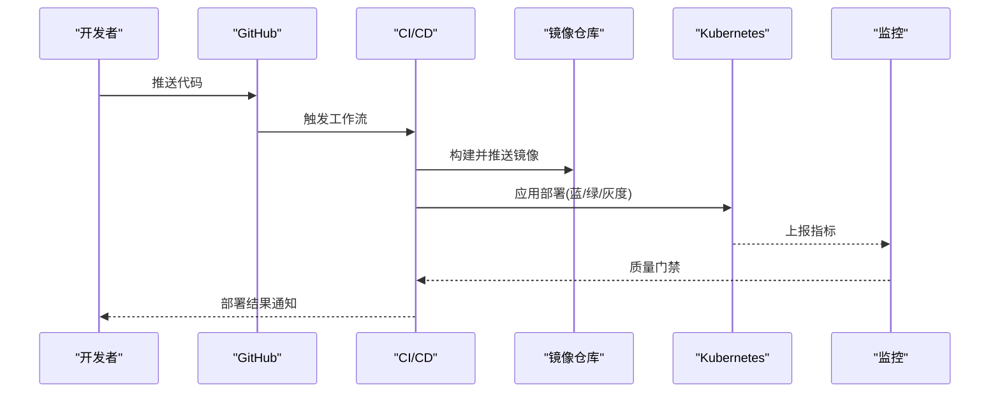
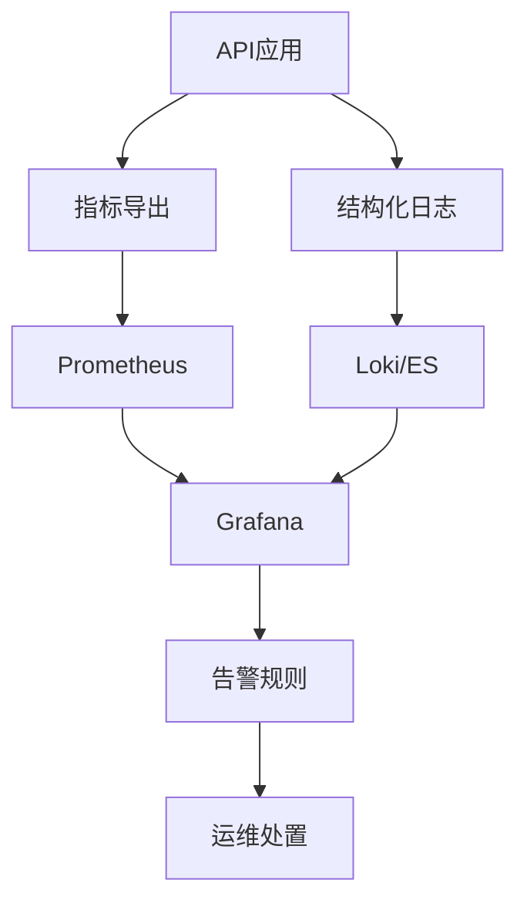
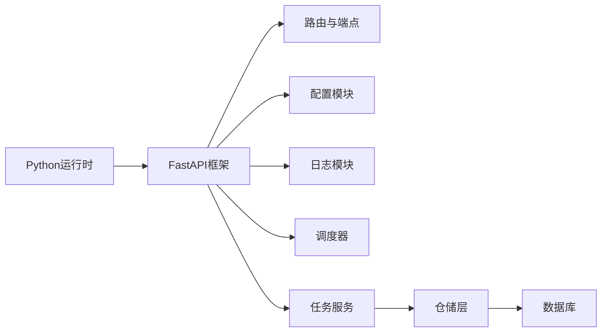

# 分布式部署与高可用

<cite>
**本文引用的文件**   
- [Dockerfile](file://docker/Dockerfile)
- [docker-compose.yml](file://docker/docker-compose.yml)
- [entrypoint.sh](file://docker/entrypoint.sh)
- [server.py](file://server.py)
- [main.py](file://main.py)
- [webui.py](file://webui.py)
- [api/app.py](file://api/app.py)
- [api/v1/router.py](file://api/v1/router.py)
- [api/v1/endpoints/health.py](file://api/v1/endpoints/health.py)
- [src/config.py](file://src/config.py)
- [src/logging_config.py](file://src/logging_config.py)
- [src/scheduler.py](file://src/scheduler.py)
- [src/services/task_service.py](file://src/services/task_service.py)
- [src/repositories/alert_repo.py](file://src/repositories/alert_repo.py)
- [src/repositories/analysis_repo.py](file://src/repositories/analysis_repo.py)
- [src/repositories/backtest_repo.py](file://src/repositories/backtest_repo.py)
- [src/repositories/portfolio_repo.py](file://src/repositories/portfolio_repo.py)
- [src/repositories/stock_repo.py](file://src/repositories/stock_repo.py)
- [src/repositories/decision_signal_repo.py](file://src/repositories/decision_signal_repo.py)
- [src/repositories/crypto_backtest_repo.py](file://src/repositories/crypto_backtest_repo.py)
- [src/storage.py](file://src/storage.py)
- [pyproject.toml](file://pyproject.toml)
- [requirements.txt](file://requirements.txt)
- [.github/workflows/release.yml](file://.github/workflows/release.yml)
- [scripts/ci_gate.sh](file://scripts/ci_gate.sh)
- [scripts/test.sh](file://scripts/test.sh)
- [docs/DEPLOY_EN.md](file://docs/DEPLOY_EN.md)
- [docs/full-guide_EN.md](file://docs/full-guide_EN.md)
</cite>

## 目录
1. [简介](#简介)
2. [项目结构](#项目结构)
3. [核心组件](#核心组件)
4. [架构总览](#架构总览)
5. [详细组件分析](#详细组件分析)
6. [依赖关系分析](#依赖关系分析)
7. [性能考虑](#性能考虑)
8. [故障排查指南](#故障排查指南)
9. [结论](#结论)
10. [附录](#附录)

## 简介
本指南面向将本股票分析系统以分布式、高可用的方式在生产环境部署的工程团队。内容涵盖容器化打包、Kubernetes集群编排、负载均衡与健康检查、多实例部署、数据同步与一致性、故障转移与自动扩缩容、CI/CD流水线、蓝绿与灰度发布策略，以及监控面板、日志收集与故障恢复流程。文档基于仓库现有代码与配置进行解读，并给出可操作的落地建议。

## 项目结构
从部署视角，关键目录与文件包括：
- docker：容器镜像构建与本地编排（Dockerfile、docker-compose、启动脚本）
- api：FastAPI应用入口与路由定义，包含健康检查端点
- src：业务逻辑、配置、调度、存储与任务服务
- .github/workflows：GitHub Actions工作流（含发布）
- scripts：CI门禁与测试脚本
- docs：部署与使用文档

图表来源
- [Dockerfile](file://docker/Dockerfile)
- [docker-compose.yml](file://docker/docker-compose.yml)
- [entrypoint.sh](file://docker/entrypoint.sh)
- [api/app.py](file://api/app.py)
- [api/v1/router.py](file://api/v1/router.py)
- [api/v1/endpoints/health.py](file://api/v1/endpoints/health.py)
- [src/config.py](file://src/config.py)
- [src/logging_config.py](file://src/logging_config.py)
- [src/scheduler.py](file://src/scheduler.py)
- [src/services/task_service.py](file://src/services/task_service.py)
- [src/storage.py](file://src/storage.py)
- [src/repositories/alert_repo.py](file://src/repositories/alert_repo.py)
- [src/repositories/analysis_repo.py](file://src/repositories/analysis_repo.py)
- [src/repositories/backtest_repo.py](file://src/repositories/backtest_repo.py)
- [src/repositories/portfolio_repo.py](file://src/repositories/portfolio_repo.py)
- [src/repositories/stock_repo.py](file://src/repositories/stock_repo.py)
- [src/repositories/decision_signal_repo.py](file://src/repositories/decision_signal_repo.py)
- [src/repositories/crypto_backtest_repo.py](file://src/repositories/crypto_backtest_repo.py)

章节来源
- [Dockerfile](file://docker/Dockerfile)
- [docker-compose.yml](file://docker/docker-compose.yml)
- [entrypoint.sh](file://docker/entrypoint.sh)
- [api/app.py](file://api/app.py)
- [api/v1/router.py](file://api/v1/router.py)
- [api/v1/endpoints/health.py](file://api/v1/endpoints/health.py)
- [src/config.py](file://src/config.py)
- [src/logging_config.py](file://src/logging_config.py)
- [src/scheduler.py](file://src/scheduler.py)
- [src/services/task_service.py](file://src/services/task_service.py)
- [src/storage.py](file://src/storage.py)
- [pyproject.toml](file://pyproject.toml)
- [requirements.txt](file://requirements.txt)

## 核心组件
- 容器化与启动
  - Dockerfile：定义Python运行环境、依赖安装、静态资源与入口命令
  - docker-compose.yml：编排后端、数据库、缓存等依赖服务
  - entrypoint.sh：容器启动前准备与环境注入
- Web API与服务
  - server.py/main.py/webui.py：进程入口与Web服务装配
  - api/app.py：FastAPI应用初始化、中间件、路由挂载
  - api/v1/router.py：版本化路由聚合
  - api/v1/endpoints/health.py：健康检查端点（存活/就绪）
- 配置与日志
  - src/config.py：运行时配置加载与校验
  - src/logging_config.py：结构化日志与输出目标
- 调度与任务
  - src/scheduler.py：定时任务与后台作业调度
  - src/services/task_service.py：任务队列与执行编排
- 存储与数据访问
  - src/storage.py：统一存储抽象
  - repositories/*：各领域仓储实现（告警、分析、回测、组合、股票、决策信号、加密资产回测）

章节来源
- [server.py](file://server.py)
- [main.py](file://main.py)
- [webui.py](file://webui.py)
- [api/app.py](file://api/app.py)
- [api/v1/router.py](file://api/v1/router.py)
- [api/v1/endpoints/health.py](file://api/v1/endpoints/health.py)
- [src/config.py](file://src/config.py)
- [src/logging_config.py](file://src/logging_config.py)
- [src/scheduler.py](file://src/scheduler.py)
- [src/services/task_service.py](file://src/services/task_service.py)
- [src/storage.py](file://src/storage.py)
- [src/repositories/alert_repo.py](file://src/repositories/alert_repo.py)
- [src/repositories/analysis_repo.py](file://src/repositories/analysis_repo.py)
- [src/repositories/backtest_repo.py](file://src/repositories/backtest_repo.py)
- [src/repositories/portfolio_repo.py](file://src/repositories/portfolio_repo.py)
- [src/repositories/stock_repo.py](file://src/repositories/stock_repo.py)
- [src/repositories/decision_signal_repo.py](file://src/repositories/decision_signal_repo.py)
- [src/repositories/crypto_backtest_repo.py](file://src/repositories/crypto_backtest_repo.py)

## 架构总览
下图展示生产级分布式部署的关键组件与交互：外部流量经负载均衡进入多个无状态API实例；任务与调度通过消息队列或共享存储协调；持久化数据由外部数据库提供；监控与日志集中采集。

图表来源
- [api/app.py](file://api/app.py)
- [api/v1/router.py](file://api/v1/router.py)
- [api/v1/endpoints/health.py](file://api/v1/endpoints/health.py)
- [src/services/task_service.py](file://src/services/task_service.py)
- [src/storage.py](file://src/storage.py)

## 详细组件分析

### 容器化与启动流程
- Dockerfile负责构建镜像，安装依赖、拷贝源码与静态资源，设置环境变量与入口命令
- docker-compose用于本地开发编排，通常包含后端、数据库、缓存等
- entrypoint.sh在容器启动时完成环境准备、依赖检查与优雅启动

图表来源
- [Dockerfile](file://docker/Dockerfile)
- [docker-compose.yml](file://docker/docker-compose.yml)
- [entrypoint.sh](file://docker/entrypoint.sh)

章节来源
- [Dockerfile](file://docker/Dockerfile)
- [docker-compose.yml](file://docker/docker-compose.yml)
- [entrypoint.sh](file://docker/entrypoint.sh)

### Kubernetes集群部署
- Deployment：声明副本数、资源限制、探针（存活/就绪）、滚动更新策略
- Service：ClusterIP暴露内部服务，配合Ingress对外暴露HTTP/HTTPS
- ConfigMap/Secret：集中管理配置与敏感信息
- HorizontalPodAutoscaler：基于CPU/内存或自定义指标自动扩缩容
- PersistentVolumeClaim：为有状态组件（如数据库）提供持久化存储
- NetworkPolicy：限制Pod间网络访问

[本图为概念性流程图，不直接映射具体源文件]

### 负载均衡与健康检查
- 负载均衡：Ingress/Nginx将请求分发到多个API Pod
- 健康检查：/health端点返回存活与就绪状态，供Kubelet或网关探测
- 就绪探针：确保依赖（数据库、缓存）就绪后再接收流量

图表来源
- [api/v1/endpoints/health.py](file://api/v1/endpoints/health.py)
- [api/v1/router.py](file://api/v1/router.py)
- [api/app.py](file://api/app.py)

章节来源
- [api/v1/endpoints/health.py](file://api/v1/endpoints/health.py)
- [api/v1/router.py](file://api/v1/router.py)
- [api/app.py](file://api/app.py)

### 多实例部署与数据同步
- 无状态API：多副本并行处理请求，会话与临时状态外置（Redis等）
- 任务与调度：通过消息队列或分布式锁避免重复执行
- 数据一致性：读写分离、事务边界明确、幂等设计
- 缓存策略：读多写少场景采用缓存+失效策略

图表来源
- [src/services/task_service.py](file://src/services/task_service.py)
- [src/storage.py](file://src/storage.py)
- [src/repositories/alert_repo.py](file://src/repositories/alert_repo.py)
- [src/repositories/analysis_repo.py](file://src/repositories/analysis_repo.py)
- [src/repositories/backtest_repo.py](file://src/repositories/backtest_repo.py)
- [src/repositories/portfolio_repo.py](file://src/repositories/portfolio_repo.py)
- [src/repositories/stock_repo.py](file://src/repositories/stock_repo.py)
- [src/repositories/decision_signal_repo.py](file://src/repositories/decision_signal_repo.py)
- [src/repositories/crypto_backtest_repo.py](file://src/repositories/crypto_backtest_repo.py)

章节来源
- [src/services/task_service.py](file://src/services/task_service.py)
- [src/storage.py](file://src/storage.py)
- [src/repositories/alert_repo.py](file://src/repositories/alert_repo.py)
- [src/repositories/analysis_repo.py](file://src/repositories/analysis_repo.py)
- [src/repositories/backtest_repo.py](file://src/repositories/backtest_repo.py)
- [src/repositories/portfolio_repo.py](file://src/repositories/portfolio_repo.py)
- [src/repositories/stock_repo.py](file://src/repositories/stock_repo.py)
- [src/repositories/decision_signal_repo.py](file://src/repositories/decision_signal_repo.py)
- [src/repositories/crypto_backtest_repo.py](file://src/repositories/crypto_backtest_repo.py)

### 故障转移与自动扩缩容
- 故障转移：Pod崩溃后由控制器重建；节点故障时迁移至其他节点
- 自动扩缩容：HPA基于CPU/内存或自定义指标（QPS、延迟）调整副本数
- 优雅停机：SIGTERM处理，等待长任务完成或安全退出

[本图为概念性流程图，不直接映射具体源文件]

### CI/CD流水线、蓝绿部署与灰度发布
- CI：代码提交触发构建、单元测试、静态检查、镜像构建与推送
- CD：自动化部署到预发/生产环境，支持回滚
- 蓝绿部署：两套相同环境，切换流量快速回滚
- 灰度发布：按用户/地域/权重逐步放量

图表来源
- [.github/workflows/release.yml](file://.github/workflows/release.yml)
- [scripts/ci_gate.sh](file://scripts/ci_gate.sh)
- [scripts/test.sh](file://scripts/test.sh)

章节来源
- [.github/workflows/release.yml](file://.github/workflows/release.yml)
- [scripts/ci_gate.sh](file://scripts/ci_gate.sh)
- [scripts/test.sh](file://scripts/test.sh)

### 监控面板、日志收集与故障恢复
- 监控：Prometheus抓取指标，Grafana可视化；记录错误率、延迟、吞吐
- 日志：结构化JSON输出，集中收集（ELK/Loki），关联追踪ID
- 故障恢复：自动重启、熔断降级、重试退避、快照恢复

[本图为概念性流程图，不直接映射具体源文件]

## 依赖关系分析
- 应用依赖：FastAPI、异步I/O、数据库驱动、缓存客户端
- 运行时依赖：Python版本、系统库、第三方包
- 部署依赖：容器运行时、Kubernetes、Ingress、监控栈

图表来源
- [api/app.py](file://api/app.py)
- [api/v1/router.py](file://api/v1/router.py)
- [src/config.py](file://src/config.py)
- [src/logging_config.py](file://src/logging_config.py)
- [src/scheduler.py](file://src/scheduler.py)
- [src/services/task_service.py](file://src/services/task_service.py)
- [src/repositories/alert_repo.py](file://src/repositories/alert_repo.py)
- [src/repositories/analysis_repo.py](file://src/repositories/analysis_repo.py)
- [src/repositories/backtest_repo.py](file://src/repositories/backtest_repo.py)
- [src/repositories/portfolio_repo.py](file://src/repositories/portfolio_repo.py)
- [src/repositories/stock_repo.py](file://src/repositories/stock_repo.py)
- [src/repositories/decision_signal_repo.py](file://src/repositories/decision_signal_repo.py)
- [src/repositories/crypto_backtest_repo.py](file://src/repositories/crypto_backtest_repo.py)

章节来源
- [pyproject.toml](file://pyproject.toml)
- [requirements.txt](file://requirements.txt)
- [api/app.py](file://api/app.py)
- [src/config.py](file://src/config.py)
- [src/logging_config.py](file://src/logging_config.py)
- [src/scheduler.py](file://src/scheduler.py)
- [src/services/task_service.py](file://src/services/task_service.py)
- [src/repositories/*.py](file://src/repositories/)

## 性能考虑
- 水平扩展：无状态API多副本，结合HPA弹性伸缩
- 连接池：数据库与缓存连接复用，减少握手开销
- 异步I/O：并发请求处理，降低阻塞
- 缓存策略：热点数据缓存，合理TTL与失效
- 批处理：批量写入与查询，减少往返
- 资源限制：CPU/内存限制与请求限流，防止雪崩

[本节为通用指导，不直接分析具体文件]

## 故障排查指南
- 健康检查失败：检查/health端点响应、依赖服务连通性、探针配置
- 启动失败：查看容器日志、环境变量、镜像依赖
- 任务堆积：检查任务队列、消费者数量、重试策略
- 数据不一致：核对事务边界、幂等性、缓存一致性
- 性能退化：定位慢查询、GC停顿、线程/协程竞争

章节来源
- [api/v1/endpoints/health.py](file://api/v1/endpoints/health.py)
- [src/logging_config.py](file://src/logging_config.py)
- [src/services/task_service.py](file://src/services/task_service.py)
- [src/storage.py](file://src/storage.py)

## 结论
通过将API设计为无状态、引入外部依赖（数据库、缓存、消息队列）、完善健康检查与监控、实施CI/CD与渐进式发布策略，可实现系统的分布式部署与高可用。结合自动扩缩容与故障转移机制，系统在负载波动与单点故障下仍能保持稳定与弹性。

[本节为总结性内容，不直接分析具体文件]

## 附录
- 参考文档
  - [部署指南（英文）](file://docs/DEPLOY_EN.md)
  - [完整指南（英文）](file://docs/full-guide_EN.md)
- 常用命令
  - 本地编排：docker-compose up/down
  - 构建镜像：docker build -t dsa-api .
  - 部署到K8s：kubectl apply -f manifests/

[本节为补充信息，不直接分析具体文件]