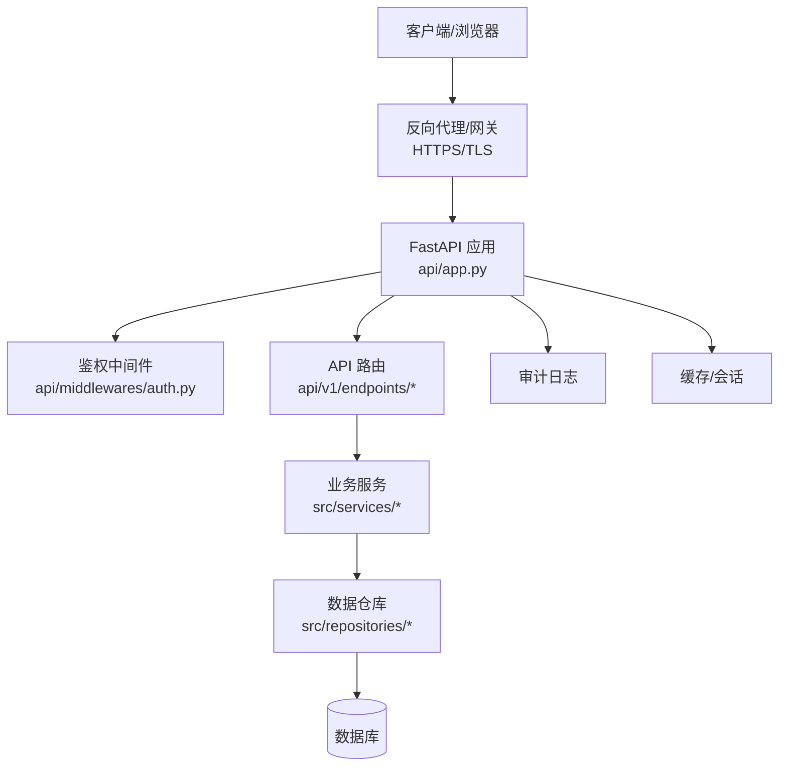
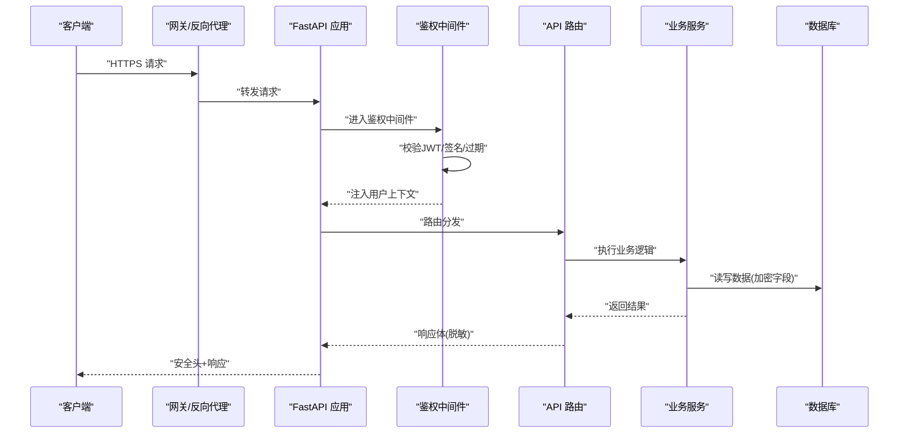
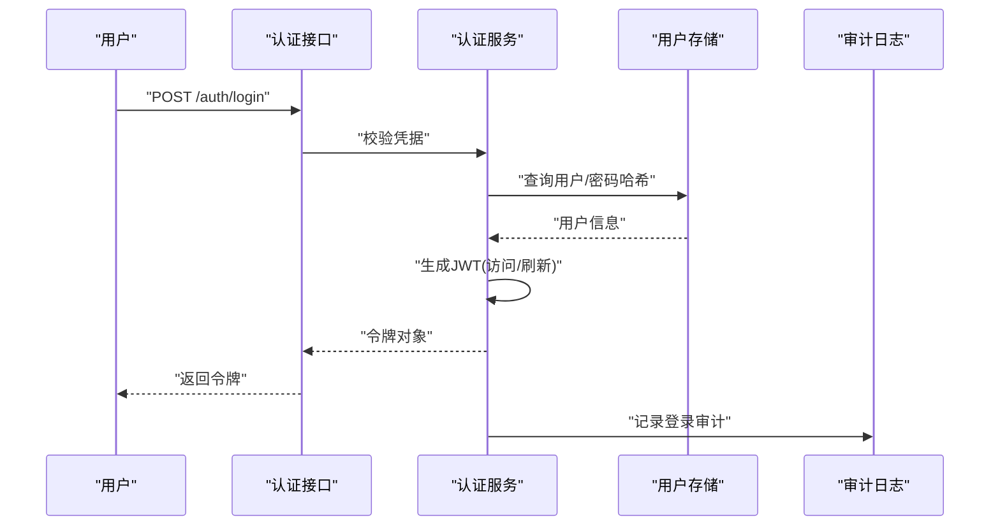
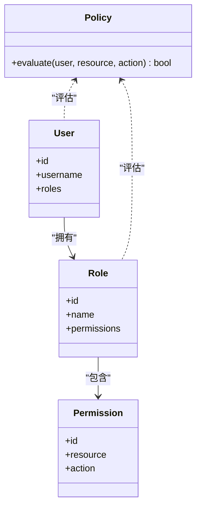
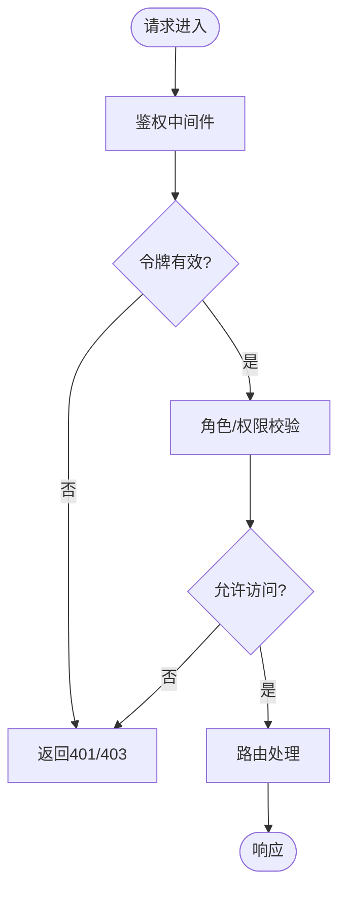
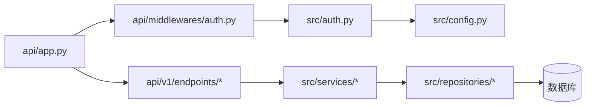

# 安全加固与权限控制

<cite>
**本文引用的文件**   
- [api/app.py](file://api/app.py)
- [api/middlewares/auth.py](file://api/middlewares/auth.py)
- [api/v1/endpoints/auth.py](file://api/v1/endpoints/auth.py)
- [src/auth.py](file://src/auth.py)
- [src/config.py](file://src/config.py)
- [server.py](file://server.py)
- [main.py](file://main.py)
- [docker/Dockerfile](file://docker/Dockerfile)
- [docker/docker-compose.yml](file://docker/docker-compose.yml)
- [tests/test_auth.py](file://tests/test_auth.py)
- [tests/test_api_error_helpers.py](file://tests/test_api_error_helpers.py)
- [tests/test_cwe345_xff_bypass.py](file://tests/test_cwe345_xff_bypass.py)
</cite>

## 目录
1. [简介](#简介)
2. [项目结构](#项目结构)
3. [核心组件](#核心组件)
4. [架构总览](#架构总览)
5. [详细组件分析](#详细组件分析)
6. [依赖关系分析](#依赖关系分析)
7. [性能考虑](#性能考虑)
8. [故障排查指南](#故障排查指南)
9. [结论](#结论)
10. [附录](#附录)

## 简介
本指南聚焦于项目的安全加固与权限控制，覆盖身份认证、API访问控制、数据加密（存储与传输）、JWT令牌配置、角色与权限管理、操作审计日志、安全头设置、输入验证与输出编码、常见漏洞防护、安全扫描工具集成与定期评估流程。目标是帮助开发者快速落地企业级安全实践，确保系统在部署与运行过程中具备可观测、可审计、可防御的能力。

## 项目结构
本项目采用前后端分离的架构：
- 后端 API 基于 Python/FastAPI，提供 RESTful 接口，包含鉴权中间件、路由与错误处理。
- 前端 Web 应用位于 apps/dsa-web，负责用户交互与状态管理。
- 容器化部署通过 Docker 编排，便于统一环境与安全基线。

图表来源
- [api/app.py](file://api/app.py)
- [api/middlewares/auth.py](file://api/middlewares/auth.py)
- [api/v1/endpoints/auth.py](file://api/v1/endpoints/auth.py)
- [src/auth.py](file://src/auth.py)
- [src/config.py](file://src/config.py)
- [server.py](file://server.py)
- [main.py](file://main.py)

章节来源
- [api/app.py](file://api/app.py)
- [server.py](file://server.py)
- [main.py](file://main.py)

## 核心组件
- 身份认证与授权
  - JWT 令牌签发与校验、过期策略、刷新机制。
  - 基于角色的访问控制（RBAC），按资源与动作进行细粒度授权。
- API 访问控制
  - 全局鉴权中间件、路由级权限装饰器、白名单与黑名单策略。
- 数据安全
  - 传输层 TLS/HTTPS、敏感字段加密存储、密钥管理与轮换。
- 审计与可观测性
  - 请求/响应脱敏、操作审计日志、异常与告警。
- 安全头与输入输出
  - CORS、CSP、HSTS、X-Frame-Options、Content-Type 校验、输入校验与输出编码。

章节来源
- [api/middlewares/auth.py](file://api/middlewares/auth.py)
- [api/v1/endpoints/auth.py](file://api/v1/endpoints/auth.py)
- [src/auth.py](file://src/auth.py)
- [src/config.py](file://src/config.py)

## 架构总览
下图展示从客户端到后端服务的完整调用链，以及鉴权、审计、数据存储的关键节点。

图表来源
- [api/app.py](file://api/app.py)
- [api/middlewares/auth.py](file://api/middlewares/auth.py)
- [api/v1/endpoints/auth.py](file://api/v1/endpoints/auth.py)
- [src/auth.py](file://src/auth.py)
- [src/config.py](file://src/config.py)
- [server.py](file://server.py)

## 详细组件分析

### 身份认证与 JWT 配置
- 登录流程
  - 客户端提交用户名/密码或第三方凭证。
  - 服务端校验凭据，生成短期访问令牌与长期刷新令牌。
  - 将令牌下发至客户端，后续请求携带 Authorization 头。
- 令牌校验
  - 中间件解析并验签，检查过期时间、吊销列表。
  - 失败则返回未授权或令牌无效。
- 最佳实践
  - 使用强随机密钥与算法（如 RS256/ES256）。
  - 短生命周期访问令牌 + 刷新令牌轮换。
  - 支持令牌撤销与黑名单。
  - 记录登录成功/失败审计事件。

图表来源
- [api/v1/endpoints/auth.py](file://api/v1/endpoints/auth.py)
- [src/auth.py](file://src/auth.py)

章节来源
- [api/v1/endpoints/auth.py](file://api/v1/endpoints/auth.py)
- [src/auth.py](file://src/auth.py)
- [tests/test_auth.py](file://tests/test_auth.py)

### 角色与权限管理（RBAC）
- 模型设计
  - 用户-角色-资源-动作的多对多关系。
  - 支持继承与组合，便于扩展。
- 授权策略
  - 路由级装饰器声明所需角色/动作。
  - 中间件在请求上下文中注入用户权限集。
  - 决策引擎根据策略判定允许/拒绝。
- 审计与追踪
  - 记录每次授权决策及原因，便于回溯与合规。

图表来源
- [src/auth.py](file://src/auth.py)
- [api/middlewares/auth.py](file://api/middlewares/auth.py)

章节来源
- [api/middlewares/auth.py](file://api/middlewares/auth.py)
- [src/auth.py](file://src/auth.py)

### API 访问控制与中间件
- 全局中间件
  - 统一鉴权、限流、CORS、安全头注入、请求脱敏。
- 路由级控制
  - 白名单路径跳过鉴权（如健康检查、公开文档）。
  - 黑名单路径直接拒绝（如调试接口）。
- 错误处理
  - 标准化错误码与消息，避免泄露内部细节。

图表来源
- [api/middlewares/auth.py](file://api/middlewares/auth.py)
- [api/app.py](file://api/app.py)

章节来源
- [api/middlewares/auth.py](file://api/middlewares/auth.py)
- [api/app.py](file://api/app.py)
- [tests/test_api_error_helpers.py](file://tests/test_api_error_helpers.py)

### 数据传输安全（TLS/HTTPS）
- 强制 HTTPS
  - 反向代理（Nginx/Caddy）终止 TLS，启用 HSTS。
  - 禁用弱协议与套件，仅保留现代加密算法。
- 证书管理
  - 自动化续期（Let’s Encrypt），最小权限原则。
- 内网通信
  - 服务间 mTLS 或隧道加密，避免明文传播。

章节来源
- [docker/Dockerfile](file://docker/Dockerfile)
- [docker/docker-compose.yml](file://docker/docker-compose.yml)
- [server.py](file://server.py)

### 数据存储安全（加密与密钥管理）
- 敏感字段加密
  - 数据库中的密码、密钥、个人身份信息采用 AES-GCM 等强算法。
- 密钥管理
  - 使用 KMS/环境变量/密钥管理服务，禁止硬编码。
  - 定期轮换与版本兼容解密。
- 备份与恢复
  - 备份数据加密，恢复流程受控且可审计。

章节来源
- [src/config.py](file://src/config.py)
- [src/auth.py](file://src/auth.py)

### 输入验证与输出编码
- 输入验证
  - 使用 Pydantic/JSON Schema 严格校验类型、长度、格式。
  - 白名单优先，拒绝未知字段。
- 输出编码
  - JSON 响应默认转义，HTML 输出需二次编码。
  - 防止 XSS、注入与命令执行。
- 示例策略
  - 限制请求体大小、速率限制、参数白名单。

章节来源
- [api/v1/endpoints/auth.py](file://api/v1/endpoints/auth.py)
- [api/app.py](file://api/app.py)

### 安全头与跨域控制
- 推荐安全头
  - Strict-Transport-Security、Content-Security-Policy、X-Content-Type-Options、X-Frame-Options、Referrer-Policy。
- CORS 策略
  - 精确允许的源、方法、头部；生产环境禁用通配符。
- X-Forwarded-For 防护
  - 信任上游代理，校验 IP 来源，防止伪造。

章节来源
- [api/app.py](file://api/app.py)
- [tests/test_cwe345_xff_bypass.py](file://tests/test_cwe345_xff_bypass.py)

### 操作审计日志
- 审计内容
  - 用户行为、鉴权决策、数据变更、异常事件。
- 脱敏与留存
  - 移除敏感字段，集中存储，不可篡改。
- 告警与检索
  - 关键事件实时告警，支持按用户/资源/时间检索。

章节来源
- [api/middlewares/auth.py](file://api/middlewares/auth.py)
- [src/auth.py](file://src/auth.py)

## 依赖关系分析
- 模块耦合
  - 鉴权中间件依赖认证服务与配置中心。
  - 路由依赖权限策略与业务服务。
- 外部依赖
  - 数据库、缓存、KMS、日志系统。
- 潜在风险
  - 循环依赖、配置泄露、第三方库漏洞。

图表来源
- [api/app.py](file://api/app.py)
- [api/middlewares/auth.py](file://api/middlewares/auth.py)
- [api/v1/endpoints/auth.py](file://api/v1/endpoints/auth.py)
- [src/auth.py](file://src/auth.py)
- [src/config.py](file://src/config.py)

章节来源
- [api/app.py](file://api/app.py)
- [api/middlewares/auth.py](file://api/middlewares/auth.py)
- [src/auth.py](file://src/auth.py)
- [src/config.py](file://src/config.py)

## 性能考虑
- 鉴权开销
  - 本地缓存令牌黑名单与用户权限，减少重复计算。
- 加密成本
  - 批量加密/解密，合理选择算法与密钥长度。
- I/O 优化
  - 异步处理、连接池、超时与重试策略。
- 监控与降级
  - 指标采集、熔断与降级方案，保障高可用。

## 故障排查指南
- 常见问题
  - 令牌失效、权限不足、CORS 报错、TLS 握手失败。
- 诊断步骤
  - 查看鉴权中间件日志、错误处理器输出、网关日志。
  - 检查配置项（密钥、域名、端口、证书）。
- 测试用例参考
  - 认证流程、错误响应、XFF 绕过防护。

章节来源
- [tests/test_auth.py](file://tests/test_auth.py)
- [tests/test_api_error_helpers.py](file://tests/test_api_error_helpers.py)
- [tests/test_cwe345_xff_bypass.py](file://tests/test_cwe345_xff_bypass.py)

## 结论
通过统一的鉴权中间件、严格的输入输出校验、完善的审计日志与安全的传输/存储策略，项目可在生产环境中实现较高的安全性与可观测性。建议结合安全扫描与定期评估，持续改进与加固。

## 附录

### 安全配置清单（建议）
- 身份认证
  - JWT 算法、密钥长度、过期时间、刷新策略、吊销机制。
- 访问控制
  - 角色定义、资源与动作映射、路由级权限声明。
- 数据安全
  - 加密算法、密钥管理、备份加密、恢复流程。
- 传输安全
  - TLS 版本、套件、HSTS、证书管理。
- 安全头
  - CSP、HSTS、X-Frame-Options、Referrer-Policy、CORS。
- 审计与监控
  - 审计字段、留存周期、告警规则、检索能力。
- 输入输出
  - 校验规则、脱敏策略、编码规范。
- 漏洞防护
  - 防注入、防 XSS、防 CSRF、防重放、限流与熔断。
- 安全扫描与评估
  - 静态扫描（SAST）、动态扫描（DAST）、依赖漏洞扫描、渗透测试。

### 安全扫描工具集成与定期评估流程
- 工具选型
  - SAST：代码静态分析（如 Bandit、Semgrep）。
  - DAST：运行时扫描（如 OWASP ZAP、Burp Suite）。
  - 依赖扫描：SCA（如 Dependabot、Trivy）。
- CI/CD 集成
  - 在流水线中嵌入扫描任务，阻断高危漏洞合并。
- 定期评估
  - 月度扫描、季度渗透测试、年度安全审计。
- 修复闭环
  - 工单跟踪、优先级排序、回归验证、发布门禁。