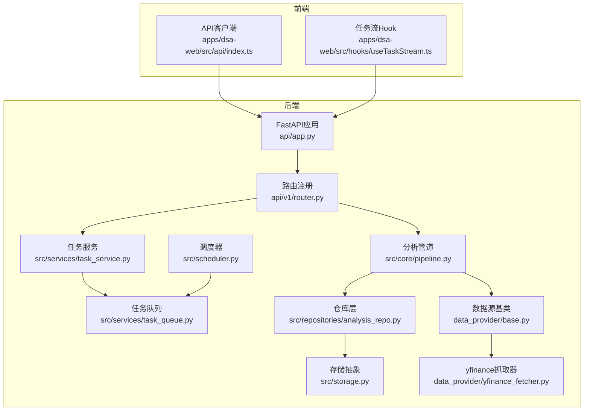
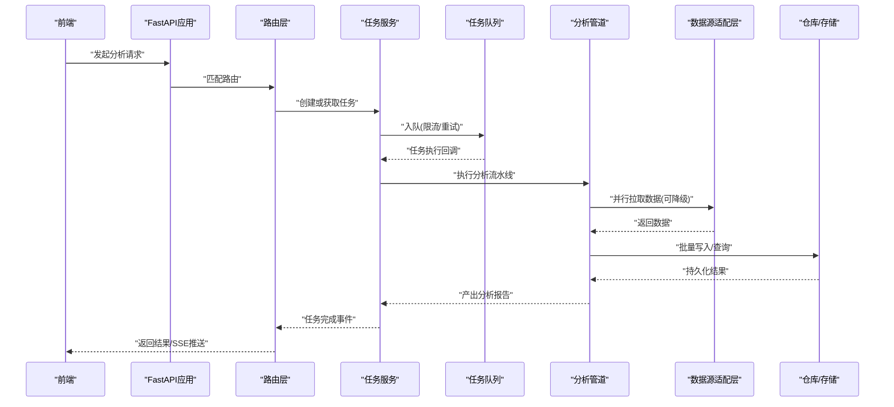
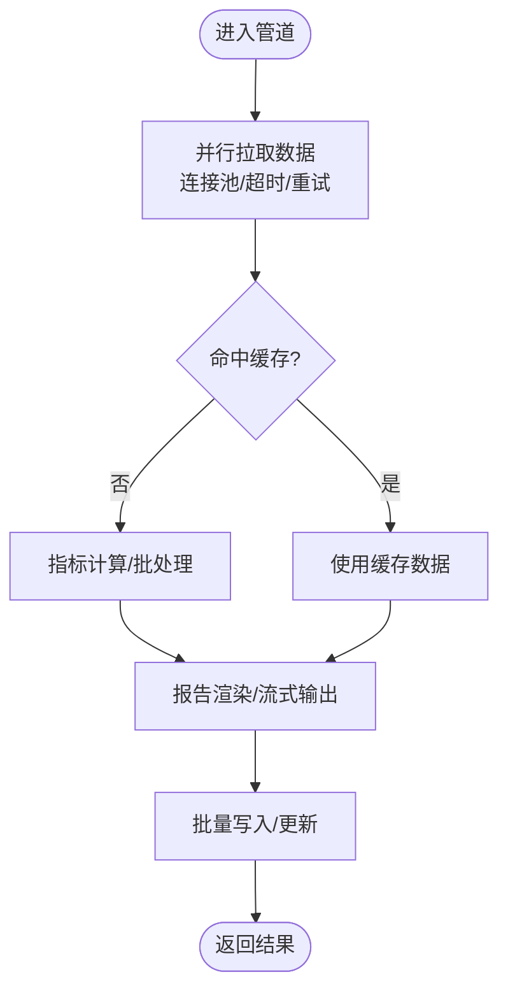
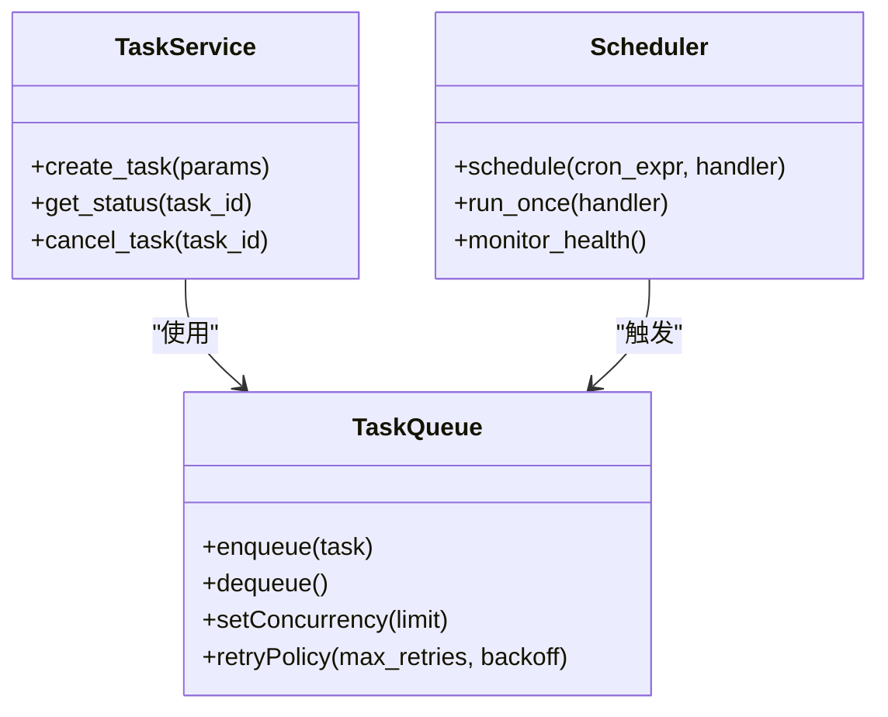
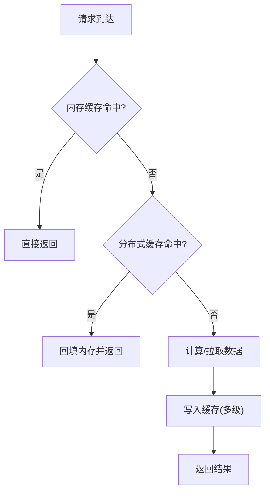
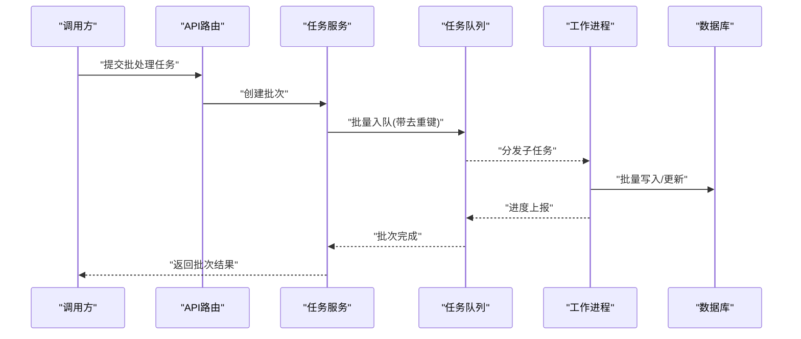
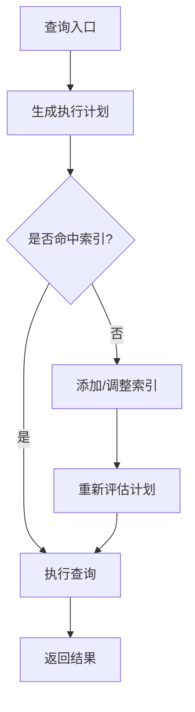
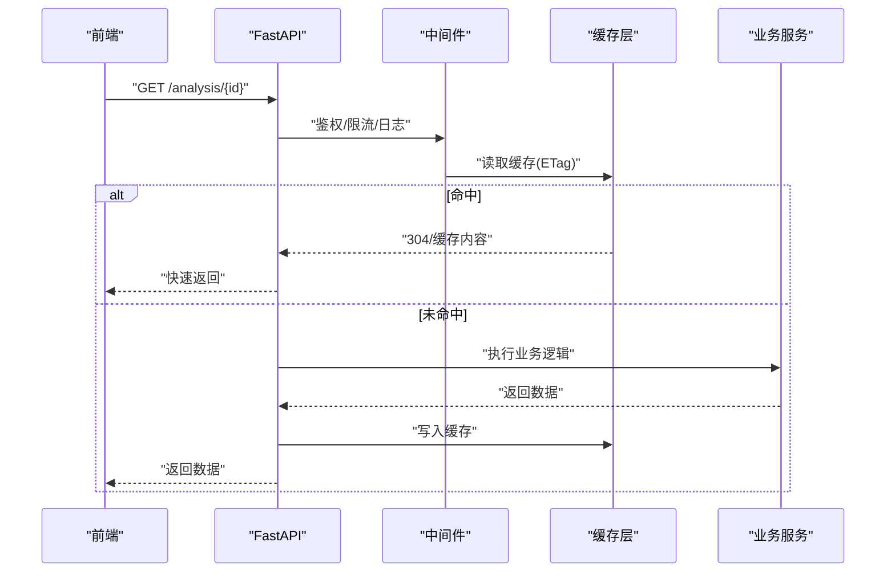
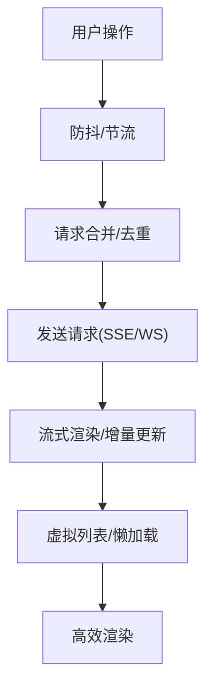
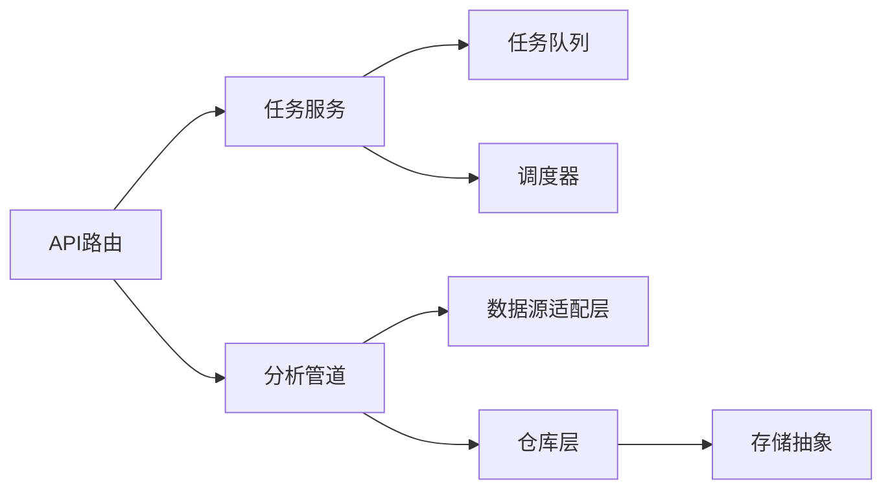

# 性能优化与调优

<cite>
**本文引用的文件**   
- [main.py](file://main.py)
- [server.py](file://server.py)
- [api/app.py](file://api/app.py)
- [api/v1/router.py](file://api/v1/router.py)
- [src/core/pipeline.py](file://src/core/pipeline.py)
- [src/services/task_queue.py](file://src/services/task_queue.py)
- [src/services/task_service.py](file://src/services/task_service.py)
- [src/scheduler.py](file://src/scheduler.py)
- [data_provider/base.py](file://data_provider/base.py)
- [data_provider/yfinance_fetcher.py](file://data_provider/yfinance_fetcher.py)
- [src/repositories/analysis_repo.py](file://src/repositories/analysis_repo.py)
- [src/storage.py](file://src/storage.py)
- [apps/dsa-web/src/api/index.ts](file://apps/dsa-web/src/api/index.ts)
- [apps/dsa-web/src/hooks/useTaskStream.ts](file://apps/dsa-web/src/hooks/useTaskStream.ts)
- [docker/Dockerfile](file://docker/Dockerfile)
- [docker/docker-compose.yml](file://docker/docker-compose.yml)
</cite>

## 目录
1. [简介](#简介)
2. [项目结构](#项目结构)
3. [核心组件](#核心组件)
4. [架构总览](#架构总览)
5. [详细组件分析](#详细组件分析)
6. [依赖关系分析](#依赖关系分析)
7. [性能考量](#性能考量)
8. [故障排查指南](#故障排查指南)
9. [结论](#结论)
10. [附录](#附录)

## 简介
本指南面向“股票分析系统”的性能优化与系统调优，覆盖以下关键主题：
- 分析管道优化（数据拉取、指标计算、报告生成）
- 并发处理配置（任务队列、调度器、异步I/O）
- 内存管理与缓存策略（对象复用、结果缓存、批处理）
- 任务队列与批处理优化（限流、重试、幂等）
- 数据库查询优化（索引、分页、批量写入）
- API响应时间优化（路由、中间件、序列化）
- 前端渲染性能提升（请求合并、懒加载、虚拟列表）
- 性能监控指标、瓶颈识别工具与基准测试方法

## 项目结构
系统采用前后端分离架构：
- 后端：FastAPI 应用、Agent 编排、数据源适配层、服务层、仓库层、调度与任务队列
- 前端：React + TypeScript 单页应用，提供可视化与分析交互
- 部署：Docker 容器化与 Compose 编排

**图表来源** 
- [api/app.py](file://api/app.py)
- [api/v1/router.py](file://api/v1/router.py)
- [src/core/pipeline.py](file://src/core/pipeline.py)
- [src/services/task_queue.py](file://src/services/task_queue.py)
- [src/services/task_service.py](file://src/services/task_service.py)
- [src/scheduler.py](file://src/scheduler.py)
- [data_provider/base.py](file://data_provider/base.py)
- [data_provider/yfinance_fetcher.py](file://data_provider/yfinance_fetcher.py)
- [src/repositories/analysis_repo.py](file://src/repositories/analysis_repo.py)
- [src/storage.py](file://src/storage.py)
- [apps/dsa-web/src/api/index.ts](file://apps/dsa-web/src/api/index.ts)
- [apps/dsa-web/src/hooks/useTaskStream.ts](file://apps/dsa-web/src/hooks/useTaskStream.ts)

**章节来源**
- [main.py](file://main.py)
- [server.py](file://server.py)
- [api/app.py](file://api/app.py)
- [api/v1/router.py](file://api/v1/router.py)

## 核心组件
- 分析管道：统一的数据拉取、指标计算、上下文构建与报告渲染流程，支持可插拔数据源与策略。
- 任务队列：异步任务编排、限流与重试，支撑长耗时分析与批量任务。
- 调度器：定时任务与周期性市场复盘、通知触发。
- 数据源适配层：多数据源抽象与实现，支持并行拉取与失败回退。
- 仓库与存储：统一的持久化接口，支持本地/远程存储与缓存。
- API层：FastAPI路由、中间件、错误处理与鉴权。
- 前端：API客户端封装、任务流Hook、页面组件与状态管理。

**章节来源**
- [src/core/pipeline.py](file://src/core/pipeline.py)
- [src/services/task_queue.py](file://src/services/task_queue.py)
- [src/services/task_service.py](file://src/services/task_service.py)
- [src/scheduler.py](file://src/scheduler.py)
- [data_provider/base.py](file://data_provider/base.py)
- [data_provider/yfinance_fetcher.py](file://data_provider/yfinance_fetcher.py)
- [src/repositories/analysis_repo.py](file://src/repositories/analysis_repo.py)
- [src/storage.py](file://src/storage.py)
- [api/app.py](file://api/app.py)
- [api/v1/router.py](file://api/v1/router.py)
- [apps/dsa-web/src/api/index.ts](file://apps/dsa-web/src/api/index.ts)
- [apps/dsa-web/src/hooks/useTaskStream.ts](file://apps/dsa-web/src/hooks/useTaskStream.ts)

## 架构总览
下图展示从前端请求到后端数据处理与返回的端到端流程，并标注关键性能节点。

**图表来源** 
- [api/app.py](file://api/app.py)
- [api/v1/router.py](file://api/v1/router.py)
- [src/services/task_service.py](file://src/services/task_service.py)
- [src/services/task_queue.py](file://src/services/task_queue.py)
- [src/core/pipeline.py](file://src/core/pipeline.py)
- [data_provider/base.py](file://data_provider/base.py)
- [src/repositories/analysis_repo.py](file://src/repositories/analysis_repo.py)
- [src/storage.py](file://src/storage.py)

## 详细组件分析

### 分析管道优化
- 目标：减少端到端延迟，提高吞吐，降低资源占用。
- 关键点：
  - 数据拉取阶段：并行请求、连接池、超时与重试、失败回退。
  - 指标计算：向量化/批处理、惰性计算、增量更新。
  - 报告渲染：模板预编译、流式输出、按需字段裁剪。
  - 缓存：热点数据缓存（内存/Redis）、ETag/Last-Modified。

**图表来源** 
- [src/core/pipeline.py](file://src/core/pipeline.py)
- [data_provider/base.py](file://data_provider/base.py)
- [data_provider/yfinance_fetcher.py](file://data_provider/yfinance_fetcher.py)
- [src/repositories/analysis_repo.py](file://src/repositories/analysis_repo.py)
- [src/storage.py](file://src/storage.py)

**章节来源**
- [src/core/pipeline.py](file://src/core/pipeline.py)
- [data_provider/base.py](file://data_provider/base.py)
- [data_provider/yfinance_fetcher.py](file://data_provider/yfinance_fetcher.py)
- [src/repositories/analysis_repo.py](file://src/repositories/analysis_repo.py)
- [src/storage.py](file://src/storage.py)

### 并发处理配置
- 任务队列：
  - 限制并发度、设置最大重试次数、指数退避。
  - 任务优先级与分片，避免热点阻塞。
- 调度器：
  - 周期任务去重、滑动窗口、失败告警。
- I/O并发：
  - HTTP连接池、异步客户端、读写分离。

**图表来源** 
- [src/services/task_queue.py](file://src/services/task_queue.py)
- [src/services/task_service.py](file://src/services/task_service.py)
- [src/scheduler.py](file://src/scheduler.py)

**章节来源**
- [src/services/task_queue.py](file://src/services/task_queue.py)
- [src/services/task_service.py](file://src/services/task_service.py)
- [src/scheduler.py](file://src/scheduler.py)

### 内存管理与缓存策略
- 内存管理：
  - 大对象池化与引用计数，及时释放临时变量。
  - 流式处理大数据集，避免一次性加载。
- 缓存策略：
  - 多级缓存（进程内→分布式→持久化）。
  - 缓存键设计（含版本号/参数哈希），失效与预热。
  - 写穿/旁路缓存一致性策略。

[无图表来源，因为该图为概念性流程图]

**章节来源**
- [src/storage.py](file://src/storage.py)
- [src/repositories/analysis_repo.py](file://src/repositories/analysis_repo.py)

### 任务队列与批处理优化
- 任务拆分：将大任务拆分为子任务，聚合结果。
- 批处理：合并多次写入，减少IO开销。
- 限流与背压：保护下游服务，避免雪崩。
- 幂等与去重：基于任务ID与业务键去重。

**图表来源** 
- [src/services/task_service.py](file://src/services/task_service.py)
- [src/services/task_queue.py](file://src/services/task_queue.py)
- [src/repositories/analysis_repo.py](file://src/repositories/analysis_repo.py)

**章节来源**
- [src/services/task_service.py](file://src/services/task_service.py)
- [src/services/task_queue.py](file://src/services/task_queue.py)
- [src/repositories/analysis_repo.py](file://src/repositories/analysis_repo.py)

### 数据库查询优化
- 索引策略：复合索引、覆盖索引、选择性高的列优先。
- 查询优化：避免N+1、使用JOIN替代循环查询、分页游标。
- 写入优化：批量插入、事务合并、异步落盘。
- 监控：慢查询日志、执行计划分析。

[无图表来源，因为该图为概念性流程图]

**章节来源**
- [src/repositories/analysis_repo.py](file://src/repositories/analysis_repo.py)
- [src/storage.py](file://src/storage.py)

### API响应时间优化
- 路由与中间件：最小化中间件链、短路逻辑、缓存头。
- 序列化：按需字段、延迟序列化、压缩响应。
- 缓存：HTTP缓存（ETag/Cache-Control）、服务端缓存。
- 错误处理：快速失败、降级返回。

**图表来源** 
- [api/app.py](file://api/app.py)
- [api/v1/router.py](file://api/v1/router.py)
- [src/storage.py](file://src/storage.py)

**章节来源**
- [api/app.py](file://api/app.py)
- [api/v1/router.py](file://api/v1/router.py)

### 前端渲染性能提升
- 请求优化：合并请求、防抖/节流、取消重复请求。
- 渲染优化：虚拟列表、懒加载、组件级代码分割。
- 状态管理：局部状态、不可变更新、避免重渲染。
- SSE/WebSocket：实时任务流与增量更新。

**图表来源** 
- [apps/dsa-web/src/api/index.ts](file://apps/dsa-web/src/api/index.ts)
- [apps/dsa-web/src/hooks/useTaskStream.ts](file://apps/dsa-web/src/hooks/useTaskStream.ts)

**章节来源**
- [apps/dsa-web/src/api/index.ts](file://apps/dsa-web/src/api/index.ts)
- [apps/dsa-web/src/hooks/useTaskStream.ts](file://apps/dsa-web/src/hooks/useTaskStream.ts)

## 依赖关系分析
- 模块耦合：
  - API路由依赖任务服务与分析管道。
  - 分析管道依赖数据源适配层与仓库层。
  - 任务服务依赖任务队列与调度器。
- 外部依赖：
  - HTTP客户端、数据库驱动、消息队列、缓存服务。
- 潜在环路：
  - 确保服务间单向依赖，避免循环导入。

**图表来源** 
- [api/v1/router.py](file://api/v1/router.py)
- [src/services/task_service.py](file://src/services/task_service.py)
- [src/core/pipeline.py](file://src/core/pipeline.py)
- [src/services/task_queue.py](file://src/services/task_queue.py)
- [src/scheduler.py](file://src/scheduler.py)
- [data_provider/base.py](file://data_provider/base.py)
- [src/repositories/analysis_repo.py](file://src/repositories/analysis_repo.py)
- [src/storage.py](file://src/storage.py)

**章节来源**
- [api/v1/router.py](file://api/v1/router.py)
- [src/services/task_service.py](file://src/services/task_service.py)
- [src/core/pipeline.py](file://src/core/pipeline.py)
- [src/services/task_queue.py](file://src/services/task_queue.py)
- [src/scheduler.py](file://src/scheduler.py)
- [data_provider/base.py](file://data_provider/base.py)
- [src/repositories/analysis_repo.py](file://src/repositories/analysis_repo.py)
- [src/storage.py](file://src/storage.py)

## 性能考量
- 分析管道：
  - 并行拉取与失败回退，热点数据缓存，批处理计算。
- 并发处理：
  - 合理设置队列并发度与重试策略，避免过载。
- 内存管理：
  - 流式处理、对象池、及时释放。
- 缓存策略：
  - 多级缓存、一致性、预热与失效。
- 数据库：
  - 索引、执行计划、慢查询优化。
- API：
  - 中间件精简、序列化优化、压缩与缓存。
- 前端：
  - 请求合并、虚拟列表、懒加载、SSE流式渲染。

[本节为通用指导，不直接分析具体文件]

## 故障排查指南
- 监控指标：
  - 请求延迟（P50/P95/P99）、吞吐量、错误率、队列长度、CPU/内存/GC。
- 瓶颈识别：
  - 链路追踪、火焰图、慢查询日志、GC日志。
- 基准测试：
  - 负载测试（并发/渐进）、回归测试、容量规划。
- 常见故障：
  - 数据源超时、队列积压、缓存穿透、数据库锁竞争。

[本节为通用指导，不直接分析具体文件]

## 结论
通过优化分析管道、合理配置并发与缓存、精细化数据库与API设计、以及前端渲染优化，可以显著提升系统的响应速度与吞吐能力。建议结合监控与基准测试持续迭代，定位瓶颈并实施针对性改进。

[本节为总结，不直接分析具体文件]

## 附录
- 部署与环境：
  - Docker镜像构建与Compose编排，环境变量与资源限制。
- 参考文件：
  - [docker/Dockerfile](file://docker/Dockerfile)
  - [docker/docker-compose.yml](file://docker/docker-compose.yml)

[本节为补充信息，不直接分析具体文件]