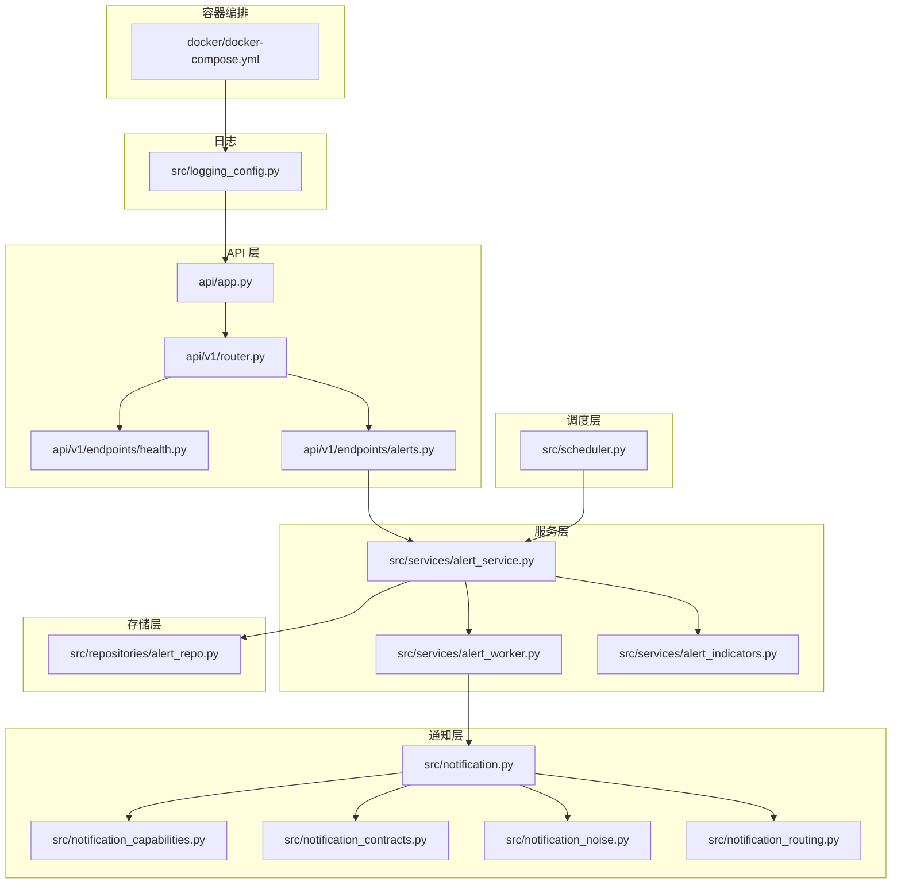
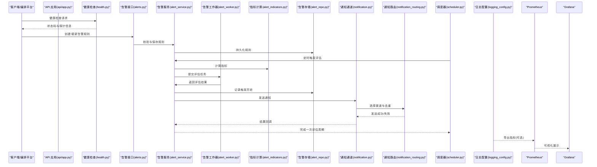
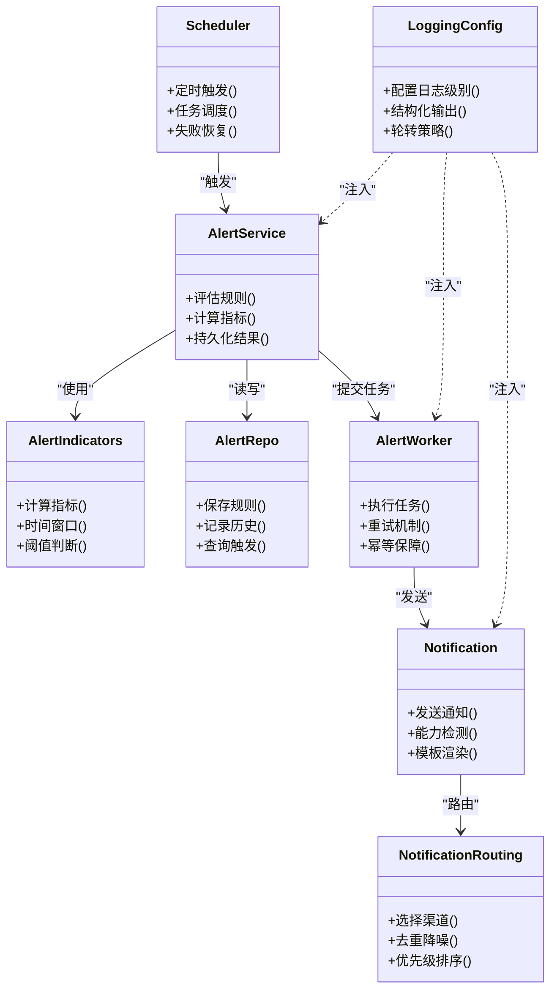

# 监控告警与日志分析

<cite>
**本文引用的文件**   
- [main.py](file://main.py)
- [server.py](file://server.py)
- [api/app.py](file://api/app.py)
- [api/v1/router.py](file://api/v1/router.py)
- [api/v1/endpoints/alerts.py](file://api/v1/endpoints/alerts.py)
- [api/v1/endpoints/health.py](file://api/v1/endpoints/health.py)
- [src/logging_config.py](file://src/logging_config.py)
- [src/notification.py](file://src/notification.py)
- [src/notification_capabilities.py](file://src/notification_capabilities.py)
- [src/notification_contracts.py](file://src/notification_contracts.py)
- [src/notification_noise.py](file://src/notification_noise.py)
- [src/notification_routing.py](file://src/notification_routing.py)
- [src/services/alert_service.py](file://src/services/alert_service.py)
- [src/services/alert_worker.py](file://src/services/alert_worker.py)
- [src/services/alert_indicators.py](file://src/services/alert_indicators.py)
- [src/repositories/alert_repo.py](file://src/repositories/alert_repo.py)
- [src/scheduler.py](file://src/scheduler.py)
- [docker/docker-compose.yml](file://docker/docker-compose.yml)
- [docs/alerts.md](file://docs/alerts.md)
- [docs/notifications.md](file://docs/notifications.md)
</cite>

## 目录
1. [简介](#简介)
2. [项目结构](#项目结构)
3. [核心组件](#核心组件)
4. [架构总览](#架构总览)
5. [详细组件分析](#详细组件分析)
6. [依赖关系分析](#依赖关系分析)
7. [性能考虑](#性能考虑)
8. [故障排查指南](#故障排查指南)
9. [结论](#结论)
10. [附录](#附录)

## 简介
本指南面向希望在本项目中建立“监控告警与日志分析”能力的工程师与运维人员。内容覆盖：
- 系统指标收集与应用性能监控（APM）
- 错误追踪与告警规则配置
- 集成 Prometheus、Grafana 等工具
- 自定义告警规则与通知渠道配置
- 日志聚合、结构化日志格式与日志轮转
- 故障排查流程、性能分析与容量规划建议

本项目已内置告警服务、通知路由与调度能力，并提供了健康检查端点与文档说明。通过本文档，你可以快速搭建从指标采集到告警触达的完整闭环，并结合日志体系进行问题定位与容量规划。

## 项目结构
围绕监控告警与日志分析的关键代码与配置分布如下：
- API 层：提供健康检查与告警相关接口
- 服务层：告警计算、工作器、指标定义
- 存储层：告警记录持久化
- 通知层：多渠道通知发送与路由策略
- 调度层：定时任务触发告警评估
- 日志配置：结构化日志与输出目标
- 容器编排：Prometheus/Grafana 集成示例
- 文档：告警与通知使用说明

图表来源
- [api/app.py](file://api/app.py)
- [api/v1/router.py](file://api/v1/router.py)
- [api/v1/endpoints/health.py](file://api/v1/endpoints/health.py)
- [api/v1/endpoints/alerts.py](file://api/v1/endpoints/alerts.py)
- [src/services/alert_service.py](file://src/services/alert_service.py)
- [src/services/alert_worker.py](file://src/services/alert_worker.py)
- [src/services/alert_indicators.py](file://src/services/alert_indicators.py)
- [src/repositories/alert_repo.py](file://src/repositories/alert_repo.py)
- [src/notification.py](file://src/notification.py)
- [src/notification_capabilities.py](file://src/notification_capabilities.py)
- [src/notification_contracts.py](file://src/notification_contracts.py)
- [src/notification_noise.py](file://src/notification_noise.py)
- [src/notification_routing.py](file://src/notification_routing.py)
- [src/scheduler.py](file://src/scheduler.py)
- [src/logging_config.py](file://src/logging_config.py)
- [docker/docker-compose.yml](file://docker/docker-compose.yml)

章节来源
- [api/app.py](file://api/app.py)
- [api/v1/router.py](file://api/v1/router.py)
- [api/v1/endpoints/health.py](file://api/v1/endpoints/health.py)
- [api/v1/endpoints/alerts.py](file://api/v1/endpoints/alerts.py)
- [src/services/alert_service.py](file://src/services/alert_service.py)
- [src/services/alert_worker.py](file://src/services/alert_worker.py)
- [src/services/alert_indicators.py](file://src/services/alert_indicators.py)
- [src/repositories/alert_repo.py](file://src/repositories/alert_repo.py)
- [src/notification.py](file://src/notification.py)
- [src/notification_capabilities.py](file://src/notification_capabilities.py)
- [src/notification_contracts.py](file://src/notification_contracts.py)
- [src/notification_noise.py](file://src/notification_noise.py)
- [src/notification_routing.py](file://src/notification_routing.py)
- [src/scheduler.py](file://src/scheduler.py)
- [src/logging_config.py](file://src/logging_config.py)
- [docker/docker-compose.yml](file://docker/docker-compose.yml)

## 核心组件
- 健康检查端点：用于存活与就绪探针，便于 Kubernetes/编排平台探测服务状态
- 告警服务：负责指标计算、阈值判断、触发条件评估与结果持久化
- 告警工作器：异步执行告警评估与通知发送，避免阻塞主请求路径
- 指标定义：封装常用业务与系统指标的计算逻辑
- 通知通道：统一抽象多种通知渠道（邮件、Webhook、IM 等），支持能力检测与路由
- 调度器：定时触发告警评估任务，保证周期性监控
- 日志配置：结构化日志输出、分级与轮转策略

章节来源
- [api/v1/endpoints/health.py](file://api/v1/endpoints/health.py)
- [src/services/alert_service.py](file://src/services/alert_service.py)
- [src/services/alert_worker.py](file://src/services/alert_worker.py)
- [src/services/alert_indicators.py](file://src/services/alert_indicators.py)
- [src/notification.py](file://src/notification.py)
- [src/notification_capabilities.py](file://src/notification_capabilities.py)
- [src/notification_contracts.py](file://src/notification_contracts.py)
- [src/notification_noise.py](file://src/notification_noise.py)
- [src/notification_routing.py](file://src/notification_routing.py)
- [src/scheduler.py](file://src/scheduler.py)
- [src/logging_config.py](file://src/logging_config.py)

## 架构总览
下图展示了从指标采集到告警触达的整体流程，以及日志与外部监控系统的集成点。

图表来源
- [api/app.py](file://api/app.py)
- [api/v1/endpoints/health.py](file://api/v1/endpoints/health.py)
- [api/v1/endpoints/alerts.py](file://api/v1/endpoints/alerts.py)
- [src/services/alert_service.py](file://src/services/alert_service.py)
- [src/services/alert_worker.py](file://src/services/alert_worker.py)
- [src/services/alert_indicators.py](file://src/services/alert_indicators.py)
- [src/repositories/alert_repo.py](file://src/repositories/alert_repo.py)
- [src/notification.py](file://src/notification.py)
- [src/notification_routing.py](file://src/notification_routing.py)
- [src/scheduler.py](file://src/scheduler.py)
- [src/logging_config.py](file://src/logging_config.py)

## 详细组件分析

### 健康检查与健康探针
- 功能：暴露健康检查端点，返回服务存活与就绪状态，供编排平台或负载均衡器使用
- 关键点：区分存活探针（liveness）与就绪探针（readiness），确保滚动升级与流量切换安全
- 集成建议：在容器编排中配置探针路径与超时参数；结合日志级别输出关键状态变化

章节来源
- [api/v1/endpoints/health.py](file://api/v1/endpoints/health.py)

### 告警接口与规则管理
- 功能：提供创建、更新、查询告警规则的 API，支撑前端或自动化脚本管理告警策略
- 关键点：规则校验、版本控制、幂等性设计；与存储层解耦，便于扩展不同后端
- 集成建议：为规则变更增加审计日志；对高频操作实施限流与缓存

章节来源
- [api/v1/endpoints/alerts.py](file://api/v1/endpoints/alerts.py)
- [src/repositories/alert_repo.py](file://src/repositories/alert_repo.py)

### 告警服务与指标计算
- 功能：根据规则计算指标、评估触发条件、生成告警事件并持久化
- 关键点：指标计算的可组合性与可测试性；阈值与时间窗口的灵活配置；并发安全
- 集成建议：将指标计算抽象为独立模块，便于接入外部数据源与缓存

章节来源
- [src/services/alert_service.py](file://src/services/alert_service.py)
- [src/services/alert_indicators.py](file://src/services/alert_indicators.py)

### 告警工作器与异步处理
- 功能：异步执行告警评估与通知发送，避免阻塞主线程；支持重试与退避
- 关键点：任务队列设计与背压处理；失败重试与死信队列；幂等性保障
- 集成建议：与工作队列（如 Redis/RabbitMQ）集成，提升可扩展性

章节来源
- [src/services/alert_worker.py](file://src/services/alert_worker.py)

### 通知通道与路由策略
- 功能：统一抽象多种通知渠道，支持能力检测、消息模板、去重与路由
- 关键点：渠道能力矩阵、降级策略、噪声抑制；路由规则与优先级
- 集成建议：为每个渠道实现能力检测与连接测试；提供通知诊断工具

章节来源
- [src/notification.py](file://src/notification.py)
- [src/notification_capabilities.py](file://src/notification_capabilities.py)
- [src/notification_contracts.py](file://src/notification_contracts.py)
- [src/notification_noise.py](file://src/notification_noise.py)
- [src/notification_routing.py](file://src/notification_routing.py)

### 调度器与定时任务
- 功能：按周期触发告警评估任务，确保监控连续性
- 关键点：调度精度、任务隔离、失败恢复；与系统负载的动态调整
- 集成建议：结合外部调度系统（如 Celery/Airflow）进行复杂编排

章节来源
- [src/scheduler.py](file://src/scheduler.py)

### 日志配置与结构化输出
- 功能：配置日志级别、输出目标、格式化与轮转策略
- 关键点：结构化字段（trace_id、span_id、业务键）；敏感信息脱敏；集中式收集
- 集成建议：对接 ELK/Loki 等日志平台；启用采样与采样率动态调整

章节来源
- [src/logging_config.py](file://src/logging_config.py)

### 容器编排与监控集成
- 功能：通过 docker-compose 启动 Prometheus、Grafana 等组件，并与应用集成
- 关键点：指标暴露端点、抓取间隔、保留策略；仪表盘模板与告警规则
- 集成建议：使用环境变量管理配置；为不同环境准备独立实例

章节来源
- [docker/docker-compose.yml](file://docker/docker-compose.yml)

## 依赖关系分析
- API 层依赖服务层，服务层依赖存储层与通知层
- 调度器驱动服务层周期性执行
- 日志配置贯穿各层，提供统一的观测能力
- 容器编排整合外部监控系统，形成端到端闭环

图表来源
- [src/services/alert_service.py](file://src/services/alert_service.py)
- [src/services/alert_worker.py](file://src/services/alert_worker.py)
- [src/services/alert_indicators.py](file://src/services/alert_indicators.py)
- [src/repositories/alert_repo.py](file://src/repositories/alert_repo.py)
- [src/notification.py](file://src/notification.py)
- [src/notification_routing.py](file://src/notification_routing.py)
- [src/scheduler.py](file://src/scheduler.py)
- [src/logging_config.py](file://src/logging_config.py)

章节来源
- [src/services/alert_service.py](file://src/services/alert_service.py)
- [src/services/alert_worker.py](file://src/services/alert_worker.py)
- [src/services/alert_indicators.py](file://src/services/alert_indicators.py)
- [src/repositories/alert_repo.py](file://src/repositories/alert_repo.py)
- [src/notification.py](file://src/notification.py)
- [src/notification_routing.py](file://src/notification_routing.py)
- [src/scheduler.py](file://src/scheduler.py)
- [src/logging_config.py](file://src/logging_config.py)

## 性能考虑
- 指标计算优化：缓存热点数据、批量计算、增量更新
- 异步处理：使用工作队列削峰填谷，避免阻塞主线程
- 日志采样：在高吞吐场景下启用采样，降低 IO 压力
- 存储分层：热数据内存/Redis，冷数据对象存储/数据库归档
- 资源隔离：告警评估与通知发送分离，防止级联故障
- 容量规划：基于 QPS、延迟与资源利用率设定扩缩容阈值

[本节为通用指导，不直接分析具体文件]

## 故障排查指南
- 健康检查失败：检查探针配置与服务依赖；查看日志中的初始化与依赖加载信息
- 告警未触发：验证规则有效性、指标数据新鲜度、调度器运行状态；查看工作器任务队列
- 通知失败：检查渠道能力与凭据；查看路由规则与去重策略；使用通知诊断工具
- 日志缺失：确认日志级别与输出目标；检查轮转与权限；验证集中式收集链路
- 性能瓶颈：分析指标计算耗时、IO 等待与 GC 行为；优化缓存与并发策略

章节来源
- [api/v1/endpoints/health.py](file://api/v1/endpoints/health.py)
- [src/services/alert_service.py](file://src/services/alert_service.py)
- [src/services/alert_worker.py](file://src/services/alert_worker.py)
- [src/notification.py](file://src/notification.py)
- [src/notification_routing.py](file://src/notification_routing.py)
- [src/logging_config.py](file://src/logging_config.py)

## 结论
通过本项目内置的告警服务、通知路由与调度能力，结合结构化日志与外部监控系统（Prometheus/Grafana），可以构建高可用、可扩展的监控告警与日志分析体系。建议在生产环境中逐步完善指标采集、告警规则与通知渠道，配合日志聚合与容量规划，持续提升系统稳定性与可观测性。

[本节为总结性内容，不直接分析具体文件]

## 附录
- 告警与通知使用说明：参考文档获取最佳实践与配置示例
- 容器编排：参考 docker-compose 配置快速搭建监控栈

章节来源
- [docs/alerts.md](file://docs/alerts.md)
- [docs/notifications.md](file://docs/notifications.md)
- [docker/docker-compose.yml](file://docker/docker-compose.yml)