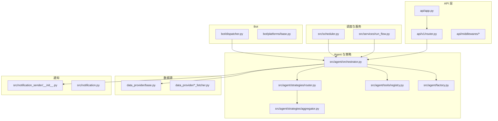
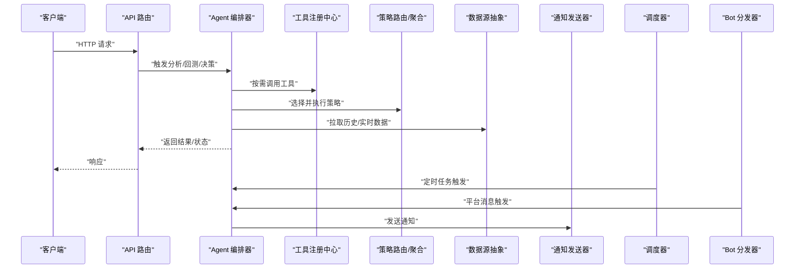
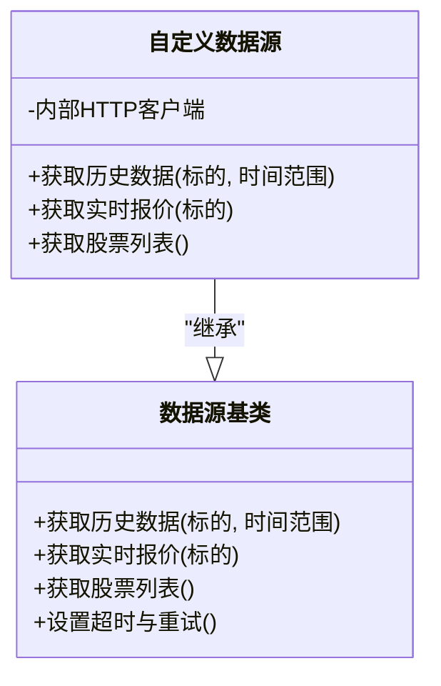
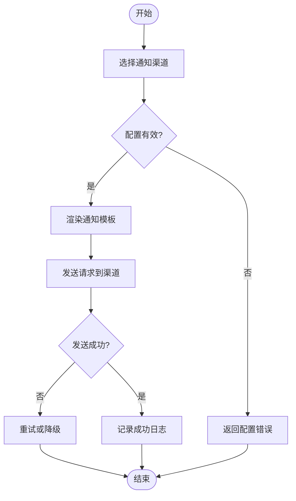
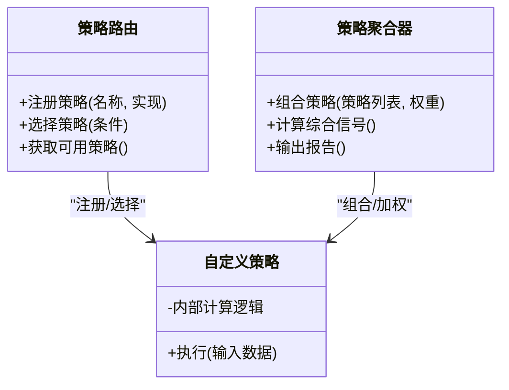
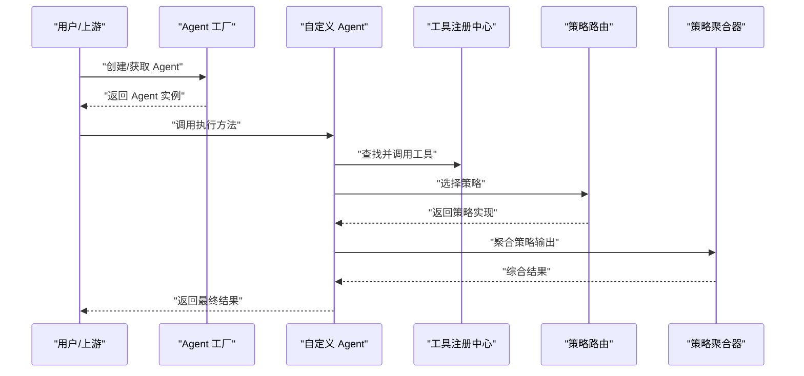
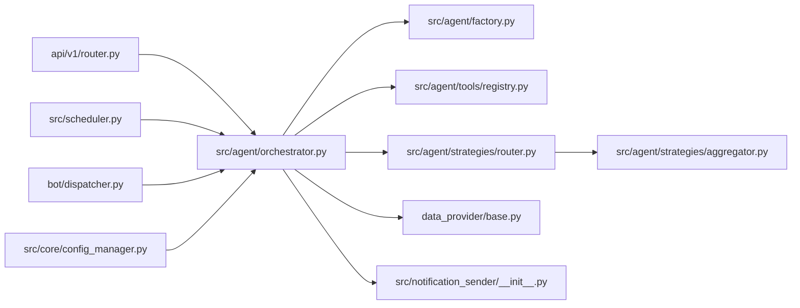

# 自定义集成与扩展

<cite>
**本文档引用的文件**   
- [main.py](file://main.py)
- [server.py](file://server.py)
- [api/app.py](file://api/app.py)
- [api/v1/router.py](file://api/v1/router.py)
- [src/agent/orchestrator.py](file://src/agent/orchestrator.py)
- [src/agent/factory.py](file://src/agent/factory.py)
- [src/agent/tools/registry.py](file://src/agent/tools/registry.py)
- [src/agent/strategies/router.py](file://src/agent/strategies/router.py)
- [src/agent/strategies/aggregator.py](file://src/agent/strategies/aggregator.py)
- [src/core/config_manager.py](file://src/core/config_manager.py)
- [src/core/config_registry.py](file://src/core/config_registry.py)
- [data_provider/base.py](file://data_provider/base.py)
- [src/notification_sender/__init__.py](file://src/notification_sender/__init__.py)
- [src/notification.py](file://src/notification.py)
- [src/services/run_flow.py](file://src/services/run_flow.py)
- [src/scheduler.py](file://src/scheduler.py)
- [bot/dispatcher.py](file://bot/dispatcher.py)
- [bot/platforms/base.py](file://bot/platforms/base.py)
- [scripts/generate_notification_actions_env_table.py](file://scripts/generate_notification_actions_env_table.py)
</cite>

## 目录
1. [简介](#简介)
2. [项目结构](#项目结构)
3. [核心组件](#核心组件)
4. [架构总览](#架构总览)
5. [详细组件分析](#详细组件分析)
6. [依赖关系分析](#依赖关系分析)
7. [性能考虑](#性能考虑)
8. [故障排查指南](#故障排查指南)
9. [结论](#结论)
10. [附录](#附录)

## 简介
本指南面向希望为系统添加自定义数据源、第三方服务集成、通知渠道扩展以及交易策略的开发者。内容涵盖：
- 如何编写自定义 Agent、Tool 和 Strategy 插件
- API 扩展点、事件钩子与中间件开发示例
- 插件注册机制、依赖管理与版本兼容性处理
- 典型集成流程与最佳实践

## 项目结构
系统采用分层与模块化组织，关键目录职责如下：
- api: HTTP API 层，包含路由、中间件、请求/响应模型
- src/agent: Agent 编排、工具注册、策略路由与聚合
- data_provider: 数据源接入抽象与各实现
- src/notification_sender: 通知渠道发送器集合
- bot: 机器人平台适配与命令分发
- scripts: 辅助脚本（如配置生成）

图表来源
- [api/app.py](file://api/app.py)
- [api/v1/router.py](file://api/v1/router.py)
- [src/agent/orchestrator.py](file://src/agent/orchestrator.py)
- [src/agent/factory.py](file://src/agent/factory.py)
- [src/agent/tools/registry.py](file://src/agent/tools/registry.py)
- [src/agent/strategies/router.py](file://src/agent/strategies/router.py)
- [src/agent/strategies/aggregator.py](file://src/agent/strategies/aggregator.py)
- [data_provider/base.py](file://data_provider/base.py)
- [src/notification_sender/__init__.py](file://src/notification_sender/__init__.py)
- [src/scheduler.py](file://src/scheduler.py)
- [src/services/run_flow.py](file://src/services/run_flow.py)
- [bot/dispatcher.py](file://bot/dispatcher.py)
- [bot/platforms/base.py](file://bot/platforms/base.py)

章节来源
- [main.py](file://main.py)
- [server.py](file://server.py)
- [api/app.py](file://api/app.py)
- [api/v1/router.py](file://api/v1/router.py)

## 核心组件
- 数据源接入抽象：统一接口定义，便于新增任意市场或数据提供商
- Agent 编排器：协调多 Agent、工具与策略执行，管理上下文与生命周期
- 工具注册中心：声明式注册 Tool，支持参数校验与动态发现
- 策略路由与聚合：按规则选择并组合多个策略输出
- 通知发送器：多渠道通知的统一入口与路由
- 配置管理：集中化配置加载、校验与热更新
- 调度器：定时任务与事件驱动的执行编排
- Bot 分发器：跨平台消息解析与命令路由

章节来源
- [data_provider/base.py](file://data_provider/base.py)
- [src/agent/orchestrator.py](file://src/agent/orchestrator.py)
- [src/agent/tools/registry.py](file://src/agent/tools/registry.py)
- [src/agent/strategies/router.py](file://src/agent/strategies/router.py)
- [src/agent/strategies/aggregator.py](file://src/agent/strategies/aggregator.py)
- [src/notification_sender/__init__.py](file://src/notification_sender/__init__.py)
- [src/core/config_manager.py](file://src/core/config_manager.py)
- [src/scheduler.py](file://src/scheduler.py)
- [bot/dispatcher.py](file://bot/dispatcher.py)

## 架构总览
下图展示从 API 到 Agent、数据源、策略与通知的整体调用链，以及调度与 Bot 的集成点。

图表来源
- [api/v1/router.py](file://api/v1/router.py)
- [src/agent/orchestrator.py](file://src/agent/orchestrator.py)
- [src/agent/tools/registry.py](file://src/agent/tools/registry.py)
- [src/agent/strategies/router.py](file://src/agent/strategies/router.py)
- [data_provider/base.py](file://data_provider/base.py)
- [src/notification_sender/__init__.py](file://src/notification_sender/__init__.py)
- [src/scheduler.py](file://src/scheduler.py)
- [bot/dispatcher.py](file://bot/dispatcher.py)

## 详细组件分析

### 自定义数据源接入
- 目标：新增一个数据提供方（如某交易所或第三方 API），提供统一的行情/基本面数据
- 步骤：
  - 继承数据源基类，实现必要方法（如获取历史K线、实时报价、股票列表等）
  - 在数据源模块中完成实例化与注册（若框架提供自动发现机制）
  - 通过 Agent 编排器或工具层调用新数据源
- 关键点：
  - 异常处理与重试策略
  - 数据标准化与字段映射
  - 限流与缓存策略

图表来源
- [data_provider/base.py](file://data_provider/base.py)

章节来源
- [data_provider/base.py](file://data_provider/base.py)

### 第三方服务集成
- 目标：对接外部服务（如搜索、新闻、舆情、指数映射等）
- 步骤：
  - 在服务层封装对外部服务的调用（含鉴权、重试、错误码处理）
  - 通过 Agent 工具层暴露能力，供策略与分析流程使用
  - 在通知或服务编排中按需集成
- 关键点：
  - 配置项隔离与环境变量注入
  - 降级与熔断策略
  - 可观测性（日志、指标、追踪）

章节来源
- [src/services/social_sentiment_service.py](file://src/services/social_sentiment_service.py)
- [src/services/cryptopanic_news_service.py](file://src/services/cryptopanic_news_service.py)
- [src/data/stock_index_remote_service.py](file://src/data/stock_index_remote_service.py)

### 通知渠道扩展
- 目标：新增一种通知方式（如企业微信、钉钉、飞书、邮件、Webhook 等）
- 步骤：
  - 在通知发送器模块中实现具体渠道的发送逻辑
  - 在通知初始化文件中注册新渠道
  - 通过通知服务进行路由与模板渲染
- 关键点：
  - 模板引擎与占位符替换
  - 失败重试与告警
  - 安全传输（签名、加密）

图表来源
- [src/notification_sender/__init__.py](file://src/notification_sender/__init__.py)
- [src/notification.py](file://src/notification.py)

章节来源
- [src/notification_sender/__init__.py](file://src/notification_sender/__init__.py)
- [src/notification.py](file://src/notification.py)
- [scripts/generate_notification_actions_env_table.py](file://scripts/generate_notification_actions_env_table.py)

### 交易策略开发
- 目标：实现新的交易策略（技术指标、量化规则、机器学习信号等）
- 步骤：
  - 在策略路由中注册新策略（名称、输入输出、适用场景）
  - 在策略聚合器中定义组合与权重规则
  - 通过 Agent 编排器调用策略，结合数据源与工具
- 关键点：
  - 策略参数校验与默认值
  - 回测与实盘一致性
  - 性能优化（向量化、缓存）

图表来源
- [src/agent/strategies/router.py](file://src/agent/strategies/router.py)
- [src/agent/strategies/aggregator.py](file://src/agent/strategies/aggregator.py)

章节来源
- [src/agent/strategies/router.py](file://src/agent/strategies/router.py)
- [src/agent/strategies/aggregator.py](file://src/agent/strategies/aggregator.py)

### 自定义 Agent、Tool 与 Strategy 插件
- 自定义 Agent：
  - 继承 Agent 基类，实现核心方法与生命周期回调
  - 通过工厂或编排器注册，参与编排流程
- 自定义 Tool：
  - 在工具注册中心声明式注册，定义参数 schema 与执行函数
  - 支持异步执行与错误恢复
- 自定义 Strategy：
  - 在策略路由中注册，实现输入输出契约
  - 在聚合器中参与组合与权重计算

图表来源
- [src/agent/factory.py](file://src/agent/factory.py)
- [src/agent/tools/registry.py](file://src/agent/tools/registry.py)
- [src/agent/strategies/router.py](file://src/agent/strategies/router.py)
- [src/agent/strategies/aggregator.py](file://src/agent/strategies/aggregator.py)

章节来源
- [src/agent/factory.py](file://src/agent/factory.py)
- [src/agent/tools/registry.py](file://src/agent/tools/registry.py)
- [src/agent/strategies/router.py](file://src/agent/strategies/router.py)
- [src/agent/strategies/aggregator.py](file://src/agent/strategies/aggregator.py)

### API 扩展点、事件钩子与中间件
- API 扩展点：
  - 在 v1 路由中新增端点，遵循现有请求/响应模型规范
  - 使用 Pydantic 模型进行参数校验与文档生成
- 事件钩子：
  - 在编排器或服务层插入钩子，用于日志、监控、审计
- 中间件：
  - 在 API 层添加认证、限流、错误处理等通用逻辑

章节来源
- [api/v1/router.py](file://api/v1/router.py)
- [api/app.py](file://api/app.py)
- [src/agent/orchestrator.py](file://src/agent/orchestrator.py)

### 插件注册机制、依赖管理与版本兼容性
- 插件注册：
  - 工具与策略通过注册中心统一管理，支持动态发现
  - 配置项通过配置管理器集中加载与校验
- 依赖管理：
  - 使用虚拟环境或容器化部署，锁定依赖版本
  - 在测试中模拟外部依赖，确保稳定性
- 版本兼容性：
  - 在配置与接口层做向后兼容处理
  - 通过迁移脚本或配置升级流程平滑过渡

章节来源
- [src/core/config_manager.py](file://src/core/config_manager.py)
- [src/core/config_registry.py](file://src/core/config_registry.py)
- [src/agent/tools/registry.py](file://src/agent/tools/registry.py)

## 依赖关系分析
下图展示各模块之间的依赖关系，帮助识别耦合点与潜在循环依赖。

图表来源
- [api/v1/router.py](file://api/v1/router.py)
- [src/agent/orchestrator.py](file://src/agent/orchestrator.py)
- [src/agent/factory.py](file://src/agent/factory.py)
- [src/agent/tools/registry.py](file://src/agent/tools/registry.py)
- [src/agent/strategies/router.py](file://src/agent/strategies/router.py)
- [src/agent/strategies/aggregator.py](file://src/agent/strategies/aggregator.py)
- [data_provider/base.py](file://data_provider/base.py)
- [src/notification_sender/__init__.py](file://src/notification_sender/__init__.py)
- [src/scheduler.py](file://src/scheduler.py)
- [bot/dispatcher.py](file://bot/dispatcher.py)
- [src/core/config_manager.py](file://src/core/config_manager.py)

章节来源
- [src/agent/orchestrator.py](file://src/agent/orchestrator.py)
- [src/core/config_manager.py](file://src/core/config_manager.py)

## 性能考虑
- 数据源层：
  - 启用连接池与并发请求
  - 合理设置超时与重试退避
  - 对热点数据进行本地缓存
- Agent 编排：
  - 避免阻塞调用，优先异步执行
  - 控制并行度，防止资源争用
- 策略执行：
  - 使用向量化计算减少循环开销
  - 预计算常用指标，减少重复计算
- 通知发送：
  - 批量发送与去重
  - 失败重试与队列缓冲

[本节为通用指导，不直接分析具体文件]

## 故障排查指南
- 常见问题：
  - 数据源超时或限流：检查网络、代理与限流配置
  - 通知发送失败：验证凭据、模板与渠道状态
  - 策略执行异常：核对输入数据格式与参数范围
- 调试建议：
  - 开启详细日志与追踪
  - 使用单元测试与集成测试覆盖边界情况
  - 通过健康检查端点确认服务状态

章节来源
- [src/notification.py](file://src/notification.py)
- [src/scheduler.py](file://src/scheduler.py)
- [api/app.py](file://api/app.py)

## 结论
通过本指南，您可以系统地扩展系统的自定义集成与扩展能力，包括数据源接入、第三方服务集成、通知渠道扩展与交易策略开发。遵循统一的抽象与注册机制，结合良好的依赖管理与版本兼容性策略，能够确保扩展的稳定性和可维护性。

[本节为总结，不直接分析具体文件]

## 附录
- 参考文档与示例：
  - 通知渠道配置示例与脚本
  - Agent 与工具注册的最佳实践
  - 策略开发与回测流程

[本节为补充信息，不直接分析具体文件]