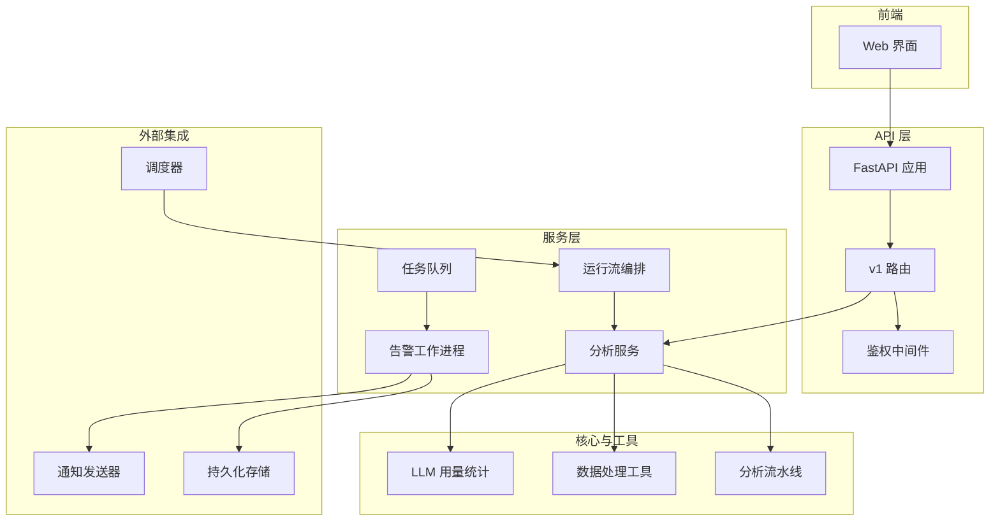
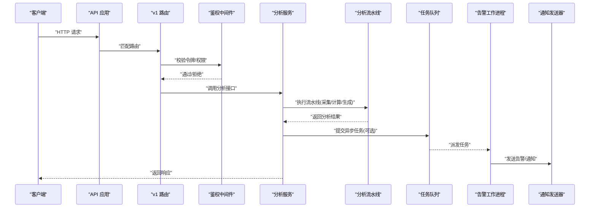
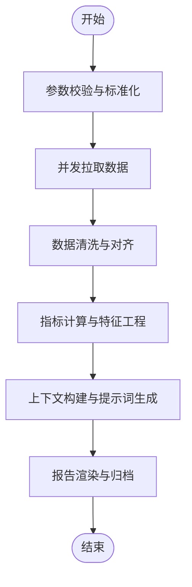
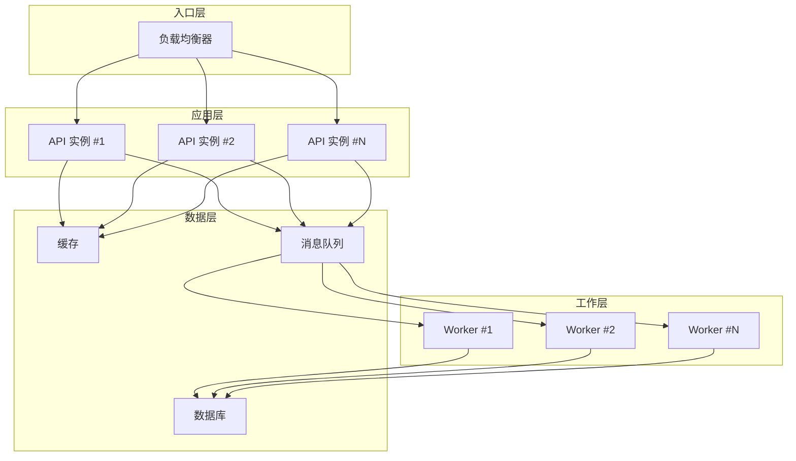
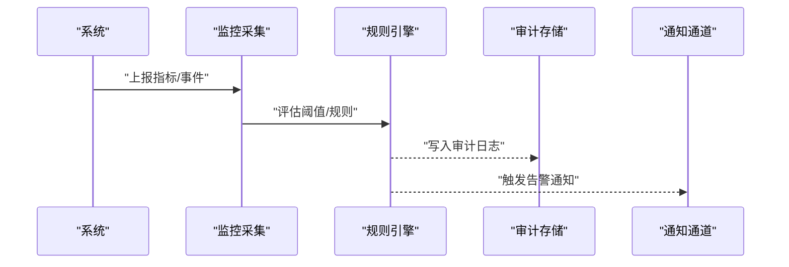
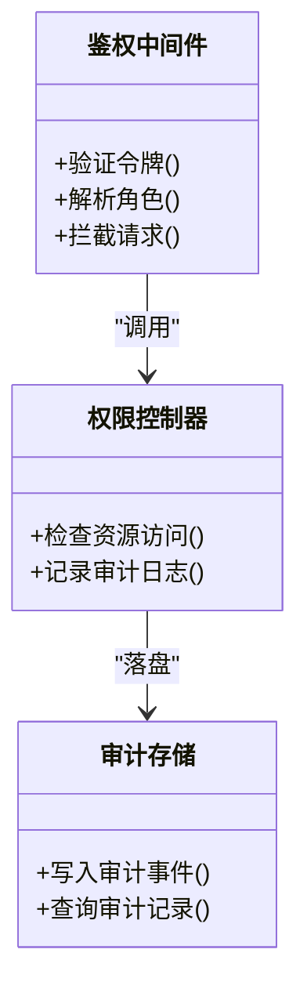
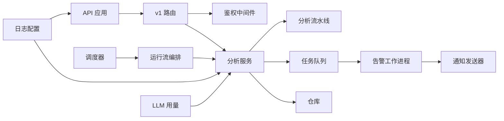

# 高级使用示例

<cite>
**本文引用的文件**   
- [main.py](file://main.py)
- [server.py](file://server.py)
- [api/app.py](file://api/app.py)
- [api/v1/router.py](file://api/v1/router.py)
- [src/core/pipeline.py](file://src/core/pipeline.py)
- [src/services/analysis_service.py](file://src/services/analysis_service.py)
- [src/services/alert_worker.py](file://src/services/alert_worker.py)
- [src/scheduler.py](file://src/scheduler.py)
- [docker/docker-compose.yml](file://docker/docker-compose.yml)
- [docker/Dockerfile](file://docker/Dockerfile)
- [src/logging_config.py](file://src/logging_config.py)
- [api/middlewares/auth.py](file://api/middlewares/auth.py)
- [src/repositories/alert_repo.py](file://src/repositories/alert_repo.py)
- [src/notification_sender/custom_webhook_sender.py](file://src/notification_sender/custom_webhook_sender.py)
- [src/utils/data_processing.py](file://src/utils/data_processing.py)
- [src/services/task_queue.py](file://src/services/task_queue.py)
- [src/services/run_flow.py](file://src/services/run_flow.py)
- [src/llm/usage.py](file://src/llm/usage.py)
</cite>

## 目录
1. [简介](#简介)
2. [项目结构](#项目结构)
3. [核心组件](#核心组件)
4. [架构总览](#架构总览)
5. [详细组件分析](#详细组件分析)
6. [依赖关系分析](#依赖关系分析)
7. [性能考量](#性能考量)
8. [故障排查指南](#故障排查指南)
9. [结论](#结论)
10. [附录](#附录)

## 简介
本文件面向高级用户与运维工程师，提供一套“深度定制与扩展”的实战示例，覆盖以下主题：
- 自定义分析管道与复杂数据处理流程编排
- 分布式部署、负载均衡与高可用配置
- 监控告警、日志分析与审计追踪的最佳实践
- 安全加固、权限控制与审计日志的配置要点
- 性能优化技巧与可观测性建设

目标是通过真实代码路径与架构图示，帮助读者快速落地企业级用法。

## 项目结构
系统采用前后端分离与多模块后端架构：
- API 层：FastAPI 应用、路由与中间件
- 服务层：业务服务（分析、回测、通知、任务队列等）
- 数据层：仓库与数据提供者
- 调度与流水线：定时任务、分析流水线编排
- 前端：Web UI（React/Vite）
- 容器化：Dockerfile 与 docker-compose 编排

图表来源
- [api/app.py](file://api/app.py)
- [api/v1/router.py](file://api/v1/router.py)
- [src/core/pipeline.py](file://src/core/pipeline.py)
- [src/services/analysis_service.py](file://src/services/analysis_service.py)
- [src/services/alert_worker.py](file://src/services/alert_worker.py)
- [src/services/task_queue.py](file://src/services/task_queue.py)
- [src/services/run_flow.py](file://src/services/run_flow.py)
- [src/scheduler.py](file://src/scheduler.py)
- [src/utils/data_processing.py](file://src/utils/data_processing.py)
- [src/llm/usage.py](file://src/llm/usage.py)

章节来源
- [api/app.py](file://api/app.py)
- [api/v1/router.py](file://api/v1/router.py)
- [src/core/pipeline.py](file://src/core/pipeline.py)
- [src/services/analysis_service.py](file://src/services/analysis_service.py)
- [src/services/alert_worker.py](file://src/services/alert_worker.py)
- [src/services/task_queue.py](file://src/services/task_queue.py)
- [src/services/run_flow.py](file://src/services/run_flow.py)
- [src/scheduler.py](file://src/scheduler.py)
- [src/utils/data_processing.py](file://src/utils/data_processing.py)
- [src/llm/usage.py](file://src/llm/usage.py)

## 核心组件
- 分析流水线：定义数据采集、指标计算、上下文构建与报告生成的阶段式处理链，支持插件化扩展。
- 分析服务：对外暴露分析能力，协调流水线、任务队列与结果持久化。
- 告警工作进程：基于规则或信号触发告警，支持多渠道通知。
- 任务队列：异步任务分发与重试，保障高吞吐与容错。
- 运行流编排：可视化执行图与事件回放，便于调试与审计。
- 调度器：定时任务触发每日市场复盘、批量分析等。
- 数据处理工具：通用清洗、对齐、聚合与缓存策略。
- LLM 用量统计：记录模型调用成本与配额，支撑计费与限流。

章节来源
- [src/core/pipeline.py](file://src/core/pipeline.py)
- [src/services/analysis_service.py](file://src/services/analysis_service.py)
- [src/services/alert_worker.py](file://src/services/alert_worker.py)
- [src/services/task_queue.py](file://src/services/task_queue.py)
- [src/services/run_flow.py](file://src/services/run_flow.py)
- [src/scheduler.py](file://src/scheduler.py)
- [src/utils/data_processing.py](file://src/utils/data_processing.py)
- [src/llm/usage.py](file://src/llm/usage.py)

## 架构总览
下图展示从请求到分析的端到端流程，包括鉴权、路由、服务编排、流水线执行、任务队列与通知。

图表来源
- [api/app.py](file://api/app.py)
- [api/v1/router.py](file://api/v1/router.py)
- [api/middlewares/auth.py](file://api/middlewares/auth.py)
- [src/services/analysis_service.py](file://src/services/analysis_service.py)
- [src/core/pipeline.py](file://src/core/pipeline.py)
- [src/services/task_queue.py](file://src/services/task_queue.py)
- [src/services/alert_worker.py](file://src/services/alert_worker.py)
- [src/notification_sender/custom_webhook_sender.py](file://src/notification_sender/custom_webhook_sender.py)

## 详细组件分析

### 自定义分析管道与复杂数据处理
- 设计要点
  - 阶段化：将数据获取、清洗、指标计算、上下文构建、报告渲染拆分为独立阶段，便于替换与并行化。
  - 可扩展：通过注册表/工厂模式动态加载阶段实现，支持热插拔。
  - 幂等与重试：对网络请求与外部依赖设置超时、重试与降级策略。
  - 数据一致性：在关键节点写入快照，便于断点续跑与回溯。
- 典型流程
  - 输入校验与参数标准化
  - 并发拉取多源数据（股票/指数/新闻）
  - 指标计算与特征工程
  - 上下文组装与提示词生成
  - 报告渲染与归档

图表来源
- [src/core/pipeline.py](file://src/core/pipeline.py)
- [src/utils/data_processing.py](file://src/utils/data_processing.py)

章节来源
- [src/core/pipeline.py](file://src/core/pipeline.py)
- [src/utils/data_processing.py](file://src/utils/data_processing.py)

### 分布式部署、负载均衡与高可用
- 容器化与编排
  - 使用 Docker 镜像封装后端与依赖
  - 通过 docker-compose 启动 API、Worker、数据库与缓存等组件
- 水平扩展
  - API 无状态化，配合反向代理进行负载均衡
  - Worker 多实例消费任务队列，提升吞吐
- 高可用
  - 健康检查与自动重启
  - 失败重试与熔断降级
  - 数据持久化与备份

图表来源
- [docker/docker-compose.yml](file://docker/docker-compose.yml)
- [docker/Dockerfile](file://docker/Dockerfile)

章节来源
- [docker/docker-compose.yml](file://docker/docker-compose.yml)
- [docker/Dockerfile](file://docker/Dockerfile)

### 监控告警、日志分析与审计日志
- 监控告警
  - 基于运行流事件与指标阈值触发告警
  - 多渠道通知（Webhook、邮件、IM 等）
- 日志分析
  - 统一日志格式与结构化输出
  - 分级日志与采样策略，避免风暴
- 审计日志
  - 关键操作留痕（登录、配置变更、分析任务提交）
  - 不可篡改存储与访问控制

图表来源
- [src/services/alert_worker.py](file://src/services/alert_worker.py)
- [src/repositories/alert_repo.py](file://src/repositories/alert_repo.py)
- [src/notification_sender/custom_webhook_sender.py](file://src/notification_sender/custom_webhook_sender.py)
- [src/logging_config.py](file://src/logging_config.py)

章节来源
- [src/services/alert_worker.py](file://src/services/alert_worker.py)
- [src/repositories/alert_repo.py](file://src/repositories/alert_repo.py)
- [src/notification_sender/custom_webhook_sender.py](file://src/notification_sender/custom_webhook_sender.py)
- [src/logging_config.py](file://src/logging_config.py)

### 安全加固、权限控制与审计
- 鉴权与授权
  - 统一鉴权中间件校验令牌与角色
  - 细粒度资源访问控制（按用户/租户隔离）
- 安全加固
  - 最小权限原则与密钥管理
  - 输入校验与输出编码，防注入与 XSS
- 审计日志
  - 记录敏感操作与访问轨迹
  - 定期导出与合规审查

图表来源
- [api/middlewares/auth.py](file://api/middlewares/auth.py)

章节来源
- [api/middlewares/auth.py](file://api/middlewares/auth.py)

### 性能优化技巧
- 并发与批处理
  - 数据拉取与指标计算并行化
  - 批量写入与事务合并
- 缓存与索引
  - 热点数据缓存（最近行情、常用指标）
  - 查询索引与分页优化
- 资源限制与背压
  - 任务队列限流与优先级
  - 超时与熔断保护下游依赖
- LLM 用量与成本控制
  - 用量统计与配额管理
  - 模型选择与降级策略

章节来源
- [src/services/task_queue.py](file://src/services/task_queue.py)
- [src/llm/usage.py](file://src/llm/usage.py)
- [src/utils/data_processing.py](file://src/utils/data_processing.py)

## 依赖关系分析
- API 层依赖路由与中间件，路由再委派至服务层
- 服务层依赖流水线、任务队列与仓库
- 调度器驱动运行流，间接触发服务与流水线
- 告警工作进程消费任务并调用通知发送器
- 日志与用量统计贯穿各层，提供可观测性

图表来源
- [api/app.py](file://api/app.py)
- [api/v1/router.py](file://api/v1/router.py)
- [api/middlewares/auth.py](file://api/middlewares/auth.py)
- [src/services/analysis_service.py](file://src/services/analysis_service.py)
- [src/core/pipeline.py](file://src/core/pipeline.py)
- [src/services/task_queue.py](file://src/services/task_queue.py)
- [src/services/alert_worker.py](file://src/services/alert_worker.py)
- [src/scheduler.py](file://src/scheduler.py)
- [src/services/run_flow.py](file://src/services/run_flow.py)
- [src/logging_config.py](file://src/logging_config.py)
- [src/llm/usage.py](file://src/llm/usage.py)

章节来源
- [api/app.py](file://api/app.py)
- [api/v1/router.py](file://api/v1/router.py)
- [api/middlewares/auth.py](file://api/middlewares/auth.py)
- [src/services/analysis_service.py](file://src/services/analysis_service.py)
- [src/core/pipeline.py](file://src/core/pipeline.py)
- [src/services/task_queue.py](file://src/services/task_queue.py)
- [src/services/alert_worker.py](file://src/services/alert_worker.py)
- [src/scheduler.py](file://src/scheduler.py)
- [src/services/run_flow.py](file://src/services/run_flow.py)
- [src/logging_config.py](file://src/logging_config.py)
- [src/llm/usage.py](file://src/llm/usage.py)

## 性能考量
- 流水线并行度与内存占用平衡
- 任务队列分区与消费者数量调优
- 缓存命中率与过期策略
- 外部依赖超时与重试退避
- LLM 调用频率限制与成本上限

[本节为通用指导，不直接分析具体文件]

## 故障排查指南
- 常见问题定位
  - 查看统一日志与错误码
  - 检查任务队列堆积与消费者状态
  - 核对鉴权令牌与权限配置
- 诊断步骤
  - 复现问题并抓取运行流快照
  - 分析告警事件与审计日志
  - 逐步隔离依赖（网络、数据库、外部 API）
- 恢复策略
  - 重启失败实例与清理僵尸任务
  - 回滚配置与数据修复
  - 启用降级模式与只读副本

章节来源
- [src/logging_config.py](file://src/logging_config.py)
- [src/services/alert_worker.py](file://src/services/alert_worker.py)
- [src/repositories/alert_repo.py](file://src/repositories/alert_repo.py)
- [api/middlewares/auth.py](file://api/middlewares/auth.py)

## 结论
通过模块化流水线、任务队列与编排能力，系统具备强大的扩展性与可观测性。结合容器化与编排方案可实现高可用与弹性伸缩；通过鉴权、审计与告警体系满足企业级安全与合规需求。建议在生产环境持续优化并发、缓存与成本，并建立完善的监控与演练机制。

[本节为总结性内容，不直接分析具体文件]

## 附录
- 快速上手
  - 本地启动：参考入口脚本与配置文件
  - 容器化部署：使用 Dockerfile 与 docker-compose 一键拉起
- 扩展点
  - 新增流水线阶段：实现标准接口并注册
  - 新增通知渠道：实现发送器接口并接入
- 最佳实践
  - 分环境配置与密钥管理
  - 灰度发布与回滚策略
  - 容量规划与压测方法

章节来源
- [main.py](file://main.py)
- [server.py](file://server.py)
- [docker/Dockerfile](file://docker/Dockerfile)
- [docker/docker-compose.yml](file://docker/docker-compose.yml)