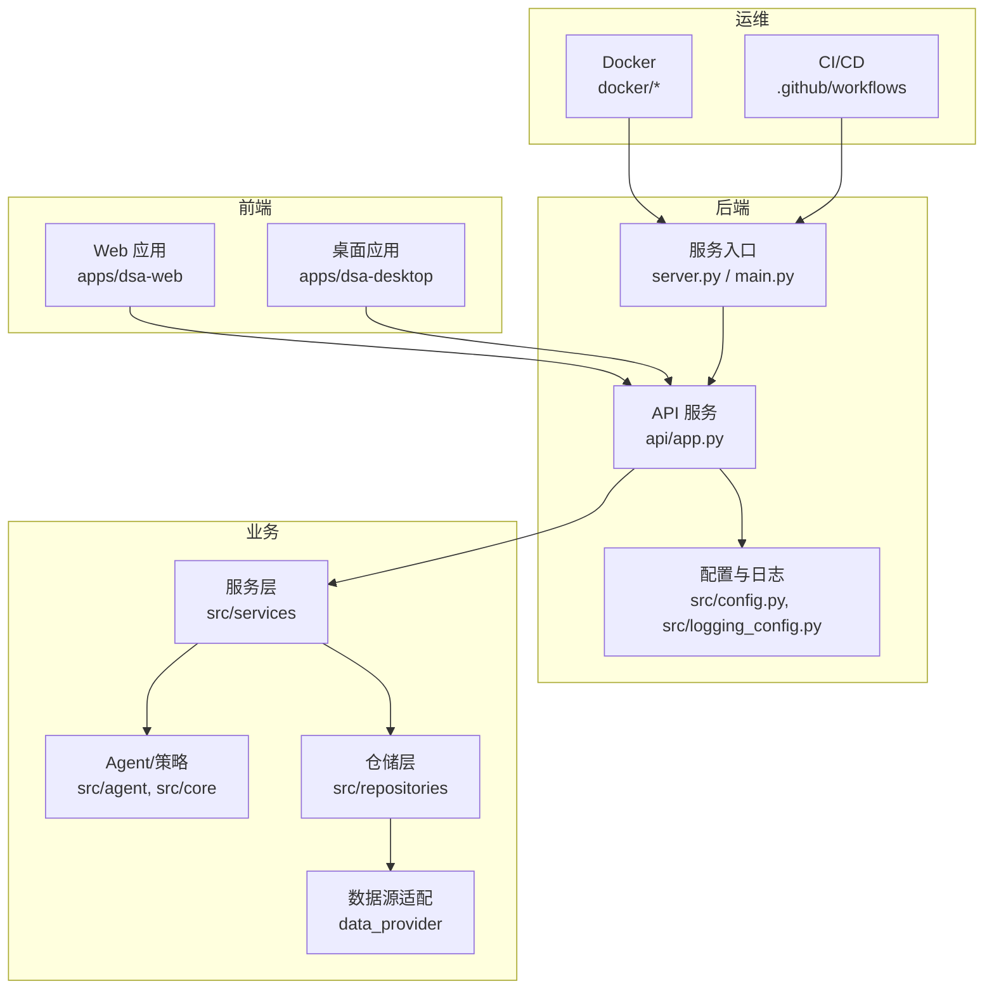
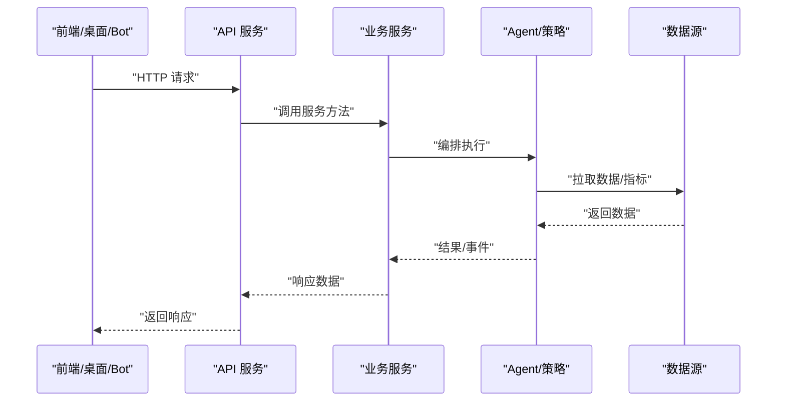
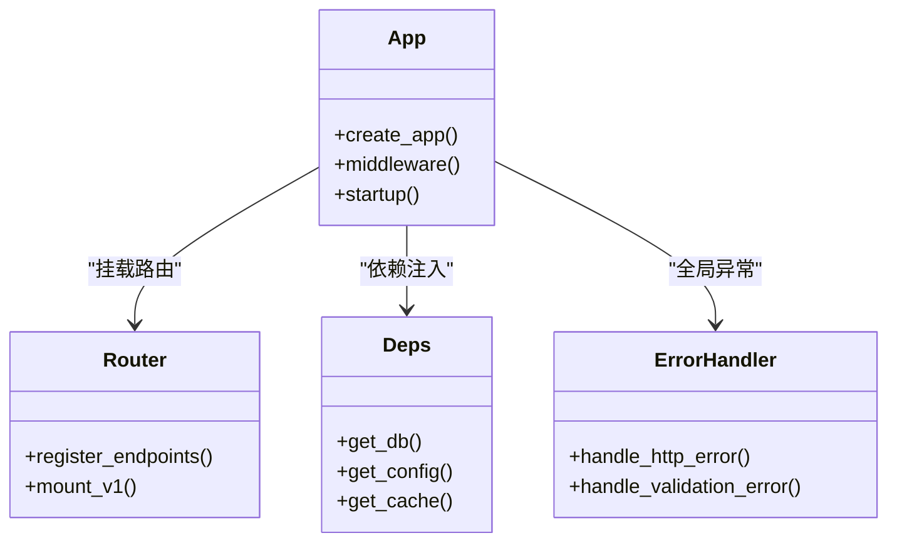
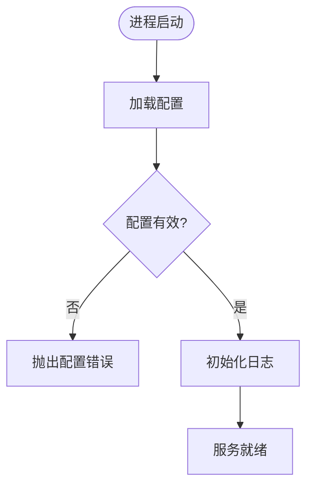
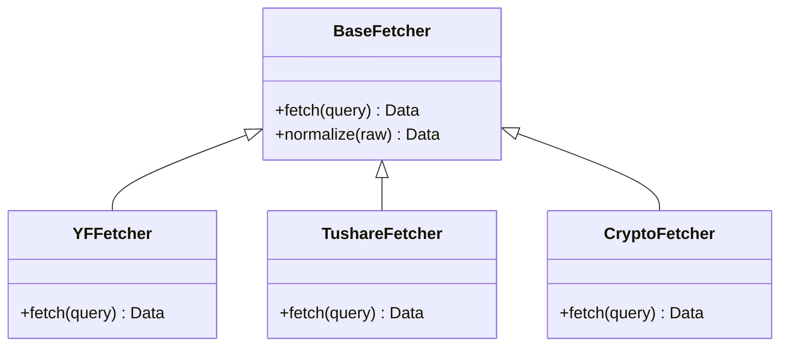
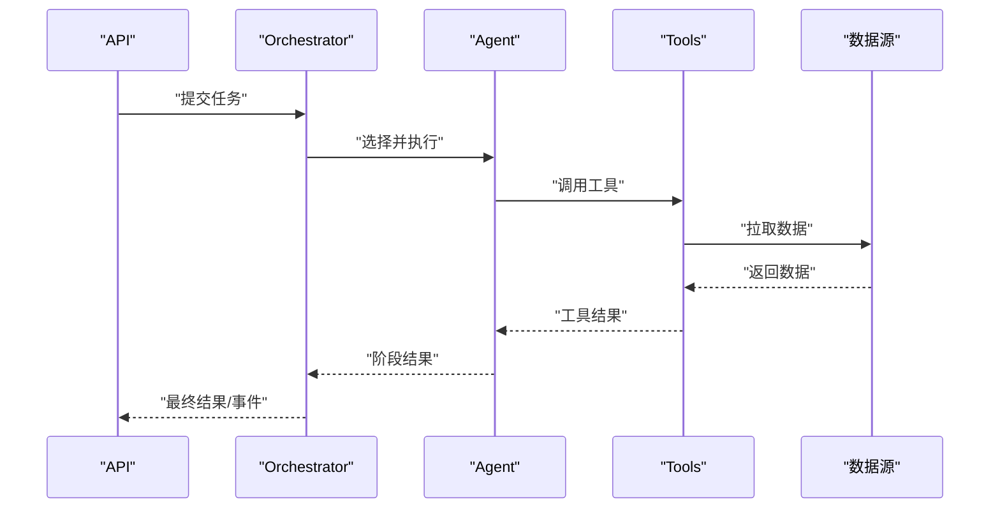
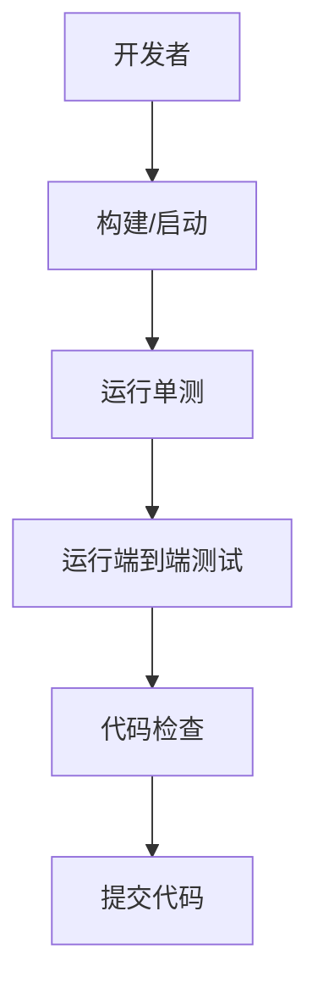
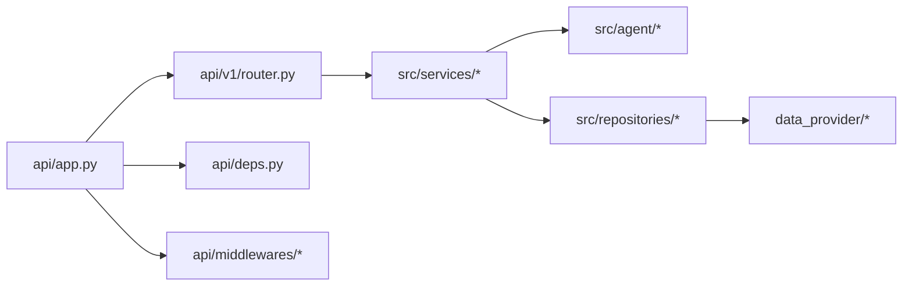

# 开发指南

<cite>
**本文引用的文件**   
- [README.md](file://README.md)
- [pyproject.toml](file://pyproject.toml)
- [requirements.txt](file://requirements.txt)
- [main.py](file://main.py)
- [server.py](file://server.py)
- [webui.py](file://webui.py)
- [api/app.py](file://api/app.py)
- [api/v1/router.py](file://api/v1/router.py)
- [src/config.py](file://src/config.py)
- [src/logging_config.py](file://src/logging_config.py)
- [docker/Dockerfile](file://docker/Dockerfile)
- [docker/docker-compose.yml](file://docker/docker-compose.yml)
- [docker/entrypoint.sh](file://docker/entrypoint.sh)
- [scripts/test.sh](file://scripts/test.sh)
- [tests/conftest.py](file://tests/conftest.py)
- [apps/dsa-web/package.json](file://apps/dsa-web/package.json)
- [apps/dsa-web/vitest.config.ts](file://apps/dsa-web/vitest.config.ts)
- [apps/dsa-web/playwright.config.ts](file://apps/dsa-web/playwright.config.ts)
- [apps/dsa-desktop/package.json](file://apps/dsa-desktop/package.json)
- [.github/workflows/ci.yml](file://.github/workflows/ci.yml)
- [.github/release.yml](file://.github/release.yml)
- [docs/CONTRIBUTING.md](file://docs/CONTRIBUTING.md)
- [docs/DEPLOY_EN.md](file://docs/DEPLOY_EN.md)
- [docs/full-guide_EN.md](file://docs/full-guide_EN.md)
</cite>

## 目录
1. [简介](#简介)
2. [项目结构](#项目结构)
3. [核心组件](#核心组件)
4. [架构总览](#架构总览)
5. [详细组件分析](#详细组件分析)
6. [依赖关系分析](#依赖关系分析)
7. [性能考量](#性能考量)
8. [故障排查指南](#故障排查指南)
9. [结论](#结论)
10. [附录](#附录)

## 简介
本指南面向贡献者，提供从环境搭建、代码风格、测试规范到代码审查与发布流程的完整说明。项目为多端应用（Web、桌面、Bot）+ Python 后端 + 数据源适配层 + Agent/策略编排的综合系统。文档将帮助你快速理解模块职责、依赖关系与开发工作流，并给出调试技巧、性能分析与常见问题解决方案。

## 项目结构
- 后端服务：FastAPI 应用位于 api 目录，入口由 server.py 或 main.py 启动；配置与日志分别由 src/config.py 和 src/logging_config.py 管理。
- 前端 Web：React/Vite 工程位于 apps/dsa-web，使用 Vitest 进行单元测试，Playwright 进行端到端测试。
- 桌面客户端：Electron 应用位于 apps/dsa-desktop。
- Bot：基于平台的命令分发器位于 bot 目录。
- 数据源：data_provider 提供多种行情与基本面数据获取适配器。
- 业务逻辑：src 下包含 Agent、策略、服务、仓储、工具等核心实现。
- 测试：tests 覆盖后端与集成用例；前端单测在各自工程中。
- 容器化：docker 目录提供镜像构建与编排。
- 脚本：scripts 提供构建、测试、校验等辅助脚本。
- 文档：docs 包含贡献指南、部署指南、FAQ 等。

**图表来源** 
- [api/app.py](file://api/app.py)
- [server.py](file://server.py)
- [main.py](file://main.py)
- [src/config.py](file://src/config.py)
- [src/logging_config.py](file://src/logging_config.py)
- [docker/Dockerfile](file://docker/Dockerfile)
- [docker/docker-compose.yml](file://docker/docker-compose.yml)

**章节来源**
- [README.md](file://README.md)
- [pyproject.toml](file://pyproject.toml)
- [requirements.txt](file://requirements.txt)

## 核心组件
- API 服务：基于 FastAPI，路由集中在 api/v1，中间件处理认证与错误。
- 配置与日志：集中式配置加载与环境变量解析；统一日志初始化。
- 业务服务：分析、回测、通知、任务队列、市场上下文等。
- 数据源：多源抓取与标准化，支持 A 股、港股、美股、加密货币等。
- Agent/策略：可插拔的 Agent 与策略路由，支持技能聚合与执行。
- 前端：模块化 React 组件、状态管理、API 封装、国际化与主题。
- 桌面与 Bot：桌面打包与平台命令分发。

**章节来源**
- [api/v1/router.py](file://api/v1/router.py)
- [src/config.py](file://src/config.py)
- [src/logging_config.py](file://src/logging_config.py)
- [data_provider/base.py](file://data_provider/base.py)
- [src/agent/orchestrator.py](file://src/agent/orchestrator.py)

## 架构总览
后端采用分层架构：API 层 -> 服务层 -> 仓储/工具 -> 数据源。Agent/策略作为可插拔能力通过 Orchestrator 调度。前端通过 REST/SSE 与后端交互，桌面与 Bot 复用同一套 API。

**图表来源** 
- [api/app.py](file://api/app.py)
- [api/v1/router.py](file://api/v1/router.py)
- [src/services/analysis_service.py](file://src/services/analysis_service.py)
- [src/agent/orchestrator.py](file://src/agent/orchestrator.py)
- [data_provider/base.py](file://data_provider/base.py)

## 详细组件分析

### 后端 API 与服务
- 路由组织：按功能域划分 endpoints，统一在 v1 路由中注册。
- 中间件：认证、错误处理、CORS、限流等。
- 依赖注入：通过 deps 模块提供共享依赖。
- 错误处理：统一异常映射与错误码。

**图表来源** 
- [api/app.py](file://api/app.py)
- [api/v1/router.py](file://api/v1/router.py)
- [api/deps.py](file://api/deps.py)
- [api/middlewares/error_handler.py](file://api/middlewares/error_handler.py)

**章节来源**
- [api/app.py](file://api/app.py)
- [api/v1/router.py](file://api/v1/router.py)
- [api/deps.py](file://api/deps.py)
- [api/middlewares/auth.py](file://api/middlewares/auth.py)
- [api/middlewares/error_handler.py](file://api/middlewares/error_handler.py)

### 配置与日志
- 配置：集中读取环境变量与配置文件，提供类型安全的访问接口。
- 日志：统一初始化，支持分级输出与结构化字段。

**图表来源** 
- [src/config.py](file://src/config.py)
- [src/logging_config.py](file://src/logging_config.py)

**章节来源**
- [src/config.py](file://src/config.py)
- [src/logging_config.py](file://src/logging_config.py)

### 数据源适配层
- 基类定义统一接口，各 Fetcher 实现具体数据源。
- 标准化数据结构，便于上层消费。

**图表来源** 
- [data_provider/base.py](file://data_provider/base.py)
- [data_provider/yfinance_fetcher.py](file://data_provider/yfinance_fetcher.py)
- [data_provider/tushare_fetcher.py](file://data_provider/tushare_fetcher.py)
- [data_provider/crypto_fetcher.py](file://data_provider/crypto_fetcher.py)

**章节来源**
- [data_provider/base.py](file://data_provider/base.py)
- [data_provider/yfinance_fetcher.py](file://data_provider/yfinance_fetcher.py)
- [data_provider/tushare_fetcher.py](file://data_provider/tushare_fetcher.py)
- [data_provider/crypto_fetcher.py](file://data_provider/crypto_fetcher.py)

### Agent/策略编排
- Orchestrator 负责调度多个 Agent/Strategy，组合技能与工具。
- 支持异步执行与事件流。

**图表来源** 
- [src/agent/orchestrator.py](file://src/agent/orchestrator.py)
- [src/agent/tools/registry.py](file://src/agent/tools/registry.py)
- [data_provider/base.py](file://data_provider/base.py)

**章节来源**
- [src/agent/orchestrator.py](file://src/agent/orchestrator.py)
- [src/agent/tools/analysis_tools.py](file://src/agent/tools/analysis_tools.py)
- [src/agent/tools/data_tools.py](file://src/agent/tools/data_tools.py)

### 前端工程
- 包管理与脚本：package.json 定义依赖与脚本。
- 单测：Vitest 配置与用例。
- E2E：Playwright 配置与用例。

**图表来源** 
- [apps/dsa-web/package.json](file://apps/dsa-web/package.json)
- [apps/dsa-web/vitest.config.ts](file://apps/dsa-web/vitest.config.ts)
- [apps/dsa-web/playwright.config.ts](file://apps/dsa-web/playwright.config.ts)

**章节来源**
- [apps/dsa-web/package.json](file://apps/dsa-web/package.json)
- [apps/dsa-web/vitest.config.ts](file://apps/dsa-web/vitest.config.ts)
- [apps/dsa-web/playwright.config.ts](file://apps/dsa-web/playwright.config.ts)

### 桌面应用
- Electron 主进程与渲染进程分离，preload 桥接安全 API。
- 打包与更新脚本。

**章节来源**
- [apps/dsa-desktop/package.json](file://apps/dsa-desktop/package.json)

### Bot 平台
- 命令分发器与平台适配器（钉钉、飞书、Discord）。
- 统一消息模型与处理流程。

**章节来源**
- [bot/dispatcher.py](file://bot/dispatcher.py)
- [bot/handler.py](file://bot/handler.py)
- [bot/models.py](file://bot/models.py)
- [bot/platforms/dingtalk.py](file://bot/platforms/dingtalk.py)
- [bot/platforms/feishu_stream.py](file://bot/platforms/feishu_stream.py)
- [bot/platforms/discord.py](file://bot/platforms/discord.py)

## 依赖关系分析
- 后端依赖：FastAPI、Pydantic、SQLAlchemy（如使用）、HTTP 客户端、LLM 适配器等。
- 前端依赖：React、Vite、TypeScript、UI 库、测试框架。
- 桌面依赖：Electron、打包工具。
- 容器化：Docker 镜像构建与 Compose 编排。

**图表来源** 
- [api/app.py](file://api/app.py)
- [api/v1/router.py](file://api/v1/router.py)
- [api/deps.py](file://api/deps.py)
- [src/services/analysis_service.py](file://src/services/analysis_service.py)
- [src/repositories/stock_repo.py](file://src/repositories/stock_repo.py)
- [data_provider/base.py](file://data_provider/base.py)

**章节来源**
- [pyproject.toml](file://pyproject.toml)
- [requirements.txt](file://requirements.txt)

## 性能考量
- 数据源优化：连接池、缓存、重试与超时控制。
- 并发与异步：I/O 密集型操作使用异步，避免阻塞。
- 资源限制：限流、熔断与降级策略。
- 前端优化：懒加载、虚拟列表、请求去抖与合并。
- 监控与追踪：链路追踪、指标采集与告警。

[本节为通用指导，不直接分析具体文件]

## 故障排查指南
- 启动失败：检查环境变量与配置文件；查看日志级别与输出路径。
- 数据拉取失败：确认数据源密钥与网络连通性；启用重试与降级。
- API 错误：定位中间件与错误处理器；检查输入校验与权限。
- 前端问题：浏览器控制台与网络面板；单测与 E2E 用例复现。
- 桌面问题：主进程日志与渲染进程错误；打包产物完整性。

**章节来源**
- [src/logging_config.py](file://src/logging_config.py)
- [api/middlewares/error_handler.py](file://api/middlewares/error_handler.py)
- [tests/conftest.py](file://tests/conftest.py)

## 结论
本指南提供了从环境搭建到发布的全流程说明，帮助贡献者高效参与开发与维护。建议遵循代码风格与测试规范，利用调试与性能分析工具，持续改进质量与稳定性。

[本节为总结，不直接分析具体文件]

## 附录

### 开发环境搭建
- 安装 Python 与依赖：使用 pyproject.toml 或 requirements.txt。
- 前端环境：Node.js 与包管理器；安装依赖后启动开发服务器。
- 桌面环境：Electron 依赖与打包脚本。
- Docker：构建镜像与编排服务。

**章节来源**
- [pyproject.toml](file://pyproject.toml)
- [requirements.txt](file://requirements.txt)
- [apps/dsa-web/package.json](file://apps/dsa-web/package.json)
- [apps/dsa-desktop/package.json](file://apps/dsa-desktop/package.json)
- [docker/Dockerfile](file://docker/Dockerfile)
- [docker/docker-compose.yml](file://docker/docker-compose.yml)

### 代码风格指南
- Python：PEP8，类型注解，统一导入顺序。
- TypeScript/React：ESLint/Prettier，组件拆分与命名约定。
- 注释与文档：函数级 docstring，关键逻辑注释。
- 提交信息：语义化版本与变更描述。

**章节来源**
- [setup.cfg](file://setup.cfg)
- [apps/dsa-web/eslint.config.js](file://apps/dsa-web/eslint.config.js)

### 测试编写规范
- 后端：pytest 用例，夹具与参数化；覆盖率统计。
- 前端：Vitest 单测，Mock 外部依赖；Playwright E2E。
- 脚本：自动化测试脚本与 CI 集成。

**章节来源**
- [scripts/test.sh](file://scripts/test.sh)
- [tests/conftest.py](file://tests/conftest.py)
- [apps/dsa-web/vitest.config.ts](file://apps/dsa-web/vitest.config.ts)
- [apps/dsa-web/playwright.config.ts](file://apps/dsa-web/playwright.config.ts)

### 代码审查流程
- 分支策略：功能分支与 PR 模板。
- 审查要点：可读性、健壮性、性能与安全。
- 自动化：CI 门禁、静态检查与测试。

**章节来源**
- [.github/PULL_REQUEST_TEMPLATE.md](file://.github/PULL_REQUEST_TEMPLATE.md)
- [.github/workflows/ci.yml](file://.github/workflows/ci.yml)

### 新功能开发流程
- 需求分析：明确目标与边界。
- 设计评审：接口与数据模型设计。
- 实现与自测：单元与集成测试。
- 联调与验收：前后端联调与用户验收。

[本节为通用流程，不直接分析具体文件]

### Bug 修复流程
- 复现与定位：日志与断点。
- 修复与回归：最小改动与回归测试。
- 验证与发布：测试通过与版本发布。

[本节为通用流程，不直接分析具体文件]

### 版本发布流程
- 版本标记：标签与变更日志。
- 构建与打包：镜像与安装包。
- 发布与回滚：灰度与回滚预案。

**章节来源**
- [.github/release.yml](file://.github/release.yml)

### 调试技巧
- 后端：日志级别、断点与性能剖析。
- 前端：浏览器开发者工具与网络抓包。
- 桌面：主进程与渲染进程日志。
- 数据源：模拟与回放。

**章节来源**
- [src/logging_config.py](file://src/logging_config.py)
- [apps/dsa-web/src/setupTests.ts](file://apps/dsa-web/src/setupTests.ts)

### 性能分析
- 后端：热点函数与 I/O 瓶颈。
- 前端：渲染性能与内存占用。
- 数据源：延迟与吞吐优化。

[本节为通用指导，不直接分析具体文件]

### 常见问题解决方案
- 依赖冲突：锁定版本与隔离环境。
- 跨域问题：CORS 配置与代理。
- 数据不一致：缓存失效与一致性校验。

**章节来源**
- [api/app.py](file://api/app.py)
- [src/config.py](file://src/config.py)

### 社区贡献指南
- 贡献方式：Issue、PR 与讨论。
- 行为准则：尊重与协作。
- 许可证：开源协议说明。

**章节来源**
- [docs/CONTRIBUTING.md](file://docs/CONTRIBUTING.md)
- [docs/CONTRIBUTING_EN.md](file://docs/CONTRIBUTING_EN.md)

### 部署指南
- 本地部署：环境变量与配置。
- 生产部署：容器化与编排。
- 监控与告警：指标与日志。

**章节来源**
- [docs/DEPLOY_EN.md](file://docs/DEPLOY_EN.md)
- [docs/full-guide_EN.md](file://docs/full-guide_EN.md)
- [docker/entrypoint.sh](file://docker/entrypoint.sh)