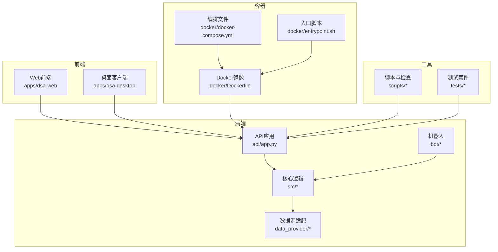
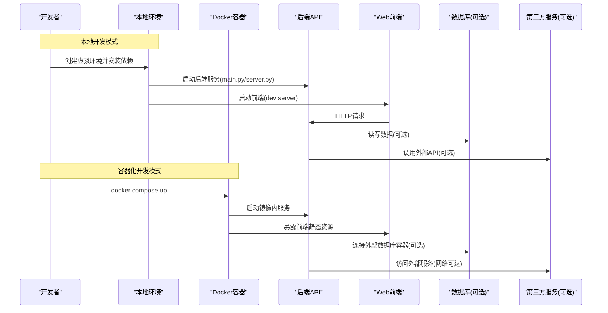
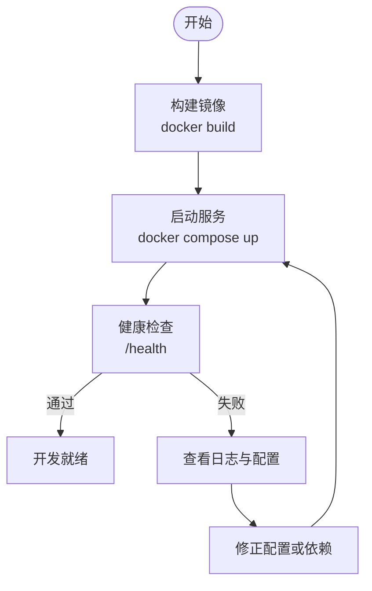
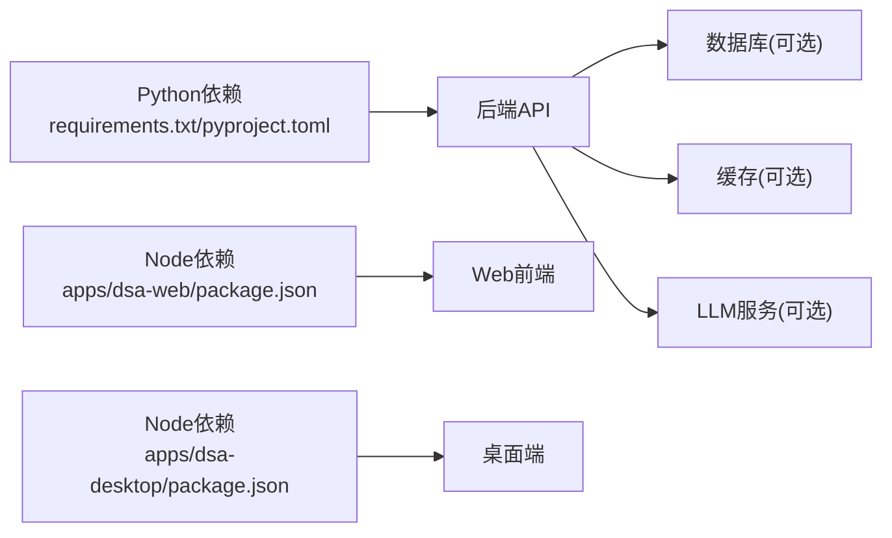

# 开发环境搭建

<cite>
**本文引用的文件**   
- [pyproject.toml](file://pyproject.toml)
- [requirements.txt](file://requirements.txt)
- [main.py](file://main.py)
- [server.py](file://server.py)
- [webui.py](file://webui.py)
- [api/app.py](file://api/app.py)
- [src/config.py](file://src/config.py)
- [docker/Dockerfile](file://docker/Dockerfile)
- [docker/docker-compose.yml](file://docker/docker-compose.yml)
- [docker/entrypoint.sh](file://docker/entrypoint.sh)
- [scripts/check_env.py](file://scripts/check_env.py)
- [scripts/test.sh](file://scripts/test.sh)
- [apps/dsa-web/package.json](file://apps/dsa-web/package.json)
- [apps/dsa-desktop/package.json](file://apps/dsa-desktop/package.json)
- [.github/requirements-ci.txt](file://.github/requirements-ci.txt)
</cite>

## 目录
1. [简介](#简介)
2. [项目结构](#项目结构)
3. [核心组件](#核心组件)
4. [架构总览](#架构总览)
5. [详细组件分析](#详细组件分析)
6. [依赖分析](#依赖分析)
7. [性能考虑](#性能考虑)
8. [故障排查指南](#故障排查指南)
9. [结论](#结论)
10. [附录](#附录)

## 简介
本指南面向本地与容器化开发环境的搭建，覆盖Python版本要求、虚拟环境创建、依赖安装、数据库与第三方服务配置、环境变量准备、Web前端与桌面端构建、Docker容器化运行方式，以及常见环境问题排查与IDE推荐。目标是让开发者快速在本地或容器中启动后端API、Web UI与可选的辅助服务，并顺利进入调试与迭代流程。

## 项目结构
本项目采用多模块组织：
- 后端API与服务：api、src、bot、data_provider等
- Web前端与桌面客户端：apps/dsa-web、apps/dsa-desktop
- 容器化：docker（镜像、编排、入口脚本）
- 脚本与测试：scripts、tests
- 配置与依赖：pyproject.toml、requirements.txt、.github/requirements-ci.txt

图表来源
- [api/app.py:1-200](file://api/app.py#L1-L200)
- [src/config.py:1-200](file://src/config.py#L1-L200)
- [docker/Dockerfile:1-200](file://docker/Dockerfile#L1-L200)
- [docker/docker-compose.yml:1-200](file://docker/docker-compose.yml#L1-L200)
- [docker/entrypoint.sh:1-200](file://docker/entrypoint.sh#L1-L200)

章节来源
- [pyproject.toml:1-200](file://pyproject.toml#L1-L200)
- [requirements.txt:1-200](file://requirements.txt#L1-L200)
- [main.py:1-200](file://main.py#L1-L200)
- [server.py:1-200](file://server.py#L1-L200)
- [webui.py:1-200](file://webui.py#L1-L200)

## 核心组件
- Python环境与依赖管理
  - 使用pyproject.toml声明项目元信息与依赖，requirements.txt用于pip安装
  - CI依赖清单位于.github/requirements-ci.txt，便于统一环境
- 后端服务
  - main.py为进程入口之一；server.py提供HTTP服务；webui.py负责静态资源与前端代理
  - api/app.py定义FastAPI应用与路由挂载
  - src/config.py集中管理配置加载与环境变量解析
- 前端与桌面端
  - apps/dsa-web基于Vite+React/TypeScript，package.json定义构建与依赖
  - apps/dsa-desktop为Electron桌面应用，package.json定义打包与依赖
- 容器化
  - docker/Dockerfile构建镜像；docker/docker-compose.yml编排服务；docker/entrypoint.sh作为容器启动入口

章节来源
- [pyproject.toml:1-200](file://pyproject.toml#L1-L200)
- [requirements.txt:1-200](file://requirements.txt#L1-L200)
- [main.py:1-200](file://main.py#L1-L200)
- [server.py:1-200](file://server.py#L1-L200)
- [webui.py:1-200](file://webui.py#L1-L200)
- [api/app.py:1-200](file://api/app.py#L1-L200)
- [src/config.py:1-200](file://src/config.py#L1-L200)
- [apps/dsa-web/package.json:1-200](file://apps/dsa-web/package.json#L1-L200)
- [apps/dsa-desktop/package.json:1-200](file://apps/dsa-desktop/package.json#L1-L200)

## 架构总览
下图展示本地与容器化两种典型运行路径：本地通过Python直接运行API与WebUI；容器化通过Docker镜像与Compose编排一键拉起服务。

图表来源
- [main.py:1-200](file://main.py#L1-L200)
- [server.py:1-200](file://server.py#L1-L200)
- [webui.py:1-200](file://webui.py#L1-L200)
- [docker/docker-compose.yml:1-200](file://docker/docker-compose.yml#L1-L200)

## 详细组件分析

### Python环境与依赖安装
- Python版本要求
  - 参考pyproject.toml中的Python版本约束与依赖声明
- 虚拟环境创建
  - 推荐使用venv或conda创建隔离环境
- 依赖安装
  - 使用requirements.txt进行安装
  - CI依赖清单可参考.github/requirements-ci.txt以保持一致性
- 常用命令
  - 激活虚拟环境后执行依赖安装
  - 校验环境脚本位于scripts/check_env.py，可用于自检

章节来源
- [pyproject.toml:1-200](file://pyproject.toml#L1-L200)
- [requirements.txt:1-200](file://requirements.txt#L1-L200)
- [.github/requirements-ci.txt:1-200](file://.github/requirements-ci.txt#L1-L200)
- [scripts/check_env.py:1-200](file://scripts/check_env.py#L1-L200)

### 环境变量与配置文件
- 配置加载
  - src/config.py负责读取环境变量与配置文件，建议将敏感信息放入环境变量
- 必要环境变量
  - 数据库连接串、缓存地址、第三方服务密钥等按实际模块需求设置
- 配置文件
  - 可在项目根目录或config目录放置示例配置文件，按需覆盖默认值

章节来源
- [src/config.py:1-200](file://src/config.py#L1-L200)

### 后端服务启动
- 入口与服务器
  - main.py为进程入口之一；server.py提供HTTP服务；webui.py负责静态资源与前端代理
- 启动顺序
  - 先启动后端API，再启动前端开发服务器以便联调
- 健康检查
  - 可通过health相关端点验证服务状态

章节来源
- [main.py:1-200](file://main.py#L1-L200)
- [server.py:1-200](file://server.py#L1-L200)
- [webui.py:1-200](file://webui.py#L1-L200)
- [api/app.py:1-200](file://api/app.py#L1-L200)

### 前端与桌面端开发
- Web前端
  - 基于Vite+React/TypeScript，package.json定义依赖与脚本
  - 本地开发需安装Node.js与包管理器，执行dev脚本启动热重载
- 桌面端
  - Electron应用，package.json定义打包与依赖
  - 本地构建需安装Node.js与相关依赖，执行打包脚本生成安装包

章节来源
- [apps/dsa-web/package.json:1-200](file://apps/dsa-web/package.json#L1-L200)
- [apps/dsa-desktop/package.json:1-200](file://apps/dsa-desktop/package.json#L1-L200)

### 容器化开发环境
- 镜像构建
  - docker/Dockerfile定义基础镜像、依赖安装与入口命令
- 编排服务
  - docker/docker-compose.yml编排后端、前端与可选数据库/缓存服务
- 容器入口
  - docker/entrypoint.sh作为容器启动入口，负责初始化与启动服务

图表来源
- [docker/Dockerfile:1-200](file://docker/Dockerfile#L1-L200)
- [docker/docker-compose.yml:1-200](file://docker/docker-compose.yml#L1-L200)
- [docker/entrypoint.sh:1-200](file://docker/entrypoint.sh#L1-L200)

章节来源
- [docker/Dockerfile:1-200](file://docker/Dockerfile#L1-L200)
- [docker/docker-compose.yml:1-200](file://docker/docker-compose.yml#L1-L200)
- [docker/entrypoint.sh:1-200](file://docker/entrypoint.sh#L1-L200)

### 测试与脚本
- 测试执行
  - scripts/test.sh提供统一的测试执行入口
- 环境检查
  - scripts/check_env.py用于检查Python环境、依赖与关键配置是否满足要求

章节来源
- [scripts/test.sh:1-200](file://scripts/test.sh#L1-L200)
- [scripts/check_env.py:1-200](file://scripts/check_env.py#L1-L200)

## 依赖分析
- 语言与运行时
  - Python：由pyproject.toml指定版本范围
  - Node.js：前端与桌面端构建需要
- 依赖管理
  - Python依赖：requirements.txt与pyproject.toml共同维护
  - 前端依赖：apps/dsa-web/package.json与apps/dsa-desktop/package.json
- 外部服务
  - 数据库、缓存、消息队列、LLM服务等通过环境变量或配置文件注入

图表来源
- [requirements.txt:1-200](file://requirements.txt#L1-L200)
- [pyproject.toml:1-200](file://pyproject.toml#L1-L200)
- [apps/dsa-web/package.json:1-200](file://apps/dsa-web/package.json#L1-L200)
- [apps/dsa-desktop/package.json:1-200](file://apps/dsa-desktop/package.json#L1-L200)

章节来源
- [requirements.txt:1-200](file://requirements.txt#L1-L200)
- [pyproject.toml:1-200](file://pyproject.toml#L1-L200)
- [apps/dsa-web/package.json:1-200](file://apps/dsa-web/package.json#L1-L200)
- [apps/dsa-desktop/package.json:1-200](file://apps/dsa-desktop/package.json#L1-L200)

## 性能考虑
- 依赖安装优化
  - 使用离线缓存与镜像加速，减少重复下载时间
- 服务启动优化
  - 合理设置线程池与连接池参数，避免冷启动过慢
- 前端构建优化
  - 启用增量构建与缓存，减少开发时等待时间
- 容器化优化
  - 分层构建与多阶段构建，减小镜像体积

[本节为通用指导，不直接分析具体文件]

## 故障排查指南
- 常见问题定位
  - 使用scripts/check_env.py进行环境自检，确认Python版本、依赖与关键环境变量
  - 查看容器日志与端口占用情况，确认服务是否成功启动
- 常见错误与解决
  - 依赖缺失：重新安装requirements.txt与前端依赖
  - 端口冲突：修改监听端口或释放占用端口
  - 环境变量缺失：补齐数据库、缓存与第三方服务配置
  - 网络问题：检查防火墙与代理设置，确保能访问外部服务
- 调试建议
  - 开启详细日志输出，定位异常堆栈
  - 使用健康检查端点验证服务可用性

章节来源
- [scripts/check_env.py:1-200](file://scripts/check_env.py#L1-L200)
- [scripts/test.sh:1-200](file://scripts/test.sh#L1-L200)

## 结论
通过本文档，开发者可以完成本地与容器化的完整环境搭建，包括Python与Node环境、依赖安装、环境变量与配置文件准备、前后端服务启动、Docker容器化运行与常见问题的排查。建议在团队内统一依赖版本与环境配置，提升协作效率与稳定性。

[本节为总结性内容，不直接分析具体文件]

## 附录
- IDE推荐配置
  - VS Code：安装Python、Pylance、ESLint、Prettier、Docker扩展
  - PyCharm：配置解释器与虚拟环境，启用自动导入与代码风格检查
  - Node.js工具链：安装npm/yarn/pnpm，配置包管理器与脚本别名
- 开发工具链
  - 代码格式化与lint：prettier、eslint、black、ruff
  - 测试框架：pytest、vitest、playwright
  - 容器工具：docker、docker compose
- 常用命令速查
  - 后端：python main.py / python server.py
  - 前端：cd apps/dsa-web && npm run dev
  - 桌面端：cd apps/dsa-desktop && npm run build
  - 容器：docker compose up --build

[本节为补充信息，不直接分析具体文件]