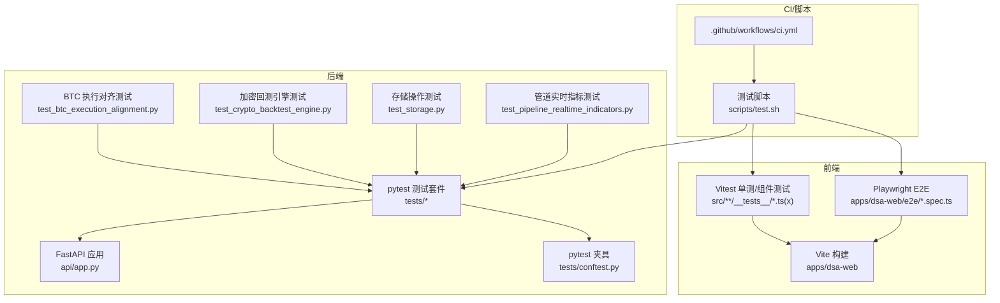
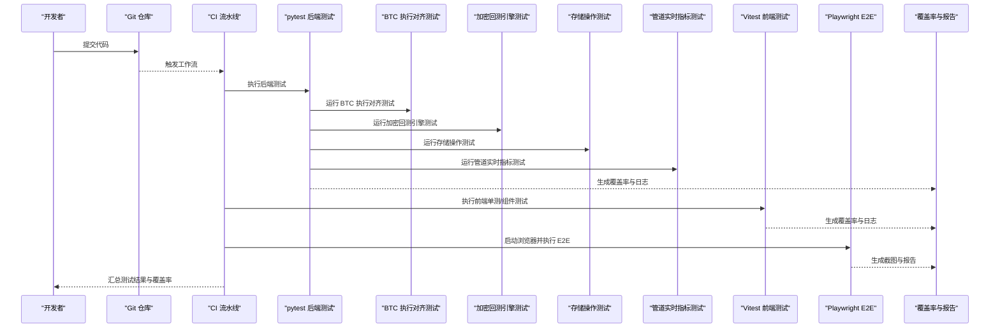
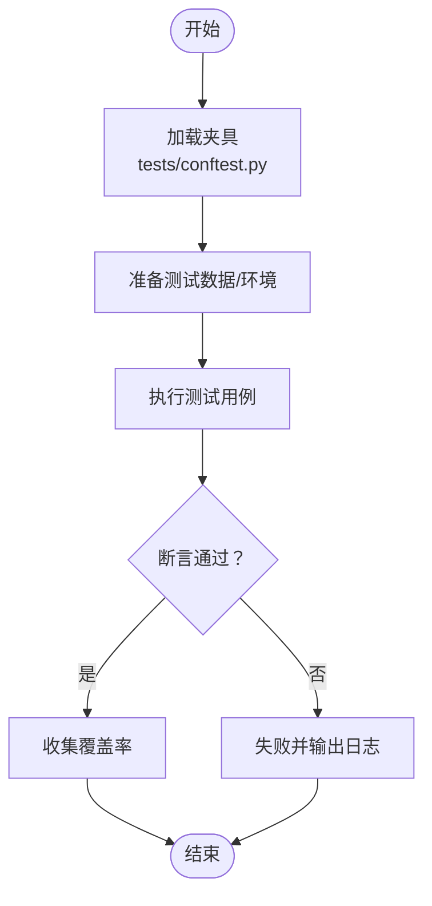
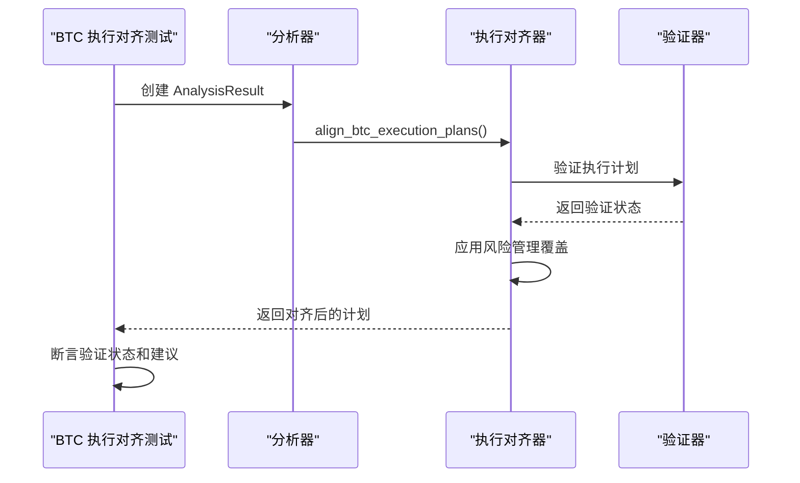
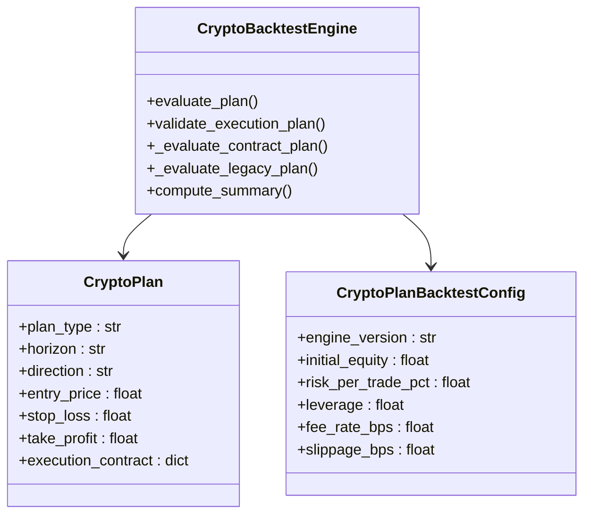
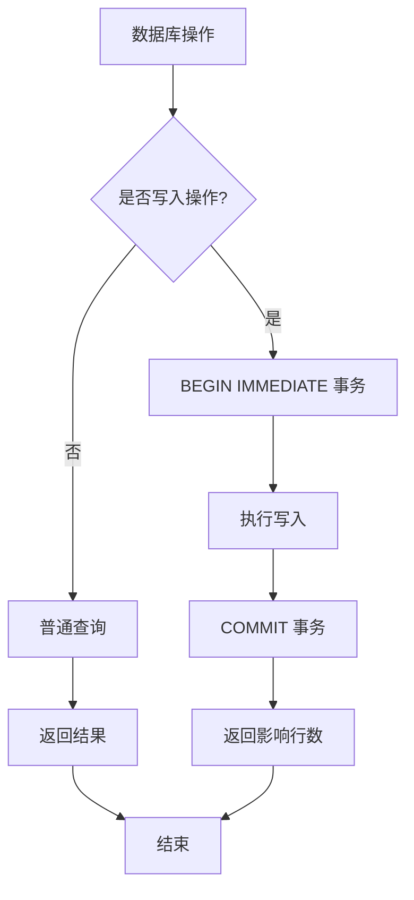
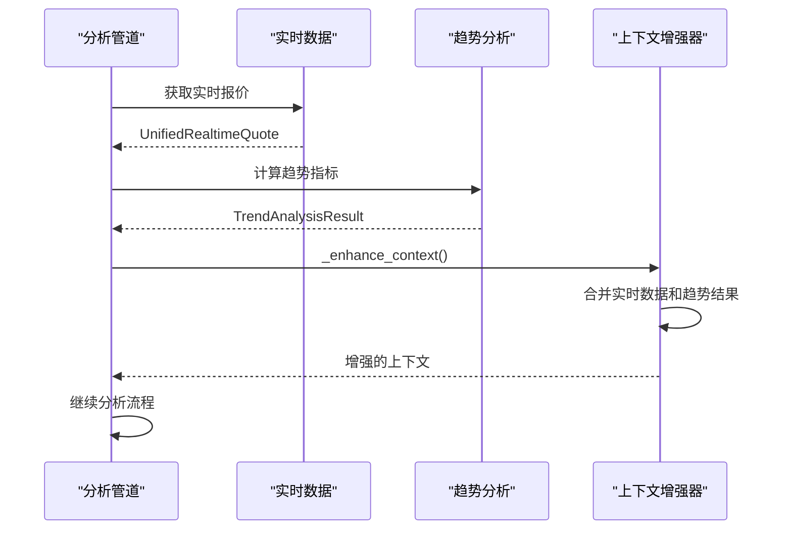
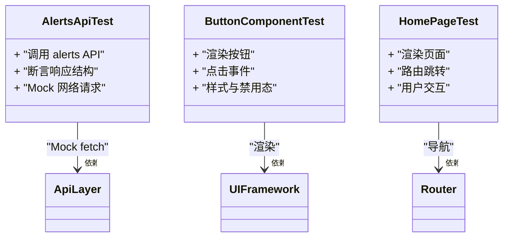
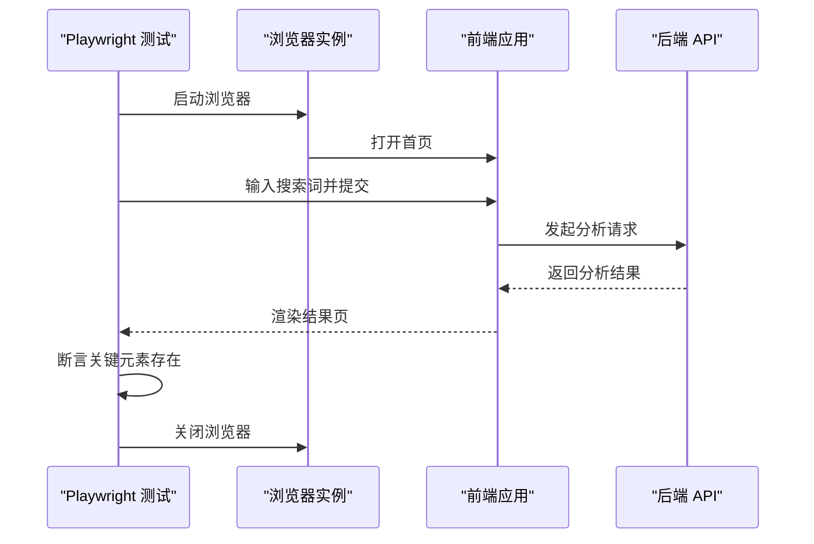
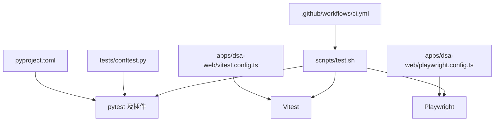

# 测试指南

<cite>
**本文引用的文件**   
- [tests/conftest.py](file://tests/conftest.py)
- [pyproject.toml](file://pyproject.toml)
- [api/app.py](file://api/app.py)
- [apps/dsa-web/vitest.config.ts](file://apps/dsa-web/vitest.config.ts)
- [apps/dsa-web/playwright.config.ts](file://apps/dsa-web/playwright.config.ts)
- [apps/dsa-web/e2e/smoke.spec.ts](file://apps/dsa-web/e2e/smoke.spec.ts)
- [apps/dsa-web/e2e/report-markdown.spec.ts](file://apps/dsa-web/e2e/report-markdown.spec.ts)
- [scripts/test.sh](file://scripts/test.sh)
- [.github/workflows/ci.yml](file://.github/workflows/ci.yml)
- [apps/dsa-web/src/api/__tests__/alerts.test.ts](file://apps/dsa-web/src/api/__tests__/alerts.test.ts)
- [apps/dsa-web/src/components/common/__tests__/Button.test.tsx](file://apps/dsa-web/src/components/common/__tests__/Button.test.tsx)
- [apps/dsa-web/src/pages/HomePage.test.tsx](file://apps/dsa-web/src/pages/HomePage.test.tsx)
- [apps/dsa-web/tests/ui_governance.test.ts](file://apps/dsa-web/tests/ui_governance.test.ts)
- [apps/dsa-web/tests/system_config_i18n.test.ts](file://apps/dsa-web/tests/system_config_i18n.test.ts)
- [apps/dsa-web/tests/login-theme-tokens.test.ts](file://apps/dsa-web/tests/login-theme-tokens.test.ts)
- [apps/dsa-web/tests/index.theme-bootstrap.test.ts](file://apps/dsa-web/tests/index.theme-bootstrap.test.ts)
- [apps/dsa-web/tests/settings_field_description_fallback.test.tsx](file://apps/dsa-web/tests/settings_field_description_fallback.test.tsx)
- [tests/test_api_health.py](file://tests/test_api_health.py)
- [tests/test_auth.py](file://tests/test_auth.py)
- [tests/test_alerts_docs.py](file://tests/test_alerts_docs.py)
- [tests/test_stock_index_loader.py](file://tests/test_stock_index_loader.py)
- [tests/test_btc_execution_alignment.py](file://tests/test_btc_execution_alignment.py)
- [tests/test_crypto_backtest_engine.py](file://tests/test_crypto_backtest_engine.py)
- [tests/test_storage.py](file://tests/test_storage.py)
- [tests/test_pipeline_realtime_indicators.py](file://tests/test_pipeline_realtime_indicators.py)
- [src/core/crypto_backtest_engine.py](file://src/core/crypto_backtest_engine.py)
- [src/storage.py](file://src/storage.py)
- [src/core/pipeline.py](file://src/core/pipeline.py)
</cite>

## 更新摘要
**变更内容**   
- 新增 BTC 执行对齐测试，覆盖风险管理与市场条件验证
- 扩展加密回测引擎测试，支持 v3-v5 版本合约与永续合约
- 增强存储层测试，涵盖并发安全、数据迁移与 WAL 模式
- 完善管道实时指标测试，确保盘中分析准确性
- 更新测试架构以支持新的风险管理功能

## 目录
1. [简介](#简介)
2. [项目结构](#项目结构)
3. [核心组件](#核心组件)
4. [架构总览](#架构总览)
5. [详细组件分析](#详细组件分析)
6. [依赖分析](#依赖分析)
7. [性能考虑](#性能考虑)
8. [故障排查指南](#故障排查指南)
9. [结论](#结论)
10. [附录](#附录)

## 简介
本指南面向后端（Python/pytest）、前端（Vitest）与端到端（Playwright E2E）三类测试，覆盖单元测试、集成测试与端到端测试的编写、执行与持续集成流程。文档基于仓库现有测试结构与配置进行系统化梳理，特别关注新增的 BTC 执行对齐、加密回测引擎、存储操作和管道实时指标的测试覆盖，帮助开发者快速上手并建立稳定的质量保障体系。

## 项目结构
本项目采用前后端分离架构：
- 后端使用 Python + FastAPI，测试框架为 pytest；测试用例集中于 tests 目录，并通过 conftest.py 提供全局夹具与共享逻辑。
- 前端位于 apps/dsa-web，使用 Vite + Vitest 进行单元测试与组件测试，使用 Playwright 进行端到端测试。
- 脚本与 CI 分别位于 scripts 与 .github/workflows，统一编排测试命令与流水线。

**图表来源** 
- [api/app.py](file://api/app.py)
- [tests/conftest.py](file://tests/conftest.py)
- [tests/test_btc_execution_alignment.py](file://tests/test_btc_execution_alignment.py)
- [tests/test_crypto_backtest_engine.py](file://tests/test_crypto_backtest_engine.py)
- [tests/test_storage.py](file://tests/test_storage.py)
- [tests/test_pipeline_realtime_indicators.py](file://tests/test_pipeline_realtime_indicators.py)
- [apps/dsa-web/vitest.config.ts](file://apps/dsa-web/vitest.config.ts)
- [apps/dsa-web/playwright.config.ts](file://apps/dsa-web/playwright.config.ts)
- [scripts/test.sh](file://scripts/test.sh)
- [.github/workflows/ci.yml](file://.github/workflows/ci.yml)

**章节来源**
- [tests/conftest.py](file://tests/conftest.py)
- [pyproject.toml](file://pyproject.toml)
- [scripts/test.sh](file://scripts/test.sh)
- [.github/workflows/ci.yml](file://.github/workflows/ci.yml)

## 核心组件
- pytest 测试框架与夹具
  - 通过 tests/conftest.py 集中管理数据库、HTTP 客户端、Mock 等夹具，供所有后端测试复用。
  - 在 pyproject.toml 中声明 pytest 插件与运行参数（如覆盖率、异步支持）。
- Vitest 前端测试
  - 通过 apps/dsa-web/vitest.config.ts 配置测试环境、匹配规则与覆盖率收集。
  - 组件与工具函数测试位于 src/**/__tests__ 目录，遵循就近原则。
- Playwright E2E 测试
  - 通过 apps/dsa-web/playwright.config.ts 配置浏览器、超时、截图与报告。
  - E2E 用例位于 apps/dsa-web/e2e，模拟真实用户操作路径。

**章节来源**
- [tests/conftest.py](file://tests/conftest.py)
- [pyproject.toml](file://pyproject.toml)
- [apps/dsa-web/vitest.config.ts](file://apps/dsa-web/vitest.config.ts)
- [apps/dsa-web/playwright.config.ts](file://apps/dsa-web/playwright.config.ts)

## 架构总览
下图展示从代码到测试执行的总体流程：开发提交触发 CI，CI 依次运行后端 pytest、前端 Vitest 与 Playwright E2E，最终汇总结果与覆盖率。

**图表来源** 
- [.github/workflows/ci.yml](file://.github/workflows/ci.yml)
- [scripts/test.sh](file://scripts/test.sh)
- [tests/conftest.py](file://tests/conftest.py)
- [tests/test_btc_execution_alignment.py](file://tests/test_btc_execution_alignment.py)
- [tests/test_crypto_backtest_engine.py](file://tests/test_crypto_backtest_engine.py)
- [tests/test_storage.py](file://tests/test_storage.py)
- [tests/test_pipeline_realtime_indicators.py](file://tests/test_pipeline_realtime_indicators.py)
- [apps/dsa-web/vitest.config.ts](file://apps/dsa-web/vitest.config.ts)
- [apps/dsa-web/playwright.config.ts](file://apps/dsa-web/playwright.config.ts)

## 详细组件分析

### 后端测试（pytest）
- 测试组织
  - 按功能模块划分测试文件，例如 test_api_health.py、test_auth.py、test_alerts_docs.py、test_stock_index_loader.py 等。
  - 公共夹具与共享逻辑集中在 tests/conftest.py，便于跨用例复用。
- 数据准备与 Mock
  - 使用 fixtures 构造测试数据（如 HTTP 客户端、数据库连接、外部服务桩）。
  - 对第三方依赖（网络请求、LLM、存储）进行 Mock，确保测试稳定与可重复。
- 异步测试处理
  - 针对异步接口或协程，使用 pytest-asyncio 提供的异步测试能力（由 pyproject.toml 启用）。
- 覆盖率要求
  - 在 pyproject.toml 中配置覆盖率阈值与统计范围，保证关键路径被覆盖。

**图表来源** 
- [tests/conftest.py](file://tests/conftest.py)
- [pyproject.toml](file://pyproject.toml)

**章节来源**
- [tests/test_api_health.py](file://tests/test_api_health.py)
- [tests/test_auth.py](file://tests/test_auth.py)
- [tests/test_alerts_docs.py](file://tests/test_alerts_docs.py)
- [tests/test_stock_index_loader.py](file://tests/test_stock_index_loader.py)
- [tests/conftest.py](file://tests/conftest.py)
- [pyproject.toml](file://pyproject.toml)

### BTC 执行对齐测试
新增的 BTC 执行对齐测试覆盖了风险管理功能的关键场景：

- **执行计划验证**：测试无效 BTC 交易计划被正确标注而非降级
- **方向建议保持**：有效 BTC 交易计划保持原始方向建议
- **确认价格保护**：确保最小风险回报比在确认价格时得到保护
- **执行阶梯不匹配**：检测执行阶梯中的入场价和不生效价的差异
- **波动性触发**：测试晚期波动性触发禁用即时日内入场
- **多时间框架对齐**：验证对齐的时间框架阻止反向日内计划
- **极端波动性**：测试 EWMA 波动性覆盖限制头寸规模

**图表来源** 
- [tests/test_btc_execution_alignment.py](file://tests/test_btc_execution_alignment.py)
- [src/analyzer.py](file://src/analyzer.py)

**章节来源**
- [tests/test_btc_execution_alignment.py](file://tests/test_btc_execution_alignment.py)

### 加密回测引擎测试
加密回测引擎测试覆盖了 v3-v5 版本的完整功能：

- **基础回测功能**：多头和空头计划的止盈止损测试
- **头寸规模控制**：位置乘数上限减少风险预算和名义金额
- **动态权益调整**：使用前一完成权益进行动态规模调整
- **计划质量评分**：确定性的质量评分独立于置信度文本
- **成本敏感性分析**：费用滑点网格覆盖
- **永续合约支持**：资金费率扣除和平仓计算
- **清算机制**：基于标记价格的清算逻辑
- **版本兼容性**：v3-v5 各版本的特定行为验证

**图表来源** 
- [tests/test_crypto_backtest_engine.py](file://tests/test_crypto_backtest_engine.py)
- [src/core/crypto_backtest_engine.py](file://src/core/crypto_backtest_engine.py)

**章节来源**
- [tests/test_crypto_backtest_engine.py](file://tests/test_crypto_backtest_engine.py)
- [src/core/crypto_backtest_engine.py](file://src/core/crypto_backtest_engine.py)

### 存储操作测试
存储操作测试涵盖了数据库管理的各个方面：

- **SQLite WAL 模式**：验证写事务使用 BEGIN IMMEDIATE
- **并发安全性**：测试多线程环境下的数据库初始化
- **冷启动等待**：确保 get_instance() 等待初始化完成
- **直接构造序列化**：防止并发构造冲突
- **错误传播**：保留原始初始化错误
- **数据迁移**：加密货币回测结果的执行状态规范化
- **狙击点位解析**：复杂文本中的数值提取

**图表来源** 
- [tests/test_storage.py](file://tests/test_storage.py)
- [src/storage.py](file://src/storage.py)

**章节来源**
- [tests/test_storage.py](file://tests/test_storage.py)
- [src/storage.py](file://src/storage.py)

### 管道实时指标测试
管道实时指标测试确保盘中分析的准确性：

- **历史数据增强**：追加或更新最后一行数据
- **均线状态计算**：多头、空头和震荡状态的识别
- **上下文增强**：使用实时行情和趋势结果覆盖 today 字段
- **BTC 技术提示**：加密货币专用交易框架注入
- **小时线日内框架**：独立判断日线偏向的小时线机会
- **实时元数据传播**：来源、时间戳和回退信息传递

**图表来源** 
- [tests/test_pipeline_realtime_indicators.py](file://tests/test_pipeline_realtime_indicators.py)
- [src/core/pipeline.py](file://src/core/pipeline.py)

**章节来源**
- [tests/test_pipeline_realtime_indicators.py](file://tests/test_pipeline_realtime_indicators.py)
- [src/core/pipeline.py](file://src/core/pipeline.py)

### 前端测试（Vitest）
- 配置要点
  - apps/dsa-web/vitest.config.ts 定义测试入口、匹配模式、覆盖率与浏览器环境。
- 单元测试与组件测试
  - 工具函数与 API 层测试位于 src/api/__tests__，组件测试位于各组件下的 __tests__ 目录。
  - 页面级测试位于 pages 下的 *.test.tsx，验证路由与交互。
- Mock 策略
  - 对 fetch/XHR、路由、上下文与状态库进行 Mock，隔离外部依赖。
- 异步测试
  - 使用 vitest 内置的 async/await 支持，结合 flushPromises 等待异步更新。

**图表来源** 
- [apps/dsa-web/src/api/__tests__/alerts.test.ts](file://apps/dsa-web/src/api/__tests__/alerts.test.ts)
- [apps/dsa-web/src/components/common/__tests__/Button.test.tsx](file://apps/dsa-web/src/components/common/__tests__/Button.test.tsx)
- [apps/dsa-web/src/pages/HomePage.test.tsx](file://apps/dsa-web/src/pages/HomePage.test.tsx)
- [apps/dsa-web/vitest.config.ts](file://apps/dsa-web/vitest.config.ts)

**章节来源**
- [apps/dsa-web/vitest.config.ts](file://apps/dsa-web/vitest.config.ts)
- [apps/dsa-web/src/api/__tests__/alerts.test.ts](file://apps/dsa-web/src/api/__tests__/alerts.test.ts)
- [apps/dsa-web/src/components/common/__tests__/Button.test.tsx](file://apps/dsa-web/src/components/common/__tests__/Button.test.tsx)
- [apps/dsa-web/src/pages/HomePage.test.tsx](file://apps/dsa-web/src/pages/HomePage.test.tsx)

### 端到端测试（Playwright）
- 配置要点
  - apps/dsa-web/playwright.config.ts 设置浏览器、超时、重试、截图与报告输出。
- E2E 用例设计
  - e2e/smoke.spec.ts 用于冒烟测试，验证关键路径可用。
  - e2e/report-markdown.spec.ts 验证报告生成与下载流程。
- 数据与环境
  - 通过环境变量注入测试账号、基础 URL 与后端地址。
  - 使用 Page Object 模式封装页面元素与交互，提高可维护性。

**图表来源** 
- [apps/dsa-web/playwright.config.ts](file://apps/dsa-web/playwright.config.ts)
- [apps/dsa-web/e2e/smoke.spec.ts](file://apps/dsa-web/e2e/smoke.spec.ts)
- [apps/dsa-web/e2e/report-markdown.spec.ts](file://apps/dsa-web/e2e/report-markdown.spec.ts)

**章节来源**
- [apps/dsa-web/playwright.config.ts](file://apps/dsa-web/playwright.config.ts)
- [apps/dsa-web/e2e/smoke.spec.ts](file://apps/dsa-web/e2e/smoke.spec.ts)
- [apps/dsa-web/e2e/report-markdown.spec.ts](file://apps/dsa-web/e2e/report-markdown.spec.ts)

### 前端额外测试（UI 治理与主题）
- 主题与 UI 治理测试位于 apps/dsa-web/tests，涵盖主题令牌、国际化回退、字段描述回退等场景。
- 这些测试确保 UI 一致性与可访问性，避免视觉回归。

**章节来源**
- [apps/dsa-web/tests/ui_governance.test.ts](file://apps/dsa-web/tests/ui_governance.test.ts)
- [apps/dsa-web/tests/system_config_i18n.test.ts](file://apps/dsa-web/tests/system_config_i18n.test.ts)
- [apps/dsa-web/tests/login-theme-tokens.test.ts](file://apps/dsa-web/tests/login-theme-tokens.test.ts)
- [apps/dsa-web/tests/index.theme-bootstrap.test.ts](file://apps/dsa-web/tests/index.theme-bootstrap.test.ts)
- [apps/dsa-web/tests/settings_field_description_fallback.test.tsx](file://apps/dsa-web/tests/settings_field_description_fallback.test.tsx)

## 依赖分析
- 后端依赖
  - pytest 及其插件（如 asyncio、覆盖率）由 pyproject.toml 管理。
  - 测试夹具与共享逻辑集中在 tests/conftest.py。
- 前端依赖
  - Vitest 与相关插件由 apps/dsa-web/vitest.config.ts 管理。
  - Playwright 由 apps/dsa-web/playwright.config.ts 管理。
- 脚本与 CI
  - scripts/test.sh 统一编排测试命令。
  - .github/workflows/ci.yml 定义流水线步骤与并行策略。

**图表来源** 
- [pyproject.toml](file://pyproject.toml)
- [tests/conftest.py](file://tests/conftest.py)
- [apps/dsa-web/vitest.config.ts](file://apps/dsa-web/vitest.config.ts)
- [apps/dsa-web/playwright.config.ts](file://apps/dsa-web/playwright.config.ts)
- [scripts/test.sh](file://scripts/test.sh)
- [.github/workflows/ci.yml](file://.github/workflows/ci.yml)

**章节来源**
- [pyproject.toml](file://pyproject.toml)
- [tests/conftest.py](file://tests/conftest.py)
- [apps/dsa-web/vitest.config.ts](file://apps/dsa-web/vitest.config.ts)
- [apps/dsa-web/playwright.config.ts](file://apps/dsa-web/playwright.config.ts)
- [scripts/test.sh](file://scripts/test.sh)
- [.github/workflows/ci.yml](file://.github/workflows/ci.yml)

## 性能考虑
- 后端性能测试
  - 使用 pytest-benchmark 或 locust 对热点接口进行基准与压力测试。
  - 关注数据库查询、缓存命中与并发模型（异步 I/O）。
- 前端性能测试
  - 使用 Vitest 的 performance 钩子与 Lighthouse CI 评估渲染性能。
  - 对大列表与复杂组件进行虚拟滚动与懒加载优化。
- E2E 性能
  - 合理设置超时与重试，避免网络抖动导致的误报。
  - 使用无头模式与并行执行提升流水线速度。

[本节为通用指导，不直接分析具体文件]

## 故障排查指南
- 常见 pytest 问题
  - 夹具未正确加载：检查 tests/conftest.py 的作用域与导入路径。
  - 异步测试未启用：确认 pyproject.toml 中已启用 asyncio 插件。
  - 覆盖率统计异常：检查 include/exclude 配置与测试入口。
- 常见 Vitest 问题
  - 组件渲染失败：检查 DOM 环境与 polyfill。
  - Mock 未生效：确认拦截点与模块加载顺序。
  - 异步更新未刷新：使用 flushPromises 或 waitFor。
- 常见 Playwright 问题
  - 页面元素定位失败：优先使用语义化选择器，必要时增加等待条件。
  - 截图缺失：检查输出目录权限与截图开关。
  - 浏览器崩溃：降低并发或调整内存限制。

**章节来源**
- [tests/conftest.py](file://tests/conftest.py)
- [pyproject.toml](file://pyproject.toml)
- [apps/dsa-web/vitest.config.ts](file://apps/dsa-web/vitest.config.ts)
- [apps/dsa-web/playwright.config.ts](file://apps/dsa-web/playwright.config.ts)

## 结论
通过 pytest、Vitest 与 Playwright 的组合，本项目实现了从单元到端到端的完整测试闭环。新增的 BTC 执行对齐、加密回测引擎、存储操作和管道实时指标测试显著增强了风险管理功能的测试覆盖。建议持续完善夹具与 Mock 策略，提升覆盖率与稳定性，并在 CI 中固化测试流程，确保每次变更都能得到充分验证。

[本节为总结性内容，不直接分析具体文件]

## 附录
- 常用命令
  - 后端测试：参考 scripts/test.sh 中的 pytest 命令。
  - 前端单测：参考 apps/dsa-web/vitest.config.ts 与 package.json 脚本。
  - E2E 测试：参考 apps/dsa-web/playwright.config.ts 与 e2e 用例。
- 覆盖率目标
  - 后端：关键业务模块覆盖率不低于 80%。
  - 前端：组件与工具函数覆盖率不低于 70%。
- 调试技巧
  - 后端：使用 pytest -s 打印日志，或使用 IDE 断点调试。
  - 前端：使用 vitest --watch 与浏览器开发者工具。
  - E2E：使用 playwright test --debug 逐步执行。

[本节为补充信息，不直接分析具体文件]