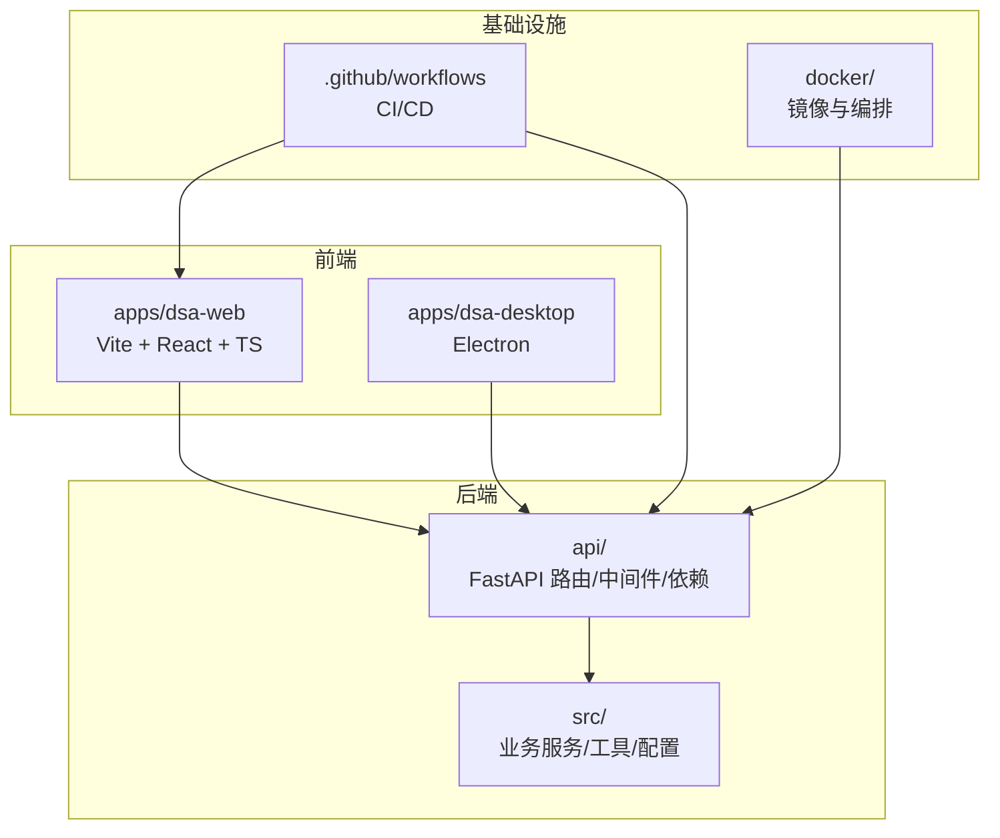
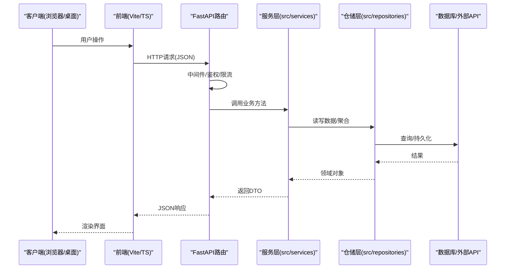
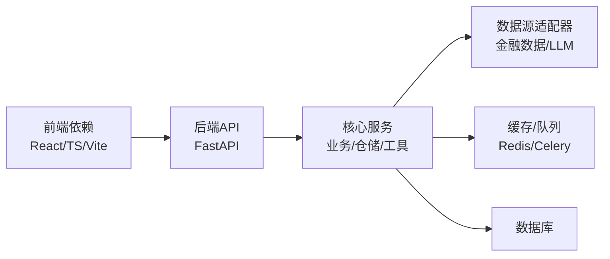

# 编码规范

<cite>
**本文引用的文件**   
- [pyproject.toml](file://pyproject.toml)
- [setup.cfg](file://setup.cfg)
- [requirements.txt](file://requirements.txt)
- [main.py](file://main.py)
- [server.py](file://server.py)
- [webui.py](file://webui.py)
- [api/app.py](file://api/app.py)
- [api/deps.py](file://api/deps.py)
- [api/v1/router.py](file://api/v1/router.py)
- [api/middlewares/error_handler.py](file://api/middlewares/error_handler.py)
- [src/config.py](file://src/config.py)
- [src/logging_config.py](file://src/logging_config.py)
- [src/scheduler.py](file://src/scheduler.py)
- [apps/dsa-web/package.json](file://apps/dsa-web/package.json)
- [apps/dsa-web/eslint.config.js](file://apps/dsa-web/eslint.config.js)
- [apps/dsa-web/tsconfig.json](file://apps/dsa-web/tsconfig.json)
- [apps/dsa-web/vite.config.ts](file://apps/dsa-web/vite.config.ts)
- [apps/dsa-web/playwright.config.ts](file://apps/dsa-web/playwright.config.ts)
- [apps/dsa-web/vitest.config.ts](file://apps/dsa-web/vitest.config.ts)
- [.github/workflows](file://.github/workflows)
- [.github/PULL_REQUEST_TEMPLATE.md](file://.github/PULL_REQUEST_TEMPLATE.md)
- [scripts/test.sh](file://scripts/test.sh)
</cite>

## 目录
1. [简介](#简介)
2. [项目结构](#项目结构)
3. [核心组件](#核心组件)
4. [架构总览](#架构总览)
5. [详细组件分析](#详细组件分析)
6. [依赖分析](#依赖分析)
7. [性能考虑](#性能考虑)
8. [故障排查指南](#故障排查指南)
9. [结论](#结论)
10. [附录](#附录)

## 简介
本规范面向AI股票分析项目的后端（Python/FastAPI）与前端（TypeScript/React/Vite），覆盖代码风格、命名约定、注释规范、模块设计模式、错误处理策略、Git工作流与分支管理、提交信息规范，以及代码质量检查工具配置与使用。目标是提升一致性、可维护性与交付质量，降低协作成本与回归风险。

## 项目结构
仓库采用多语言、多应用的分层组织：
- 后端服务：基于FastAPI的REST API与调度任务，位于 api/ 与 src/
- 前端应用：基于Vite+React+TypeScript，位于 apps/dsa-web
- 桌面端：Electron主进程与预加载脚本，位于 apps/dsa-desktop
- 数据与策略：数据获取器、策略配置等，位于 data_provider/ 与 strategies/
- 测试与脚本：pytest用例与CI脚本，位于 tests/ 与 scripts/
- 文档与配置：README、部署说明、Docker与GitHub Actions等

**图表来源** 
- [api/app.py](file://api/app.py)
- [apps/dsa-web/vite.config.ts](file://apps/dsa-web/vite.config.ts)
- [apps/dsa-desktop/main.js](file://apps/dsa-desktop/main.js)
- [.github/workflows](file://.github/workflows)
- [docker/docker-compose.yml](file://docker/docker-compose.yml)

**章节来源**
- [api/app.py](file://api/app.py)
- [apps/dsa-web/package.json](file://apps/dsa-web/package.json)
- [apps/dsa-desktop/package.json](file://apps/dsa-desktop/package.json)

## 核心组件
- 后端入口与路由
  - FastAPI应用初始化、全局中间件、异常处理器、依赖注入
  - v1路由按领域划分，schemas集中定义请求/响应模型
- 前端工程化
  - Vite构建、ESLint类型检查、Vitest单元测试、Playwright端到端测试
  - TypeScript严格模式、路径别名、环境变量注入
- 配置与日志
  - 统一配置加载、结构化日志、分级输出
- 任务调度
  - 定时任务与后台任务队列，保证幂等与重试

**章节来源**
- [api/app.py](file://api/app.py)
- [api/v1/router.py](file://api/v1/router.py)
- [api/deps.py](file://api/deps.py)
- [src/config.py](file://src/config.py)
- [src/logging_config.py](file://src/logging_config.py)
- [src/scheduler.py](file://src/scheduler.py)
- [apps/dsa-web/package.json](file://apps/dsa-web/package.json)
- [apps/dsa-web/eslint.config.js](file://apps/dsa-web/eslint.config.js)
- [apps/dsa-web/tsconfig.json](file://apps/dsa-web/tsconfig.json)
- [apps/dsa-web/vite.config.ts](file://apps/dsa-web/vite.config.ts)
- [apps/dsa-web/vitest.config.ts](file://apps/dsa-web/vitest.config.ts)
- [apps/dsa-web/playwright.config.ts](file://apps/dsa-web/playwright.config.ts)

## 架构总览
后端采用“路由-服务-仓储”分层，结合Pydantic进行输入校验与序列化；前端以功能域为维度组织组件与hooks，通过统一的API客户端访问后端。

**图表来源** 
- [api/app.py](file://api/app.py)
- [api/v1/router.py](file://api/v1/router.py)
- [api/deps.py](file://api/deps.py)
- [src/services](file://src/services)
- [src/repositories](file://src/repositories)

## 详细组件分析

### Python后端编码规范
- 代码风格
  - 遵循PEP 8，使用统一格式化与静态检查（见pyproject与setup.cfg）
  - 函数与变量采用小写下划线命名；类名大驼峰；常量全大写
  - 单行长度建议不超过120字符；导入分组与排序一致
- 模块与包组织
  - 路由按领域拆分至 api/v1/endpoints；schema集中存放于 schemas/
  - 业务逻辑下沉到 src/services；数据访问在 src/repositories
  - 公共能力封装在 src/utils 与 src/core
- 类型与校验
  - 使用Pydantic v2定义请求/响应模型，开启严格模式
  - 对第三方库返回值进行边界校验与默认值兜底
- 错误处理
  - 统一异常处理器捕获并转换为标准HTTP错误码与消息
  - 区分业务异常与系统异常，记录上下文与追踪ID
- 日志与可观测性
  - 结构化JSON日志，包含请求ID、耗时、关键参数脱敏
  - 分级输出（debug/info/warning/error），生产环境仅info及以上
- 配置与环境
  - 所有敏感信息通过环境变量注入，禁止硬编码
  - 配置项集中管理，提供默认值与校验失败提示
- 并发与资源
  - I/O密集型使用异步；CPU密集型任务放入任务队列
  - 连接池复用、超时与重试策略明确；避免内存泄漏

**章节来源**
- [pyproject.toml](file://pyproject.toml)
- [setup.cfg](file://setup.cfg)
- [api/app.py](file://api/app.py)
- [api/middlewares/error_handler.py](file://api/middlewares/error_handler.py)
- [api/deps.py](file://api/deps.py)
- [src/config.py](file://src/config.py)
- [src/logging_config.py](file://src/logging_config.py)

### TypeScript/JavaScript编码规范
- 代码风格
  - ESLint规则启用严格模式，禁用any，强制类型推断
  - 使用Prettier统一格式；缩进2空格；分号保留
- 模块与组件
  - 组件按功能域组织，每个组件独立index导出
  - hooks与utils按职责拆分，避免巨型文件
- 类型与接口
  - 优先使用interface/type定义数据结构；避免裸any
  - API层使用强类型DTO，前后端契约由schemas驱动
- 状态与副作用
  - 使用React Hooks与Context/Store管理状态；避免跨层级props透传
  - 副作用集中在useEffect/useMutation中，注意清理与防抖
- 测试
  - 单元测试使用Vitest；组件测试使用React Testing Library
  - E2E使用Playwright，覆盖关键用户流程
- 构建与发布
  - Vite按需打包，开启Tree-shaking与代码分割
  - 环境变量通过.env.*注入，区分开发/测试/生产

**章节来源**
- [apps/dsa-web/package.json](file://apps/dsa-web/package.json)
- [apps/dsa-web/eslint.config.js](file://apps/dsa-web/eslint.config.js)
- [apps/dsa-web/tsconfig.json](file://apps/dsa-web/tsconfig.json)
- [apps/dsa-web/vite.config.ts](file://apps/dsa-web/vite.config.ts)
- [apps/dsa-web/vitest.config.ts](file://apps/dsa-web/vitest.config.ts)
- [apps/dsa-web/playwright.config.ts](file://apps/dsa-web/playwright.config.ts)

### 文件命名约定
- Python
  - 模块名小写下划线；类名大驼峰；常量全大写
  - 路由文件以动词或名词复数命名（如 stocks.py, alerts.py）
  - schema文件以领域命名（如 analysis.py, portfolio.py）
- TypeScript/JS
  - 组件文件使用PascalCase（如 StockAutocomplete.tsx）
  - hooks以use开头（如 useAuth.ts）
  - utils与types以小写下划线或驼峰（如 format.ts, systemConfig.ts）
- 通用
  - 配置文件使用kebab-case（如 tsconfig.app.json）
  - 测试文件与源文件同名加.test后缀

[无直接文件分析引用]

### 注释规范
- 模块级注释：说明模块职责、依赖与使用示例路径
- 函数/方法：描述入参、返回值、异常与副作用；复杂算法附流程图链接
- 关键决策：解释“为什么”，而非“是什么”；标注已知限制与TODO
- 对外API：保持与schema同步更新，避免过时注释

[无直接文件分析引用]

### 模块设计模式
- 分层架构：路由→服务→仓储→数据源，职责单一、边界清晰
- 依赖注入：通过FastAPI依赖系统共享会话、配置与缓存
- 工厂与注册表：Agent/Strategy/Skill等可扩展能力通过注册表动态装配
- 事件与回调：长耗时任务采用SSE/事件流推送进度
- 适配器模式：数据源与通知渠道抽象为统一接口，便于替换

**章节来源**
- [api/deps.py](file://api/deps.py)
- [src/agent/factory.py](file://src/agent/factory.py)
- [src/agent/orchestrator.py](file://src/agent/orchestrator.py)
- [src/notification.py](file://src/notification.py)

### 错误处理策略
- 后端
  - 统一异常处理器将异常映射为标准HTTP错误码与消息
  - 业务异常携带错误码与详情，便于前端分类展示
  - 外部依赖调用增加超时、重试与降级策略
- 前端
  - 网络层统一拦截错误，区分服务端错误、网络错误与超时
  - UI层提供友好的错误提示与重试入口
  - 关键路径增加错误边界，防止整页崩溃

**章节来源**
- [api/middlewares/error_handler.py](file://api/middlewares/error_handler.py)
- [apps/dsa-web/src/api/error.ts](file://apps/dsa-web/src/api/error.ts)

### Git工作流与分支管理
- 分支策略
  - main：稳定版本；release/*：发布候选；feature/*：新功能；hotfix/*：紧急修复
  - develop：集成分支，日常合并与CI验证
- 提交信息规范
  - 采用Conventional Commits：type(scope): description
  - 常见类型：feat、fix、docs、style、refactor、test、chore、ci
- 代码审查
  - PR需关联Issue；至少一名Reviewer；CI全部通过
  - 变更影响面评估与回滚方案必备
- 标签与发布
  - 语义化版本号；发布前冻结代码与文档更新

**章节来源**
- [.github/PULL_REQUEST_TEMPLATE.md](file://.github/PULL_REQUEST_TEMPLATE.md)
- [.github/workflows](file://.github/workflows)

### 代码质量检查工具配置与使用
- Python
  - 使用pyproject与setup.cfg统一配置；本地运行格式化与检查
  - 推荐IDE集成自动保存时格式化与导入排序
- TypeScript/JS
  - ESLint+Prettier：pre-commit钩子强制执行
  - TypeScript编译检查作为CI步骤
  - Vitest与Playwright在CI中并行执行
- 其他
  - Docker镜像构建与扫描纳入CI
  - 依赖安全扫描与许可证合规检查

**章节来源**
- [pyproject.toml](file://pyproject.toml)
- [setup.cfg](file://setup.cfg)
- [apps/dsa-web/eslint.config.js](file://apps/dsa-web/eslint.config.js)
- [apps/dsa-web/tsconfig.json](file://apps/dsa-web/tsconfig.json)
- [apps/dsa-web/vitest.config.ts](file://apps/dsa-web/vitest.config.ts)
- [apps/dsa-web/playwright.config.ts](file://apps/dsa-web/playwright.config.ts)
- [scripts/test.sh](file://scripts/test.sh)

## 依赖分析
- 后端依赖
  - FastAPI、Uvicorn、Pydantic、SQLAlchemy/ORM、Redis/Celery（可选）、LLM适配层
  - 数据源适配器（yfinance、tushare、akshare等）
- 前端依赖
  - React、TypeScript、Vite、Tailwind、Axios、状态管理库
  - 测试：Vitest、React Testing Library、Playwright
- 构建与CI
  - GitHub Actions、Docker、Node/Python环境矩阵

**图表来源** 
- [requirements.txt](file://requirements.txt)
- [apps/dsa-web/package.json](file://apps/dsa-web/package.json)

**章节来源**
- [requirements.txt](file://requirements.txt)
- [apps/dsa-web/package.json](file://apps/dsa-web/package.json)

## 性能考虑
- 后端
  - 异步I/O与连接池复用；减少阻塞调用
  - 热点数据缓存（Redis）；分页与增量更新
  - 批量查询与懒加载；避免N+1问题
  - 日志采样与脱敏；避免大对象序列化
- 前端
  - 组件懒加载与路由分割；图片与字体优化
  - 请求去重与缓存；列表虚拟滚动
  - 避免不必要的重渲染；合理使用memo与useCallback
- 内存管理
  - 及时释放临时对象与大数组；避免闭包持有引用
  - 监控GC与堆快照；定位内存泄漏点

[无直接文件分析引用]

## 故障排查指南
- 常见问题
  - 端口冲突与服务启动失败：检查环境变量与端口占用
  - 数据库连接失败：核对连接串、权限与网络策略
  - 外部API限流与超时：调整重试与退避策略
  - 前端构建失败：清理缓存与锁定依赖版本
- 诊断步骤
  - 查看结构化日志与请求追踪ID
  - 启用调试模式与慢查询日志
  - 使用APM与链路追踪定位瓶颈
- 恢复策略
  - 快速回滚到上一稳定版本
  - 灰度发布与流量切换
  - 熔断与降级开关

**章节来源**
- [src/logging_config.py](file://src/logging_config.py)
- [api/middlewares/error_handler.py](file://api/middlewares/error_handler.py)

## 结论
本规范围绕“一致性、可维护性、可观测性、安全性”四大目标，覆盖前后端代码风格、模块设计、错误处理、Git流程与质量工具。落地时需结合团队习惯与项目规模逐步推进，并通过CI门禁保障执行。持续改进的关键在于自动化与反馈闭环。

## 附录
- 常用命令
  - Python：格式化、类型检查、测试、构建镜像
  - 前端：安装依赖、开发、构建、测试、E2E
- 参考模板
  - 提交信息模板、PR模板、Issue模板
- 扩展阅读
  - PEP 8、Conventional Commits、React最佳实践

[无直接文件分析引用]