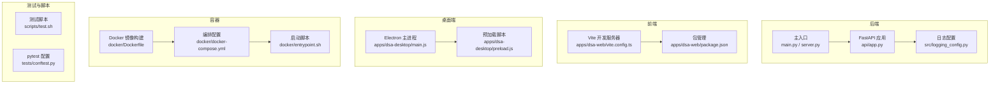
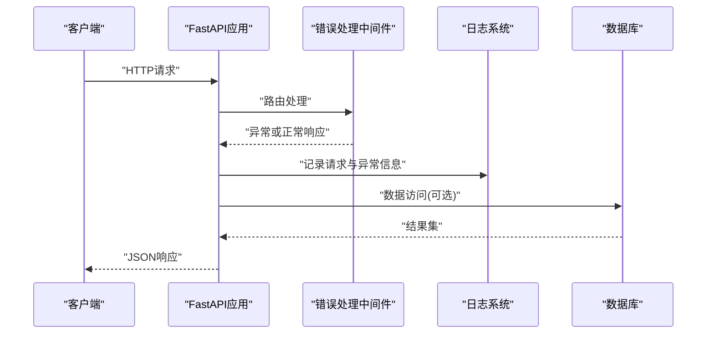
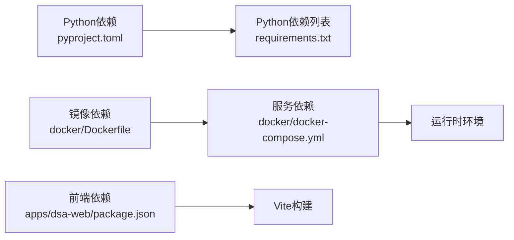

# 调试指南

<cite>
**本文档引用的文件**   
- [main.py](file://main.py)
- [server.py](file://server.py)
- [webui.py](file://webui.py)
- [pyproject.toml](file://pyproject.toml)
- [requirements.txt](file://requirements.txt)
- [src/logging_config.py](file://src/logging_config.py)
- [api/app.py](file://api/app.py)
- [api/middlewares/error_handler.py](file://api/middlewares/error_handler.py)
- [docker/Dockerfile](file://docker/Dockerfile)
- [docker/docker-compose.yml](file://docker/docker-compose.yml)
- [docker/entrypoint.sh](file://docker/entrypoint.sh)
- [apps/dsa-web/package.json](file://apps/dsa-web/package.json)
- [apps/dsa-web/vite.config.ts](file://apps/dsa-web/vite.config.ts)
- [apps/dsa-desktop/main.js](file://apps/dsa-desktop/main.js)
- [apps/dsa-desktop/preload.js](file://apps/dsa-desktop/preload.js)
- [scripts/test.sh](file://scripts/test.sh)
- [tests/conftest.py](file://tests/conftest.py)
</cite>

## 目录
1. [简介](#简介)
2. [项目结构](#项目结构)
3. [核心组件](#核心组件)
4. [架构总览](#架构总览)
5. [详细组件分析](#详细组件分析)
6. [依赖分析](#依赖分析)
7. [性能考虑](#性能考虑)
8. [故障排查指南](#故障排查指南)
9. [结论](#结论)
10. [附录](#附录)

## 简介
本指南面向Python后端、Node.js前端、数据库与容器化环境的调试实践，覆盖日志配置、断点调试、性能分析、常见错误诊断、远程调试与容器内调试、监控告警与问题排查流程。文档基于仓库现有结构与实现进行总结，帮助开发者快速定位并解决问题。

## 项目结构
本项目包含：
- Python后端API服务（FastAPI）
- Node.js Web前端（Vite + React）
- Electron桌面应用
- Docker容器化部署
- 测试与脚本工具

**图表来源** 
- [api/app.py:1-200](file://api/app.py#L1-L200)
- [src/logging_config.py:1-200](file://src/logging_config.py#L1-L200)
- [main.py:1-200](file://main.py#L1-L200)
- [server.py:1-200](file://server.py#L1-L200)
- [apps/dsa-web/vite.config.ts:1-200](file://apps/dsa-web/vite.config.ts#L1-L200)
- [apps/dsa-web/package.json:1-200](file://apps/dsa-web/package.json#L1-L200)
- [apps/dsa-desktop/main.js:1-200](file://apps/dsa-desktop/main.js#L1-L200)
- [apps/dsa-desktop/preload.js:1-200](file://apps/dsa-desktop/preload.js#L1-L200)
- [docker/Dockerfile:1-200](file://docker/Dockerfile#L1-L200)
- [docker/docker-compose.yml:1-200](file://docker/docker-compose.yml#L1-L200)
- [docker/entrypoint.sh:1-200](file://docker/entrypoint.sh#L1-L200)
- [scripts/test.sh:1-200](file://scripts/test.sh#L1-L200)
- [tests/conftest.py:1-200](file://tests/conftest.py#L1-L200)

**章节来源**
- [main.py:1-200](file://main.py#L1-L200)
- [server.py:1-200](file://server.py#L1-L200)
- [api/app.py:1-200](file://api/app.py#L1-L200)
- [src/logging_config.py:1-200](file://src/logging_config.py#L1-L200)
- [apps/dsa-web/vite.config.ts:1-200](file://apps/dsa-web/vite.config.ts#L1-L200)
- [apps/dsa-web/package.json:1-200](file://apps/dsa-web/package.json#L1-L200)
- [apps/dsa-desktop/main.js:1-200](file://apps/dsa-desktop/main.js#L1-L200)
- [apps/dsa-desktop/preload.js:1-200](file://apps/dsa-desktop/preload.js#L1-L200)
- [docker/Dockerfile:1-200](file://docker/Dockerfile#L1-L200)
- [docker/docker-compose.yml:1-200](file://docker/docker-compose.yml#L1-L200)
- [docker/entrypoint.sh:1-200](file://docker/entrypoint.sh#L1-L200)
- [scripts/test.sh:1-200](file://scripts/test.sh#L1-L200)
- [tests/conftest.py:1-200](file://tests/conftest.py#L1-L200)

## 核心组件
- 后端服务：FastAPI应用、中间件、统一错误处理、日志配置
- 前端服务：Vite开发服务器、包管理与脚本、类型与构建配置
- 桌面端：Electron主进程与预加载脚本
- 容器化：镜像构建、编排与启动脚本
- 测试与脚本：pytest配置、测试执行脚本

**章节来源**
- [api/app.py:1-200](file://api/app.py#L1-L200)
- [api/middlewares/error_handler.py:1-200](file://api/middlewares/error_handler.py#L1-L200)
- [src/logging_config.py:1-200](file://src/logging_config.py#L1-L200)
- [apps/dsa-web/vite.config.ts:1-200](file://apps/dsa-web/vite.config.ts#L1-L200)
- [apps/dsa-web/package.json:1-200](file://apps/dsa-web/package.json#L1-L200)
- [apps/dsa-desktop/main.js:1-200](file://apps/dsa-desktop/main.js#L1-L200)
- [apps/dsa-desktop/preload.js:1-200](file://apps/dsa-desktop/preload.js#L1-L200)
- [docker/Dockerfile:1-200](file://docker/Dockerfile#L1-L200)
- [docker/docker-compose.yml:1-200](file://docker/docker-compose.yml#L1-L200)
- [docker/entrypoint.sh:1-200](file://docker/entrypoint.sh#L1-L200)
- [scripts/test.sh:1-200](file://scripts/test.sh#L1-L200)
- [tests/conftest.py:1-200](file://tests/conftest.py#L1-L200)

## 架构总览
后端通过FastAPI暴露REST接口，使用统一错误处理中间件捕获异常并输出结构化日志；前端通过Vite提供开发服务器与热重载；桌面端通过Electron封装前端资源；容器化环境由Docker与Compose编排，启动脚本负责初始化与运行。

**图表来源** 
- [api/app.py:1-200](file://api/app.py#L1-L200)
- [api/middlewares/error_handler.py:1-200](file://api/middlewares/error_handler.py#L1-L200)
- [src/logging_config.py:1-200](file://src/logging_config.py#L1-L200)

**章节来源**
- [api/app.py:1-200](file://api/app.py#L1-L200)
- [api/middlewares/error_handler.py:1-200](file://api/middlewares/error_handler.py#L1-L200)
- [src/logging_config.py:1-200](file://src/logging_config.py#L1-L200)

## 详细组件分析

### Python后端调试
- 日志配置
  - 使用集中式日志配置模块，支持不同级别与输出目标
  - 建议在生产环境启用结构化日志，便于聚合与分析
- 断点调试
  - 本地开发使用IDE断点（如VS Code、PyCharm）
  - 在关键路由与服务层设置断点，观察输入输出与异常堆栈
- 性能分析
  - 使用cProfile或line_profiler对热点函数进行分析
  - 结合APM工具（如Prometheus+Grafana）监控QPS、延迟与错误率
- 远程调试
  - 通过环境变量或命令行参数启用远程调试端口
  - 确保防火墙与安全组开放相应端口
- 容器内调试
  - 在Docker镜像中安装调试工具（如pdb、gdb）
  - 使用docker exec进入容器进行交互式调试

**章节来源**
- [src/logging_config.py:1-200](file://src/logging_config.py#L1-L200)
- [api/app.py:1-200](file://api/app.py#L1-L200)
- [api/middlewares/error_handler.py:1-200](file://api/middlewares/error_handler.py#L1-L200)
- [docker/Dockerfile:1-200](file://docker/Dockerfile#L1-L200)
- [docker/entrypoint.sh:1-200](file://docker/entrypoint.sh#L1-L200)

### Node.js前端调试
- 开发服务器
  - Vite提供热重载与源码映射，便于断点调试
  - 在浏览器开发者工具中设置断点，查看网络请求与状态
- 包管理与脚本
  - package.json定义开发与构建脚本，支持lint、test与build
  - 使用npm/yarn命令快速启动与调试
- 性能分析
  - 使用Chrome DevTools的Performance面板分析渲染与网络
  - 结合webpack-bundle-analyzer分析包体积
- 远程调试
  - 通过VS Code的Node.js调试配置连接远程进程
  - 确保环境变量与路径映射正确

**章节来源**
- [apps/dsa-web/vite.config.ts:1-200](file://apps/dsa-web/vite.config.ts#L1-L200)
- [apps/dsa-web/package.json:1-200](file://apps/dsa-web/package.json#L1-L200)

### 桌面端调试
- Electron主进程
  - main.js负责窗口创建与生命周期管理
  - 在主进程中设置断点，检查IPC通信与资源加载
- 预加载脚本
  - preload.js用于安全地暴露API给渲染进程
  - 在渲染进程中使用console.log与断点调试

**章节来源**
- [apps/dsa-desktop/main.js:1-200](file://apps/dsa-desktop/main.js#L1-L200)
- [apps/dsa-desktop/preload.js:1-200](file://apps/dsa-desktop/preload.js#L1-L200)

### 数据库查询调试
- 慢查询分析
  - 启用数据库慢查询日志，定位耗时SQL
  - 使用EXPLAIN分析执行计划，优化索引与查询
- 连接池监控
  - 监控连接池使用率与等待时间
  - 调整连接池大小与超时策略
- 事务与锁
  - 检查长事务与死锁情况
  - 优化事务边界与锁粒度

[本节为通用指导，不直接分析具体文件]

### 容器内调试
- 镜像构建
  - Dockerfile定义基础镜像与依赖安装
  - 确保调试工具与源码包含在镜像中
- 编排配置
  - docker-compose.yml定义服务依赖与环境变量
  - 使用volumes挂载源码以便热更新
- 启动脚本
  - entrypoint.sh负责初始化与启动服务
  - 添加健康检查与日志输出

**章节来源**
- [docker/Dockerfile:1-200](file://docker/Dockerfile#L1-L200)
- [docker/docker-compose.yml:1-200](file://docker/docker-compose.yml#L1-L200)
- [docker/entrypoint.sh:1-200](file://docker/entrypoint.sh#L1-L200)

### 测试与脚本调试
- pytest配置
  - conftest.py定义共享夹具与全局配置
  - 使用pytest插件增强测试能力
- 测试脚本
  - test.sh提供统一的测试执行入口
  - 支持并行执行与覆盖率统计

**章节来源**
- [tests/conftest.py:1-200](file://tests/conftest.py#L1-L200)
- [scripts/test.sh:1-200](file://scripts/test.sh#L1-L200)

## 依赖分析
项目依赖包括Python后端框架、前端构建工具、容器化运行时等。通过requirements.txt与package.json管理依赖版本，确保环境一致性。

**图表来源** 
- [pyproject.toml:1-200](file://pyproject.toml#L1-L200)
- [requirements.txt:1-200](file://requirements.txt#L1-L200)
- [apps/dsa-web/package.json:1-200](file://apps/dsa-web/package.json#L1-L200)
- [docker/Dockerfile:1-200](file://docker/Dockerfile#L1-L200)
- [docker/docker-compose.yml:1-200](file://docker/docker-compose.yml#L1-L200)

**章节来源**
- [pyproject.toml:1-200](file://pyproject.toml#L1-L200)
- [requirements.txt:1-200](file://requirements.txt#L1-L200)
- [apps/dsa-web/package.json:1-200](file://apps/dsa-web/package.json#L1-L200)
- [docker/Dockerfile:1-200](file://docker/Dockerfile#L1-L200)
- [docker/docker-compose.yml:1-200](file://docker/docker-compose.yml#L1-L200)

## 性能考虑
- 后端性能
  - 使用异步IO提升并发处理能力
  - 缓存热点数据，减少数据库压力
  - 优化序列化与反序列化过程
- 前端性能
  - 代码分割与懒加载
  - 图片与静态资源压缩
  - 避免重排与重绘
- 数据库性能
  - 合理设计索引与表结构
  - 使用连接池与读写分离
  - 定期清理历史数据

[本节为通用指导，不直接分析具体文件]

## 故障排查指南
- 常见问题
  - 端口冲突：检查服务端口占用情况
  - 依赖缺失：确认依赖安装完整
  - 权限问题：检查文件与目录权限
- 日志分析
  - 收集错误日志与堆栈信息
  - 使用日志聚合工具进行关联分析
- 网络问题
  - 检查防火墙与代理设置
  - 使用curl或Postman验证接口连通性
- 容器问题
  - 查看容器日志与状态
  - 使用docker logs与docker inspect诊断

**章节来源**
- [api/middlewares/error_handler.py:1-200](file://api/middlewares/error_handler.py#L1-L200)
- [src/logging_config.py:1-200](file://src/logging_config.py#L1-L200)
- [docker/entrypoint.sh:1-200](file://docker/entrypoint.sh#L1-L200)

## 结论
本指南提供了从后端到前端、从本地到容器的全面调试方法。通过合理的日志配置、断点调试、性能分析与监控告警，可以有效提升问题定位效率与系统稳定性。建议团队建立标准化的调试流程与最佳实践，持续优化开发与运维体验。

[本节为总结性内容，不直接分析具体文件]

## 附录
- 常用命令
  - 启动后端：python main.py
  - 启动前端：npm run dev
  - 构建镜像：docker build -t dsa .
  - 运行容器：docker-compose up
- 调试工具推荐
  - VS Code、PyCharm、Chrome DevTools、Docker CLI
- 监控告警
  - Prometheus、Grafana、Alertmanager
  - ELK Stack用于日志聚合与分析

[本节为补充信息，不直接分析具体文件]