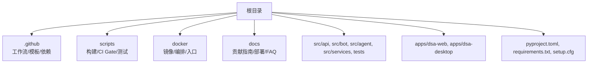
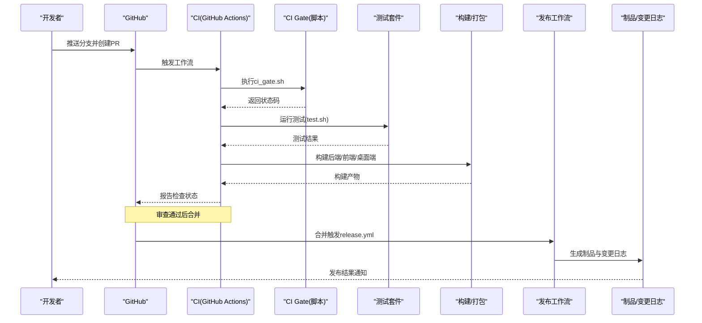
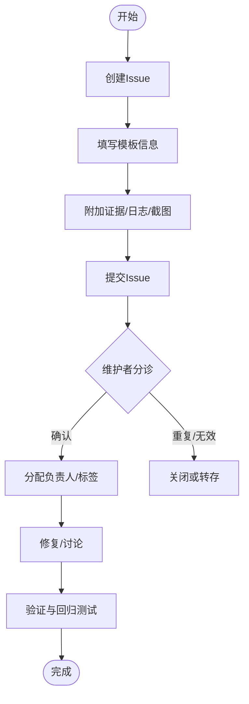
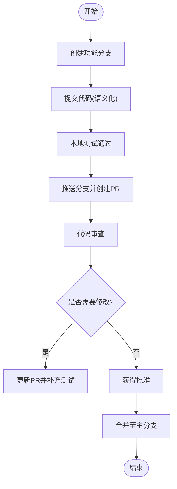
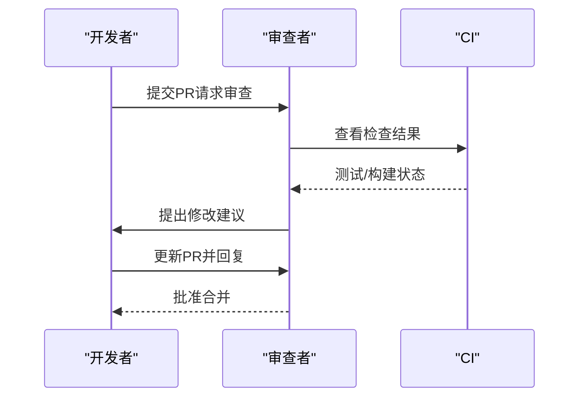
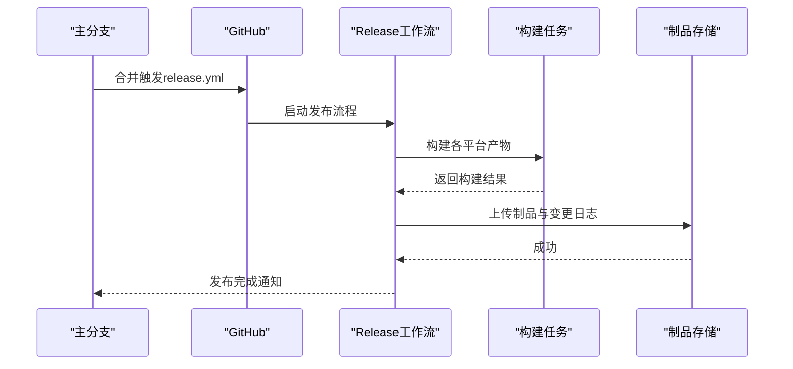
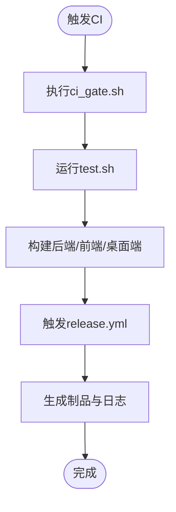
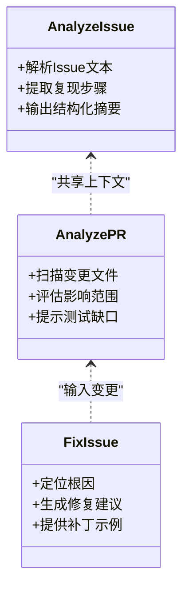
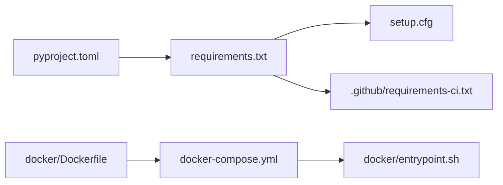

# 贡献流程

<cite>
**本文引用的文件**   
- [CONTRIBUTING.md](file://docs/CONTRIBUTING.md)
- [CONTRIBUTING_EN.md](file://docs/CONTRIBUTING_EN.md)
- [PULL_REQUEST_TEMPLATE.md](file://.github/PULL_REQUEST_TEMPLATE.md)
- [release.yml](file://.github/release.yml)
- [requirements-ci.txt](file://.github/requirements-ci.txt)
- [ci_gate.sh](file://scripts/ci_gate.sh)
- [test.sh](file://scripts/test.sh)
- [build-all-macos.sh](file://scripts/build-all-macos.sh)
- [build-backend-macos.sh](file://scripts/build-backend-macos.sh)
- [build-desktop-macos.sh](file://scripts/build-desktop-macos.sh)
- [build-backend.ps1](file://scripts/build-backend.ps1)
- [build-desktop.ps1](file://scripts/build-desktop.ps1)
- [build-all.ps1](file://scripts/build-all.ps1)
- [Dockerfile](file://docker/Dockerfile)
- [docker-compose.yml](file://docker/docker-compose.yml)
- [entrypoint.sh](file://docker/entrypoint.sh)
- [SKILL.md](file://SKILL.md)
- [.agents/skills/analyze-issue/SKILL.md](file://.agents/skills/analyze-issue/SKILL.md)
- [.agents/skills/analyze-pr/SKILL.md](file://.agents/skills/analyze-pr/SKILL.md)
- [.agents/skills/fix-issue/SKILL.md](file://.agents/skills/fix-issue/SKILL.md)
- [pyproject.toml](file://pyproject.toml)
- [requirements.txt](file://requirements.txt)
- [setup.cfg](file://setup.cfg)
</cite>

## 目录
1. [简介](#简介)
2. [项目结构](#项目结构)
3. [核心组件](#核心组件)
4. [架构总览](#架构总览)
5. [详细组件分析](#详细组件分析)
6. [依赖分析](#依赖分析)
7. [性能考虑](#性能考虑)
8. [故障排查指南](#故障排查指南)
9. [结论](#结论)
10. [附录](#附录)

## 简介
本文件为 daily_stock_analysis 项目的开源贡献规范与流程说明，覆盖 Issue 提交流程、Pull Request 创建规范、代码审查流程、版本发布流程、变更日志维护、文档更新要求、社区参与指南、行为准则、许可证说明、新功能开发流程、Bug 修复流程、文档贡献流程以及 CI/CD 流水线的作用与配置方法。目标是让新贡献者快速上手，同时保证提交质量与发布稳定性。

## 项目结构
仓库采用多语言、多模块组织：Python 后端（API、Agent、数据源、通知等）、Web 前端（React/Vite）、桌面端（Electron）、Bot 平台集成、测试与脚本、文档与 Docker 编排等。贡献相关的关键位置如下：
- .github：GitHub Actions、PR 模板、Release 工作流、CI 依赖清单
- scripts：构建与 CI Gate 脚本
- docker：容器化与编排
- docs：贡献指南、部署、FAQ、示例配置等
- pyproject.toml / requirements.txt / setup.cfg：Python 依赖与工具配置
- SKILL.md 与 .agents/skills/*：AI 辅助技能定义（Issue 分析、PR 分析、修复）

**图表来源** 
- [release.yml](file://.github/release.yml)
- [requirements-ci.txt](file://.github/requirements-ci.txt)
- [ci_gate.sh](file://scripts/ci_gate.sh)
- [test.sh](file://scripts/test.sh)
- [Dockerfile](file://docker/Dockerfile)
- [docker-compose.yml](file://docker/docker-compose.yml)
- [entrypoint.sh](file://docker/entrypoint.sh)
- [pyproject.toml](file://pyproject.toml)
- [requirements.txt](file://requirements.txt)
- [setup.cfg](file://setup.cfg)

**章节来源**
- [CONTRIBUTING.md](file://docs/CONTRIBUTING.md)
- [CONTRIBUTING_EN.md](file://docs/CONTRIBUTING_EN.md)
- [SKILL.md](file://SKILL.md)

## 核心组件
- 贡献与协作规范：Issue 模板、PR 模板、行为准则、许可证说明、文档更新要求
- 自动化流水线：CI Gate、测试、构建、发布
- AI 辅助技能：Issue 分析、PR 分析、修复建议
- 容器化与本地运行：Dockerfile、docker-compose、entrypoint

**章节来源**
- [PULL_REQUEST_TEMPLATE.md](file://.github/PULL_REQUEST_TEMPLATE.md)
- [release.yml](file://.github/release.yml)
- [requirements-ci.txt](file://.github/requirements-ci.txt)
- [ci_gate.sh](file://scripts/ci_gate.sh)
- [test.sh](file://scripts/test.sh)
- [Dockerfile](file://docker/Dockerfile)
- [docker-compose.yml](file://docker/docker-compose.yml)
- [entrypoint.sh](file://docker/entrypoint.sh)
- [.agents/skills/analyze-issue/SKILL.md](file://.agents/skills/analyze-issue/SKILL.md)
- [.agents/skills/analyze-pr/SKILL.md](file://.agents/skills/analyze-pr/SKILL.md)
- [.agents/skills/fix-issue/SKILL.md](file://.agents/skills/fix-issue/SKILL.md)

## 架构总览
下图展示从开发者到发布的端到端流程：开发者在本地完成改动后提交 PR，触发 CI Gate 与测试；通过后进入代码审查；审查通过合并至主分支后，自动执行 Release 工作流生成制品与变更日志。

**图表来源** 
- [release.yml](file://.github/release.yml)
- [ci_gate.sh](file://scripts/ci_gate.sh)
- [test.sh](file://scripts/test.sh)
- [build-all-macos.sh](file://scripts/build-all-macos.sh)
- [build-backend-macos.sh](file://scripts/build-backend-macos.sh)
- [build-desktop-macos.sh](file://scripts/build-desktop-macos.sh)
- [build-backend.ps1](file://scripts/build-backend.ps1)
- [build-desktop.ps1](file://scripts/build-desktop.ps1)
- [build-all.ps1](file://scripts/build-all.ps1)

## 详细组件分析

### Issue 提交流程
- 使用 GitHub Issues 模板描述问题背景、复现步骤、期望行为、实际行为与环境信息
- 提供最小可复现代码或请求样例，标注影响范围与优先级
- 若涉及安全或敏感信息，请走私有渠道沟通
- 标签与分类由维护者根据内容设置

**图表来源** 
- [CONTRIBUTING.md](file://docs/CONTRIBUTING.md)
- [CONTRIBUTING_EN.md](file://docs/CONTRIBUTING_EN.md)

**章节来源**
- [CONTRIBUTING.md](file://docs/CONTRIBUTING.md)
- [CONTRIBUTING_EN.md](file://docs/CONTRIBUTING_EN.md)

### Pull Request 创建规范
- 基于功能分支开发，保持提交原子性与语义化
- PR 标题遵循“类型(模块): 简述”的约定
- 描述中说明动机、变更点、影响面、测试覆盖与回滚方案
- 关联相关 Issue，必要时附上截图/日志
- 确保通过所有 CI 检查后再请求审查

**图表来源** 
- [PULL_REQUEST_TEMPLATE.md](file://.github/PULL_REQUEST_TEMPLATE.md)
- [CONTRIBUTING.md](file://docs/CONTRIBUTING.md)

**章节来源**
- [PULL_REQUEST_TEMPLATE.md](file://.github/PULL_REQUEST_TEMPLATE.md)
- [CONTRIBUTING.md](file://docs/CONTRIBUTING.md)

### 代码审查流程
- 至少一名维护者审查，关注正确性、可读性、性能与安全
- 使用评论与建议进行迭代，避免破坏性变更
- 对复杂逻辑增加单元测试或集成测试
- 审查通过后由维护者合并

**图表来源** 
- [CONTRIBUTING.md](file://docs/CONTRIBUTING.md)
- [CONTRIBUTING_EN.md](file://docs/CONTRIBUTING_EN.md)

**章节来源**
- [CONTRIBUTING.md](file://docs/CONTRIBUTING.md)
- [CONTRIBUTING_EN.md](file://docs/CONTRIBUTING_EN.md)

### 版本发布流程
- 合并至主分支后触发 release.yml
- 自动生成版本号、变更日志与制品（后端/前端/桌面端）
- 支持多平台构建与签名（如适用）
- 发布产物上传至 Releases 页面并提供下载链接

**图表来源** 
- [release.yml](file://.github/release.yml)

**章节来源**
- [release.yml](file://.github/release.yml)

### 变更日志维护
- 每次 PR 需记录关键变更点与影响范围
- 发布时由工作流聚合生成变更日志
- 重大变更需包含迁移指引与兼容性说明

**章节来源**
- [release.yml](file://.github/release.yml)
- [CONTRIBUTING.md](file://docs/CONTRIBUTING.md)

### 文档更新要求
- 新增/修改功能需同步更新相关文档（README、部署、配置、FAQ）
- 文档变更应随功能 PR 一并提交，便于审查与发布
- 国际化文档（中英）需保持一致性

**章节来源**
- [CONTRIBUTING.md](file://docs/CONTRIBUTING.md)
- [CONTRIBUTING_EN.md](file://docs/CONTRIBUTING_EN.md)

### 社区参与指南与行为准则
- 尊重他人、理性讨论、避免人身攻击
- 鼓励提问与分享，积极帮助新手
- 遵守许可证与合规要求

**章节来源**
- [CONTRIBUTING.md](file://docs/CONTRIBUTING.md)
- [CONTRIBUTING_EN.md](file://docs/CONTRIBUTING_EN.md)

### 许可证说明
- 明确项目使用的开源许可证条款
- 贡献即表示同意按许可证分发代码

**章节来源**
- [CONTRIBUTING.md](file://docs/CONTRIBUTING.md)
- [CONTRIBUTING_EN.md](file://docs/CONTRIBUTING_EN.md)

### 新功能开发流程
- 从 Issue 或需求出发，拆分任务与里程碑
- 设计接口与数据结构，编写单元测试
- 实现功能并通过 CI Gate 与测试
- 提交 PR 并等待审查与合并

**章节来源**
- [CONTRIBUTING.md](file://docs/CONTRIBUTING.md)
- [test.sh](file://scripts/test.sh)
- [ci_gate.sh](file://scripts/ci_gate.sh)

### Bug 修复流程
- 复现问题并定位根因
- 编写最小修复与回归测试
- 提交 PR 并说明修复影响与风险
- 审查通过后合并并发布补丁版本

**章节来源**
- [CONTRIBUTING.md](file://docs/CONTRIBUTING.md)
- [test.sh](file://scripts/test.sh)

### 文档贡献流程
- 编辑 Markdown 文档，确保语法与链接有效
- 提交 PR 并标注文档变更范围
- 审查通过后合并

**章节来源**
- [CONTRIBUTING.md](file://docs/CONTRIBUTING.md)
- [CONTRIBUTING_EN.md](file://docs/CONTRIBUTING_EN.md)

### CI/CD 流水线作用与配置
- CI Gate：统一入口校验环境、依赖与基础规则
- 测试套件：运行单元/集成/E2E 测试
- 构建任务：后端、前端、桌面端多平台构建
- 发布工作流：生成制品与变更日志

**图表来源** 
- [ci_gate.sh](file://scripts/ci_gate.sh)
- [test.sh](file://scripts/test.sh)
- [build-all-macos.sh](file://scripts/build-all-macos.sh)
- [build-backend-macos.sh](file://scripts/build-backend-macos.sh)
- [build-desktop-macos.sh](file://scripts/build-desktop-macos.sh)
- [build-backend.ps1](file://scripts/build-backend.ps1)
- [build-desktop.ps1](file://scripts/build-desktop.ps1)
- [build-all.ps1](file://scripts/build-all.ps1)
- [release.yml](file://.github/release.yml)

**章节来源**
- [ci_gate.sh](file://scripts/ci_gate.sh)
- [test.sh](file://scripts/test.sh)
- [build-all-macos.sh](file://scripts/build-all-macos.sh)
- [build-backend-macos.sh](file://scripts/build-backend-macos.sh)
- [build-desktop-macos.sh](file://scripts/build-desktop-macos.sh)
- [build-backend.ps1](file://scripts/build-backend.ps1)
- [build-desktop.ps1](file://scripts/build-desktop.ps1)
- [build-all.ps1](file://scripts/build-all.ps1)
- [release.yml](file://.github/release.yml)

### AI 辅助技能（Issue/PR/修复）
- analyze-issue：解析 Issue 上下文，提取关键信息与复现步骤
- analyze-pr：评估 PR 变更范围、潜在风险与测试覆盖
- fix-issue：生成修复建议与最小补丁

**图表来源** 
- [.agents/skills/analyze-issue/SKILL.md](file://.agents/skills/analyze-issue/SKILL.md)
- [.agents/skills/analyze-pr/SKILL.md](file://.agents/skills/analyze-pr/SKILL.md)
- [.agents/skills/fix-issue/SKILL.md](file://.agents/skills/fix-issue/SKILL.md)

**章节来源**
- [.agents/skills/analyze-issue/SKILL.md](file://.agents/skills/analyze-issue/SKILL.md)
- [.agents/skills/analyze-pr/SKILL.md](file://.agents/skills/analyze-pr/SKILL.md)
- [.agents/skills/fix-issue/SKILL.md](file://.agents/skills/fix-issue/SKILL.md)

## 依赖分析
- Python 依赖：pyproject.toml、requirements.txt、setup.cfg
- CI 依赖：.github/requirements-ci.txt
- 容器镜像：docker/Dockerfile、docker-compose.yml、entrypoint.sh

**图表来源** 
- [pyproject.toml](file://pyproject.toml)
- [requirements.txt](file://requirements.txt)
- [setup.cfg](file://setup.cfg)
- [requirements-ci.txt](file://.github/requirements-ci.txt)
- [Dockerfile](file://docker/Dockerfile)
- [docker-compose.yml](file://docker/docker-compose.yml)
- [entrypoint.sh](file://docker/entrypoint.sh)

**章节来源**
- [pyproject.toml](file://pyproject.toml)
- [requirements.txt](file://requirements.txt)
- [setup.cfg](file://setup.cfg)
- [requirements-ci.txt](file://.github/requirements-ci.txt)
- [Dockerfile](file://docker/Dockerfile)
- [docker-compose.yml](file://docker/docker-compose.yml)
- [entrypoint.sh](file://docker/entrypoint.sh)

## 性能考虑
- 在 CI Gate 中启用缓存与增量构建以减少耗时
- 测试套件按模块并行执行，避免阻塞
- 构建阶段使用多阶段镜像与分层缓存优化体积
- 对热点路径添加基准测试与监控

[本节为通用指导，不直接分析具体文件]

## 故障排查指南
- 本地先运行 test.sh 与 ci_gate.sh 以提前发现问题
- 查看 CI 日志定位失败步骤（测试/构建/发布）
- 使用 Docker 环境复现问题，确保依赖一致
- 针对网络或外部服务异常，增加重试与降级策略

**章节来源**
- [test.sh](file://scripts/test.sh)
- [ci_gate.sh](file://scripts/ci_gate.sh)
- [Dockerfile](file://docker/Dockerfile)
- [docker-compose.yml](file://docker/docker-compose.yml)
- [entrypoint.sh](file://docker/entrypoint.sh)

## 结论
通过统一的贡献规范与自动化流水线，本项目能够高效地接收社区贡献并确保发布质量。建议贡献者在提交前充分理解 Issue/PR 流程、测试与构建要求，并在需要时使用 AI 辅助技能提升效率。

[本节为总结性内容，不直接分析具体文件]

## 附录
- 常用命令与脚本路径参考
- 本地开发与调试建议
- 常见问题与解决方案

[本节为补充信息，不直接分析具体文件]