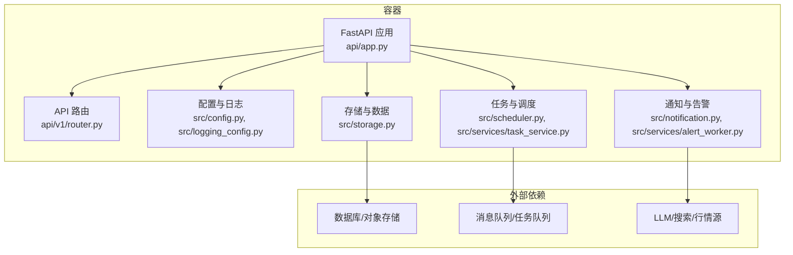
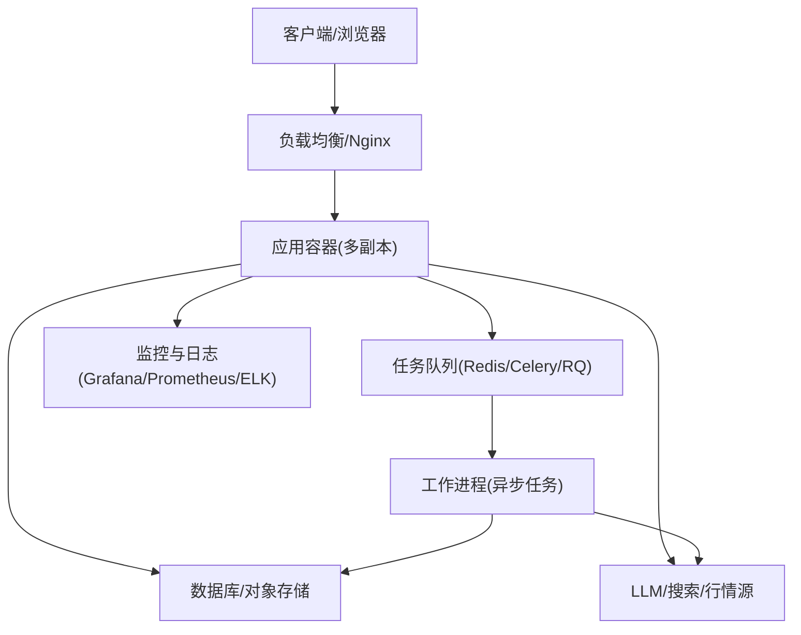
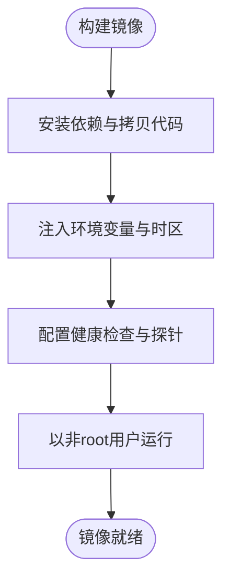
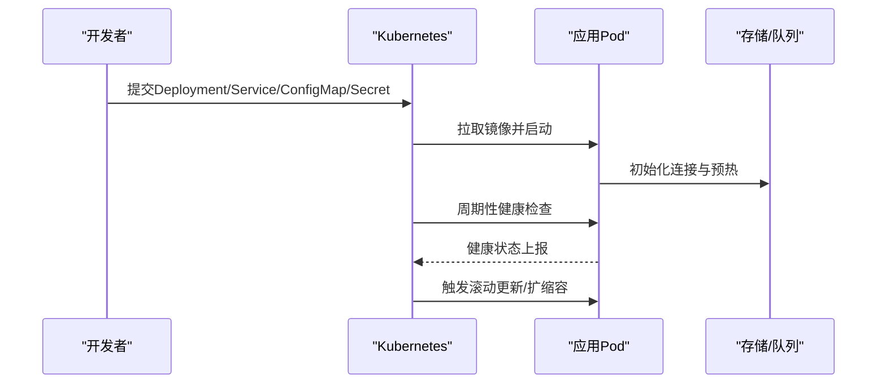
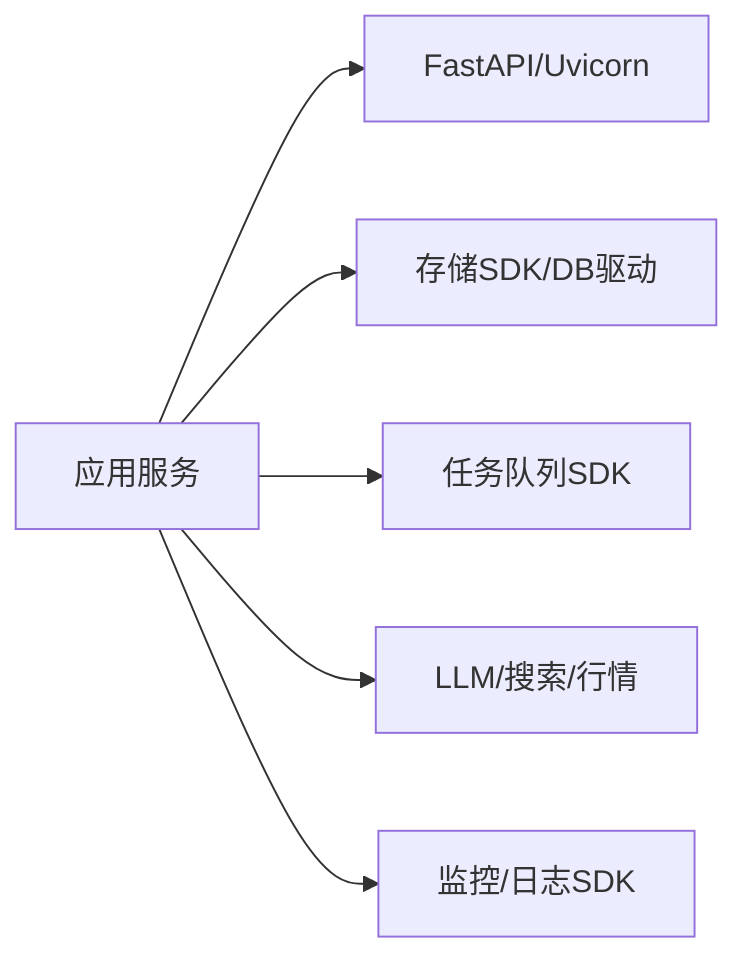

# 部署指南

<cite>
**本文引用的文件**   
- [Dockerfile](file://docker/Dockerfile)
- [docker-compose.yml](file://docker/docker-compose.yml)
- [entrypoint.sh](file://docker/entrypoint.sh)
- [main.py](file://main.py)
- [server.py](file://server.py)
- [webui.py](file://webui.py)
- [pyproject.toml](file://pyproject.toml)
- [requirements.txt](file://requirements.txt)
- [.dockerignore](file://.dockerignore)
- [api/app.py](file://api/app.py)
- [api/v1/router.py](file://api/v1/router.py)
- [src/config.py](file://src/config.py)
- [src/logging_config.py](file://src/logging_config.py)
- [src/scheduler.py](file://src/scheduler.py)
- [src/storage.py](file://src/storage.py)
- [src/services/task_service.py](file://src/services/task_service.py)
- [src/services/alert_worker.py](file://src/services/alert_worker.py)
- [src/notification.py](file://src/notification.py)
- [scripts/test.sh](file://scripts/test.sh)
- [scripts/ci_gate.sh](file://scripts/ci_gate.sh)
- [docs/DEPLOY_EN.md](file://docs/DEPLOY_EN.md)
- [docs/deploy-webui-cloud.md](file://docs/deploy-webui-cloud.md)
</cite>

## 目录
1. [简介](#简介)
2. [项目结构](#项目结构)
3. [核心组件](#核心组件)
4. [架构总览](#架构总览)
5. [详细组件分析](#详细组件分析)
6. [依赖关系分析](#依赖关系分析)
7. [性能考虑](#性能考虑)
8. [故障排查指南](#故障排查指南)
9. [结论](#结论)
10. [附录](#附录)

## 简介
本指南面向生产环境，提供从容器化到编排、从云平台部署到监控备份的全链路方案。内容覆盖：
- Docker 容器化与镜像构建
- Kubernetes 编排与弹性伸缩
- 云平台（如阿里云、腾讯云、AWS）部署要点
- 环境变量与安全加固
- 性能调优（I/O、并发、缓存、队列）
- 备份恢复策略与灾难恢复流程
- 监控告警与日志收集方案
- 不同场景的配置模板与最佳实践

## 项目结构
后端服务由 FastAPI 应用入口、API 路由、业务服务层、调度器、存储与通知等模块组成；前端 Web UI 通过独立脚本启动或反向代理静态资源；Docker 相关配置位于 docker 目录；文档与脚本位于 docs 与 scripts 目录。

**图表来源** 
- [api/app.py](file://api/app.py)
- [api/v1/router.py](file://api/v1/router.py)
- [src/config.py](file://src/config.py)
- [src/logging_config.py](file://src/logging_config.py)
- [src/scheduler.py](file://src/scheduler.py)
- [src/services/task_service.py](file://src/services/task_service.py)
- [src/storage.py](file://src/storage.py)
- [src/notification.py](file://src/notification.py)
- [src/services/alert_worker.py](file://src/services/alert_worker.py)

**章节来源**
- [main.py](file://main.py)
- [server.py](file://server.py)
- [webui.py](file://webui.py)
- [api/app.py](file://api/app.py)
- [api/v1/router.py](file://api/v1/router.py)
- [src/config.py](file://src/config.py)
- [src/logging_config.py](file://src/logging_config.py)
- [src/scheduler.py](file://src/scheduler.py)
- [src/storage.py](file://src/storage.py)
- [src/services/task_service.py](file://src/services/task_service.py)
- [src/services/alert_worker.py](file://src/services/alert_worker.py)
- [src/notification.py](file://src/notification.py)

## 核心组件
- 应用入口与中间件：FastAPI 应用初始化、全局异常处理、鉴权中间件、CORS、请求限流等。
- API 路由：v1 版本路由聚合，按功能域拆分端点（分析、回测、持仓、系统配置、使用量等）。
- 配置管理：集中式配置加载、环境变量注入、敏感信息保护。
- 日志与可观测性：结构化日志、采样与分级、输出到 stdout 以便容器采集。
- 任务与调度：定时任务、后台任务队列、重试与幂等设计。
- 存储层：统一抽象的存储接口，适配本地文件、对象存储与数据库。
- 通知与告警：多渠道通知（邮件、IM、Webhook），告警规则与去重降噪。

**章节来源**
- [api/app.py](file://api/app.py)
- [api/v1/router.py](file://api/v1/router.py)
- [src/config.py](file://src/config.py)
- [src/logging_config.py](file://src/logging_config.py)
- [src/scheduler.py](file://src/scheduler.py)
- [src/storage.py](file://src/storage.py)
- [src/services/task_service.py](file://src/services/task_service.py)
- [src/services/alert_worker.py](file://src/services/alert_worker.py)
- [src/notification.py](file://src/notification.py)

## 架构总览
下图展示生产环境的典型部署拓扑：反向代理（Nginx/云 LB）→ 应用容器（多副本）→ 任务/调度 → 存储与消息队列 → 外部 LLM/数据源。

[该图为概念性架构图，不直接映射具体源码文件]

## 详细组件分析

### Docker 容器化部署
- 镜像构建：基于官方 Python 基础镜像，安装依赖、拷贝代码、设置时区与语言环境、暴露端口、定义健康检查与入口脚本。
- 运行参数：通过环境变量注入配置（数据库连接、密钥、LLM 配置、队列地址等），支持只读根文件系统与非 root 用户运行。
- 健康检查：HTTP 健康端点与进程存活探针，配合编排平台自动重启。
- 安全加固：最小权限、关闭调试模式、限制网络访问、镜像扫描与漏洞修复。

**图表来源** 
- [Dockerfile](file://docker/Dockerfile)
- [entrypoint.sh](file://docker/entrypoint.sh)
- [.dockerignore](file://.dockerignore)

**章节来源**
- [Dockerfile](file://docker/Dockerfile)
- [docker-compose.yml](file://docker/docker-compose.yml)
- [entrypoint.sh](file://docker/entrypoint.sh)
- [.dockerignore](file://.dockerignore)

### Kubernetes 编排与弹性伸缩
- Deployment：声明副本数、资源限制、滚动更新策略、探针与健康检查。
- Service/Ingress：内部 Service 暴露端口，Ingress 配置域名、TLS 与路径转发。
- ConfigMap/Secret：集中化管理配置与敏感信息，避免硬编码。
- HorizontalPodAutoscaler：基于 CPU/内存或自定义指标自动扩缩容。
- PersistentVolume：为持久化存储提供动态卷或预置卷。
- PodDisruptionBudget：保障升级期间的可用性。

[该图为概念性流程图，不直接映射具体源码文件]

### 云平台部署方案
- 托管容器服务：选择云厂商的容器服务（如 ACK、TKE、EKS），导入镜像或 CI/CD 流水线构建。
- 托管数据库与对象存储：使用云数据库与 OSS/S3，通过内网访问降低延迟与成本。
- 托管消息队列：使用云 Redis/Kafka 作为任务队列与缓存。
- 安全合规：启用 VPC、安全组、WAF、KMS 加密与审计日志。
- 监控告警：集成云监控、日志服务与告警中心，设置阈值与通知渠道。

[本节为通用指导，不直接分析具体文件]

### 环境变量与配置管理
- 关键配置项：数据库连接串、对象存储凭据、LLM API Key、队列地址、日志级别、时区、语言、CORS 白名单、限流策略等。
- 配置优先级：默认值 < 配置文件 < 环境变量 < 运行时参数。
- 敏感信息管理：使用 Secret/密钥管理服务，禁止在镜像与日志中泄露。
- 配置校验：启动时进行必填项校验与类型检查，失败即退出。

**章节来源**
- [src/config.py](file://src/config.py)
- [src/logging_config.py](file://src/logging_config.py)

### 安全加固
- 身份认证与授权：JWT/OAuth2、RBAC、最小权限原则。
- 传输安全：强制 HTTPS、HSTS、证书轮换。
- 输入校验：严格 Schema 校验、防注入、XSS 防护。
- 网络安全：仅开放必要端口、VPC 隔离、安全组策略。
- 供应链安全：依赖扫描、镜像签名、SBOM 生成。

**章节来源**
- [api/app.py](file://api/app.py)
- [api/v1/router.py](file://api/v1/router.py)

### 性能调优
- 应用层：启用 Gunicorn/Uvicorn 多 worker、连接池、缓存热点数据、异步 I/O。
- 任务层：合理设置队列并发、重试退避、死信队列与幂等键。
- 存储层：读写分离、分库分表、冷热数据分层、压缩与索引优化。
- 网络层：连接复用、超时与熔断、降级与限流。
- 资源层：CPU/内存限制、亲和性与反亲和、节点池隔离。

**章节来源**
- [src/scheduler.py](file://src/scheduler.py)
- [src/services/task_service.py](file://src/services/task_service.py)
- [src/storage.py](file://src/storage.py)

### 备份恢复策略
- 数据备份：数据库全量+增量、对象存储快照、配置与密钥定期导出。
- 恢复演练：定期演练恢复流程，验证 RTO/RPO 目标。
- 灾备切换：跨可用区或多地域部署，DNS 切换与流量迁移。
- 一致性：事务与幂等设计确保恢复后数据一致。

[本节为通用指导，不直接分析具体文件]

### 监控告警配置
- 指标采集：应用指标（QPS、延迟、错误率）、系统指标（CPU、内存、磁盘、网络）、业务指标（任务成功率、队列积压）。
- 告警规则：阈值告警、趋势告警、复合告警，避免告警风暴。
- 可视化：Grafana 仪表盘、SLO/SLI 看板。
- 日志采集：stdout/stderr 结构化 JSON，集中到 ELK/云日志服务，设置保留策略与检索索引。

**章节来源**
- [src/logging_config.py](file://src/logging_config.py)
- [src/notification.py](file://src/notification.py)

### 日志收集方案
- 应用日志：分级输出（DEBUG/INFO/WARN/ERROR），包含请求 ID、用户 ID、上下文。
- 访问日志：反向代理与应用访问日志，脱敏敏感字段。
- 审计日志：关键操作留痕，不可篡改存储。
- 日志轮转：按大小/时间轮转，压缩与归档。

**章节来源**
- [src/logging_config.py](file://src/logging_config.py)

### 故障恢复与灾难恢复流程
- 故障分类：应用崩溃、依赖不可用、数据损坏、网络分区、容量不足。
- 恢复步骤：隔离故障节点、切换到备用实例、回滚版本、恢复数据、验证服务。
- 灾难恢复：跨地域切换、数据同步与冲突解决、业务连续性保障。
- 复盘改进：根因分析、预案完善、自动化修复。

[本节为通用指导，不直接分析具体文件]

### 不同部署场景的配置模板与最佳实践
- 单机开发：docker-compose 一键拉起，本地数据库与缓存。
- 小型团队：单集群多命名空间，共享存储与队列，CI/CD 流水线。
- 企业生产：多集群高可用，专线互联，严格安全策略与审计。
- 边缘计算：轻量镜像、离线包、本地缓存与断点续传。

[本节为通用指导，不直接分析具体文件]

## 依赖关系分析
后端依赖包括：
- 框架与运行时：Python、FastAPI、Uvicorn/Gunicorn
- 数据存储：数据库驱动、对象存储 SDK
- 任务队列：Redis/Celery/RQ
- 外部服务：LLM 提供商、搜索服务、行情数据源
- 监控与日志：Prometheus、Grafana、ELK、云监控

[该图为概念性依赖图，不直接映射具体源码文件]

**章节来源**
- [pyproject.toml](file://pyproject.toml)
- [requirements.txt](file://requirements.txt)

## 性能考虑
- 容器资源：合理设置 requests/limits，避免 OOMKill 与 CPU 节流。
- 连接池：数据库与 HTTP 客户端连接池，减少握手开销。
- 缓存策略：热点数据缓存、结果缓存、CDN 加速静态资源。
- 异步处理：长耗时任务入队，避免阻塞请求线程。
- 批处理：批量写入与查询，减少往返次数。
- 压测与基准：定期压测，识别瓶颈并优化。

[本节为通用指导，不直接分析具体文件]

## 故障排查指南
- 启动失败：检查环境变量、依赖安装、端口占用、健康端点。
- 请求超时：查看上游依赖延迟、队列积压、连接池耗尽。
- 内存泄漏：分析堆栈、GC 行为、大对象分配。
- 日志定位：按请求 ID 追踪调用链，关注 ERROR 与 WARN。
- 测试与验证：使用脚本进行冒烟测试与回归测试。

**章节来源**
- [scripts/test.sh](file://scripts/test.sh)
- [scripts/ci_gate.sh](file://scripts/ci_gate.sh)

## 结论
通过容器化与编排实现标准化部署，结合安全加固、性能调优、监控日志与备份恢复，可在不同规模的生产环境中稳定运行。建议持续完善自动化流水线与应急预案，提升交付效率与可靠性。

[本节为总结性内容，不直接分析具体文件]

## 附录
- 参考文档：部署说明、WebUI 云端部署指南、LLM 配置指南等。
- 常用命令：镜像构建、容器运行、K8s 应用与回滚、备份与恢复脚本。
- 检查清单：上线前安全检查、性能基线、监控覆盖、告警规则验证。

**章节来源**
- [docs/DEPLOY_EN.md](file://docs/DEPLOY_EN.md)
- [docs/deploy-webui-cloud.md](file://docs/deploy-webui-cloud.md)