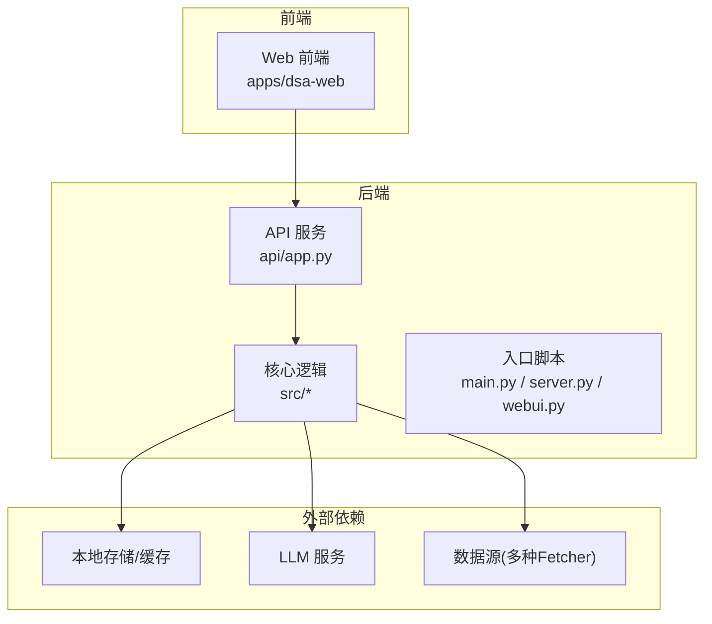
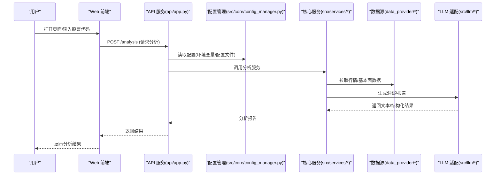
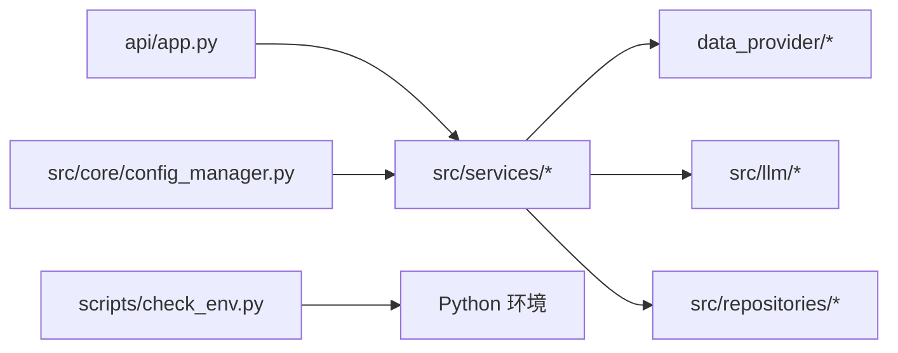

# 快速开始

<cite>
**本文引用的文件**   
- [README.md](file://README.md)
- [pyproject.toml](file://pyproject.toml)
- [requirements.txt](file://requirements.txt)
- [main.py](file://main.py)
- [server.py](file://server.py)
- [webui.py](file://webui.py)
- [api/app.py](file://api/app.py)
- [docker/Dockerfile](file://docker/Dockerfile)
- [docker/docker-compose.yml](file://docker/docker-compose.yml)
- [docker/entrypoint.sh](file://docker/entrypoint.sh)
- [scripts/check_env.py](file://scripts/check_env.py)
- [src/config.py](file://src/config.py)
- [src/core/config_manager.py](file://src/core/config_manager.py)
- [docs/full-guide_EN.md](file://docs/full-guide_EN.md)
- [docs/deploy-webui-cloud.md](file://docs/deploy-webui-cloud.md)
- [docs/beginner-client-setup.md](file://docs/beginner-client-setup.md)
</cite>

## 目录
1. [简介](#简介)
2. [项目结构](#项目结构)
3. [核心组件](#核心组件)
4. [架构总览](#架构总览)
5. [详细组件分析](#详细组件分析)
6. [依赖关系分析](#依赖关系分析)
7. [性能注意事项](#性能注意事项)
8. [故障排除指南](#故障排除指南)
9. [结论](#结论)
10. [附录](#附录)

## 简介
本快速开始指南面向首次接触“每日股票分析系统”的用户，目标是在30分钟内完成环境准备、配置设置与启动运行，并成功执行第一次股票分析。系统包含：
- Python 后端服务（API 与调度）
- Web 前端界面（可选）
- Docker 一键部署方案
- 多数据源与 LLM 集成（通过环境变量配置）

## 项目结构
仓库采用前后端分离与模块化设计：
- api：FastAPI 接口层，提供分析、回测、历史、告警等能力
- src：核心业务逻辑（配置管理、分析管线、通知、存储等）
- apps/dsa-web：Web 前端（React/Vite）
- docker：Docker 镜像与编排文件
- scripts：环境检查与构建脚本
- main.py/server.py/webui.py：应用入口与启动脚本

图表来源
- [api/app.py](file://api/app.py)
- [main.py](file://main.py)
- [server.py](file://server.py)
- [webui.py](file://webui.py)

章节来源
- [README.md](file://README.md)
- [pyproject.toml](file://pyproject.toml)
- [requirements.txt](file://requirements.txt)

## 核心组件
- 入口与启动
  - main.py：统一入口，支持不同运行模式
  - server.py：后端服务启动
  - webui.py：前端资源与开发代理
- API 服务
  - api/app.py：FastAPI 应用装配、路由注册、中间件
- 配置与环境
  - src/config.py：配置加载与校验
  - src/core/config_manager.py：运行时配置管理
  - scripts/check_env.py：环境检查脚本
- 容器化
  - docker/Dockerfile：镜像构建
  - docker/docker-compose.yml：服务编排
  - docker/entrypoint.sh：容器启动入口

章节来源
- [main.py](file://main.py)
- [server.py](file://server.py)
- [webui.py](file://webui.py)
- [api/app.py](file://api/app.py)
- [src/config.py](file://src/config.py)
- [src/core/config_manager.py](file://src/core/config_manager.py)
- [scripts/check_env.py](file://scripts/check_env.py)
- [docker/Dockerfile](file://docker/Dockerfile)
- [docker/docker-compose.yml](file://docker/docker-compose.yml)
- [docker/entrypoint.sh](file://docker/entrypoint.sh)

## 架构总览
系统以 FastAPI 为后端核心，暴露 REST/SSE 接口；前端通过 HTTP 调用 API；核心分析管线在 src 中实现，依赖数据源与 LLM 服务；所有配置通过环境变量注入。

图表来源
- [api/app.py](file://api/app.py)
- [src/core/config_manager.py](file://src/core/config_manager.py)
- [src/services/analysis_service.py](file://src/services/analysis_service.py)
- [data_provider/base.py](file://data_provider/base.py)
- [src/llm/__init__.py](file://src/llm/__init__.py)

## 详细组件分析

### 环境准备与依赖安装
- Python 版本
  - 使用 Python 3.10+（推荐 3.10.x），确保 pip 可用
- 依赖安装
  - 推荐使用虚拟环境
  - 安装后端依赖：参考 requirements.txt 或 pyproject.toml
  - 安装前端依赖（如需本地开发 Web）：进入 apps/dsa-web，按 package.json 说明安装
- 环境检查
  - 运行 scripts/check_env.py 验证基础环境是否满足要求

章节来源
- [requirements.txt](file://requirements.txt)
- [pyproject.toml](file://pyproject.toml)
- [scripts/check_env.py](file://scripts/check_env.py)

### 配置设置（环境变量与 API 密钥）
- 关键环境变量
  - LLM_API_KEY：大模型服务密钥（如 OpenAI、通义千问等）
  - LLM_BASE_URL：LLM 服务地址（按需配置）
  - DATA_SOURCE_*：数据源相关密钥（如 Tushare、AlphaVantage、Finnhub 等）
  - STORAGE_PATH：本地数据存储路径
  - APP_PORT：后端服务端口（默认 8000）
  - WEBUI_PORT：前端开发端口（默认 5173）
- 配置加载流程
  - src/config.py 负责读取环境变量与配置文件
  - src/core/config_manager.py 提供运行时配置访问与校验
- 建议
  - 将敏感信息放入 .env 文件，并在启动时加载
  - 使用 scripts/check_env.py 验证配置完整性

章节来源
- [src/config.py](file://src/config.py)
- [src/core/config_manager.py](file://src/core/config_manager.py)

### 启动方式（本地开发与 Docker 部署）
- 本地开发
  - 启动后端：python server.py（或 main.py）
  - 启动前端（可选）：cd apps/dsa-web && npm run dev
  - 访问：http://localhost:APP_PORT（后端）、http://localhost:WEBUI_PORT（前端）
- Docker 部署
  - 构建镜像：docker build -f docker/Dockerfile -t dsa:latest .
  - 运行容器：docker compose -f docker/docker-compose.yml up -d
  - 查看日志：docker compose logs -f
  - 入口脚本：docker/entrypoint.sh 负责初始化环境与启动服务

章节来源
- [server.py](file://server.py)
- [main.py](file://main.py)
- [webui.py](file://webui.py)
- [docker/Dockerfile](file://docker/Dockerfile)
- [docker/docker-compose.yml](file://docker/docker-compose.yml)
- [docker/entrypoint.sh](file://docker/entrypoint.sh)

### 基本使用示例（30分钟上手）
- 第1步：准备环境
  - 安装 Python 3.10+，创建虚拟环境，安装依赖
- 第2步：配置密钥
  - 设置 LLM_API_KEY 与至少一个数据源密钥
  - 运行 scripts/check_env.py 确认通过
- 第3步：启动服务
  - 启动后端服务，确认健康检查通过
- 第4步：执行分析
  - 通过 Web 界面或 API 提交一次股票分析请求
  - 查看返回的分析报告与指标

章节来源
- [scripts/check_env.py](file://scripts/check_env.py)
- [api/app.py](file://api/app.py)

## 依赖关系分析
- 后端依赖
  - FastAPI、Pydantic、HTTP 客户端、任务队列、存储抽象
- 前端依赖
  - React、Vite、TypeScript、Tailwind
- 外部依赖
  - LLM 提供商（OpenAI、通义千问等）
  - 数据源（Tushare、AlphaVantage、YFinance、AkShare、BaoStock、Efinance、Longbridge、TickFlow 等）

图表来源
- [api/app.py](file://api/app.py)
- [src/core/config_manager.py](file://src/core/config_manager.py)
- [scripts/check_env.py](file://scripts/check_env.py)

章节来源
- [requirements.txt](file://requirements.txt)
- [pyproject.toml](file://pyproject.toml)

## 性能注意事项
- 数据源限流与重试
  - 合理设置超时与重试策略，避免频繁触发限流
- LLM 调用优化
  - 控制上下文长度与并发度，必要时启用缓存
- 存储与缓存
  - 使用本地缓存减少重复请求，定期清理无用数据
- 前端渲染
  - 对长列表与大图进行懒加载与分页

[本节为通用指导，不直接分析具体文件]

## 故障排除指南
- 常见问题
  - 端口占用：修改 APP_PORT 或 WEBUI_PORT，确保未被占用
  - 权限问题：确保可写存储路径，检查文件系统权限
  - 网络问题：检查防火墙与代理设置，确认数据源可达
  - 密钥错误：核对 LLM_API_KEY 与数据源密钥是否正确
- 诊断步骤
  - 运行 scripts/check_env.py 检查环境
  - 查看后端日志与 API 健康检查响应
  - 逐步禁用非必要依赖定位问题
- 参考文档
  - docs/full-guide_EN.md：完整指南
  - docs/deploy-webui-cloud.md：云端部署提示
  - docs/beginner-client-setup.md：客户端设置入门

章节来源
- [scripts/check_env.py](file://scripts/check_env.py)
- [docs/full-guide_EN.md](file://docs/full-guide_EN.md)
- [docs/deploy-webui-cloud.md](file://docs/deploy-webui-cloud.md)
- [docs/beginner-client-setup.md](file://docs/beginner-client-setup.md)

## 结论
通过以上步骤，您可以在30分钟内完成环境搭建、配置与启动，并成功执行第一次股票分析。建议在正式使用前完善数据源与 LLM 配置，并根据实际需求调整性能与安全参数。

[本节为总结性内容，不直接分析具体文件]

## 附录
- 常用命令
  - 环境检查：python scripts/check_env.py
  - 启动后端：python server.py
  - 启动前端：cd apps/dsa-web && npm run dev
  - Docker 构建：docker build -f docker/Dockerfile -t dsa:latest .
  - Docker 运行：docker compose -f docker/docker-compose.yml up -d
- 参考链接
  - README.md：项目概览与使用说明
  - docs/*：各模块详细文档

章节来源
- [README.md](file://README.md)
- [docs/full-guide_EN.md](file://docs/full-guide_EN.md)
- [docs/deploy-webui-cloud.md](file://docs/deploy-webui-cloud.md)
- [docs/beginner-client-setup.md](file://docs/beginner-client-setup.md)