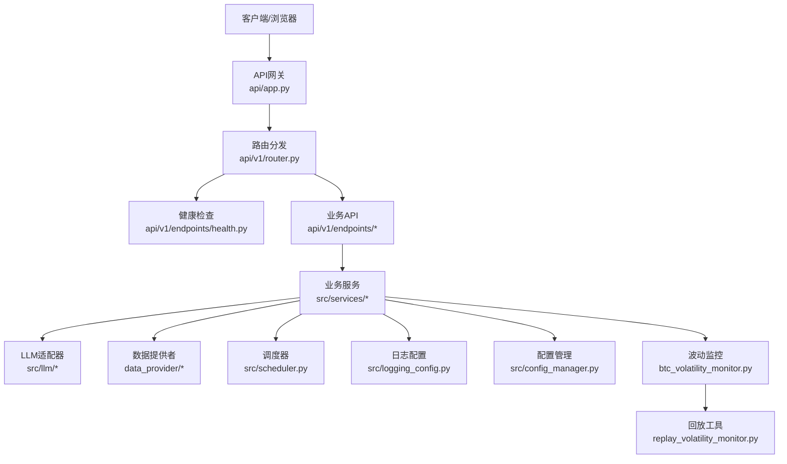
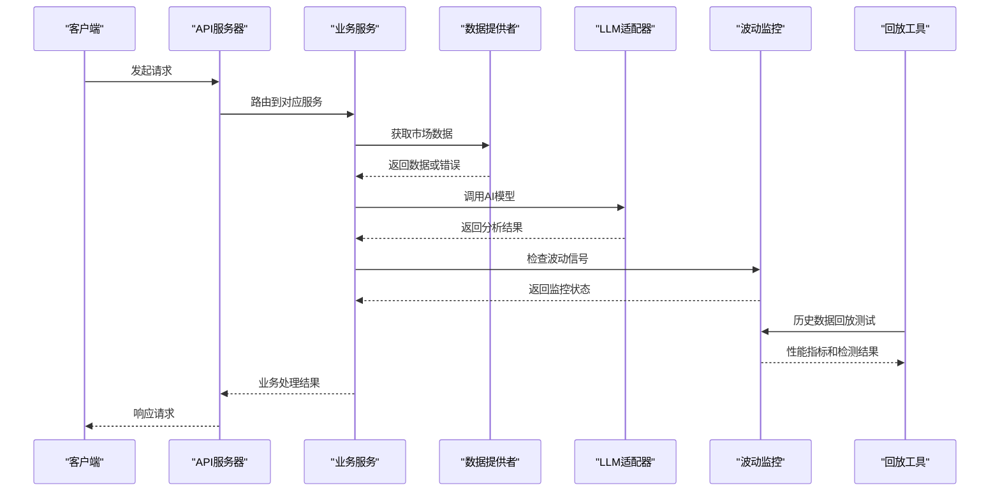
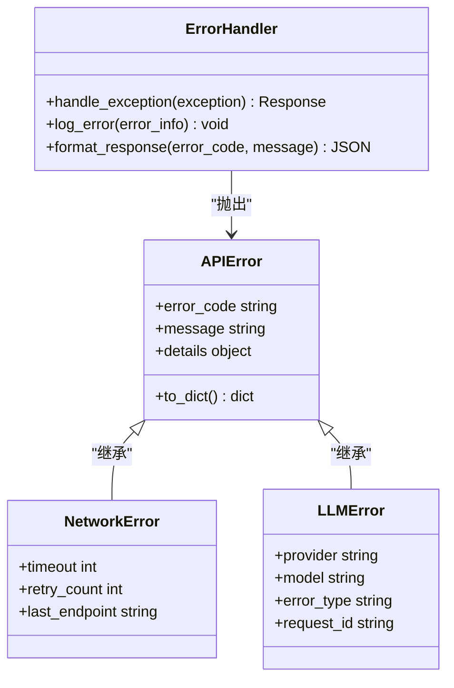
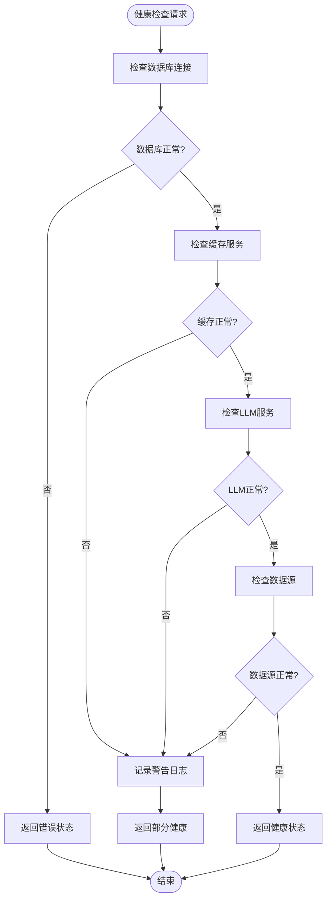
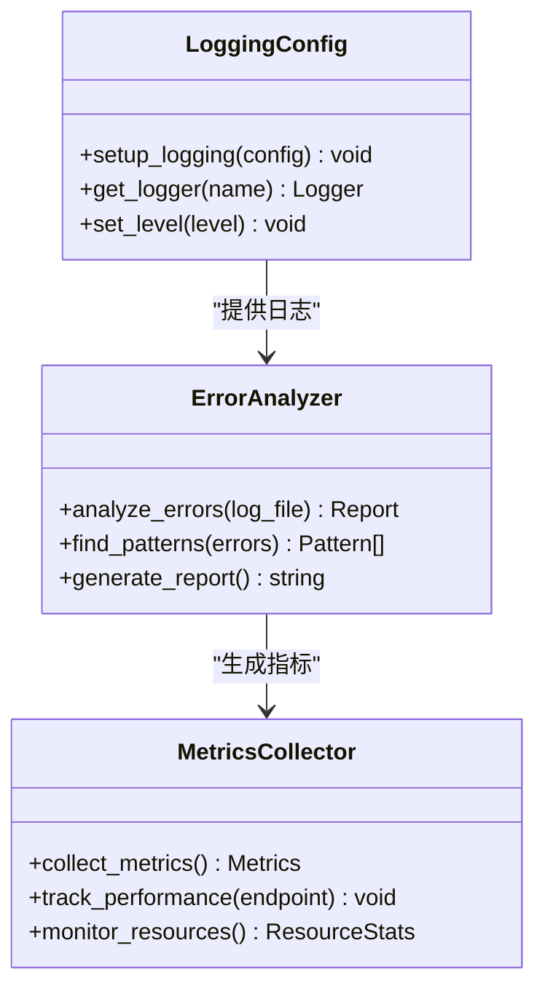
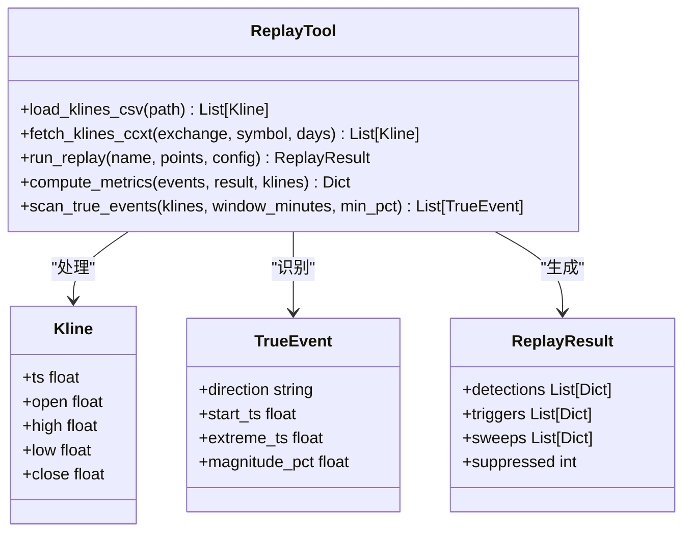
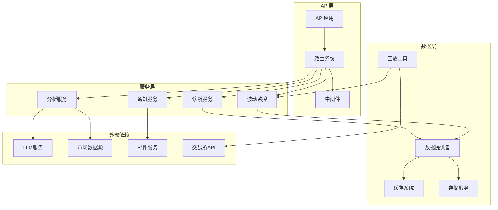
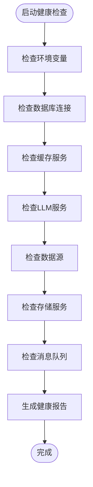

# 故障排除

<cite>
**本文引用的文件**   
- [main.py](file://main.py)
- [server.py](file://server.py)
- [api/app.py](file://api/app.py)
- [api/v1/router.py](file://api/v1/router.py)
- [api/v1/errors.py](file://api/v1/errors.py)
- [api/middlewares/error_handler.py](file://api/middlewares/error_handler.py)
- [src/logging_config.py](file://src/logging_config.py)
- [src/services/run_diagnostics.py](file://src/services/run_diagnostics.py)
- [api/v1/endpoints/health.py](file://api/v1/endpoints/health.py)
- [scripts/check_env.py](file://scripts/check_env.py)
- [docker/entrypoint.sh](file://docker/entrypoint.sh)
- [src/config_manager.py](file://src/config_manager.py)
- [src/llm/errors.py](file://src/llm/errors.py)
- [data_provider/base.py](file://data_provider/base.py)
- [src/scheduler.py](file://src/scheduler.py)
- [src/notification_sender/email_sender.py](file://src/notification_sender/email_sender.py)
- [scripts/replay_volatility_monitor.py](file://scripts/replay_volatility_monitor.py)
- [src/services/btc_volatility_monitor.py](file://src/services/btc_volatility_monitor.py)
- [tests/test_replay_volatility_monitor.py](file://tests/test_replay_volatility_monitor.py)
</cite>

## 更新摘要
**所做更改**
- 新增BTC波动监控回放工具的详细使用指南
- 添加历史数据回放和性能指标计算功能说明
- 扩展配置比较和多数据源支持文档
- 增强波动监控系统的故障排除章节

## 目录
1. [简介](#简介)
2. [项目结构](#项目结构)
3. [核心组件](#核心组件)
4. [架构总览](#架构总览)
5. [详细组件分析](#详细组件分析)
6. [依赖关系分析](#依赖关系分析)
7. [性能注意事项](#性能注意事项)
8. [故障排除指南](#故障排除指南)
9. [结论](#结论)
10. [附录](#附录)

## 简介
本指南面向系统运维与开发人员，提供针对AI股票分析系统的全面故障排除方法。内容涵盖常见错误信息解释、日志分析方法、监控指标解读、调试工具使用，以及网络问题、数据源连接问题、AI模型调用失败等典型问题的排查步骤。同时包含系统健康检查脚本与自动诊断工具的使用说明，帮助快速定位并解决问题。

**新增功能**：现在包含了完整的BTC波动监控回放工具，支持历史数据回放、性能指标计算、配置比较和多数据源支持，为波动监控策略的调优和故障诊断提供了强大的工具支持。

## 项目结构
系统采用前后端分离架构：
- 后端API服务基于FastAPI，提供REST接口与健康检查端点
- 前端Web应用位于apps/dsa-web，通过API与服务通信
- 数据处理与AI能力由src目录下的服务、LLM适配、数据提供者等模块实现
- 调度器负责定时任务与后台工作
- Docker容器化部署，入口脚本负责环境初始化与启动
- **新增**：专门的波动监控回放工具用于历史数据测试和策略调优



**图表来源** 
- [api/app.py:1-50](file://api/app.py#L1-L50)
- [api/v1/router.py:1-50](file://api/v1/router.py#L1-L50)
- [api/v1/endpoints/health.py:1-50](file://api/v1/endpoints/health.py#L1-L50)
- [src/services/run_diagnostics.py:1-50](file://src/services/run_diagnostics.py#L1-L50)
- [src/logging_config.py:1-50](file://src/logging_config.py#L1-L50)
- [src/config_manager.py:1-50](file://src/config_manager.py#L1-L50)
- [scripts/replay_volatility_monitor.py:1-50](file://scripts/replay_volatility_monitor.py#L1-L50)

**章节来源**
- [main.py:1-50](file://main.py#L1-L50)
- [server.py:1-50](file://server.py#L1-L50)
- [api/app.py:1-100](file://api/app.py#L1-L100)

## 核心组件
- **API层**: 统一错误处理中间件、路由注册、请求验证
- **服务层**: 业务逻辑封装，包括诊断、通知、数据分析等
- **数据层**: 多数据源适配器（股票、加密货币、基本面等）
- **LLM层**: 大语言模型调用、错误处理、使用统计
- **调度层**: 定时任务、后台队列管理
- **配置层**: 环境变量、配置文件管理
- **日志层**: 结构化日志、级别控制、输出目标
- **新增**：**波动监控层**: BTC价格波动检测、多级窗口分析、自适应阈值、速度触发机制

**章节来源**
- [api/middlewares/error_handler.py:1-100](file://api/middlewares/error_handler.py#L1-L100)
- [src/services/run_diagnostics.py:1-100](file://src/services/run_diagnostics.py#L1-L100)
- [data_provider/base.py:1-100](file://data_provider/base.py#L1-L100)
- [src/llm/errors.py:1-100](file://src/llm/errors.py#L1-L100)
- [src/scheduler.py:1-100](file://src/scheduler.py#L1-L100)
- [src/config_manager.py:1-100](file://src/config_manager.py#L1-L100)
- [src/logging_config.py:1-100](file://src/logging_config.py#L1-L100)
- [src/services/btc_volatility_monitor.py:1-100](file://src/services/btc_volatility_monitor.py#L1-L100)

## 架构总览
系统采用分层架构设计，各层职责清晰：
- 表现层：Web界面和API接口
- 业务层：核心业务逻辑和服务编排
- 数据层：外部数据源集成和本地存储
- 基础设施层：日志、配置、调度、监控
- **新增**：**监控优化层**：波动监控回放工具，支持历史数据分析和策略调优



**图表来源** 
- [api/app.py:1-100](file://api/app.py#L1-L100)
- [src/services/run_diagnostics.py:1-100](file://src/services/run_diagnostics.py#L1-L100)
- [data_provider/base.py:1-100](file://data_provider/base.py#L1-L100)
- [src/llm/errors.py:1-100](file://src/llm/errors.py#L1-L100)
- [scripts/replay_volatility_monitor.py:1-100](file://scripts/replay_volatility_monitor.py#L1-L100)

## 详细组件分析

### 错误处理机制
系统实现了统一的错误处理框架，确保异常的一致性和可追踪性：



**图表来源** 
- [api/v1/errors.py:1-100](file://api/v1/errors.py#L1-L100)
- [api/middlewares/error_handler.py:1-100](file://api/middlewares/error_handler.py#L1-L100)
- [src/llm/errors.py:1-100](file://src/llm/errors.py#L1-L100)

**章节来源**
- [api/v1/errors.py:1-150](file://api/v1/errors.py#L1-L150)
- [api/middlewares/error_handler.py:1-150](file://api/middlewares/error_handler.py#L1-L150)

### 健康检查系统
健康检查端点提供系统状态监控：



**图表来源** 
- [api/v1/endpoints/health.py:1-100](file://api/v1/endpoints/health.py#L1-L100)
- [src/services/run_diagnostics.py:1-100](file://src/services/run_diagnostics.py#L1-L100)

**章节来源**
- [api/v1/endpoints/health.py:1-100](file://api/v1/endpoints/health.py#L1-L100)

### 日志分析系统
系统提供结构化日志记录和高级分析功能：



**图表来源** 
- [src/logging_config.py:1-100](file://src/logging_config.py#L1-L100)
- [src/services/run_diagnostics.py:1-100](file://src/services/run_diagnostics.py#L1-L100)

**章节来源**
- [src/logging_config.py:1-100](file://src/logging_config.py#L1-L100)
- [src/services/run_diagnostics.py:1-100](file://src/services/run_diagnostics.py#L1-L100)

### BTC波动监控回放工具
**新增功能**：系统现在包含一个强大的波动监控回放工具，用于在历史数据上测试和调优BTC波动监控策略。



**图表来源** 
- [scripts/replay_volatility_monitor.py:48-72](file://scripts/replay_volatility_monitor.py#L48-L72)
- [scripts/replay_volatility_monitor.py:217-302](file://scripts/replay_volatility_monitor.py#L217-L302)
- [scripts/replay_volatility_monitor.py:335-363](file://scripts/replay_volatility_monitor.py#L335-L363)

**章节来源**
- [scripts/replay_volatility_monitor.py:1-650](file://scripts/replay_volatility_monitor.py#L1-L650)
- [tests/test_replay_volatility_monitor.py:1-150](file://tests/test_replay_volatility_monitor.py#L1-L150)

## 依赖关系分析
系统组件间的依赖关系如下：



**图表来源** 
- [api/app.py:1-100](file://api/app.py#L1-L100)
- [src/services/run_diagnostics.py:1-100](file://src/services/run_diagnostics.py#L1-L100)
- [data_provider/base.py:1-100](file://data_provider/base.py#L1-L100)
- [scripts/replay_volatility_monitor.py:1-100](file://scripts/replay_volatility_monitor.py#L1-L100)

**章节来源**
- [api/app.py:1-100](file://api/app.py#L1-L100)
- [src/services/run_diagnostics.py:1-100](file://src/services/run_diagnostics.py#L1-L100)

## 性能注意事项
- **连接池管理**: 合理配置数据库和HTTP连接池大小
- **异步处理**: 使用异步IO提高并发处理能力
- **缓存策略**: 实施多级缓存减少重复计算
- **资源监控**: 实时监控CPU、内存、磁盘使用情况
- **超时配置**: 设置合理的超时时间避免资源泄漏
- **新增**：**回放性能优化**: 历史数据回放时的采样间隔控制和内存管理

## 故障排除指南

### 常见错误及解决方案

#### 网络连接错误
**症状**: 数据源连接超时、API调用失败
**排查步骤**:
1. 检查网络连通性
2. 验证代理配置
3. 查看防火墙规则
4. 测试DNS解析

**解决方案**:
- 调整超时参数
- 配置重试机制
- 启用备用数据源

#### 数据源连接问题
**症状**: 无法获取股票数据、API限流
**排查步骤**:
1. 验证API密钥有效性
2. 检查数据源状态
3. 查看限流计数器
4. 测试基础连接

**解决方案**:
- 更新API密钥
- 实施指数退避
- 切换备用数据源

#### AI模型调用失败
**症状**: LLM响应超时、模型不可用
**排查步骤**:
1. 检查模型服务状态
2. 验证认证凭据
3. 查看请求配额
4. 分析错误日志

**解决方案**:
- 重启模型服务
- 重置认证令牌
- 降级到备用模型

**章节来源**
- [src/llm/errors.py:1-100](file://src/llm/errors.py#L1-L100)
- [data_provider/base.py:1-100](file://data_provider/base.py#L1-L100)

### 日志分析方法

#### 日志级别说明
- **DEBUG**: 详细调试信息
- **INFO**: 一般操作信息
- **WARNING**: 潜在问题警告
- **ERROR**: 错误事件
- **CRITICAL**: 严重错误

#### 关键日志模式
- 连接错误: `ConnectionError`, `TimeoutError`
- 认证失败: `AuthenticationError`, `PermissionDenied`
- 数据异常: `ValidationError`, `DataCorruption`
- 性能问题: `SlowQuery`, `MemoryLeak`

#### 日志收集命令
```bash
# 查看错误日志
grep -i "error" app.log | tail -n 100

# 搜索特定错误码
grep -E "ERROR_CODE_[0-9]+" app.log

# 分析日志频率
awk '{print $NF}' app.log | sort | uniq -c | sort -nr
```

**章节来源**
- [src/logging_config.py:1-100](file://src/logging_config.py#L1-L100)

### 监控指标解读

#### 系统健康指标
- **可用性**: 服务响应时间和成功率
- **吞吐量**: 每秒请求数和处理量
- **资源使用**: CPU、内存、磁盘I/O
- **错误率**: 各类错误的发生频率

#### 业务指标
- **数据新鲜度**: 数据延迟时间
- **分析质量**: 模型置信度和准确率
- **用户满意度**: 请求成功率和响应时间

#### 监控工具使用
- **Prometheus**: 指标收集和存储
- **Grafana**: 可视化展示
- **ELK Stack**: 日志分析和检索

### 调试工具使用

#### 命令行工具
- **check_env.py**: 环境检查和验证
- **run_diagnostics.py**: 系统诊断和报告生成
- **health_check.py**: 健康状态检查
- **新增**：**replay_volatility_monitor.py**: BTC波动监控回放和性能测试工具

#### 调试技巧
- 启用详细日志模式
- 使用断点调试
- 分析堆栈跟踪
- 模拟故障场景

**章节来源**
- [scripts/check_env.py:1-100](file://scripts/check_env.py#L1-L100)
- [src/services/run_diagnostics.py:1-100](file://src/services/run_diagnostics.py#L1-L100)

### 系统健康检查脚本

#### 健康检查流程


**图表来源** 
- [api/v1/endpoints/health.py:1-100](file://api/v1/endpoints/health.py#L1-L100)
- [src/services/run_diagnostics.py:1-100](file://src/services/run_diagnostics.py#L1-L100)

#### 自动化诊断工具
- **周期性检查**: 定时执行健康检查
- **告警通知**: 异常情况自动通知
- **趋势分析**: 历史数据趋势分析
- **容量规划**: 资源使用预测

**章节来源**
- [api/v1/endpoints/health.py:1-100](file://api/v1/endpoints/health.py#L1-L100)
- [src/services/run_diagnostics.py:1-100](file://src/services/run_diagnostics.py#L1-L100)

### 网络问题排查

#### 常见问题类型
- **DNS解析失败**: 域名无法解析
- **连接超时**: 网络延迟过高
- **SSL证书错误**: 安全证书问题
- **代理配置错误**: 代理服务器不可用

#### 排查步骤
1. **网络连通性测试**
   ```bash
   ping target_host
   telnet target_host port
   curl -v https://api.example.com
   ```

2. **DNS解析检查**
   ```bash
   nslookup api.example.com
   dig api.example.com
   ```

3. **SSL证书验证**
   ```bash
   openssl s_client -connect api.example.com:443
   ```

4. **代理配置验证**
   ```bash
   export http_proxy=http://proxy:port
   curl -x http://proxy:port https://api.example.com
   ```

**章节来源**
- [data_provider/base.py:1-100](file://data_provider/base.py#L1-L100)

### 数据源连接问题

#### 数据源类型
- **股票市场数据**: A股、港股、美股
- **加密货币数据**: BTC、ETH等主要币种
- **基本面数据**: 财务报表、股东信息
- **新闻数据**: 财经新闻、社交媒体

#### 连接问题诊断
1. **API密钥验证**
   - 检查密钥格式和有效期
   - 验证权限范围
   - 确认计费状态

2. **速率限制处理**
   - 监控请求频率
   - 实施指数退避
   - 使用请求队列

3. **数据格式验证**
   - 检查响应数据结构
   - 验证数据类型和范围
   - 处理缺失字段

**章节来源**
- [data_provider/base.py:1-100](file://data_provider/base.py#L1-L100)

### AI模型调用失败

#### 常见失败原因
- **模型服务不可用**: 服务宕机或维护中
- **认证失败**: 密钥过期或权限不足
- **请求超限**: 超出配额或速率限制
- **输入格式错误**: 提示词或参数不正确

#### 故障恢复策略
1. **自动重试机制**
   - 指数退避算法
   - 最大重试次数限制
   - 失败回调处理

2. **降级方案**
   - 切换到备用模型
   - 使用简化版本
   - 返回缓存结果

3. **监控和告警**
   - 实时错误监控
   - 性能指标收集
   - 自动告警通知

**章节来源**
- [src/llm/errors.py:1-100](file://src/llm/errors.py#L1-L100)

### BTC波动监控回放工具使用方法

#### 工具功能概述
BTC波动监控回放工具是一个专门用于测试和调优波动监控策略的工具，支持：
- **历史数据回放**: 从CSV文件或实时数据源回放历史价格数据
- **性能指标计算**: 计算检出率、平均检出延迟、误报率等关键指标
- **配置比较**: 比较不同配置参数的效果
- **多数据源支持**: 支持本地CSV文件和通过ccxt从交易所获取实时数据

#### 基本使用方法
```bash
# 从CSV文件回放历史数据
python scripts/replay_volatility_monitor.py --csv data/btc_1m.csv

# 从交易所获取最近3天的数据进行回放
python scripts/replay_volatility_monitor.py --fetch --days 3

# 保存获取的数据到CSV文件
python scripts/replay_volatility_monitor.py --fetch --days 3 --save-csv btc_data.csv

# 比较legacy模式和多层窗口模式的性能
python scripts/replay_volatility_monitor.py --csv data/btc_1m.csv --compare
```

#### 高级配置选项
```bash
# 自定义轮询间隔和窗口配置
python scripts/replay_volatility_monitor.py --csv data/btc_1m.csv \
    --interval-seconds 30 \
    --window-tiers "1:0.4,3:0.7,5:1.0,15:1.5"

# 启用自适应阈值和速度触发
python scripts/replay_volatility_monitor.py --csv data/btc_1m.csv \
    --adaptive-threshold \
    --velocity \
    --fast-confirmation

# 输出JSON格式的指标数据
python scripts/replay_volatility_monitor.py --csv data/btc_1m.csv --json
```

#### 关键性能指标解读
- **检出率 (Detection Rate)**: 真实波动事件被监控成功检测的比例
- **平均检出延迟 (Average Detection Delay)**: 从波动开始到首次检测到信号的秒数
- **误报率 (False Positive Rate)**: 检测到但实际未达入场确认价的比例
- **触发失效率 (Trigger Invalidation Rate)**: 触发后触及失效价的比例

#### 数据源支持
- **CSV文件**: 支持标准OHLCV格式，包含timestamp、open、high、low、close列
- **实时数据**: 通过ccxt库从支持的交易所获取1分钟K线数据
- **时间戳格式**: 支持多种时间戳格式，包括Unix时间戳、ISO格式等

**章节来源**
- [scripts/replay_volatility_monitor.py:1-650](file://scripts/replay_volatility_monitor.py#L1-L650)
- [tests/test_replay_volatility_monitor.py:1-150](file://tests/test_replay_volatility_monitor.py#L1-L150)

### 波动监控系统故障排除

#### 常见问题诊断
1. **监控不触发**: 检查阈值配置、数据源连接、监控状态
2. **误报过多**: 调整确认采样数、入场确认幅度、冷却时间
3. **漏报严重**: 降低阈值、启用速度触发、调整窗口配置
4. **性能问题**: 优化采样间隔、启用自适应阈值、调整回看窗口

#### 配置调优建议
- **保守策略**: 较高的阈值、较多的确认采样、较长的冷却时间
- **激进策略**: 较低的阈值、较少的确认采样、较短的冷却时间
- **自适应策略**: 启用自适应阈值，根据市场波动性动态调整

#### 监控指标监控
- **运行状态**: 监控是否正常运行、是否有错误日志
- **触发频率**: 监控信号触发频率是否合理
- **性能指标**: 关注检出率、误报率等关键指标
- **资源使用**: 监控CPU、内存使用情况

**章节来源**
- [src/services/btc_volatility_monitor.py:1-974](file://src/services/btc_volatility_monitor.py#L1-L974)

### 系统健康检查脚本使用方法

#### 脚本功能
- **环境检查**: 验证Python版本、依赖包
- **配置验证**: 检查配置文件完整性
- **服务检测**: 测试各组件连接状态
- **性能基准**: 运行基本性能测试

#### 使用步骤
1. **安装依赖**
   ```bash
   pip install -r requirements.txt
   ```

2. **运行检查**
   ```bash
   python scripts/check_env.py
   ```

3. **查看详细报告**
   ```bash
   python src/services/run_diagnostics.py --verbose
   ```

4. **生成诊断报告**
   ```bash
   python src/services/run_diagnostics.py --output report.html
   ```

**章节来源**
- [scripts/check_env.py:1-100](file://scripts/check_env.py#L1-L100)
- [src/services/run_diagnostics.py:1-100](file://src/services/run_diagnostics.py#L1-L100)

### 自动诊断工具

#### 诊断功能
- **系统状态监控**: 实时监控系统健康
- **错误模式识别**: 自动识别常见错误模式
- **性能瓶颈分析**: 识别系统性能问题
- **资源使用优化**: 提供资源使用建议

#### 配置和使用
1. **配置诊断规则**
   - 设置阈值和告警条件
   - 定义检查频率和周期
   - 配置通知渠道

2. **运行自动诊断**
   ```bash
   python src/services/run_diagnostics.py --auto --interval 300
   ```

3. **查看诊断结果**
   - Web界面查看
   - 导出分析报告
   - 集成监控系统

**章节来源**
- [src/services/run_diagnostics.py:1-100](file://src/services/run_diagnostics.py#L1-L100)

## 结论
本故障排除指南提供了全面的系统问题诊断和解决方法。通过理解系统架构、掌握错误处理机制、熟练使用诊断工具，可以有效解决大多数运行时问题。**新增的BTC波动监控回放工具**为波动监控策略的调优和故障诊断提供了强大的支持，能够帮助用户更好地理解和优化监控系统的性能。

建议定期执行健康检查，建立完善的监控体系，确保系统稳定运行。对于波动监控相关的故障，推荐使用回放工具进行历史数据测试和配置优化。

## 附录

### 常用命令参考
- **启动服务**: `python main.py`
- **查看日志**: `tail -f logs/app.log`
- **健康检查**: `curl http://localhost:8000/api/v1/health`
- **环境检查**: `python scripts/check_env.py`
- **波动监控回放**: `python scripts/replay_volatility_monitor.py --csv data/btc_1m.csv`

### 联系方式和支持
- **技术支持邮箱**: support@example.com
- **文档网站**: docs.example.com
- **社区论坛**: community.example.com

### 波动监控配置示例
```bash
# 基础配置
export BTC_VOLATILITY_MONITOR_ENABLED=true
export BTC_VOLATILITY_MONITOR_THRESHOLD_PCT=1.0
export BTC_VOLATILITY_MONITOR_CONFIRMATION_SAMPLES=2
export BTC_VOLATILITY_MONITOR_COOLDOWN_MINUTES=30

# 高级配置
export BTC_VOLATILITY_MONITOR_WINDOW_TIERS="1:0.4,3:0.7,5:1.0,15:1.5"
export BTC_VOLATILITY_MONITOR_ADAPTIVE_THRESHOLD_ENABLED=true
export BTC_VOLATILITY_MONITOR_VELOCITY_ENABLED=true
export BTC_VOLATILITY_MONITOR_FAST_CONFIRMATION_ENABLED=true
```

**章节来源**
- [src/config.py:740-1735](file://src/config.py#L740-L1735)
- [src/core/config_registry.py:4005-4322](file://src/core/config_registry.py#L4005-L4322)