# 加密货币数据源

<cite>
**本文引用的文件**   
- [data_provider/crypto_fetcher.py](file://data_provider/crypto_fetcher.py)
- [data_provider/crypto_derivatives_fetcher.py](file://data_provider/crypto_derivatives_fetcher.py)
- [data_provider/crypto_macro_fetcher.py](file://data_provider/crypto_macro_fetcher.py)
- [data_provider/crypto_ws_quote.py](file://data_provider/crypto_ws_quote.py)
- [data_provider/base.py](file://data_provider/base.py)
- [api/v1/endpoints/crypto_trading.py](file://api/v1/endpoints/crypto_trading.py)
- [api/v1/schemas/crypto_trading.py](file://api/v1/schemas/crypto_trading.py)
- [src/services/crypto_trading_service.py](file://src/services/crypto_trading_service.py)
- [src/services/crypto_market_data_service.py](file://src/services/crypto_market_data_service.py)
- [src/core/crypto_backtest_engine.py](file://src/core/crypto_backtest_engine.py)
- [src/schemas/crypto_instrument.py](file://src/schemas/crypto_instrument.py)
- [src/utils/data_processing.py](file://src/utils/data_processing.py)
- [src/storage.py](file://src/storage.py)
- [src/core/pipeline.py](file://src/core/pipeline.py)
- [tests/test_crypto_fetcher.py](file://tests/test_crypto_fetcher.py)
- [tests/test_crypto_derivatives_fetcher.py](file://tests/test_crypto_derivatives_fetcher.py)
- [tests/test_crypto_macro_fetcher.py](file://tests/test_crypto_macro_fetcher.py)
- [tests/test_crypto_ws_quote.py](file://tests/test_crypto_ws_quote.py)
- [tests/test_crypto_market_data_service.py](file://tests/test_crypto_market_data_service.py)
</cite>

## 更新摘要
**变更内容**
- 新增CryptoMarketDataService本地缓存服务，提供BTC OHLCV数据的SQLite缓存机制
- 在pipeline中集成新的缓存服务，替代直接API调用
- 扩展数据库模型以支持加密货币OHLCV数据存储
- 增强数据获取层的缓存策略和本地优先访问模式

## 目录
1. [简介](#简介)
2. [项目结构](#项目结构)
3. [核心组件](#核心组件)
4. [架构总览](#架构总览)
5. [详细组件分析](#详细组件分析)
6. [依赖关系分析](#依赖关系分析)
7. [性能考虑](#性能考虑)
8. [故障排查指南](#故障排查指南)
9. [结论](#结论)
10. [附录](#附录)

## 简介
本文件面向加密货币数据源的实现与使用，覆盖现货交易、衍生品合约与宏观经济数据的获取流程；详细说明WebSocket实时行情推送、价格聚合与数据处理逻辑；包含主流交易所API集成、数据标准化与跨交易所价格比较方法；解释加密货币特有的数据类型处理、24小时交易量计算与市场深度分析；并提供实时监控配置与性能调优建议。

**更新** 新增了本地优先的BTC OHLCV数据缓存机制，通过SQLite数据库实现高效的数据存储和检索，显著提升了系统性能和可靠性。

## 项目结构
本项目将加密货币数据能力集中在 data_provider 模块中，并通过 API 层暴露给上层服务与前端。关键路径如下：
- 数据获取层：data_provider 下的现货、衍生品、宏观与WebSocket模块
- **新增缓存服务层**：src/services/crypto_market_data_service.py 提供本地缓存功能
- 接口层：api/v1/endpoints/crypto_trading.py 提供REST端点
- 业务层：src/services/crypto_trading_service.py 编排数据获取与分析
- 回测引擎：src/core/crypto_backtest_engine.py 支持策略回测
- 数据模型：src/schemas/crypto_instrument.py 定义统一数据结构
- 存储层：src/storage.py 提供SQLite数据库操作
- 工具库：src/utils/data_processing.py 提供通用数据处理函数
- 测试：tests 下对应模块的单元测试

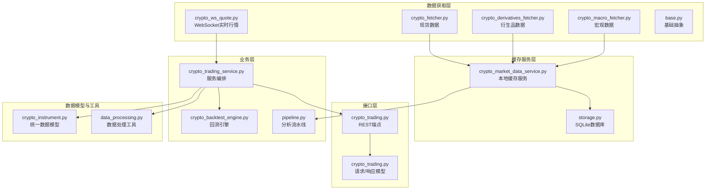

**图表来源** 
- [data_provider/crypto_fetcher.py](file://data_provider/crypto_fetcher.py)
- [data_provider/crypto_derivatives_fetcher.py](file://data_provider/crypto_derivatives_fetcher.py)
- [data_provider/crypto_macro_fetcher.py](file://data_provider/crypto_macro_fetcher.py)
- [data_provider/crypto_ws_quote.py](file://data_provider/crypto_ws_quote.py)
- [data_provider/base.py](file://data_provider/base.py)
- [src/services/crypto_market_data_service.py](file://src/services/crypto_market_data_service.py)
- [src/storage.py](file://src/storage.py)
- [src/core/pipeline.py](file://src/core/pipeline.py)
- [api/v1/endpoints/crypto_trading.py](file://api/v1/endpoints/crypto_trading.py)
- [api/v1/schemas/crypto_trading.py](file://api/v1/schemas/crypto_trading.py)
- [src/services/crypto_trading_service.py](file://src/services/crypto_trading_service.py)
- [src/core/crypto_backtest_engine.py](file://src/core/crypto_backtest_engine.py)
- [src/schemas/crypto_instrument.py](file://src/schemas/crypto_instrument.py)
- [src/utils/data_processing.py](file://src/utils/data_processing.py)

**章节来源**
- [data_provider/crypto_fetcher.py](file://data_provider/crypto_fetcher.py)
- [data_provider/crypto_derivatives_fetcher.py](file://data_provider/crypto_derivatives_fetcher.py)
- [data_provider/crypto_macro_fetcher.py](file://data_provider/crypto_macro_fetcher.py)
- [data_provider/crypto_ws_quote.py](file://data_provider/crypto_ws_quote.py)
- [data_provider/base.py](file://data_provider/base.py)
- [src/services/crypto_market_data_service.py](file://src/services/crypto_market_data_service.py)
- [src/storage.py](file://src/storage.py)
- [src/core/pipeline.py](file://src/core/pipeline.py)
- [api/v1/endpoints/crypto_trading.py](file://api/v1/endpoints/crypto_trading.py)
- [api/v1/schemas/crypto_trading.py](file://api/v1/schemas/crypto_trading.py)
- [src/services/crypto_trading_service.py](file://src/services/crypto_trading_service.py)
- [src/core/crypto_backtest_engine.py](file://src/core/crypto_backtest_engine.py)
- [src/schemas/crypto_instrument.py](file://src/schemas/crypto_instrument.py)
- [src/utils/data_processing.py](file://src/utils/data_processing.py)

## 核心组件
- 现货数据获取器（crypto_fetcher）：对接主流交易所现货API，拉取K线、深度、资金费率等，并输出标准化结构。
- 衍生品数据获取器（crypto_derivatives_fetcher）：对接期货/永续合约API，获取持仓量、资金费率、爆仓数据等。
- 宏观数据获取器（crypto_macro_fetcher）：聚合链上指标、宏观因子（如BTC主导指数、稳定币流向、ETF流入流出）。
- WebSocket实时行情（crypto_ws_quote）：维护多交易所WS连接，订阅交易对，去重、归一化后推送至内部队列或回调。
- **新增本地缓存服务（crypto_market_data_service）**：提供BTC OHLCV数据的SQLite缓存机制，实现本地优先的数据访问模式。
- 统一数据模型（crypto_instrument）：定义统一的交易对、报价、订单簿、K线、资金费率等结构，屏蔽交易所差异。
- 数据处理工具（data_processing）：提供价格聚合、成交量加权平均价（VWAP）、时间窗口统计、缺失值填充等。
- 交易服务（crypto_trading_service）：编排数据获取、清洗、聚合、比较与缓存，为API与回测提供一致的数据视图。
- 回测引擎（crypto_backtest_engine）：基于统一数据模型执行历史回测，支持多交易所数据对比与滑点/手续费模拟。

**章节来源**
- [data_provider/crypto_fetcher.py](file://data_provider/crypto_fetcher.py)
- [data_provider/crypto_derivatives_fetcher.py](file://data_provider/crypto_derivatives_fetcher.py)
- [data_provider/crypto_macro_fetcher.py](file://data_provider/crypto_macro_fetcher.py)
- [data_provider/crypto_ws_quote.py](file://data_provider/crypto_ws_quote.py)
- [src/services/crypto_market_data_service.py](file://src/services/crypto_market_data_service.py)
- [src/schemas/crypto_instrument.py](file://src/schemas/crypto_instrument.py)
- [src/utils/data_processing.py](file://src/utils/data_processing.py)
- [src/services/crypto_trading_service.py](file://src/services/crypto_trading_service.py)
- [src/core/crypto_backtest_engine.py](file://src/core/crypto_backtest_engine.py)

## 架构总览
整体采用"数据获取层 → 缓存服务层 → 服务编排层 → 接口层"的分层架构。数据获取层通过不同Fetcher对接各交易所API或WebSocket；缓存服务层负责本地SQLite存储和智能刷新；服务层负责数据标准化、聚合、比较与缓存；接口层对外暴露REST API供前端或其他系统调用。

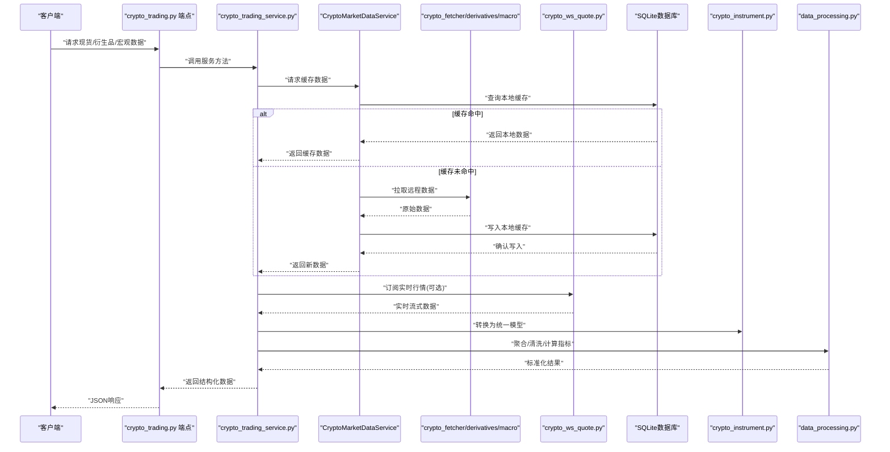

**图表来源** 
- [api/v1/endpoints/crypto_trading.py](file://api/v1/endpoints/crypto_trading.py)
- [src/services/crypto_trading_service.py](file://src/services/crypto_trading_service.py)
- [src/services/crypto_market_data_service.py](file://src/services/crypto_market_data_service.py)
- [src/storage.py](file://src/storage.py)
- [data_provider/crypto_fetcher.py](file://data_provider/crypto_fetcher.py)
- [data_provider/crypto_derivatives_fetcher.py](file://data_provider/crypto_derivatives_fetcher.py)
- [data_provider/crypto_macro_fetcher.py](file://data_provider/crypto_macro_fetcher.py)
- [data_provider/crypto_ws_quote.py](file://data_provider/crypto_ws_quote.py)
- [src/schemas/crypto_instrument.py](file://src/schemas/crypto_instrument.py)
- [src/utils/data_processing.py](file://src/utils/data_processing.py)

## 详细组件分析

### 现货数据获取器（crypto_fetcher）
- 功能要点
  - 对接多家交易所现货API，统一拉取K线、深度、成交明细等
  - 输出标准化结构，包含时间戳、交易对、开高低收、成交量、买卖盘口等
  - 支持分页与限频控制，异常重试与降级策略
- 关键流程
  - 参数校验 → 构建请求 → 发送HTTP请求 → 解析响应 → 标准化 → 缓存/返回
- 错误处理
  - 网络超时、限频、签名失败、数据格式不一致等场景均有捕获与重试
- 性能优化
  - 并发请求、连接池复用、增量更新、本地缓存

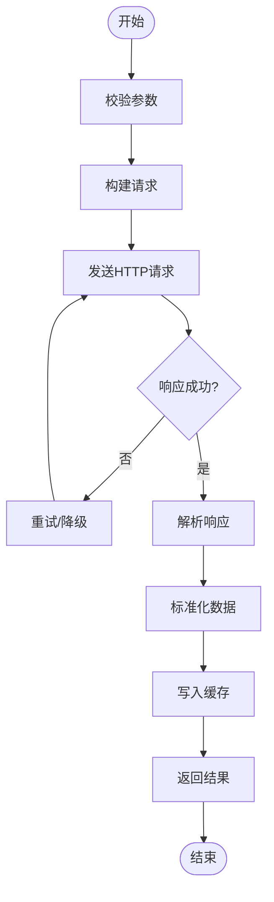

**图表来源** 
- [data_provider/crypto_fetcher.py](file://data_provider/crypto_fetcher.py)

**章节来源**
- [data_provider/crypto_fetcher.py](file://data_provider/crypto_fetcher.py)
- [tests/test_crypto_fetcher.py](file://tests/test_crypto_fetcher.py)

### 衍生品数据获取器（crypto_derivatives_fetcher）
- 功能要点
  - 获取永续/季度合约的K线、资金费率、持仓量、爆仓数据
  - 支持多交易所衍生品API，统一字段映射
- 关键流程
  - 鉴权 → 拉取资金费率/持仓量 → 解析 → 标准化 → 聚合
- 特殊处理
  - 资金费率结算周期差异、交割日处理、合约乘数换算
- 错误处理
  - 合约不可用、API限频、数据缺失等

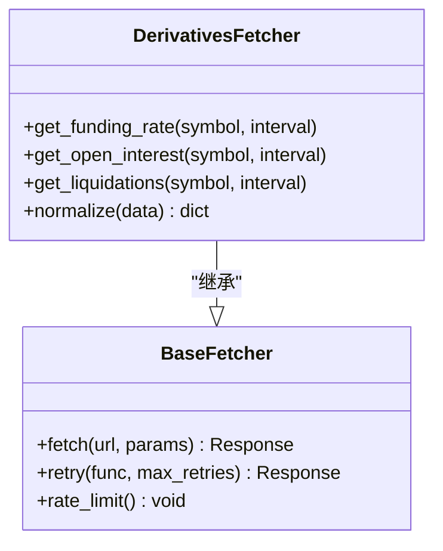

**图表来源** 
- [data_provider/crypto_derivatives_fetcher.py](file://data_provider/crypto_derivatives_fetcher.py)
- [data_provider/base.py](file://data_provider/base.py)

**章节来源**
- [data_provider/crypto_derivatives_fetcher.py](file://data_provider/crypto_derivatives_fetcher.py)
- [data_provider/base.py](file://data_provider/base.py)
- [tests/test_crypto_derivatives_fetcher.py](file://tests/test_crypto_derivatives_fetcher.py)

### 宏观数据获取器（crypto_macro_fetcher）
- 功能要点
  - 聚合链上指标（活跃地址、转账量、Gas费）、宏观因子（BTC主导指数、稳定币净流入、ETF流入流出）
  - 提供时间序列与快照两种访问方式
- 关键流程
  - 数据源选择 → 拉取 → 清洗 → 标准化 → 缓存
- 数据质量
  - 缺失值插补、异常值检测、时间对齐

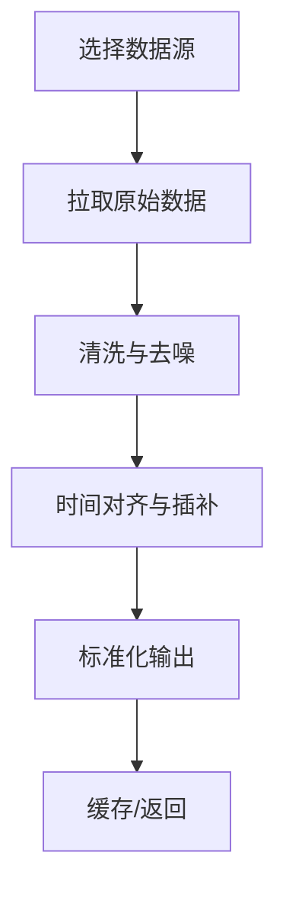

**图表来源** 
- [data_provider/crypto_macro_fetcher.py](file://data_provider/crypto_macro_fetcher.py)

**章节来源**
- [data_provider/crypto_macro_fetcher.py](file://data_provider/crypto_macro_fetcher.py)
- [tests/test_crypto_macro_fetcher.py](file://tests/test_crypto_macro_fetcher.py)

### WebSocket实时行情（crypto_ws_quote）
- 功能要点
  - 维护多交易所WS连接，订阅交易对，实时推送最新成交价、买卖盘口
  - 去重、归一化、容错重连、心跳保活
- 关键流程
  - 初始化连接 → 订阅频道 → 接收消息 → 解析 → 标准化 → 分发
- 性能特性
  - 异步I/O、批量处理、内存缓冲、背压控制

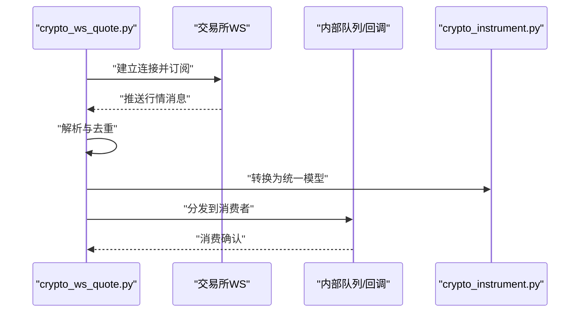

**图表来源** 
- [data_provider/crypto_ws_quote.py](file://data_provider/crypto_ws_quote.py)
- [src/schemas/crypto_instrument.py](file://src/schemas/crypto_instrument.py)

**章节来源**
- [data_provider/crypto_ws_quote.py](file://data_provider/crypto_ws_quote.py)
- [tests/test_crypto_ws_quote.py](file://tests/test_crypto_ws_quote.py)

### 本地缓存服务（crypto_market_data_service）
- 功能要点
  - **新增**：提供BTC OHLCV数据的SQLite缓存机制，实现本地优先的数据访问模式
  - 智能缓存策略：当本地数据完整时直接返回，否则从远端获取并更新缓存
  - 支持日线（daily）和小时线（hourly）两种周期，自动过滤当前未完成的时间段
  - 数据完整性验证：确保返回的数据覆盖完整的时间窗口
- 关键流程
  - 检查本地缓存 → 如果完整则返回 → 否则从远端获取 → 写入本地缓存 → 返回数据
  - 支持永续合约的特殊字段（mark price、funding rates等）
- 性能优化
  - SQLite本地存储，避免重复网络请求
  - 内容哈希验证，确保数据一致性
  - 智能刷新策略，仅在数据不完整时触发远程获取

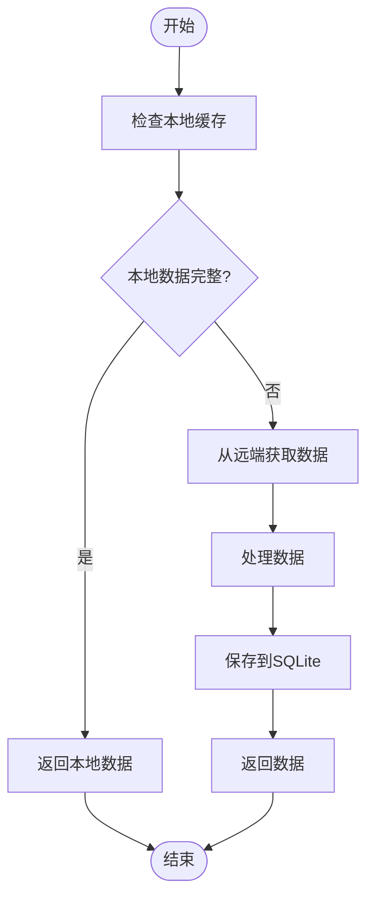

**图表来源** 
- [src/services/crypto_market_data_service.py](file://src/services/crypto_market_data_service.py)

**章节来源**
- [src/services/crypto_market_data_service.py](file://src/services/crypto_market_data_service.py)
- [tests/test_crypto_market_data_service.py](file://tests/test_crypto_market_data_service.py)

### 统一数据模型（crypto_instrument）
- 设计目标
  - 屏蔽交易所差异，提供一致的字段命名与类型
- 主要实体
  - 交易对（symbol）、报价（price/quote）、订单簿（bids/asks）、K线（OHLCV）、资金费率（funding_rate）、持仓量（open_interest）
- 扩展性
  - 支持新增字段与版本兼容

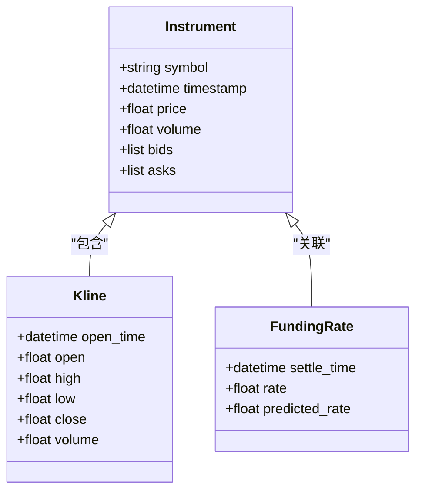

**图表来源** 
- [src/schemas/crypto_instrument.py](file://src/schemas/crypto_instrument.py)

**章节来源**
- [src/schemas/crypto_instrument.py](file://src/schemas/crypto_instrument.py)

### 数据处理工具（data_processing）
- 功能要点
  - 价格聚合（加权平均、移动平均）、成交量统计、时间窗口切片、缺失值填充、异常值过滤
- 复杂度
  - 滑动窗口O(n)，排序与聚合O(n log n)，缓存命中降低重复计算
- 适用场景
  - 跨交易所价格比较、24小时交易量计算、市场深度分析

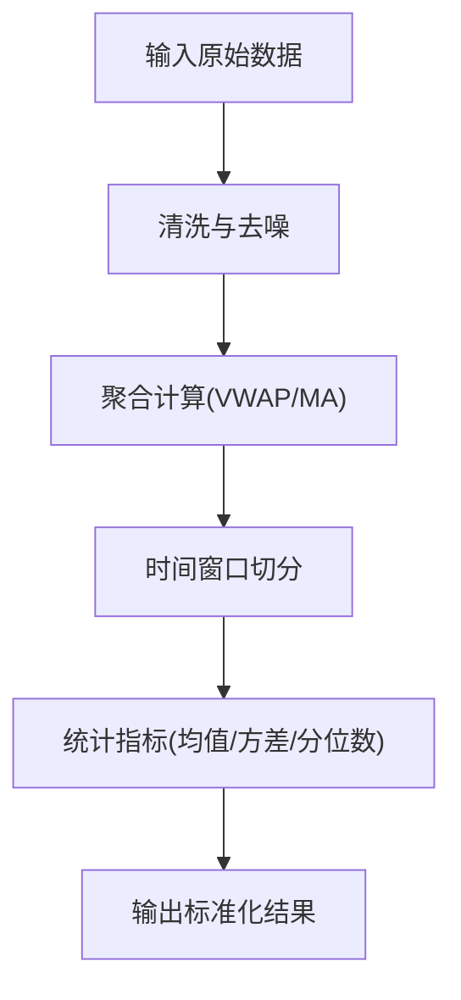

**图表来源** 
- [src/utils/data_processing.py](file://src/utils/data_processing.py)

**章节来源**
- [src/utils/data_processing.py](file://src/utils/data_processing.py)

### 交易服务（crypto_trading_service）
- 职责
  - 编排数据获取、标准化、聚合、比较与缓存；为API与回测提供一致数据视图
- 关键方法
  - 获取现货快照、衍生品快照、宏观指标、实时行情订阅、跨交易所价格比较
- 错误与降级
  - 部分数据源失败时返回可用数据并记录告警

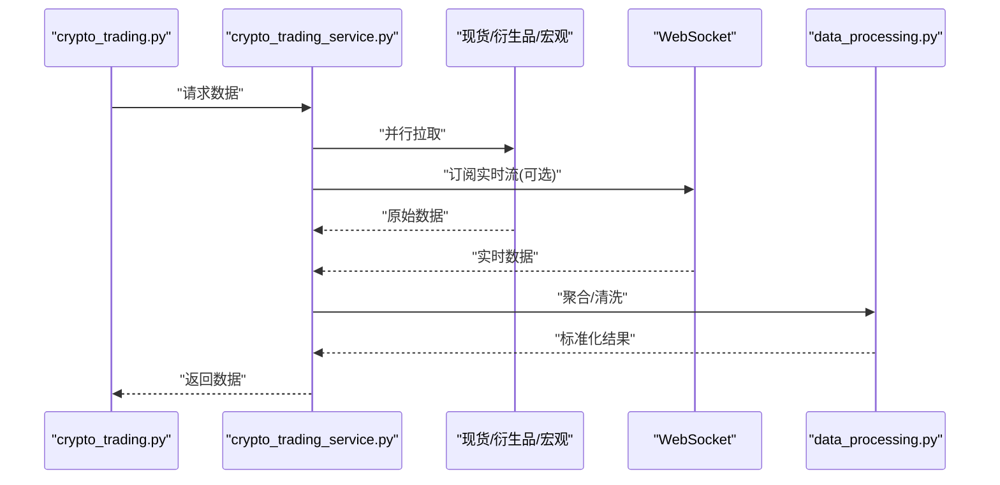

**图表来源** 
- [api/v1/endpoints/crypto_trading.py](file://api/v1/endpoints/crypto_trading.py)
- [src/services/crypto_trading_service.py](file://src/services/crypto_trading_service.py)
- [src/utils/data_processing.py](file://src/utils/data_processing.py)

**章节来源**
- [api/v1/endpoints/crypto_trading.py](file://api/v1/endpoints/crypto_trading.py)
- [src/services/crypto_trading_service.py](file://src/services/crypto_trading_service.py)

### 回测引擎（crypto_backtest_engine）
- 功能要点
  - 基于统一数据模型执行历史回测，支持多交易所数据对比、滑点与手续费模拟
- 关键流程
  - 加载数据 → 策略执行 → 交易模拟 → 绩效统计 → 报告输出
- 性能优化
  - 向量化计算、内存映射、并行回测

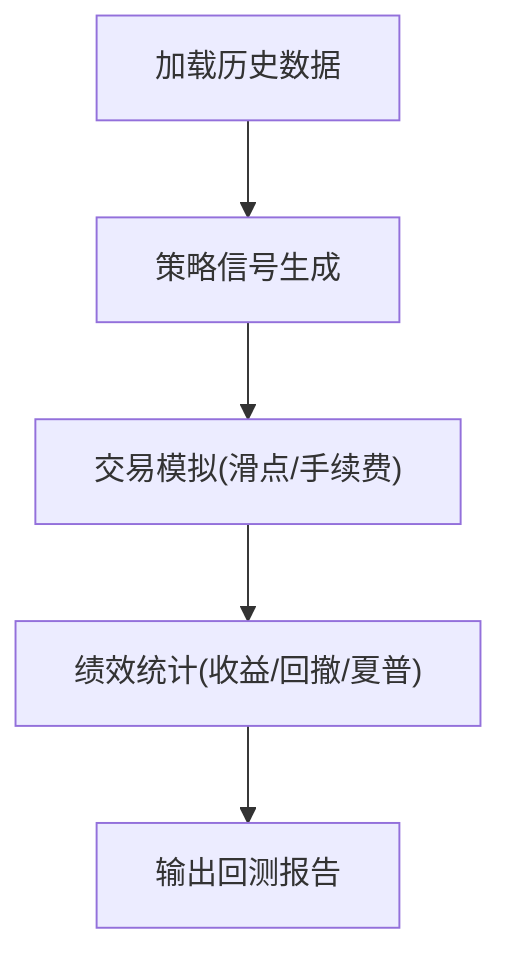

**图表来源** 
- [src/core/crypto_backtest_engine.py](file://src/core/crypto_backtest_engine.py)

**章节来源**
- [src/core/crypto_backtest_engine.py](file://src/core/crypto_backtest_engine.py)

## 依赖关系分析
- 组件耦合
  - 服务层依赖数据获取层与工具层，接口层依赖服务层
  - **新增**：缓存服务层依赖存储层和数据获取层，被pipeline和服务层使用
  - WebSocket与数据获取层解耦，通过统一模型进行通信
- 外部依赖
  - 交易所API（HTTP/WS）、第三方宏观数据源、SQLite数据库
- 潜在循环依赖
  - 通过分层与接口隔离避免循环引用

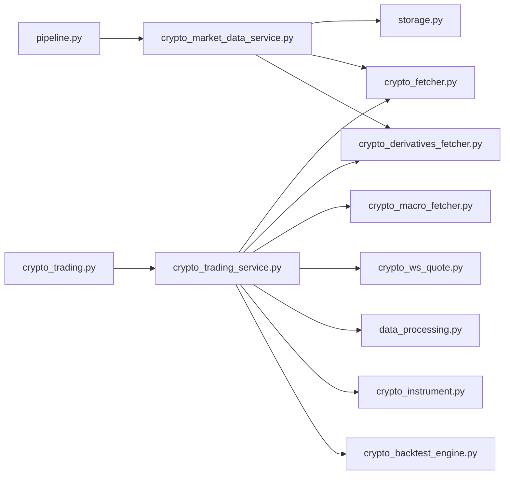

**图表来源** 
- [api/v1/endpoints/crypto_trading.py](file://api/v1/endpoints/crypto_trading.py)
- [src/services/crypto_trading_service.py](file://src/services/crypto_trading_service.py)
- [src/services/crypto_market_data_service.py](file://src/services/crypto_market_data_service.py)
- [src/storage.py](file://src/storage.py)
- [src/core/pipeline.py](file://src/core/pipeline.py)
- [data_provider/crypto_fetcher.py](file://data_provider/crypto_fetcher.py)
- [data_provider/crypto_derivatives_fetcher.py](file://data_provider/crypto_derivatives_fetcher.py)
- [data_provider/crypto_macro_fetcher.py](file://data_provider/crypto_macro_fetcher.py)
- [data_provider/crypto_ws_quote.py](file://data_provider/crypto_ws_quote.py)
- [src/utils/data_processing.py](file://src/utils/data_processing.py)
- [src/schemas/crypto_instrument.py](file://src/schemas/crypto_instrument.py)
- [src/core/crypto_backtest_engine.py](file://src/core/crypto_backtest_engine.py)

**章节来源**
- [api/v1/endpoints/crypto_trading.py](file://api/v1/endpoints/crypto_trading.py)
- [src/services/crypto_trading_service.py](file://src/services/crypto_trading_service.py)
- [src/services/crypto_market_data_service.py](file://src/services/crypto_market_data_service.py)
- [src/storage.py](file://src/storage.py)
- [src/core/pipeline.py](file://src/core/pipeline.py)
- [data_provider/crypto_fetcher.py](file://data_provider/crypto_fetcher.py)
- [data_provider/crypto_derivatives_fetcher.py](file://data_provider/crypto_derivatives_fetcher.py)
- [data_provider/crypto_macro_fetcher.py](file://data_provider/crypto_macro_fetcher.py)
- [data_provider/crypto_ws_quote.py](file://data_provider/crypto_ws_quote.py)
- [src/utils/data_processing.py](file://src/utils/data_processing.py)
- [src/schemas/crypto_instrument.py](file://src/schemas/crypto_instrument.py)
- [src/core/crypto_backtest_engine.py](file://src/core/crypto_backtest_engine.py)

## 性能考虑
- 并发与限频
  - 合理设置并发度与限频策略，避免触发交易所限制
- **新增缓存与增量更新**
  - **重要改进**：SQLite本地缓存显著减少网络请求，提高响应速度
  - 智能缓存策略：仅当本地数据不完整时才触发远程获取
  - 内容哈希验证确保数据一致性
- 内存与I/O
  - 使用异步I/O与内存映射，减少阻塞与GC压力
- 监控与告警
  - 关键指标（延迟、错误率、吞吐）监控，异常自动告警

## 故障排查指南
- 常见问题
  - 网络连接失败、限频、签名错误、数据格式不一致、时间戳错位
  - **新增**：SQLite数据库锁竞争、缓存数据损坏、远端API超时
- 排查步骤
  - 检查网络与代理、验证API密钥与权限、查看日志与错误码、复现最小用例
  - **新增**：检查SQLite数据库状态、验证缓存数据完整性、检查数据库迁移状态
- 恢复策略
  - 重试与退避、降级到备用数据源、清理缓存并重试
  - **新增**：数据库修复、缓存重建、手动触发数据同步

**章节来源**
- [data_provider/base.py](file://data_provider/base.py)
- [data_provider/crypto_fetcher.py](file://data_provider/crypto_fetcher.py)
- [data_provider/crypto_derivatives_fetcher.py](file://data_provider/crypto_derivatives_fetcher.py)
- [data_provider/crypto_macro_fetcher.py](file://data_provider/crypto_macro_fetcher.py)
- [data_provider/crypto_ws_quote.py](file://data_provider/crypto_ws_quote.py)
- [src/services/crypto_market_data_service.py](file://src/services/crypto_market_data_service.py)
- [src/storage.py](file://src/storage.py)

## 结论
本项目通过分层架构与统一数据模型，实现了加密货币现货、衍生品与宏观数据的标准化获取与处理；WebSocket实时行情与价格聚合能力为实时监控与跨交易所比较提供了坚实基础；回测引擎支持策略验证与绩效评估。

**重大改进**：新增的CryptoMarketDataService本地缓存机制显著提升了系统性能和可靠性，通过SQLite数据库实现高效的数据存储和检索，减少了网络请求频率，提高了响应速度和系统稳定性。建议在部署时关注缓存策略、数据库维护和监控，确保高可用与高性能。

## 附录
- 实时监控配置
  - 订阅频道、心跳间隔、重连策略、缓冲区大小
- 性能调优指南
  - 并发度、连接池、缓存命中率、内存占用监控
  - **新增**：SQLite数据库优化、缓存策略调优、查询性能优化
- 数据标准化规范
  - 字段命名、时间戳格式、精度与单位统一
- **新增缓存配置**
  - 缓存过期策略、数据完整性检查、远程同步触发条件
  - 数据库备份与恢复策略、性能监控指标