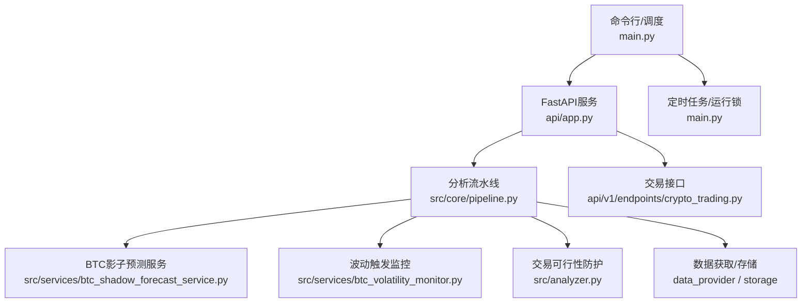
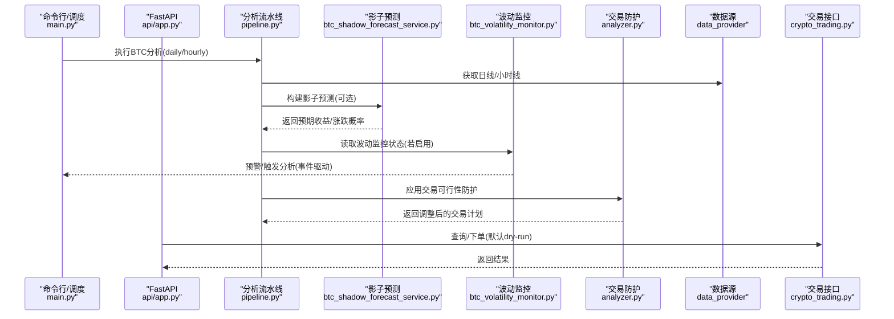
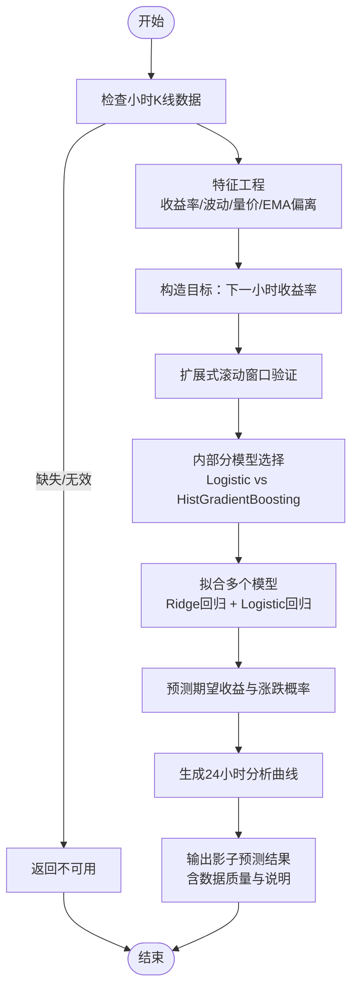
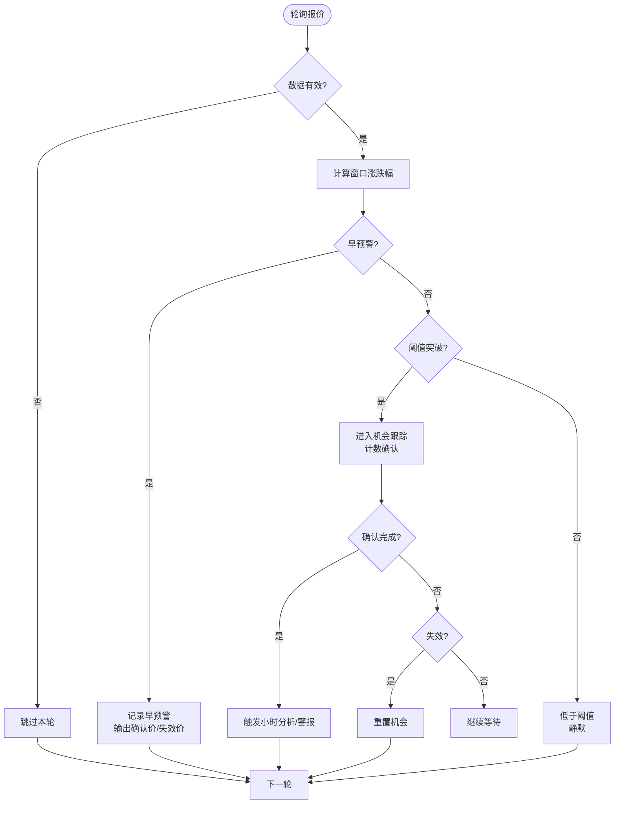
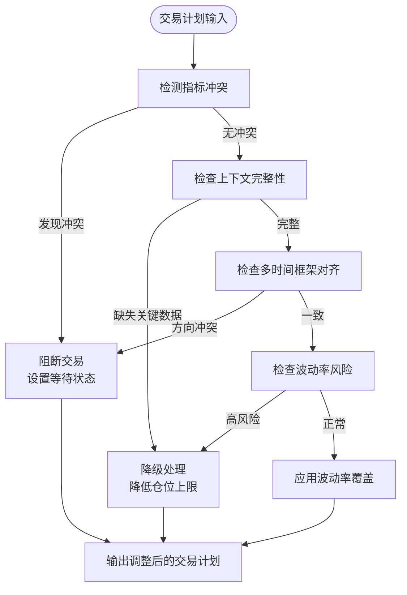
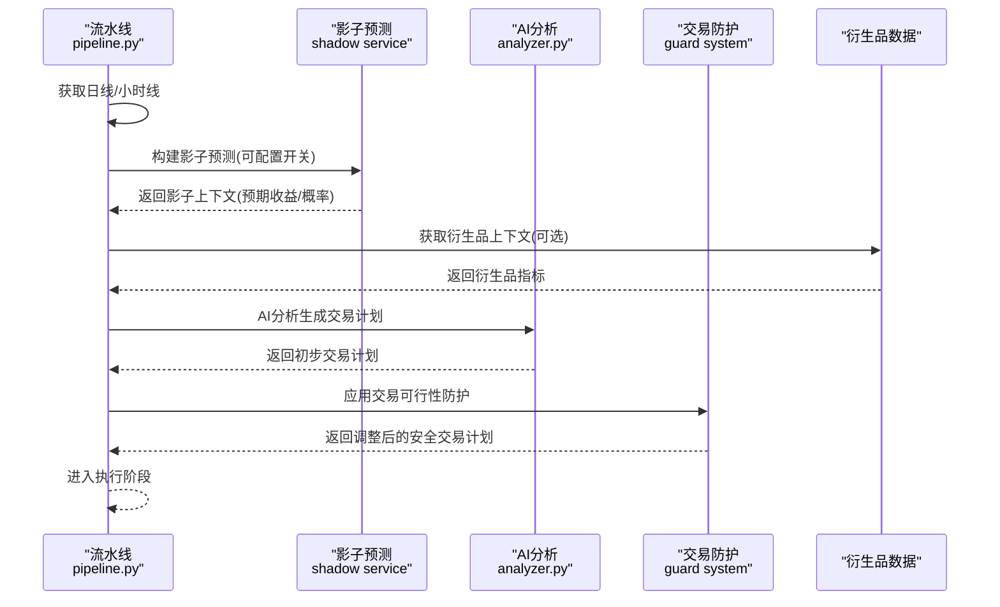
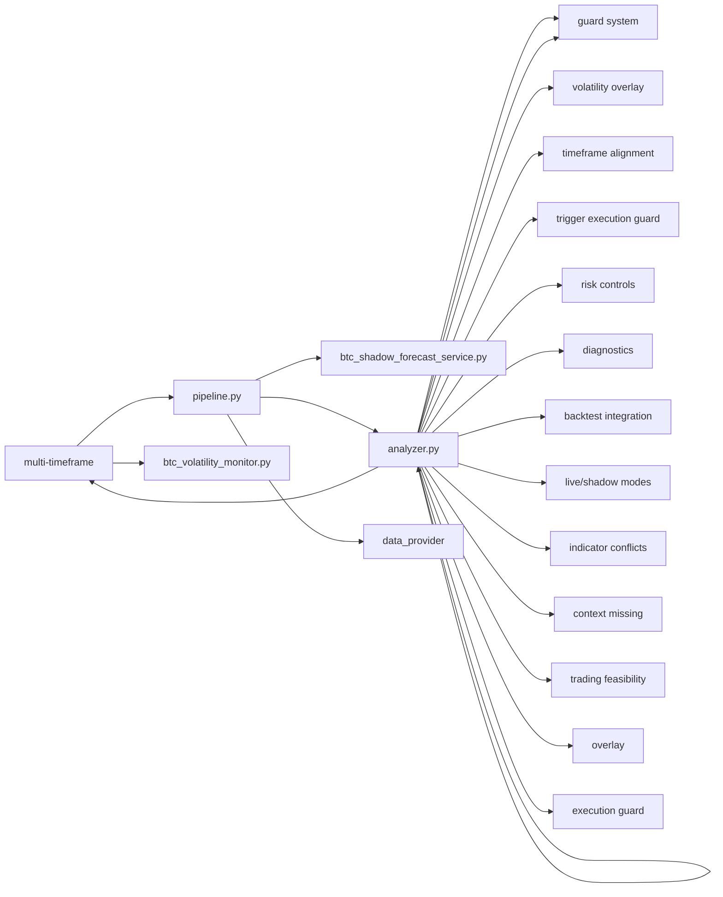

# BTC影子预测服务

<cite>
**本文引用的文件**
- [README.md](file://README.md)
- [main.py](file://main.py)
- [server.py](file://server.py)
- [api/app.py](file://api/app.py)
- [src/core/btc_only.py](file://src/core/btc_only.py)
- [src/services/btc_shadow_forecast_service.py](file://src/services/btc_shadow_forecast_service.py)
- [src/services/btc_volatility_monitor.py](file://src/services/btc_volatility_monitor.py)
- [src/core/pipeline.py](file://src/core/pipeline.py)
- [api/v1/endpoints/crypto_trading.py](file://api/v1/endpoints/crypto_trading.py)
- [tests/test_btc_shadow_forecast_service.py](file://tests/test_btc_shadow_forecast_service.py)
- [tests/test_btc_volatility_monitor.py](file://tests/test_btc_volatility_monitor.py)
- [src/config.py](file://src/config.py)
- [src/analyzer.py](file://src/analyzer.py)
- [src/core/crypto_backtest_engine.py](file://src/core/crypto_backtest_engine.py)
</cite>

## 更新摘要
**变更内容**
- 新增交易可行性防护系统，实现复杂风险控制、冲突指标自动阻断/降级和增强诊断能力
- 支持实时与影子预测模式的独立测试能力
- 增强BTC分析流水线，集成多时间框架对齐保护、波动率风险覆盖和触发执行防护
- 改进回测引擎的诊断功能，提供风险评估和交易拦截审计

## 目录
1. [简介](#简介)
2. [项目结构](#项目结构)
3. [核心组件](#核心组件)
4. [架构总览](#架构总览)
5. [详细组件分析](#详细组件分析)
6. [依赖关系分析](#依赖关系分析)
7. [性能考量](#性能考量)
8. [故障排查指南](#故障排查指南)
9. [结论](#结论)
10. [附录](#附录)

## 简介
本项目是一个聚焦比特币（BTC）的AI驱动分析与交易辅助系统。当前运行时仅支持BTC标的，提供7x24行情、新闻缓存、AI分析、多空策略与通知分发能力，并内置"BTC影子预测"与"波动触发监控"两大关键能力：
- **BTC影子预测**：已完全重构为多模型比较系统，支持24小时分析曲线、成本感知三分类目标（up/down/no_signal）、多时间框架预测（4小时主预测+24小时曲线预测），以及walk-forward验证中的内部分模型选择（Logistic Regression vs HistGradientBoostingClassifier）。输出下一小时预期收益率与涨跌概率，仅供观察与离线校准，不直接参与交易决策。
- **波动触发监控**：在价格快速波动时发出预警或触发一次小时级分析，形成入场确认价与失效价等参考信息。
- **交易可行性防护系统**：新增的智能风控层，能够检测冲突指标、缺失上下文和高风险场景，自动阻断或降级交易计划，并提供详细的诊断信息。

系统同时提供FastAPI后端、Web前端与命令行调度，支持定时任务、回测与交易接口（dry-run/真实下单需显式开启）。

**章节来源**
- [README.md:1-79](file://README.md#L1-L79)

## 项目结构
整体采用前后端分离与服务化架构：
- 入口与调度：main.py负责命令行参数解析、环境初始化、定时任务与运行锁；server.py用于启动FastAPI服务。
- API层：api/app.py创建FastAPI应用、注册路由、CORS与安全中间件；各功能模块按v1版本组织。
- 核心逻辑：src下包含pipeline（分析流水线）、services（业务服务）、core（工具与引擎）、repositories（数据访问）等。
- 数据源：data_provider提供加密货币行情与新闻抓取。
- 前端：apps/dsa-web为React/Vite前端，提供BTC看板与分析结果展示。

**图表来源**
- [main.py:341-503](file://main.py#L341-L503)
- [api/app.py:176-245](file://api/app.py#L176-L245)
- [src/core/pipeline.py:101-168](file://src/core/pipeline.py#L101-L168)
- [src/services/btc_shadow_forecast_service.py:30-120](file://src/services/btc_shadow_forecast_service.py#L30-L120)
- [src/services/btc_volatility_monitor.py:80-167](file://src/services/btc_volatility_monitor.py#L80-L167)
- [src/analyzer.py:1935-2297](file://src/analyzer.py#L1935-L2297)
- [api/v1/endpoints/crypto_trading.py:33-76](file://api/v1/endpoints/crypto_trading.py#L33-L76)

**章节来源**
- [main.py:341-503](file://main.py#L341-L503)
- [server.py:21-55](file://server.py#L21-L55)
- [api/app.py:176-245](file://api/app.py#L176-L245)

## 核心组件
- **BTC影子预测服务**：已完全重构为多模型比较系统，对小时K线进行特征工程与滚动窗口验证，输出预期收益与涨跌概率，明确标记不参与交易决策。支持成本感知的三分类目标（up/down/no_signal）和24小时分析曲线预测。
- **波动触发监控**：维护短期价格快照序列，检测阈值突破、速度异常、插针回撤等事件，生成预警与机会状态，并可触发小时分析。
- **交易可行性防护系统**：新增的智能风控层，包括冲突指标检测、缺失上下文处理、多时间框架对齐保护和波动率风险覆盖，自动阻断或降级高风险交易计划。
- **分析流水线**：协调数据获取、上下文构建、AI分析、通知与回测；在BTC路径中注入影子预测与衍生品上下文。
- **交易接口**：提供余额、持仓、订单、杠杆与保证金模式查询/操作，默认dry-run，需配置开关才真实下单。
- **BTC约束**：统一将BTC别名归一化为"BTC"，限制运行时仅处理BTC相关逻辑。

**章节来源**
- [src/services/btc_shadow_forecast_service.py:30-120](file://src/services/btc_shadow_forecast_service.py#L30-L120)
- [src/services/btc_volatility_monitor.py:80-167](file://src/services/btc_volatility_monitor.py#L80-L167)
- [src/analyzer.py:1935-2297](file://src/analyzer.py#L1935-L2297)
- [src/core/pipeline.py:507-535](file://src/core/pipeline.py#L507-L535)
- [api/v1/endpoints/crypto_trading.py:33-76](file://api/v1/endpoints/crypto_trading.py#L33-L76)
- [src/core/btc_only.py:9-23](file://src/core/btc_only.py#L9-L23)

## 架构总览
下图展示了从调度到分析、再到影子预测、波动监控和交易可行性防护的整体流程，以及API与交易接口的交互关系。

**图表来源**
- [main.py:685-800](file://main.py#L685-L800)
- [src/core/pipeline.py:507-535](file://src/core/pipeline.py#L507-L535)
- [src/services/btc_shadow_forecast_service.py:48-120](file://src/services/btc_shadow_forecast_service.py#L48-L120)
- [src/services/btc_volatility_monitor.py:106-167](file://src/services/btc_volatility_monitor.py#L106-L167)
- [src/analyzer.py:1935-2297](file://src/analyzer.py#L1935-L2297)
- [api/v1/endpoints/crypto_trading.py:154-183](file://api/v1/endpoints/crypto_trading.py#L154-L183)

## 详细组件分析

### BTC影子预测服务（已重构）
职责与特性：
- **输入**：小时K线（date/open/high/low/close/volume），自动清洗、去重、仅使用已闭合数据。
- **特征工程**：多周期收益率滞后、滚动均值/波动、成交量Z分数、实体占比、振幅、收盘价相对EMA偏离等。
- **多模型比较**：支持Logistic Regression和HistGradientBoostingClassifier两种模型，通过walk-forward验证自动选择最优模型。
- **成本感知三分类**：将目标定义为up/down/no_signal三类，考虑交易成本（默认14bps往返成本）的影响。
- **多时间框架预测**：支持4小时主预测和24小时分析曲线预测，每个时距独立建模。
- **评估指标**：扩展式滚动窗口验证，输出MAE、方向准确率、Brier Score、多分类Brier Score等。
- **输出**：预期收益百分比、涨跌概率、方向、数据质量与不可用原因；明确标注"不参与交易决策"。

**更新** 新增了以下核心功能：
- `_FoldPrediction`和`_TradeFoldPrediction`数据类，用于跟踪历史预测和评估
- 内部分模型选择机制，在训练集尾部进行模型选择
- 24小时分析曲线，每个时距直接预测相对基准收盘价
- 成本感知的三分类目标，考虑交易成本对信号生成的影响

复杂度与性能：
- 时间复杂度近似O(N·F)，N为可用bar数，F为特征维度（常数规模）。
- 空间复杂度O(N+F)，内存占用较小，适合高频调用。
- 多模型比较增加了计算开销，但通过内部分模型选择优化了最终性能。

错误与边界：
- 数据不足或格式不正确时返回"unavailable/insufficient"，不影响主流程继续。
- 数值稳定性通过clip与正则化处理。
- 当数据不足以支持多模型比较时，自动降级到基础模型。

**图表来源**
- [src/services/btc_shadow_forecast_service.py:220-250](file://src/services/btc_shadow_forecast_service.py#L220-L250)
- [src/services/btc_shadow_forecast_service.py:165-214](file://src/services/btc_shadow_forecast_service.py#L165-L214)
- [src/services/btc_shadow_forecast_service.py:48-120](file://src/services/btc_shadow_forecast_service.py#L48-L120)
- [src/services/btc_shadow_forecast_service.py:299-370](file://src/services/btc_shadow_forecast_service.py#L299-L370)

**章节来源**
- [src/services/btc_shadow_forecast_service.py:30-120](file://src/services/btc_shadow_forecast_service.py#L30-L120)
- [tests/test_btc_shadow_forecast_service.py:41-46](file://tests/test_btc_shadow_forecast_service.py#L41-L46)

### 波动触发监控
职责与特性：
- 维护价格快照序列，支持静态阈值与自适应阈值（基于近期波动率）。
- 多窗口检测：可配置多个时间窗与阈值，最短窗口突破优先。
- 事件类型：早期预警、阈值突破等待确认、流动性扫荡（插针后回落）、脉冲衰竭等。
- 确认机制：达到阈值后需要连续样本确认；极端快速行情可走"快速确认"路径。
- 冷却与超时：防止频繁触发；超过最大观察时长则放弃机会。

触发流程（简化）：
- 拉取实时报价 -> 计算窗口内涨跌幅 -> 判断是否早预警/阈值突破 -> 进入机会跟踪 -> 确认/失效/过期 -> 输出统计字段供调度器使用。

**图表来源**
- [src/services/btc_volatility_monitor.py:106-167](file://src/services/btc_volatility_monitor.py#L106-L167)
- [src/services/btc_volatility_monitor.py:419-557](file://src/services/btc_volatility_monitor.py#L419-L557)
- [src/services/btc_volatility_monitor.py:559-619](file://src/services/btc_volatility_monitor.py#L559-L619)

**章节来源**
- [src/services/btc_volatility_monitor.py:80-167](file://src/services/btc_volatility_monitor.py#L80-L167)
- [tests/test_btc_volatility_monitor.py:15-42](file://tests/test_btc_volatility_monitor.py#L15-L42)

### 交易可行性防护系统（新增）
职责与特性：
- **冲突指标检测**：识别高风险的指标冲突场景，如看跌价格行为且位于VWAP下方、量能偏低且无突破确认等。
- **缺失上下文处理**：检测衍生品数据、订单流、宏观相关性等关键上下文缺失，自动降级仓位上限。
- **多时间框架对齐保护**：确保日内计划与日线和小时线趋势一致，避免逆趋势交易。
- **波动率风险覆盖**：基于EWMA波动率预测动态调整仓位上限，适应不同市场波动环境。
- **触发执行防护**：防止晚期脉冲或衰竭信号导致的不合理追涨杀跌。

防护机制：
- **阻断模式**：当检测到严重冲突或缺失时，完全禁用交易计划，设置为等待状态。
- **降级模式**：当存在风险因素但非致命时，降低仓位上限至原计划的50%或更低。
- **诊断信息**：详细记录触发原因、风险类型和建议行动，便于后续分析和调试。

**图表来源**
- [src/analyzer.py:1935-2095](file://src/analyzer.py#L1935-L2095)
- [src/analyzer.py:2098-2297](file://src/analyzer.py#L2098-L2297)

**章节来源**
- [src/analyzer.py:1935-2297](file://src/analyzer.py#L1935-L2297)

### 分析流水线中的集成点
- 在BTC路径中，当获取到小时线数据后，会尝试构建影子预测上下文；失败时降级继续使用现有技术面上下文。
- 同时可附加衍生品上下文（如资金费率、持仓等），增强分析背景。
- 调度器通过运行锁保证同一时刻只进行一次BTC分析，避免重复提交。
- **新增**：交易可行性防护系统在AI分析后、交易执行前应用，确保所有交易计划都经过严格的风险检查。

**图表来源**
- [src/core/pipeline.py:507-535](file://src/core/pipeline.py#L507-L535)
- [src/analyzer.py:1935-2297](file://src/analyzer.py#L1935-L2297)

**章节来源**
- [src/core/pipeline.py:507-535](file://src/core/pipeline.py#L507-L535)

### 交易接口（BTC）
- 提供状态查询、余额、持仓、挂单、订单创建/撤销、杠杆与保证金模式设置。
- 默认dry-run，仅在配置允许且认证开启时才真实下单。
- 错误分类清晰：配置错误、请求无效、内部错误分别返回不同状态码与消息。
- **新增**：支持回测诊断功能，提供风险评估和交易拦截审计信息。

**章节来源**
- [api/v1/endpoints/crypto_trading.py:33-76](file://api/v1/endpoints/crypto_trading.py#L33-L76)
- [api/v1/endpoints/crypto_trading.py:154-183](file://api/v1/endpoints/crypto_trading.py#L154-L183)

## 依赖关系分析
- main.py依赖：
  - src.config与logging_config进行环境与日志初始化。
  - src.core.pipeline作为分析流水线入口。
  - src.services.btc_volatility_monitor用于事件驱动监控。
- pipeline依赖：
  - data_provider.crypto_fetcher获取行情。
  - src.services.btc_shadow_forecast_service生成影子预测。
  - src.crypto_technical构建多时间框架技术面上下文。
- api/app.py依赖：
  - FastAPI中间件（CORS、认证、错误处理）。
  - 静态资源托管与SPA回退。

**图表来源**
- [main.py:685-800](file://main.py#L685-L800)
- [src/core/pipeline.py:507-535](file://src/core/pipeline.py#L507-L535)
- [src/analyzer.py:1935-2297](file://src/analyzer.py#L1935-L2297)
- [api/app.py:176-245](file://api/app.py#L176-L245)
- [api/v1/endpoints/crypto_trading.py:33-76](file://api/v1/endpoints/crypto_trading.py#L33-L76)

**章节来源**
- [main.py:685-800](file://main.py#L685-L800)
- [src/core/pipeline.py:507-535](file://src/core/pipeline.py#L507-L535)
- [src/analyzer.py:1935-2297](file://src/analyzer.py#L1935-L2297)
- [api/app.py:176-245](file://api/app.py#L176-L245)
- [api/v1/endpoints/crypto_trading.py:33-76](file://api/v1/endpoints/crypto_trading.py#L33-L76)

## 性能考量
- **影子预测**：
  - 使用轻量numpy模型，避免重型依赖；每折独立缩放，减少过拟合风险。
  - 特征维度固定，计算开销稳定；适合每小时级别批量调用。
  - **更新**：多模型比较增加了计算开销，但通过内部分模型选择和缓存机制优化了性能。
- **波动监控**：
  - 滑动窗口与自适应阈值降低误报；冷却与超时控制避免频繁触发。
  - 速度检测基于最近采样统计，兼顾噪声过滤与及时性。
- **交易可行性防护**：
  - 轻量级规则检查，几乎不增加额外延迟。
  - 冲突检测和上下文验证采用高效的数据结构访问。
  - 诊断信息收集采用懒加载策略，只在需要时生成详细报告。
- **流水线**：
  - 并发工作线程可控；搜索服务初始化失败不阻断主流程。
  - 运行锁避免重复分析，提升资源利用率。

## 故障排查指南
常见问题与定位：
- **影子预测不可用**：
  - 检查小时线数据是否完整、时间戳与数值列是否正确；查看返回的reason字段（如hourly_bars_missing/insufficient_valid_hourly_bars）。
  - 确认最小训练bar与验证bar配置满足要求。
  - **更新**：检查多模型比较是否成功，确认是否有足够数据进行内部分模型选择。
- **波动监控未触发**：
  - 检查阈值与早预警配置；确认adaptive_enabled与velocity_enabled是否开启。
  - 查看冷却抑制与超时逻辑，确认是否被抑制或观察期已过。
- **交易可行性防护过度拦截**：
  - 检查tradeability_status和tradeability_reasons字段，了解具体阻断原因。
  - 确认缺失的上下文数据（derivatives、order_flow、macro_correlation）是否可获取。
  - 验证多时间框架对齐状态，确认是否存在方向冲突。
- **交易接口报错**：
  - 配置错误（缺少API密钥/密码）返回400；内部错误返回500；确认dry_run与auth开关。
- **前端静态资源不一致**：
  - 启动时会检查index.html引用的assets是否存在；缺失会在日志中提示，需重新构建前端。

**章节来源**
- [src/services/btc_shadow_forecast_service.py:48-120](file://src/services/btc_shadow_forecast_service.py#L48-L120)
- [src/services/btc_volatility_monitor.py:106-167](file://src/services/btc_volatility_monitor.py#L106-L167)
- [src/analyzer.py:1935-2297](file://src/analyzer.py#L1935-L2297)
- [api/v1/endpoints/crypto_trading.py:154-183](file://api/v1/endpoints/crypto_trading.py#L154-L183)
- [api/app.py:58-95](file://api/app.py#L58-L95)

## 结论
BTC影子预测服务经过完全重构，现已成为功能强大的多模型比较系统，提供下一小时预期收益与涨跌概率，明确限定为观察与校准用途，不干扰交易决策。新增的交易可行性防护系统显著增强了系统的风险控制能力，能够自动检测冲突指标、缺失上下文和高风险场景，并智能地阻断或降级交易计划。结合波动触发监控和多时间框架对齐保护，系统能够在市场异动时及时预警并触发深入分析，形成"预警—确认—计划—防护—执行"的完整闭环。配合FastAPI与Web界面，用户可便捷地查看行情、分析报告与交易状态，实现从数据到洞察的一体化体验。

## 附录
- **环境变量与开关（示例）**：
  - `BTC_SHADOW_FORECAST_ENABLED`：是否启用影子预测。
  - `BTC_VOLATILITY_MONITOR_ENABLED`：是否启用波动监控。
  - `BTC_SHADOW_FORECAST_LOOKBACK_DAYS`：回溯天数（默认2500）
  - `BTC_SHADOW_FORECAST_MIN_TRAIN_BARS`：最小训练bar数（默认336）
  - `BTC_SHADOW_FORECAST_FOLDS`：交叉验证折数（默认12）
  - `BTC_SHADOW_FORECAST_VALIDATION_BARS`：验证bar数（默认168）
  - `BTC_SHADOW_FORECAST_CURVE_HORIZON_HOURS`：曲线预测时距（默认24）
  - `BTC_SHADOW_FORECAST_PRIMARY_HORIZON_HOURS`：主预测时距（默认4）
  - `BTC_SHADOW_FORECAST_CONFIDENCE_THRESHOLD`：置信度阈值（默认0.58）
  - 其他阈值与自适应参数详见监控与预测服务的配置读取逻辑。
- **命令与模式**：
  - `--schedule`：启用定时任务（日线/小时线）。
  - `--serve-only`：仅启动API服务。
  - `--backtest`：运行回测。

**章节来源**
- [src/config.py:1620-1671](file://src/config.py#L1620-L1671)
- [tests/test_btc_shadow_forecast_service.py:129-151](file://tests/test_btc_shadow_forecast_service.py#L129-L151)