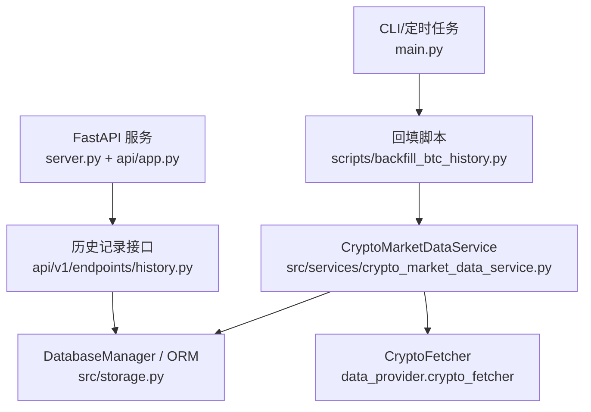
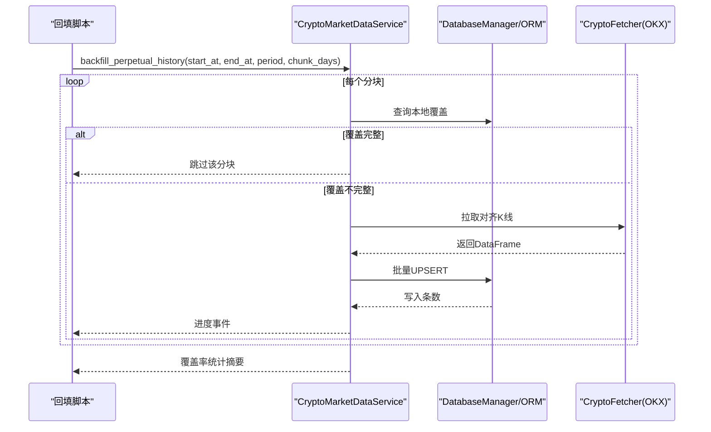
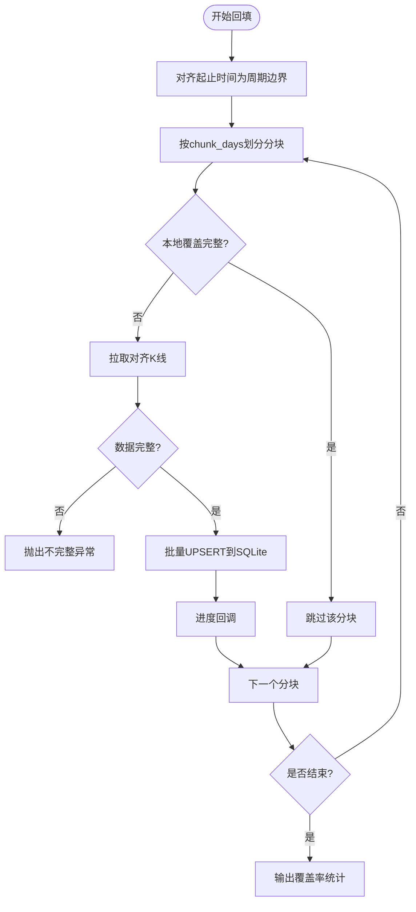
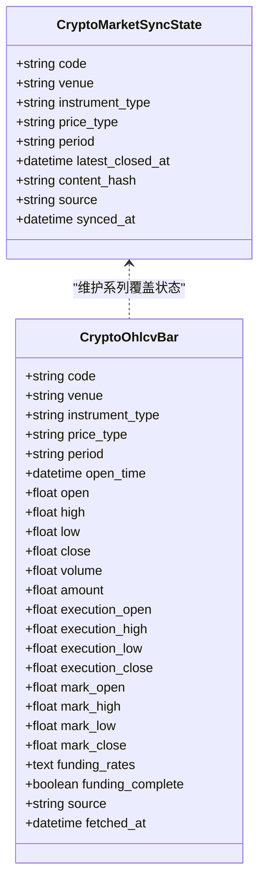
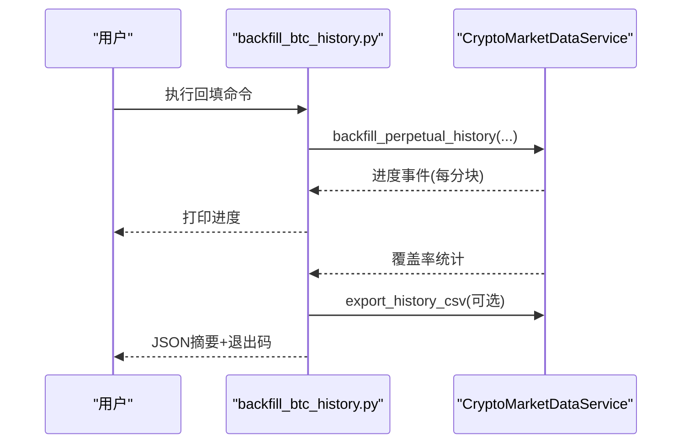
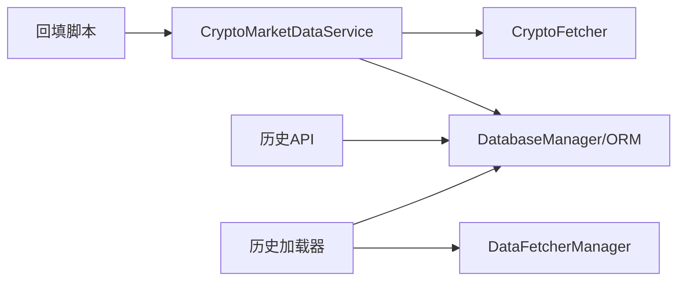

# 历史数据回填系统

<cite>
**本文引用的文件**
- [main.py](file://main.py)
- [server.py](file://server.py)
- [api/app.py](file://api/app.py)
- [api/v1/endpoints/history.py](file://api/v1/endpoints/history.py)
- [src/services/crypto_market_data_service.py](file://src/services/crypto_market_data_service.py)
- [src/services/history_loader.py](file://src/services/history_loader.py)
- [src/storage.py](file://src/storage.py)
- [scripts/backfill_btc_history.py](file://scripts/backfill_btc_history.py)
</cite>

## 目录
1. [简介](#简介)
2. [项目结构](#项目结构)
3. [核心组件](#核心组件)
4. [架构总览](#架构总览)
5. [详细组件分析](#详细组件分析)
6. [依赖关系分析](#依赖关系分析)
7. [性能考量](#性能考量)
8. [故障排查指南](#故障排查指南)
9. [结论](#结论)
10. [附录](#附录)

## 简介
本仓库提供了一套“历史数据回填系统”，用于为 BTC 永续合约（以及通用加密货币）拉取并持久化历史 K 线，确保本地 SQLite 缓存完整、连续且可用于分析与回测。系统包含：
- 命令行回填脚本：按时间区间分块从交易所拉取数据，UPSERT 到本地数据库，支持进度回调与 CSV 导出。
- 服务层：统一封装本地优先的行情读取与缺失补全逻辑，保证分析/回测的数据一致性。
- 存储层：定义加密 OHLCV 表结构与同步状态表，提供批量 UPSERT 能力。
- API 层：暴露历史查询接口，便于前端或外部系统消费历史分析结果与指标。

该系统的目标是：以最小网络开销获得完整的历史数据窗口，支撑后续的分析、回测与可视化。

## 项目结构
围绕历史数据回填的关键路径如下：
- 入口与运行模式
  - main.py：主调度与 CLI 参数解析，支持定时任务、WebUI、API 服务等模式。
  - server.py：FastAPI 启动入口，加载配置与日志后导入应用实例。
  - api/app.py：创建 FastAPI 应用、注册路由、CORS、静态资源托管与健康检查。
- 数据回填与读取
  - scripts/backfill_btc_history.py：回填脚本，调用 CryptoMarketDataService 完成分块回填与导出。
  - src/services/crypto_market_data_service.py：核心服务，负责本地优先读取、远端补齐、校验与持久化。
  - src/storage.py：ORM 模型与数据库操作，包括 crypto_ohlcv_bars 与同步状态表。
- 历史查询与分析
  - api/v1/endpoints/history.py：历史列表、详情、新闻、Markdown 报告等接口。
  - src/services/history_loader.py：DB-first 的历史 K 线加载器，失败时回退到网络获取。

图表来源
- [main.py:341-503](file://main.py#L341-L503)
- [scripts/backfill_btc_history.py:67-150](file://scripts/backfill_btc_history.py#L67-L150)
- [src/services/crypto_market_data_service.py:22-207](file://src/services/crypto_market_data_service.py#L22-L207)
- [src/storage.py:165-229](file://src/storage.py#L165-L229)
- [server.py:21-55](file://server.py#L21-L55)
- [api/app.py:176-405](file://api/app.py#L176-L405)
- [api/v1/endpoints/history.py:76-701](file://api/v1/endpoints/history.py#L76-L701)

章节来源
- [main.py:341-503](file://main.py#L341-L503)
- [server.py:21-55](file://server.py#L21-L55)
- [api/app.py:176-405](file://api/app.py#L176-L405)
- [scripts/backfill_btc_history.py:67-150](file://scripts/backfill_btc_history.py#L67-L150)
- [src/services/crypto_market_data_service.py:22-207](file://src/services/crypto_market_data_service.py#L22-L207)
- [src/storage.py:165-229](file://src/storage.py#L165-L229)
- [api/v1/endpoints/history.py:76-701](file://api/v1/endpoints/history.py#L76-L701)

## 核心组件
- CryptoMarketDataService：本地优先的 BTC/加密货币 OHLCV 服务，支持分块回填、覆盖率统计、CSV 导出与闭包校验。
- DatabaseManager/ORM：SQLite 存储层，定义 crypto_ohlcv_bars 与 crypto_market_sync_state，提供批量 UPSERT。
- 回填脚本：提供 CLI 参数控制起止时间、周期、分块大小、强制回填与 CSV 导出。
- 历史查询 API：提供历史分析记录列表、详情、新闻、Markdown 报告等 REST 接口。
- 历史加载器：DB-first 的 K 线加载器，失败时回退到 DataFetcherManager，减少冗余网络请求。

章节来源
- [src/services/crypto_market_data_service.py:22-207](file://src/services/crypto_market_data_service.py#L22-L207)
- [src/storage.py:165-229](file://src/storage.py#L165-L229)
- [scripts/backfill_btc_history.py:67-150](file://scripts/backfill_btc_history.py#L67-L150)
- [api/v1/endpoints/history.py:76-701](file://api/v1/endpoints/history.py#L76-L701)
- [src/services/history_loader.py:126-175](file://src/services/history_loader.py#L126-L175)

## 架构总览
回填与读取的整体流程如下：
- 回填流程：脚本调用服务层的 backfill_perpetual_history，按 chunk_days 切分区间；若本地覆盖完整则跳过，否则从 OKX 拉取对齐的 K 线，写入 SQLite 并更新同步状态。
- 读取流程：分析或回测通过 get_bars 或 history_loader 读取本地缓存；若覆盖不完整，自动触发远端拉取并落库，再返回完整窗口。
- API 消费：前端或外部系统通过历史接口查询分析结果与指标，不直接参与回填。

图表来源
- [scripts/backfill_btc_history.py:109-150](file://scripts/backfill_btc_history.py#L109-L150)
- [src/services/crypto_market_data_service.py:82-207](file://src/services/crypto_market_data_service.py#L82-L207)
- [src/storage.py:2432-2481](file://src/storage.py#L2432-L2481)

## 详细组件分析

### 回填服务：CryptoMarketDataService
职责与关键点：
- 本地优先：先查本地是否满足窗口要求，满足则直接返回 DataFrame。
- 远端补齐：若不满足，拉取远端数据，过滤已闭合 K 线，写入本地后再返回。
- 分块回填：backfill_perpetual_history 将时间范围按 chunk_days 切分，避免单次请求过大；对每个分块进行完整性校验。
- 覆盖率统计：get_history_coverage 计算期望与实际的 bar 数量、缺失位置、执行价/标记价缺失情况。
- CSV 导出：export_history_csv 将指定区间的本地数据导出为训练友好的 CSV。

复杂度与性能：
- 时间复杂度近似 O(N)，N 为回填区间内的 bar 总数；每次分块一次网络请求与一次批量写入。
- 空间复杂度取决于 DataFrame 与内存中的 records 列表，可通过调整 chunk_days 控制峰值。

错误处理：
- 若远端返回的对齐 K 线不完整，抛出异常提示预期与实际不符，便于定位数据源问题。
- 写入失败会降级为使用本次远端数据，不影响上层分析。

图表来源
- [src/services/crypto_market_data_service.py:82-207](file://src/services/crypto_market_data_service.py#L82-L207)
- [src/services/crypto_market_data_service.py:209-257](file://src/services/crypto_market_data_service.py#L209-L257)

章节来源
- [src/services/crypto_market_data_service.py:22-207](file://src/services/crypto_market_data_service.py#L22-L207)
- [src/services/crypto_market_data_service.py:209-257](file://src/services/crypto_market_data_service.py#L209-L257)

### 存储层：crypto_ohlcv_bars 与同步状态
- crypto_ohlcv_bars：存储加密 OHLCV 闭包 K 线，包含交易价与标记价字段、资金费率、来源与抓取时间；唯一键由 code、venue、instrument_type、price_type、period、open_time 组成，确保同一时间点只有一条记录。
- crypto_market_sync_state：记录某系列最新验证的本地覆盖信息，便于增量同步与去重判断。
- 批量 UPSERT：在 SQLite 上使用 insert().on_conflict_do_update 实现高效合并写入，避免重复插入与多次查询。

图表来源
- [src/storage.py:165-229](file://src/storage.py#L165-L229)
- [src/storage.py:2432-2481](file://src/storage.py#L2432-L2481)

章节来源
- [src/storage.py:165-229](file://src/storage.py#L165-L229)
- [src/storage.py:2432-2481](file://src/storage.py#L2432-L2481)

### 回填脚本：backfill_btc_history.py
功能要点：
- 参数：start/end（UTC）、period（hourly/daily）、chunk_days、force（强制回填）、export-csv（导出 CSV）。
- 调用 CryptoMarketDataService.backfill_perpetual_history，传入代码、交易所、保证金模式、分块大小与进度回调。
- 可选导出：回填完成后按范围导出 CSV，便于离线训练与研究。
- 退出码：若存在缺失 bar（含执行价/标记价缺失），返回非零退出码，便于 CI 或调度器检测。

图表来源
- [scripts/backfill_btc_history.py:67-150](file://scripts/backfill_btc_history.py#L67-L150)
- [src/services/crypto_market_data_service.py:82-207](file://src/services/crypto_market_data_service.py#L82-L207)

章节来源
- [scripts/backfill_btc_history.py:67-150](file://scripts/backfill_btc_history.py#L67-L150)

### 历史加载器：history_loader.py
职责：
- DB-first：优先从本地数据库读取 K 线，若满足所需记录数与日期范围，直接返回，避免多余网络请求。
- 上下文变量：通过 ContextVar 冻结 target_date，确保多线程/异步场景下目标日期一致。
- 回退机制：当 DB 读取失败或数据不足时，回退到 DataFetcherManager 获取日线数据。

适用场景：
- Agent 工具链中需要历史 K 线进行技术分析或策略评估，尽量减少对外部网络的依赖。

章节来源
- [src/services/history_loader.py:126-175](file://src/services/history_loader.py#L126-L175)

### API 历史接口：history.py
主要接口：
- GET /api/v1/history：分页查询历史分析记录摘要，支持股票代码、报告类型、日期范围筛选。
- DELETE /api/v1/history/by-code/{stock_code}：按股票代码删除所有相关历史。
- DELETE /api/v1/history：按主键 ID 批量删除。
- GET /api/v1/history/stocks：个股栏使用的历史摘要（排除大盘复盘）。
- GET /api/v1/history/{record_id}：获取完整分析报告（元数据、摘要、策略、详情）。
- GET /api/v1/history/{record_id}/diagnostics：运行诊断摘要。
- GET /api/v1/history/{record_id}/flow：运行流快照。
- GET /api/v1/history/{record_id}/news：关联新闻情报。
- GET /api/v1/history/{record_id}/markdown：Markdown 格式报告。

这些接口基于 HistoryService 与 DatabaseManager 实现，面向 Web 前端与外部系统。

章节来源
- [api/v1/endpoints/history.py:76-701](file://api/v1/endpoints/history.py#L76-L701)

## 依赖关系分析
- 回填脚本依赖 CryptoMarketDataService，后者依赖 DatabaseManager 与 CryptoFetcher。
- 历史加载器依赖 DatabaseManager 与 DataFetcherManager（作为回退）。
- API 历史接口依赖 DatabaseManager 与 HistoryService，间接访问存储层。
- 主程序与服务器负责环境初始化、日志与路由注册，不直接参与回填逻辑。

图表来源
- [scripts/backfill_btc_history.py:109-150](file://scripts/backfill_btc_history.py#L109-L150)
- [src/services/crypto_market_data_service.py:22-207](file://src/services/crypto_market_data_service.py#L22-L207)
- [src/services/history_loader.py:126-175](file://src/services/history_loader.py#L126-L175)
- [api/v1/endpoints/history.py:76-701](file://api/v1/endpoints/history.py#L76-L701)

章节来源
- [scripts/backfill_btc_history.py:109-150](file://scripts/backfill_btc_history.py#L109-L150)
- [src/services/crypto_market_data_service.py:22-207](file://src/services/crypto_market_data_service.py#L22-L207)
- [src/services/history_loader.py:126-175](file://src/services/history_loader.py#L126-L175)
- [api/v1/endpoints/history.py:76-701](file://api/v1/endpoints/history.py#L76-L701)

## 性能考量
- 分块回填：通过 chunk_days 控制每次请求的时间跨度，降低单次网络负载与内存占用。
- 本地优先：get_bars 与 history_loader 均优先读取本地缓存，仅在覆盖不完整时触发远端拉取，显著减少 HTTP 请求。
- 批量 UPSERT：SQLite 上采用 on_conflict_do_update，避免逐条插入带来的开销。
- 数据校验：对齐时间与闭包过滤确保仅写入有效数据，减少无效行与后续处理成本。
- 导出优化：CSV 导出直接从本地缓存生成，适合离线训练与审计。

[本节为通用性能建议，无需特定文件引用]

## 故障排查指南
常见问题与定位方法：
- 回填中断或返回非零退出码：检查覆盖率统计中的 missing_bars、execution_missing_bars、mark_missing_bars，确认远端数据是否完整。
- 数据不完整异常：当远端返回的 K 线不符合预期对齐时，服务会抛出异常；可调整 chunk_days 或重试。
- 本地写入失败：服务会降级为使用本次远端数据；需检查磁盘权限与 SQLite 引擎状态。
- 历史查询为空：确认数据库中是否存在对应 stock_code 的记录；可使用历史接口分页查询。
- 前端空白页：检查静态资源一致性（index.html 引用资源是否存在），服务会在启动时检测并记录缺失资源。

章节来源
- [src/services/crypto_market_data_service.py:82-207](file://src/services/crypto_market_data_service.py#L82-L207)
- [api/app.py:58-95](file://api/app.py#L58-L95)
- [api/v1/endpoints/history.py:76-701](file://api/v1/endpoints/history.py#L76-L701)

## 结论
历史数据回填系统通过“本地优先 + 远端补齐”的策略，结合分块回填与严格的数据对齐校验，确保了 BTC 永续合约历史数据的完整性与可用性。配合统一的存储层与丰富的历史查询 API，系统能够稳定支撑分析、回测与可视化需求。对于大规模回填场景，建议合理设置 chunk_days 与监控覆盖率统计，以保证效率与可靠性。

[本节为总结性内容，无需特定文件引用]

## 附录
- 常用命令示例（回填脚本）：
  - 回填小时线：python scripts/backfill_btc_history.py --start 2020-02-01T00:00:00Z --end 2024-12-31T23:00:00Z --period hourly --chunk-days 30
  - 回填日线并导出 CSV：python scripts/backfill_btc_history.py --start 2020-02-01 --end 2024-12-31 --period daily --export-csv data/btc_training.csv
- API 健康检查：GET /api/health
- 历史列表查询：GET /api/v1/history?stock_code=BTC&start_date=YYYY-MM-DD&end_date=YYYY-MM-DD&page=1&limit=20

[本节为补充说明，无需特定文件引用]