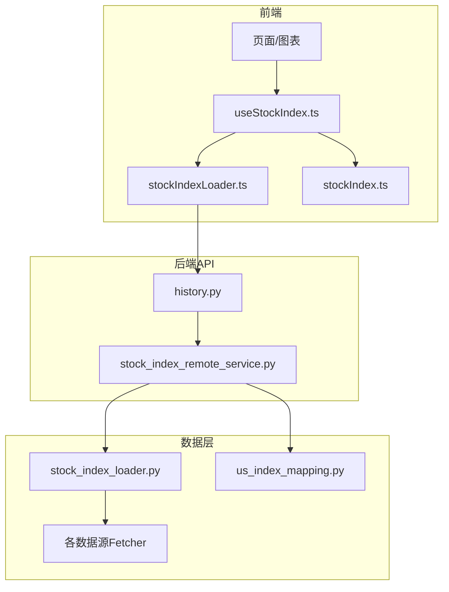
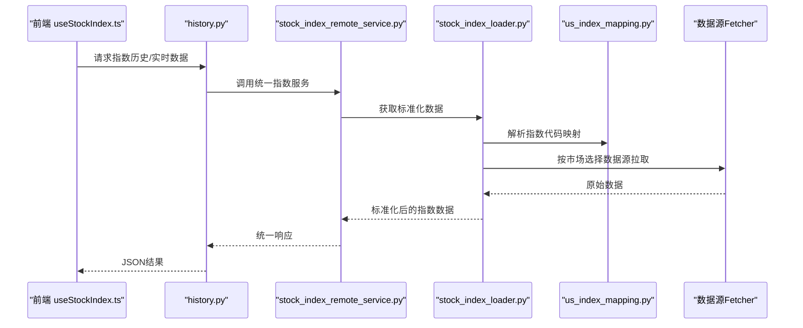
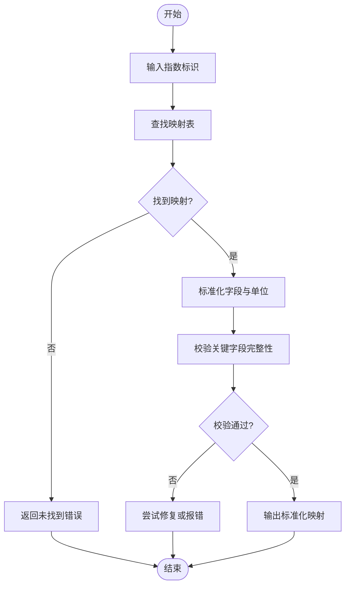
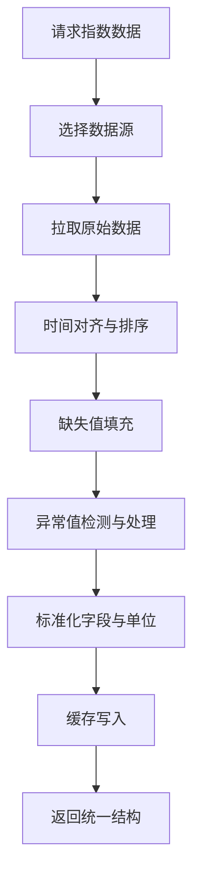
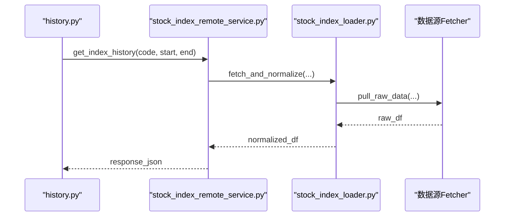
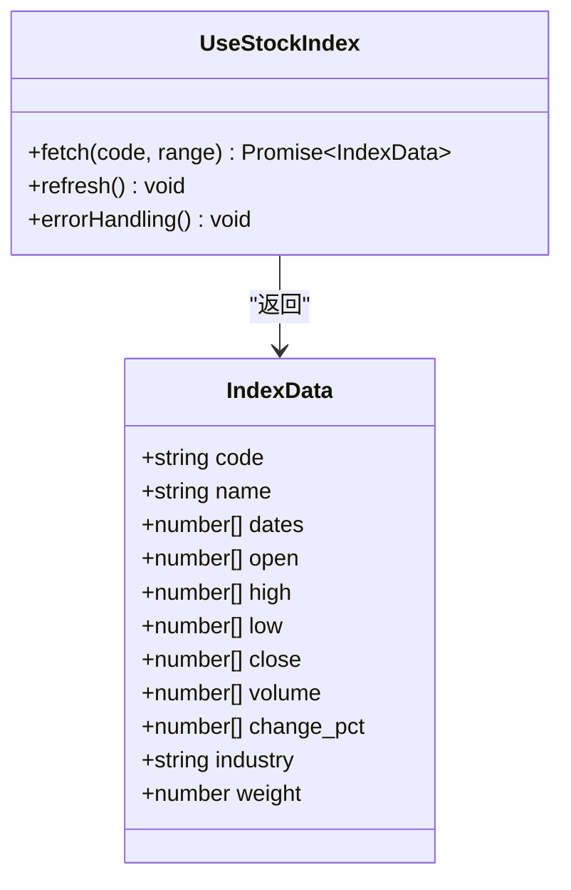
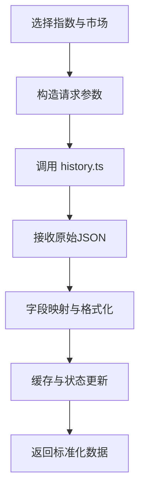
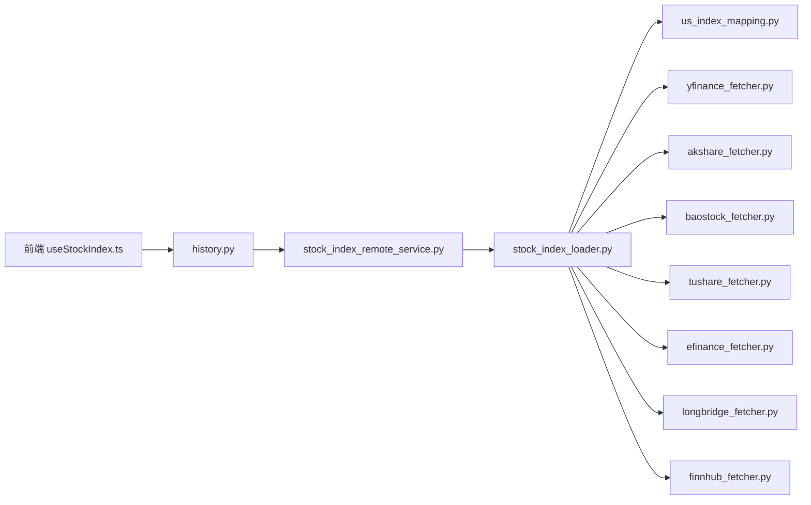

# 指数数据源

<cite>
**本文引用的文件**   
- [us_index_mapping.py](file://data_provider/us_index_mapping.py)
- [stock_index_loader.py](file://src/data/stock_index_loader.py)
- [stock_index_remote_service.py](file://src/services/stock_index_remote_service.py)
- [stockIndex.ts](file://apps/dsa-web/src/types/stockIndex.ts)
- [useStockIndex.ts](file://apps/dsa-web/src/hooks/useStockIndex.ts)
- [stockIndexFields.ts](file://apps/dsa-web/src/utils/stockIndexFields.ts)
- [stockIndexLoader.ts](file://apps/dsa-web/src/utils/stockIndexLoader.ts)
- [history.py](file://api/v1/endpoints/history.py)
- [history.ts](file://apps/dsa-web/src/api/history.ts)
- [test_us_index_mapping.py](file://tests/test_us_index_mapping.py)
- [test_stock_index_loader.py](file://tests/test_stock_index_loader.py)
- [test_stock_index_remote_service.py](file://tests/test_stock_index_remote_service.py)
</cite>

## 目录
1. [简介](#简介)
2. [项目结构](#项目结构)
3. [核心组件](#核心组件)
4. [架构总览](#架构总览)
5. [详细组件分析](#详细组件分析)
6. [依赖关系分析](#依赖关系分析)
7. [性能考量](#性能考量)
8. [故障排查指南](#故障排查指南)
9. [结论](#结论)
10. [附录](#附录)

## 简介
本文件面向“指数数据源”能力，覆盖美股、A股、港股等主要市场指数的代码映射、历史数据获取与实时更新机制；并说明指数成分股查询、权重计算、行业分类的接入方式。文档还解释指数数据的标准化处理、缺失值填充与质量检查流程，提供指数监控告警与自定义指数构建指南，帮助读者快速理解并扩展系统对多市场指数的支持。

## 项目结构
围绕指数数据源的关键文件分布如下：
- 后端数据提供者与映射
  - data_provider/us_index_mapping.py：美股指数代码映射与标准化
  - data_provider/*_fetcher.py：各数据源的拉取实现（如 yfinance、akshare、baostock、tushare、efinance、longbridge、finnhub 等）
- 后端服务与加载器
  - src/data/stock_index_loader.py：指数数据加载、缓存与聚合
  - src/services/stock_index_remote_service.py：远程指数服务封装（对外暴露统一接口）
- 前端类型与工具
  - apps/dsa-web/src/types/stockIndex.ts：指数数据结构定义
  - apps/dsa-web/src/hooks/useStockIndex.ts：指数数据 Hook
  - apps/dsa-web/src/utils/stockIndexFields.ts：字段映射与展示配置
  - apps/dsa-web/src/utils/stockIndexLoader.ts：前端指数数据加载逻辑
- API 端点
  - api/v1/endpoints/history.py：历史数据相关接口（含指数历史）
  - apps/dsa-web/src/api/history.ts：前端历史数据调用封装
- 测试
  - tests/test_us_index_mapping.py、tests/test_stock_index_loader.py、tests/test_stock_index_remote_service.py：覆盖映射、加载与服务层行为

**图示来源** 
- [history.py](file://api/v1/endpoints/history.py)
- [stock_index_remote_service.py](file://src/services/stock_index_remote_service.py)
- [stock_index_loader.py](file://src/data/stock_index_loader.py)
- [us_index_mapping.py](file://data_provider/us_index_mapping.py)
- [useStockIndex.ts](file://apps/dsa-web/src/hooks/useStockIndex.ts)
- [stockIndexLoader.ts](file://apps/dsa-web/src/utils/stockIndexLoader.ts)
- [stockIndex.ts](file://apps/dsa-web/src/types/stockIndex.ts)

**章节来源**
- [us_index_mapping.py](file://data_provider/us_index_mapping.py)
- [stock_index_loader.py](file://src/data/stock_index_loader.py)
- [stock_index_remote_service.py](file://src/services/stock_index_remote_service.py)
- [stockIndex.ts](file://apps/dsa-web/src/types/stockIndex.ts)
- [useStockIndex.ts](file://apps/dsa-web/src/hooks/useStockIndex.ts)
- [stockIndexFields.ts](file://apps/dsa-web/src/utils/stockIndexFields.ts)
- [stockIndexLoader.ts](file://apps/dsa-web/src/utils/stockIndexLoader.ts)
- [history.py](file://api/v1/endpoints/history.py)
- [history.ts](file://apps/dsa-web/src/api/history.ts)

## 核心组件
- 美股指数映射（us_index_mapping.py）
  - 负责将通用指数标识映射到具体交易代码（如标普500、纳斯达克100、道琼斯工业平均指数等），并提供标准化字段名与单位换算规则。
- 指数数据加载器（stock_index_loader.py）
  - 统一从多个数据源拉取指数历史数据，进行时间对齐、缺失值填充、异常值过滤与标准化输出，同时维护本地缓存以提升性能。
- 远程指数服务（stock_index_remote_service.py）
  - 为上层业务与API提供统一的指数查询接口，包括历史K线、实时行情、成分股列表、权重与行业分类信息。
- 前端类型与Hook（stockIndex.ts、useStockIndex.ts）
  - 定义指数数据结构与字段规范，封装数据请求、缓存与错误重试逻辑，供页面组件直接消费。
- 前端加载器与字段映射（stockIndexLoader.ts、stockIndexFields.ts）
  - 根据目标市场与指标选择合适的数据源，并将后端返回字段映射为前端展示所需格式。

**章节来源**
- [us_index_mapping.py](file://data_provider/us_index_mapping.py)
- [stock_index_loader.py](file://src/data/stock_index_loader.py)
- [stock_index_remote_service.py](file://src/services/stock_index_remote_service.py)
- [stockIndex.ts](file://apps/dsa-web/src/types/stockIndex.ts)
- [useStockIndex.ts](file://apps/dsa-web/src/hooks/useStockIndex.ts)
- [stockIndexFields.ts](file://apps/dsa-web/src/utils/stockIndexFields.ts)
- [stockIndexLoader.ts](file://apps/dsa-web/src/utils/stockIndexLoader.ts)

## 架构总览
指数数据流从前端的 Hook/Loader 发起，经后端历史数据端点进入远程指数服务，再由加载器调度具体数据源完成拉取与标准化，最终返回给前端渲染或用于策略分析。

**图示来源** 
- [useStockIndex.ts](file://apps/dsa-web/src/hooks/useStockIndex.ts)
- [history.py](file://api/v1/endpoints/history.py)
- [stock_index_remote_service.py](file://src/services/stock_index_remote_service.py)
- [stock_index_loader.py](file://src/data/stock_index_loader.py)
- [us_index_mapping.py](file://data_provider/us_index_mapping.py)

## 详细组件分析

### 美股指数代码映射（us_index_mapping.py）
- 功能要点
  - 维护主要美股指数（如标普500、纳斯达克100、道琼斯）与交易代码的映射表
  - 提供字段标准化（日期、收盘价、成交量等）与单位转换（如价格小数位、复权处理）
  - 支持扩展新指数时仅需追加映射与校验规则
- 关键流程
  - 输入：通用指数ID或名称
  - 处理：查找映射、校验有效性、生成标准字段
  - 输出：标准化的指数标识与字段字典

**图示来源** 
- [us_index_mapping.py](file://data_provider/us_index_mapping.py)

**章节来源**
- [us_index_mapping.py](file://data_provider/us_index_mapping.py)
- [test_us_index_mapping.py](file://tests/test_us_index_mapping.py)

### 指数数据加载器（stock_index_loader.py）
- 功能要点
  - 统一调度不同数据源（yfinance、akshare、baostock、tushare、efinance、longbridge、finnhub 等）
  - 时间序列对齐、缺失值填充（前向填充/线性插值）、异常值检测与剔除
  - 本地缓存（内存/磁盘）减少重复请求，提升性能
- 数据处理流程
  - 拉取原始数据 → 清洗与标准化 → 合并与去重 → 输出统一结构

**图示来源** 
- [stock_index_loader.py](file://src/data/stock_index_loader.py)

**章节来源**
- [stock_index_loader.py](file://src/data/stock_index_loader.py)
- [test_stock_index_loader.py](file://tests/test_stock_index_loader.py)

### 远程指数服务（stock_index_remote_service.py）
- 功能要点
  - 对外暴露统一接口：历史数据、实时行情、成分股、权重、行业分类
  - 内部委托 stock_index_loader 完成数据聚合与标准化
  - 支持错误回退与降级（如主数据源不可用切换备用源）
- 典型调用链
  - API 端点 → 远程服务 → 加载器 → 数据源 → 返回

**图示来源** 
- [history.py](file://api/v1/endpoints/history.py)
- [stock_index_remote_service.py](file://src/services/stock_index_remote_service.py)
- [stock_index_loader.py](file://src/data/stock_index_loader.py)

**章节来源**
- [stock_index_remote_service.py](file://src/services/stock_index_remote_service.py)
- [history.py](file://api/v1/endpoints/history.py)
- [test_stock_index_remote_service.py](file://tests/test_stock_index_remote_service.py)

### 前端类型与Hook（stockIndex.ts、useStockIndex.ts）
- stockIndex.ts
  - 定义指数数据结构（时间戳、开盘/收盘/最高/最低、成交量、涨跌幅、行业、权重等）
- useStockIndex.ts
  - 封装请求、缓存、错误重试与状态管理
  - 支持按需刷新与增量更新

**图示来源** 
- [stockIndex.ts](file://apps/dsa-web/src/types/stockIndex.ts)
- [useStockIndex.ts](file://apps/dsa-web/src/hooks/useStockIndex.ts)

**章节来源**
- [stockIndex.ts](file://apps/dsa-web/src/types/stockIndex.ts)
- [useStockIndex.ts](file://apps/dsa-web/src/hooks/useStockIndex.ts)

### 前端加载器与字段映射（stockIndexLoader.ts、stockIndexFields.ts）
- stockIndexLoader.ts
  - 根据目标市场与指标选择数据源，调用 history.ts 获取数据
  - 处理分页、缓存与错误重试
- stockIndexFields.ts
  - 定义字段映射规则（后端字段→前端展示字段）
  - 支持动态扩展与国际化

**图示来源** 
- [stockIndexLoader.ts](file://apps/dsa-web/src/utils/stockIndexLoader.ts)
- [stockIndexFields.ts](file://apps/dsa-web/src/utils/stockIndexFields.ts)
- [history.ts](file://apps/dsa-web/src/api/history.ts)

**章节来源**
- [stockIndexLoader.ts](file://apps/dsa-web/src/utils/stockIndexLoader.ts)
- [stockIndexFields.ts](file://apps/dsa-web/src/utils/stockIndexFields.ts)
- [history.ts](file://apps/dsa-web/src/api/history.ts)

## 依赖关系分析
- 模块耦合
  - 前端 Hook/Loader 依赖 history.ts 与类型定义
  - 后端 API 依赖远程指数服务，服务依赖加载器与映射表
  - 加载器依赖各数据源 Fetcher
- 外部依赖
  - 数据源：yfinance、akshare、baostock、tushare、efinance、longbridge、finnhub 等
  - 缓存：内存字典/本地文件（由加载器实现）
- 潜在循环依赖
  - 通过服务层解耦 API 与数据层，避免循环引用

**图示来源** 
- [useStockIndex.ts](file://apps/dsa-web/src/hooks/useStockIndex.ts)
- [history.py](file://api/v1/endpoints/history.py)
- [stock_index_remote_service.py](file://src/services/stock_index_remote_service.py)
- [stock_index_loader.py](file://src/data/stock_index_loader.py)
- [us_index_mapping.py](file://data_provider/us_index_mapping.py)
- [yfinance_fetcher.py](file://data_provider/yfinance_fetcher.py)
- [akshare_fetcher.py](file://data_provider/akshare_fetcher.py)
- [baostock_fetcher.py](file://data_provider/baostock_fetcher.py)
- [tushare_fetcher.py](file://data_provider/tushare_fetcher.py)
- [efinance_fetcher.py](file://data_provider/efinance_fetcher.py)
- [longbridge_fetcher.py](file://data_provider/longbridge_fetcher.py)
- [finnhub_fetcher.py](file://data_provider/finnhub_fetcher.py)

**章节来源**
- [stock_index_loader.py](file://src/data/stock_index_loader.py)
- [stock_index_remote_service.py](file://src/services/stock_index_remote_service.py)
- [us_index_mapping.py](file://data_provider/us_index_mapping.py)

## 性能考量
- 缓存策略
  - 使用内存缓存热点指数数据，降低重复请求
  - 对历史数据采用磁盘缓存，支持断点续传与增量更新
- 并发与限流
  - 对数据源请求进行并发控制与超时设置，避免雪崩
  - 失败重试与指数退避策略
- 数据标准化
  - 统一字段名与单位，减少前端转换开销
  - 缺失值填充与异常值过滤在加载器中集中处理，保证一致性

[本节为通用指导，不直接分析具体文件]

## 故障排查指南
- 常见问题
  - 指数代码映射失败：检查 us_index_mapping.py 中的映射表是否包含目标指数
  - 数据源不可用：查看对应 Fetcher 的错误日志，确认网络与认证配置
  - 缺失值过多：调整填充策略（前向填充/线性插值）与阈值
  - 实时数据延迟：检查 WebSocket 或轮询频率，优化缓存与刷新策略
- 调试建议
  - 启用详细日志，记录请求参数与返回结构
  - 使用单元测试验证映射与加载逻辑
  - 在前端增加错误提示与重试按钮

**章节来源**
- [test_us_index_mapping.py](file://tests/test_us_index_mapping.py)
- [test_stock_index_loader.py](file://tests/test_stock_index_loader.py)
- [test_stock_index_remote_service.py](file://tests/test_stock_index_remote_service.py)

## 结论
指数数据源通过统一的映射、加载与服务层设计，实现了跨市场指数的标准化接入与高效访问。前端通过类型化结构与 Hook 简化了数据消费。建议在扩展新指数时优先完善映射与字段规范，并通过测试保障稳定性。

[本节为总结性内容，不直接分析具体文件]

## 附录
- 指数成分股查询与权重计算
  - 通过 stock_index_remote_service 提供的接口获取成分股列表与权重，结合加载器的标准化输出进行可视化与分析
- 行业分类
  - 使用字段映射将后端行业编码转换为可读名称，支持多语言与自定义分类体系
- 指数监控告警
  - 基于历史数据与实时行情，设定阈值触发告警（如跌幅超过阈值、波动率异常等）
- 自定义指数构建
  - 通过组合多个标的与权重，利用加载器与映射表生成自定义指数序列，便于回测与策略研究

[本节为概念性内容，不直接分析具体文件]