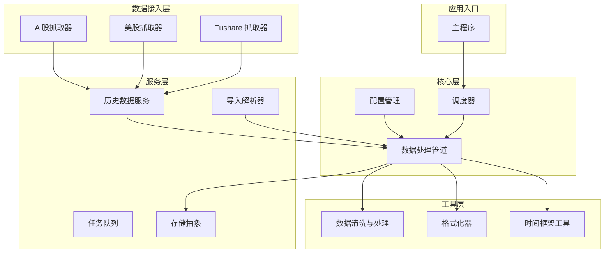
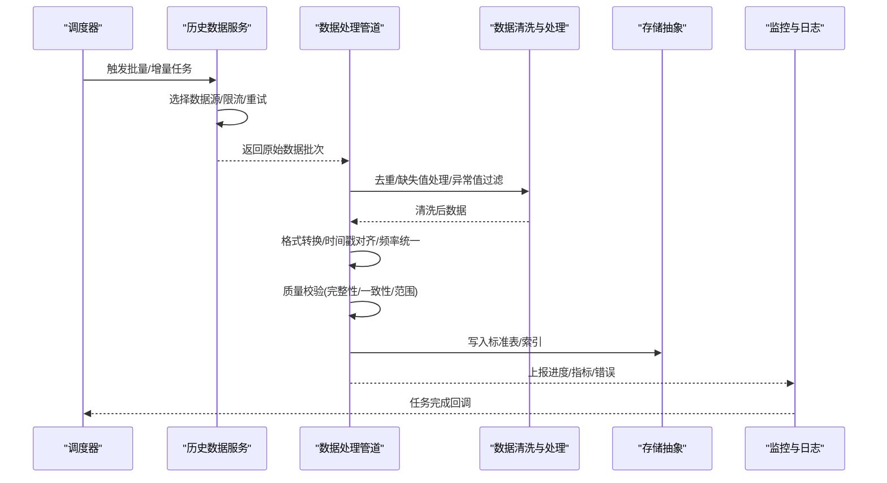
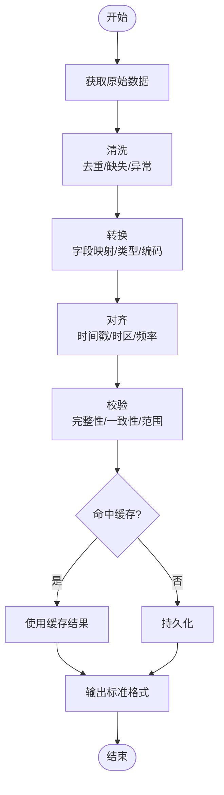
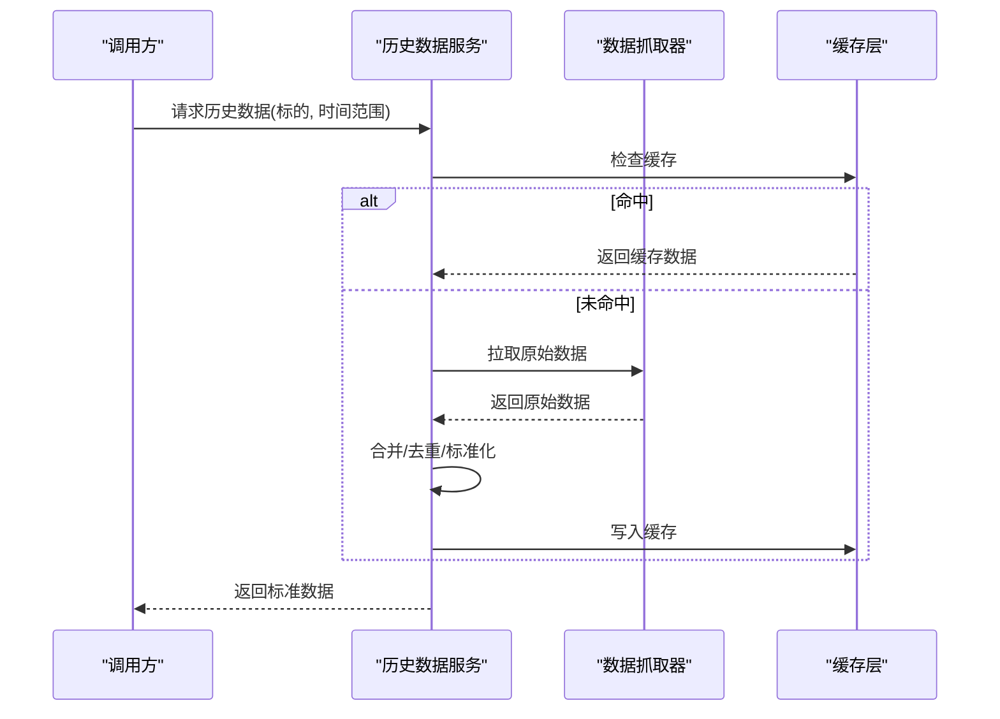
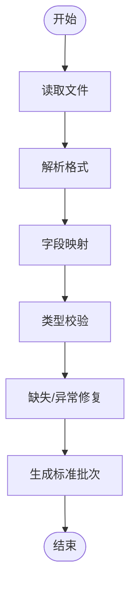
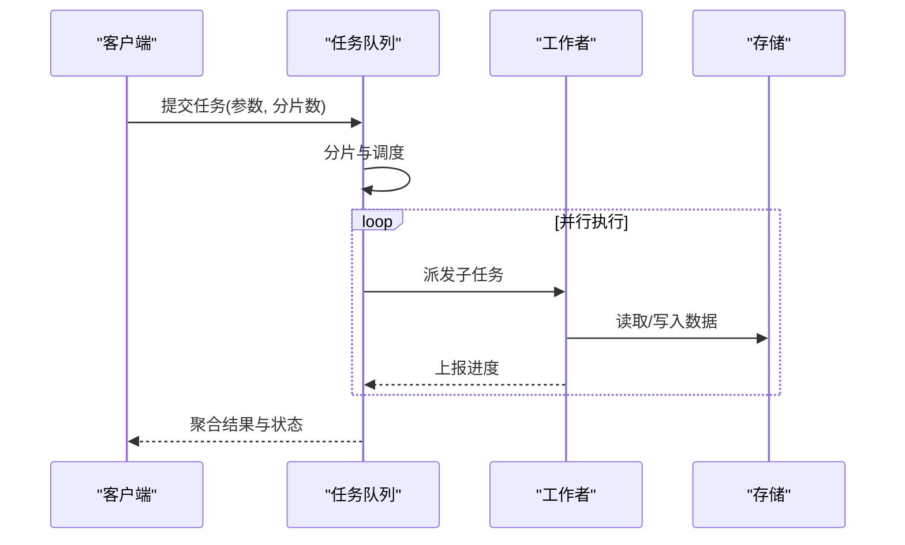
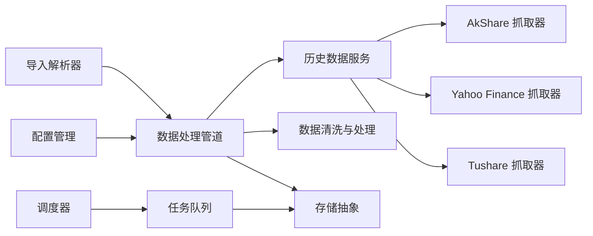

# 数据处理管道

<cite>
**本文引用的文件**   
- [pipeline.py](file://src/core/pipeline.py)
- [data_processing.py](file://src/utils/data_processing.py)
- [history_service.py](file://src/services/history_service.py)
- [import_parser.py](file://src/services/import_parser.py)
- [task_queue.py](file://src/services/task_queue.py)
- [storage.py](file://src/storage.py)
- [config_manager.py](file://src/core/config_manager.py)
- [scheduler.py](file://src/scheduler.py)
- [stock_index_loader.py](file://src/data/stock_index_loader.py)
- [akshare_fetcher.py](file://data_provider/akshare_fetcher.py)
- [yfinance_fetcher.py](file://data_provider/yfinance_fetcher.py)
- [tushare_fetcher.py](file://data_provider/tushare_fetcher.py)
- [main.py](file://main.py)
</cite>

## 目录
1. [简介](#简介)
2. [项目结构](#项目结构)
3. [核心组件](#核心组件)
4. [架构总览](#架构总览)
5. [详细组件分析](#详细组件分析)
6. [依赖关系分析](#依赖关系分析)
7. [性能考虑](#性能考虑)
8. [故障排查指南](#故障排查指南)
9. [结论](#结论)
10. [附录](#附录)

## 简介
本文件面向数据处理管道的端到端实现，覆盖从原始数据接入、清洗、格式转换、时间序列对齐到质量验证的完整流程。文档同时说明批量处理、增量更新与并发处理的工程方案，并给出缓存策略、内存管理与性能优化建议。最后提供数据导入导出工具、格式转换器与调试工具的使用说明，帮助使用者快速上手与排障。

## 项目结构
本项目采用分层与按功能域组织相结合的结构：
- 数据接入层：多源数据抓取器（如 A 股、美股、加密货币等）
- 服务层：历史数据服务、导入解析、任务队列、存储抽象
- 核心层：数据处理管道、配置管理、调度器
- 工具层：数据清洗、格式化、指标计算、时间框架处理
- 应用入口：主程序、Web API、桌面/Web 前端

图表来源
- [pipeline.py:1-200](file://src/core/pipeline.py#L1-L200)
- [data_processing.py:1-200](file://src/utils/data_processing.py#L1-L200)
- [history_service.py:1-200](file://src/services/history_service.py#L1-L200)
- [import_parser.py:1-200](file://src/services/import_parser.py#L1-L200)
- [task_queue.py:1-200](file://src/services/task_queue.py#L1-L200)
- [storage.py:1-200](file://src/storage.py#L1-L200)
- [config_manager.py:1-200](file://src/core/config_manager.py#L1-L200)
- [scheduler.py:1-200](file://src/scheduler.py#L1-L200)
- [akshare_fetcher.py:1-200](file://data_provider/akshare_fetcher.py#L1-L200)
- [yfinance_fetcher.py:1-200](file://data_provider/yfinance_fetcher.py#L1-L200)
- [tushare_fetcher.py:1-200](file://data_provider/tushare_fetcher.py#L1-L200)
- [main.py:1-200](file://main.py#L1-L200)

章节来源
- [pipeline.py:1-200](file://src/core/pipeline.py#L1-L200)
- [data_processing.py:1-200](file://src/utils/data_processing.py#L1-L200)
- [history_service.py:1-200](file://src/services/history_service.py#L1-L200)
- [import_parser.py:1-200](file://src/services/import_parser.py#L1-L200)
- [task_queue.py:1-200](file://src/services/task_queue.py#L1-L200)
- [storage.py:1-200](file://src/storage.py#L1-L200)
- [config_manager.py:1-200](file://src/core/config_manager.py#L1-L200)
- [scheduler.py:1-200](file://src/scheduler.py#L1-L200)
- [akshare_fetcher.py:1-200](file://data_provider/akshare_fetcher.py#L1-L200)
- [yfinance_fetcher.py:1-200](file://data_provider/yfinance_fetcher.py#L1-L200)
- [tushare_fetcher.py:1-200](file://data_provider/tushare_fetcher.py#L1-L200)
- [main.py:1-200](file://main.py#L1-L200)

## 核心组件
- 数据处理管道：串联数据获取、清洗、标准化、对齐、校验、落库与输出，支持阶段化执行与回滚。
- 历史数据服务：统一封装多源抓取器的调用、重试、限流与缓存，提供查询接口。
- 导入解析器：将外部 CSV/Excel/JSON 等格式转换为内部标准结构，进行字段映射与类型校验。
- 任务队列：异步任务编排、批处理分片、失败重试与进度上报。
- 存储抽象：对本地文件、SQLite/PostgreSQL/对象存储的统一读写接口。
- 配置管理：集中管理数据源、抓取参数、缓存策略、并发度与阈值。
- 调度器：定时触发批量/增量任务，协调资源与依赖。

章节来源
- [pipeline.py:1-200](file://src/core/pipeline.py#L1-L200)
- [history_service.py:1-200](file://src/services/history_service.py#L1-L200)
- [import_parser.py:1-200](file://src/services/import_parser.py#L1-L200)
- [task_queue.py:1-200](file://src/services/task_queue.py#L1-L200)
- [storage.py:1-200](file://src/storage.py#L1-L200)
- [config_manager.py:1-200](file://src/core/config_manager.py#L1-L200)
- [scheduler.py:1-200](file://src/scheduler.py#L1-L200)

## 架构总览
下图展示从数据源到标准化输出的整体流程，包括抓取、清洗、转换、对齐、校验、缓存与持久化。

图表来源
- [scheduler.py:1-200](file://src/scheduler.py#L1-L200)
- [history_service.py:1-200](file://src/services/history_service.py#L1-L200)
- [pipeline.py:1-200](file://src/core/pipeline.py#L1-L200)
- [data_processing.py:1-200](file://src/utils/data_processing.py#L1-L200)
- [storage.py:1-200](file://src/storage.py#L1-L200)

## 详细组件分析

### 数据处理管道
- 职责：定义阶段化流水线，包含数据获取、清洗、标准化、对齐、校验、缓存、持久化与输出。
- 关键特性：
  - 阶段可插拔：每个步骤以函数或类形式注册，便于扩展。
  - 上下文传递：使用上下文对象在各阶段间共享元数据与中间结果。
  - 错误隔离：单阶段失败不影响其他分支，支持补偿与重试。
  - 可观测性：每阶段记录耗时、行数、异常计数。
- 典型流程：
  - 输入：原始批次（来自服务或导入）
  - 清洗：空值填充、重复剔除、异常值裁剪、单位换算
  - 转换：字段映射、类型转换、编码统一
  - 对齐：时间戳归一、时区处理、频率对齐（日/周/月）
  - 校验：非空、范围、单调性、跨表一致性
  - 缓存：热点数据入内存/磁盘缓存，减少重复计算
  - 落库：批量插入/更新，事务保护
  - 输出：标准视图/报表/指标

图表来源
- [pipeline.py:1-200](file://src/core/pipeline.py#L1-L200)
- [data_processing.py:1-200](file://src/utils/data_processing.py#L1-L200)
- [storage.py:1-200](file://src/storage.py#L1-L200)

章节来源
- [pipeline.py:1-200](file://src/core/pipeline.py#L1-L200)
- [data_processing.py:1-200](file://src/utils/data_processing.py#L1-L200)

### 历史数据服务
- 职责：统一封装多源抓取器，提供拉取、合并、缓存与查询能力。
- 关键特性：
  - 多源路由：根据标的类型与区域选择合适抓取器。
  - 容错与重试：网络异常自动重试与降级。
  - 限流与并发：控制请求速率与并发数，避免被限流。
  - 增量更新：基于时间戳或版本号只拉取新增/变更数据。
- 典型调用链：
  - 接收任务 -> 选择抓取器 -> 拉取原始数据 -> 合并去重 -> 缓存 -> 返回

图表来源
- [history_service.py:1-200](file://src/services/history_service.py#L1-L200)
- [akshare_fetcher.py:1-200](file://data_provider/akshare_fetcher.py#L1-L200)
- [yfinance_fetcher.py:1-200](file://data_provider/yfinance_fetcher.py#L1-L200)
- [tushare_fetcher.py:1-200](file://data_provider/tushare_fetcher.py#L1-L200)

章节来源
- [history_service.py:1-200](file://src/services/history_service.py#L1-L200)
- [akshare_fetcher.py:1-200](file://data_provider/akshare_fetcher.py#L1-L200)
- [yfinance_fetcher.py:1-200](file://data_provider/yfinance_fetcher.py#L1-L200)
- [tushare_fetcher.py:1-200](file://data_provider/tushare_fetcher.py#L1-L200)

### 导入解析器
- 职责：将外部文件（CSV/Excel/JSON）解析为内部标准结构，进行字段映射、类型校验与缺失处理。
- 关键特性：
  - 多格式支持：自动识别格式，统一解析。
  - 字段映射：列名到标准字段的映射规则，支持别名与变换。
  - 类型校验：数值、日期、枚举等类型校验与修复。
  - 增量导入：基于主键或时间戳的幂等导入。
- 典型流程：
  - 读取文件 -> 解析 -> 映射 -> 校验 -> 生成标准批次 -> 返回

图表来源
- [import_parser.py:1-200](file://src/services/import_parser.py#L1-L200)

章节来源
- [import_parser.py:1-200](file://src/services/import_parser.py#L1-L200)

### 任务队列
- 职责：异步任务编排、批处理分片、失败重试、进度上报与资源控制。
- 关键特性：
  - 分片并行：大任务拆分为子任务并行执行。
  - 重试策略：指数退避与最大重试次数。
  - 进度上报：实时反馈任务状态与统计。
  - 资源限制：并发度与内存上限控制。
- 典型流程：
  - 提交任务 -> 分片 -> 并发执行 -> 聚合结果 -> 上报完成

图表来源
- [task_queue.py:1-200](file://src/services/task_queue.py#L1-L200)
- [storage.py:1-200](file://src/storage.py#L1-L200)

章节来源
- [task_queue.py:1-200](file://src/services/task_queue.py#L1-L200)

### 存储抽象
- 职责：对多种后端（本地文件、SQLite、PostgreSQL、对象存储）提供统一读写接口。
- 关键特性：
  - 统一接口：读/写/查询/事务/索引。
  - 批量操作：批量插入/更新，提升吞吐。
  - 事务保护：保证一致性。
  - 压缩与归档：冷热数据分层存储。
- 典型用法：
  - 管道在落库阶段调用存储接口，写入标准表与索引。

章节来源
- [storage.py:1-200](file://src/storage.py#L1-L200)

### 配置管理
- 职责：集中管理数据源、抓取参数、缓存策略、并发度、阈值与开关。
- 关键特性：
  - 环境变量与配置文件融合。
  - 运行时热更新。
  - 类型校验与默认值。
- 典型场景：
  - 调整并发度与超时；切换数据源；启用/禁用缓存。

章节来源
- [config_manager.py:1-200](file://src/core/config_manager.py#L1-L200)

### 调度器
- 职责：定时触发批量/增量任务，协调资源与依赖，保障稳定性。
- 关键特性：
  - Cron/间隔调度。
  - 任务依赖与顺序控制。
  - 失败告警与恢复。
- 典型场景：
  - 每日收盘后批量拉取与处理；盘中增量更新。

章节来源
- [scheduler.py:1-200](file://src/scheduler.py#L1-L200)

### 股票索引加载器
- 职责：维护股票列表、名称映射与分类信息，供上游查询与下游分析使用。
- 关键特性：
  - 远程同步与本地缓存。
  - 增量更新与版本管理。
  - 快速查找与过滤。

章节来源
- [stock_index_loader.py:1-200](file://src/data/stock_index_loader.py#L1-L200)

## 依赖关系分析
- 组件耦合：
  - 管道依赖服务、清洗、存储与配置。
  - 服务依赖抓取器与缓存。
  - 导入解析器独立于抓取器，但输出进入管道。
  - 任务队列与存储解耦，通过接口交互。
- 外部依赖：
  - 数据源抓取器（AkShare、Yahoo Finance、Tushare 等）。
  - 数据库与对象存储。
  - 消息队列（可选，用于任务分发）。
- 潜在循环依赖：
  - 通过接口与上下文对象避免直接循环引用。

图表来源
- [pipeline.py:1-200](file://src/core/pipeline.py#L1-L200)
- [history_service.py:1-200](file://src/services/history_service.py#L1-L200)
- [data_processing.py:1-200](file://src/utils/data_processing.py#L1-L200)
- [storage.py:1-200](file://src/storage.py#L1-L200)
- [import_parser.py:1-200](file://src/services/import_parser.py#L1-L200)
- [task_queue.py:1-200](file://src/services/task_queue.py#L1-L200)
- [config_manager.py:1-200](file://src/core/config_manager.py#L1-L200)
- [scheduler.py:1-200](file://src/scheduler.py#L1-L200)
- [akshare_fetcher.py:1-200](file://data_provider/akshare_fetcher.py#L1-L200)
- [yfinance_fetcher.py:1-200](file://data_provider/yfinance_fetcher.py#L1-L200)
- [tushare_fetcher.py:1-200](file://data_provider/tushare_fetcher.py#L1-L200)

章节来源
- [pipeline.py:1-200](file://src/core/pipeline.py#L1-L200)
- [history_service.py:1-200](file://src/services/history_service.py#L1-L200)
- [data_processing.py:1-200](file://src/utils/data_processing.py#L1-L200)
- [storage.py:1-200](file://src/storage.py#L1-L200)
- [import_parser.py:1-200](file://src/services/import_parser.py#L1-L200)
- [task_queue.py:1-200](file://src/services/task_queue.py#L1-L200)
- [config_manager.py:1-200](file://src/core/config_manager.py#L1-L200)
- [scheduler.py:1-200](file://src/scheduler.py#L1-L200)
- [akshare_fetcher.py:1-200](file://data_provider/akshare_fetcher.py#L1-L200)
- [yfinance_fetcher.py:1-200](file://data_provider/yfinance_fetcher.py#L1-L200)
- [tushare_fetcher.py:1-200](file://data_provider/tushare_fetcher.py#L1-L200)

## 性能考虑
- 批量处理：
  - 分片并行：将大数据集切分为小批次，提高吞吐。
  - 批量写入：使用事务与批量接口减少 IO 开销。
- 增量更新：
  - 基于时间戳或版本号仅处理新增/变更数据。
  - 合并去重策略避免重复计算。
- 并发处理：
  - 控制并发度与线程/进程池大小，避免资源争用。
  - 限流与退避策略应对第三方 API 限制。
- 缓存策略：
  - 多级缓存：内存缓存（LRU）、磁盘缓存、对象存储。
  - 缓存失效：基于时间或事件触发刷新。
- 内存管理：
  - 流式处理：避免一次性加载全量数据。
  - 垃圾回收与对象复用。
- 性能优化：
  - 索引优化：对常用查询字段建立索引。
  - 序列化优化：使用高效格式（Parquet/MessagePack）。
  - 监控与 profiling：定位瓶颈与热点。

[本节为通用指导，不直接分析具体文件]

## 故障排查指南
- 常见问题：
  - 数据源不可用：检查网络、认证、限流与重试策略。
  - 数据不一致：核对字段映射、类型转换与时区设置。
  - 任务失败：查看任务队列日志与重试次数。
  - 缓存污染：清理缓存并重新拉取。
  - 存储写入失败：检查连接、权限与事务状态。
- 诊断步骤：
  - 启用详细日志与指标上报。
  - 逐步关闭阶段以定位问题。
  - 使用最小数据集复现问题。
  - 检查配置与环境变量。
- 恢复策略：
  - 回滚到最近一致快照。
  - 重新运行失败阶段。
  - 人工干预修正数据。

章节来源
- [task_queue.py:1-200](file://src/services/task_queue.py#L1-L200)
- [storage.py:1-200](file://src/storage.py#L1-L200)
- [config_manager.py:1-200](file://src/core/config_manager.py#L1-L200)

## 结论
本数据处理管道通过模块化设计与清晰的职责划分，实现了从原始数据到标准化格式的完整流程。借助任务队列、缓存与存储抽象，系统具备高吞吐、可扩展与高可用的特性。配合配置管理与调度器，能够灵活支持批量与增量处理，满足日常分析与实时监控需求。建议在生产环境中完善监控与告警，持续优化性能与稳定性。

[本节为总结，不直接分析具体文件]

## 附录
- 数据导入导出工具：
  - 支持 CSV/Excel/JSON 导入，导出为标准格式或报表。
  - 字段映射模板与校验规则可配置。
- 格式转换器：
  - 统一时间戳、时区与频率。
  - 数值单位换算与编码统一。
- 调试工具：
  - 阶段级日志与指标。
  - 数据快照与差异对比。
  - 模拟数据生成与回放。

[本节为补充说明，不直接分析具体文件]