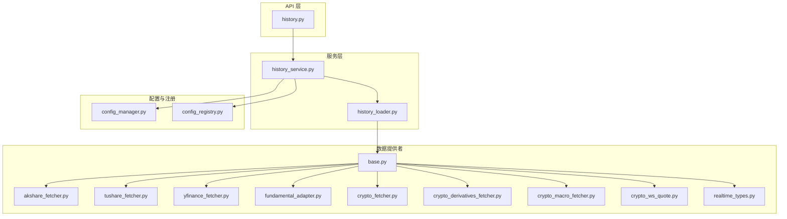
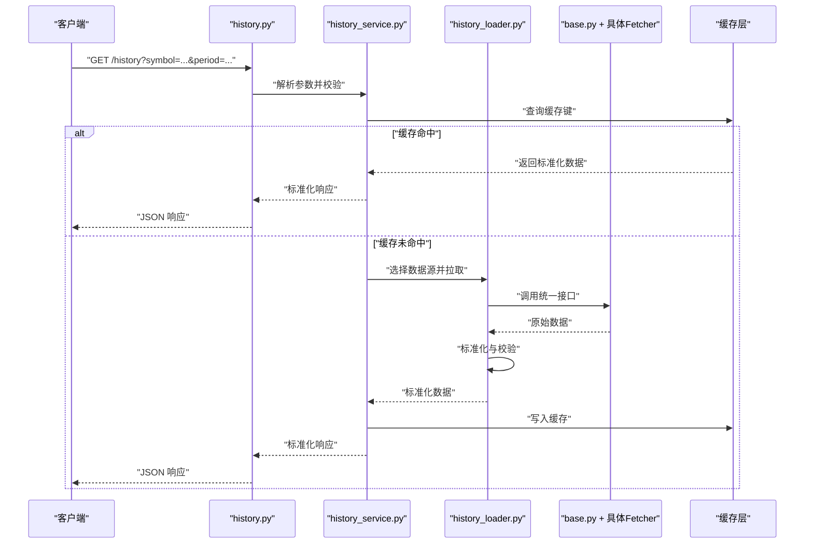
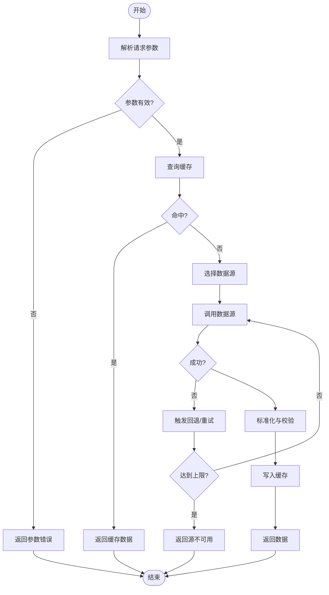
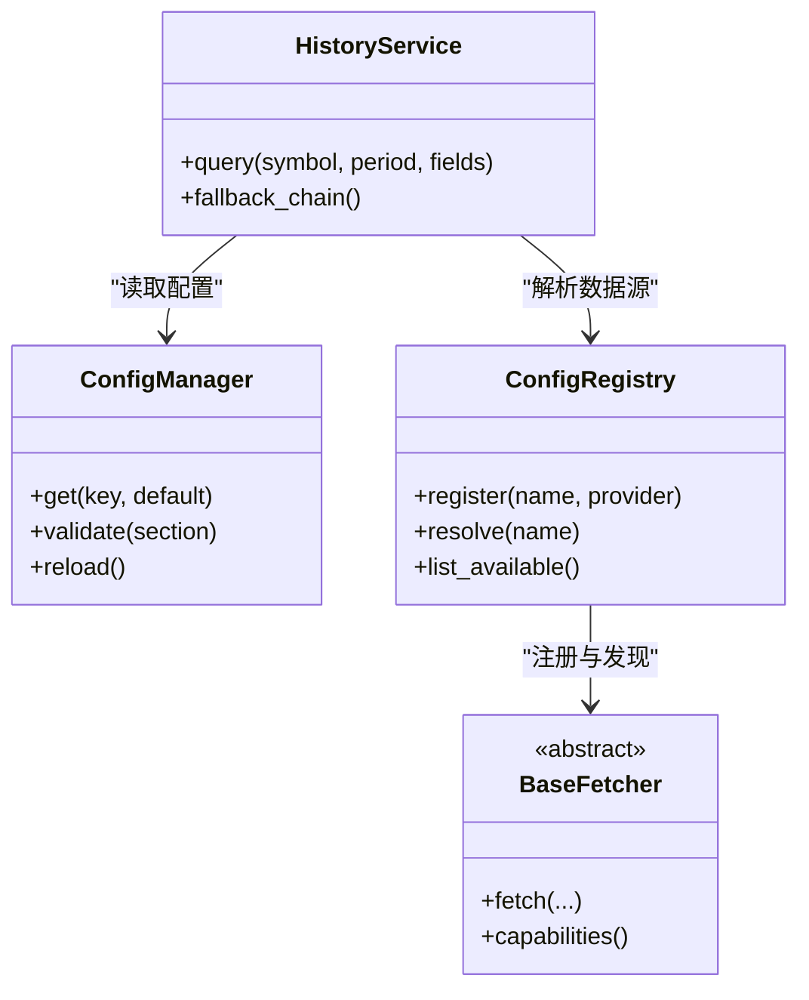
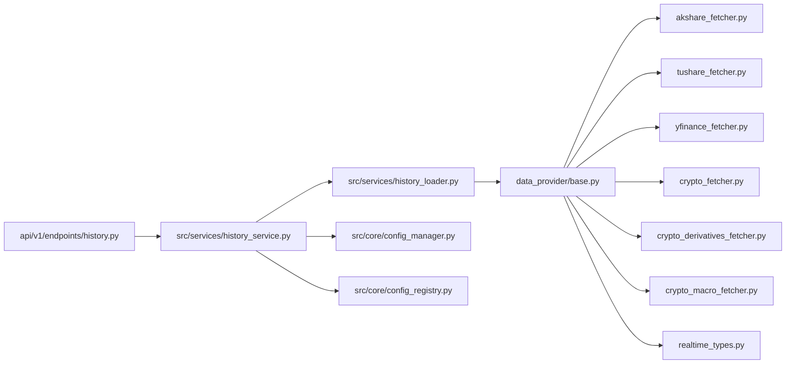

# 数据源概览与架构

<cite>
**本文引用的文件**   
- [data_provider/base.py](file://data_provider/base.py)
- [data_provider/akshare_fetcher.py](file://data_provider/akshare_fetcher.py)
- [data_provider/tushare_fetcher.py](file://data_provider/tushare_fetcher.py)
- [data_provider/yfinance_fetcher.py](file://data_provider/yfinance_fetcher.py)
- [data_provider/fundamental_adapter.py](file://data_provider/fundamental_adapter.py)
- [data_provider/crypto_fetcher.py](file://data_provider/crypto_fetcher.py)
- [data_provider/crypto_derivatives_fetcher.py](file://data_provider/crypto_derivatives_fetcher.py)
- [data_provider/crypto_macro_fetcher.py](file://data_provider/crypto_macro_fetcher.py)
- [data_provider/crypto_ws_quote.py](file://data_provider/crypto_ws_quote.py)
- [data_provider/realtime_types.py](file://data_provider/realtime_types.py)
- [src/services/history_service.py](file://src/services/history_service.py)
- [src/services/history_loader.py](file://src/services/history_loader.py)
- [src/core/config_manager.py](file://src/core/config_manager.py)
- [src/core/config_registry.py](file://src/core/config_registry.py)
- [api/v1/endpoints/history.py](file://api/v1/endpoints/history.py)
- [tests/test_history_loader.py](file://tests/test_history_loader.py)
</cite>

## 目录
1. [简介](#简介)
2. [项目结构](#项目结构)
3. [核心组件](#核心组件)
4. [架构总览](#架构总览)
5. [详细组件分析](#详细组件分析)
6. [依赖关系分析](#依赖关系分析)
7. [性能考量](#性能考量)
8. [故障排查指南](#故障排查指南)
9. [结论](#结论)
10. [附录：新数据源接入指南](#附录新数据源接入指南)

## 简介
本文件系统性梳理数据源架构，聚焦数据获取框架的设计模式、统一接口规范、数据流处理机制、标准化流程、缓存策略与错误处理。同时覆盖数据源注册机制、动态加载与配置管理，并提供新数据源接入的完整指南（接口实现要求、测试规范与部署步骤）。

## 项目结构
数据源相关代码主要分布在 data_provider 与 src/services 两个层次：
- data_provider：抽象基类与各具体数据提供商实现，负责从外部市场或 API 拉取原始数据并进行初步标准化。
- src/services：历史数据服务层，封装对数据提供者的调用、缓存、重试与错误恢复，向上暴露统一的查询接口。
- api/v1/endpoints：HTTP 接口层，将上层业务请求路由到服务层，并返回标准化响应。
- src/core：配置管理与注册表，支撑数据源的动态发现与运行时配置。

图表来源
- [api/v1/endpoints/history.py](file://api/v1/endpoints/history.py)
- [src/services/history_service.py](file://src/services/history_service.py)
- [src/services/history_loader.py](file://src/services/history_loader.py)
- [data_provider/base.py](file://data_provider/base.py)
- [data_provider/akshare_fetcher.py](file://data_provider/akshare_fetcher.py)
- [data_provider/tushare_fetcher.py](file://data_provider/tushare_fetcher.py)
- [data_provider/yfinance_fetcher.py](file://data_provider/yfinance_fetcher.py)
- [data_provider/fundamental_adapter.py](file://data_provider/fundamental_adapter.py)
- [data_provider/crypto_fetcher.py](file://data_provider/crypto_fetcher.py)
- [data_provider/crypto_derivatives_fetcher.py](file://data_provider/crypto_derivatives_fetcher.py)
- [data_provider/crypto_macro_fetcher.py](file://data_provider/crypto_macro_fetcher.py)
- [data_provider/crypto_ws_quote.py](file://data_provider/crypto_ws_quote.py)
- [data_provider/realtime_types.py](file://data_provider/realtime_types.py)
- [src/core/config_manager.py](file://src/core/config_manager.py)
- [src/core/config_registry.py](file://src/core/config_registry.py)

章节来源
- [data_provider/base.py](file://data_provider/base.py)
- [src/services/history_service.py](file://src/services/history_service.py)
- [src/services/history_loader.py](file://src/services/history_loader.py)
- [api/v1/endpoints/history.py](file://api/v1/endpoints/history.py)
- [src/core/config_manager.py](file://src/core/config_manager.py)
- [src/core/config_registry.py](file://src/core/config_registry.py)

## 核心组件
- 抽象基类与统一接口
  - 定义数据获取的统一方法签名、参数约定、返回值结构与异常契约，确保各数据提供商可被替换与组合。
  - 支持按资产类别（股票、加密货币等）与数据类型（行情、基本面、衍生品、宏观）进行能力声明。
- 数据提供商实现
  - 针对不同外部源（如 A 股、美股、加密资产）的具体实现，遵循统一接口，完成鉴权、限流、重试与数据清洗。
- 适配器与类型系统
  - 将异构数据转换为内部标准模型；实时行情使用专用类型以保障低延迟与一致性。
- 服务层编排
  - 历史数据服务负责选择数据源、合并结果、缓存命中、失败回退与超时控制。
- 配置与注册
  - 通过配置管理器与注册表在启动时扫描并注册可用数据源，支持热更新与多环境切换。

章节来源
- [data_provider/base.py](file://data_provider/base.py)
- [data_provider/fundamental_adapter.py](file://data_provider/fundamental_adapter.py)
- [data_provider/realtime_types.py](file://data_provider/realtime_types.py)
- [src/services/history_service.py](file://src/services/history_service.py)
- [src/core/config_manager.py](file://src/core/config_manager.py)
- [src/core/config_registry.py](file://src/core/config_registry.py)

## 架构总览
数据流从 API 进入，经服务层选择数据源，调用具体 Fetcher 获取原始数据，再经适配器标准化后返回。缓存层拦截重复请求，错误处理保证健壮性。

图表来源
- [api/v1/endpoints/history.py](file://api/v1/endpoints/history.py)
- [src/services/history_service.py](file://src/services/history_service.py)
- [src/services/history_loader.py](file://src/services/history_loader.py)
- [data_provider/base.py](file://data_provider/base.py)

## 详细组件分析

### 抽象基类与统一接口
- 设计要点
  - 统一方法签名：获取历史行情、实时报价、基本面数据等。
  - 参数约定：时间范围、复权方式、频率、字段白名单等。
  - 返回值：标准化的 DataFrame/列表结构，包含字段名、单位、时区等元信息。
  - 异常契约：网络错误、认证失败、限流、数据缺失等分类抛出。
- 扩展点
  - 能力声明：是否支持实时、是否支持复权、是否支持多市场。
  - 钩子：预取、重试、降级、监控埋点。

章节来源
- [data_provider/base.py](file://data_provider/base.py)

### 数据提供商实现（示例）
- A 股与通用行情
  - akshare_fetcher：面向国内 A 股与指数，处理复权、除权、停牌等边界情况。
  - tushare_fetcher：面向 Tushare Pro，处理 Token 鉴权、积分限制与分页。
  - yfinance_fetcher：面向美股与全球指数，处理时区、交易日历与数据清洗。
- 加密货币
  - crypto_fetcher：现货行情聚合与标准化。
  - crypto_derivatives_fetcher：合约、期权等衍生品数据。
  - crypto_macro_fetcher：链上宏观指标与资金流向。
  - crypto_ws_quote：WebSocket 实时推送，断线重连与乱序处理。
- 基本面适配
  - fundamental_adapter：将不同财务数据源映射为标准字段集，处理币种、会计期间与口径差异。

章节来源
- [data_provider/akshare_fetcher.py](file://data_provider/akshare_fetcher.py)
- [data_provider/tushare_fetcher.py](file://data_provider/tushare_fetcher.py)
- [data_provider/yfinance_fetcher.py](file://data_provider/yfinance_fetcher.py)
- [data_provider/crypto_fetcher.py](file://data_provider/crypto_fetcher.py)
- [data_provider/crypto_derivatives_fetcher.py](file://data_provider/crypto_derivatives_fetcher.py)
- [data_provider/crypto_macro_fetcher.py](file://data_provider/crypto_macro_fetcher.py)
- [data_provider/crypto_ws_quote.py](file://data_provider/crypto_ws_quote.py)
- [data_provider/fundamental_adapter.py](file://data_provider/fundamental_adapter.py)

### 实时类型与标准化
- realtime_types：定义实时报价、订单簿、成交明细等数据结构，确保跨源一致性与序列化效率。
- 标准化流程：字段映射、单位换算、时区对齐、空值填充、去重与排序。

章节来源
- [data_provider/realtime_types.py](file://data_provider/realtime_types.py)

### 服务层编排与数据流
- history_service：对外暴露统一查询接口，负责参数校验、数据源选择、缓存读写、错误回退与结果合并。
- history_loader：协调多个 Fetcher，执行并发拉取、超时控制、重试与降级策略。

图表来源
- [src/services/history_service.py](file://src/services/history_service.py)
- [src/services/history_loader.py](file://src/services/history_loader.py)

章节来源
- [src/services/history_service.py](file://src/services/history_service.py)
- [src/services/history_loader.py](file://src/services/history_loader.py)

### 配置管理与数据源注册
- config_manager：集中管理环境变量、配置文件与运行时参数，提供类型安全的读取与校验。
- config_registry：维护数据源的能力清单与实例注册，支持动态发现与按需加载。

图表来源
- [src/core/config_manager.py](file://src/core/config_manager.py)
- [src/core/config_registry.py](file://src/core/config_registry.py)
- [data_provider/base.py](file://data_provider/base.py)
- [src/services/history_service.py](file://src/services/history_service.py)

章节来源
- [src/core/config_manager.py](file://src/core/config_manager.py)
- [src/core/config_registry.py](file://src/core/config_registry.py)

## 依赖关系分析
- 耦合与内聚
  - 服务层与数据提供者之间通过抽象基类解耦，便于替换与扩展。
  - 标准化与类型定义集中在 data_provider，提升复用性。
- 外部依赖
  - 各 Fetcher 依赖第三方库（如 akshare、tushare、yfinance），需隔离异常与限流。
- 潜在循环依赖
  - 通过注册表与服务层单向引用避免循环。

图表来源
- [api/v1/endpoints/history.py](file://api/v1/endpoints/history.py)
- [src/services/history_service.py](file://src/services/history_service.py)
- [src/services/history_loader.py](file://src/services/history_loader.py)
- [data_provider/base.py](file://data_provider/base.py)
- [data_provider/akshare_fetcher.py](file://data_provider/akshare_fetcher.py)
- [data_provider/tushare_fetcher.py](file://data_provider/tushare_fetcher.py)
- [data_provider/yfinance_fetcher.py](file://data_provider/yfinance_fetcher.py)
- [data_provider/crypto_fetcher.py](file://data_provider/crypto_fetcher.py)
- [data_provider/crypto_derivatives_fetcher.py](file://data_provider/crypto_derivatives_fetcher.py)
- [data_provider/crypto_macro_fetcher.py](file://data_provider/crypto_macro_fetcher.py)
- [data_provider/realtime_types.py](file://data_provider/realtime_types.py)
- [src/core/config_manager.py](file://src/core/config_manager.py)
- [src/core/config_registry.py](file://src/core/config_registry.py)

章节来源
- [api/v1/endpoints/history.py](file://api/v1/endpoints/history.py)
- [src/services/history_service.py](file://src/services/history_service.py)
- [src/services/history_loader.py](file://src/services/history_loader.py)
- [data_provider/base.py](file://data_provider/base.py)
- [src/core/config_manager.py](file://src/core/config_manager.py)
- [src/core/config_registry.py](file://src/core/config_registry.py)

## 性能考量
- 缓存策略
  - 基于 symbol+period+fields 的复合键，设置合理的 TTL 与失效策略。
  - 热点数据优先命中，冷数据走回退路径。
- 并发与限流
  - 并行拉取多源数据，结合超时与熔断，避免雪崩。
  - 对第三方 API 实施令牌桶/漏桶限流。
- 内存与序列化
  - 使用惰性加载与分块处理大表，减少峰值内存。
  - 标准化输出采用高效序列化格式。
- 监控与可观测性
  - 记录关键指标：命中率、延迟分布、错误率、回退次数。

[本节为通用指导，不直接分析具体文件]

## 故障排查指南
- 常见问题定位
  - 参数错误：检查请求字段与校验规则。
  - 缓存未命中：确认键生成逻辑与过期策略。
  - 数据源不可用：查看日志中的错误分类与回退链路。
  - 限流与超时：调整重试次数与退避策略。
- 调试建议
  - 开启详细日志与追踪 ID。
  - 使用最小化用例复现问题。
  - 对比不同数据源的结果差异。

章节来源
- [tests/test_history_loader.py](file://tests/test_history_loader.py)

## 结论
该数据源架构通过抽象基类与统一接口实现了多源数据的可插拔接入，服务层编排保证了高可用与高性能，配置与注册机制支撑了动态扩展。标准化与缓存策略提升了整体稳定性与响应速度。

[本节为总结，不直接分析具体文件]

## 附录：新数据源接入指南
- 接口实现要求
  - 继承抽象基类，实现统一的数据获取方法。
  - 声明能力（是否支持实时、复权、多市场等）。
  - 处理鉴权、限流、重试与异常分类。
  - 输出标准化数据结构，包含必要元信息。
- 数据标准化流程
  - 字段映射、单位换算、时区对齐、空值处理、去重排序。
  - 使用适配器统一不同类型数据（如基本面、衍生品）。
- 缓存与错误处理
  - 在服务层配置缓存键与 TTL。
  - 实现回退链路与降级策略。
- 配置与注册
  - 在配置管理器中新增数据源配置项。
  - 在注册表中登记数据源名称与实例。
- 测试规范
  - 单元测试：覆盖正常路径、边界条件与异常分支。
  - 集成测试：模拟第三方 API 行为与限流场景。
  - 回归测试：验证标准化结果与历史一致性。
- 部署步骤
  - 安装依赖与环境变量配置。
  - 启动服务并验证健康检查。
  - 灰度发布与监控告警配置。

章节来源
- [data_provider/base.py](file://data_provider/base.py)
- [data_provider/fundamental_adapter.py](file://data_provider/fundamental_adapter.py)
- [src/core/config_manager.py](file://src/core/config_manager.py)
- [src/core/config_registry.py](file://src/core/config_registry.py)
- [src/services/history_service.py](file://src/services/history_service.py)
- [tests/test_history_loader.py](file://tests/test_history_loader.py)