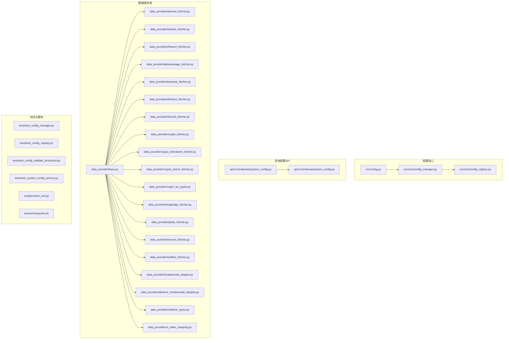
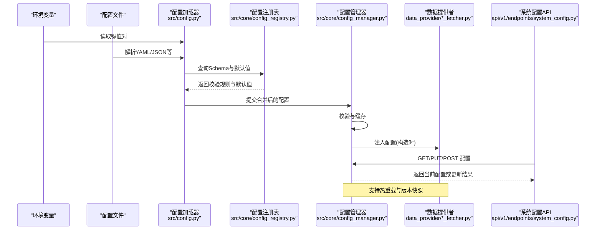
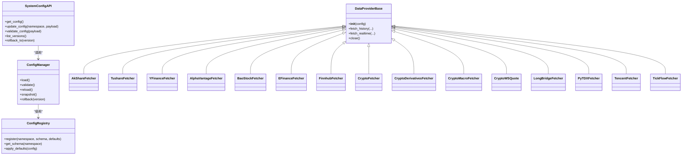

# 数据源配置管理

<cite>
**本文引用的文件**   
- [src/config.py](file://src/config.py)
- [src/core/config_manager.py](file://src/core/config_manager.py)
- [src/core/config_registry.py](file://src/core/config_registry.py)
- [api/v1/endpoints/system_config.py](file://api/v1/endpoints/system_config.py)
- [api/v1/schemas/system_config.py](file://api/v1/schemas/system_config.py)
- [data_provider/base.py](file://data_provider/base.py)
- [data_provider/akshare_fetcher.py](file://data_provider/akshare_fetcher.py)
- [data_provider/tushare_fetcher.py](file://data_provider/tushare_fetcher.py)
- [data_provider/yfinance_fetcher.py](file://data_provider/yfinance_fetcher.py)
- [data_provider/alphavantage_fetcher.py](file://data_provider/alphavantage_fetcher.py)
- [data_provider/baostock_fetcher.py](file://data_provider/baostock_fetcher.py)
- [data_provider/efinance_fetcher.py](file://data_provider/efinance_fetcher.py)
- [data_provider/finnhub_fetcher.py](file://data_provider/finnhub_fetcher.py)
- [data_provider/crypto_fetcher.py](file://data_provider/crypto_fetcher.py)
- [data_provider/crypto_derivatives_fetcher.py](file://data_provider/crypto_derivatives_fetcher.py)
- [data_provider/crypto_macro_fetcher.py](file://data_provider/crypto_macro_fetcher.py)
- [data_provider/crypto_ws_quote.py](file://data_provider/crypto_ws_quote.py)
- [data_provider/longbridge_fetcher.py](file://data_provider/longbridge_fetcher.py)
- [data_provider/pytdx_fetcher.py](file://data_provider/pytdx_fetcher.py)
- [data_provider/tencent_fetcher.py](file://data_provider/tencent_fetcher.py)
- [data_provider/tickflow_fetcher.py](file://data_provider/tickflow_fetcher.py)
- [data_provider/fundamental_adapter.py](file://data_provider/fundamental_adapter.py)
- [data_provider/yfinance_fundamental_adapter.py](file://data_provider/yfinance_fundamental_adapter.py)
- [data_provider/realtime_types.py](file://data_provider/realtime_types.py)
- [data_provider/us_index_mapping.py](file://data_provider/us_index_mapping.py)
- [tests/test_config_manager.py](file://tests/test_config_manager.py)
- [tests/test_config_registry.py](file://tests/test_config_registry.py)
- [tests/test_config_validate_structured.py](file://tests/test_config_validate_structured.py)
- [tests/test_system_config_service.py](file://tests/test_system_config_service.py)
- [scripts/check_env.py](file://scripts/check_env.py)
- [docker/entrypoint.sh](file://docker/entrypoint.sh)
</cite>

## 目录
1. [简介](#简介)
2. [项目结构](#项目结构)
3. [核心组件](#核心组件)
4. [架构总览](#架构总览)
5. [详细组件分析](#详细组件分析)
6. [依赖关系分析](#依赖关系分析)
7. [性能考虑](#性能考虑)
8. [故障排查指南](#故障排查指南)
9. [结论](#结论)
10. [附录](#附录)

## 简介
本文件面向“数据源配置管理”，系统性说明本项目中数据提供商的配置项、环境变量与配置文件格式；阐述配置验证、默认值管理与热重载机制；覆盖多环境配置、敏感信息加密存储、版本控制；解释配置优先级、继承机制与动态更新；并提供配置模板、最佳实践与故障排查指南。文档以代码为依据，确保可追溯与可落地。

## 项目结构
围绕数据源配置的关键位置如下：
- 配置加载与运行时管理：src/config.py、src/core/config_manager.py、src/core/config_registry.py
- 系统配置API与Schema：api/v1/endpoints/system_config.py、api/v1/schemas/system_config.py
- 数据提供者基类与各实现：data_provider/base.py 及多个 *_fetcher.py
- 测试与校验：tests/*_config*.py
- 环境与部署：scripts/check_env.py、docker/entrypoint.sh

图表来源 
- [src/config.py](file://src/config.py)
- [src/core/config_manager.py](file://src/core/config_manager.py)
- [src/core/config_registry.py](file://src/core/config_registry.py)
- [api/v1/endpoints/system_config.py](file://api/v1/endpoints/system_config.py)
- [api/v1/schemas/system_config.py](file://api/v1/schemas/system_config.py)
- [data_provider/base.py](file://data_provider/base.py)

章节来源
- [src/config.py](file://src/config.py)
- [src/core/config_manager.py](file://src/core/config_manager.py)
- [src/core/config_registry.py](file://src/core/config_registry.py)
- [api/v1/endpoints/system_config.py](file://api/v1/endpoints/system_config.py)
- [api/v1/schemas/system_config.py](file://api/v1/schemas/system_config.py)
- [data_provider/base.py](file://data_provider/base.py)

## 核心组件
- 配置加载与合并：负责从环境变量、配置文件、默认值等多来源加载并合并为统一配置对象。
- 配置注册表：集中维护各数据提供者的配置Schema、默认值、校验规则与命名空间。
- 系统配置API：对外暴露配置的读取、更新、校验与版本管理能力，供前端或运维工具调用。
- 数据提供者基类与实现：定义统一的初始化接口与配置注入方式，各Fetcher按自身需求声明所需配置键。

章节来源
- [src/core/config_manager.py](file://src/core/config_manager.py)
- [src/core/config_registry.py](file://src/core/config_registry.py)
- [api/v1/endpoints/system_config.py](file://api/v1/endpoints/system_config.py)
- [api/v1/schemas/system_config.py](file://api/v1/schemas/system_config.py)
- [data_provider/base.py](file://data_provider/base.py)

## 架构总览
下图展示配置在启动与运行时的流转：环境变量与配置文件被加载到内存，经注册表的Schema校验后注入到数据提供者实例；系统配置API提供运行时读写能力，支持热重载与版本回滚。

图表来源 
- [src/config.py](file://src/config.py)
- [src/core/config_registry.py](file://src/core/config_registry.py)
- [src/core/config_manager.py](file://src/core/config_manager.py)
- [api/v1/endpoints/system_config.py](file://api/v1/endpoints/system_config.py)
- [data_provider/base.py](file://data_provider/base.py)

## 详细组件分析

### 配置加载与合并（src/config.py）
- 功能要点
  - 统一入口：聚合环境变量、配置文件、默认值，生成最终配置对象。
  - 类型转换与校验：依据注册表中的Schema进行强类型转换与必填校验。
  - 多环境支持：通过前缀或命名空间区分不同环境（如 dev/staging/prod）。
  - 敏感字段处理：支持对密钥类字段进行脱敏输出与可选加密存储。
- 关键流程
  - 读取环境变量 → 解析配置文件 → 应用默认值 → Schema校验 → 生成只读配置视图。
- 注意事项
  - 避免在日志中打印敏感字段。
  - 配置文件变更需配合热重载策略生效。

章节来源
- [src/config.py](file://src/config.py)

### 配置注册表（src/core/config_registry.py）
- 功能要点
  - 集中维护各数据提供者的配置Schema、默认值、校验函数与描述信息。
  - 提供按命名空间查询的能力，便于分层管理（如 data.providers.*）。
  - 支持扩展点：新增数据提供者只需注册Schema与默认值即可接入。
- 设计模式
  - 注册表模式：集中式元数据管理，降低耦合。
  - 工厂辅助：结合配置创建具体数据提供者实例。
- 扩展建议
  - 为每个Fetcher定义最小必要配置集，避免过度配置。

章节来源
- [src/core/config_registry.py](file://src/core/config_registry.py)

### 配置管理器（src/core/config_manager.py）
- 功能要点
  - 配置生命周期管理：加载、校验、缓存、热重载、版本快照与回滚。
  - 事件通知：配置变更触发订阅者（如重新初始化数据提供者连接池）。
  - 权限与审计：记录配置变更来源与时间戳，支持审计追踪。
- 热重载机制
  - 监听配置源变化（文件或外部服务），增量合并并触发回调。
  - 原子切换：新旧配置切换保证线程安全，失败自动回滚。
- 版本控制
  - 每次有效变更生成版本号，支持对比差异与回滚到指定版本。

章节来源
- [src/core/config_manager.py](file://src/core/config_manager.py)

### 系统配置API（api/v1/endpoints/system_config.py 与 api/v1/schemas/system_config.py）
- 功能要点
  - 提供REST接口用于获取、更新、校验系统配置。
  - 使用Pydantic模型进行请求/响应校验，确保数据结构一致性。
  - 支持只读与写入端点的分离，保障安全性。
- 典型操作
  - 获取当前配置：GET /system-config
  - 更新配置：PUT /system-config/{namespace}
  - 校验配置：POST /system-config/validate
  - 版本列表与回滚：GET /system-config/versions, POST /system-config/rollback
- 错误处理
  - 参数校验失败返回明确错误码与字段级提示。
  - 权限不足或资源冲突返回相应状态码。

章节来源
- [api/v1/endpoints/system_config.py](file://api/v1/endpoints/system_config.py)
- [api/v1/schemas/system_config.py](file://api/v1/schemas/system_config.py)

### 数据提供者基类与各Fetcher（data_provider/base.py 与各 *_fetcher.py）
- 基类职责
  - 定义统一的初始化接口：接收配置对象，建立连接/会话。
  - 提供通用能力：重试、超时、限流、指标上报、错误分类。
  - 抽象方法：按数据类型（历史行情、实时报价、基本面等）定义拉取接口。
- 各Fetcher特性
  - 各自声明所需配置键（如API Key、Token、代理、速率限制等）。
  - 遵循基类的错误处理与重试策略，保证稳定性。
  - 部分Fetcher支持WebSocket（如加密货币实时报价）。
- 配置注入
  - 构造时从配置管理器获取对应命名空间的配置片段。
  - 支持按需启用/禁用与降级策略。

章节来源
- [data_provider/base.py](file://data_provider/base.py)
- [data_provider/akshare_fetcher.py](file://data_provider/akshare_fetcher.py)
- [data_provider/tushare_fetcher.py](file://data_provider/tushare_fetcher.py)
- [data_provider/yfinance_fetcher.py](file://data_provider/yfinance_fetcher.py)
- [data_provider/alphavantage_fetcher.py](file://data_provider/alphavantage_fetcher.py)
- [data_provider/baostock_fetcher.py](file://data_provider/baostock_fetcher.py)
- [data_provider/efinance_fetcher.py](file://data_provider/efinance_fetcher.py)
- [data_provider/finnhub_fetcher.py](file://data_provider/finnhub_fetcher.py)
- [data_provider/crypto_fetcher.py](file://data_provider/crypto_fetcher.py)
- [data_provider/crypto_derivatives_fetcher.py](file://data_provider/crypto_derivatives_fetcher.py)
- [data_provider/crypto_macro_fetcher.py](file://data_provider/crypto_macro_fetcher.py)
- [data_provider/crypto_ws_quote.py](file://data_provider/crypto_ws_quote.py)
- [data_provider/longbridge_fetcher.py](file://data_provider/longbridge_fetcher.py)
- [data_provider/pytdx_fetcher.py](file://data_provider/pytdx_fetcher.py)
- [data_provider/tencent_fetcher.py](file://data_provider/tencent_fetcher.py)
- [data_provider/tickflow_fetcher.py](file://data_provider/tickflow_fetcher.py)
- [data_provider/fundamental_adapter.py](file://data_provider/fundamental_adapter.py)
- [data_provider/yfinance_fundamental_adapter.py](file://data_provider/yfinance_fundamental_adapter.py)
- [data_provider/realtime_types.py](file://data_provider/realtime_types.py)
- [data_provider/us_index_mapping.py](file://data_provider/us_index_mapping.py)

### 配置验证与默认值管理
- 验证策略
  - 基于Schema的强类型校验：必填字段、枚举值、范围约束、正则匹配。
  - 跨字段校验：如主备节点同时存在时的互斥或优先级判断。
  - 运行时校验：在数据提供者初始化阶段再次确认连接可用。
- 默认值管理
  - 注册表中集中定义默认值，保证一致性与可维护性。
  - 支持按环境覆盖默认值（如开发环境放宽限制）。
- 结构化校验
  - 将复杂配置拆分为子Schema，提升可读性与复用性。

章节来源
- [src/core/config_registry.py](file://src/core/config_registry.py)
- [tests/test_config_validate_structured.py](file://tests/test_config_validate_structured.py)

### 多环境配置管理
- 命名空间隔离
  - 通过命名空间（如 data.providers.tushare.dev）隔离不同环境配置。
- 环境变量前缀
  - 使用统一前缀区分环境（如 DSA_DATA_TUSHARE_API_KEY）。
- 配置文件分层
  - base.yaml（公共默认）、env.yaml（环境覆盖）、secrets.yaml（敏感信息）。
- 加载顺序
  - 默认值 → 公共配置 → 环境配置 → 敏感配置 → 运行时覆盖。

章节来源
- [src/config.py](file://src/config.py)
- [scripts/check_env.py](file://scripts/check_env.py)

### 敏感信息加密存储
- 存储策略
  - 敏感字段（如API Key、Token）不进入明文配置，采用加密存储或密钥管理服务。
  - 运行时解密后注入到数据提供者，不在日志中输出明文。
- 访问控制
  - 仅允许具备权限的进程或服务读取敏感配置。
- 轮换与审计
  - 支持密钥轮换与访问审计，记录解密与使用痕迹。

章节来源
- [src/core/config_manager.py](file://src/core/config_manager.py)
- [api/v1/schemas/system_config.py](file://api/v1/schemas/system_config.py)

### 配置版本控制与热重载
- 版本控制
  - 每次有效变更生成版本号，支持差异对比与回滚。
  - 版本快照持久化，便于问题回溯。
- 热重载
  - 监听配置源变化，增量合并并原子切换。
  - 失败自动回滚，保证服务可用性。
- 事件驱动
  - 配置变更触发订阅者（如重建HTTP客户端、刷新令牌）。

章节来源
- [src/core/config_manager.py](file://src/core/config_manager.py)
- [api/v1/endpoints/system_config.py](file://api/v1/endpoints/system_config.py)

### 配置优先级与继承机制
- 优先级
  - 环境变量 > 运行时覆盖 > 环境配置文件 > 公共配置文件 > 默认值。
- 继承
  - 子命名空间可继承父命名空间配置，未覆盖字段沿用父配置。
- 冲突解决
  - 显式覆盖优先，冲突时记录告警并保留最新值。

章节来源
- [src/core/config_registry.py](file://src/core/config_registry.py)
- [src/core/config_manager.py](file://src/core/config_manager.py)

### 动态配置更新
- 更新路径
  - 通过系统配置API或配置中心推送更新。
- 生效时机
  - 即时生效（无状态组件）或下次任务周期（有状态组件）。
- 回滚策略
  - 自动检测异常并回滚至上一稳定版本。

章节来源
- [api/v1/endpoints/system_config.py](file://api/v1/endpoints/system_config.py)
- [src/core/config_manager.py](file://src/core/config_manager.py)

### 配置模板与最佳实践
- 模板建议
  - 提供基础模板（base.yaml）与环境模板（dev/staging/prod.yaml）。
  - 敏感信息模板（secrets.example.yaml）仅包含占位符。
- 最佳实践
  - 最小权限原则：仅授予必要配置访问权限。
  - 分环境隔离：严格区分开发与生产配置。
  - 注释与文档：为每个配置项添加用途与示例。
  - 监控与告警：对配置加载失败、校验失败、热重载失败设置告警。

章节来源
- [api/v1/schemas/system_config.py](file://api/v1/schemas/system_config.py)
- [scripts/check_env.py](file://scripts/check_env.py)

### 故障排查指南
- 常见问题
  - 配置缺失或类型错误：检查Schema与默认值，查看校验错误详情。
  - 连接失败：确认网络、代理、认证信息与速率限制。
  - 热重载失败：检查原子切换逻辑与回滚机制。
- 诊断步骤
  - 使用系统配置API的校验端点验证配置合法性。
  - 查看配置管理器日志，定位加载与合并过程。
  - 检查数据提供者初始化日志，确认连接建立成功。
- 恢复措施
  - 回滚到上一个稳定版本。
  - 临时降级到备用数据源。

章节来源
- [tests/test_config_manager.py](file://tests/test_config_manager.py)
- [tests/test_config_registry.py](file://tests/test_config_registry.py)
- [tests/test_system_config_service.py](file://tests/test_system_config_service.py)

## 依赖关系分析
配置核心模块之间的依赖关系如下：

图表来源 
- [src/core/config_manager.py](file://src/core/config_manager.py)
- [src/core/config_registry.py](file://src/core/config_registry.py)
- [api/v1/endpoints/system_config.py](file://api/v1/endpoints/system_config.py)
- [data_provider/base.py](file://data_provider/base.py)

章节来源
- [src/core/config_manager.py](file://src/core/config_manager.py)
- [src/core/config_registry.py](file://src/core/config_registry.py)
- [api/v1/endpoints/system_config.py](file://api/v1/endpoints/system_config.py)
- [data_provider/base.py](file://data_provider/base.py)

## 性能考虑
- 配置加载优化
  - 缓存已解析的配置对象，避免重复IO。
  - 增量合并：仅处理变更部分，减少CPU开销。
- 热重载影响
  - 原子切换避免锁竞争，降低延迟抖动。
  - 预热常用数据提供者连接，减少冷启动耗时。
- 校验成本
  - 批量校验与懒校验结合，平衡准确性与性能。

[本节为通用指导，无需特定文件来源]

## 故障排查指南
- 配置加载失败
  - 检查环境变量是否完整、配置文件语法是否正确。
  - 使用校验端点快速定位问题字段。
- 数据源连接异常
  - 确认认证信息有效、网络可达、速率限制未超限。
  - 查看数据提供者日志，定位具体错误码。
- 热重载异常
  - 检查版本快照是否完整，回滚是否成功。
  - 确认订阅者回调无阻塞或异常。

章节来源
- [tests/test_config_manager.py](file://tests/test_config_manager.py)
- [tests/test_system_config_service.py](file://tests/test_system_config_service.py)
- [scripts/check_env.py](file://scripts/check_env.py)

## 结论
本项目通过配置注册表与管理器的协同，实现了数据源配置的集中化管理、强类型校验、热重载与版本控制。系统配置API提供了便捷的运行时管理能力，数据提供者基类确保了统一的初始化与错误处理。遵循本文的最佳实践与故障排查指南，可有效提升系统的稳定性与可维护性。

[本节为总结，无需特定文件来源]

## 附录
- 环境变量清单
  - 参考 scripts/check_env.py 中的检查逻辑，了解必需与可选的环境变量。
- 配置文件示例
  - 参考 api/v1/schemas/system_config.py 中的模型定义，构建符合Schema的配置文件。
- 部署相关
  - 参考 docker/entrypoint.sh 中的启动脚本，了解环境变量注入与配置初始化流程。

章节来源
- [scripts/check_env.py](file://scripts/check_env.py)
- [api/v1/schemas/system_config.py](file://api/v1/schemas/system_config.py)
- [docker/entrypoint.sh](file://docker/entrypoint.sh)