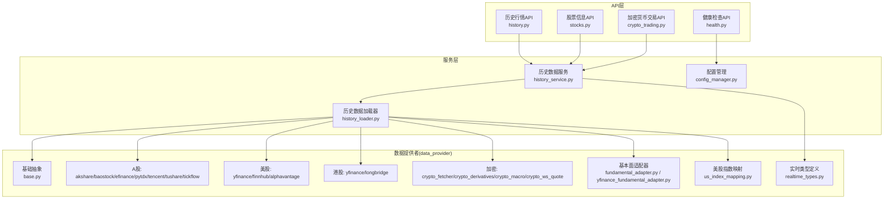
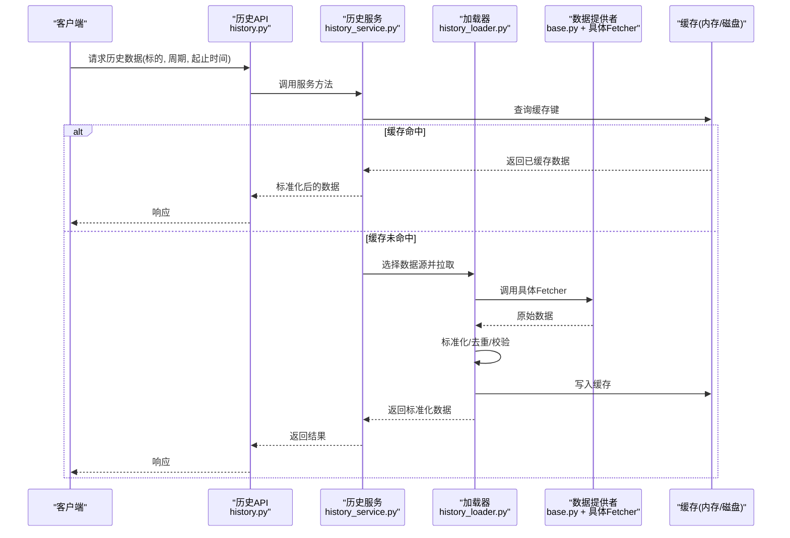
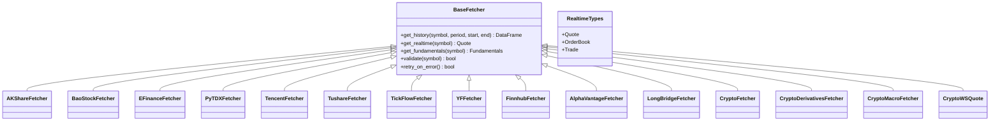
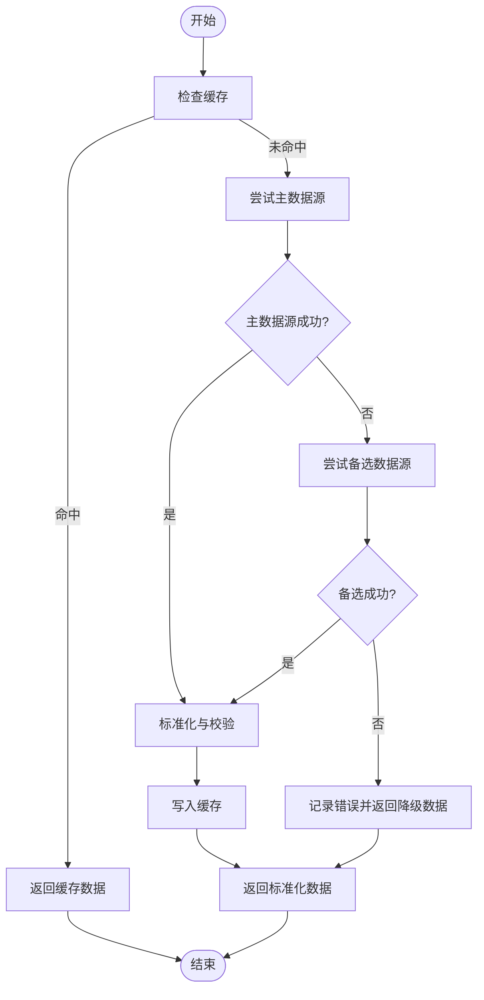
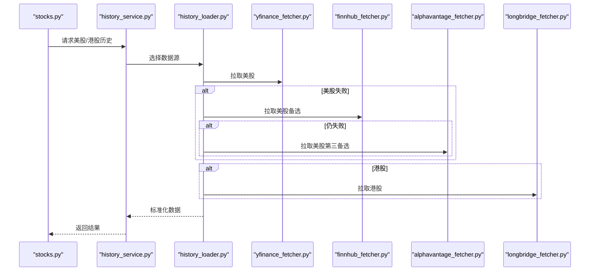
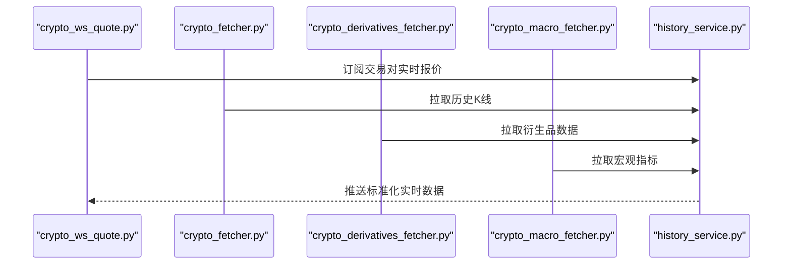
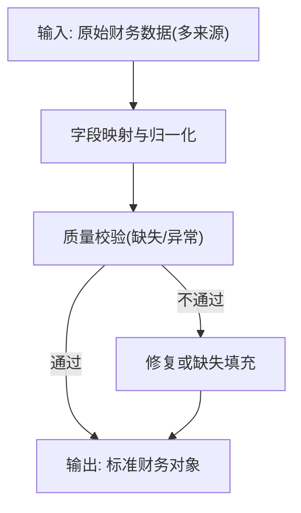
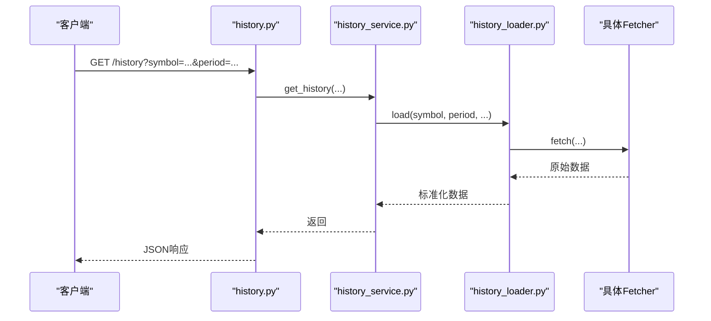
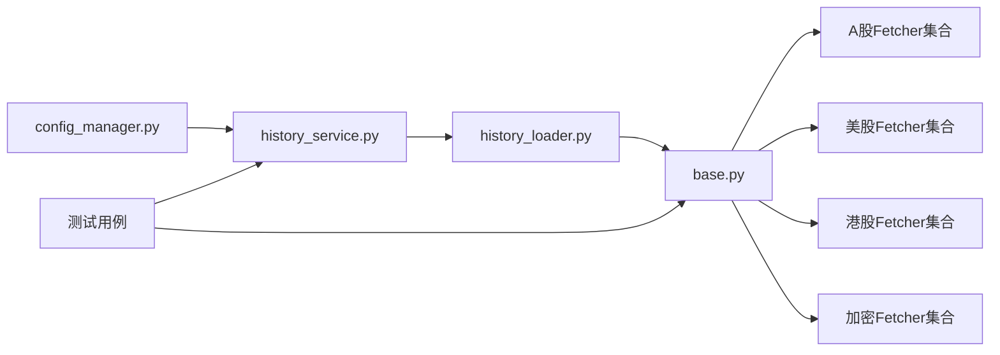

# 数据源集成

<cite>
**本文引用的文件**   
- [data_provider/base.py](file://data_provider/base.py)
- [data_provider/akshare_fetcher.py](file://data_provider/akshare_fetcher.py)
- [data_provider/alphavantage_fetcher.py](file://data_provider/alphavantage_fetcher.py)
- [data_provider/baostock_fetcher.py](file://data_provider/baostock_fetcher.py)
- [data_provider/crypto_derivatives_fetcher.py](file://data_provider/crypto_derivatives_fetcher.py)
- [data_provider/crypto_fetcher.py](file://data_provider/crypto_fetcher.py)
- [data_provider/crypto_macro_fetcher.py](file://data_provider/crypto_macro_fetcher.py)
- [data_provider/crypto_ws_quote.py](file://data_provider/crypto_ws_quote.py)
- [data_provider/efinance_fetcher.py](file://data_provider/efinance_fetcher.py)
- [data_provider/finnhub_fetcher.py](file://data_provider/finnhub_fetcher.py)
- [data_provider/fundamental_adapter.py](file://data_provider/fundamental_adapter.py)
- [data_provider/longbridge_fetcher.py](file://data_provider/longbridge_fetcher.py)
- [data_provider/pytdx_fetcher.py](file://data_provider/pytdx_fetcher.py)
- [data_provider/realtime_types.py](file://data_provider/realtime_types.py)
- [data_provider/tencent_fetcher.py](file://data_provider/tencent_fetcher.py)
- [data_provider/tickflow_fetcher.py](file://data_provider/tickflow_fetcher.py)
- [data_provider/tushare_fetcher.py](file://data_provider/tushare_fetcher.py)
- [data_provider/us_index_mapping.py](file://data_provider/us_index_mapping.py)
- [data_provider/yfinance_fetcher.py](file://data_provider/yfinance_fetcher.py)
- [data_provider/yfinance_fundamental_adapter.py](file://data_provider/yfinance_fundamental_adapter.py)
- [api/v1/endpoints/history.py](file://api/v1/endpoints/history.py)
- [api/v1/endpoints/stocks.py](file://api/v1/endpoints/stocks.py)
- [api/v1/endpoints/crypto_trading.py](file://api/v1/endpoints/crypto_trading.py)
- [api/v1/endpoints/health.py](file://api/v1/endpoints/health.py)
- [src/services/history_service.py](file://src/services/history_service.py)
- [src/services/history_loader.py](file://src/services/history_loader.py)
- [src/core/config_manager.py](file://src/core/config_manager.py)
- [src/utils/data_processing.py](file://src/utils/data_processing.py)
- [tests/test_akshare_history_timeout.py](file://tests/test_akshare_history_timeout.py)
- [tests/test_yfinance_normalize.py](file://tests/test_yfinance_normalize.py)
- [tests/test_tushare_fetcher_http_client.py](file://tests/test_tushare_fetcher_http_client.py)
</cite>

## 目录
1. [简介](#简介)
2. [项目结构](#项目结构)
3. [核心组件](#核心组件)
4. [架构总览](#架构总览)
5. [详细组件分析](#详细组件分析)
6. [依赖关系分析](#依赖关系分析)
7. [性能考量](#性能考量)
8. [故障排查指南](#故障排查指南)
9. [结论](#结论)
10. [附录](#附录)

## 简介
本文件面向数据源集成，系统性说明系统如何接入并统一处理多市场金融数据（A股、美股、港股、加密货币等）。文档覆盖：
- 数据获取策略与路由
- 缓存机制与重试逻辑
- 数据标准化、格式转换与质量校验
- 新数据源接入指南、API配置与性能优化建议
- 数据源健康检查与监控方案

## 项目结构
数据源相关代码集中在 data_provider 目录，按“提供商实现 + 基础抽象 + 类型定义”组织；上层通过 API 层暴露接口，服务层负责调度、缓存与标准化。

图表来源
- [api/v1/endpoints/history.py](file://api/v1/endpoints/history.py)
- [api/v1/endpoints/stocks.py](file://api/v1/endpoints/stocks.py)
- [api/v1/endpoints/crypto_trading.py](file://api/v1/endpoints/crypto_trading.py)
- [api/v1/endpoints/health.py](file://api/v1/endpoints/health.py)
- [src/services/history_service.py](file://src/services/history_service.py)
- [src/services/history_loader.py](file://src/services/history_loader.py)
- [src/core/config_manager.py](file://src/core/config_manager.py)
- [data_provider/base.py](file://data_provider/base.py)
- [data_provider/realtime_types.py](file://data_provider/realtime_types.py)

章节来源
- [data_provider/base.py](file://data_provider/base.py)
- [data_provider/realtime_types.py](file://data_provider/realtime_types.py)
- [api/v1/endpoints/history.py](file://api/v1/endpoints/history.py)
- [src/services/history_service.py](file://src/services/history_service.py)
- [src/services/history_loader.py](file://src/services/history_loader.py)
- [src/core/config_manager.py](file://src/core/config_manager.py)

## 核心组件
- 基础抽象与协议
  - 统一的 Fetcher 基类定义了拉取历史/实时/基本面数据的标准方法、参数约定与返回结构，便于各提供商实现一致接口。
  - 实时数据类型在 realtime_types 中统一定义，确保跨市场数据结构一致性。
- 市场适配层
  - A股：akshare、baostock、efinance、pytdx、tencent、tushare、tickflow 等多源并行或回退。
  - 美股：yfinance、finnhub、alphavantage。
  - 港股：yfinance、longbridge。
  - 加密货币：现货、衍生品、宏观指标、WebSocket 实时报价。
- 基本面适配器
  - fundamental_adapter 与 yfinance_fundamental_adapter 将不同来源的财务指标统一为标准字段。
- 指数映射
  - us_index_mapping 提供美股指数符号到内部标识的映射，保证查询一致性。

章节来源
- [data_provider/base.py](file://data_provider/base.py)
- [data_provider/realtime_types.py](file://data_provider/realtime_types.py)
- [data_provider/fundamental_adapter.py](file://data_provider/fundamental_adapter.py)
- [data_provider/yfinance_fundamental_adapter.py](file://data_provider/yfinance_fundamental_adapter.py)
- [data_provider/us_index_mapping.py](file://data_provider/us_index_mapping.py)

## 架构总览
整体采用“API -> 服务层 -> 数据提供者”的分层架构。服务层负责：
- 根据标的与市场选择合适的数据源
- 执行缓存命中判断与回填
- 调用底层 fetcher 并做标准化与校验
- 错误分类、重试与降级

图表来源
- [api/v1/endpoints/history.py](file://api/v1/endpoints/history.py)
- [src/services/history_service.py](file://src/services/history_service.py)
- [src/services/history_loader.py](file://src/services/history_loader.py)
- [data_provider/base.py](file://data_provider/base.py)

## 详细组件分析

### 基础抽象与类型定义
- base.py 定义统一的 Fetcher 抽象，包括：
  - 获取历史K线、分钟线、实时报价、基本面数据的方法签名
  - 统一的错误码与异常类型
  - 可选的重试与超时控制钩子
- realtime_types.py 定义实时报价、深度、成交等标准结构体，确保跨市场一致。

图表来源
- [data_provider/base.py](file://data_provider/base.py)
- [data_provider/realtime_types.py](file://data_provider/realtime_types.py)

章节来源
- [data_provider/base.py](file://data_provider/base.py)
- [data_provider/realtime_types.py](file://data_provider/realtime_types.py)

### A股市场数据源
- 支持多个A股数据源（akshare、baostock、efinance、pytdx、tencent、tushare、tickflow），可根据可用性自动切换或并行拉取后择优。
- 常见流程：
  - 优先本地缓存
  - 若缺失则尝试主数据源，失败时回退至备选
  - 对返回数据进行标准化（列名、时间戳、复权方式）与质量校验（空值、重复、异常值）

图表来源
- [data_provider/akshare_fetcher.py](file://data_provider/akshare_fetcher.py)
- [data_provider/baostock_fetcher.py](file://data_provider/baostock_fetcher.py)
- [data_provider/efinance_fetcher.py](file://data_provider/efinance_fetcher.py)
- [data_provider/pytdx_fetcher.py](file://data_provider/pytdx_fetcher.py)
- [data_provider/tencent_fetcher.py](file://data_provider/tencent_fetcher.py)
- [data_provider/tushare_fetcher.py](file://data_provider/tushare_fetcher.py)
- [data_provider/tickflow_fetcher.py](file://data_provider/tickflow_fetcher.py)

章节来源
- [data_provider/akshare_fetcher.py](file://data_provider/akshare_fetcher.py)
- [data_provider/baostock_fetcher.py](file://data_provider/baostock_fetcher.py)
- [data_provider/efinance_fetcher.py](file://data_provider/efinance_fetcher.py)
- [data_provider/pytdx_fetcher.py](file://data_provider/pytdx_fetcher.py)
- [data_provider/tencent_fetcher.py](file://data_provider/tencent_fetcher.py)
- [data_provider/tushare_fetcher.py](file://data_provider/tushare_fetcher.py)
- [data_provider/tickflow_fetcher.py](file://data_provider/tickflow_fetcher.py)

### 美股与港股数据源
- 美股：yfinance、finnhub、alphavantage 作为主要与备选源；指数映射 us_index_mapping 用于统一指数符号。
- 港股：yfinance、longbridge；长桥适合实时与盘前盘后数据。
- 标准化要点：
  - 日期与时区对齐
  - 货币单位与汇率换算（如需）
  - 涨跌停与停牌标记

图表来源
- [data_provider/yfinance_fetcher.py](file://data_provider/yfinance_fetcher.py)
- [data_provider/finnhub_fetcher.py](file://data_provider/finnhub_fetcher.py)
- [data_provider/alphavantage_fetcher.py](file://data_provider/alphavantage_fetcher.py)
- [data_provider/longbridge_fetcher.py](file://data_provider/longbridge_fetcher.py)
- [data_provider/us_index_mapping.py](file://data_provider/us_index_mapping.py)

章节来源
- [data_provider/yfinance_fetcher.py](file://data_provider/yfinance_fetcher.py)
- [data_provider/finnhub_fetcher.py](file://data_provider/finnhub_fetcher.py)
- [data_provider/alphavantage_fetcher.py](file://data_provider/alphavantage_fetcher.py)
- [data_provider/longbridge_fetcher.py](file://data_provider/longbridge_fetcher.py)
- [data_provider/us_index_mapping.py](file://data_provider/us_index_mapping.py)

### 加密货币数据源
- 现货与衍生品：crypto_fetcher、crypto_derivatives_fetcher 提供K线、订单簿、资金费率等。
- 宏观指标：crypto_macro_fetcher 提供链上或宏观数据。
- 实时报价：crypto_ws_quote 基于 WebSocket 推送。
- 特点：高并发、低延迟、断线重连与消息去重。

图表来源
- [data_provider/crypto_fetcher.py](file://data_provider/crypto_fetcher.py)
- [data_provider/crypto_derivatives_fetcher.py](file://data_provider/crypto_derivatives_fetcher.py)
- [data_provider/crypto_macro_fetcher.py](file://data_provider/crypto_macro_fetcher.py)
- [data_provider/crypto_ws_quote.py](file://data_provider/crypto_ws_quote.py)

章节来源
- [data_provider/crypto_fetcher.py](file://data_provider/crypto_fetcher.py)
- [data_provider/crypto_derivatives_fetcher.py](file://data_provider/crypto_derivatives_fetcher.py)
- [data_provider/crypto_macro_fetcher.py](file://data_provider/crypto_macro_fetcher.py)
- [data_provider/crypto_ws_quote.py](file://data_provider/crypto_ws_quote.py)

### 基本面数据适配器
- fundamental_adapter 与 yfinance_fundamental_adapter 将不同来源的财务指标（营收、利润、现金流、估值等）统一为内部标准字段，便于分析与报告生成。

图表来源
- [data_provider/fundamental_adapter.py](file://data_provider/fundamental_adapter.py)
- [data_provider/yfinance_fundamental_adapter.py](file://data_provider/yfinance_fundamental_adapter.py)

章节来源
- [data_provider/fundamental_adapter.py](file://data_provider/fundamental_adapter.py)
- [data_provider/yfinance_fundamental_adapter.py](file://data_provider/yfinance_fundamental_adapter.py)

### API与服务层集成
- history.py、stocks.py、crypto_trading.py 暴露REST接口，调用 history_service.py 进行数据调度与标准化。
- health.py 提供健康检查，可结合配置管理检查数据源可用性与配额。

图表来源
- [api/v1/endpoints/history.py](file://api/v1/endpoints/history.py)
- [src/services/history_service.py](file://src/services/history_service.py)
- [src/services/history_loader.py](file://src/services/history_loader.py)

章节来源
- [api/v1/endpoints/history.py](file://api/v1/endpoints/history.py)
- [api/v1/endpoints/stocks.py](file://api/v1/endpoints/stocks.py)
- [api/v1/endpoints/crypto_trading.py](file://api/v1/endpoints/crypto_trading.py)
- [api/v1/endpoints/health.py](file://api/v1/endpoints/health.py)
- [src/services/history_service.py](file://src/services/history_service.py)
- [src/services/history_loader.py](file://src/services/history_loader.py)

## 依赖关系分析
- 服务层依赖配置管理以动态启用/禁用数据源、设置超时与重试策略。
- 数据提供者之间无强耦合，通过基础抽象解耦，便于替换与扩展。
- 测试用例覆盖超时、标准化、HTTP客户端行为等关键路径。

图表来源
- [src/core/config_manager.py](file://src/core/config_manager.py)
- [src/services/history_service.py](file://src/services/history_service.py)
- [src/services/history_loader.py](file://src/services/history_loader.py)
- [data_provider/base.py](file://data_provider/base.py)

章节来源
- [src/core/config_manager.py](file://src/core/config_manager.py)
- [src/services/history_service.py](file://src/services/history_service.py)
- [src/services/history_loader.py](file://src/services/history_loader.py)
- [data_provider/base.py](file://data_provider/base.py)

## 性能考量
- 缓存策略
  - 多级缓存：内存缓存优先，其次磁盘/数据库持久化，减少重复网络请求。
  - 缓存键设计：包含 symbol、period、start/end、复权方式、数据源版本等维度。
- 并发与限流
  - 对高延迟数据源使用异步并发拉取，配合令牌桶限流避免触发供应商限制。
- 重试与退避
  - 指数退避重试，区分网络错误与业务错误（如429、5xx）。
- 数据标准化
  - 统一时间戳、币种、复权方式，降低下游计算开销。
- 监控与健康检查
  - 定期探测数据源可用性、延迟、错误率，阈值告警。

[本节为通用指导，无需特定文件引用]

## 故障排查指南
- 常见问题定位
  - 超时与网络抖动：参考 akshare 历史超时测试用例，确认超时阈值与重试次数是否合理。
  - 标准化不一致：参考 yfinance 标准化测试，核对字段映射与时间序列对齐。
  - HTTP客户端行为：参考 tushare HTTP客户端测试，确认连接池与重试策略。
- 健康检查
  - 通过 health.py 接口检查各数据源状态，结合日志与指标面板观察错误分布。
- 调试建议
  - 开启详细日志，记录请求参数、响应码、耗时与异常堆栈。
  - 使用最小化样本数据验证标准化与校验逻辑。

章节来源
- [tests/test_akshare_history_timeout.py](file://tests/test_akshare_history_timeout.py)
- [tests/test_yfinance_normalize.py](file://tests/test_yfinance_normalize.py)
- [tests/test_tushare_fetcher_http_client.py](file://tests/test_tushare_fetcher_http_client.py)
- [api/v1/endpoints/health.py](file://api/v1/endpoints/health.py)

## 结论
本系统通过统一抽象与分层架构，实现了多市场、多提供商的数据源集成。借助缓存、重试、标准化与质量校验，保障了数据的稳定性与一致性。未来可继续扩展更多数据源，并通过更细粒度的监控与自动化测试提升可靠性。

[本节为总结性内容，无需特定文件引用]

## 附录

### 新数据源接入指南
- 步骤概览
  - 实现基础抽象：继承 base.py 的 Fetcher，实现必要方法。
  - 注册与路由：在 loader 中新增数据源选择逻辑，支持优先级与回退。
  - 标准化与校验：确保返回结构与 realtime_types 一致，补充缺失字段。
  - 配置项：在 config_manager 中添加密钥、超时、重试等配置。
  - 测试：编写单元测试覆盖正常路径、错误路径与边界条件。
- 最佳实践
  - 幂等请求与去重：避免重复拉取导致配额浪费。
  - 错误分类：区分网络错误、认证失败、业务限制，采取不同恢复策略。
  - 资源清理：及时释放连接与内存，防止泄漏。

[本节为通用指导，无需特定文件引用]

### API配置与示例
- 历史数据接口
  - 路径：/api/v1/history
  - 参数：symbol、period、start、end、复权方式
  - 返回：标准化K线数据
- 股票信息接口
  - 路径：/api/v1/stocks
  - 功能：标的基本信息、板块、指数映射
- 加密货币接口
  - 路径：/api/v1/crypto
  - 功能：现货与衍生品数据、WebSocket订阅

[本节为通用指导，无需特定文件引用]

### 数据源健康检查与监控
- 健康检查端点：/api/v1/health
- 监控指标
  - 可用性、延迟、错误率、配额剩余
- 告警策略
  - 连续失败阈值、延迟超阈、配额不足

[本节为通用指导，无需特定文件引用]