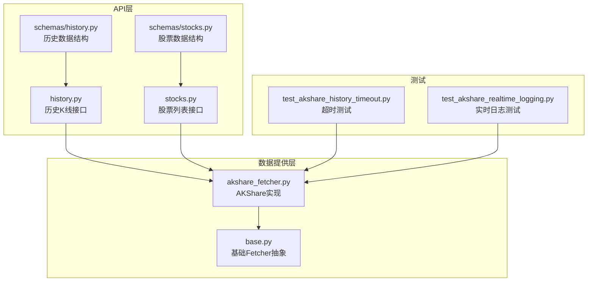
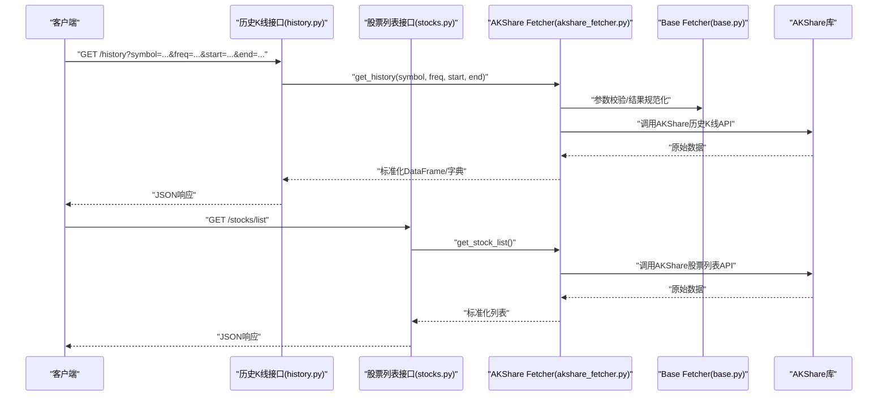
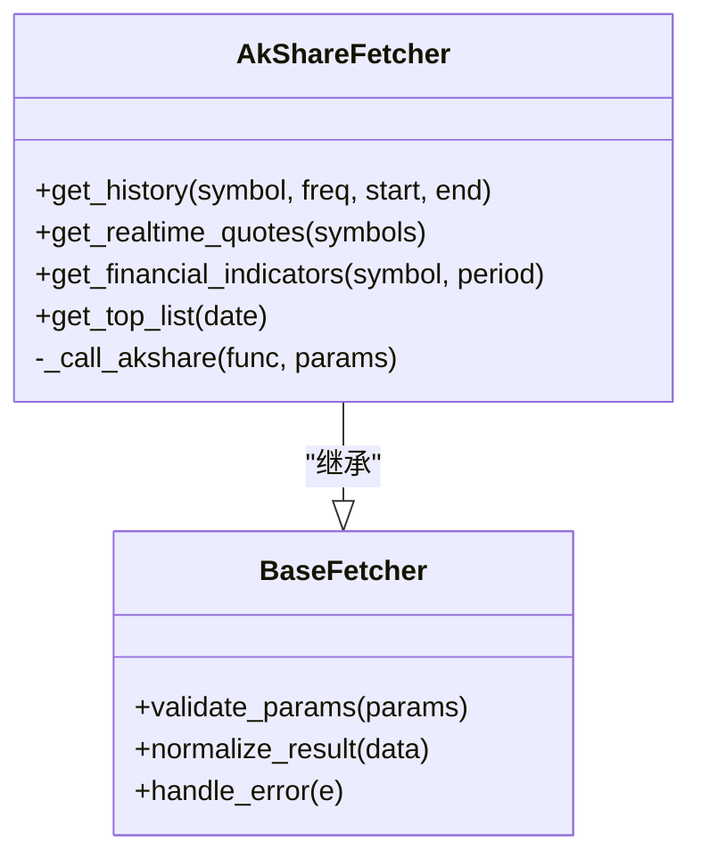
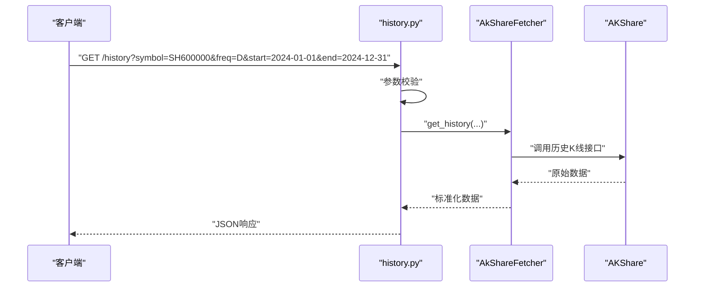
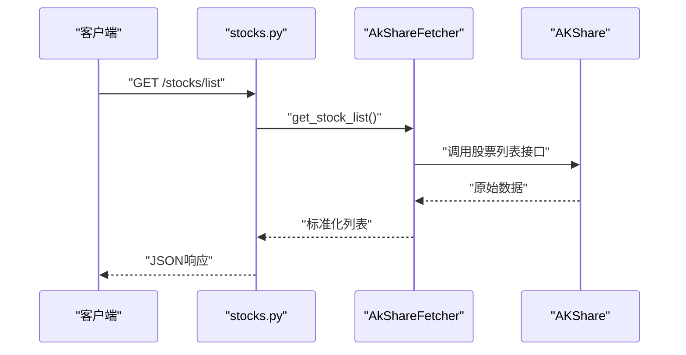
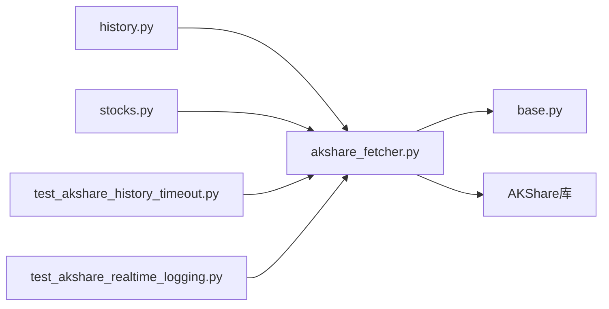

# AKShare数据源

<cite>
**本文引用的文件**   
- [data_provider/akshare_fetcher.py](file://data_provider/akshare_fetcher.py)
- [data_provider/base.py](file://data_provider/base.py)
- [api/v1/endpoints/history.py](file://api/v1/endpoints/history.py)
- [api/v1/endpoints/stocks.py](file://api/v1/endpoints/stocks.py)
- [api/v1/schemas/history.py](file://api/v1/schemas/history.py)
- [api/v1/schemas/stocks.py](file://api/v1/schemas/stocks.py)
- [tests/test_akshare_history_timeout.py](file://tests/test_akshare_history_timeout.py)
- [tests/test_akshare_realtime_logging.py](file://tests/test_akshare_realtime_logging.py)
</cite>

## 目录
1. [简介](#简介)
2. [项目结构](#项目结构)
3. [核心组件](#核心组件)
4. [架构总览](#架构总览)
5. [详细组件分析](#详细组件分析)
6. [依赖关系分析](#依赖关系分析)
7. [性能考虑](#性能考虑)
8. [故障排查指南](#故障排查指南)
9. [结论](#结论)
10. [附录](#附录)

## 简介
本文件面向AKShare数据源的配置、API调用限制与数据获取范围，系统梳理历史K线、实时行情、财务指标、龙虎榜等数据的获取实现。文档同时覆盖错误处理机制、重试策略与性能优化建议，并提供A股数据（股票列表、行情数据、基本面信息）的具体使用示例路径，帮助读者快速上手并稳定集成。

## 项目结构
AKShare数据源位于数据提供层，通过统一的Fetch接口对外暴露能力，上层API路由负责将HTTP请求转换为数据获取任务，并由测试用例保障超时与日志行为。

图表来源
- [api/v1/endpoints/history.py](file://api/v1/endpoints/history.py)
- [api/v1/endpoints/stocks.py](file://api/v1/endpoints/stocks.py)
- [api/v1/schemas/history.py](file://api/v1/schemas/history.py)
- [api/v1/schemas/stocks.py](file://api/v1/schemas/stocks.py)
- [data_provider/base.py](file://data_provider/base.py)
- [data_provider/akshare_fetcher.py](file://data_provider/akshare_fetcher.py)
- [tests/test_akshare_history_timeout.py](file://tests/test_akshare_history_timeout.py)
- [tests/test_akshare_realtime_logging.py](file://tests/test_akshare_realtime_logging.py)

章节来源
- [data_provider/akshare_fetcher.py](file://data_provider/akshare_fetcher.py)
- [data_provider/base.py](file://data_provider/base.py)
- [api/v1/endpoints/history.py](file://api/v1/endpoints/history.py)
- [api/v1/endpoints/stocks.py](file://api/v1/endpoints/stocks.py)
- [api/v1/schemas/history.py](file://api/v1/schemas/history.py)
- [api/v1/schemas/stocks.py](file://api/v1/schemas/stocks.py)
- [tests/test_akshare_history_timeout.py](file://tests/test_akshare_history_timeout.py)
- [tests/test_akshare_realtime_logging.py](file://tests/test_akshare_realtime_logging.py)

## 核心组件
- AKShare Fetcher：封装对AKShare库的调用，统一返回标准化数据结构，支持历史K线、实时行情、财务指标、龙虎榜等数据域。
- Base Fetcher：定义数据获取的统一抽象与通用能力（如参数校验、结果规范化、错误映射）。
- API端点：历史K线与股票列表接口，负责接收请求、参数校验、调用Fetcher并返回响应。
- 测试用例：针对AKShare历史数据超时与实时数据日志进行验证，确保稳定性与可观测性。

章节来源
- [data_provider/akshare_fetcher.py](file://data_provider/akshare_fetcher.py)
- [data_provider/base.py](file://data_provider/base.py)
- [api/v1/endpoints/history.py](file://api/v1/endpoints/history.py)
- [api/v1/endpoints/stocks.py](file://api/v1/endpoints/stocks.py)
- [tests/test_akshare_history_timeout.py](file://tests/test_akshare_history_timeout.py)
- [tests/test_akshare_realtime_logging.py](file://tests/test_akshare_realtime_logging.py)

## 架构总览
AKShare数据源采用“API层 → Fetcher层”的分层设计。API端点仅做入参校验与响应组装，具体数据获取逻辑下沉至Fetcher实现，便于扩展其他数据源并保持接口一致性。

图表来源
- [api/v1/endpoints/history.py](file://api/v1/endpoints/history.py)
- [api/v1/endpoints/stocks.py](file://api/v1/endpoints/stocks.py)
- [data_provider/akshare_fetcher.py](file://data_provider/akshare_fetcher.py)
- [data_provider/base.py](file://data_provider/base.py)

## 详细组件分析

### AKShare Fetcher 组件
- 职责
  - 封装AKShare的历史K线、实时行情、财务指标、龙虎榜等数据获取方法。
  - 统一异常映射与日志记录，保证上层调用体验一致。
  - 对返回数据进行字段清洗与类型转换，输出标准结构。
- 关键方法
  - 历史K线：按周期（日/周/月）、时间范围拉取，支持复权与列名标准化。
  - 实时行情：按市场与代码获取最新价、涨跌幅、成交量等。
  - 财务指标：利润表、资产负债表、现金流量表等关键比率。
  - 龙虎榜：上榜个股、机构席位、资金流向等。
- 错误处理
  - 网络异常、超时、限流等错误统一捕获并抛出业务异常，便于上层重试或降级。
  - 空数据或字段缺失时返回默认值或标记为不可用，避免下游崩溃。
- 性能要点
  - 批量请求合并、分页拉取、缓存热点数据（由上层控制）。
  - 合理设置超时与并发度，避免阻塞上游服务。

章节来源
- [data_provider/akshare_fetcher.py](file://data_provider/akshare_fetcher.py)
- [data_provider/base.py](file://data_provider/base.py)

#### 类图（概念映射到实际文件）

图表来源
- [data_provider/base.py](file://data_provider/base.py)
- [data_provider/akshare_fetcher.py](file://data_provider/akshare_fetcher.py)

### 历史K线接口
- 功能
  - 接收symbol、频率、起止日期等参数，调用AKShare Fetcher获取历史K线。
  - 返回标准化时间序列数据，包含开高低收、成交量、成交额等字段。
- 参数校验
  - 校验股票代码格式、频率取值、时间范围合法性。
- 响应结构
  - 基于schemas/history.py定义的数据模型，确保前后端契约一致。

章节来源
- [api/v1/endpoints/history.py](file://api/v1/endpoints/history.py)
- [api/v1/schemas/history.py](file://api/v1/schemas/history.py)

#### 时序图（历史K线）

图表来源
- [api/v1/endpoints/history.py](file://api/v1/endpoints/history.py)
- [data_provider/akshare_fetcher.py](file://data_provider/akshare_fetcher.py)

### 股票列表接口
- 功能
  - 获取A股股票列表，包括代码、名称、市场、板块等信息。
  - 支持过滤与分页（由上层控制）。
- 响应结构
  - 基于schemas/stocks.py定义的数据模型。

章节来源
- [api/v1/endpoints/stocks.py](file://api/v1/endpoints/stocks.py)
- [api/v1/schemas/stocks.py](file://api/v1/schemas/stocks.py)

#### 时序图（股票列表）

图表来源
- [api/v1/endpoints/stocks.py](file://api/v1/endpoints/stocks.py)
- [data_provider/akshare_fetcher.py](file://data_provider/akshare_fetcher.py)

### 实时行情与日志
- 功能
  - 获取实时报价、涨跌停、换手率等动态指标。
  - 记录关键日志，便于问题定位与监控告警。
- 测试保障
  - 通过测试用例验证实时数据的日志输出与行为稳定性。

章节来源
- [data_provider/akshare_fetcher.py](file://data_provider/akshare_fetcher.py)
- [tests/test_akshare_realtime_logging.py](file://tests/test_akshare_realtime_logging.py)

### 财务指标与龙虎榜
- 财务指标
  - 拉取利润表、资产负债表、现金流量表及关键比率（ROE、PE、PB等）。
  - 支持多期对比与同比环比计算（由上层聚合）。
- 龙虎榜
  - 获取每日上榜个股、买卖金额、机构席位统计。
  - 结合资金流向进行短期情绪分析。

章节来源
- [data_provider/akshare_fetcher.py](file://data_provider/akshare_fetcher.py)

## 依赖关系分析
- API层依赖Fetcher层，Fetcher层依赖AKShare库。
- 测试用例直接依赖Fetcher层，用于验证超时与日志行为。
- Schema定义约束API响应结构，确保契约一致性。

图表来源
- [api/v1/endpoints/history.py](file://api/v1/endpoints/history.py)
- [api/v1/endpoints/stocks.py](file://api/v1/endpoints/stocks.py)
- [data_provider/akshare_fetcher.py](file://data_provider/akshare_fetcher.py)
- [data_provider/base.py](file://data_provider/base.py)
- [tests/test_akshare_history_timeout.py](file://tests/test_akshare_history_timeout.py)
- [tests/test_akshare_realtime_logging.py](file://tests/test_akshare_realtime_logging.py)

章节来源
- [api/v1/endpoints/history.py](file://api/v1/endpoints/history.py)
- [api/v1/endpoints/stocks.py](file://api/v1/endpoints/stocks.py)
- [data_provider/akshare_fetcher.py](file://data_provider/akshare_fetcher.py)
- [data_provider/base.py](file://data_provider/base.py)
- [tests/test_akshare_history_timeout.py](file://tests/test_akshare_history_timeout.py)
- [tests/test_akshare_realtime_logging.py](file://tests/test_akshare_realtime_logging.py)

## 性能考虑
- 超时与重试
  - 为AKShare调用设置合理的超时阈值，避免长时间阻塞。
  - 对瞬时失败（网络抖动、限流）实施指数退避重试，限制最大重试次数。
- 并发与批处理
  - 批量拉取历史数据时分片并行，控制并发度以避免触发服务端限流。
  - 对热门标的（如大盘指数、权重股）进行本地缓存，减少重复请求。
- 数据裁剪
  - 按需选择字段与时间窗口，减少传输与序列化开销。
  - 对大表查询增加索引与分页，避免一次性加载过多数据。
- 资源隔离
  - 不同数据域的请求使用独立连接池与线程池，防止相互影响。

[本节为通用指导，不直接分析具体文件]

## 故障排查指南
- 常见错误
  - 网络超时：检查网络连通性与AKShare服务可用性，适当增大超时或启用重试。
  - 参数非法：校验股票代码格式、频率取值、时间范围是否合法。
  - 数据为空：确认交易日历与停牌状态，必要时回退到最近交易日数据。
  - 限流与封禁：降低请求频率，增加退避间隔，必要时切换备用数据源。
- 日志与调试
  - 开启详细日志，记录请求参数、响应状态码、异常堆栈。
  - 使用测试用例复现问题，定位是网络、AKShare还是数据格式问题。
- 恢复策略
  - 失败后自动重试，超过阈值则降级为缓存数据或返回部分可用字段。
  - 对关键路径增加熔断与告警，避免雪崩效应。

章节来源
- [tests/test_akshare_history_timeout.py](file://tests/test_akshare_history_timeout.py)
- [tests/test_akshare_realtime_logging.py](file://tests/test_akshare_realtime_logging.py)

## 结论
AKShare数据源在本项目中通过统一的Fetcher抽象与清晰的API分层，实现了历史K线、实时行情、财务指标、龙虎榜等数据的稳定获取。配合完善的错误处理、重试策略与性能优化建议，可在复杂环境下保持高可用与高性能。建议在生产环境启用缓存、限流与监控，确保数据链路的健壮性。

[本节为总结，不直接分析具体文件]

## 附录

### 配置方法
- 安装依赖
  - 确保已安装AKShare库及其依赖。
- 环境变量（可选）
  - 设置代理、超时、重试次数等参数，便于在不同环境灵活调整。
- 初始化
  - 在应用启动时实例化AkShareFetcher，注入到API层使用。

[本节为通用指导，不直接分析具体文件]

### API调用限制与数据范围
- 调用限制
  - AKShare可能受限于第三方接口频率与配额，需合理控制并发与请求间隔。
- 数据范围
  - 历史K线：支持A股多周期（日/周/月），复权方式可选。
  - 实时行情：交易时段内更新，非交易时段返回收盘快照。
  - 财务指标：按季度/年度披露，注意数据滞后性。
  - 龙虎榜：每日盘后公布，关注机构席位与游资动向。

[本节为通用指导，不直接分析具体文件]

### 错误处理机制与重试策略
- 错误分类
  - 网络错误、超时、限流、数据异常、解析失败。
- 重试策略
  - 指数退避+抖动，限制最大重试次数与总时长。
  - 对幂等请求允许重试，非幂等请求需谨慎。
- 降级与兜底
  - 优先返回缓存数据，其次返回部分字段，最后返回明确错误码。

[本节为通用指导，不直接分析具体文件]

### 性能优化建议
- 缓存热点数据（指数、权重股、常用财务指标）。
- 分片并行拉取历史数据，控制并发度。
- 按需裁剪字段，减少序列化与传输成本。
- 使用连接池与异步IO提升吞吐。

[本节为通用指导，不直接分析具体文件]

### A股数据获取示例（路径指引）
- 获取股票列表
  - 接口：/stocks/list
  - 参考文件：[api/v1/endpoints/stocks.py](file://api/v1/endpoints/stocks.py)、[api/v1/schemas/stocks.py](file://api/v1/schemas/stocks.py)
- 获取历史K线
  - 接口：/history?symbol=SH600000&freq=D&start=YYYY-MM-DD&end=YYYY-MM-DD
  - 参考文件：[api/v1/endpoints/history.py](file://api/v1/endpoints/history.py)、[api/v1/schemas/history.py](file://api/v1/schemas/history.py)
- 获取实时行情
  - 通过Fetcher的实时行情方法调用，结合日志与测试用例定位问题
  - 参考文件：[data_provider/akshare_fetcher.py](file://data_provider/akshare_fetcher.py)、[tests/test_akshare_realtime_logging.py](file://tests/test_akshare_realtime_logging.py)
- 获取财务指标
  - 通过Fetcher的财务指标方法拉取利润表、资产负债表、现金流量表
  - 参考文件：[data_provider/akshare_fetcher.py](file://data_provider/akshare_fetcher.py)
- 获取龙虎榜
  - 通过Fetcher的龙虎榜方法获取每日上榜数据
  - 参考文件：[data_provider/akshare_fetcher.py](file://data_provider/akshare_fetcher.py)

章节来源
- [api/v1/endpoints/stocks.py](file://api/v1/endpoints/stocks.py)
- [api/v1/schemas/stocks.py](file://api/v1/schemas/stocks.py)
- [api/v1/endpoints/history.py](file://api/v1/endpoints/history.py)
- [api/v1/schemas/history.py](file://api/v1/schemas/history.py)
- [data_provider/akshare_fetcher.py](file://data_provider/akshare_fetcher.py)
- [tests/test_akshare_realtime_logging.py](file://tests/test_akshare_realtime_logging.py)