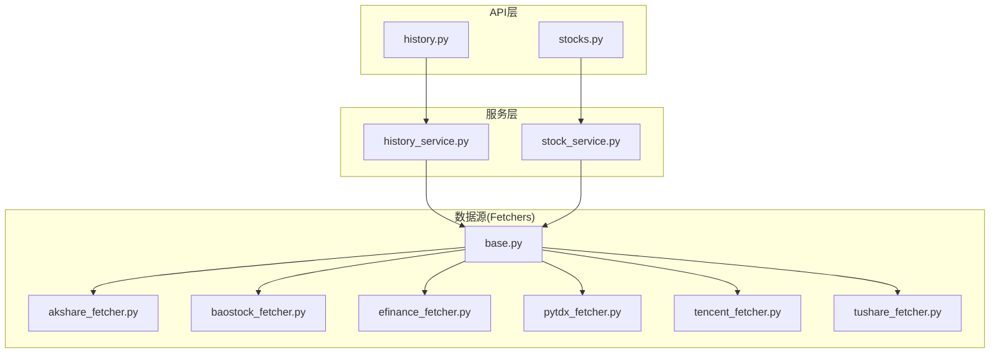
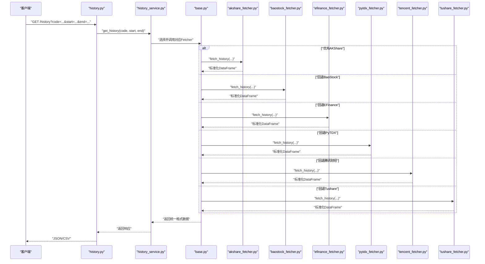
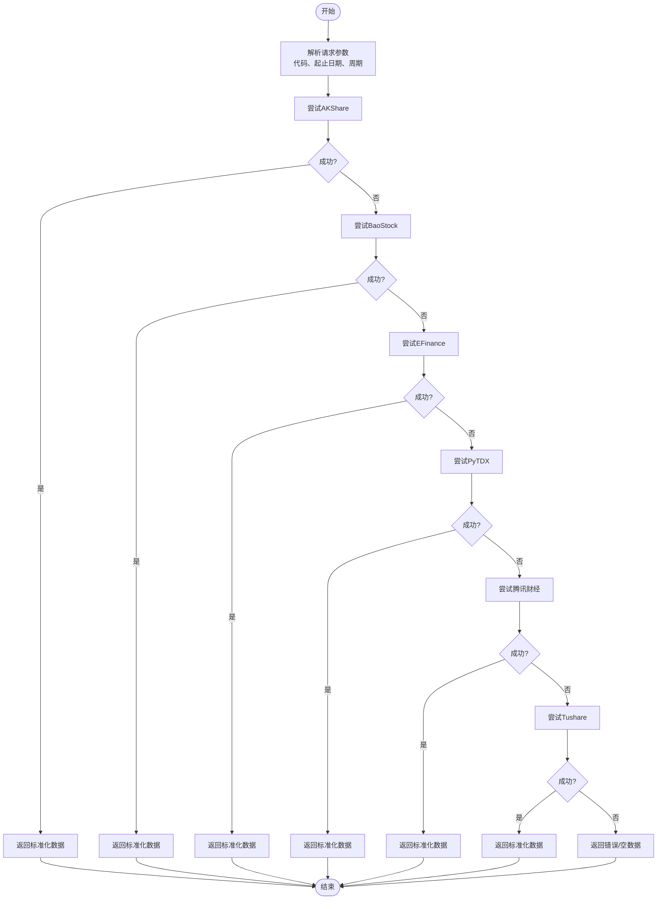
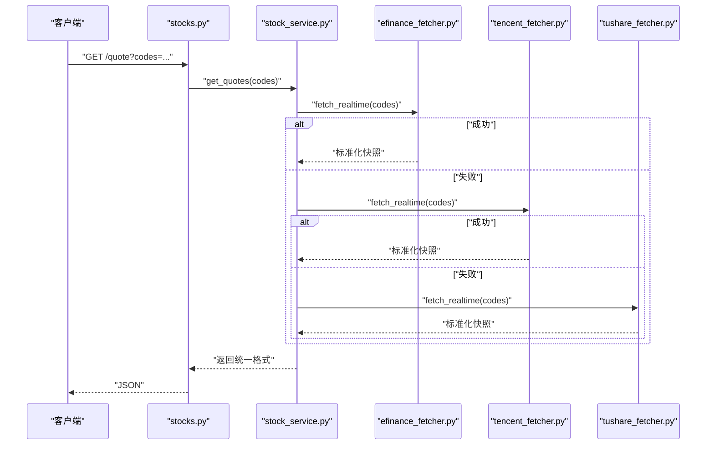
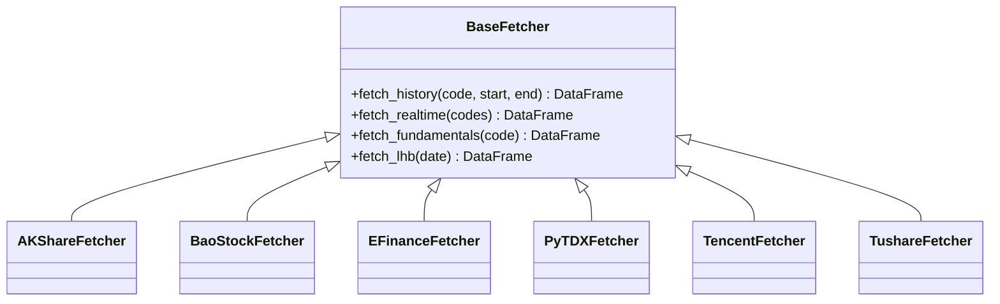

# A股数据提供商

<cite>
**本文引用的文件**   
- [data_provider/base.py](file://data_provider/base.py)
- [data_provider/akshare_fetcher.py](file://data_provider/akshare_fetcher.py)
- [data_provider/baostock_fetcher.py](file://data_provider/baostock_fetcher.py)
- [data_provider/efinance_fetcher.py](file://data_provider/efinance_fetcher.py)
- [data_provider/pytdx_fetcher.py](file://data_provider/pytdx_fetcher.py)
- [data_provider/tencent_fetcher.py](file://data_provider/tencent_fetcher.py)
- [data_provider/tushare_fetcher.py](file://data_provider/tushare_fetcher.py)
- [api/v1/endpoints/history.py](file://api/v1/endpoints/history.py)
- [api/v1/endpoints/stocks.py](file://api/v1/endpoints/stocks.py)
- [src/services/history_service.py](file://src/services/history_service.py)
- [src/services/stock_service.py](file://src/services/stock_service.py)
- [tests/test_a_share_fetcher_code_conversion.py](file://tests/test_a_share_fetcher_code转换.py)
- [tests/test_akshare_history_timeout.py](file://tests/test_akshare_history_timeout.py)
- [tests/test_tencent_fetcher.py](file://tests/test_tencent_fetcher.py)
</cite>

## 目录
1. [简介](#简介)
2. [项目结构](#项目结构)
3. [核心组件](#核心组件)
4. [架构总览](#架构总览)
5. [详细组件分析](#详细组件分析)
6. [依赖关系分析](#依赖关系分析)
7. [性能考量](#性能考量)
8. [故障排除指南](#故障排除指南)
9. [结论](#结论)
10. [附录](#附录)

## 简介
本文件面向A股数据提供商的集成与使用，覆盖AKShare、BaoStock、EFinance、PyTDX、腾讯财经、Tushare等主流数据源。文档重点包括：
- 各数据源的配置方法、API限制与适用场景
- 历史K线、实时行情、财务指标、龙虎榜数据的获取实现路径
- 性能对比、稳定性分析与故障排除
- 数据质量验证与异常恢复最佳实践

## 项目结构
本项目将多数据源统一抽象为“Fetcher”接口，并通过服务层与API层暴露能力。关键目录与职责：
- data_provider：各数据源的具体实现（Fetchers）
- api/v1/endpoints：对外HTTP接口（历史、股票列表等）
- src/services：业务编排与服务层（历史加载、股票服务等）
- tests：针对数据源与接口的测试用例

图表来源
- [api/v1/endpoints/history.py](file://api/v1/endpoints/history.py)
- [api/v1/endpoints/stocks.py](file://api/v1/endpoints/stocks.py)
- [src/services/history_service.py](file://src/services/history_service.py)
- [src/services/stock_service.py](file://src/services/stock_service.py)
- [data_provider/base.py](file://data_provider/base.py)
- [data_provider/akshare_fetcher.py](file://data_provider/akshare_fetcher.py)
- [data_provider/baostock_fetcher.py](file://data_provider/baostock_fetcher.py)
- [data_provider/efinance_fetcher.py](file://data_provider/efinance_fetcher.py)
- [data_provider/pytdx_fetcher.py](file://data_provider/pytdx_fetcher.py)
- [data_provider/tencent_fetcher.py](file://data_provider/tencent_fetcher.py)
- [data_provider/tushare_fetcher.py](file://data_provider/tushare_fetcher.py)

章节来源
- [data_provider/base.py](file://data_provider/base.py)
- [api/v1/endpoints/history.py](file://api/v1/endpoints/history.py)
- [api/v1/endpoints/stocks.py](file://api/v1/endpoints/stocks.py)
- [src/services/history_service.py](file://src/services/history_service.py)
- [src/services/stock_service.py](file://src/services/stock_service.py)

## 核心组件
- Fetcher基类与统一接口：定义历史K线、实时行情、财务指标、龙虎榜等方法的契约，屏蔽底层差异。
- 具体Fetcher实现：每个数据源一个实现类，负责鉴权、请求封装、结果标准化与错误处理。
- 服务层：组合多个Fetcher，提供重试、降级、缓存与聚合能力。
- API端点：将服务层能力暴露为REST接口，供前端或外部系统调用。

章节来源
- [data_provider/base.py](file://data_provider/base.py)
- [src/services/history_service.py](file://src/services/history_service.py)
- [src/services/stock_service.py](file://src/services/stock_service.py)

## 架构总览
下图展示从API到数据源的调用链路与数据流向。

图表来源
- [api/v1/endpoints/history.py](file://api/v1/endpoints/history.py)
- [src/services/history_service.py](file://src/services/history_service.py)
- [data_provider/base.py](file://data_provider/base.py)
- [data_provider/akshare_fetcher.py](file://data_provider/akshare_fetcher.py)
- [data_provider/baostock_fetcher.py](file://data_provider/baostock_fetcher.py)
- [data_provider/efinance_fetcher.py](file://data_provider/efinance_fetcher.py)
- [data_provider/pytdx_fetcher.py](file://data_provider/pytdx_fetcher.py)
- [data_provider/tencent_fetcher.py](file://data_provider/tencent_fetcher.py)
- [data_provider/tushare_fetcher.py](file://data_provider/tushare_fetcher.py)

## 详细组件分析

### 统一Fetcher接口与基类
- 目标：为所有数据源提供一致的方法签名与返回结构，便于服务层切换与降级。
- 关键能力：
  - 历史K线：按代码、起止日期拉取并标准化字段（如时间、开高低收、成交量）。
  - 实时行情：最新价、涨跌幅、成交额、换手率等。
  - 财务指标：营收、净利润、ROE等基础指标。
  - 龙虎榜：上榜日、买卖金额、机构席位等。
- 错误处理：网络异常、限流、空数据、字段缺失的统一捕获与上报。

章节来源
- [data_provider/base.py](file://data_provider/base.py)

### AKShare数据源
- 适用场景：历史K线、指数、板块、资金流向、龙虎榜等；免费且覆盖面广。
- 配置要点：无需密钥；注意并发与频率控制，避免触发反爬。
- 限制与建议：
  - 高频请求易被限流，建议加重试与退避。
  - 部分接口对日期范围有上限，需分片拉取。
- 典型用法：历史K线、财务指标、龙虎榜均可通过其模块获取。

章节来源
- [data_provider/akshare_fetcher.py](file://data_provider/akshare_fetcher.py)
- [tests/test_akshare_history_timeout.py](file://tests/test_akshare_history_timeout.py)

### BaoStock数据源
- 适用场景：历史K线、基本面数据、行业分类；稳定可靠。
- 配置要点：无需密钥；本地缓存友好。
- 限制与建议：
  - 更新频率相对保守，适合离线回测与批量下载。
  - 某些接口需要指定市场前缀（SH/SZ）。
- 典型用法：历史K线、财务报表、股票列表。

章节来源
- [data_provider/baostock_fetcher.py](file://data_provider/baostock_fetcher.py)

### EFinance数据源
- 适用场景：实时行情、历史K线、指数行情；轻量易用。
- 配置要点：无需密钥；注意网络环境。
- 限制与建议：
  - 实时性较好但稳定性受上游影响，建议配合重试。
  - 字段命名可能与其它源不一致，需标准化。
- 典型用法：实时行情、指数、ETF日线。

章节来源
- [data_provider/efinance_fetcher.py](file://data_provider/efinance_fetcher.py)

### PyTDX数据源
- 适用场景：Tick级与分钟级数据、盘口深度；低延迟。
- 配置要点：需安装通达信客户端或使用兼容服务端；端口与认证配置。
- 限制与建议：
  - 依赖本地环境，部署复杂度较高。
  - 高并发连接数受限，需连接池管理。
- 典型用法：高频数据、分时成交、逐笔委托。

章节来源
- [data_provider/pytdx_fetcher.py](file://data_provider/pytdx_fetcher.py)

### 腾讯财经数据源
- 适用场景：实时行情快照、简单历史数据；访问便捷。
- 配置要点：无需密钥；注意UA与请求头。
- 限制与建议：
  - 非官方API，可能随时变更；需健壮解析与容错。
  - 并发过高会被封禁，建议限速。
- 典型用法：实时报价、涨跌停价、简单技术指标。

章节来源
- [data_provider/tencent_fetcher.py](file://data_provider/tencent_fetcher.py)
- [tests/test_tencent_fetcher.py](file://tests/test_tencent_fetcher.py)

### Tushare数据源
- 适用场景：高质量历史数据、财务指标、宏观数据；数据规范。
- 配置要点：需注册并获取Token；不同接口有积分权限限制。
- 限制与建议：
  - 免费额度有限，生产环境建议付费或合理配额。
  - 接口调用需遵循频率限制，避免被封。
- 典型用法：历史K线、财报、股东、分红派息、龙虎榜。

章节来源
- [data_provider/tushare_fetcher.py](file://data_provider/tushare_fetcher.py)

### 历史K线数据获取流程
- 入口：API层接收参数后交由服务层调度。
- 策略：优先尝试AKShare，失败则依次回退至BaoStock、EFinance、PyTDX、腾讯财经、Tushare。
- 标准化：统一输出字段与类型，便于下游分析。

图表来源
- [api/v1/endpoints/history.py](file://api/v1/endpoints/history.py)
- [src/services/history_service.py](file://src/services/history_service.py)
- [data_provider/base.py](file://data_provider/base.py)

章节来源
- [api/v1/endpoints/history.py](file://api/v1/endpoints/history.py)
- [src/services/history_service.py](file://src/services/history_service.py)
- [data_provider/base.py](file://data_provider/base.py)

### 实时行情数据获取流程
- 入口：stocks相关接口或专用实时接口。
- 策略：优先使用EFinance或腾讯财经获取快照；必要时结合Tushare补充指标。
- 标准化：统一字段名（如最新价、涨跌幅、成交额、换手率），处理缺失值。

图表来源
- [api/v1/endpoints/stocks.py](file://api/v1/endpoints/stocks.py)
- [src/services/stock_service.py](file://src/services/stock_service.py)
- [data_provider/efinance_fetcher.py](file://data_provider/efinance_fetcher.py)
- [data_provider/tencent_fetcher.py](file://data_provider/tencent_fetcher.py)
- [data_provider/tushare_fetcher.py](file://data_provider/tushare_fetcher.py)

章节来源
- [api/v1/endpoints/stocks.py](file://api/v1/endpoints/stocks.py)
- [src/services/stock_service.py](file://src/services/stock_service.py)

### 财务指标与龙虎榜
- 财务指标：优先Tushare（质量高、字段全），其次BaoStock（稳定）。
- 龙虎榜：AKShare与Tushare均支持，AKShare更灵活，Tushare更规范。
- 数据对齐：统一股票代码格式（如SH600000/SZ000001），处理ST与退市标记。

章节来源
- [data_provider/tushare_fetcher.py](file://data_provider/tushare_fetcher.py)
- [data_provider/akshare_fetcher.py](file://data_provider/akshare_fetcher.py)
- [data_provider/baostock_fetcher.py](file://data_provider/baostock_fetcher.py)

### 代码转换与兼容性
- 常见需求：将“600000.SH”转换为“sh600000”或反之，适配不同数据源。
- 测试覆盖：确保转换逻辑正确，避免跨源调用时因代码格式不匹配导致失败。

章节来源
- [tests/test_a_share_fetcher_code_conversion.py](file://tests/test_a_share_fetcher_code转换.py)

## 依赖关系分析
- 耦合度：服务层与Fetcher之间通过基类解耦，新增数据源只需实现基类接口。
- 外部依赖：各Fetcher依赖第三方库（如akshare、tushare、efinance、pytdx、requests等）。
- 潜在风险：第三方接口变更、限流、证书问题、编码问题。

图表来源
- [data_provider/base.py](file://data_provider/base.py)
- [data_provider/akshare_fetcher.py](file://data_provider/akshare_fetcher.py)
- [data_provider/baostock_fetcher.py](file://data_provider/baostock_fetcher.py)
- [data_provider/efinance_fetcher.py](file://data_provider/efinance_fetcher.py)
- [data_provider/pytdx_fetcher.py](file://data_provider/pytdx_fetcher.py)
- [data_provider/tencent_fetcher.py](file://data_provider/tencent_fetcher.py)
- [data_provider/tushare_fetcher.py](file://data_provider/tushare_fetcher.py)

章节来源
- [data_provider/base.py](file://data_provider/base.py)

## 性能考量
- 并发与限流：
  - AKShare/Tushare需控制并发，避免触发限流；建议使用令牌桶或滑动窗口。
  - PyTDX连接数有限，需连接池与复用。
- 缓存策略：
  - 历史K线可按“代码+周期+日期范围”做本地缓存，减少重复请求。
  - 实时行情可短TTL缓存，降低上游压力。
- 数据分片：
  - 大区间历史数据分片拉取，避免单次请求过大。
- 资源占用：
  - 批量拉取时注意内存峰值，采用生成器或流式处理。

[本节为通用指导，不直接分析具体文件]

## 故障排除指南
- 常见问题与定位：
  - 网络超时：检查代理、DNS、防火墙；增加超时与重试。
  - 限流/封禁：降低频率、增加退避、切换备用源。
  - 数据为空：校验日期范围、交易日历、代码格式。
  - 字段缺失：标准化映射、填充默认值、记录告警。
- 日志与监控：
  - 记录每次调用的源、耗时、状态码、错误堆栈。
  - 设置健康检查与阈值告警（如成功率低于95%）。
- 恢复策略：
  - 自动重试（指数退避）、降级（切换到备用源）、熔断（临时禁用不稳定源）。
  - 断点续传与增量更新，避免全量重拉。

章节来源
- [tests/test_akshare_history_timeout.py](file://tests/test_akshare_history_timeout.py)
- [tests/test_tencent_fetcher.py](file://tests/test_tencent_fetcher.py)

## 结论
本项目通过统一的Fetcher接口与服务层编排，实现了多A股数据源的无缝切换与降级。生产环境中应重点关注限流、缓存、分片与监控告警，确保数据获取的稳定性与时效性。建议在关键路径上实施数据质量校验与异常恢复机制，提升整体鲁棒性。

[本节为总结性内容，不直接分析具体文件]

## 附录
- 配置清单建议：
  - AKShare：无密钥；并发与重试策略。
  - BaoStock：无密钥；本地缓存策略。
  - EFinance：无密钥；实时快照缓存。
  - PyTDX：端口、认证、连接池大小。
  - 腾讯财经：UA、请求头、限速。
  - Tushare：Token、积分与频率限制。
- 数据质量验证：
  - 字段完整性、数值合理性（如价格非负、成交量非负）。
  - 时间连续性（交易日缺失检测）。
  - 跨源一致性（同一标的在不同源的数据偏差阈值）。

[本节为补充信息，不直接分析具体文件]