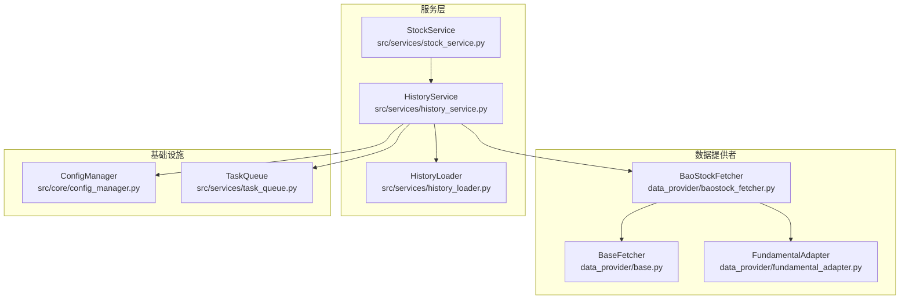
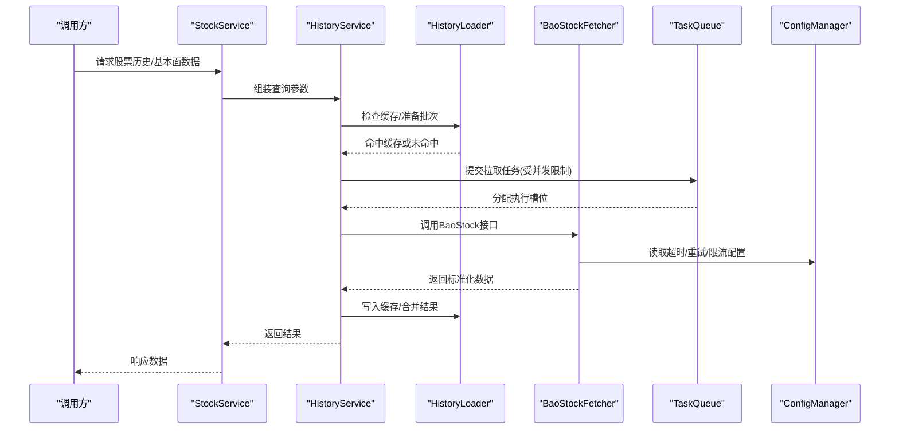
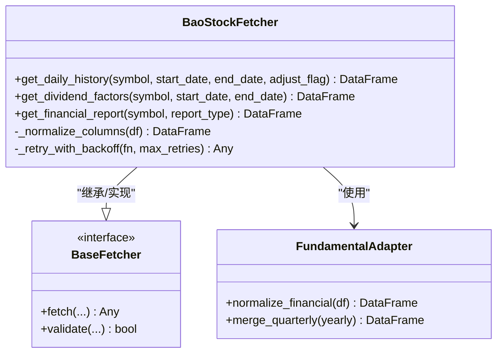
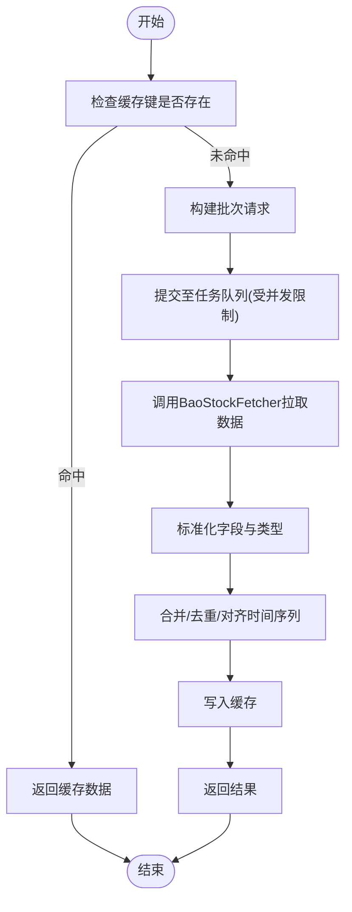
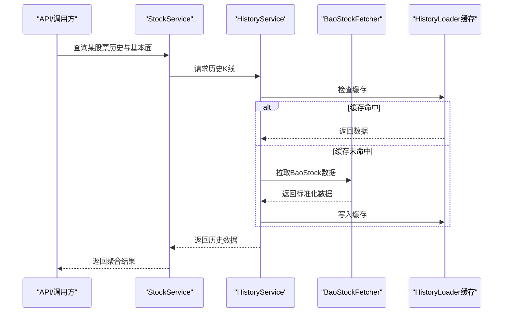
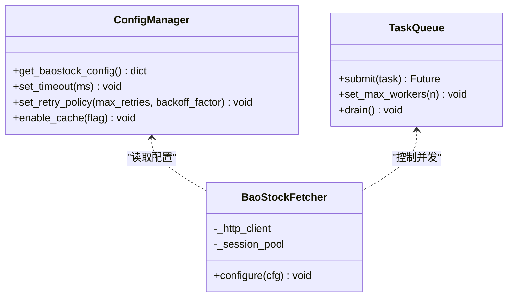
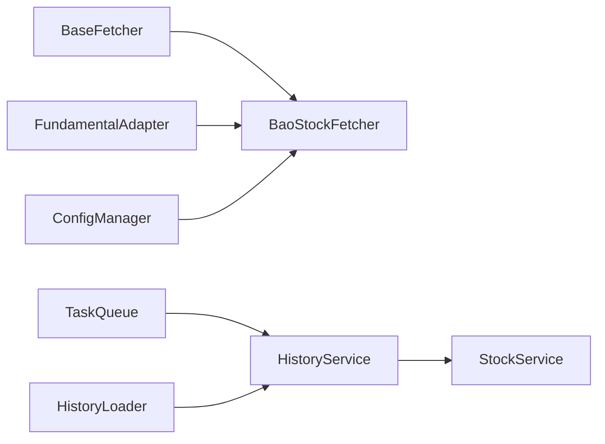

# BaoStock数据源

<cite>
**本文引用的文件**   
- [baostock_fetcher.py](file://data_provider/baostock_fetcher.py)
- [base.py](file://data_provider/base.py)
- [fundamental_adapter.py](file://data_provider/fundamental_adapter.py)
- [history_service.py](file://src/services/history_service.py)
- [history_loader.py](file://src/services/history_loader.py)
- [stock_service.py](file://src/services/stock_service.py)
- [config_manager.py](file://src/core/config_manager.py)
- [task_queue.py](file://src/services/task_queue.py)
- [test_baostock_history_cache.py](file://tests/test_baostock_history_cache.py)
</cite>

## 目录
1. [简介](#简介)
2. [项目结构](#项目结构)
3. [核心组件](#核心组件)
4. [架构总览](#架构总览)
5. [详细组件分析](#详细组件分析)
6. [依赖关系分析](#依赖关系分析)
7. [性能考量](#性能考量)
8. [故障排查指南](#故障排查指南)
9. [结论](#结论)
10. [附录：使用示例与最佳实践](#附录使用示例与最佳实践)

## 简介
本章节面向BaoStock数据源的集成与使用，说明其免费特性、数据覆盖范围与访问限制，并文档化历史K线、除权因子、财务报表等数据的获取实现。同时给出连接池管理、并发控制与数据缓存策略的设计要点，以及批量获取股票数据与数据分析的实际用法建议。

- 免费特性
  - BaoStock提供免费的A股历史行情与部分基本面数据接口，适合个人研究、回测与教学场景。
- 数据覆盖范围
  - 历史K线（日线、周线、月线等）、复权信息（前复权/后复权）、财务指标与报表摘要等。
- 访问限制
  - 免费接口存在频率限制与稳定性约束，建议在应用层做限流、重试与降级处理；避免高频并发请求导致被限流或断连。

[本节不直接分析具体文件，故无“章节来源”]

## 项目结构
本项目将BaoStock作为多数据源之一进行统一抽象与接入，关键位置如下：
- 数据源实现：data_provider/baostock_fetcher.py
- 数据源基类与适配：data_provider/base.py、data_provider/fundamental_adapter.py
- 历史数据服务：src/services/history_service.py、src/services/history_loader.py
- 股票服务与查询：src/services/stock_service.py
- 配置管理：src/core/config_manager.py
- 任务队列与并发控制：src/services/task_queue.py
- 测试用例：tests/test_baostock_history_cache.py

**图表来源**
- [baostock_fetcher.py](file://data_provider/baostock_fetcher.py)
- [base.py](file://data_provider/base.py)
- [fundamental_adapter.py](file://data_provider/fundamental_adapter.py)
- [history_service.py](file://src/services/history_service.py)
- [history_loader.py](file://src/services/history_loader.py)
- [stock_service.py](file://src/services/stock_service.py)
- [config_manager.py](file://src/core/config_manager.py)
- [task_queue.py](file://src/services/task_queue.py)

**章节来源**
- [baostock_fetcher.py](file://data_provider/baostock_fetcher.py)
- [base.py](file://data_provider/base.py)
- [fundamental_adapter.py](file://data_provider/fundamental_adapter.py)
- [history_service.py](file://src/services/history_service.py)
- [history_loader.py](file://src/services/history_loader.py)
- [stock_service.py](file://src/services/stock_service.py)
- [config_manager.py](file://src/core/config_manager.py)
- [task_queue.py](file://src/services/task_queue.py)

## 核心组件
- BaoStockFetcher
  - 封装对BaoStock的调用，提供历史K线、除权因子、财务报表等数据获取能力。
  - 负责字段映射、异常处理与基础重试逻辑。
- FundamentalAdapter
  - 统一不同数据源的基本面数据格式，便于上层服务消费。
- HistoryService / HistoryLoader
  - 历史数据聚合与加载，包含缓存、去重、分页与批处理。
- StockService
  - 面向业务的数据查询入口，组合历史、基本面与实时数据。
- ConfigManager
  - 集中管理数据源开关、超时、重试、限流等配置。
- TaskQueue
  - 控制并发度、任务调度与背压，避免对BaoStock造成过大压力。

**章节来源**
- [baostock_fetcher.py](file://data_provider/baostock_fetcher.py)
- [fundamental_adapter.py](file://data_provider/fundamental_adapter.py)
- [history_service.py](file://src/services/history_service.py)
- [history_loader.py](file://src/services/history_loader.py)
- [stock_service.py](file://src/services/stock_service.py)
- [config_manager.py](file://src/core/config_manager.py)
- [task_queue.py](file://src/services/task_queue.py)

## 架构总览
下图展示从业务调用到BaoStock数据获取的关键路径，包括服务层、数据源与基础设施的交互。

**图表来源**
- [history_service.py](file://src/services/history_service.py)
- [history_loader.py](file://src/services/history_loader.py)
- [baostock_fetcher.py](file://data_provider/baostock_fetcher.py)
- [task_queue.py](file://src/services/task_queue.py)
- [config_manager.py](file://src/core/config_manager.py)

## 详细组件分析

### BaoStockFetcher 组件
- 职责
  - 封装BaoStock的历史K线、除权因子、财务报表等接口调用。
  - 进行字段标准化、错误码识别与重试策略。
- 关键能力
  - 历史K线：支持按日期区间、复权方式拉取。
  - 除权因子：用于复权计算与价格对齐。
  - 财务报表：季度/年度指标与摘要。
- 异常与容错
  - 网络异常、限流、空结果等场景的统一处理。
  - 基于配置的指数退避重试。

**图表来源**
- [baostock_fetcher.py](file://data_provider/baostock_fetcher.py)
- [base.py](file://data_provider/base.py)
- [fundamental_adapter.py](file://data_provider/fundamental_adapter.py)

**章节来源**
- [baostock_fetcher.py](file://data_provider/baostock_fetcher.py)
- [base.py](file://data_provider/base.py)
- [fundamental_adapter.py](file://data_provider/fundamental_adapter.py)

### 历史数据服务与加载器
- HistoryService
  - 协调历史数据获取流程，决定数据来源、缓存策略与批处理。
  - 与TaskQueue协作控制并发，避免对BaoStock造成过载。
- HistoryLoader
  - 实现本地缓存（内存/磁盘）与增量更新，减少重复请求。
  - 提供数据清洗、去重、时间对齐等预处理。

**图表来源**
- [history_service.py](file://src/services/history_service.py)
- [history_loader.py](file://src/services/history_loader.py)
- [task_queue.py](file://src/services/task_queue.py)
- [baostock_fetcher.py](file://data_provider/baostock_fetcher.py)

**章节来源**
- [history_service.py](file://src/services/history_service.py)
- [history_loader.py](file://src/services/history_loader.py)
- [task_queue.py](file://src/services/task_queue.py)
- [baostock_fetcher.py](file://data_provider/baostock_fetcher.py)

### 股票服务与数据聚合
- StockService
  - 对外暴露统一的股票数据查询接口，组合历史、基本面与实时数据。
  - 根据业务需求选择合适的数据源与缓存策略。

**图表来源**
- [stock_service.py](file://src/services/stock_service.py)
- [history_service.py](file://src/services/history_service.py)
- [history_loader.py](file://src/services/history_loader.py)
- [baostock_fetcher.py](file://data_provider/baostock_fetcher.py)

**章节来源**
- [stock_service.py](file://src/services/stock_service.py)
- [history_service.py](file://src/services/history_service.py)
- [history_loader.py](file://src/services/history_loader.py)
- [baostock_fetcher.py](file://data_provider/baostock_fetcher.py)

### 配置管理与连接池
- ConfigManager
  - 集中管理BaoStock相关配置：超时、重试次数、限流阈值、是否启用缓存等。
- 连接池管理
  - BaoStock底层通常通过HTTP或SDK建立连接，建议在Fetcher层维护连接复用与空闲回收。
  - 结合TaskQueue的并发上限，避免过多并发连接导致资源耗尽。

**图表来源**
- [config_manager.py](file://src/core/config_manager.py)
- [task_queue.py](file://src/services/task_queue.py)
- [baostock_fetcher.py](file://data_provider/baostock_fetcher.py)

**章节来源**
- [config_manager.py](file://src/core/config_manager.py)
- [task_queue.py](file://src/services/task_queue.py)
- [baostock_fetcher.py](file://data_provider/baostock_fetcher.py)

## 依赖关系分析
- 组件耦合
  - BaoStockFetcher依赖基础抽象与适配器，降低与具体实现的耦合。
  - HistoryService与HistoryLoader解耦了缓存与拉取逻辑，便于替换与扩展。
- 外部依赖
  - BaoStock SDK/HTTP客户端、缓存存储（内存/磁盘）、任务队列后端。
- 潜在循环依赖
  - 通过分层与服务化避免循环依赖；Fetcher仅向上暴露标准化接口。

**图表来源**
- [base.py](file://data_provider/base.py)
- [baostock_fetcher.py](file://data_provider/baostock_fetcher.py)
- [fundamental_adapter.py](file://data_provider/fundamental_adapter.py)
- [config_manager.py](file://src/core/config_manager.py)
- [task_queue.py](file://src/services/task_queue.py)
- [history_service.py](file://src/services/history_service.py)
- [history_loader.py](file://src/services/history_loader.py)
- [stock_service.py](file://src/services/stock_service.py)

**章节来源**
- [base.py](file://data_provider/base.py)
- [baostock_fetcher.py](file://data_provider/baostock_fetcher.py)
- [fundamental_adapter.py](file://data_provider/fundamental_adapter.py)
- [config_manager.py](file://src/core/config_manager.py)
- [task_queue.py](file://src/services/task_queue.py)
- [history_service.py](file://src/services/history_service.py)
- [history_loader.py](file://src/services/history_loader.py)
- [stock_service.py](file://src/services/stock_service.py)

## 性能考量
- 并发控制
  - 使用TaskQueue限制最大并发数，避免对BaoStock造成瞬时高负载。
  - 合理设置超时与重试，防止慢请求拖垮整体吞吐。
- 数据缓存
  - 在HistoryLoader中实现多级缓存（内存优先、持久化兜底），减少重复请求。
  - 针对热点股票与常用时间窗口优化缓存命中率。
- 批处理与分页
  - 将大批量拉拆分为小批次，降低单次请求体积与失败影响面。
- 连接复用
  - 在Fetcher层复用HTTP会话或连接池，减少握手开销。
- 监控与告警
  - 记录拉取耗时、失败率与限流事件，便于定位瓶颈与调优。

[本节为通用指导，不直接分析具体文件，故无“章节来源”]

## 故障排查指南
- 常见问题
  - 连接超时：检查网络与BaoStock服务状态，适当增加超时与重试次数。
  - 限流被拒：降低并发度，增加退避间隔，必要时排队等待。
  - 数据缺失：确认日期区间与复权方式，校验字段映射是否正确。
  - 缓存不一致：清理缓存或强制刷新，确保数据版本一致。
- 诊断步骤
  - 查看日志中的错误码与堆栈，定位是网络、鉴权还是数据问题。
  - 使用最小可复现案例验证接口可用性。
  - 逐步放宽或收紧并发与超时，观察行为变化。

**章节来源**
- [test_baostock_history_cache.py](file://tests/test_baostock_history_cache.py)

## 结论
BaoStock作为免费数据源，在本项目中通过统一抽象、服务化与缓存策略实现了稳定高效的历史K线、除权因子与财务报表获取。配合连接池管理、并发控制与缓存优化，可在保证可用性的前提下提升吞吐与稳定性。建议在生产环境中持续监控与调优，并根据实际负载调整并发与缓存策略。

[本节为总结性内容，不直接分析具体文件，故无“章节来源”]

## 附录：使用示例与最佳实践
- 批量获取股票数据
  - 使用StockService或HistoryService传入股票代码列表与时间区间，内部自动分批与并发控制。
  - 建议先预热热门股票的缓存，再执行批量拉取。
- 数据分析
  - 获取历史K线与除权因子后进行复权计算，再计算技术指标与统计特征。
  - 财务报表数据可用于基本面筛选与评分模型。
- 最佳实践
  - 合理设置并发与超时，避免对BaoStock造成压力。
  - 使用缓存减少重复请求，提高响应速度。
  - 对异常进行幂等处理与重试，确保数据完整性。

[本节为概念性指导，不直接分析具体文件，故无“章节来源”]