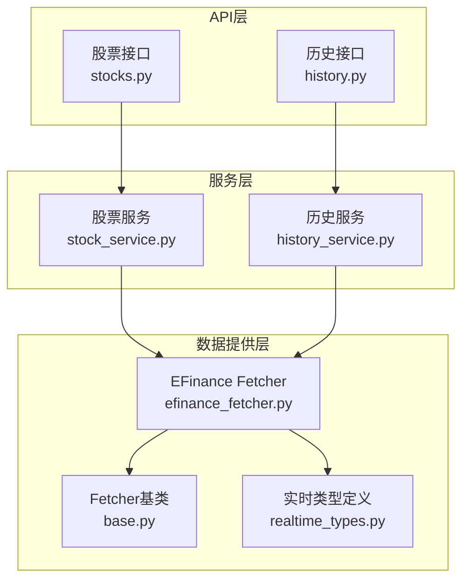
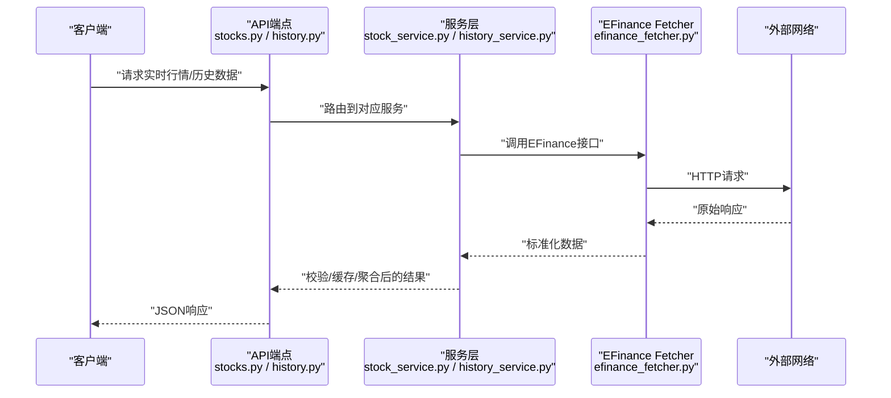
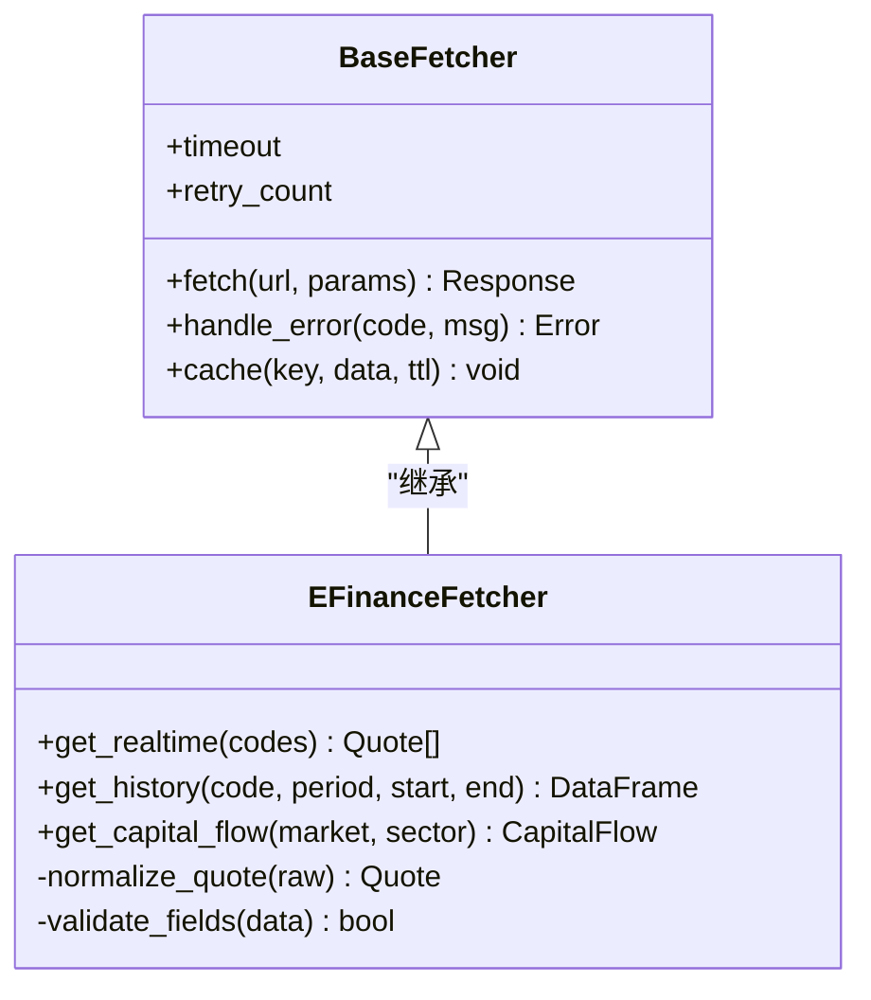
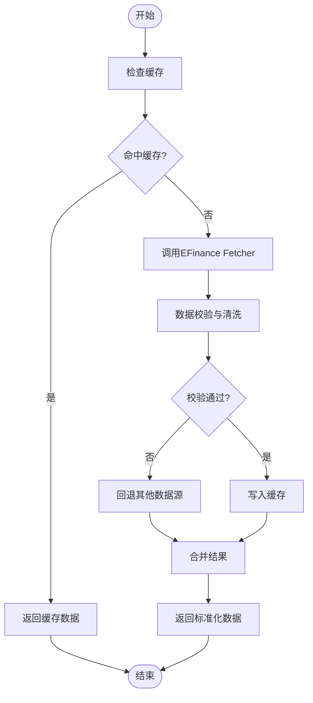
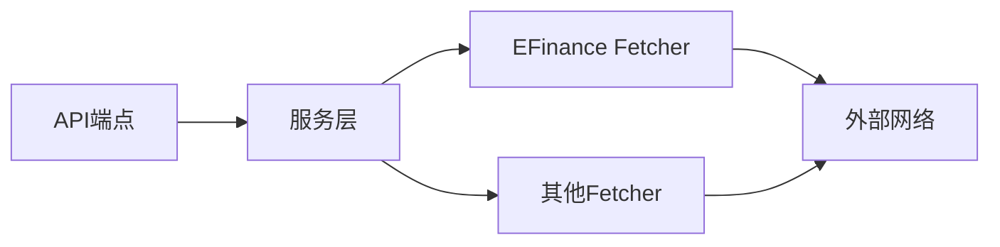

# EFinance数据源

<cite>
**本文引用的文件**   
- [efinance_fetcher.py](file://data_provider/efinance_fetcher.py)
- [base.py](file://data_provider/base.py)
- [realtime_types.py](file://data_provider/realtime_types.py)
- [stocks.py](file://api/v1/endpoints/stocks.py)
- [history.py](file://api/v1/endpoints/history.py)
- [stock_service.py](file://src/services/stock_service.py)
- [history_service.py](file://src/services/history_service.py)
- [test_efinance_main_indices.py](file://tests/test_efinance_main_indices.py)
</cite>

## 目录
1. [简介](#简介)
2. [项目结构](#项目结构)
3. [核心组件](#核心组件)
4. [架构总览](#架构总览)
5. [详细组件分析](#详细组件分析)
6. [依赖关系分析](#依赖关系分析)
7. [性能考虑](#性能考虑)
8. [故障排查指南](#故障排查指南)
9. [结论](#结论)
10. [附录：调用示例](#附录调用示例)

## 简介
本文件面向EFinance数据源的集成与使用，系统性说明其数据特点、接口规范与适用场景，覆盖实时行情、历史交易数据、资金流向等关键能力。文档同时给出异常处理、数据验证与性能调优建议，并提供A股实时行情与历史交易数据的调用示例路径，便于快速上手与排障。

## 项目结构
EFinance数据源位于数据提供层（data_provider），通过统一的Fetchers抽象与API路由暴露给上层服务与前端。核心文件包括：
- 数据获取实现：efinance_fetcher.py
- 基类与通用能力：base.py
- 实时数据类型定义：realtime_types.py
- API端点：stocks.py、history.py
- 业务服务：stock_service.py、history_service.py
- 测试用例：test_efinance_main_indices.py

图表来源
- [efinance_fetcher.py](file://data_provider/efinance_fetcher.py)
- [base.py](file://data_provider/base.py)
- [realtime_types.py](file://data_provider/realtime_types.py)
- [stocks.py](file://api/v1/endpoints/stocks.py)
- [history.py](file://api/v1/endpoints/history.py)
- [stock_service.py](file://src/services/stock_service.py)
- [history_service.py](file://src/services/history_service.py)

章节来源
- [efinance_fetcher.py](file://data_provider/efinance_fetcher.py)
- [base.py](file://data_provider/base.py)
- [realtime_types.py](file://data_provider/realtime_types.py)
- [stocks.py](file://api/v1/endpoints/stocks.py)
- [history.py](file://api/v1/endpoints/history.py)
- [stock_service.py](file://src/services/stock_service.py)
- [history_service.py](file://src/services/history_service.py)

## 核心组件
- EFinance Fetcher：封装对东方财富（EFinance）的HTTP请求、参数构造、响应解析与标准化输出，支持A股实时行情、指数行情、历史K线、资金流向等。
- 基类Fetcher：统一超时、重试、错误码映射、日志记录、缓存策略等横切能力。
- 实时类型：定义实时行情的数据结构与字段校验，确保跨模块一致性。
- API端点：对外暴露REST接口，负责鉴权、入参校验、限流、结果序列化。
- 服务层：聚合多个数据源、编排调用顺序、合并结果、缓存与降级。

章节来源
- [efinance_fetcher.py](file://data_provider/efinance_fetcher.py)
- [base.py](file://data_provider/base.py)
- [realtime_types.py](file://data_provider/realtime_types.py)
- [stocks.py](file://api/v1/endpoints/stocks.py)
- [history.py](file://api/v1/endpoints/history.py)
- [stock_service.py](file://src/services/stock_service.py)
- [history_service.py](file://src/services/history_service.py)

## 架构总览
EFinance数据源在系统中的位置与交互如下：
- 客户端调用API端点（stocks/history）。
- 端点将请求转发至对应服务（stock_service/history_service）。
- 服务根据标的与市场选择合适的数据源（优先EFinance，失败时回退其他源）。
- EFinance Fetcher发起网络请求，解析并标准化数据后返回。
- 服务层进行数据校验、缓存、聚合与错误降级。

图表来源
- [stocks.py](file://api/v1/endpoints/stocks.py)
- [history.py](file://api/v1/endpoints/history.py)
- [stock_service.py](file://src/services/stock_service.py)
- [history_service.py](file://src/services/history_service.py)
- [efinance_fetcher.py](file://data_provider/efinance_fetcher.py)

## 详细组件分析

### EFinance Fetcher 组件
- 功能范围
  - A股实时行情：个股与指数的最新价、涨跌幅、成交量、成交额等。
  - 历史交易数据：日K、周K、月K等多周期，支持复权与区间查询。
  - 资金流向：北向资金、主力资金、行业/概念资金流入流出。
- 数据特点
  - 高时效性：盘中实时更新，适合短线监控与信号触发。
  - 覆盖面广：A股全市场个股与主要指数。
  - 结构化强：字段命名规范，便于下游分析与可视化。
- 接口规范
  - 输入参数：股票代码（含市场前缀）、周期、起止时间、复权方式、分页等。
  - 输出结构：统一字典或Pydantic模型，包含基础信息、价格序列、指标字段。
- 异常处理
  - 网络异常：超时、连接失败、DNS解析错误，自动重试与降级。
  - 业务异常：空数据、字段缺失、格式不合法，抛出明确错误码与提示。
  - 限流保护：429/5xx时退避重试，避免雪崩。
- 数据验证
  - 使用实时类型定义进行字段校验与类型转换。
  - 对关键字段（如时间戳、价格、成交量）进行范围检查与去重。
- 性能优化
  - 连接池与并发控制：限制并发数，复用HTTP连接。
  - 缓存策略：短期热点数据内存缓存，长周期历史数据本地缓存。
  - 增量更新：历史数据按日期增量拉取，减少重复请求。

图表来源
- [base.py](file://data_provider/base.py)
- [efinance_fetcher.py](file://data_provider/efinance_fetcher.py)

章节来源
- [efinance_fetcher.py](file://data_provider/efinance_fetcher.py)
- [base.py](file://data_provider/base.py)

### 实时行情与历史数据服务
- 实时行情服务
  - 聚合多源（EFinance优先，Tencent/AKShare回退）。
  - 批量拉取与去重，保证低延迟与高可用。
  - 缓存最近N条行情，缩短冷启动时间。
- 历史数据服务
  - 支持多种周期与复权模式。
  - 断点续传与增量更新，避免重复计算。
  - 数据清洗：剔除停牌日、异常值填充。

图表来源
- [stock_service.py](file://src/services/stock_service.py)
- [history_service.py](file://src/services/history_service.py)
- [efinance_fetcher.py](file://data_provider/efinance_fetcher.py)

章节来源
- [stock_service.py](file://src/services/stock_service.py)
- [history_service.py](file://src/services/history_service.py)

### API端点与调用契约
- 实时行情接口
  - 方法：GET/POST
  - 路径：/api/v1/stocks/realtime
  - 参数：codes（数组）、fields（可选）
  - 响应：标准化行情列表
- 历史数据接口
  - 方法：GET/POST
  - 路径：/api/v1/history/kline
  - 参数：code、period、start_date、end_date、adjust_type
  - 响应：K线序列（OHLCV+指标）
- 资金流向接口
  - 方法：GET/POST
  - 路径：/api/v1/capital_flow
  - 参数：market、sector、date_range
  - 响应：资金流入流出汇总

章节来源
- [stocks.py](file://api/v1/endpoints/stocks.py)
- [history.py](file://api/v1/endpoints/history.py)

## 依赖关系分析
- 内部依赖
  - EFinance Fetcher依赖基类Fetcher提供的通用能力（超时、重试、缓存）。
  - 服务层依赖多个Fetcher实现，形成“主从”与“回退”机制。
- 外部依赖
  - HTTP客户端库（如requests/httpx）。
  - 第三方数据源（东方财富API）。
- 潜在风险
  - 第三方接口变更导致解析失败。
  - 高频请求触发限流或封禁。
  - 数据字段不一致引发下游错误。

图表来源
- [stocks.py](file://api/v1/endpoints/stocks.py)
- [history.py](file://api/v1/endpoints/history.py)
- [stock_service.py](file://src/services/stock_service.py)
- [history_service.py](file://src/services/history_service.py)
- [efinance_fetcher.py](file://data_provider/efinance_fetcher.py)

章节来源
- [stocks.py](file://api/v1/endpoints/stocks.py)
- [history.py](file://api/v1/endpoints/history.py)
- [stock_service.py](file://src/services/stock_service.py)
- [history_service.py](file://src/services/history_service.py)
- [efinance_fetcher.py](file://data_provider/efinance_fetcher.py)

## 性能考虑
- 连接与并发
  - 使用连接池，合理设置最大连接数与超时。
  - 批量请求合并，减少握手开销。
- 缓存策略
  - 实时行情：L1内存缓存（秒级），L2本地缓存（分钟级）。
  - 历史数据：按日期分片存储，支持增量更新。
- 降级与回退
  - EFinance不可用时自动切换其他数据源。
  - 部分字段缺失时采用默认值或插值填充。
- 监控与告警
  - 记录QPS、延迟、错误率。
  - 对慢查询与失败请求进行告警。

[本节为通用指导，无需特定文件引用]

## 故障排查指南
- 常见问题
  - 网络超时：检查代理、防火墙、DNS解析。
  - 限流429：降低请求频率，增加退避重试。
  - 数据为空：确认代码格式（沪市SH/深市SZ）、交易时段。
  - 字段缺失：核对上游接口变更，更新解析逻辑。
- 定位步骤
  - 查看服务日志中的错误码与堆栈。
  - 使用测试用例验证接口连通性与数据完整性。
  - 对比不同数据源的结果差异，定位问题源。

章节来源
- [test_efinance_main_indices.py](file://tests/test_efinance_main_indices.py)

## 结论
EFinance数据源在本项目中承担A股实时行情与历史数据的核心供给角色，具备高时效、广覆盖、结构化强的特点。通过统一的Fetcher抽象与服务层编排，实现了高可用与易扩展。建议在部署中重点关注限流、缓存与降级策略，并结合监控告警保障稳定性。

[本节为总结性内容，无需特定文件引用]

## 附录：调用示例
- 获取A股实时行情
  - 端点：/api/v1/stocks/realtime
  - 方法：POST
  - 请求体：{ "codes": ["sh600519", "sz000001"], "fields": ["price", "change_pct", "volume"] }
  - 响应：标准化行情列表，包含价格、涨跌幅、成交量等字段。
  - 参考路径：[stocks.py](file://api/v1/endpoints/stocks.py)

- 获取历史交易数据
  - 端点：/api/v1/history/kline
  - 方法：POST
  - 请求体：{ "code": "sh600519", "period": "daily", "start_date": "2024-01-01", "end_date": "2024-01-31", "adjust_type": "forward" }
  - 响应：K线序列（开盘、最高、最低、收盘、成交量、成交额等）。
  - 参考路径：[history.py](file://api/v1/endpoints/history.py)

- 获取资金流向
  - 端点：/api/v1/capital_flow
  - 方法：POST
  - 请求体：{ "market": "a_share", "sector": "technology", "date_range": ["2024-01-01", "2024-01-31"] }
  - 响应：资金流入流出汇总，支持行业/概念维度。
  - 参考路径：[history.py](file://api/v1/endpoints/history.py)

章节来源
- [stocks.py](file://api/v1/endpoints/stocks.py)
- [history.py](file://api/v1/endpoints/history.py)