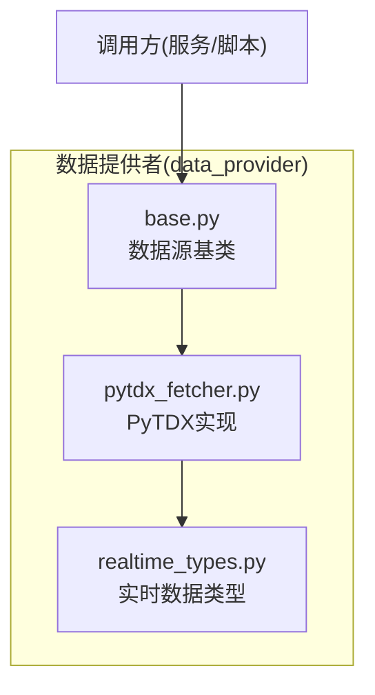
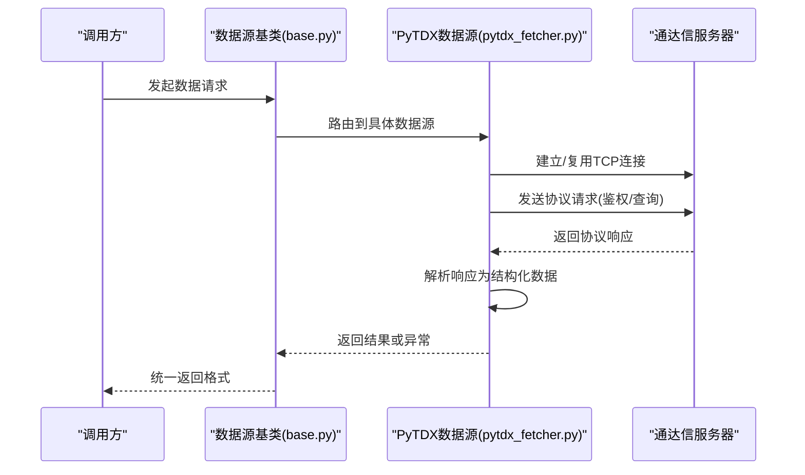
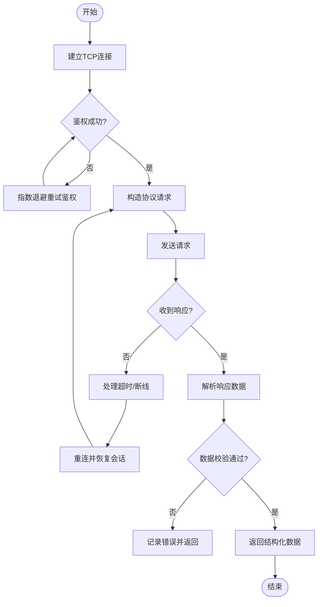
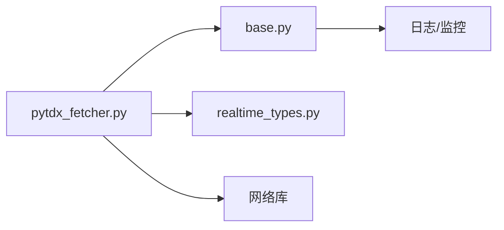

# PyTDX数据源

<cite>
**本文引用的文件**   
- [pytdx_fetcher.py](file://data_provider/pytdx_fetcher.py)
- [base.py](file://data_provider/base.py)
- [realtime_types.py](file://data_provider/realtime_types.py)
</cite>

## 目录
1. [简介](#简介)
2. [项目结构](#项目结构)
3. [核心组件](#核心组件)
4. [架构总览](#架构总览)
5. [详细组件分析](#详细组件分析)
6. [依赖关系分析](#依赖关系分析)
7. [性能考虑](#性能考虑)
8. [故障排查指南](#故障排查指南)
9. [结论](#结论)
10. [附录](#附录)

## 简介
本文件面向PyTDX数据源的实现与使用，聚焦以下目标：
- 底层通信协议、服务器连接与数据格式说明
- Level-1行情、历史分笔、分钟线等高级数据的获取实现
- 连接管理、断线重连与数据同步机制
- 配置指南与使用示例，帮助快速接入高质量A股数据

PyTDX通过通达信客户端提供的私有协议访问A股市场数据。本项目在data_provider模块中提供统一的Fetchers抽象，将不同数据源（包括PyTDX）以一致的接口暴露给上层服务。

## 项目结构
与PyTDX相关的代码主要位于data_provider目录：
- data_provider/pytdx_fetcher.py：PyTDX数据源的具体实现
- data_provider/base.py：数据源基类与通用能力
- data_provider/realtime_types.py：实时行情数据结构定义

图表来源
- [base.py](file://data_provider/base.py)
- [pytdx_fetcher.py](file://data_provider/pytdx_fetcher.py)
- [realtime_types.py](file://data_provider/realtime_types.py)

章节来源
- [pytdx_fetcher.py](file://data_provider/pytdx_fetcher.py)
- [base.py](file://data_provider/base.py)
- [realtime_types.py](file://data_provider/realtime_types.py)

## 核心组件
- 数据源基类（base.py）
  - 定义统一的数据获取接口与通用逻辑（如重试、超时、日志、错误码映射）
  - 为具体数据源（如PyTDX）提供可复用的连接池、限流、指标统计等能力
- PyTDX数据源（pytdx_fetcher.py）
  - 封装通达信私有协议的请求/响应处理
  - 实现Level-1实时行情、历史分笔、分钟K线等数据拉取
  - 负责连接建立、鉴权、心跳保活、断线重连与增量同步
- 实时类型（realtime_types.py）
  - 定义实时行情的结构化字段（如代码、时间戳、买卖盘口、成交明细等）
  - 提供序列化/反序列化工具，便于跨层传递与存储

章节来源
- [base.py](file://data_provider/base.py)
- [pytdx_fetcher.py](file://data_provider/pytdx_fetcher.py)
- [realtime_types.py](file://data_provider/realtime_types.py)

## 架构总览
PyTDX数据源在整体架构中的位置如下：
- 上层服务通过统一的Fetcher接口获取数据
- PyTDX Fetcher内部维护与通达信服务器的TCP连接
- 根据请求类型构造协议报文并发送，解析响应为结构化数据
- 对异常进行捕获与重试，保证稳定性

图表来源
- [base.py](file://data_provider/base.py)
- [pytdx_fetcher.py](file://data_provider/pytdx_fetcher.py)

## 详细组件分析

### PyTDX数据源（pytdx_fetcher.py）
- 职责
  - 管理与通达信服务器的连接生命周期（连接、心跳、断开、重连）
  - 构造并发送协议请求（鉴权、订阅、查询历史与实时数据）
  - 解析协议响应，转换为标准数据结构
  - 处理网络异常、超时、协议错误，执行重试策略
- 关键流程
  - 连接建立：尝试连接服务器，失败则按退避策略重试
  - 鉴权：发送鉴权报文，获取会话令牌
  - 数据拉取：根据请求类型选择对应接口（Level-1、分笔、分钟线）
  - 数据解析：将二进制响应解码为Python对象
  - 错误处理：区分网络错误与业务错误，记录日志并上报

图表来源
- [pytdx_fetcher.py](file://data_provider/pytdx_fetcher.py)

章节来源
- [pytdx_fetcher.py](file://data_provider/pytdx_fetcher.py)

### 数据源基类（base.py）
- 职责
  - 定义统一的Fetcher接口（如get_realtime、get_history、get_tick）
  - 提供通用的重试、超时、限流、缓存、指标统计
  - 抽象错误码映射与日志规范
- 设计要点
  - 通过继承扩展具体数据源实现
  - 支持多数据源切换与降级
  - 提供测试桩与模拟数据能力

章节来源
- [base.py](file://data_provider/base.py)

### 实时类型（realtime_types.py）
- 职责
  - 定义Level-1实时行情字段（代码、时间、价格、成交量、买卖盘口等）
  - 定义历史分笔与分钟K线的字段结构
  - 提供数据转换与校验工具
- 设计要点
  - 字段命名一致，便于跨数据源对齐
  - 支持空值与默认值处理
  - 提供序列化/反序列化方法

章节来源
- [realtime_types.py](file://data_provider/realtime_types.py)

## 依赖关系分析
- 模块内依赖
  - pytdx_fetcher依赖base与realtime_types
  - base为所有数据源提供公共能力
- 外部依赖
  - 通达信客户端SDK或私有协议库（用于TCP通信）
  - 网络库（如socket、requests等，视实现而定）
  - 日志与监控库（用于错误追踪与指标采集）

图表来源
- [pytdx_fetcher.py](file://data_provider/pytdx_fetcher.py)
- [base.py](file://data_provider/base.py)
- [realtime_types.py](file://data_provider/realtime_types.py)

章节来源
- [pytdx_fetcher.py](file://data_provider/pytdx_fetcher.py)
- [base.py](file://data_provider/base.py)
- [realtime_types.py](file://data_provider/realtime_types.py)

## 性能考虑
- 连接复用
  - 使用连接池减少握手开销
  - 合理设置心跳间隔，避免频繁重连
- 并发控制
  - 限制并发请求数，防止触发服务端限流
  - 批量拉取历史数据时采用分页与并行策略
- 缓存策略
  - 对热点数据（如股票列表、基础信息）进行本地缓存
  - 合理设置缓存过期时间，平衡新鲜度与性能
- 错误处理
  - 指数退避重试，避免雪崩
  - 区分网络错误与业务错误，针对性处理

## 故障排查指南
- 常见问题
  - 连接失败：检查服务器地址、端口、防火墙规则
  - 鉴权失败：确认账号权限与密钥配置
  - 数据缺失：核对股票代码、时间范围、数据权限
  - 性能问题：检查并发设置、缓存命中率、网络延迟
- 调试建议
  - 开启详细日志，记录请求/响应报文
  - 使用抓包工具分析协议交互
  - 逐步缩小问题范围（单只股票、短时间窗口）

## 结论
PyTDX数据源在本项目中通过统一的Fetcher接口暴露，屏蔽了底层协议细节，提供了稳定的A股数据获取能力。通过合理的连接管理、错误处理与性能优化，能够满足高频、高可用的数据需求。建议在生产环境中结合监控与告警，持续优化稳定性与性能。

## 附录
- 配置项建议
  - 服务器地址与端口
  - 鉴权凭据（账号、密钥）
  - 连接超时与重试参数
  - 并发与缓存配置
- 使用示例
  - 初始化数据源实例
  - 获取Level-1实时行情
  - 拉取历史分笔与分钟K线
  - 处理异常与重试